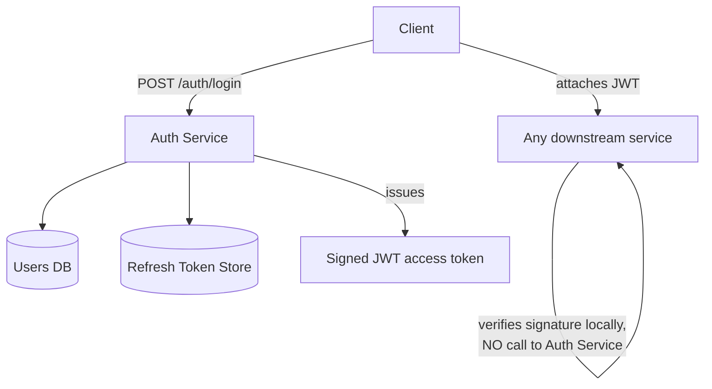

# Architecture Atlas: Authentication Service

**Delivered as a timed, 45-minute exercise using [System Design Method and Estimation](../syllabus/11-system-design/system-design-method-and-estimation.md)'s six-phase method.**

## Table of Contents

1. [Problem Statement](#problem-statement)
2. [Constraints](#constraints)
3. [Functional Requirements](#functional-requirements)
4. [Non-Functional Requirements](#non-functional-requirements)
5. [Capacity Assumptions](#capacity-assumptions)
6. [Architecture Diagram](#architecture-diagram)
7. [Data Model](#data-model)
8. [APIs](#apis)
9. [Request Flow](#request-flow)
10. [Consistency Model](#consistency-model)
11. [Scaling Strategy](#scaling-strategy)
12. [Reliability Strategy](#reliability-strategy)
13. [Security, Observability, and Cost](#security-observability-and-cost)
14. [Trade-offs](#trade-offs)
15. [Alternatives Considered](#alternatives-considered)
16. [Staff-Level Discussion](#staff-level-discussion)
17. [Interview Presentation Sequence](#interview-presentation-sequence)

---

## Problem Statement

Design a service that issues access and refresh tokens after credential verification, validates tokens for other services, and supports logout — a system where token *issuance* is low-volume (one per login) but token *validation* is extremely high-volume (every request to every downstream service).

## Constraints

**In scope:** credential verification, token issuance, token validation, logout. **Explicitly out of scope for this exercise:** social login providers and MFA implementation details — each is a substantial extension, and naming them as deliberately excluded is itself part of a strong Phase 1 answer.

## Functional Requirements

- Verify credentials and issue an access token and a refresh token on login.
- Allow any downstream service to validate an access token.
- Support refreshing an access token using a refresh token.
- Support logout, invalidating the refresh token.

## Non-Functional Requirements

- Token issuance can tolerate a database round-trip; token validation cannot — it happens on nearly every platform request and must be cheap.
- Access tokens must be revocable in the sense that a compromised token's blast radius is bounded (short expiry), even though the format itself can't be revoked instantly at scale.
- Key rotation must be operationally possible without breaking already-issued, still-valid tokens.

## Capacity Assumptions

```
Assumption: 2M logins/day -> token issuance average QPS ~= 23/s, peak (3x) ~= 69/s
Assumption: every downstream request validates a token; total platform
            traffic is ~50,000 QPS peak (matching a typical high-traffic
            platform's read load)
Token VALIDATION load ~= 50,000/s -- roughly 700x the issuance load.

This asymmetry is the single number that should drive the whole design:
issuance can afford a database round-trip; validation cannot.
```

## Architecture Diagram



**Justified against the capacity numbers:** the 700x validation-to-issuance ratio is why downstream services verify the JWT's signature locally (shared secret or the auth service's public key) rather than calling back on every request — a synchronous validation call at 50,000 QPS would make the auth service an availability-critical bottleneck for the whole platform, whereas local signature verification is pure CPU with no network dependency.

## Data Model

**Users/credentials:** relational, strongly consistent. **Refresh tokens:** relational or key-value, with the ability to invalidate on logout — this is the same stateful-check pattern idempotency mechanisms need, applied to token revocation. **Access tokens:** not stored at all — a JWT's whole design point is that validating it requires no storage lookup.

## APIs

```
POST /auth/login        {username, password} -> {accessToken, refreshToken}
POST /auth/refresh       {refreshToken} -> {accessToken}
POST /auth/logout        {refreshToken} -> 204
(validation is NOT a network call downstream services make per-request --
see Architecture Diagram)
```

## Request Flow

1. A client logs in with credentials; the Auth Service verifies against the Users DB, issues a signed JWT access token and a refresh token (recorded in the Refresh Token Store).
2. The client attaches the JWT to every subsequent request to any downstream service.
3. Each downstream service verifies the JWT's signature locally — no call back to the Auth Service.
4. When the access token expires, the client calls `/auth/refresh` with the refresh token to get a new access token, at which point the Refresh Token Store is checked (the one point where a revocation actually takes effect).

## Consistency Model

User credentials and refresh tokens are strongly consistent — a logout must reliably invalidate the refresh token, and a credential change must be reliably reflected on the next login attempt. Access tokens are, by design, not consistency-checked at all on validation — the JWT signature is the only check, which is precisely why the design accepts a bounded revocation gap (see Reliability Strategy) in exchange for eliminating a synchronous consistency dependency on every request.

## Scaling Strategy

The core scaling decision is asymmetric: issuance (low volume) is allowed a database round-trip; validation (700x higher volume) is not, and instead scales via local, stateless signature verification with zero network dependency per validation. This is the single decision that lets the far more common operation (validation) scale independently of the Auth Service's own capacity.

## Reliability Strategy

1. **Refresh-token store at scale.** Comparatively low volume (one refresh per expiry window, not per request), so a standard relational store with an index on the token handles it easily — not every component needs the same scaling treatment as the highest-volume path.
2. **Revocation gap.** Per [OAuth2, OIDC, and JWT](../syllabus/12-security/oauth2-oidc-and-jwt.md), a compromised access token stays valid until expiry — mitigated by short access-token expiry (minutes), with the expensive, revocable check (refresh-token validity) only at the much-lower-volume refresh step.
3. **Key rotation.** If the signing key is compromised, every downstream service verifying locally needs the new key distributed before old-key-signed tokens can be rejected — a real operational bottleneck (key distribution latency), not something the JWT format itself solves.

## Security, Observability, and Cost

Partially addressed by design (short-lived access tokens, revocable refresh tokens, local signature verification with no shared secret over the network), but rate limiting on the login endpoint, brute-force/credential-stuffing protection, and full audit logging of authentication events were not covered in this 45-minute exercise. Observability (login failure rate, token validation error rate by downstream service, key-rotation propagation lag) and cost modeling were also out of scope. These are flagged here as explicit gaps rather than invented to fill out the template.

## Trade-offs

| Decision | Benefit | Cost |
|---|---|---|
| Local JWT signature verification, no call to Auth Service | Validation scales independently at 700x issuance volume, zero network dependency | A compromised token stays valid until expiry — no instant revocation |
| Short access-token expiry | Bounds the blast radius of a compromised token | More frequent refresh calls, more load on the refresh path |
| Refresh tokens stored and checkable | Enables real revocation at logout | The one remaining stateful check in an otherwise stateless validation path |

## Alternatives Considered

- **Validating every access token against the Auth Service (a synchronous call per request).** Rejected: at 50,000 QPS of validation traffic, this makes the Auth Service an availability-critical single point of failure for the entire platform, and adds a network round-trip to every downstream request.
- **Long-lived access tokens with no refresh flow.** Rejected: this widens the revocation gap unacceptably — a compromised token would stay valid for the token's full (long) lifetime rather than a bounded, short window.

## Staff-Level Discussion

The 700x issuance-to-validation asymmetry is the load-bearing number in this entire design, and recognizing it early (Phase 2) is what makes the local-verification architecture decision (Phase 5) look inevitable rather than clever. This generalizes: any system with a large asymmetry between how often something is written/issued and how often it's read/checked should treat the read/check path as the one that actually needs to scale, and should be willing to accept real trade-offs (here, a bounded revocation gap) to keep that path cheap. The key-rotation bottleneck is also worth surfacing unprompted — it's an operational concern that doesn't show up in a QPS estimate at all, and naming it anyway is exactly the kind of judgment a Staff-level answer should demonstrate.

## Interview Presentation Sequence

Delivered as a timed, 45-minute exercise using the six-phase method's own stated budget — see [Time-Boxing and Mid-Round Changes](../syllabus/20-interview-preparation/system-design/time-boxing-and-mid-round-changes.md) for the live-delivery discipline of running this inside the clock. A self-verification exit check for this specific problem: all six phases completed within 45 minutes; the issuance-vs-validation asymmetry stated explicitly and traced through to the local-verification architecture decision; the revocation gap named as a bottleneck, not glossed over; and key rotation named as a real operational bottleneck in its own right.
