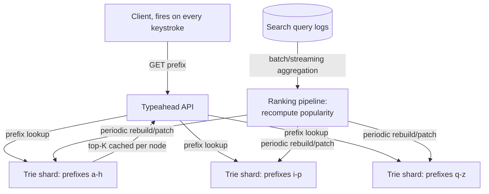

# Architecture Atlas: Autocomplete/Typeahead System

> **Sourcing note:** new, original content, added 2026-09-11 as the fourth and last entry in the Architecture Atlas follow-up set alongside [Video Streaming Platform](video-streaming-platform.md), [Distributed File Storage System](distributed-file-storage-system.md), and [Web Crawler System](web-crawler-system.md) — this closes the audit's own "web crawler/autocomplete" gap item in full, having deliberately split it into two genuinely different problems rather than force-fitting them into one entry (see [Web Crawler System](web-crawler-system.md)'s own sourcing note). Like the three entries before it, this is additive beyond the Atlas's own closed T-813 target, not a reopening of it.

**Delivered as a timed, 45-minute exercise using [System Design Method and Estimation](../syllabus/11-system-design/system-design-method-and-estimation.md)'s six-phase method.**

## Table of Contents

1. [Problem Statement](#problem-statement)
2. [Constraints](#constraints)
3. [Functional Requirements](#functional-requirements)
4. [Non-Functional Requirements](#non-functional-requirements)
5. [Capacity Assumptions](#capacity-assumptions)
6. [Architecture Diagram](#architecture-diagram)
7. [Data Model](#data-model)
8. [APIs](#apis)
9. [Request Flow](#request-flow)
10. [Consistency Model](#consistency-model)
11. [Scaling Strategy](#scaling-strategy)
12. [Reliability Strategy](#reliability-strategy)
13. [Security, Observability, and Cost](#security-observability-and-cost)
14. [Trade-offs](#trade-offs)
15. [Alternatives Considered](#alternatives-considered)
16. [Staff-Level Discussion](#staff-level-discussion)
17. [Interview Presentation Sequence](#interview-presentation-sequence)

---

## Problem Statement

Design an autocomplete/typeahead system: given a partial query string typed so far, return the top-K most likely completions, ranked by popularity, within tens of milliseconds — fast enough to update on every keystroke without visibly lagging the user. The central tension is that fast *prefix matching* (finding every completion starting with a given prefix) and fast *ranked* retrieval (returning only the top-K by popularity, not all of them) are two different problems, and a design that solves only the first — a plain trie walk followed by a sort — is too slow for the read path at the latency this problem actually demands; the real design work is precomputing rank so the read path never has to compute it live.

## Constraints

**In scope:** returning the top-K completions for a given prefix, ranked by historical query popularity, updated periodically as popularity shifts over time. **Explicitly out of scope:** per-user personalization (ranking completions differently per user based on their own history) and locale/language-specific ranking variants — both real, valuable extensions, but each a genuinely separate ranking-model problem layered on top of this design's core prefix-and-popularity mechanism, not a core requirement of it. Naming these exclusions explicitly is itself part of a strong Phase 1 answer, since a design that silently assumes uniform, global ranking is answering a simpler, different question than one that promises personalization without saying so.

## Functional Requirements

- Given a prefix string, return the top-K (typically 5-10) most popular completions starting with that prefix.
- Results must reflect real query popularity, not just alphabetical or insertion order.
- Popularity rankings must update over time as query patterns shift (a newly trending term should eventually surface; a fading one should eventually drop).
- The system must handle a prefix with zero, few, or millions of possible completions equally gracefully.

## Non-Functional Requirements

- End-to-end latency per keystroke must stay in the tens-of-milliseconds range — this is the single most binding constraint on this design, since a perceptibly laggy typeahead is worse than no typeahead at all.
- The system must handle load proportional to *every keystroke* of every active search session, not just completed searches — a materially higher request volume than the search system it feeds into.
- Ranking data can be minutes-to-hours stale without being a real problem; the read path's latency cannot be compromised in exchange for fresher rankings.
- Memory footprint must stay bounded and predictable even as the historical query corpus grows into the hundreds of millions of distinct strings.

## Capacity Assumptions

```
Assumption: 500 million distinct historical query strings, average
            length 20 characters
Assumption: 50,000 completed searches/second at peak, each search
            averaging ~15 keystrokes before the user either selects
            a suggestion or finishes typing -> ~750,000 typeahead
            requests/second at peak -- roughly 15x the completed-
            search rate, the real, quantified reason this system's
            read-path load is dominated by keystrokes, not searches
Assumption: storing the precomputed top-5 completions at every trie
            node (string + score, ~30 bytes each) adds ~150 bytes
            of cached ranking data per node on top of the node's own
            structure -- for a trie with ~50 million internal nodes
            (a real, common order of magnitude for a corpus this
            size, since shared prefixes collapse many strings into
            far fewer nodes), that is ~7.5GB of cached top-K data,
            comfortably fittable in memory on a modest number of
            machines
Assumption: popularity-ranking updates computed from search logs
            in a batch/streaming pipeline every few minutes, not
            per-query -- decoupling the ranking-computation cost
            entirely from the read path's own latency budget

The ~15x multiplier between completed searches and actual typeahead
requests is the single number that reframes this problem: this is a
much higher-QPS, much-more-latency-sensitive system than the search
system it feeds into, even though it serves a strictly smaller,
simpler query (a prefix, not a full-text query).
```

## Architecture Diagram



**Justified against this design's own topics:**

- **Each trie node caches its own precomputed top-K completions** (per [Tries and Prefix Structures](../syllabus/03-data-structures-algorithms/tries-and-prefix-structures.md)'s own prefix-matching mechanics, combined with the "keep only the top-K, not everything" bounded-heap technique [Heaps, Top-K, and K-Way Merge](../syllabus/03-data-structures-algorithms/heaps-top-k-and-k-way-merge.md) covers generally) — this is the direct, load-bearing answer to the latency requirement: a lookup for any prefix is a single trie descent followed by reading an already-computed list, never a live scan-and-rank of every completion under that prefix.
- **The trie is sharded by prefix** (consistent hashing over the first character or first few characters, per [Data Partitioning and Consistent Hashing](../syllabus/10-distributed-systems/data-partitioning-and-consistent-hashing.md)) — necessary once the full trie's memory footprint (per the Capacity Assumptions) exceeds what a single machine can hold, or once read QPS exceeds what a single machine can serve.
- **Ranking is computed by a separate, periodic offline pipeline, not synchronously per query** — the same asynchronous-ingest-pipeline pattern this Atlas's [Web Crawler System](web-crawler-system.md) and [Video Streaming Platform](video-streaming-platform.md) entries both establish: whatever is slow and can tolerate staleness (here, popularity ranking) is decoupled from whatever must stay fast (here, the actual prefix lookup).

## Data Model

**Trie node:** children (keyed by next character), a flag marking whether this node terminates a complete query string, and a cached, precomputed list of the top-K completions reachable from this node (each entry: the completion string and its popularity score). **Query log entry (write-side, feeding the ranking pipeline):** the searched string, a timestamp, and enough context (user or session ID, if personalization is layered on later) to compute aggregate popularity over a rolling time window.

## APIs

```
GET /typeahead?prefix={p}&k=5
  -> 200 {completions: [{text, score}, ...]}   (already-ranked, top-K,
                                                 read directly from the
                                                 matched trie node's
                                                 cached list)

POST /search-logged   (internal, fire-and-forget from the search
                       system itself once a query completes)
  {query, timestamp, ...}
  -> 202 Accepted
```

## Request Flow

**Read (the hot path, fired on every keystroke):** (1) the client sends the current prefix; (2) the API routes to the trie shard owning that prefix; (3) the shard descends the trie character-by-character to the node matching the full prefix; (4) that node's already-cached top-K list is returned directly — no scanning, no live ranking computation. **Write (the cold path, fully decoupled):** (1) completed searches are logged asynchronously; (2) a periodic (e.g., every few minutes) batch or streaming job aggregates recent query logs into updated popularity scores; (3) the ranking pipeline recomputes (or incrementally patches) each affected trie node's cached top-K list; (4) updated tries (or updated nodes) are rolled out to the serving shards, replacing the previous ranking data.

## Consistency Model

This design is deliberately, explicitly stale-tolerant on the ranking side and irrelevant-to-consistency on the prefix-matching side: prefix matching itself has no consistency question at all (a given trie structure either contains a string or it doesn't, with no concurrent-write ambiguity on the read path, since writes happen only via the separate, periodic rebuild pipeline); **popularity ranking is eventually consistent**, on the order of the ranking pipeline's own refresh interval (minutes, per the Capacity Assumptions) — a genuinely trending-right-now term may take that long to visibly rise in rankings, a real, explicitly accepted trade for keeping the read path's own latency completely unaffected by ranking freshness.

## Scaling Strategy

The read path scales by adding more trie shards (per prefix-range sharding) and more replicas of each shard, since a read is a fast, local, in-memory trie descent with no cross-shard coordination needed for a single prefix. The ranking pipeline scales independently, as a batch/streaming aggregation job over search logs — its own throughput requirement (processing completed searches, not raw keystrokes) is, per the Capacity Assumptions' own ~15x figure, an order of magnitude smaller than the read path's, and it can be scaled and tuned entirely separately.

## Reliability Strategy

1. **A single trie shard's failure must not take down prefix lookups for other shards** — per-shard replication (multiple read replicas per prefix range) means a shard failure degrades only that specific prefix range's availability, not the whole system's, and only briefly until a replica takes over.
2. **A stale or failed ranking pipeline run must not break the read path** — since the read path only ever reads whatever ranking data is currently loaded, a delayed or failed pipeline run simply means rankings stay at their last-known-good state longer than intended; it never causes a read-path outage or error, only staler-than-usual results.
3. **A newly trending term with almost no query history yet** is a real, named edge case — this design's top-K caching, by construction, only surfaces terms popular enough to make a node's cached list, so a genuinely brand-new term won't appear until the next ranking pipeline run has enough signal to rank it; this is a real, accepted limitation of a popularity-driven design, not a bug.

## Security, Observability, and Cost

**Security:** query logs feeding the ranking pipeline are a real, potential source of sensitive data leakage (a search prefix can itself be sensitive) — the ranking pipeline's aggregation step should operate on aggregate counts, never expose raw per-user query strings back through the typeahead API itself. **Observability:** p99 read latency (the single most important metric given this design's own binding non-functional requirement) and ranking-pipeline freshness (time since last successful rebuild) are the two most operationally load-bearing signals — a growing gap in either indicates a real, developing problem before users perceive lag or stale suggestions. **Cost:** the read path's memory footprint (per the Capacity Assumptions, ~7.5GB of cached ranking data alone, before the trie structure itself) is the dominant real cost driver, directly proportional to corpus size and top-K breadth — a real, quantified reason K is chosen deliberately (5-10, not 100) rather than maximized.

## Trade-offs

| Decision | Benefit | Cost |
|---|---|---|
| Precomputed top-K cached per trie node | Read latency is a single trie descent, independent of how many completions exist under a prefix | Real memory cost proportional to corpus size x K; ranking updates require recomputing cached lists |
| Prefix-sharded trie | Read throughput and memory both scale by adding shards | Cross-shard prefix boundaries need careful, consistent-hash-based routing |
| Asynchronous, periodic ranking pipeline | Read-path latency is completely decoupled from ranking-computation cost | Real, bounded staleness — a newly trending term takes real time to surface |
| Global, non-personalized ranking (per Constraints) | A much simpler design and data model | No per-user relevance — every user with the same prefix sees identical suggestions |

## Alternatives Considered

- **A live, on-demand trie scan and sort for every prefix query, with no precomputed top-K.** Rejected: directly violates the latency non-functional requirement — a popular prefix with millions of completions would require scanning and ranking all of them on every single keystroke, an unbounded, unacceptable cost at this design's real QPS.
- **Updating trie ranking synchronously, on every completed search.** Rejected: couples the read path's performance to the write path's load, and at the real ~15x keystroke-to-search multiplier from the Capacity Assumptions, a synchronous update model would need to keep up with a write rate the design has no actual latency requirement demanding — periodic batch/streaming decoupling is strictly better here.
- **A single, unsharded trie held entirely in one machine's memory.** Rejected at this design's real target scale (hundreds of millions of distinct query strings): the Capacity Assumptions' own memory math shows a real, practical ceiling a single machine would hit well before this corpus size, forcing sharding regardless.

## Staff-Level Discussion

The single most instructive decision in this design is recognizing that "fast prefix matching" and "fast ranked retrieval" are two genuinely different problems that a naive design conflates — and that the fix isn't a cleverer live-ranking algorithm, it's moving the ranking computation entirely out of the read path via precomputation, accepting real, bounded staleness as the necessary cost. A Staff engineer's value here is recognizing this general pattern (precompute and cache whatever's expensive to rank, refresh it asynchronously, and let the read path only ever do cheap lookups) as broadly reusable across many "fast ranked retrieval at scale" problems, not something specific to autocomplete — and correctly identifying, for any specific system, exactly which computation is safe to move off the hot path and how stale its result can tolerably be.

## Interview Presentation Sequence

Delivered as a timed, 45-minute exercise using the six-phase method's own stated budget — see [System Design Narration and Whiteboard Discipline](../syllabus/20-interview-preparation/system-design/system-design-narration-and-whiteboard-discipline.md) for sequencing the diagram (the precomputed-top-K-per-node idea first, since it's this design's own central answer to the latency requirement; prefix sharding next, as the direct scaling consequence; the asynchronous ranking pipeline last, as the explicitly decoupled write path). A self-verification exit check for this specific problem: the prefix-matching-versus-ranked-retrieval distinction named explicitly as the design's actual central tension, not glossed over as "just use a trie"; the real ~15x keystroke-to-search multiplier stated with numbers, not asserted as "typeahead gets a lot of traffic"; ranking staleness stated as a deliberate, bounded, accepted trade, not hidden; and personalization's exclusion stated up front as a scoping decision, not discovered mid-design.
