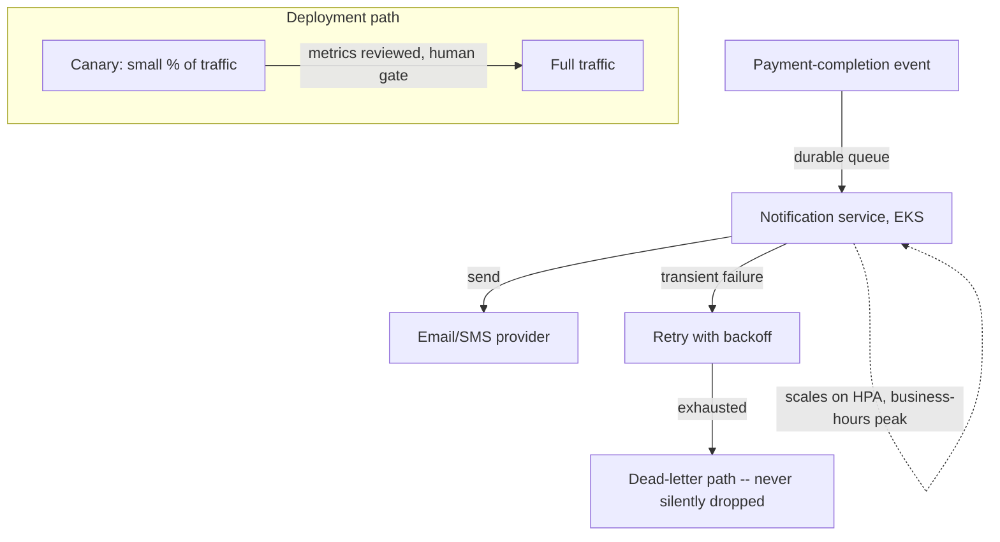

# Architecture Atlas: Deployment Infrastructure for a Payments Notification Service

**Delivered as a timed, 45-minute exercise applying this week's five topics (compute selection, resource limits/probes, messaging durability, cost economics, deployment strategy) rather than the full six-phase system-design method — a deployment-strategy review, not a request/response system design. This entry adapts the Atlas template accordingly: no data model, API surface, or consistency model sections, since none apply to an infrastructure/deployment decision.**

## Table of Contents

1. [Problem Statement](#problem-statement)
2. [Constraints](#constraints)
3. [Design Dimensions](#design-dimensions)
4. [Reference Analysis](#reference-analysis)
5. [Deployment Flow Diagram](#deployment-flow-diagram)
6. [Trade-offs](#trade-offs)
7. [Alternatives Considered](#alternatives-considered)
8. [Staff-Level Discussion](#staff-level-discussion)
9. [Interview Presentation Sequence](#interview-presentation-sequence)

---

## Problem Statement

Design the full infrastructure and deployment strategy for a new service that consumes payment-completion events and sends transactional email/SMS notifications. Every notification must have a durable, retryable delivery path — a failure that silently drops a customer notification is unacceptable — and the team is explicitly risk-averse about releases, since this is a highly visible, customer-facing path.

## Constraints

- Low-latency processing (customers expect near-immediate notification).
- Strong daily traffic pattern: ~10x higher volume during business hours than overnight.
- A notification failure must never be silently dropped.
- The team is risk-averse about deployments given the customer-visible blast radius of a bad release.
- The team already runs other services on Kubernetes (EKS) and wants platform consistency.

## Design Dimensions

1. Compute placement, relative to the EC2/ECS/EKS/Lambda spectrum.
2. Resource limits and JVM sizing, if this is a JVM service.
3. Messaging: how payment-completion events reach this service without silent loss on failure.
4. Scaling economics, given the strong daily traffic pattern.
5. Deployment strategy, given the team's risk-aversion.

## Reference Analysis

**Compute.** EKS, consistent with the team's existing platform per the stated constraint — Kubernetes gives a uniform operational model across services, and this workload (a long-running event consumer, not a short-lived, bursty function) doesn't have the request-driven shape that would make Lambda's lower operational-ownership cost worth the trade-off, per [AWS Core Services for Backend Engineers](../handbook/cloud/aws-core-services-for-backend-engineers.md)'s compute spectrum.

**Resource limits and JVM sizing.** Set `resources.requests` and `resources.limits` for memory to the same value — predictable scheduling, no throttling or OOMKill surprises — sized with explicit accounting for both the container-aware ergonomic heap default *and* non-heap memory (metaspace, thread stacks, any message-broker client library's buffer pools), not heap alone, per [Kubernetes Resource Limits, Probes, and JVM Sizing](../handbook/cloud/kubernetes-resource-limits-probes-and-jvm-sizing.md). Probe design follows the same chapter's discipline: a `readinessProbe` confirming genuine ability to process (the message-consumer connection is actually established, not just that the HTTP server answers) so the pod isn't routed traffic before it's truly ready; a `livenessProbe` targeting genuine deadlock/hang conditions specifically, not transient slowness that would trigger an unnecessary restart; a `startupProbe` if JVM startup (context initialization, connection establishment) is slow enough to risk a premature liveness-triggered kill.

**Messaging.** A durable queue or topic carries the payment-completion event to this service, with processing wrapped in retry-with-backoff for transient send failures (the email/SMS provider being briefly unavailable) and a dead-letter path for events that exhaust retries — a notification failure is explicitly parked for investigation, never silently dropped. This is the SQS-style durable, point-to-point delivery pattern from [AWS Core Services for Backend Engineers](../handbook/cloud/aws-core-services-for-backend-engineers.md), chosen specifically because "never silently drop" needs a durable queue's redelivery guarantee, not a fire-and-forget call.

**Scaling economics.** The strong 10x daily peak/trough pattern is exactly the demand shape [Cloud Cost and Scaling Economics](../handbook/cloud/cloud-cost-and-scaling-economics.md) identifies as favoring autoscaling over static peak-provisioning — reserve (or commit to) only the confirmed steady overnight-trough baseline, and let a Horizontal Pod Autoscaler scale up for business-hours peak on on-demand capacity, rather than statically provisioning for peak around the clock. That chapter's own worked arithmetic shows static peak-provisioning can waste over half the fleet's cost for a demand shape this lopsided.

**Deployment strategy.** Canary, given the team's explicit risk-aversion and the customer-visible nature of a bad release: deploy to a small percentage of traffic first, monitor real delivery-success-rate and latency metrics for a defined window, and require an explicit human approval gate before promoting to full traffic. Per [CI/CD Pipeline Design and Deployment Strategies](../handbook/cloud/cicd-pipeline-design-and-deployment-strategies.md), "no alert fired" during a canary window is weaker evidence than an engineer actually reviewing the canary's metrics before a customer-facing release reaches every customer — the gate should be a review step, not a passive timer.

## Deployment Flow Diagram

## Trade-offs

| Decision | Benefit | Cost |
|---|---|---|
| EKS over Lambda | Platform consistency, no cold-start concern for a long-running consumer | Full operational ownership of the container/cluster layer |
| Autoscaling the peak, reserving only the trough | Avoids paying the committed rate for capacity idle most of the day | More operational complexity than a single static fleet size |
| Canary with a human approval gate | Catches a bad release before it reaches every customer | Slower time-to-full-deploy than an automated, ungated rollout |

## Alternatives Considered

- **Lambda for the consumer.** Rejected: this is a long-running, connection-holding event consumer, not a short-lived, bursty request handler — Lambda's execution-time limits and cold-start latency provide no benefit here and would complicate the durable-consumption model.
- **Statically provisioning for peak, 24/7.** Rejected: the measured 10x peak/trough gap makes this a real, quantifiable cost mistake per this week's cost-economics chapter — the same arithmetic used in [Cloud Cost and Scaling Economics](../handbook/cloud/cloud-cost-and-scaling-economics.md)'s worked calculations applies directly.
- **A fully automated rollout with no human gate, relying only on alerting.** Rejected given the team's explicit risk-aversion and the customer-visible blast radius — an alert firing after a bad release has already reached meaningful traffic is a materially worse failure mode than a human reviewing canary metrics before promotion.

## Staff-Level Discussion

Every decision in this design traces back to one of two explicitly stated constraints — "never silently drop a notification" and "the team is risk-averse about deployments" — rather than a generic best-practices checklist applied uniformly. A Staff engineer treats infrastructure decisions the same way: the durable-queue-plus-dead-letter-path choice exists specifically because of the stated no-silent-drop requirement, and the canary-with-human-gate choice exists specifically because of the stated risk-aversion, not because "canary is generally good practice." A design that reaches the same conclusions without being able to trace each one back to a specific stated requirement is reciting infrastructure patterns, not actually designing for this service's real constraints.

## Interview Presentation Sequence

Present in the order the five design dimensions were posed: compute placement first (it constrains everything downstream), then resource/probe sizing, then the messaging durability guarantee, then the cost-shape-driven scaling decision, then the deployment-strategy gate. A self-verification exit check for this specific exercise: named a specific compute choice justified against the actual workload shape (not "Kubernetes because that's what we use"); addressed both `requests`/`limits` sizing *and* probe configuration, not just one; named a specific durable-delivery mechanism with its dead-letter/retry path, not just "use a queue"; connected the daily traffic pattern explicitly to an autoscaling-over-static-provisioning recommendation with the reasoning stated, not just the conclusion; proposed canary with an explicit human approval gate, not "canary" alone as an unexplained buzzword.
