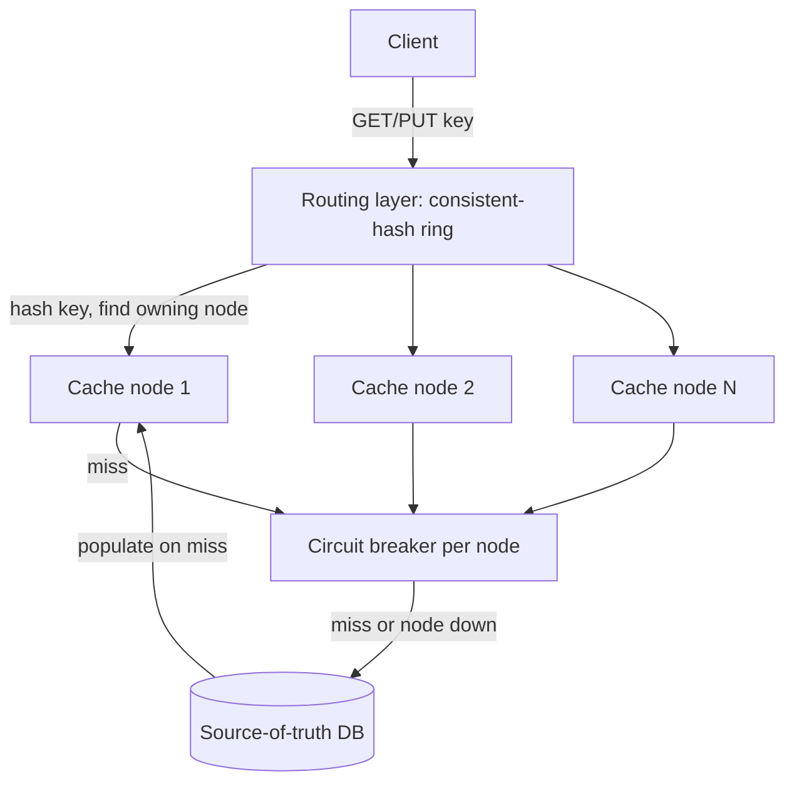

# Architecture Atlas: Distributed Cache

**Delivered as a timed, 45-60 minute exercise using [System Design Method and Estimation](../syllabus/11-system-design/system-design-method-and-estimation.md)'s six-phase method.**

## Table of Contents

1. [Problem Statement](#problem-statement)
2. [Constraints](#constraints)
3. [Functional Requirements](#functional-requirements)
4. [Non-Functional Requirements](#non-functional-requirements)
5. [Capacity Assumptions](#capacity-assumptions)
6. [Architecture Diagram](#architecture-diagram)
7. [Data Model](#data-model)
8. [APIs](#apis)
9. [Request Flow](#request-flow)
10. [Consistency Model](#consistency-model)
11. [Scaling Strategy](#scaling-strategy)
12. [Reliability Strategy](#reliability-strategy)
13. [Security, Observability, and Cost](#security-observability-and-cost)
14. [Trade-offs](#trade-offs)
15. [Alternatives Considered](#alternatives-considered)
16. [Staff-Level Discussion](#staff-level-discussion)
17. [Interview Presentation Sequence](#interview-presentation-sequence)

---

## Problem Statement

Design a key-value cache sharded across multiple nodes, sitting in front of a slower source-of-truth database, with a defined eviction policy and defined behavior on cache-node failure. The central tension: when a cache node becomes unavailable, does that traffic fall through to the database (safe, but a latency/load spike) or serve stale/nothing (fast, but wrong data or a miss storm)?

## Constraints

**In scope:** sharded key-value caching, eviction policy, node-failure behavior. **Explicitly out of scope for this exercise:** the cache's own persistence/durability (a pure cache — losing a node's data is acceptable, since the database remains the source of truth) and building the underlying database itself.

## Functional Requirements

- Serve `GET`/`PUT`/`DELETE` for individual keys, routed to the correct shard.
- Evict entries under a defined policy (LRU) when memory budget is exceeded.
- Support a per-entry TTL.
- Fall through to the source-of-truth database on a miss.

## Non-Functional Requirements

- A single node failure should degrade the system briefly and predictably, not invalidate the whole cache at once.
- The cache's own durability doesn't matter — a node restart losing its data is acceptable.
- A viral or hot key must not be able to overload a single physical node even under otherwise-even hash distribution.

## Capacity Assumptions

```
Assumption: 500K reads/s peak, 95% cache hit rate at steady state
            -> cache serves ~475K reads/s, database serves ~25K reads/s
            (the 20x ratio is the number that makes a cache worth building
            at all -- state it explicitly, it's the design's justification)
Assumption: 10 cache nodes, each holding roughly an even 1/10 share via
            consistent hashing -- so each node serves ~47.5K reads/s
Assumption: a single node failure removes ~1/10 of cache capacity
            instantly; per the measured 9.2% redistribution number for
            consistent hashing with virtual nodes, most of that traffic
            should land on a NEW correct node (not degrade to a full
            database hit) once the ring rebalances -- but rebalancing
            isn't instant, so there's a real window where ~10% of keys
            briefly miss.
```

## Architecture Diagram



**Justified against this design's own topics:**

- **Consistent hashing with virtual nodes for key routing:** directly reuses [Data Partitioning and Consistent Hashing](../syllabus/10-distributed-systems/data-partitioning-and-consistent-hashing.md)'s measured result — adding or removing a cache node remaps only ~9.2% of keys (10-node ring) rather than ~92.5% under naive `hash % N`, the difference between "a node failure causes a brief, bounded miss-rate blip" and "a node failure invalidates almost the entire cache at once," a self-inflicted load spike onto the database exactly when the system is already degraded.
- **A circuit breaker per cache node, not a shared one** (the bulkhead principle): if one physical node goes down, calls to it should fail fast and fall through to the database — calls to every other healthy node must be unaffected. A single shared breaker would incorrectly treat one node's failure as a signal to stop trying all of them — the shared-pool-starvation failure mode from [Resilience Patterns](../syllabus/11-system-design/resilience-patterns.md)'s bulkhead discussion, one level up from thread pools to cache-node connections.
- **Fall-through-to-database on a cache miss OR a downed node, not stale-serve-or-fail:** given that cache durability doesn't matter and the DB is the source of truth, always falling through to correct, current data is strictly safer than failing the request or serving unboundedly stale data — the cost is the latency/load spike named in Reliability Strategy, which is why the circuit breaker (fail fast toward the DB rather than waiting out a dead node's timeout) matters here.

## Data Model

**In-memory, per node:** a hash map with an eviction policy (LRU by default — evict the least-recently-used entry when memory budget is exceeded) and a per-entry TTL. **No persistence** — a node restart or failure means that node's data is gone, acceptable per Constraints (the database is the source of truth; a cold node just means a temporary spike of cache misses for the keys it owned, not data loss). **The routing layer's own state:** which physical node owns which portion of the consistent-hash ring — must be consistently known by every client (or a shared routing tier), because two clients disagreeing about ring ownership would send the same key to different nodes, silently defeating the cache.

## APIs

```
GET /cache/{key}      -> {value, found: bool} (client-facing; internally
                          routes to the correct shard via consistent hashing)
PUT /cache/{key}       {value, ttlSeconds?} -> 204
DELETE /cache/{key}    -> 204
(no cross-key operations exposed -- multi-get is a client-side concern,
 issuing N single-key requests routed independently, since keys can land
 on different shards)
```

## Request Flow

1. A client issues a `GET`/`PUT`/`DELETE` for a key; the routing layer hashes the key against the consistent-hash ring to find the owning node.
2. The request is routed to that node through a per-node circuit breaker.
3. On a hit, the value is returned directly from the cache node.
4. On a miss (or if the breaker is open for a down node), the request falls through to the source-of-truth database, which populates the cache node on the way back.

## Consistency Model

The cache is explicitly not the source of truth and does not need strong consistency with the database — a brief window of staleness (a value updated in the database but not yet reflected in the cache) is an accepted trade-off for the throughput a cache provides. What does need to be consistent is the routing layer's view of ring ownership: every client (or shared routing tier) must agree on which node owns which key, or the cache silently stops functioning as a cache (two clients disagreeing send the same key to different nodes).

## Scaling Strategy

Scaling capacity means adding cache nodes to the consistent-hash ring — the ~9.2%-per-change remapping cost (versus ~92.5% for naive `hash % N`) is what makes this operation routine rather than a mass cache invalidation event. Hot keys are handled separately from general scaling (see Reliability Strategy), since more nodes alone does not fix a single overloaded key.

## Reliability Strategy

1. **The "thundering herd" on cache-node failure, quantified from the capacity assumptions.** A node holding ~47.5K reads/s going down means ~47.5K reads/s suddenly falling through to the database (until the ring rebalances and some of that traffic finds a new correct cache node) — the numbers show a real, sudden ~2x load increase on the database (25K → up to 72.5K/s) if it was already near its previous 25K/s steady-state capacity. Mitigation: size the database's headroom explicitly for at least one full node's worth of fallback traffic, not just steady-state load.
2. **Hot keys defeat sharding regardless of hash quality** (consistent hashing solves rebalancing cost, not hot-key distribution). A single viral key can saturate one physical node's capacity even with perfectly even ring distribution overall. Mitigation: detect hot keys (per-key request-rate monitoring) and replicate just that key across multiple nodes (client picks one at random), rather than fixing it via the general sharding scheme.
3. **Cache stampede on a popular key's simultaneous expiry:** many concurrent requests for the same just-expired key all miss at once and hit the database simultaneously — a distinct failure mode from #1 (many different keys falling through due to node failure) and #2 (one key overloading one node while cached). Mitigation: a short-lived per-key "recompute lock" (only one request per key queries the database on a miss; others wait briefly for that result) — the identical retry-storm problem from [Resilience Patterns](../syllabus/11-system-design/resilience-patterns.md), triggered by key expiry instead of a downstream failure.

## Security, Observability, and Cost

Not addressed in this exercise, which was deliberately scoped to the sharding/failure-handling problem (see Constraints). A full treatment would need, at minimum: authentication/authorization on cache access if keys can carry sensitive data, encryption for data in transit between clients and cache nodes, metrics on per-node hit rate and ring-rebalance duration, and a cost model comparing added cache-node cost against the database load it offsets. These are flagged here as explicit gaps rather than invented to fill out the template.

## Trade-offs

| Decision | Benefit | Cost |
|---|---|---|
| Consistent hashing with virtual nodes | Node changes remap only ~9.2% of keys, not ~92.5% | Ring structure and virtual-node bookkeeping overhead |
| Per-node circuit breakers | One node's failure doesn't affect calls to healthy nodes | More breaker state to manage than a single shared breaker |
| Always fall through on miss/downed node, never stale-serve | Correctness — the database is always the fallback of record | A latency/load spike on the database during a node failure |

## Alternatives Considered

- **Naive `hash(key) % N` for routing instead of consistent hashing.** Rejected: measured at ~92.5% key remapping on a single node change, versus ~9.2% for consistent hashing with virtual nodes — a mass cache invalidation on every routine scaling operation.
- **A single shared circuit breaker across all cache nodes.** Rejected: incorrectly treats one node's failure as a reason to stop calling every other healthy node, the same shared-pool-starvation failure mode as an undersized shared thread pool.
- **Serving stale data instead of falling through on a miss/downed node.** Rejected given this system's scope: since the cache has no durability requirement and the database is authoritative, correctness at the cost of a latency spike is strictly safer than silently serving wrong data.

## Staff-Level Discussion

The three named bottlenecks in this design are deliberately distinguished as different failure shapes rather than conflated into a single "cache can get overloaded" statement: a node failure affects many different keys at once, a hot key overloads one node regardless of overall distribution, and a stampede affects one key's simultaneous re-fetch on expiry. Each has a different mechanism and a different fix. A Staff engineer's value in a caching design isn't naming "add a cache" — it's correctly distinguishing these failure shapes and matching each to its specific mitigation, since a single generic fix for all three would either be insufficient for some or wasteful for others.

## Interview Presentation Sequence

Delivered as a timed, 45-60 minute exercise using the six-phase method's own stated budget, widened for Staff-tier material — see [Time-Boxing and Mid-Round Changes](../syllabus/20-interview-preparation/system-design/time-boxing-and-mid-round-changes.md) for the live-delivery discipline of running this inside the clock, including this exact design's own real mid-round curveball ("the cache must now survive a full node failure without a cold-start latency spike"). A self-verification exit check for this specific problem: all six phases completed within 45-60 minutes; consistent hashing's measured redistribution number (not just its name) used to justify the node-failure blast-radius claim; per-node circuit breakers justified explicitly against the bulkhead principle; and all three reliability bottlenecks correctly distinguished as different failure shapes, not conflated into one generic statement.
