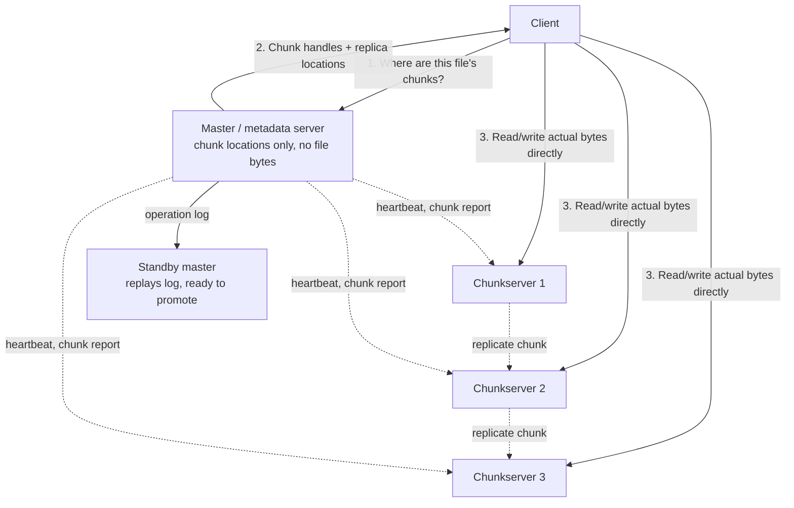

# Architecture Atlas: Distributed File Storage System

> **Sourcing note:** new, original content, added 2026-09-11 as part of the same repository-wide gap audit that added [Video Streaming Platform](video-streaming-platform.md) the day before — a full accounting of this Atlas's own follow-up gap list (video streaming, distributed file storage, web crawler/autocomplete), all three found missing despite the Atlas's T-813 "12-problem set" target already being closed by count on 2026-09-01. This is the second of that follow-up set; web crawler/autocomplete remains open. Like Video Streaming, this is deliberately additive beyond T-813's own closed accounting, not a reopening of it.

**Delivered as a timed, 45-minute exercise using [System Design Method and Estimation](../syllabus/11-system-design/system-design-method-and-estimation.md)'s six-phase method.**

## Table of Contents

1. [Problem Statement](#problem-statement)
2. [Constraints](#constraints)
3. [Functional Requirements](#functional-requirements)
4. [Non-Functional Requirements](#non-functional-requirements)
5. [Capacity Assumptions](#capacity-assumptions)
6. [Architecture Diagram](#architecture-diagram)
7. [Data Model](#data-model)
8. [APIs](#apis)
9. [Request Flow](#request-flow)
10. [Consistency Model](#consistency-model)
11. [Scaling Strategy](#scaling-strategy)
12. [Reliability Strategy](#reliability-strategy)
13. [Security, Observability, and Cost](#security-observability-and-cost)
14. [Trade-offs](#trade-offs)
15. [Alternatives Considered](#alternatives-considered)
16. [Staff-Level Discussion](#staff-level-discussion)
17. [Interview Presentation Sequence](#interview-presentation-sequence)

---

## Problem Statement

Design a distributed file storage system (a GFS/HDFS-shaped system) for storing very large files reliably across many commodity machines, optimized for large-scale batch/analytics workloads: mostly-sequential reads over huge files, append-heavy writes, and very few random small writes. Unlike [Distributed Key-Value Store](distributed-key-value-store.md), whose central tension is a leaderless, tunable-consistency design for many small values, this problem's central tension is the opposite: a small number of enormous files, where the actual hard problem is separating a tiny, latency-sensitive metadata path (which file's data lives on which machines) from a huge, throughput-sensitive data path (the actual bytes) — conflating the two, by routing bulk data through the same component that tracks file locations, is the single most common wrong turn in a first-pass design.

## Constraints

**In scope:** storing and retrieving very large (gigabyte-to-terabyte-scale) files, replicated for durability, with an append-friendly write model and no requirement to support small random writes efficiently. **Explicitly out of scope:** POSIX-compliant file semantics (arbitrary in-place byte-range overwrites, hard links, full directory-permission models) and low-latency small-file access (a photo-hosting-style workload) — naming these exclusions explicitly is itself part of a strong Phase 1 answer, since this system's entire design (large chunks, append-optimized, metadata-light) is a direct, deliberate consequence of *not* needing to solve either of those harder, differently-shaped problems.

## Functional Requirements

- A client can write a new file (as a sequence of appends) and read back any byte range of an existing file.
- Files are automatically split into fixed-size chunks, each chunk replicated across multiple machines for durability.
- A client can discover which machines hold a given file's chunks without routing the actual file data through a central coordinator.
- The system continues serving reads and accepting appends when any single storage machine fails, without data loss for already-replicated chunks.

## Non-Functional Requirements

- Aggregate read/write throughput must scale by adding storage machines, without funneling actual file bytes through any single component.
- A chunk must survive the loss of any one machine holding a replica of it — durability, not availability of the coordinating component, is the primary reliability property being designed for.
- Metadata operations (locating a file's chunks) must stay fast and available even as the total number of files and chunks grows into the billions, since every read and write depends on a metadata lookup first.
- The system is explicitly optimized for large sequential I/O; small random writes and low per-operation latency are non-goals, stated explicitly rather than silently underperforming against an unstated expectation.

## Capacity Assumptions

```
Assumption: 10PB of logical (pre-replication) file data
Assumption: replication factor 3 -> 30PB of physical storage required
Assumption: chunk size 128MB (a common real default; GFS's own
            original paper published 64MB, HDFS's later, larger
            default is 128MB) ->
            10PB / 128MB ≈ 82 million chunks (pre-replication),
            ≈ 246 million chunk replicas total
Assumption: each chunk's metadata entry (chunk ID, replica locations,
            version) is ~100 bytes -> 82M chunks x 100 bytes ≈ 8.2GB
            of chunk metadata -- small enough to fit entirely in a
            single master's memory, which is exactly the real,
            load-bearing assumption GFS's own design makes and states
            explicitly, not an incidental detail
Assumption: individual storage machine capacity ~16TB usable ->
            30PB / 16TB ≈ ~1,900 machines needed at this scale for
            storage alone, independent of the (much smaller) number
            of master/metadata machines needed

The chunk size (128MB) is the single number that shapes this entire
design: large enough that per-chunk metadata stays small enough to
fit in one machine's memory even at billions of chunks (the reason
metadata can be centralized at all), but small enough that a single
chunk's loss and re-replication is a bounded, fast recovery operation
rather than a multi-hour one.
```

## Architecture Diagram



**Justified against this design's own topics:**

- **The master never sees a single byte of actual file data** — it only answers "which chunkservers hold chunk X," per the Capacity Assumptions' own load-bearing calculation that this metadata fits entirely in memory. This single separation is what lets aggregate system throughput scale by adding chunkservers, directly satisfying the "no funneling bytes through a central component" non-functional requirement — a design that instead proxied data reads/writes through the master would cap total system throughput at that one machine's network capacity, no matter how many chunkservers existed.
- **The master is a genuine, acknowledged single point of failure for metadata availability**, mitigated the same way [Consensus Algorithms](../syllabus/10-distributed-systems/consensus-algorithms-raft-and-paxos.md) mitigates a single-leader design generally: an operation log of every metadata mutation, replicated to a standby, lets a new master reconstruct exact state and take over — this is a real, load-bearing design decision named explicitly, not an unaddressed gap.
- **Chunk replication happens chunkserver-to-chunkserver, not client-to-each-replica** — the client (or the primary replica it wrote to) forwards data along a replication pipeline, keeping the client's own upload bandwidth cost proportional to one copy, not the full replication factor.

## Data Model

**File namespace (master-held):** a directory-tree-like mapping from file paths to an ordered list of chunk handles. **Chunk metadata (master-held):** for each chunk handle, its current version number (to detect a stale replica after a chunkserver was offline during an update) and the current set of chunkservers holding a replica. **Chunk data (chunkserver-held):** the actual chunk bytes, stored as a plain local file on the chunkserver's own filesystem, with a checksum per block for corruption detection — the master never stores or transits this data at all.

## APIs

```
CREATE /files/{path}
  -> 200 OK {fileId}

APPEND /files/{path}
  {data}
  -> 200 OK {chunkHandle, offset}   (client first asks master for the
                                     current last chunk's primary
                                     replica location, writes there,
                                     the primary replicates and acks)

READ /files/{path}?offset={o}&length={l}
  -> 1. Client asks master which chunk(s) cover [o, o+l)
  -> 2. Client reads directly from a chunkserver replica of each,
        never through the master
  -> 200 {data}

GET /files/{path}/chunks
  -> 200 {chunks: [{handle, replicas: [...]}]}   (metadata only)
```

## Request Flow

**Write (append):** (1) client asks the master for the file's current last chunk and its replica set, specifically which replica is the current primary; (2) the client pushes data directly to all replicas (typically via a pipeline: client to nearest replica, which forwards to the next, and so on), decoupled from step 3; (3) once all replicas have the data buffered, the client sends a commit request to the primary, which assigns a serial order for this write (if multiple clients are appending concurrently) and forwards the commit to the secondaries; (4) the primary acknowledges success back to the client only once secondaries confirm. **Read:** (1) client asks the master which chunk(s) cover the requested byte range and their replica locations — cached client-side afterward to avoid repeating this for every read; (2) client reads directly from whichever replica is closest/least loaded, entirely bypassing the master for the actual data transfer.

## Consistency Model

This design is deliberately **not** strongly consistent for concurrent writes to the same region of a file — per [CAP Theorem and Consistency Models](../syllabus/10-distributed-systems/cap-theorem-and-consistency-models.md), it favors a relaxed, "at-least-once, possibly-duplicated, definitely-ordered-per-primary" append semantic over the throughput cost of full consensus per write, because the stated workload (batch/analytics append-heavy writes) can tolerate an occasional duplicate record far more easily than it can tolerate write-path latency. Concretely: a successful append is guaranteed to have been written, in the same order, to every replica; a *failed* append may have partially succeeded on some replicas, which the client's own retry logic must handle idempotently (e.g., by including a client-assigned record ID a downstream reader can de-duplicate on) — this design explicitly does not hide that possibility behind a false "exactly-once" guarantee.

## Scaling Strategy

Storage and read/write throughput scale by adding chunkservers — each new chunkserver simply reports its available capacity to the master and begins receiving new chunk assignments, with no data-path bottleneck since chunkservers never route traffic through the master. The master itself, holding all metadata in memory (per the Capacity Assumptions), scales by keeping metadata *small per chunk* (the reason for a large, not small, chunk size) rather than by adding more master machines — the master's real, bounded scaling limit is total *chunk count*, not total *data volume*, which is exactly why chunk size is the one parameter with the most leverage over how large this system can grow before the master's own memory becomes the constraint.

## Reliability Strategy

1. **A single chunkserver failure is routine and expected, not exceptional** — the master detects it via missed heartbeats, and re-replicates that chunkserver's chunks from surviving replicas to restore the replication factor, entirely automatically.
2. **Master failure is the real, rare, higher-stakes event** — the operation log plus a standby master (replaying the log to reconstruct exact state) is what bounds recovery time; a design with no standby and no log would require rebuilding the entire namespace from chunkserver reports alone, a real, much slower recovery path this design deliberately avoids.
3. **A stale chunk replica** (one that missed a write while its chunkserver was offline) is detected via the chunk version number the master tracks — a replica reporting an older version than the master expects is never served to a client and is re-replicated from a current copy instead, preventing a silent, undetected read of stale data.

## Security, Observability, and Cost

**Security:** access control is enforced at the master (namespace-level permission checks before returning chunk locations at all) — a chunkserver itself does not, and should not, independently authorize client requests, since the master is the sole source of truth for "should this client see this file." **Observability:** chunkserver heartbeat/disk-health metrics and the master's own operation-log replication lag to its standby are the two most operationally load-bearing signals — a slow leak in either directly threatens this design's core reliability guarantees. **Cost:** the replication factor (3x, per the Capacity Assumptions) is the dominant, explicit storage-cost multiplier — a real, quantified trade against durability that a design review should treat as a deliberate, named decision, not a default nobody chose on purpose.

## Trade-offs

| Decision | Benefit | Cost |
|---|---|---|
| Master handles metadata only, never file bytes | Aggregate throughput scales with chunkserver count, not master capacity | The master is still a real single point of coordination for every operation's *first* step |
| Large (128MB) chunk size | Metadata stays small enough to fit in one machine's memory at billions of chunks | Wastes space for many small files; a poor fit for a small-file-heavy workload |
| Relaxed, at-least-once append semantics | Real throughput win over full per-write consensus | Clients must handle possible duplicate records themselves |
| Chunkserver-to-chunkserver replication pipeline | Client's own upload bandwidth cost stays proportional to one copy | More complex write-path coordination than a naive client-writes-to-all-replicas design |

## Alternatives Considered

- **Routing all file reads and writes through the master, which itself talks to chunkservers on the client's behalf.** Rejected: directly caps total system throughput at the master's own network/CPU capacity regardless of chunkserver count — the exact anti-pattern this design's entire separation of metadata and data paths exists to avoid.
- **A leaderless, Dynamo-style design for chunk replicas (like [Distributed Key-Value Store](distributed-key-value-store.md)), instead of a per-chunk primary.** Rejected for this specific workload: the stated append-heavy access pattern benefits from one primary establishing a strict serial order for concurrent appends to the same chunk — a leaderless design would need a separate conflict-resolution mechanism (vector clocks, application-level merge) for concurrent appends that this system's actual workload doesn't need to pay for.
- **Small (e.g., 4KB) chunk size, matching a traditional filesystem's block size.** Rejected: at this design's real target scale (tens of petabytes), a small chunk size would push per-chunk metadata well past what a single master's memory can hold, directly breaking the load-bearing assumption the Capacity Assumptions section makes explicit.

## Staff-Level Discussion

The single most instructive decision in this design is recognizing that "the master is a single point of failure" is a real, legitimate design concern, but attacking it by *distributing the master itself* (a leaderless metadata layer, or a metadata layer sharded across many machines) is the wrong fix for this specific problem's actual failure mode — the real risk isn't the master's *throughput* (which the metadata-only design already keeps small and bounded), it's the master's *availability window* during a failover, which an operation log plus a hot/warm standby addresses directly and far more simply than distributing metadata ownership would. A Staff engineer's value here is matching the fix's complexity to the actual, specific risk being mitigated — not reaching for the most sophisticated available technique (full metadata sharding, a consensus-replicated metadata store) when a simpler, well-understood one (log-replay failover) already closes the real gap.

## Interview Presentation Sequence

Delivered as a timed, 45-minute exercise using the six-phase method's own stated budget — see [System Design Narration and Whiteboard Discipline](../syllabus/20-interview-preparation/system-design/system-design-narration-and-whiteboard-discipline.md) for sequencing the diagram (the metadata-path/data-path separation first, since it's this design's own central idea; chunk size and its memory-footprint consequence next, since it's the concrete number everything else depends on; master failover last, as the design's own explicitly-acknowledged remaining risk). A self-verification exit check for this specific problem: the metadata-versus-data-path separation stated as the design's actual central idea, not a minor implementation detail; the chunk-size-to-master-memory relationship quantified with real numbers, not asserted; the relaxed append consistency model stated explicitly as a deliberate throughput trade, not glossed over; and master failover named as a real, addressed risk (operation log plus standby), not left as an unexamined gap.
