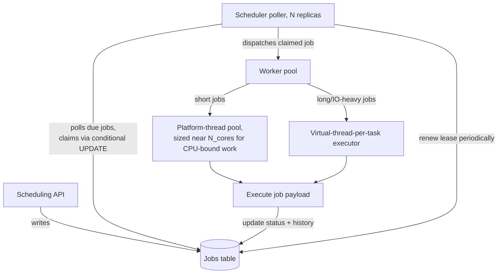

# Architecture Atlas: Distributed Job Scheduler

**Delivered as a timed, 45-minute exercise using [System Design Method and Estimation](../handbook/system-design/system-design-method-and-estimation.md)'s six-phase method.**

## Table of Contents

1. [Problem Statement](#problem-statement)
2. [Constraints](#constraints)
3. [Functional Requirements](#functional-requirements)
4. [Non-Functional Requirements](#non-functional-requirements)
5. [Capacity Assumptions](#capacity-assumptions)
6. [Architecture Diagram](#architecture-diagram)
7. [Data Model](#data-model)
8. [APIs](#apis)
9. [Request Flow](#request-flow)
10. [Consistency Model](#consistency-model)
11. [Scaling Strategy](#scaling-strategy)
12. [Reliability Strategy](#reliability-strategy)
13. [Security, Observability, and Cost](#security-observability-and-cost)
14. [Trade-offs](#trade-offs)
15. [Alternatives Considered](#alternatives-considered)
16. [Staff-Level Discussion](#staff-level-discussion)
17. [Interview Presentation Sequence](#interview-presentation-sequence)

---

## Problem Statement

Design a system that schedules one-off and recurring (cron-style) jobs, guarantees each runs at-least-once at or after its scheduled time, and supports cancellation and retries with backoff. Unlike a system that reacts to an inbound event stream, this system must itself continuously decide *when* work becomes due.

## Constraints

**In scope:** scheduling, at-least-once execution, cancellation, retry with backoff. **Explicitly out of scope for this exercise:** the job payloads' actual business logic (treated as opaque work units) and any UI — naming them as deliberately excluded is itself part of a strong Phase 1 answer.

## Functional Requirements

- Schedule a one-off job for a specific time, or a recurring job via a cron-style expression.
- Guarantee at-least-once execution at or after the scheduled time.
- Support cancellation of a not-yet-started job.
- Support retries with backoff on failure, up to a configured maximum.

## Non-Functional Requirements

- Job execution time varies widely (p50 ~200ms, p99 ~30s) — this spread must drive worker-pool design, not be treated as noise.
- Multiple scheduler replicas must never double-execute the same due job.
- A crashed scheduler replica's claimed jobs must become claimable again automatically, without manual intervention or a separate failure-detection mechanism.

## Capacity Assumptions

```
Assumption: 5M scheduled jobs/day, average ~58 jobs/s, peak (4x) ~230/s
Assumption: 10% of jobs are recurring (cron-style), re-enqueuing themselves
            after each run -- the recurring set is a small, mostly-static
            working set (~50K distinct schedules) that must be re-evaluated
            continuously, separate from the one-off job volume above
Assumption: job execution time varies widely: p50 ~200ms, p99 ~30s -- this
            spread is the number that should drive worker-pool design: a
            pool sized for the p50 case starves under the p99 tail unless
            something isolates long-running jobs from short ones.
```

## Architecture Diagram



**Justified against this design's own topics:**

- **Two separate execution pools, not one:** the p50-vs-p99 spread from the capacity assumptions is exactly the CPU-bound-vs-IO-bound sizing distinction from [Executors and Thread Pool Sizing](../syllabus/02-java/concurrency/executors-and-thread-pool-sizing.md) — short (CPU-bound) jobs get a platform pool sized near `N_cores`; long-running (IO-bound) jobs get a virtual-thread-per-task executor, so slow jobs can't starve the short-job pool the way one shared, undersized pool would.
- **Lease-based claiming, not a distributed lock:** a true distributed lock (e.g., Zookeeper/etcd) solves a more general problem than needed and introduces its own failure mode — a lock holder crashing while holding it. The lease pattern (claim with expiry, periodically renewed) self-heals: a crashed poller's claimed jobs become claimable again once the lease expires, with no failure detection or explicit unlock needed. The same "avoid the general mechanism when a narrower one avoids its failure mode" judgment as choosing `AtomicInteger` over `synchronized` for a single counter.
- **Multiple poller replicas via conditional-update claim, not leader election:** avoids a single point of failure without leader-election's own complexity — every replica independently polls and races to claim due jobs; the database's atomic conditional update (not application-level locking) prevents double-claiming, sidestepping the [Deadlock, Race Conditions, and Thread Diagnostics](../syllabus/02-java/concurrency/deadlock-race-conditions-and-thread-diagnostics.md) risk category entirely (no multi-lock acquisition to order incorrectly).

## Data Model

**Job definitions:** relational, one row per job — `id`, `runAt`, `cronExpr` (nullable), `status`, `payload`, `attemptCount`, `maxRetries`, `lockedBy`, `lockedUntil`. The `lockedBy`/`lockedUntil` pair prevents two scheduler instances from picking up the same due job — a worker claims via a conditional update (`UPDATE jobs SET lockedBy=?, lockedUntil=now()+leaseSeconds WHERE id=? AND (lockedUntil IS NULL OR lockedUntil < now())`), the same optimistic-claim pattern as a distributed lock lease, deliberately avoiding a true distributed lock service as unnecessary complexity here.

**Execution history:** append-only, one row per attempt — makes retry/backoff decisions auditable and is the idempotency boundary (per [Idempotency at System Edges](../handbook/system-design/idempotency.md)) if a job's execution needs to be safe against being picked up twice during a lease-expiry race.

## APIs

```
POST /jobs                  {runAt | cronExpr, payload, maxRetries?} -> {jobId}
DELETE /jobs/{jobId}        -> 204 (cancel, if not yet started)
GET /jobs/{jobId}           -> {status: scheduled|running|succeeded|failed|cancelled}
(workers do NOT expose an API -- they pull work from the scheduling
store/queue, they are not called directly)
```

## Request Flow

1. A client posts a job with either a specific `runAt` time or a `cronExpr`.
2. Scheduler poller replicas continuously query for due jobs and attempt to claim them via a conditional update on `lockedBy`/`lockedUntil`.
3. A poller that wins the claim dispatches the job to the appropriate pool — the short-job platform pool or the long-job virtual-thread executor, based on expected duration.
4. The worker executes the payload, then updates the job's status and appends to execution history.
5. The poller periodically renews the lease for jobs still in flight; a lease that expires without renewal makes the job claimable again by another poller.

## Consistency Model

Job claiming is strongly consistent at the database level — the conditional-update claim guarantees exactly one poller wins a given claim attempt, preventing double-execution under normal operation. Lease expiry deliberately trades a small window of possible re-execution (if a legitimately slow worker's lease expires mid-run) for self-healing recovery from crashes, which is why the execution-history table exists as an idempotency boundary rather than assuming claim exclusivity alone is sufficient.

## Scaling Strategy

Scheduler poller replicas scale horizontally with no coordination beyond the database's atomic conditional update — adding more pollers adds more claiming capacity without introducing a leader-election bottleneck. The two-pool worker architecture scales short and long jobs independently, so a burst of long-running jobs cannot starve the much larger volume of short jobs.

## Reliability Strategy

1. **The Jobs table's due-job query becomes a hot, contended row range as poller replicas scale.** Every poller runs roughly the same `SELECT ... WHERE runAt <= now() AND lockedUntil < now()` query; at high replica counts this becomes read-contention and wasted conditional-update conflicts. Mitigation: partition the due-job query space by `id % pollerCount` or similar, so pollers aren't all racing for the identical row set.
2. **Lease expiry is a genuine trade-off, not a free parameter.** Too short: a slow-but-healthy worker's lease expires mid-execution, another poller reclaims and re-executes concurrently — exactly the idempotency requirement the execution-history table exists for. Too long: a genuinely crashed worker's job sits unclaimed for the full duration before retry, hurting the p99 tail. Set from the capacity assumptions' p99 execution time, with periodic renewal for legitimately long jobs, not intuition.
3. **The recurring-job re-enqueue step, if it fails silently, stops an entire cron schedule from ever running again** — a different failure mode than a single job failing (which retries per the execution history), since a failed re-enqueue has no natural retry trigger of its own. Mitigation: its own monitoring (last-successful-reschedule timestamp per cron job, alerting if it falls behind cadence), separate from individual job-execution monitoring.

## Security, Observability, and Cost

Not addressed in this 45-minute exercise, which was deliberately scoped to the scheduling/claiming problem (see Constraints). A full treatment would need, at minimum: authorization on who can schedule/cancel jobs, isolation between different callers' job payloads (a poorly-behaved job shouldn't be able to affect another's execution), metrics on due-job query latency and claim-conflict rate, and a cost model for the worker-pool footprint at peak load. These are flagged here as explicit gaps rather than invented to fill out the template.

## Trade-offs

| Decision | Benefit | Cost |
|---|---|---|
| Lease-based claiming instead of a distributed lock | Self-healing on crash, no failure-detection mechanism needed | A real re-execution window if a lease expires under a legitimately slow (not crashed) worker |
| Two separate execution pools by job duration | Long jobs can't starve short ones | More operational surface — two pools to size and monitor instead of one |
| Conditional-update claiming instead of leader election | No single point of failure, simpler than leader election | Query contention on the due-job row range at high poller-replica counts |

## Alternatives Considered

- **A true distributed lock service (Zookeeper/etcd) for claiming.** Rejected: solves a more general mutual-exclusion problem than needed here, and introduces its own failure mode (a lock holder crashing while holding the lock) that the lease pattern avoids by design.
- **Leader election, with only the leader dispatching jobs.** Rejected: adds real complexity (election protocol, leader failover) to solve the same problem the database's atomic conditional update already solves more simply.
- **One shared worker pool for all jobs regardless of expected duration.** Rejected: the measured p50-vs-p99 spread means a single pool sized for the common case starves under the tail, and a pool sized for the tail wastes capacity on the common case.

## Staff-Level Discussion

The recurring theme across this design's three named bottlenecks is that each one is a distinct failure shape requiring its own specific mitigation, not a single generic "add more capacity" fix: query contention needs partitioning, lease-duration tuning needs a value derived from measured p99 execution time rather than intuition, and silent re-enqueue failure needs its own dedicated monitoring separate from individual job monitoring. A Staff engineer treats "what specifically breaks, and how would I know" as a per-component question, not a single system-wide concern — this is what makes the difference between a design that only handles the happy path and one that survives real operation.

## Interview Presentation Sequence

Delivered as a timed, 45-minute exercise using the six-phase method's own stated budget — see [Time-Boxing and Mid-Round Changes](../interview-playbook/system-design/time-boxing-and-mid-round-changes.md) for the live-delivery discipline of running this inside the clock, including this exact design's own real mid-round curveball ("jobs now need exactly-once execution guarantees, not at-least-once") and the expectation that a strong answer revises the execution-history idempotency boundary specifically, rather than bolting on a patch. A self-verification exit check for this specific problem: all six phases completed within 45 minutes; the p50/p99 execution-time spread named explicitly and traced through to the two-pool architecture decision; lease-based claiming chosen deliberately over a distributed lock, with the specific failure mode it avoids (crashed lock holder) stated.
