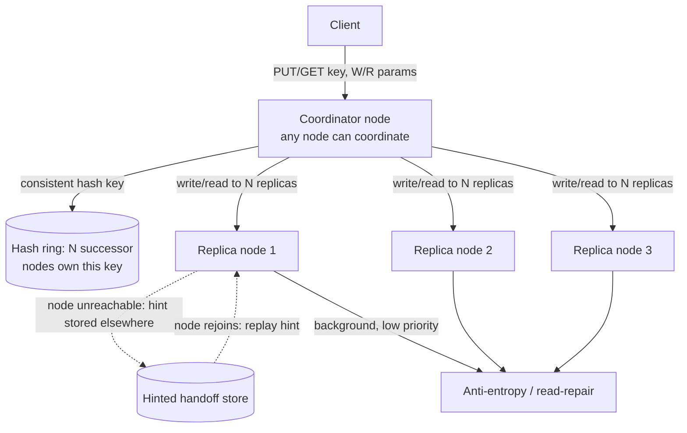

# Architecture Atlas: Distributed Key-Value Store

> **Sourcing note:** like the three entries before it, this is new, original content, not elevated from an existing study-pack exercise — none exists for this problem. It is a fourth additional canonical design problem toward the Master Topic Register's T-813 (Canonical design problems (12-problem set)) line. Counting it, the Atlas now holds exactly 12 classic full-system-design entries built to the Architecture Atlas Standard's six-phase method: the 8 elevated from study-pack exercises (ride-hailing, news feed, payment processing, authentication, notification, job scheduler, distributed cache, metrics/monitoring) plus these 4 new ones (chat, ticket booking, URL shortener, this entry). That matches T-813's stated count exactly. The register never names *which* twelve problems it means, so this is closure by count against the stated target, not a guarantee that these are the specific twelve any given interviewer would ask for — see the Architecture Atlas README for the full accounting.

**Delivered as a timed, 45-minute exercise using [System Design Method and Estimation](../syllabus/11-system-design/system-design-method-and-estimation.md)'s six-phase method.**

## Table of Contents

1. [Problem Statement](#problem-statement)
2. [Constraints](#constraints)
3. [Functional Requirements](#functional-requirements)
4. [Non-Functional Requirements](#non-functional-requirements)
5. [Capacity Assumptions](#capacity-assumptions)
6. [Architecture Diagram](#architecture-diagram)
7. [Data Model](#data-model)
8. [APIs](#apis)
9. [Request Flow](#request-flow)
10. [Consistency Model](#consistency-model)
11. [Scaling Strategy](#scaling-strategy)
12. [Reliability Strategy](#reliability-strategy)
13. [Security, Observability, and Cost](#security-observability-and-cost)
14. [Trade-offs](#trade-offs)
15. [Alternatives Considered](#alternatives-considered)
16. [Staff-Level Discussion](#staff-level-discussion)
17. [Interview Presentation Sequence](#interview-presentation-sequence)

---

## Problem Statement

Design a general-purpose, horizontally scalable key-value store (a Dynamo/Cassandra-style system) offering tunable consistency, no single point of failure, and continued write availability even during a network partition or node failure. Unlike every other entry in this Atlas, which designs one specific application on top of existing storage primitives, this problem *is* the storage primitive — the central tension is choosing, explicitly and with a stated reason, where this system sits on the availability-versus-consistency spectrum for both reads and writes, and making that choice tunable per-request rather than fixed once for the whole system.

## Constraints

**In scope:** `PUT`/`GET`/`DELETE` on an opaque value by key, configurable per-request consistency (how many replicas must acknowledge), replica placement and failure handling, and conflict detection when concurrent writes to the same key diverge. **Explicitly out of scope for this exercise:** range queries, secondary indexes, and transactions spanning multiple keys — naming them as deliberately excluded is itself part of a strong Phase 1 answer, since a pure key-value store's whole value proposition is *not* trying to be a general relational or document database.

## Functional Requirements

- `PUT(key, value)` and `GET(key)` with single-digit-millisecond latency at the median.
- Each key's value is replicated across N nodes; the caller can specify how many replicas must acknowledge a write (`W`) and how many must respond to a read (`R`).
- The system continues accepting writes for a key even if some of that key's replica nodes are unreachable.
- Concurrent writes to the same key that create conflicting values must be detected, not silently resolved by "last write wins" alone.

## Non-Functional Requirements

- No single point of failure — every node is a peer; there is no distinguished "primary" node whose failure blocks the whole system.
- The system must remain available for both reads and writes during a network partition, accepting that some reads may return stale or conflicting data as the cost of that availability (a stated, deliberate AP choice per [CAP Theorem and Consistency Models](../syllabus/10-distributed-systems/cap-theorem-and-consistency-models.md), not an accidental one).
- Adding or removing a node must redistribute only a small, bounded fraction of keys, not require a full data reshuffle.
- A temporarily unreachable replica must not permanently lose writes directed at it once it rejoins.

## Capacity Assumptions

```
Assumption: 500M keys, average value size 1KB -> ~500GB of raw data
            before replication
Assumption: replication factor N=3 -> ~1.5TB total stored data
Assumption: 50,000 reads/s and 10,000 writes/s sustained, each fanned
            out to N=3 replicas per the chosen R/W consistency setting
Assumption: individual node capacity ~500GB usable storage and
            ~5,000 ops/s -> roughly a few dozen nodes needed at this
            scale, well within what consistent hashing with virtual
            nodes handles gracefully

The replication factor (N) and the per-request R/W consistency settings
are the two numbers that turn this from a generic "shard some data"
problem into the actual system-design question being asked: what
combination of R, W, and N gives the stated availability and consistency
guarantees, and what does violating R+W>N specifically cost.
```

## Architecture Diagram



**Justified against this design's own topics:**

- **Consistent hashing with virtual nodes** determines both which N nodes own a given key and how much data moves on membership change — per [Data Partitioning and Consistent Hashing](../syllabus/10-distributed-systems/data-partitioning-and-consistent-hashing.md), this is exactly what bounds a node join/leave to a small, predictable fraction of keys rather than a full reshuffle, directly satisfying the stated non-functional requirement.
- **Any node can coordinate any request** (no distinguished primary), consulting the hash ring to find the current key's replica set and fanning the request out to them — this is the specific mechanism behind "no single point of failure": losing any one node, including whichever one happened to coordinate a given request, doesn't block the system.
- **Hinted handoff** is what makes "keep accepting writes during a node failure" safe rather than lossy: if a replica is unreachable at write time, another node stores the write as a "hint" addressed to the down replica and replays it once that node rejoins — the write still succeeds toward the caller's `W` count via the remaining reachable replicas, and the temporarily-missed replica catches up later rather than staying permanently behind.
- **Background anti-entropy / read-repair** reconciles replicas that have drifted (from a hinted-handoff replay lag, or a replica that missed writes during a partition) without requiring every read to pay a full quorum-comparison cost — most reads are served from whatever `R` replicas respond fastest, with inconsistency detection and repair happening opportunistically.

## Data Model

**Per key:** the value itself, plus a version marker used for conflict detection — either a simple `(value, timestamp)` pair for a "last write wins" policy, or a vector clock (one logical counter per node that has written this key) when the design needs to *detect* concurrent, conflicting writes rather than silently picking one and discarding the other. **Hint store:** ephemeral, per-down-node, holding writes addressed to a currently-unreachable replica until it rejoins.

## APIs

```
PUT /kv/{key}?W=2
  {value}
  -> 200 OK   (acknowledged once W replicas have durably written it)
  -> 503      (fewer than W reachable replicas -- write is rejected,
               not silently downgraded to a lower W than the caller asked for)

GET /kv/{key}?R=2
  -> 200 {value}                       (R replicas agreed)
  -> 200 {values: [...], conflict: true} (R replicas returned divergent
                                          versions -- surfaced to the
                                          caller to resolve, not hidden)

DELETE /kv/{key}
```

## Request Flow

1. A client sends `PUT`/`GET` to any node, which acts as coordinator for this request regardless of whether it's one of the key's actual replica-owning nodes.
2. The coordinator consults the consistent-hash ring to find the N nodes currently responsible for this key.
3. For a write, the coordinator sends the value to all N (or as many as reachable), and returns success to the client once `W` of them acknowledge; any unreachable replica gets a hint stored elsewhere instead of blocking the write.
4. For a read, the coordinator queries `R` replicas and compares their responses; if they agree, that value is returned; if they disagree, the divergent versions (and their vector clocks) are returned to the caller, or reconciled by a stated policy (e.g., last-write-wins by timestamp) depending on the design's chosen conflict-resolution strategy.
5. Independently of client-triggered requests, a background anti-entropy process periodically compares replica sets for the same key range and repairs any detected drift.

## Consistency Model

Consistency here is explicitly tunable per request, not a single system-wide property: choosing `W=N` and `R=1` favors read latency and read availability at the cost of write availability (a write needs every replica); choosing `W=1` and `R=N` favors write availability at the cost of read latency; the common middle ground `R+W>N` (e.g., `N=3, W=2, R=2`) guarantees any successful read overlaps with the most recent successful write on at least one replica, giving strong-enough consistency for most use cases while tolerating one node's unavailability on either the read or write path. Choosing `R+W<=N` is a valid, sometimes-deliberate choice too — it trades away that overlap guarantee for lower latency and higher availability on both paths, accepting that a read may miss the most recent write entirely, and that trade-off must be stated explicitly, not left as an accidental default.

## Scaling Strategy

Adding capacity means adding nodes to the consistent-hash ring; each new node takes ownership of a small, bounded slice of the key space from its immediate neighbors on the ring (using virtual nodes to keep that redistribution evenly spread across many existing nodes rather than concentrated on one), directly satisfying the "bounded redistribution" non-functional requirement. Read and write throughput both scale roughly linearly with node count, since any given key's load is bounded to its N replica-owning nodes regardless of total cluster size — a hot key remains a real, unavoidable limit on that specific key's throughput (see Reliability Strategy), but the cluster as a whole scales by adding nodes for the aggregate workload.

## Reliability Strategy

1. **A hot key is a fundamentally different problem from a hot node**, and this design cannot fix a hot key by adding more nodes — a single key's reads and writes are always served by exactly its N replica-owning nodes, however large the cluster grows; a hot key needs application-level mitigation (client-side caching, key splitting) rather than a cluster-scaling response.
2. **`W < N` and `R < N` are what keep the system available during a partition**, at the direct, stated cost of a temporary consistency window between the moment a write with `W<N` succeeds and the moment anti-entropy has propagated it to every replica — this is the concrete, mechanical version of the AP choice this design's own Non-Functional Requirements commit to.
3. **Hinted handoff has a real limit**: if a node stays down long enough, the hints addressed to it can themselves need to be discarded (to bound the hint store's own growth), at which point that replica has to catch up via full anti-entropy repair instead of hint replay on rejoin — a longer outage costs more recovery work, not just more downtime.

## Security, Observability, and Cost

Not addressed in this 45-minute exercise, which was deliberately scoped to the replication/consistency-tuning problem (see Constraints). A full treatment would need, at minimum: authentication/authorization on the client-facing API (a bare key-value store has no inherent access-control concept), metrics on per-node replica-set health and anti-entropy repair lag as the leading indicators of a developing consistency problem before it surfaces as visible read conflicts, and a cost model dominated by the replication factor's direct storage multiplier (N=3 means 3x raw storage, a real, explicit cost of the availability guarantee it buys). These are flagged here as explicit gaps rather than invented to fill out the template.

## Trade-offs

| Decision | Benefit | Cost |
|---|---|---|
| Consistent hashing with virtual nodes | Node join/leave redistributes only a small, bounded key fraction | More operational complexity than static, modulo-based sharding |
| No distinguished primary; any node coordinates | No single point of failure | Every node needs full ring-topology awareness and coordination logic |
| Hinted handoff | Writes keep succeeding during a brief replica outage, with no data loss on rejoin | An unbounded hint store during a long outage; hints must eventually be dropped |
| Tunable per-request R/W | One system serves both latency-sensitive and consistency-sensitive callers | Callers must understand the R+W-vs-N trade-off to choose correctly; a wrong choice is a silent correctness risk, not an error |

## Alternatives Considered

- **A single, distinguished primary per key (like a traditional master-replica database), instead of a leaderless, any-node-coordinates design.** Rejected: directly conflicts with the stated "no single point of failure" requirement — a primary's failure would either block writes to its keys entirely or require an explicit failover process, exactly the kind of coordinated recovery this design's leaderless approach avoids needing at all.
- **Fixed, system-wide consistency (e.g., always requiring `W=N`).** Rejected: forces every caller to pay the strongest, most expensive consistency level even when a specific use case would happily trade it for lower latency or higher availability — the whole point of exposing `R`/`W` as per-request parameters is letting each caller make that trade-off explicitly for their own workload.
- **Last-write-wins by wall-clock timestamp as the only conflict-resolution strategy, with no vector-clock option.** Rejected as the *only* strategy, though named as a legitimate simpler default for callers who don't need it: pure timestamp-based resolution can silently and permanently discard a legitimate concurrent write whose clock happened to read slightly earlier, which the Functional Requirements explicitly call out as unacceptable ("must be detected, not silently resolved").

## Staff-Level Discussion

The single most instructive decision in this design is making the consistency/availability trade-off an explicit, per-request *parameter* rather than a single architectural decision baked in once for the whole system — many candidates' first-pass designs pick one point on the CAP spectrum and defend it as "the" answer, when the actual insight a Dynamo-style system demonstrates is that different callers of the identical storage system can legitimately want different points on that spectrum for different keys or different operations, and a well-designed system exposes that choice rather than making it once on every caller's behalf. A Staff engineer's value here is recognizing that "what's our consistency model" is sometimes the wrong question — the right question is "what consistency model does this specific caller need for this specific key," and building the system to answer that per-request rather than globally.

## Interview Presentation Sequence

Delivered as a timed, 45-minute exercise using the six-phase method's own stated budget — see [System Design Narration and Whiteboard Discipline](../syllabus/20-interview-preparation/system-design/system-design-narration-and-whiteboard-discipline.md) for sequencing the diagram (the hash ring and replica-set concept first, since every other mechanism in this design depends on it; the core `PUT`/`GET` fan-out path next; hinted handoff and anti-entropy introduced afterward as the explicit failure-mode annotations). A self-verification exit check for this specific problem: the `R+W` vs. `N` relationship stated explicitly with a concrete example, not left as an abstract formula; hinted handoff explained as a mechanism for *availability* (writes keep succeeding) distinct from anti-entropy's role in *convergence* (replicas eventually agree); the hot-key-vs-hot-node distinction named explicitly; and the tunable-per-request consistency model presented as the design's actual central idea, not a minor configuration detail mentioned in passing.
