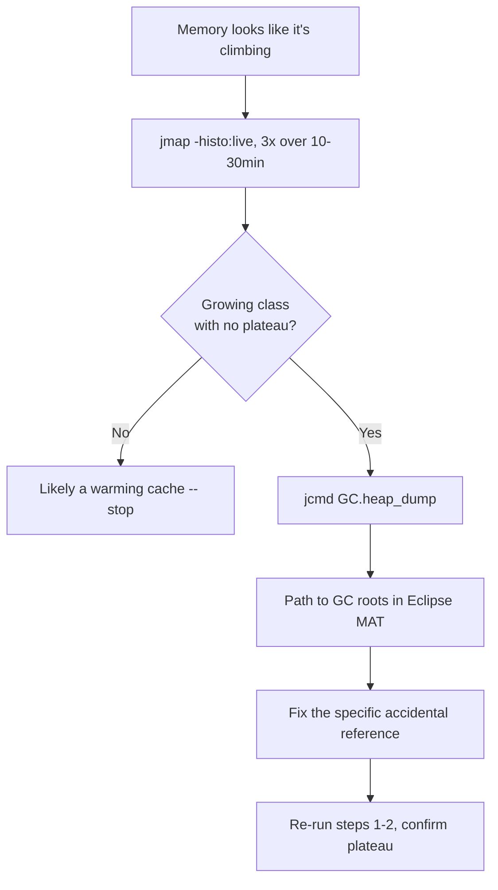

# Architecture Atlas: JVM Sizing and Diagnostics Playbook for a Real-Time Pricing Service

**Delivered as a timed, 45-minute exercise producing a JVM sizing and diagnostics playbook — a domain-specific operational deliverable, not a request/response system design. This entry adapts the Atlas template accordingly: no data model, API surface, or consistency model sections; the "Reference Analysis" section is this exercise's actual deliverable — a runbook, not an architecture.**

## Table of Contents

1. [Problem Statement](#problem-statement)
2. [Constraints](#constraints)
3. [Design Dimensions](#design-dimensions)
4. [Reference Analysis](#reference-analysis)
5. [Diagnostic Decision Flow](#diagnostic-decision-flow)
6. [Trade-offs](#trade-offs)
7. [Alternatives Considered](#alternatives-considered)
8. [Staff-Level Discussion](#staff-level-discussion)
9. [Interview Presentation Sequence](#interview-presentation-sequence)

---

## Problem Statement

Produce a JVM sizing and diagnostics playbook for a real-time pricing service: it maintains a large, frequently-updated in-memory price cache (updated on every market tick), evaluates a pricing strategy per request (a second implementation is about to roll out behind a gradual flag), and runs on Kubernetes with a CPU request/limit noticeably smaller than the team's old fixed-VM deployment. The team has been burned before by an undiagnosed week-long memory leak and wants a documented playbook, not tribal knowledge.

## Constraints

- Price cache updated on every market tick — a hot, frequently-mutated, cross-region-write structure.
- A second pricing strategy is rolling out behind a flag at a previously-monomorphic call site.
- Container CPU limit is smaller than the prior fixed-VM deployment.
- A prior memory leak went undiagnosed for a week — the team explicitly wants a documented, repeatable runbook this time.

## Design Dimensions

1. Region sizing: heap vs. metaspace vs. thread-stack, and the first diagnostic step on exhaustion.
2. Container ergonomics: what changes with the smaller CPU limit, and whether it's a problem.
3. G1 remembered-set awareness for the hot price cache.
4. A concrete, ordered memory-leak diagnosis runbook.
5. Deoptimization-aware expectations for the flag rollout.

## Reference Analysis

**Region sizing.** Heap sized via the default `MaxRAMPercentage` ergonomic against the container's memory limit, per [JVM Flags and Container Ergonomics](../syllabus/02-java/jvm-internals/jvm-flags-and-container-ergonomics.md), unless a specific, measured reason exists to override it. Metaspace capped explicitly (`-XX:MaxMetaspaceSize`) at a conservative multiple of the class count actually loaded at steady state — this service's pricing-strategy flag rollout is exactly the kind of dynamic-class-generation-adjacent change, per [JVM Memory Layout and Runtime Regions](../syllabus/02-java/jvm-internals/jvm-memory-layout-and-runtime-regions.md), worth guarding with an explicit cap rather than leaving metaspace unbounded. First diagnostic step on any region exhaustion: read the exact error message and region name (`Java heap space`, `Metaspace`, `StackOverflowError`) before choosing a remediation — each points at a different region with a different fix, and none is fixed by adjusting a different region's flag.

**Container ergonomics.** Expect fewer GC threads and correspondingly different (likely somewhat longer) individual pause times than the old VM deployment, for the same heap size — this is the JVM correctly detecting the smaller CPU limit (per Container Ergonomics' measured `CPUs: {total} total, {available} available` evidence) and sizing `ParallelGCThreads` accordingly, not a misconfiguration. Whether it's actually "a problem" depends on whether the new pause profile still meets the service's latency SLO — confirm via `-Xlog:gc+init`'s CPU-detection line before concluding anything is wrong, and only raise the CPU limit if the new pause profile genuinely fails the SLO.

**G1 remembered-set awareness.** The price cache — fresh (young-gen) price objects written on every tick into a long-lived (old-gen, promoted) container — is precisely the cross-region write pattern [G1 Remembered Sets and Write Barriers](../syllabus/02-java/jvm-internals/g1-remembered-sets-and-write-barriers.md) measures producing disproportionate dirty-card/remembered-set activity. Watch for pause time growing while heap occupancy stays flat — the specific diagnostic signature — via `-Xlog:gc+phases=debug`'s `Merge Heap Roots` phase duration and dirty/scanned card sums. If it becomes a real problem, the mitigation is partitioning the price cache (e.g., sharded by instrument symbol), spreading the card-dirtying load across more regions instead of concentrating it — not resizing the heap.

**Memory-leak diagnosis runbook.**

```
1. Sample `jmap -histo:live <pid>` at least 3 times, spaced 10-30 minutes apart.
2. If one class's count grows across ALL samples with no plateau -> likely leak.
   If it plateaus -> likely a warming cache, not a leak; stop here.
3. Once a growing class is identified, capture a targeted heap dump:
   `jcmd <pid> GC.heap_dump /path/to/dump.hprof`
4. Open the dump in Eclipse MAT / VisualVM, find the "path to GC roots" for
   an instance of the growing class.
5. The path names the specific accidental reference (a missing unregister,
   an unbounded cache, a ThreadLocal never cleared) -- fix that reference,
   not "add more heap."
6. Confirm the fix: re-run steps 1-2 against the patched service and verify
   the previously-growing class's count now plateaus or stays flat.
```

Enable `-XX:+HeapDumpOnOutOfMemoryError` in production as a standing safety net, so an actual OOM captures the exact evidence needed without requiring a live reproduction.

**Deoptimization-aware rollout.** Expect a brief, real, one-time latency cost the moment the flag first exposes the second pricing strategy to the previously-monomorphic call site — [JIT Tiered Compilation and Deoptimization](../syllabus/02-java/jvm-internals/jit-tiered-compilation-and-deoptimization.md) measures this at roughly 2x on the first affected call versus the same call re-run after recompilation. If that one-time cost matters for this service's latency SLO during rollout, pre-warm a canary instance against *both* pricing strategies (not just the currently-live one) before the flag reaches meaningful production traffic, so the deoptimization-and-recompilation cycle happens during controlled warmup, not live rollout traffic.

## Diagnostic Decision Flow



## Trade-offs

| Decision | Benefit | Cost |
|---|---|---|
| Ergonomic `MaxRAMPercentage` default over manual heap sizing | No override needed absent a measured reason | Requires trusting the container-aware default rather than a hand-tuned value |
| Explicit `-XX:MaxMetaspaceSize` cap | Guards against unbounded growth during a class-generation-adjacent rollout | Wrong cap value risks a `Metaspace` OOM if underestimated |
| Sharding the price cache to reduce RSet cost | Spreads card-dirtying load instead of concentrating it | An extra partitioning layer to build and maintain |
| Pre-warming both pricing strategies before rollout | Absorbs deoptimization cost during controlled warmup, not live traffic | Extra pre-rollout step and canary infrastructure |

## Alternatives Considered

- **Resizing the heap in response to G1 RSet pressure.** Rejected: the measured cost driver is cross-region write volume from the hot cache, not heap occupancy — resizing the heap doesn't address the actual mechanism and the chapter's own evidence shows partitioning is the targeted fix.
- **Manually pooling pricing-strategy objects to avoid deoptimization cost.** Rejected as premature — the deoptimization cost is a one-time, measurable event at rollout, not an ongoing allocation cost; pre-warming both strategies addresses it directly without object-pooling complexity.
- **Leaving metaspace unbounded ("it usually just works").** Rejected given the explicit flag-rollout context — an unbounded metaspace during a dynamic-class-generation-adjacent change removes an early-warning signal a bounded cap would otherwise provide.

## Staff-Level Discussion

Every recommendation in this playbook resolves to "read the specific, named signal before acting" rather than a generic tuning heuristic: the region-exhaustion step names the exact error message to check; the container-ergonomics step names the exact log line (`-Xlog:gc+init`) to confirm before concluding anything is wrong; the RSet-awareness step names the exact diagnostic phase (`Merge Heap Roots`) to watch. A Staff engineer treats "add more heap" or "tune the GC" as a last resort, not a first response, precisely because this service's own history (an undiagnosed week-long leak) shows what happens when the diagnostic step is skipped in favor of an intuitive-sounding fix.

## Interview Presentation Sequence

Present region sizing first (it's the foundation every other answer depends on), then container ergonomics, then the cache-specific RSet risk, then the runbook itself, then the rollout expectation. A self-verification exit check: named the specific region (heap/metaspace/stack) implicated by each type of failure, not "memory" generically; connected the smaller container CPU limit explicitly to expected GC thread count and pause-time changes, confirmed via log rather than assumed; identified the price cache as a G1 RSet-cost risk specifically, with the correct mitigation (partition/shard), not a generic "tune GC" answer; wrote a runbook with concrete commands and an explicit plateau-check step, not "profile it"; connected the flag rollout to deoptimization specifically, with a concrete pre-warming mitigation.
