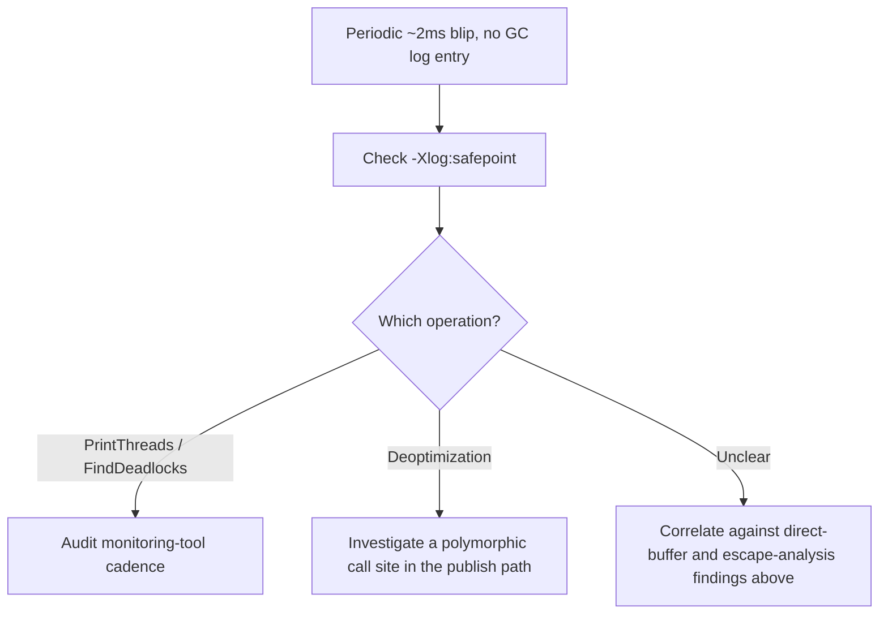

# Architecture Atlas: JVM Tuning Playbook for a Market-Data Service

**Delivered as a timed, 45-minute exercise producing a JVM tuning playbook for a sub-millisecond-p99 latency target — a domain-specific operational deliverable, not a request/response system design. This entry adapts the Atlas template accordingly: no data model, API surface, or consistency model sections.**

## Table of Contents

1. [Problem Statement](#problem-statement)
2. [Constraints](#constraints)
3. [Design Dimensions](#design-dimensions)
4. [Reference Analysis](#reference-analysis)
5. [Diagnostic Flow for the Unexplained Latency Blip](#diagnostic-flow-for-the-unexplained-latency-blip)
6. [Trade-offs](#trade-offs)
7. [Alternatives Considered](#alternatives-considered)
8. [Staff-Level Discussion](#staff-level-discussion)
9. [Interview Presentation Sequence](#interview-presentation-sequence)

---

## Problem Statement

Produce a JVM tuning playbook for a market-data distribution service: it ingests a high-volume price-tick stream, maintains an in-memory symbol-to-latest-price cache (currently a `WeakHashMap`, on the assumption this keeps memory bounded automatically), parses each tick using small, short-lived value objects, and publishes updates to subscribers over NIO sockets. It currently runs on G1 with a container memory limit set exactly equal to `-Xmx`. Leadership wants sub-millisecond p99 publish latency; a recent capacity review flagged "higher than expected" memory usage with no further explanation.

## Constraints

- Sub-millisecond p99 publish latency is the explicit target.
- `WeakHashMap` used as the price cache under the assumption it bounds memory automatically.
- Container memory limit set exactly equal to `-Xmx`.
- Publish path uses NIO sockets.
- A recent capacity review flagged unexplained excess memory usage.
- Ops reports a periodic ~2ms latency blip with nothing in the GC logs at that timestamp.

## Design Dimensions

1. Whether `WeakHashMap` is the right tool for a bounded price cache.
2. The concern with a container memory limit set equal to `-Xmx`.
3. Whether G1 is the right collector for a sub-millisecond p99 target.
4. Whether the tick-parsing value objects are a real GC concern.
5. What to check about the NIO publish path's buffer usage.
6. What to check for the unexplained, GC-log-silent latency blip.

## Reference Analysis

**The `WeakHashMap` cache.** Likely the wrong tool. Per [GC Roots, Reachability, and Reference Strength](../syllabus/02-java/jvm-internals/gc-roots-reachability-and-reference-strength.md), `WeakHashMap` clears entries immediately once a key becomes otherwise unreachable, with no memory-pressure consideration at all — it is not a "keep memory bounded, evict under pressure" mechanism. If any code path incidentally holds a strong reference to symbol keys elsewhere, entries may persist indefinitely regardless of the map's "weak" name, producing exactly the unpredictable behavior a naive reading of "weak = bounded" wouldn't expect. Recommend a `SoftReference`-backed structure (genuinely pressure-aware) or, more robustly, a purpose-built bounded cache with an explicit eviction policy and size limit — not relying on either reference-strength type as an implicit capacity-management mechanism.

**Container memory limit.** `-Xmx` never bounded the process's total memory usage, per [Native Memory, Direct Buffers, and Off-Heap](../syllabus/02-java/jvm-internals/native-memory-direct-buffers-and-off-heap.md) — thread stacks, metaspace, JIT code cache, and (given the NIO publish path) very possibly direct-buffer memory all live outside it. Before the next capacity review, run the service under load with `-XX:NativeMemoryTracking=summary` and capture a `jcmd VM.native_memory summary` snapshot, checking the `Other` category specifically for direct-buffer usage from the NIO layer — very likely a meaningful, currently-unaccounted contributor to the flagged "higher than expected" usage.

**Collector choice for sub-millisecond p99.** G1's pause times, even well-tuned, scale somewhat with live-data volume, per [ZGC and Shenandoah: Concurrent Collection](../syllabus/02-java/jvm-internals/zgc-and-shenandoah-concurrent-collection.md) — worth measuring G1's actual current p99 GC-attributable latency against the sub-millisecond target before assuming a change is needed. If G1 genuinely can't meet it, ZGC is the natural next step given its real, measured microsecond-range stop-the-world pauses. Critically, any ZGC migration must come with re-provisioned heap headroom, informed by real allocation-stall monitoring during a load test — not a straight collector swap with the existing G1-era heap sizing, or the service risks trading GC pauses for allocation stalls, a different but comparably real latency cost.

**Tick-parsing value objects.** Likely not a real concern, and worth confirming before "optimizing." Per [Escape Analysis and Scalar Replacement](../syllabus/02-java/jvm-internals/escape-analysis-and-scalar-replacement.md), if these value objects are created, used to extract primitive fields, and discarded within the parsing method with no reference surviving (never stored, never returned as the object itself, never passed to an un-inlined call), the JIT's escape analysis very likely eliminates the allocation entirely once the hot parsing path is compiled. Confirm via a real GC-pause-count comparison with `-XX:-DoEscapeAnalysis` against the default — the same measurement technique that chapter demonstrates directly — rather than assuming manual pooling is needed.

**NIO publish path.** Confirm the publish path uses direct `ByteBuffer`s specifically for socket-write operations, per Native Memory, Direct Buffers, and Off-Heap — this is exactly the I/O-specific scenario where direct buffers provide a real benefit (eliminating a heap-to-native copy before the OS-level write). If it already does, that's very likely the source of the direct-memory usage flagged above, not a bug — it needs its own explicit `-XX:MaxDirectMemorySize` budget and NMT-informed monitoring, not removal.

**Unexplained 2ms blip, no GC log entry.** Check `-Xlog:safepoint`, not just `-Xlog:gc`, per [Safepoints and Stop-the-World Mechanics](../syllabus/02-java/jvm-internals/safepoints-and-stop-the-world-mechanics.md) — the blip is very plausibly a real, non-GC safepoint operation (a periodic monitoring agent's thread dump, a deoptimization from a polymorphic call site somewhere in the publish path, or similar), invisible to GC-log-only monitoring. Once the safepoint log identifies the specific operation, the investigation redirects to that operation's actual trigger, rather than continuing to search GC logs for a cause that isn't there.

## Diagnostic Flow for the Unexplained Latency Blip

## Trade-offs

| Decision | Benefit | Cost |
|---|---|---|
| `SoftReference`/purpose-built bounded cache over `WeakHashMap` | Genuine, predictable memory-pressure-aware eviction | An explicit eviction policy to design and maintain |
| Measuring G1's p99 before migrating to ZGC | Avoids an unnecessary migration if G1 already meets the SLO | Requires real load-test measurement before any collector decision |
| Re-provisioning heap headroom for any ZGC migration | Avoids trading GC pauses for allocation stalls | Real additional heap cost beyond the prior G1 sizing |
| Explicit `-XX:MaxDirectMemorySize` for the NIO path | Direct memory becomes a deliberate, monitored budget | An extra budget to size and monitor beyond `-Xmx` |

## Alternatives Considered

- **Switching directly to ZGC without measuring G1's current p99 first.** Rejected: this is exactly the reflexive-optimization anti-pattern both the escape-analysis and collector-choice chapters warn against — a measured baseline is required before concluding a change is needed at all.
- **Removing direct buffers from the NIO publish path to "reduce memory usage."** Rejected: direct buffers are the correct tool for this exact I/O-specific scenario; removing them would reintroduce a heap-to-native copy on every socket write, trading real memory-usage transparency for a real, measurable latency regression.
- **Manually pooling the tick-parsing value objects preemptively.** Rejected without measurement — per the escape-analysis chapter's own evidence, this is very likely solving a problem the JIT has already eliminated for free, at the cost of real code-complexity.

## Staff-Level Discussion

Three of this playbook's six answers ("likely not a real concern," "very likely already the source," "very plausibly a real, non-GC safepoint operation") are explicitly hedged toward *measurement* rather than an assumed fix — this is deliberate, not uncertainty for its own sake. A Staff engineer facing a "higher than expected" or "unexplained" finding treats every plausible explanation as a hypothesis to confirm via a specific, named diagnostic (NMT, `-XX:-DoEscapeAnalysis`, `-Xlog:safepoint`), not a story to accept on first plausibility. The service's own sub-millisecond p99 requirement raises the stakes of guessing wrong: a collector migration undertaken without first measuring G1's actual baseline, or a cache rewrite undertaken without confirming the `WeakHashMap` is actually the memory driver, risks spending real engineering effort on the wrong fix while the actual latency-budget risk (allocation stalls, an unaccounted direct-memory budget) goes unaddressed.

## Interview Presentation Sequence

Present in the order the six design dimensions were posed: the cache correctness question first (it's the most structurally wrong assumption in the scenario), then the memory-accounting gap, then the collector-choice question, then the allocation question, then the NIO buffer question, then the diagnostic-methodology question for the unexplained blip — each dimension building on the JVM chapters this program covers across Weeks 16 and 19. A self-verification exit check: correctly identified `WeakHashMap` as unsuited for pressure-aware bounded caching, with a specific, better alternative named; connected "higher than expected" memory to `-Xmx` not bounding total process memory, with NMT proposed as the specific diagnostic tool; treated collector choice as measurement-driven, with heap-headroom re-provisioning named explicitly as a required part of any ZGC migration; proposed measuring (not assuming) whether the tick-parsing objects are a real concern, naming the specific `-XX:-DoEscapeAnalysis` technique; connected the NIO publish path to direct-buffer usage as a plausible, expected source requiring its own explicit budget; proposed `-Xlog:safepoint` specifically for the unexplained blip, not continued GC-log searching.
