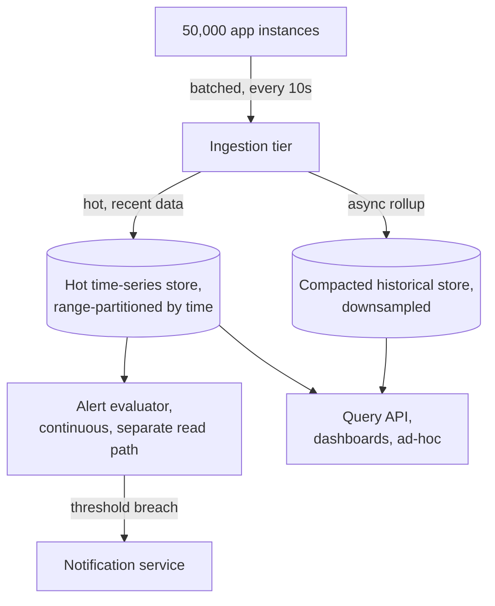

# Architecture Atlas: Metrics/Monitoring System

**Delivered as a timed, 45-minute exercise using [System Design Method and Estimation](../syllabus/11-system-design/system-design-method-and-estimation.md)'s six-phase method.**

## Table of Contents

1. [Problem Statement](#problem-statement)
2. [Constraints](#constraints)
3. [Functional Requirements](#functional-requirements)
4. [Non-Functional Requirements](#non-functional-requirements)
5. [Capacity Assumptions](#capacity-assumptions)
6. [Architecture Diagram](#architecture-diagram)
7. [Data Model](#data-model)
8. [APIs](#apis)
9. [Request Flow](#request-flow)
10. [Consistency Model](#consistency-model)
11. [Scaling Strategy](#scaling-strategy)
12. [Reliability Strategy](#reliability-strategy)
13. [Security, Observability, and Cost](#security-observability-and-cost)
14. [Trade-offs](#trade-offs)
15. [Alternatives Considered](#alternatives-considered)
16. [Staff-Level Discussion](#staff-level-discussion)
17. [Interview Presentation Sequence](#interview-presentation-sequence)

---

## Problem Statement

Design a system that ingests time-series metrics (counters, gauges, histograms) from thousands of application instances, supports aggregation queries (rate, percentiles, sums over time windows), and alerts when a query result crosses a threshold. The central tension is the write path — millions of individual metric points arriving continuously — versus the read path, where percentile aggregation specifically is expensive to compute correctly, not just to store.

## Constraints

**In scope:** metric ingestion, aggregation queries, threshold-based alerting. **Explicitly out of scope for this exercise:** distributed tracing and log aggregation — metrics, traces, and logs are complementary systems, not one unified system, and naming that boundary explicitly is itself part of a strong Phase 1 answer.

## Functional Requirements

- Ingest counter, gauge, and histogram metrics from application instances.
- Support aggregation queries: rate, sum, and percentiles (p50, p99, etc.) over a time window.
- Evaluate alert conditions continuously and fire notifications on threshold breach.

## Non-Functional Requirements

- The write path must sustain continuous, extremely high-volume ingestion.
- Alert evaluation has a strict latency requirement (fire within ~1 minute of a real breach) that must not be affected by slower ad-hoc dashboard queries.
- Percentile queries must be computed correctly across instances and time windows — averaging pre-aggregated percentiles from different sources produces a mathematically wrong result.

## Capacity Assumptions

```
Assumption: 50,000 application instances, each emitting ~200 distinct
            time series (per-endpoint rate/error/duration -- RED,
            per-resource utilization/saturation -- USE), each reporting
            every 10 seconds
            -> 50,000 * 200 / 10s = 1,000,000 data points/s ingested
Assumption: histogram-type metrics (for percentile queries) are the
            expensive case -- a naive design storing every raw
            observation for later percentile computation at query time
            would need to retain individual latency samples, not just
            aggregates, directly colliding with the well-established
            point that percentiles can't be correctly computed by
            averaging pre-aggregated percentiles from different instances.
Assumption: alert evaluation needs to run continuously against recent
            data -- this is a SEPARATE read path from ad-hoc dashboard
            queries, with a different latency requirement (alerts need
            to fire within ~1 minute of a real threshold breach;
            dashboard queries can tolerate a few seconds).
```

## Architecture Diagram



**Justified against this design's own topics:**

- **Histogram sketches, not raw samples, for the write path:** follows directly from [Percentiles, Tail Latency, and Coordinated Omission](../syllabus/13-observability/percentiles-tail-latency-and-coordinated-omission.md)'s lesson that percentiles can't simply be averaged across instances/windows the way a sum or rate can — storing every raw latency observation from 50,000 instances indefinitely would collide with the ingestion volume within days; a mergeable sketch (HdrHistogram/t-digest) is the standard fix, trading small, bounded accuracy loss for genuinely feasible storage.
- **A separate, fast alert-evaluation path, not the same query path as dashboards** (the resilience-pattern bulkhead principle): an ad-hoc, expensive percentile dashboard query must never slow down or starve alert evaluation, since a delayed alert during a real incident is directly worse than a slow dashboard — the same bulkhead-isolation reasoning applied to a monitoring system's own internal architecture, not just an external dependency.
- **Time-based range partitioning for the hot store, not hash partitioning** (explicit contrast with [Table Partitioning and Sharding Strategies](../syllabus/06-databases/table-partitioning-and-sharding-strategies.md)): time-series queries are almost always range queries over a time window ("last 1 hour," "last 7 days"), which range partitioning serves directly with pruning (skip partitions outside the queried range) — hash partitioning by time would destroy that locality, the same partitioning lesson applied to choosing the right scheme for this dominant access pattern.

## Data Model

**Write path: time-series storage,** partitioned by time (recent data hot, older data rolled up and compacted) — the same range-partitioning approach as any inherently time-ordered dataset, exactly the natural fit range partitioning is good at (unlike a business-key-hashed table, time-series data has an inherent, queryable order hash partitioning would destroy). **Histograms specifically need pre-aggregated sketches** (e.g., HdrHistogram or t-digest), not raw samples retained forever — the direct fix for the percentile-computation concern: a sketch can be merged across instances and time windows while still supporting reasonably accurate percentile queries, without retaining every observation indefinitely. **Alert state:** which alerts are currently firing, since when — needs its own small, low-latency store, decoupled from the bulk time-series data, since alert evaluation must stay fast regardless of how large the historical metrics store has grown.

## APIs

```
POST /ingest        {series: "http.duration", tags: {service, endpoint},
                      timestamp, value} -> 202 Accepted (fire-and-forget
                      from the client's perspective, per-instance batched)
GET /query           {series, tags?, aggregation: rate|sum|p50|p99|...,
                       from, to, step} -> [{timestamp, value}, ...]
POST /alerts         {series, tags?, condition, threshold, forDuration}
                      -> {alertId}
```

## Request Flow

1. Each application instance batches its ~200 distinct time series into a single ingest request every 10 seconds, rather than 200 separate requests.
2. The ingestion tier writes into the hot, time-partitioned store and asynchronously rolls up older data into a compacted, downsampled cold store.
3. Dashboard/ad-hoc queries hit the Query API, which reads from the hot store for recent data and the cold store for historical ranges.
4. The alert evaluator continuously reads from the hot store on its own dedicated path, independent of dashboard query load, and fires notifications on threshold breach.

## Consistency Model

Metric ingestion is treated as fire-and-forget from the client's perspective (a `202 Accepted` response, no strong delivery guarantee to the client beyond that) — occasional data-point loss is an acceptable trade-off for sustaining the ingestion volume. Alert evaluation reads from the hot store with low latency requirements but does not need strict read-after-write consistency with the most recent ingest — a few seconds of lag is acceptable given the ~1-minute alert-firing budget.

## Scaling Strategy

The ingestion tier scales primarily through client-side batching (each instance batches its own series rather than sending them individually), which is what makes the 1,000,000 points/s volume tractable at all. The hot/cold store split lets the system scale storage cost down over time (compaction and downsampling for older data) without sacrificing recent-data query performance, and the read path splits alert evaluation from dashboard queries so each scales independently against its own latency budget.

## Reliability Strategy

1. **The ingestion tier is the system's own extreme case of write-heavy load** (1,000,000 points/s). Batching per-instance (each app instance batches its own 200 series into one request per 10s interval, not 200 separate requests) is what makes this volume tractable at all — the same batching-for-throughput reasoning that applies to any high-volume producer.
2. **A cardinality explosion in tags is a specific, distinct failure mode from raw ingestion volume.** If a tag value is high-cardinality (e.g., accidentally tagging metrics by a raw user ID instead of a bounded dimension like `service`/`endpoint`), the number of distinct time series can explode combinatorially, each needing its own storage and index entry — a genuinely different problem from "too many data points"; no amount of ingestion-tier scaling fixes a cardinality problem, it requires enforcing bounded-cardinality tags at the client/schema level.
3. **The alert evaluator itself needs monitoring** — the same "who watches the watcher" problem as any system whose entire purpose is detecting failure elsewhere. If the alert evaluator's own query against the hot store starts timing out (e.g., the hot store is under unusual load), alerts silently stop firing at exactly the moment something else is also going wrong. Mitigation: a simple, separate heartbeat/dead-man's-switch check confirming the alert evaluator itself is still running and successfully evaluating, alerting if that check goes silent.

## Security, Observability, and Cost

Not addressed in this 45-minute exercise, which was deliberately scoped to the ingestion/query/alerting problem (see Constraints). A full treatment would need, at minimum: authentication on the ingest endpoint (preventing arbitrary metric injection), access control on which teams can query/alert on which series, metrics on the metrics system's own ingestion lag and query latency, and a cost model for hot-store retention duration versus compaction/downsampling aggressiveness. These are flagged here as explicit gaps rather than invented to fill out the template — including the recursive irony that a monitoring system's own observability was itself out of scope for this exercise.

## Trade-offs

| Decision | Benefit | Cost |
|---|---|---|
| Client-side batching before ingest | Makes 1,000,000 points/s tractable at the ingestion tier | Slightly delayed visibility (up to the batch interval) for the most recent data point |
| Histogram sketches instead of raw samples | Feasible storage at scale, mergeable across instances/windows | Small, bounded accuracy loss on percentile queries |
| Separate alert-evaluation read path | Alerts stay fast and reliable regardless of dashboard query load | More architectural surface — two read paths to build and operate instead of one |
| Time-based range partitioning | Efficient pruning for the dominant "recent time window" access pattern | Poor fit if a genuinely different access pattern (e.g., cross-time-window aggregation by a non-time key) became dominant |

## Alternatives Considered

- **Storing raw histogram observations for later percentile computation.** Rejected: collides directly with the ingestion volume — retaining every individual latency sample from 50,000 instances is not feasible storage at this scale, and sketches provide a bounded-accuracy alternative that is.
- **One shared read path for both dashboards and alert evaluation.** Rejected: an expensive ad-hoc percentile query could delay alert evaluation, and a delayed alert during a real incident is a worse outcome than a slow dashboard.
- **Hash-partitioning the hot store by a business key instead of time.** Rejected: time-series queries are overwhelmingly range queries over a time window, which hash partitioning cannot prune efficiently — the wrong partitioning scheme for this system's dominant access pattern.

## Staff-Level Discussion

The cardinality-explosion bottleneck is the sharpest Staff-level signal in this design: it looks superficially like the same problem as raw ingestion volume ("too much data"), but it's a structurally different failure with a structurally different fix — no amount of scaling the ingestion tier addresses a client tagging metrics by an unbounded dimension, because the fix has to happen at the schema/client-enforcement level, not the storage layer. Recognizing that two symptoms which look similar on the surface (both eventually manifest as "the metrics system is struggling") can have entirely different root causes and require entirely different fixes is a recurring Staff-level pattern, not unique to this system.

## Interview Presentation Sequence

Delivered as a timed, 45-minute exercise using the six-phase method's own stated budget — see [Time-Boxing and Mid-Round Changes](../syllabus/20-interview-preparation/system-design/time-boxing-and-mid-round-changes.md) for the live-delivery discipline of running this inside the clock. A self-verification exit check for this specific problem: all six phases completed within 45 minutes; histogram-sketch storage justified explicitly against the percentile-computation lesson, not just asserted as a design choice; time-based range partitioning chosen and explicitly contrasted with a hash-partitioned alternative — the same underlying topic (partitioning), a different correct choice for this system's actual access pattern; and cardinality explosion named as a distinct failure mode from raw ingestion volume, with a different fix (bounded tags, not more scaling).
