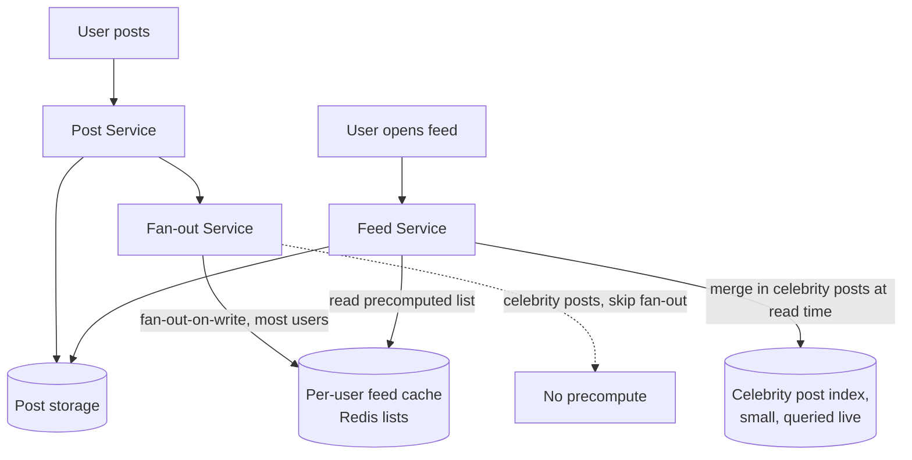

# Architecture Atlas: News Feed System

**Delivered as a timed, 45-minute exercise using [System Design Method and Estimation](../handbook/system-design/system-design-method-and-estimation.md)'s six-phase method. Caching and fan-out are mandatory discussion points.**

## Table of Contents

1. [Problem Statement](#problem-statement)
2. [Constraints](#constraints)
3. [Functional Requirements](#functional-requirements)
4. [Non-Functional Requirements](#non-functional-requirements)
5. [Capacity Assumptions](#capacity-assumptions)
6. [Architecture Diagram](#architecture-diagram)
7. [Data Model](#data-model)
8. [APIs](#apis)
9. [Request Flow](#request-flow)
10. [Consistency Model](#consistency-model)
11. [Scaling Strategy](#scaling-strategy)
12. [Reliability Strategy](#reliability-strategy)
13. [Security, Observability, and Cost](#security-observability-and-cost)
14. [Trade-offs](#trade-offs)
15. [Alternatives Considered](#alternatives-considered)
16. [Staff-Level Discussion](#staff-level-discussion)
17. [Interview Presentation Sequence](#interview-presentation-sequence)

---

## Problem Statement

Design a system where users follow other users and see a roughly reverse-chronological feed of recent posts from the people they follow — an overwhelmingly read-heavy system where feed views vastly outnumber posts created.

## Constraints

**In scope:** follow relationships, posting, and a chronological feed. **Explicitly out of scope for this exercise:** the ranking/relevance algorithm's internals, ads, and comments — each is a substantial extension that would change the shape of this design if included, and naming them as deliberately excluded is itself part of a strong Phase 1 answer.

## Functional Requirements

- A user can follow another user.
- A user can create a post.
- A user's feed shows recent posts from people they follow, roughly reverse-chronological.

## Non-Functional Requirements

- Read-heavy at a ratio that should be stated as a number, not a vague "reads dominate" — see Capacity Assumptions.
- Feed reads need low latency; a slower write path is an acceptable trade for a fast, precomputed read path.
- A small fraction of users (celebrities, very high follower counts) break the assumptions the rest of the design is optimized around, and need to be handled as an explicit exception rather than forcing the whole design toward their worst case.

## Capacity Assumptions

```
Assumption: 50M DAU, average 20 feed views/day
Read QPS = (50,000,000 x 20) / 86,400 ~= 11,570/s average
Peak (3x) ~= 34,700/s

Assumption: 5M posts/day
Write QPS = 5,000,000 / 86,400 ~= 58/s average -- read:write ratio is roughly 200:1

Assumption: 1% of users are "celebrities" with >1M followers each
This 1% drives a disproportionate share of fan-out cost per post (see Reliability Strategy).
```

The read:write ratio (≈200:1) is the single number that most justifies caching here — it's stated explicitly in Capacity Assumptions specifically so the architecture's "we need a cache" is a traceable consequence of this number, not a reflex.

## Architecture Diagram



**Justified against the capacity numbers:** a 200:1 read:write ratio justifies precomputing feeds at write time (fan-out-on-write) for most users, since the cost of updating N followers' cached feeds on one post is paid once and amortized across every subsequent read — but this inverts for the 1% celebrity case, which is exactly why the architecture splits fan-out strategy by follower count rather than applying one approach uniformly.

## Data Model

**Posts:** relational or wide-column, keyed by post ID, indexed by author + created_at. **Follow graph:** a dedicated store optimized for "who does X follow" and "who follows X" — at this scale, a graph-shaped access pattern, though often implemented on a relational store with the right indexes rather than a dedicated graph database, per [Storage Selection Trade-offs](../handbook/system-design/storage-selection-tradeoffs.md)'s method: work from the access pattern, not technology reputation. **Feed cache:** a per-user precomputed list of post IDs, not full post content — content is fetched separately, keeping the feed cache small and fast to update.

## APIs

```
GET  /feed?cursor={cursor}&limit=20   -- keyset pagination, per API Design
POST /posts                            {content}
POST /follow/{userId}
```

## Request Flow

1. A user creates a post via the Post Service, which persists it and hands off to the Fan-out Service.
2. For a non-celebrity author, the Fan-out Service writes the new post's ID into every follower's feed cache (fan-out-on-write).
3. For a celebrity author, the Fan-out Service deliberately skips precomputation and relies on the Feed Service merging their posts in at read time instead.
4. When a user opens their feed, the Feed Service reads the precomputed list from the feed cache, merges in any celebrity posts live, and fetches full post content from Post storage for the returned IDs.

## Consistency Model

The feed is not required to be perfectly consistent in real time — a post appearing in a follower's feed a few seconds after it was created is an acceptable trade-off for the throughput this design needs. Post storage itself is strongly consistent (a post, once created, has a durable, unambiguous record); the feed cache is an eventually-consistent, precomputed view over that data.

## Scaling Strategy

The dominant scaling lever is the fan-out strategy split by follower count: fan-out-on-write for the ~99% of users with modest follower counts (bounded write amplification), fan-out-on-read for the ~1% celebrity case (bounded read cost, avoiding a catastrophic write spike). This directly reuses the reasoning from [Caching Strategies and Invalidation](../handbook/system-design/caching-strategies-and-invalidation.md): the right invalidation/precomputation strategy depends on the actual access pattern, not a single default applied everywhere.

## Reliability Strategy

1. **Celebrity fan-out cost.** A post from a user with 10M followers, if fanned out on write, means 10M feed-cache writes for one post — a write amplification the read:write ratio doesn't justify for this specific case. Mitigation: hybrid fan-out — skip precomputation for high-follower-count authors, merging their posts into a follower's feed at read time instead, accepting slightly higher per-read cost for a rare case in exchange for avoiding a catastrophic write spike.
2. **Feed cache stampede on a viral post.** If a post suddenly goes viral and many users' feed caches expire or need updating near-simultaneously, this is exactly the cache-stampede mechanism from [Caching Strategies and Invalidation](../handbook/system-design/caching-strategies-and-invalidation.md) — the mitigation (single-flight coalescing, or avoiding TTL-based invalidation for this specific cache in favor of explicit updates) is directly reused, not reinvented.
3. **Deep pagination on a long-lived feed session.** A user scrolling far back should use keyset pagination, not `OFFSET`, or the same order-of-magnitude cost measured in [API Design](../handbook/system-design/api-design.md)'s pagination comparison applies directly here.

## Security, Observability, and Cost

Not addressed in this 45-minute exercise, which was deliberately scoped to the read-heavy feed/fan-out problem (see Constraints). A full treatment would need, at minimum: authorization on the follow graph and post visibility (private accounts, blocked users), metrics on fan-out latency and feed-cache hit rate per follower-count bucket, and a cost model comparing fan-out-on-write's storage/compute footprint against fan-out-on-read's per-request cost at the celebrity boundary. These are flagged here as explicit gaps rather than invented to fill out the template.

## Trade-offs

| Decision | Benefit | Cost |
|---|---|---|
| Fan-out-on-write for most users | Feed reads are cheap — just read a precomputed list | Write amplification proportional to follower count; unbounded for very high follower counts |
| Fan-out-on-read for celebrities | Bounds write cost regardless of follower count | Slightly higher per-read cost when a celebrity is followed |
| Feed cache stores post IDs, not full content | Small, fast-to-update cache | An extra fetch to Post storage on every feed read |

## Alternatives Considered

- **Pure fan-out-on-write for every user, including celebrities.** Rejected: a single post from a 10M-follower account would trigger 10M cache writes, a write spike the read:write ratio doesn't justify and the system isn't sized for.
- **Pure fan-out-on-read for every user.** Rejected: at a 200:1 read:write ratio, computing every feed live on every read would be far more expensive in aggregate than precomputing for the 99% of users where write amplification is bounded and cheap.

## Staff-Level Discussion

The single most important modeling decision here is recognizing that "fan-out strategy" is not one global choice — it's a per-author decision that should be driven by a measured threshold (follower count), not applied uniformly. Treating the celebrity case as an exception to design for explicitly, rather than discovering it as an afterthought during bottleneck analysis, is what separates a design that degrades gracefully under a real, skewed distribution from one that only works under an idealized uniform assumption. This is a recurring pattern worth generalizing: any system with a power-law-distributed access pattern (a small number of entities receiving a disproportionate share of load) usually needs an explicit split strategy, not a single mechanism tuned for the median case.

## Interview Presentation Sequence

Delivered as a timed, 45-minute exercise using the six-phase method's own stated budget — see [Time-Boxing and Mid-Round Changes](../interview-playbook/system-design/time-boxing-and-mid-round-changes.md) for the live-delivery discipline of running this inside the clock. A self-verification exit check for this specific problem: all six phases completed within 45 minutes; fan-out discussed explicitly, including the celebrity-case trade-off (fan-out-on-write vs. fan-out-on-read), not just one approach; caching traced back to the 200:1 read:write ratio; and at least one reliability concern explicitly connected to a specific named mechanism (cache stampede, keyset pagination) rather than a generic "add more caching."
