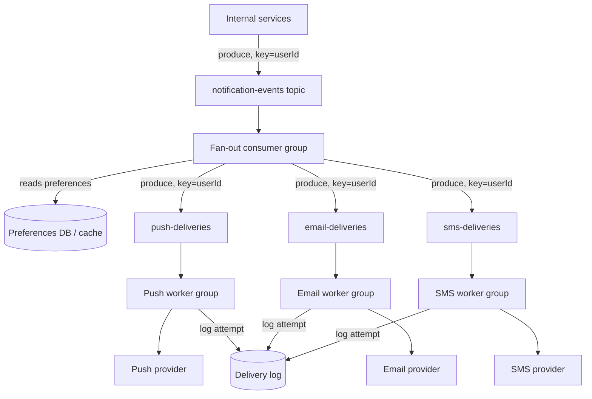

# Architecture Atlas: Notification System

**Delivered as a timed, 45-minute exercise using [System Design Method and Estimation](../syllabus/11-system-design/system-design-method-and-estimation.md)'s six-phase method.**

## Table of Contents

1. [Problem Statement](#problem-statement)
2. [Constraints](#constraints)
3. [Functional Requirements](#functional-requirements)
4. [Non-Functional Requirements](#non-functional-requirements)
5. [Capacity Assumptions](#capacity-assumptions)
6. [Architecture Diagram](#architecture-diagram)
7. [Data Model](#data-model)
8. [APIs](#apis)
9. [Request Flow](#request-flow)
10. [Consistency Model](#consistency-model)
11. [Scaling Strategy](#scaling-strategy)
12. [Reliability Strategy](#reliability-strategy)
13. [Security, Observability, and Cost](#security-observability-and-cost)
14. [Trade-offs](#trade-offs)
15. [Alternatives Considered](#alternatives-considered)
16. [Staff-Level Discussion](#staff-level-discussion)
17. [Interview Presentation Sequence](#interview-presentation-sequence)

---

## Problem Statement

Design a system that accepts a notification event from any internal service (order shipped, password changed, comment reply), fans it out to the channels a user has enabled (push, email, SMS), and respects per-user preferences and rate limits. This is a fan-out and delivery-guarantee problem, not a storage problem — the interesting decisions are about how events flow, not schema design.

## Constraints

**In scope:** accept, fan out, respect preferences and rate limits. **Explicitly out of scope for this exercise:** the actual push/email/SMS provider integrations (treated as external APIs) and a rich templating engine — naming them as deliberately excluded is itself part of a strong Phase 1 answer.

## Functional Requirements

- Accept a notification event from any internal caller.
- Fan the event out to every channel the user has enabled for that event type.
- Respect per-user notification preferences.
- Support a status lookup for a given notification's delivery state.

## Non-Functional Requirements

- The caller must not block on actual delivery, which may retry over seconds to minutes.
- One user's notifications must process in relative order — a "password changed" notification must never be delivered after a later "password change reverted" for the same user, even under retries and rebalances.
- A slow or down delivery channel (e.g., a degraded SMS provider) must not affect delivery on the other channels.
- Delivery must never be silently dropped, even at the cost of an occasional duplicate.

## Capacity Assumptions

```
Assumption: 20M DAU, average 3 notification-triggering events/user/day
            -> 60M events/day -> ~700 events/s average, ~2,100/s peak (3x)
Assumption: each event fans out to up to 3 channels (push+email+SMS)
            -> up to 6,300 downstream delivery attempts/s peak
Assumption: a viral/breaking-change event (e.g., a mass password-reset
            trigger) can spike a single event TYPE by 50x briefly.

The fan-out multiplier (1 event -> up to 3 deliveries) and the spike
tolerance requirement are the two numbers that should drive partitioning
and consumer-group sizing decisions in the architecture.
```

## Architecture Diagram



**Justified against this design's own topics:**

- **Partition key = `userId`, throughout every topic in the pipeline.** Guarantees one user's notifications process in order relative to each other, per [Kafka Architecture Fundamentals](../syllabus/09-messaging-event-driven/kafka-architecture-fundamentals.md)'s per-partition ordering guarantee — a "password changed" notification must never be delivered after a later "password change reverted" for the same user, even under retries and rebalances.
- **A per-channel topic downstream of a single fan-out consumer,** rather than one worker doing all three deliveries inline, isolates a slow/down channel (e.g., a degraded SMS provider) from the other two — push and email consumer groups keep draining independently, only SMS backs up.
- **Delivery is at-least-once, deliberately,** per [Delivery Semantics and Exactly-Once](../syllabus/09-messaging-event-driven/delivery-semantics-and-exactly-once.md): each worker commits its offset after a provider call succeeds, not before, so a crash mid-delivery redelivers the notification. Trades an occasional duplicate push (annoying) for never silently dropping one (unacceptable for "your payment failed").
- **The delivery log doubles as the idempotency boundary,** per [Idempotency at System Edges](../syllabus/11-system-design/idempotency.md): each worker checks `(notificationId, channel)` against the log before calling the provider, so at-least-once redelivery from Kafka doesn't become an actually-duplicate SMS — the dedupe check converts a non-idempotent action into an idempotent one.

## Data Model

**User preferences:** relational or key-value, read on every event (high read, low write — cache aggressively). **Delivery log:** append-only, one row per `(notificationId, channel)` attempt, used for the status endpoint and idempotency checks on retry. The event stream itself is not "stored" as a queryable table — Kafka topics are the transport, not the system of record for delivery state; the delivery log is.

## APIs

```
POST /notifications/send
  {userId, type, payload, channels?: [push|email|sms]}
  -> 202 Accepted {notificationId}
  (fire-and-forget from the caller's perspective -- the caller does not
  block on actual delivery, which may retry over seconds to minutes)

GET /notifications/{id}/status -> {delivered: [...], failed: [...], pending: [...]}
PUT /users/{id}/notification-preferences {channels enabled per type}
```

## Request Flow

1. An internal service produces a notification event to `notification-events`, keyed by `userId`.
2. The fan-out consumer group reads the event, looks up the user's channel preferences, and produces one message per enabled channel to that channel's own topic (also keyed by `userId`).
3. Each channel's worker group consumes from its own topic, calls the external provider, and — only after the provider call succeeds — commits its offset and logs the attempt in the delivery log.
4. A client can poll `GET /notifications/{id}/status` to see delivered/failed/pending state, sourced from the delivery log.

## Consistency Model

Delivery is deliberately at-least-once, not exactly-once: a crash between a provider call succeeding and the offset commit produces a redelivery, which the delivery-log idempotency check absorbs before it reaches the provider a second time. Preference reads are eventually consistent with preference writes (cached aggressively, given the high-read/low-write pattern) — a preference change taking a few seconds to propagate to the fan-out consumer's cache is an acceptable trade-off for read throughput.

## Scaling Strategy

The per-channel topic split is the primary scaling lever: push, email, and SMS consumer groups scale independently based on their own provider's throughput and reliability, rather than being coupled through a single worker handling all three. Partitioning by `userId` throughout keeps per-user ordering intact while still allowing horizontal scaling of consumer group size up to the partition count.

## Reliability Strategy

1. **A single hot user isn't the risk here — a single hot event type is.** A mass-triggering event (e.g., a security incident forcing 5M simultaneous password-reset notifications) doesn't concentrate on one partition the way a busy customer would — it's already spread across all users' keys. The real bottleneck is downstream: the push/email/SMS provider's own rate limits, which worker groups must respect via a token-bucket limiter rather than the partitioning scheme.
2. **Preference-DB read load.** Every event triggers a preferences lookup in the fan-out consumer; at 2,100 events/s peak this is a straightforward cache-in-front-of-DB problem, worth naming as the one place a slow dependency directly throttles the pipeline's consumer lag.
3. **Consumer lag as an SLO, not just a metric.** A growing lag on the SMS topic during a provider outage is expected and should page differently than a growing lag on the fan-out topic itself, which means the whole pipeline is falling behind — alerting has to distinguish "one channel degraded" from "the pipeline degraded."

## Security, Observability, and Cost

Not addressed in this 45-minute exercise, which was deliberately scoped to the fan-out/delivery-guarantee problem (see Constraints). A full treatment would need, at minimum: authentication on the internal `/notifications/send` endpoint (any internal caller should not mean any unauthenticated caller), PII handling for notification payloads containing user data, metrics on per-channel delivery success rate and consumer lag by topic, and a cost model for provider fees at peak fan-out volume (up to 6,300 delivery attempts/s). These are flagged here as explicit gaps rather than invented to fill out the template.

## Trade-offs

| Decision | Benefit | Cost |
|---|---|---|
| Per-channel topics downstream of one fan-out consumer | A degraded channel doesn't back up the others | More topics and consumer groups to operate |
| At-least-once delivery, offset committed after provider success | Never silently drops a notification | Occasional duplicate delivery (mitigated by the idempotency check) |
| `userId` as partition key throughout | Per-user ordering guarantee preserved end-to-end | Caps parallelism at partition count; a single extremely active user's events still serialize |

## Alternatives Considered

- **One worker performing all three deliveries inline per event.** Rejected: couples the three channels' throughput and failure characteristics together — a degraded SMS provider would back up push and email delivery too, instead of only its own channel.
- **Exactly-once delivery via a distributed transaction across Kafka and the provider call.** Rejected: the provider is an external system outside the platform's transactional boundary; at-least-once plus an idempotency check at the delivery log achieves the same practical outcome (no duplicate real-world delivery) without needing end-to-end exactly-once machinery.
- **Partitioning by event type instead of `userId`.** Rejected: would destroy the per-user ordering guarantee (Non-Functional Requirements), since a user's different event types would land on different partitions with no relative ordering between them.

## Staff-Level Discussion

The most instructive bottleneck in this design is the explicit distinction between a "hot partition" (one busy customer overloading one partition) and a "hot event type" (a mass-triggering event spread evenly across all users' partitions, but overwhelming a downstream provider's rate limit regardless of even partition distribution). These look superficially similar — both are described as "the system gets overloaded" — but they have different root causes and different fixes: a hot partition is a partitioning problem, a hot event type is a downstream-rate-limiting problem that partitioning cannot solve. A Staff engineer's value here is precisely in not treating both as the same "scale it more" problem.

## Interview Presentation Sequence

Delivered as a timed, 45-minute exercise using the six-phase method's own stated budget — see [Time-Boxing and Mid-Round Changes](../syllabus/20-interview-preparation/system-design/time-boxing-and-mid-round-changes.md) for the live-delivery discipline of running this inside the clock. A self-verification exit check for this specific problem: all six phases completed within 45 minutes; the partition key choice (`userId`) justified explicitly against a concrete ordering requirement, not merely asserted; at-least-once delivery chosen deliberately, with the idempotency mechanism that makes it safe named explicitly; and the "hot event type" scenario distinguished explicitly from a "hot partition" scenario — they are not the same failure mode.
