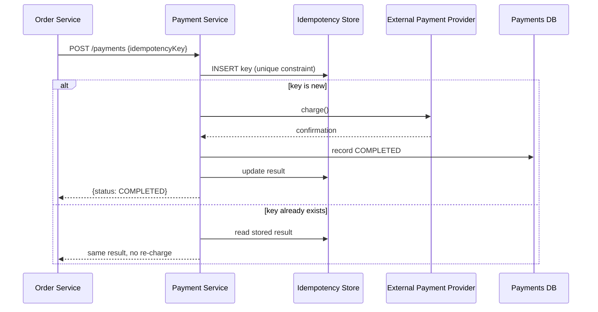

# Architecture Atlas: Payment Processing System

**Delivered as a timed, 45-minute exercise using [System Design Method and Estimation](../handbook/system-design/system-design-method-and-estimation.md)'s six-phase method. Idempotency and exactly-once semantics are mandatory discussion points.**

## Table of Contents

1. [Problem Statement](#problem-statement)
2. [Constraints](#constraints)
3. [Functional Requirements](#functional-requirements)
4. [Non-Functional Requirements](#non-functional-requirements)
5. [Capacity Assumptions](#capacity-assumptions)
6. [Architecture Diagram](#architecture-diagram)
7. [Data Model](#data-model)
8. [APIs](#apis)
9. [Request Flow](#request-flow)
10. [Consistency Model](#consistency-model)
11. [Scaling Strategy](#scaling-strategy)
12. [Reliability Strategy](#reliability-strategy)
13. [Security, Observability, and Cost](#security-observability-and-cost)
14. [Trade-offs](#trade-offs)
15. [Alternatives Considered](#alternatives-considered)
16. [Staff-Level Discussion](#staff-level-discussion)
17. [Interview Presentation Sequence](#interview-presentation-sequence)

---

## Problem Statement

Design a system that accepts a payment request, charges via an external payment provider, records the result durably, and notifies the initiating service — a system where every single request has direct financial consequences, so correctness matters more than raw throughput.

## Constraints

**In scope:** accept, charge, record, notify. **Explicitly out of scope for this exercise:** fraud detection, multi-currency conversion logic, and refunds — each is a substantial design problem of its own, and naming them as deliberately excluded is itself part of a strong Phase 1 answer.

## Functional Requirements

- Accept a payment request tied to an order.
- Charge the payment amount via an external payment provider.
- Durably record the result (completed or failed).
- Notify the initiating service of the outcome.

## Non-Functional Requirements

- Low volume relative to a feed or messaging system, but every request carries direct financial consequence.
- No payment record may be lost or duplicated, ever — this is a correctness-first system, and the architecture should be driven by that requirement, not by throughput.
- Retries must not risk a double charge.

## Capacity Assumptions

```
Assumption: 500,000 payment attempts/day across the platform
Average QPS = 500,000 / 86,400 ~= 5.8/s
Peak (3x, concentrated around specific sale events) ~= 17/s

This is a LOW-QPS, HIGH-CONSEQUENCE system -- worth stating explicitly,
since it inverts the usual "estimate to justify scale-driven
architecture" pattern seen in higher-throughput designs. The
architecture here is driven by correctness requirements, not throughput.
```

## Architecture Diagram



**Justified against the capacity numbers:** at only ~17 peak QPS, this system is not architected for throughput — no need for sharding, aggressive caching, or async fan-out. Every architectural choice here is in service of the correctness requirement, which is the honest, stated reason this design looks different in shape from a high-QPS system like the news feed or ride-hailing designs.

## Data Model

**Payments table:** relational (PostgreSQL), strongly consistent — this is exactly the kind of data [CAP Theorem and Consistency Models](../handbook/system-design/cap-theorem-and-consistency-models.md) identifies as warranting CP behavior, not AP: a payment record must not be lost or duplicated, ever, even at the cost of rejecting a request during a partition. **Idempotency keys table:** the exact mechanism from [Idempotency at System Edges](../handbook/system-design/idempotency.md) — a `UNIQUE` key column, status, result, TTL.

## APIs

```
POST /payments   {orderId, amount, idempotencyKey}
  -> {paymentId, status: "PENDING" | "COMPLETED" | "FAILED"}

GET  /payments/{paymentId}   -> {status, confirmationId?}
```

The idempotency key is part of the API contract from the start — not retrofitted later — because this endpoint's entire design center is "what happens on a retry," per [Idempotency at System Edges](../handbook/system-design/idempotency.md).

## Request Flow

1. The Order Service posts a payment request with a client-generated idempotency key.
2. The Payment Service attempts to insert the key into the Idempotency Store under a unique constraint.
3. If the key is new, the Payment Service calls the external provider, records the result as `COMPLETED` in the Payments DB, updates the idempotency record, and returns the result.
4. If the key already exists (a retry), the Payment Service reads the previously stored result and returns it directly — no second charge is attempted.

## Consistency Model

Both the payments table and the idempotency-keys table require CP behavior — strong consistency over availability. A payment record must never be lost or duplicated, even if that means rejecting a request during a partition rather than risking an inconsistent write. This is a direct application of [CAP Theorem and Consistency Models](../handbook/system-design/cap-theorem-and-consistency-models.md)'s per-data-type classification: not every piece of data in a system needs the same consistency treatment, but this specific data unambiguously does.

## Scaling Strategy

This system is explicitly not scaled for throughput — at ~17 peak QPS there is no need for sharding, read replicas, or caching. The design effort goes entirely into correctness under retry and partial failure, not into handling volume, which is itself a scaling decision worth stating explicitly: not every system's bottleneck is throughput.

## Reliability Strategy

1. **The external payment provider itself is slow or degraded.** Per [Distributed Systems Failure Modes](../handbook/system-design/distributed-systems-failure-modes.md), naive retries here would amplify load on an already-struggling provider and risk a double charge without the idempotency mechanism already designed in. Mitigation: the idempotency key (already in the design) plus exponential backoff with jitter for the provider call specifically.
2. **Exactly-once is not actually achievable end-to-end without care at the boundary.** The payment service can guarantee it processes its own logic exactly once (via the idempotency key), but the call to the *external* provider is still an at-least-once-delivery problem from the payment service's perspective — the provider itself must also be idempotent-request-aware (most real providers, including Stripe, require and support this) for true end-to-end exactly-once behavior. Stating this limitation explicitly, rather than claiming "exactly-once" as an unqualified guarantee, is the Staff-level answer here.
3. **The idempotency store itself is a new single point of failure for every payment.** Mitigation: it needs the same CP treatment as the payments table itself — this is not a component that can be relaxed to eventual consistency without reintroducing the exact race the whole design exists to prevent.

## Security, Observability, and Cost

Not addressed in this 45-minute exercise, which was deliberately scoped to the correctness/idempotency problem (see Constraints). A full treatment would need, at minimum: PCI-relevant handling of any payment credential data (ideally never touching the payment service directly — tokenized via the provider), authentication on both the initiating-service and provider callback paths, metrics on idempotency-key collision rate and provider latency/error rate, and a cost model for the provider's per-transaction fees. These are flagged here as explicit gaps rather than invented to fill out the template.

## Trade-offs

| Decision | Benefit | Cost |
|---|---|---|
| CP consistency for payments and idempotency data | No lost or duplicated payment records, ever | Availability sacrificed during a partition — a request may be rejected rather than risk an inconsistent write |
| Idempotency key required in the API contract from Phase 3 | Retry-safety designed in, not bolted on | Every caller must generate and manage a unique key per logical operation |
| No sharding/caching, correctness-first architecture | Simplicity, easier to reason about at this volume | Would need real re-architecture if volume grew by orders of magnitude |

## Alternatives Considered

- **Treating "exactly-once" as an unqualified end-to-end guarantee.** Rejected as dishonest: the payment service's own logic can be exactly-once via the idempotency key, but the call to the external provider is still at-least-once from the payment service's perspective unless the provider itself is idempotent-request-aware. Claiming an unqualified guarantee here is a common weak-answer failure mode, not a design choice.
- **Relaxing the idempotency store to eventual consistency for availability.** Rejected: this would reintroduce the exact race (a retry processed twice before the eventually-consistent write propagates) that the idempotency mechanism exists to prevent.

## Staff-Level Discussion

The most important framing in this design is that it inverts the usual system-design instinct: most exercises use a large estimated QPS to justify sharding, caching, and horizontal scale. This one uses a *small* QPS to justify the opposite — that correctness, not throughput, is the binding constraint, and every subsequent decision (CP consistency, idempotency-key-first API design, honest scoping of "exactly-once") follows from that. A Staff engineer recognizes early which constraint is actually binding for a given system — throughput, correctness, latency, or cost — rather than defaulting to the same scaling playbook for every design regardless of what the numbers actually say.

## Interview Presentation Sequence

Delivered as a timed, 45-minute exercise using the six-phase method's own stated budget — see [Time-Boxing and Mid-Round Changes](../interview-playbook/system-design/time-boxing-and-mid-round-changes.md) for the live-delivery discipline of running this inside the clock. A self-verification exit check for this specific problem: all six phases completed within 45 minutes; the idempotency mechanism designed in from the API phase, not added as an afterthought during architecture; the limitation of "exactly-once" (dependent on the external provider also supporting idempotent requests) stated explicitly, not claimed as an unqualified guarantee; and the CAP/consistency choice for the payments and idempotency data explicitly justified as CP.
