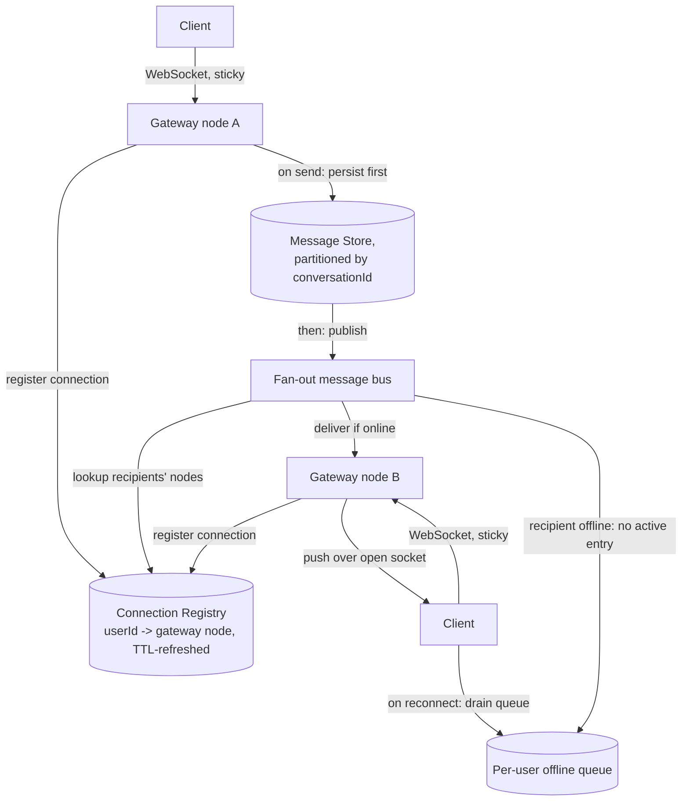

# Architecture Atlas: Real-Time Chat System

> **Sourcing note:** every other Architecture Atlas entry is elevated from an existing, already-written study-pack design exercise (Weeks 3–19). No such source exercise exists for this problem — this entry is new, original content, built directly against the same [System Design Method and Estimation](../handbook/system-design/system-design-method-and-estimation.md) six-phase method and the same Architecture Atlas Standard every other entry follows, not invented from a different template. It is added as a genuine, additional canonical design problem toward the register's own T-813 (Canonical design problems) line, which names no fixed, enumerated list of twelve problems anywhere in this repository's project documents — this is one problem added toward that broader, currently-unenumerated goal, not a claim that T-813 is now closed.

**Delivered as a timed, 45-minute exercise using [System Design Method and Estimation](../handbook/system-design/system-design-method-and-estimation.md)'s six-phase method.**

## Table of Contents

1. [Problem Statement](#problem-statement)
2. [Constraints](#constraints)
3. [Functional Requirements](#functional-requirements)
4. [Non-Functional Requirements](#non-functional-requirements)
5. [Capacity Assumptions](#capacity-assumptions)
6. [Architecture Diagram](#architecture-diagram)
7. [Data Model](#data-model)
8. [APIs](#apis)
9. [Request Flow](#request-flow)
10. [Consistency Model](#consistency-model)
11. [Scaling Strategy](#scaling-strategy)
12. [Reliability Strategy](#reliability-strategy)
13. [Security, Observability, and Cost](#security-observability-and-cost)
14. [Trade-offs](#trade-offs)
15. [Alternatives Considered](#alternatives-considered)
16. [Staff-Level Discussion](#staff-level-discussion)
17. [Interview Presentation Sequence](#interview-presentation-sequence)

---

## Problem Statement

Design a real-time chat system supporting one-to-one and small-group conversations: a message sent by one participant should reach every other online participant within a low, sub-second latency, reach offline participants once they reconnect, preserve message order within a conversation, and support delivery/read receipts. The central tension distinguishing this from a typical request/response system: a WebSocket connection is stateful and pinned to one specific server process, so the hard problem isn't storing messages — it's knowing, at fan-out time, *which server process* (if any) currently holds a live connection to each recipient.

## Constraints

**In scope:** one-to-one and small-group (≤50 participants) text messaging, online real-time delivery, offline store-and-forward delivery, message ordering within a conversation, delivery and read receipts. **Explicitly out of scope for this exercise:** end-to-end encryption, media/attachment handling, and large-group/broadcast channels (thousands of participants) — each is a materially different design problem, and naming them as deliberately excluded is itself part of a strong Phase 1 answer.

## Functional Requirements

- Send a text message to a one-to-one or small-group conversation.
- Deliver a message to every currently-online participant within a low-latency bound.
- Store a message for later delivery to any participant who is currently offline.
- Preserve message order within a single conversation, as seen by every participant.
- Support delivery receipts (reached the recipient's device) and read receipts (opened by the recipient), each participant-specific.

## Non-Functional Requirements

- Online message delivery latency: sub-second at p99 under normal load.
- A single server process failure must not lose any message that was already accepted from a sender, and must not silently strand connected clients without a path to reconnect.
- The system must scale to a large number of concurrent long-lived connections, independent of message-send throughput, which is a much smaller number.
- Message order within one conversation must be consistent for every participant, even under concurrent sends and server failures.

## Capacity Assumptions

```
Assumption: 50M DAU, of whom ~15M concurrently connected at peak
            -> 15M concurrent WebSocket connections to hold open at once
Assumption: each active user sends ~20 messages/day
            -> 1B messages/day -> ~11,600 messages/s average, ~35,000/s peak (3x)
Assumption: average conversation fan-out is 2.4 recipients per message
            (mostly 1:1, some small groups)
            -> ~84,000 delivery attempts/s peak

The concurrent-connection count (15M) and the message-send rate (35,000/s
peak) are two independent numbers scaling completely differently -- the
first drives how many stateful gateway processes are needed regardless of
message volume; the second drives message-store and fan-out throughput
independent of how many connections happen to be open. Conflating the two
is the most common capacity-estimation mistake for this problem.
```

## Architecture Diagram



**Justified against this design's own topics:**

- **The connection registry, not the message store, is this design's hardest component.** Any gateway node handling an incoming send must discover which specific node (if any) holds each recipient's live connection — a lookup problem structurally identical to [Distributed Cache](distributed-cache.md)'s sharded key-value model, here storing `userId -> gatewayNodeId` with a short TTL refreshed by a periodic heartbeat from each open connection, so a crashed gateway's stale entries expire quickly rather than routing messages into a void.
- **Persist before publish, always.** A message is written to the durable, conversation-partitioned message store *before* the fan-out bus attempts delivery — matching the Non-Functional Requirement that a server crash must never lose an already-accepted message. Delivery is best-effort and retryable; persistence is not.
- **Partitioning the message store by `conversationId`,** not by sender or recipient, is what keeps one conversation's messages in a strictly orderable sequence — per [Data Partitioning and Consistent Hashing](../handbook/system-design/data-partitioning-and-consistent-hashing.md)'s general principle of choosing a partition key matching the entity that needs internal ordering, exactly as [Notification System](notification-system.md) partitions by `userId` for the identical reason applied to a different ordering requirement.
- **A separate offline queue per user**, populated only when the connection-registry lookup finds no live gateway for that recipient, avoids conflating "this message has no online recipient right now" with "this message failed to deliver" — the former is expected, routine behavior; the latter would be a real failure requiring retry/alerting.

## Data Model

**Message store:** partitioned by `conversationId`; each row keyed by `(conversationId, sequenceNumber)` with sender, timestamp, and content — an append-only, ordered log per conversation, not a mutable table. **Connection registry:** an in-memory, TTL-based key-value store (`userId -> gatewayNodeId, lastHeartbeat`) — deliberately not durable; a lost registry entry is safe to lose, since it only ever reflects current best-known connection state, refreshed continuously. **Offline queue:** per-user, ordered by the same `sequenceNumber` the message store assigned, drained (and cleared) on the recipient's next successful reconnect. **Receipts:** a separate `(messageId, userId, state)` table — delivered/read — updated by the gateway that actually pushed the message and, separately, by the client acknowledging read.

## APIs

```
WS  /connect (upgrade) -> establishes the sticky connection; client
    authenticates over the socket, gateway registers (userId -> self) in
    the connection registry with a heartbeat-refreshed TTL

POST /conversations/{id}/messages
  {senderId, content}
  -> 202 Accepted {messageId, sequenceNumber}
  (persisted synchronously before this response; fan-out is asynchronous)

GET /conversations/{id}/messages?since={sequenceNumber}
  -> ordered message page (used by a reconnecting client to catch up,
  and by the offline-queue drain path)

POST /messages/{id}/receipts {userId, state: delivered|read}
```

## Request Flow

1. Both participants' clients hold an open WebSocket to whichever gateway node accepted their connection; each gateway registers `userId -> self` in the connection registry, refreshed by a periodic heartbeat.
2. Sender's client calls `POST /conversations/{id}/messages`. The receiving gateway synchronously persists the message to the conversation-partitioned message store, assigning the next `sequenceNumber`, and returns `202 Accepted` to the sender immediately after persistence succeeds.
3. The fan-out bus picks up the newly persisted message, looks up each other participant in the connection registry.
4. For an online participant, the bus routes the message to that participant's specific gateway node, which pushes it over the already-open socket — no polling, no extra round trip.
5. For an offline participant (no live registry entry), the message is appended to that user's offline queue instead.
6. On reconnect, a client calls `GET /conversations/{id}/messages?since={lastKnownSequenceNumber}` (or the offline queue is drained automatically on registry re-registration) to catch up on everything missed while disconnected.

## Consistency Model

Message order within one conversation is strongly ordered, by construction: the message store assigns a strictly increasing `sequenceNumber` per `conversationId` at persistence time, before any fan-out attempt, so every participant — online or catching up later — observes the identical order. Delivery itself is at-least-once and eventually consistent: a message is guaranteed to eventually reach every participant (online now, or via the offline queue later), but the exact delivery latency to a specific online participant is not guaranteed, and a brief registry-heartbeat lag can occasionally route a message to the offline queue for a participant who reconnected moments earlier — a false negative this design accepts because message loss is never possible (the offline queue is drained on next connect regardless), only a brief delay.

## Scaling Strategy

Gateway nodes scale horizontally purely on concurrent-connection count, entirely independent of message-send throughput — a node holding 50,000 idle open sockets costs the same regardless of how many messages flow through the system that day. The message store scales by adding partitions keyed on `conversationId`, exactly the way any partitioned log scales, bounded by the same trade-off [Table Partitioning and Sharding Strategies](../handbook/databases/table-partitioning-and-sharding-strategies.md) names generally: more partitions raise write parallelism but make any cross-conversation query more expensive. The connection registry scales as a standard sharded key-value store (consistent hashing on `userId`, per [Data Partitioning and Consistent Hashing](../handbook/system-design/data-partitioning-and-consistent-hashing.md)), since lookups are always by a single known `userId`, never a range scan.

## Reliability Strategy

1. **A crashed gateway node loses connections, not messages.** Every connected client detects the dropped socket and reconnects to a (possibly different) gateway node, which re-registers it in the connection registry; any message sent to the crashed node's stale registry entry during the brief TTL-expiry window simply falls through to the offline queue rather than being lost, since persistence always happens before fan-out is even attempted.
2. **A stale registry entry is a routing delay, not a correctness bug**, because of the persist-before-publish ordering — the worst case from a stale or missing registry entry is a message temporarily routed to the offline queue instead of pushed live, recovered on the recipient's next reconnect or queue-drain check.
3. **Fan-out bus backpressure**, not the message store, is the component most likely to need active capacity planning under a sudden spike (a viral group conversation, a mass-join event) — per [Capacity Planning and Headroom](../handbook/performance/capacity-planning-and-headroom.md)'s general framing, this is exactly the kind of component that should be provisioned with deliberate headroom against a measured saturation point, not sized purely from average load.

## Security, Observability, and Cost

Not addressed in this 45-minute exercise, which was deliberately scoped to the connection-routing and ordering problem (see Constraints). A full treatment would need, at minimum: authentication and per-conversation authorization on both the WebSocket upgrade and every REST endpoint (a user must not be able to read or post into a conversation they aren't a participant in), encryption in transit (and a stated position on end-to-end encryption, explicitly out of scope here), metrics on connection-registry hit rate and offline-queue depth per user as the two leading indicators of a routing problem before it becomes a user-visible delivery delay, and a cost model dominated by the 15M concurrently-held connections (memory and file-descriptor cost per gateway node) rather than by message volume. These are flagged here as explicit gaps rather than invented to fill out the template.

## Trade-offs

| Decision | Benefit | Cost |
|---|---|---|
| Separate connection registry from message store | Presence lookups stay fast and can be lossy/ephemeral without risking message loss | An additional distributed component to operate, with its own TTL-tuning trade-off (too short: false "offline" routing; too long: stale entries during a crash) |
| Persist before publish | A crashed gateway or fan-out bus can never lose an accepted message | Every send pays a synchronous write latency before the sender gets a 202, rather than an optimistic immediate response |
| `conversationId` as the message-store partition key | Strict, simple per-conversation ordering | A single extremely active group conversation still serializes onto one partition's write throughput |
| At-least-once, eventually-consistent delivery | Never loses a message; simple offline-queue fallback | No hard delivery-latency guarantee to a specific online participant at any given instant |

## Alternatives Considered

- **Polling instead of a connection registry + push.** Rejected: server-side polling for new messages (or client-side short-polling) either misses the sub-second latency requirement or drives an enormous, wasteful request rate at 15M concurrent users — exactly the trade-off [Real-Time Delivery: WebSocket, SSE, and Long-Polling](../handbook/system-design/realtime-delivery-websocket-sse-and-long-polling.md) names generally, decided here in favor of a persistent connection specifically because bidirectional, low-latency delivery is a hard functional requirement, not a nice-to-have.
- **A single global message sequence number instead of per-conversation.** Rejected: a global sequence would serialize all writes across every conversation in the system onto one counter, destroying the horizontal write scalability partitioning by `conversationId` provides, for an ordering guarantee (global message order across unrelated conversations) nothing in the functional requirements actually needs.
- **Fan-out-on-write for every group conversation, regardless of size.** Rejected at the boundary this design already draws (≤50 participants): writing a copy of every message to every participant's own inbox is the [News Feed System](news-feed-system.md) pattern, justified there by a much larger, power-law-distributed fan-out; at ≤50 participants the connection-registry-driven push model is simpler and doesn't need a separate per-recipient copy of the same message.

## Staff-Level Discussion

The single most instructive design choice here is treating presence (the connection registry) as a deliberately lossy, ephemeral system, structurally separate from the message store's durability guarantee — many first-pass designs conflate "where is this user's connection" with "is this message safely stored," and end up either making the registry itself a durability bottleneck (over-engineering presence) or, worse, routing message persistence through the registry's own availability (under-engineering durability). A Staff engineer's value in this design is drawing that boundary explicitly and early: presence can fail safely and often, as long as the offline queue's fallback path is airtight, and the moment those two concerns start sharing a failure domain, both durability and presence-lookup latency degrade together instead of independently — the same category of insight [Notification System](notification-system.md)'s "hot event type vs. hot partition" distinction demonstrates for a different pair of concerns.

## Interview Presentation Sequence

Delivered as a timed, 45-minute exercise using the six-phase method's own stated budget — see [System Design Narration and Whiteboard Discipline](../interview-playbook/system-design/system-design-narration-and-whiteboard-discipline.md) for sequencing the diagram itself (client and gateway entry point first, the core send/persist path next, the connection-registry and fan-out logic introduced only once the core path is agreed, offline-queue handling last as the explicit failure-mode annotation). A self-verification exit check for this specific problem: the connection-registry-vs-message-store separation named and justified explicitly, not merely drawn as two boxes; persist-before-publish stated as a deliberate ordering decision tied to the crash-safety requirement; the per-conversation (not global) sequence number's scaling rationale stated explicitly; and the offline-queue path presented as expected, routine behavior rather than a failure case bolted on at the end.
