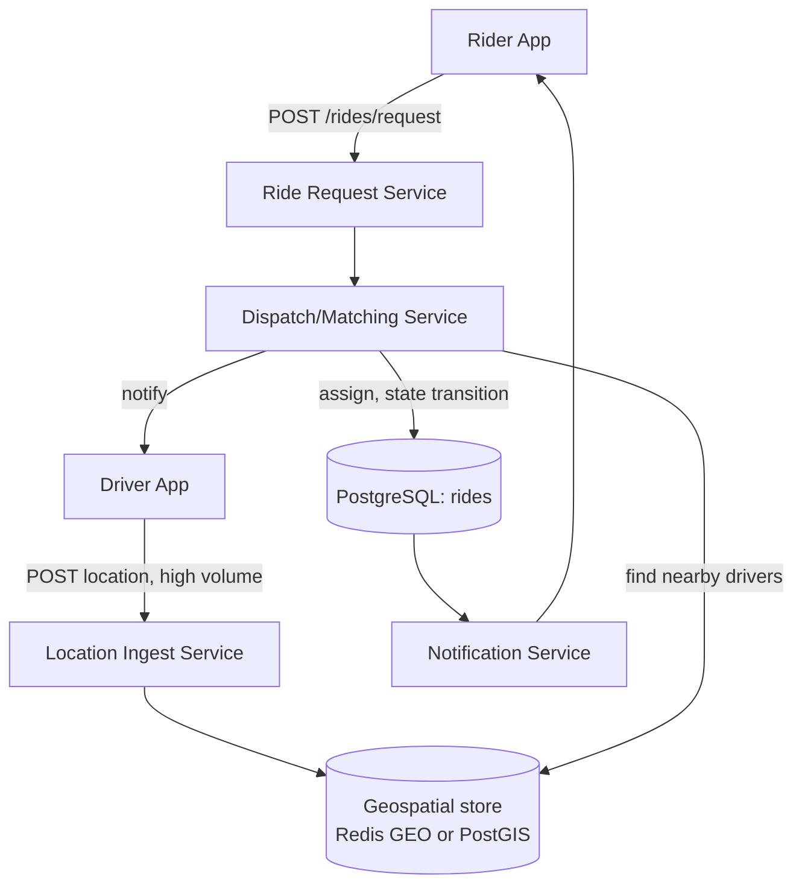

# Architecture Atlas: Ride-Hailing Dispatch System

**Delivered as a timed, 45-minute exercise using [System Design Method and Estimation](../syllabus/11-system-design/system-design-method-and-estimation.md)'s six-phase method.**

## Table of Contents

1. [Problem Statement](#problem-statement)
2. [Constraints](#constraints)
3. [Functional Requirements](#functional-requirements)
4. [Non-Functional Requirements](#non-functional-requirements)
5. [Capacity Assumptions](#capacity-assumptions)
6. [Architecture Diagram](#architecture-diagram)
7. [Data Model](#data-model)
8. [APIs](#apis)
9. [Request Flow](#request-flow)
10. [Consistency Model](#consistency-model)
11. [Scaling Strategy](#scaling-strategy)
12. [Reliability Strategy](#reliability-strategy)
13. [Security, Observability, and Cost](#security-observability-and-cost)
14. [Trade-offs](#trade-offs)
15. [Alternatives Considered](#alternatives-considered)
16. [Staff-Level Discussion](#staff-level-discussion)
17. [Interview Presentation Sequence](#interview-presentation-sequence)

---

## Problem Statement

Design a system where a rider requests a ride, the system finds and dispatches a nearby available driver, and both parties track the ride to completion — a location-driven matching problem that is write-heavy on driver location updates and read-heavy on "find nearby drivers."

## Constraints

**In scope:** ride request → driver matching → dispatch → ride tracking to completion. **Explicitly out of scope for this exercise:** payment processing, the surge-pricing algorithm's internals, and driver onboarding/verification — each is a substantial design problem in its own right, and naming them as deliberately excluded (rather than silently ignoring them) is itself part of a strong Phase 1 answer.

## Functional Requirements

- A rider can request a ride from a pickup to a dropoff location.
- The system finds and assigns a nearby available driver.
- The driver can accept the assignment.
- Both rider and driver can track ride status until completion.
- Drivers continuously report their location while online.

## Non-Functional Requirements

- High write throughput for driver location updates (background stream from every online driver).
- Low-latency "find nearby drivers" reads during matching.
- Strong consistency for ride state (exactly one driver per ride, no double-assignment).
- Tolerance for slightly stale location data is acceptable; tolerance for double-booking a driver is not — these two requirements pull toward different storage and consistency choices, which is the central design tension in this system.

## Capacity Assumptions

```
Assumption: 5M daily active riders, 500K daily active drivers
Assumption: each active driver sends a location update every 4 seconds while online,
            averaging 6 online hours/day
Location updates/driver/day = (6 x 3600) / 4 = 5,400
Total location writes/day = 500,000 x 5,400 = 2.7 billion/day
Average write QPS = 2.7B / 86,400 ~= 31,250 writes/s

Assumption: peak-to-average ratio of 2x for driver location updates (drivers
            online during a ride are already captured; this is a steadier
            signal than rider-initiated request volume)
Peak location-write QPS ~= 62,500/s

Assumption: 2M ride requests/day, peak-to-average ratio of 4x (concentrated
            in commute hours, unlike the steadier location-update stream)
Average ride-request QPS = 2,000,000 / 86,400 ~= 23/s
Peak ride-request QPS ~= 93/s
```

**Why two different peak-to-average ratios were used deliberately:** location updates are a continuous background stream from already-online drivers, while ride requests concentrate sharply around commute windows — using the same ratio for both would understate one or overstate the other. Stating this distinction unprompted is exactly the kind of depth signal a Staff-level candidate produces.

## Architecture Diagram



**Justified against the capacity numbers:** the location-ingest path is architecturally separate from the ride-request path specifically because its write volume (62,500/s peak) is roughly 700x the ride-request volume (93/s peak) — collapsing them into one service would force the low-volume, strongly-consistent ride-state logic to scale alongside the high-volume, more-tolerant-of-staleness location stream, which is the wrong coupling.

## Data Model

**Rides:** relational (PostgreSQL) — a ride has strong consistency needs (exactly one driver assigned, a clear state machine `REQUESTED → MATCHING → ACCEPTED → IN_PROGRESS → COMPLETED`), and the volume (2M/day) is well within relational scale.

**Driver location:** *not* relational at this write volume — a purpose-built structure. The access pattern is "find all drivers within radius R of point P, updated within the last N seconds," which is a geospatial index problem specifically, matching [Storage Selection Trade-offs](../syllabus/11-system-design/storage-selection-tradeoffs.md)'s access-pattern method: work from the access pattern, not from reputation. A geospatial-indexed store (PostgreSQL with PostGIS, or Redis with its geospatial commands for the hottest, most time-sensitive tier) fits; a plain relational table with a naive `WHERE lat BETWEEN ... AND lng BETWEEN ...` does not scale to 62,500 writes/s with useful query latency.

## APIs

```
POST /rides/request          {riderId, pickup: {lat, lng}, dropoff: {lat, lng}}
  -> {rideId, status: "MATCHING"}

GET  /rides/{rideId}         -> {status, driverId?, driverLocation?}

POST /drivers/{driverId}/location   {lat, lng, timestamp}
  -> 202 Accepted (fire-and-forget, high volume, no client wait needed)

POST /rides/{rideId}/accept  {driverId}   -- driver-side acceptance
```

## Request Flow

1. Driver app continuously posts location updates to the Location Ingest Service, which writes into the geospatial store — a high-volume, fire-and-forget path independent of any single rider request.
2. A rider posts a ride request to the Ride Request Service, which hands off to the Dispatch/Matching Service.
3. The Matching Service queries the geospatial store for nearby available drivers.
4. On finding a candidate, the Matching Service performs an atomic conditional assignment against the rides table (`REQUESTED → MATCHING`) and notifies the driver.
5. The driver accepts; the ride transitions `MATCHING → ACCEPTED → IN_PROGRESS → COMPLETED` as the ride proceeds, with the Notification Service relaying status changes back to the rider.

## Consistency Model

**Ride state is strongly consistent** — the state machine transition that assigns a driver must be atomic, since two ride requests being matched to the same driver simultaneously is a correctness violation, not just a performance concern. **Driver location is eventually consistent and explicitly stale-tolerant** — a location update that's a few seconds old is an acceptable trade-off for the write throughput the geospatial store needs to sustain, provided staleness is bounded (see Reliability Strategy).

## Scaling Strategy

The geospatial store becomes the bottleneck at 62,500 writes/s on a single node. Mitigation: shard by geographic region — a driver's location updates only need to be visible to a match search in the same region, so regional sharding also bounds the "nearby drivers" query to a single shard in the common case, rather than requiring a scatter-gather across shards. This is the same reasoning as [Data Partitioning and Consistent Hashing](../syllabus/10-distributed-systems/data-partitioning-and-consistent-hashing.md)'s access-pattern-first approach to choosing a shard key.

## Reliability Strategy

1. **Double-assignment race.** Two ride requests matched to the same driver simultaneously is prevented by making the assignment step a single atomic conditional update ("assign this driver only if still unassigned"). An unguarded read-then-write here reproduces exactly the write-skew anomaly from [Isolation Levels and Concurrency Anomalies](../syllabus/06-databases/isolation-levels-and-concurrency-anomalies.md) — just enforced in application logic instead of via a database transaction's isolation level.
2. **Stale location leading to a bad match.** A driver who went offline 30 seconds ago but whose last location update is still in the geospatial store could be matched, then fail to accept. Mitigation: a TTL on location entries (matching the ~4-second update interval with some slack, e.g., 15 seconds) so stale entries age out of match candidacy automatically, bounding how stale a match can be.

## Security, Observability, and Cost

Not addressed in this 45-minute exercise — the session was deliberately scoped to the core matching problem (see Constraints). A full treatment would need, at minimum: rider/driver authentication and authorization on every endpoint, rate limiting on the high-volume location-ingest path, metrics on match latency and geospatial-store shard hot-spotting, and a cost model for the geospatial store's write-heavy sharded footprint. These are flagged here as explicit gaps rather than invented to fill out the template.

## Trade-offs

| Decision | Benefit | Cost |
|---|---|---|
| Split location-ingest path from ride-request path | Each path scales independently, matched to its own volume/consistency profile | More services to operate; a driver's current location and their current ride state now live in two different systems that must be reconciled at match time |
| Geospatial store instead of relational for location | Handles 62,500 writes/s with useful query latency | A second storage technology to operate (polyglot persistence), plus TTL-based staleness management |
| Atomic conditional assignment for ride matching | Correctness guarantee against double-assignment | Slightly more complex than an unguarded read-then-write; must be gotten right |

## Alternatives Considered

- **One service for both location updates and ride matching, one relational store for everything.** Rejected: forces the low-volume, strongly-consistent ride-state logic to scale alongside the ~700x-higher-volume, staleness-tolerant location stream — the wrong coupling, and a plain relational table cannot serve "nearby drivers" queries at 62,500 writes/s with useful latency.
- **Distributed lock for driver assignment instead of a conditional update.** Not chosen for this exercise: a conditional update ("assign only if still unassigned") achieves the same correctness guarantee with less operational overhead than introducing a distributed locking mechanism for what is fundamentally a single-row compare-and-set.

## Staff-Level Discussion

The single most important modeling decision in this design is recognizing that "driver location" and "ride state" are not the same kind of data, even though they belong to the same conceptual entity (a driver, a ride). They have different volumes (700x apart at peak), different consistency requirements (staleness-tolerant vs. correctness-critical), and different natural storage technologies as a direct consequence — this is the same reasoning [Storage Selection Trade-offs](../syllabus/11-system-design/storage-selection-tradeoffs.md) generalizes: name the access pattern before naming the technology, per data type, not per system. A Staff engineer presented with this problem should split the architecture along this line early, in Phase 1 or 2, rather than arriving at it as an afterthought during bottleneck analysis — doing so signals the trade-off was reasoned about deliberately, not discovered under interviewer pressure.

## Interview Presentation Sequence

Delivered as a timed, 45-minute exercise using the six-phase method's own stated budget (Clarify 2–3 min, Estimate 3–5 min, API 2–3 min, Data 3–5 min, Architecture 10–15 min, Bottlenecks 5–10 min) — see [Time-Boxing and Mid-Round Changes](../syllabus/20-interview-preparation/system-design/time-boxing-and-mid-round-changes.md) for the live-delivery discipline of running this inside the clock. A self-verification exit check for this specific problem: all six phases completed within 45 minutes; at least one architectural decision (the location/ride-state split) explicitly traced back to a capacity number (the 700x volume ratio); at least 3 reliability concerns named with real mitigations, not just labeled; and the double-assignment race recognized explicitly as the same anomaly class as SQL write-skew, not treated as an unrelated new concept.
