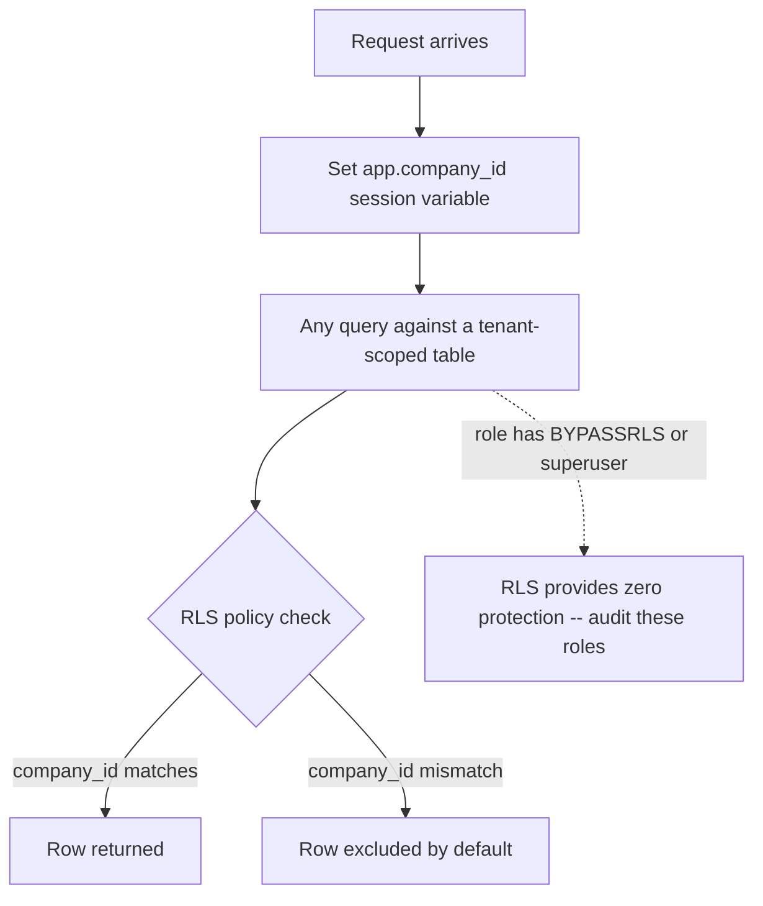

# Architecture Atlas: Security Review of a Multi-Tenant Expense-Approval Platform

**Delivered as a timed, 45-minute exercise applying this week's seven security topics to a single system — a security review, not a request/response system design. This entry adapts the Atlas template accordingly: no data model, API surface, or consistency model sections; the "Reference Analysis" section is this exercise's actual deliverable, a review, not an architecture.**

## Table of Contents

1. [Problem Statement](#problem-statement)
2. [Constraints](#constraints)
3. [Design Dimensions](#design-dimensions)
4. [Reference Analysis](#reference-analysis)
5. [Tenant Isolation Diagram](#tenant-isolation-diagram)
6. [Trade-offs](#trade-offs)
7. [Alternatives Considered](#alternatives-considered)
8. [Staff-Level Discussion](#staff-level-discussion)
9. [Interview Presentation Sequence](#interview-presentation-sequence)

---

## Problem Statement

Review the security posture of a B2B SaaS expense-approval platform: employees submit expense reports, managers approve or reject them, and approved reports are paid out via a third-party payments API. It's a shared-schema (pool) multi-tenant system — every customer's data lives in the same PostgreSQL database, distinguished only by a `company_id` column. The platform is onboarding several enterprise customers this quarter, each with a compliance team asking pointed questions before signing.

## Constraints

- Shared-schema (pool) multi-tenancy: one database, `company_id`-column isolation.
- An expense report has an `id`, `submitter_id`, and `company_id`.
- A single `manager` role currently governs approval.
- Finance admins can search expense reports by submitter name.
- The payments API key authorizes real money movement.
- Deployment uses a shared internal base image across services.
- Enterprise compliance teams are actively evaluating this platform before signing.

## Design Dimensions

1. Access control on the fetch-expense-report-by-ID endpoint.
2. Credential storage (passwords) and transport security (payments API calls).
3. Whether a single `manager` role is sufficient for the approval rule.
4. Safe design of the submitter-name search feature.
5. The platform's biggest structural tenant-isolation risk.
6. Storage and rotation posture for the payments API key.
7. What the deployment itself needs before a security questionnaire.

## Reference Analysis

**Access control.** First question: does the fetch-by-ID handler check that the requester's `company_id` (and, for non-admin roles, that they are the submitter or their manager) matches the report's own `company_id`/`submitter_id` before returning it? This is the textbook IDOR shape from [OWASP Top 10 for Backend Services](../handbook/security/owasp-top-10-for-backend-services.md) — the vulnerable and fixed versions of this exact handler differ by one comparison, and it is invisible to functional tests that only ever fetch a user's own reports. In a multi-tenant system, a missing check here is not just one user seeing another's data — it is potentially one *company* seeing another's data, both a security and a contractual (data-isolation clause) failure.

**Credential storage and transport.** Passwords: confirm the hashing algorithm has a tunable, deliberately-expensive cost parameter (Argon2id or PBKDF2, per [Applied Cryptography: Hashing, Signing, TLS](../handbook/security/applied-cryptography-hashing-signing-tls.md)) — not a fast general-purpose hash even if salted. Payments API calls: confirm TLS is actually enforced (not merely available) on every call path, using the platform's standard library defaults rather than a manually pinned, possibly-stale cipher-suite list — TLS 1.3's reduced negotiation surface means "use the current default" is the secure choice, not a compromise.

**Approval authorization model.** No, a single `manager` role is not sufficient — it can only answer "does this user hold the manager role," not "is this specific report's submitter this specific manager's direct report" or "is this manager approving their own submission." Both are relationships between a specific subject and a specific resource, exactly what RBAC structurally cannot express (per [Authentication, Authorization: RBAC vs. ABAC](../handbook/security/authn-authz-rbac-vs-abac.md)). The fix layers an ABAC-style check on the existing role: `hasRole("manager") AND report.submitter.managerId == currentUser.id AND report.submitterId != currentUser.id`.

**Search feature.** Never string-concatenate the search term into a SQL query, including inside a `LIKE '%...%'` clause — parameterize it, and explicitly escape `LIKE`'s own wildcard characters (`%`, `_`) as literal data if the search term itself might contain them, per [Injection, Input Validation, Output Encoding](../handbook/security/injection-input-validation-output-encoding.md). Any result rendered back into an admin UI (submitter names, report descriptions) needs HTML output encoding at render time, independent of how the query was built — the two defenses are separate and both required.

**Tenant isolation.** The biggest structural risk in a pool/shared-schema architecture is that `company_id` filtering depends on being correct in *every* query, in every code path, including future features, admin tools, and background jobs not yet written, per [Multi-Tenancy Isolation Models](../handbook/security/multi-tenancy-isolation-models.md). Add PostgreSQL Row-Level Security on every tenant-scoped table, with a policy against a session-level `app.company_id` context variable set once per request — this converts isolation from "every query must remember" into "the database refuses by default," including for tooling that doesn't go through the primary application code path. Critically, audit every database role in use (application, analytics/reporting tooling, migration scripts) for superuser or `BYPASSRLS` status, since RLS provides zero protection for an exempt role regardless of how correctly the policy itself is written.

**Payments API key.** This key is the platform's most sensitive secret — a compromise directly enables unauthorized money movement. Store it in a managed secrets system (KMS/Vault), never in application configuration files or environment variables checked into any repository. Implement key-version tagging (envelope-encryption-style, per [Secrets Management and Key Rotation](../handbook/security/secrets-management-and-key-rotation.md)) even before rotation is required by the payments provider, specifically because retrofitting versioning onto an already-integrated, unversioned key-handling path later is a substantially larger project than building it in now — and rotate on a schedule at least as frequent as the payments provider's own recommendation, treating "no known compromise" as insufficient reason to skip rotation.

**The deployment itself.** Generate and continuously scan a real SBOM against the shared base image, per [Supply Chain Security: SBOM and Dependency Risk](../handbook/security/supply-chain-security-sbom-and-dependency-risk.md) — an enterprise security questionnaire will very likely ask directly about known vulnerabilities in the deployed software stack, and "we haven't checked" is a materially worse answer than "here's our current SBOM and CVE triage status, including our remediation SLA by severity." Given the base image is shared internally, confirm whether its currency and patching is a centrally-owned responsibility rather than something each service team is separately, inconsistently responsible for.

## Tenant Isolation Diagram

## Trade-offs

| Decision | Benefit | Cost |
|---|---|---|
| RLS with session-level `app.company_id` | Isolation enforced at the database, not per-query discipline | Every connection path must correctly set the session variable, and every privileged role must be audited |
| ABAC condition layered on the existing `manager` role | Expresses the true subject-resource relationship without a role explosion | An extra condition to evaluate and test per approval, beyond a role check |
| Proactive key-version tagging before rotation is required | Avoids a much larger retrofit later | Real engineering cost paid now, before any incident demands it |
| Continuous SBOM scanning on a shared base image | One centrally-owned fix benefits every service built on it | Requires a clearly assigned owner, or the shared image itself becomes a diffuse responsibility |

## Alternatives Considered

- **Enforcing tenant isolation only in application code (a `WHERE company_id = ?` on every query, no RLS).** Rejected: this is exactly the "every query must remember" failure mode the scenario's own structural risk names — a single missed filter in a future admin tool or background job silently breaks isolation with no database-level backstop.
- **Adding a second `manager-of-managers` role instead of an ABAC condition.** Rejected: role explosion doesn't solve the underlying problem — the rule is a relationship between a specific manager and a specific report's submitter, which no fixed role, however finely named, can express without per-relationship data.
- **Rotating the payments API key only after a suspected compromise.** Rejected given the key's blast radius — "no known compromise" is not equivalent to "no compromise," and a scheduled rotation cadence is the industry-standard mitigation the payments provider itself would expect.

## Staff-Level Discussion

Every answer in this review resolves to a structural fix, not a patch: RLS instead of remembering to filter, an ABAC condition instead of a new role, versioned secrets instead of an unversioned key with no upgrade path, a centrally-owned base image instead of per-service drift. A Staff engineer treats an enterprise compliance questionnaire as a forcing function that surfaces exactly this class of structural gap — the organizations asking these questions have seen the failure modes before, and a review that only patches the specific question asked (without asking whether the same failure mode recurs elsewhere in the system) will pass the questionnaire while leaving the underlying risk in place. The RLS/`BYPASSRLS` audit is the clearest example: a technically correct RLS policy is worthless if any role in active use can bypass it, and only a Staff-level review habit of auditing the full set of database roles — not just the primary application role — catches that gap before an auditor or an incident does.

## Interview Presentation Sequence

Present in the order the seven design dimensions were posed: access control first (the most direct IDOR risk), then credential storage and transport, then the approval authorization model, then the search feature, then tenant isolation (the platform's deepest structural risk), then the payments key, then the deployment/SBOM question. A self-verification exit check: identified the fetch-by-ID gap as company-level, not just user-level; named the specific correct password-hashing category and TLS posture; recognized the approval rule as a relationship RBAC cannot express and proposed the specific ABAC condition including the self-approval exclusion; named both search defenses (parameterized query and output encoding) as separate, both-required steps; proposed RLS and explicitly named the superuser/`BYPASSRLS` audit as a required companion, not an afterthought; treated the payments key as needing both managed storage and proactive rotation; connected the shared base image to SBOM scanning and centralized ownership.
