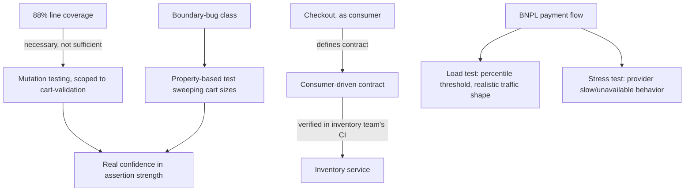

# Architecture Atlas: Test Strategy for a Checkout Service

**Delivered as a timed, 45-minute exercise applying this week's five testing topics to a single service — a test-strategy design, not a request/response system design. This entry adapts the Atlas template accordingly: no data model, API surface, or consistency model sections; the "Reference Analysis" section is this exercise's actual deliverable, a strategy document, not an architecture.**

## Table of Contents

1. [Problem Statement](#problem-statement)
2. [Constraints](#constraints)
3. [Design Dimensions](#design-dimensions)
4. [Reference Analysis](#reference-analysis)
5. [Test Strategy Flow](#test-strategy-flow)
6. [Trade-offs](#trade-offs)
7. [Alternatives Considered](#alternatives-considered)
8. [Staff-Level Discussion](#staff-level-discussion)
9. [Interview Presentation Sequence](#interview-presentation-sequence)

---

## Problem Statement

Design a documented test strategy for a checkout service: it validates a cart, calls an external payments provider, calls an internal inventory service to reserve stock, and returns an order confirmation, consumed by a web frontend, a mobile app, and an internal admin tool. The service has an 88%-line-coverage unit-test suite the team is reasonably confident in, but a recent incident revealed a boundary bug (an order at exactly the maximum allowed cart size was silently rejected) that no existing test caught. Leadership wants a documented strategy before a new "buy now, pay later" payment option ships.

## Constraints

- Existing unit-test suite: 88% line coverage, team's stated confidence level.
- A confirmed boundary bug at the exact maximum cart size shipped uncaught.
- The inventory service is owned by a different team and evolves independently.
- A new "buy now, pay later" flow adds a genuinely new external provider dependency.
- Three distinct consumers: web frontend, mobile app, internal admin tool.
- A live-coding interview round must also be designed for a Senior candidate joining this team.

## Design Dimensions

1. What "88% coverage" does and does not tell you.
2. A technique to catch the boundary-bug class going forward, correctly scoped.
3. Verifying compatibility with an independently-evolving, other-team-owned inventory service.
4. Performance readiness testing for the new payment option.
5. Designing a 30-minute test-first live-coding round for a Senior candidate.

## Reference Analysis

**Coverage vs. confidence.** 88% line coverage tells you which code *executed* during test runs, not whether the assertions were strong enough to actually *verify* correct behavior, per [Mutation and Property-Based Testing](../handbook/testing/mutation-and-property-based-testing.md) — exactly what the boundary-bug incident demonstrates: the boundary-adjacent code very likely executed during existing tests, but no assertion actually checked the exact boundary value. The right response isn't dismissing coverage as useless, but treating it as necessary-not-sufficient, and proposing a targeted mutation-testing run on checkout's core validation logic specifically to measure whether the existing assertions would actually catch a defect similar to the one that just shipped.

**Catching the boundary-bug class.** Two complementary techniques: mutation testing, scoped specifically to the cart-validation and boundary-condition-heavy modules given its real computational cost (not applied blanket across the whole codebase), to directly measure whether existing assertions would catch a real boundary-shifted defect; and, where a clean invariant exists (a cart at or under the maximum size is always accepted, one over is always rejected), a property-based test sweeping cart sizes across a range including the exact boundary, rather than relying on a single hand-picked boundary example that could itself still miss an off-by-one in a different direction.

**Inventory-service compatibility.** Consumer-driven contract testing, per [Contract Testing for Services](../handbook/testing/contract-testing-for-services.md): checkout, as the consumer, defines a contract describing exactly which inventory-service fields and status codes it actually depends on (for example, a specific "insufficient stock" error code checkout branches on). The inventory team runs contract verification against their real implementation in their own CI pipeline, catching a breaking change (a renamed field, a removed status code) before it ships, without requiring checkout's full application to be running, and without reintroducing the manual cross-team coordination this pattern is meant to replace.

**Performance readiness for the new payment flow.** Run a load test, per [Performance and Load Testing Methodology](../handbook/testing/performance-and-load-testing-methodology.md), against the new flow specifically, with a traffic *shape* that resembles realistic buy-now-pay-later adoption rather than raw checkout volume, since this flow likely has a different latency profile given the additional external provider call, reporting against a percentile threshold, not a mean-latency threshold. Given the new flow adds a genuinely new external dependency, also run a stress test ahead of launch specifically to understand failure behavior if that provider is slow or unavailable — does checkout degrade gracefully (falling back to other payment options) or hang/fail the whole request. Trigger for re-running: any future change to the payment-provider integration itself, plus a standing quarterly re-validation given how traffic patterns evolve.

**Live-coding round design.** Have the candidate implement, test-first, a small self-contained piece of checkout-adjacent logic (for example, "given a list of cart line items, compute the total with a quantity-based discount tier") — small enough to complete in 30 minutes with a genuine, narrated red-green-refactor loop, per [Writing Tests Live in an Interview](../handbook/testing/writing-tests-live-in-an-interview.md), not an already-solved algorithm. Watch specifically for: whether test cases are chosen in a deliberate smallest-to-largest order and narrated; whether each red step is confirmed to fail for the *expected* reason before moving on; and, if the candidate runs short on time, whether they communicate an explicit scope-reduction plan rather than silently rushing or silently dropping the test-first discipline — this last signal is the one most directly transferable to how the candidate would actually behave on this team under a real production deadline.

## Test Strategy Flow

## Trade-offs

| Decision | Benefit | Cost |
|---|---|---|
| Mutation testing scoped to high-risk modules only | Real assertion-strength signal where it matters most | Not applied codebase-wide, given its real computational cost |
| Property-based boundary sweep alongside mutation testing | Catches off-by-one errors a single hand-picked example could miss | An invariant must be identified and correctly stated first |
| Consumer-driven contract testing over full integration testing for the inventory dependency | Catches breaking changes without running checkout's full stack | Requires the inventory team's buy-in to run verification in their own CI |
| Percentile-threshold load testing plus a stress test for the new provider | Surfaces both steady-state and failure-mode readiness before launch | Two separate test runs to design, execute, and maintain |

## Alternatives Considered

- **Raising the coverage target (e.g., to 95%) as the primary response to the incident.** Rejected: coverage measures execution, not assertion strength — a higher coverage number would not have caught this specific boundary bug, and chasing the metric risks treating a symptom instead of the actual gap.
- **Full integration testing against a live inventory-service instance for every checkout CI run.** Rejected: slower, more brittle (fails on the inventory team's unrelated changes), and reintroduces exactly the cross-team coordination cost consumer-driven contract testing is designed to eliminate.
- **A live-coding round built around a well-known algorithm problem (e.g., reversing a linked list).** Rejected: an already-solved, widely-memorized problem does not surface genuine test-first discipline or narration quality — the goal is observing the *process*, which requires an unfamiliar, appropriately-scoped task.

## Staff-Level Discussion

The through-line across all five answers is treating a test-suite metric or a testing technique as a signal to be interpreted, not a target to be maximized: 88% coverage is real evidence of *something*, but the incident shows exactly what it doesn't evidence; mutation testing is deliberately not applied everywhere, because its cost only pays off where boundary-heavy logic actually lives; contract testing is chosen specifically because it preserves team independence rather than trading it away for a false sense of safety from full integration coverage. A Staff engineer reviewing this strategy after the next incident would ask not "did coverage go up" but "would today's incident have been caught by what we added last time" — the mutation-testing and property-based-testing additions are answerable to that question directly, which is what distinguishes a targeted response to this specific incident from a generic "add more tests" reaction.

## Interview Presentation Sequence

Present in the order the five design dimensions were posed: the coverage-vs-confidence framing first (it reframes what the incident actually revealed), then the two boundary-catching techniques together, then the inventory-service contract-testing answer, then the new-payment-flow performance strategy, then the live-coding round design. A self-verification exit check: treated 88% coverage as necessary-but-not-sufficient and connected the incident directly to what coverage cannot measure; proposed mutation testing scoped to specific high-risk modules, naming its real cost as the reason for that scoping; proposed consumer-driven, not provider-driven, contract testing with checkout as the contract owner; designed the new-flow performance testing around traffic shape and percentile thresholds plus a stress-test angle; designed the live-coding round around a small, genuinely narratable kata with specific, observable signals named, not just "watch if they write good tests."
