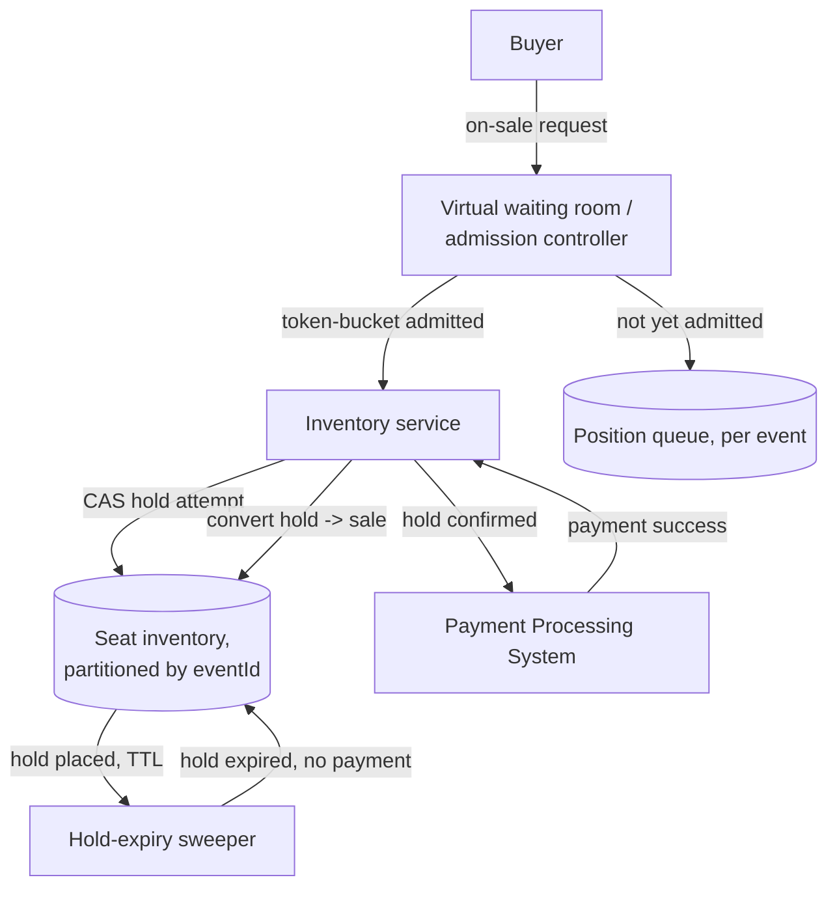

# Architecture Atlas: Ticket and Event Booking System

> **Sourcing note:** like [Real-Time Chat System](real-time-chat-system.md), this entry is new, original content, not elevated from an existing study-pack exercise — none exists for this problem. It is added as a second, additional canonical design problem toward the Master Topic Register's T-813 (Canonical design problems (12-problem set)) line. *Update:* two further additions after this one — [URL Shortener System](url-shortener-system.md) and [Distributed Key-Value Store](distributed-key-value-store.md) — brought the Atlas to exactly 12 classic full-system-design entries, matching T-813's stated count; see that last entry's sourcing note and the Architecture Atlas README for the full accounting.

**Delivered as a timed, 45-minute exercise using [System Design Method and Estimation](../handbook/system-design/system-design-method-and-estimation.md)'s six-phase method.**

## Table of Contents

1. [Problem Statement](#problem-statement)
2. [Constraints](#constraints)
3. [Functional Requirements](#functional-requirements)
4. [Non-Functional Requirements](#non-functional-requirements)
5. [Capacity Assumptions](#capacity-assumptions)
6. [Architecture Diagram](#architecture-diagram)
7. [Data Model](#data-model)
8. [APIs](#apis)
9. [Request Flow](#request-flow)
10. [Consistency Model](#consistency-model)
11. [Scaling Strategy](#scaling-strategy)
12. [Reliability Strategy](#reliability-strategy)
13. [Security, Observability, and Cost](#security-observability-and-cost)
14. [Trade-offs](#trade-offs)
15. [Alternatives Considered](#alternatives-considered)
16. [Staff-Level Discussion](#staff-level-discussion)
17. [Interview Presentation Sequence](#interview-presentation-sequence)

---

## Problem Statement

Design a system that sells a fixed, finite inventory of seats for an event (a concert, a flight) where demand at on-sale time vastly exceeds supply for a brief window, and no seat may ever be sold to two different buyers. The central tension distinguishing this from a typical e-commerce checkout: inventory is not just finite, it is *identical-and-scarce* under a thundering-herd spike — thousands of concurrent buyers can legitimately want the exact same specific seat in the same second, and the system must pick exactly one winner per seat without either overselling (correctness failure) or serializing all buyers through one lock (availability failure).

## Constraints

**In scope:** browsing available seats, reserving a seat with a time-boxed hold, completing payment to convert a hold into a confirmed sale, and shedding excess load during a flash on-sale moment. **Explicitly out of scope for this exercise:** the actual payment-processing internals (delegated to [Payment Processing System](payment-processing-system.md) as an external dependency), seat-map rendering/UI, and dynamic/surge pricing — naming them as deliberately excluded is itself part of a strong Phase 1 answer.

## Functional Requirements

- List available seats for an event, reflecting current real-time availability.
- Place a time-boxed hold on a specific seat for a specific buyer, preventing any other buyer from holding or buying it during that window.
- Convert a hold into a confirmed sale on successful payment; release the hold automatically if payment isn't completed within the hold window.
- Shed excess concurrent demand gracefully during a flash on-sale moment rather than serving every request against an overwhelmed inventory system.

## Non-Functional Requirements

- Zero overselling: no two confirmed sales may ever reference the same seat, under any concurrency or failure scenario.
- A held-but-unpaid seat must become available again automatically once its hold expires, with no manual intervention.
- The on-sale moment (a sudden, massive demand spike against a small, fixed inventory) must not degrade the experience of buyers for unrelated, non-spiking events happening at the same time.
- Availability during peak demand is more valuable than perfect fairness in queue ordering — a brief, honest wait is acceptable; a confusing error or a false "sold out" is not.

## Capacity Assumptions

```
Assumption: a single popular on-sale event has 20,000 seats and
            2,000,000 buyers attempt to browse/reserve within the first
            60 seconds of on-sale -> ~33,000 req/s against one event's
            inventory at the peak instant
Assumption: across the whole platform, most events are not simultaneously
            on-sale -> steady-state platform load is a small fraction of
            any single flash on-sale spike
Assumption: average hold-to-payment completion time is ~90 seconds;
            a hold that expires unpaid must become sellable again within
            seconds of expiry, not minutes

The 100x-plus ratio between one event's flash-sale peak (33,000 req/s)
and the platform's steady-state load is the number that should drive the
admission-control/waiting-room decision below -- this is not a capacity
problem solvable by uniformly scaling the whole platform.
```

## Architecture Diagram



**Justified against this design's own topics:**

- **A virtual waiting room in front of the inventory service, not behind it,** is the load-bearing decision: per [Rate Limiting and Throttling Algorithms](../handbook/system-design/rate-limiting-and-throttling-algorithms.md)'s general framing, admission control belongs as close to the edge as possible — the 33,000 req/s spike is shed *before* it reaches the seat-inventory system at all, rather than the inventory system attempting to survive the full spike and failing unpredictably under it.
- **Seat holds use optimistic concurrency (a compare-and-swap on seat state), not a pessimistic row lock held for the buyer's entire checkout flow.** Per [Optimistic vs. Pessimistic Locking](../handbook/databases/optimistic-vs-pessimistic-locking.md), holding a pessimistic lock across an entire multi-step checkout (browse seat map, confirm, enter payment details) would serialize every buyer contending for a hot event's seats behind however long the slowest buyer's browser tab takes — optimistic CAS lets thousands of buyers attempt the same seat with only the actual, sub-millisecond write contended, not the whole human-paced checkout flow.
- **Partitioning seat inventory by `eventId`** isolates one event's flash-sale contention from every other event's normal traffic — the platform's steady-state load (many events, none flash-selling simultaneously) never contends with the one event currently spiking.
- **A separate, time-driven hold-expiry sweeper**, not a client-side timeout, is what guarantees a held-but-unpaid seat reliably returns to inventory even if the buyer's browser closes or their payment step simply never completes — correctness here cannot depend on the buyer's client behaving cooperatively.

## Data Model

**Seat inventory:** partitioned by `eventId`; each row is `(eventId, seatId, state: available|held|sold, holderId, holdExpiresAt, version)` — the `version` column is the optimistic-concurrency token. **Waiting-room queue:** an ephemeral, per-event ordered structure (position ticket per buyer), not part of the durable seat inventory at all. **Orders:** append-only, one row per confirmed sale, referencing the specific `(eventId, seatId)` it converted from a hold — the actual system of record for "who owns this seat," separate from the seat-inventory row's own mutable state.

## APIs

```
GET  /events/{id}/seats -> current availability snapshot (eventually
     consistent; a seat shown available can lose a race to hold it)

POST /events/{id}/seats/{seatId}/hold
  {buyerId}
  -> 200 {holdId, expiresAt}   (optimistic CAS succeeded: state was
                                'available', now 'held')
  -> 409 Conflict              (seat was already held or sold -- the
                                buyer's client should offer another seat,
                                not retry the identical one)

POST /holds/{id}/confirm {paymentToken}
  -> 200 {orderId}   (payment succeeded; hold converted to a sale)
  -> 410 Gone         (hold already expired before payment completed)

GET /waiting-room/{eventId}/position -> {position, estimatedAdmitAt}
```

## Request Flow

1. During a flash on-sale, an arriving buyer is placed in the per-event waiting room and polls (or holds an SSE connection open) for their turn.
2. Once admitted (per the waiting room's own token-bucket admission rate), the buyer's client calls `GET /events/{id}/seats` for current availability and attempts `POST .../hold` on a specific seat.
3. The hold attempt is a single compare-and-swap against that seat's row: succeeds only if its current state is `available`; a losing buyer gets a `409` immediately, not a queued retry against the same contended seat.
4. On hold success, the buyer proceeds to payment; `POST /holds/{id}/confirm` calls the external Payment Processing System and, only on real payment success, atomically converts the hold into a confirmed order.
5. If the buyer never confirms within the hold's TTL, the hold-expiry sweeper resets the seat to `available`, independent of any client action.

## Consistency Model

Seat state itself is strongly consistent at the point of the hold attempt: the compare-and-swap is a single atomic operation against one row, so two concurrent hold attempts on the same seat can never both succeed — exactly the zero-overselling requirement. The availability *listing* (`GET /events/{id}/seats`) is deliberately eventually consistent: a seat shown as available in a snapshot a buyer is looking at can already have been held by someone else by the time they click it, surfaced honestly as a `409` at hold-attempt time rather than pretending the listing itself is a real-time guarantee — a strongly consistent listing at flash-sale volume would require serializing every read behind the same contention point the writes already have, at a cost this design deliberately avoids paying for a guarantee the UI doesn't actually need (the hold attempt itself is where correctness lives, not the listing).

## Scaling Strategy

The waiting room is the primary scaling lever for the flash-sale spike specifically: it caps the rate at which requests reach the seat-inventory system to whatever that system can actually sustain, regardless of how large the arriving demand spike is — the inventory system is sized for its own sustainable throughput, not for the raw, unbounded spike. Seat inventory itself scales by partitioning on `eventId`, so a second popular event's simultaneous on-sale doesn't contend with the first's — each event's flash sale is, at the data layer, an independent hot partition rather than shared global contention.

## Reliability Strategy

1. **The waiting room failing open (admitting everyone) under its own failure is the wrong default here** — unlike most admission-control systems, if the waiting room itself goes down during a flash sale, the correct failure mode is closing admission to that event's checkout entirely (a clear "try again shortly" message) rather than passing the full unshed spike through to an inventory system sized for post-admission-control load.
2. **A stuck or delayed hold-expiry sweep is a real availability risk, not just a minor delay** — per this repository's own [Capacity Planning and Headroom](../handbook/performance/capacity-planning-and-headroom.md) framing, the sweeper's own throughput must be provisioned with headroom against the peak *hold* rate, not the peak *sale* rate, since a slow sweeper directly extends how long an abandoned hold blocks a seat other buyers could otherwise take.
3. **Payment-confirmation idempotency** — per [Idempotency at System Edges](../handbook/system-design/idempotency.md) — is required specifically because a buyer's client retrying a slow `confirm` call must never risk converting the same hold into two separate orders, or charging the same buyer twice for one seat.

## Security, Observability, and Cost

Not addressed in this 45-minute exercise, which was deliberately scoped to the inventory-contention and admission-control problem (see Constraints). A full treatment would need, at minimum: bot/scalper detection on the waiting-room admission path (a real, well-known adversarial pressure specific to this exact problem domain), rate-limiting hold attempts per buyer identity to prevent one actor from holding many seats simultaneously to resell, metrics on hold-to-confirm conversion rate and sweeper lag as the two leading indicators of a developing inventory-availability problem, and a cost model dominated by the brief but extreme compute/connection spike during each event's specific on-sale window rather than steady-state load. These are flagged here as explicit gaps rather than invented to fill out the template.

## Trade-offs

| Decision | Benefit | Cost |
|---|---|---|
| Waiting room in front of the inventory service | Inventory system never sees more load than it's sized for, regardless of demand spike size | Adds real, user-visible wait time during a flash sale; a fully custom component to build and operate |
| Optimistic CAS instead of a pessimistic per-checkout lock | Thousands of buyers can safely contend for the same seat with only the atomic write serialized | A losing buyer gets an immediate, hard `409` rather than a queued chance at the same seat |
| Eventually consistent seat-availability listing | Listing reads never contend with the hold write path | A buyer can click a seat that's already gone by the time they do |
| `eventId` as the inventory partition key | One event's flash sale never contends with another's | A single extremely popular event's own writes still serialize onto its own partition |

## Alternatives Considered

- **A distributed lock per seat, held for the buyer's full checkout duration.** Rejected: ties lock hold time to human-paced UI interaction (entering payment details), turning a sub-millisecond data operation into a multi-second-to-multi-minute contention window per seat — exactly the failure mode [Optimistic vs. Pessimistic Locking](../handbook/databases/optimistic-vs-pessimistic-locking.md) warns against for high-contention, human-paced workflows.
- **No waiting room; let the inventory service absorb the full spike and rely purely on horizontal autoscaling.** Rejected: autoscaling reacts on a timescale of seconds to minutes, while a flash on-sale spike arrives in the first few seconds — this is precisely the "reactive autoscaling isn't a substitute for admission control at a hard, sudden spike" case [Capacity Planning and Headroom](../handbook/performance/capacity-planning-and-headroom.md) names generally.
- **First-come-first-served via a single global queue across all events.** Rejected: couples every event's on-sale timing and load together through one shared queue, so an unrelated event's flash sale would degrade a different event's buyers — partitioning the waiting room (and inventory) by `eventId` avoids this entirely.

## Staff-Level Discussion

The most instructive decision in this design is treating the waiting room and the seat-inventory system as having genuinely different, non-negotiable failure-mode priorities: the waiting room's job is graceful, honest load-shedding (failing closed under its own overload is correct), while the inventory system's job is correctness under contention (failing available-but-wrong, i.e., overselling, is never acceptable regardless of load). A design that applies the same failure-mode philosophy uniformly across both components — either "always stay up" or "always be strict" — gets one of the two badly wrong. A Staff engineer's value here is recognizing that different components in the same system legitimately warrant different points on the availability-vs-correctness spectrum, and defending that difference explicitly rather than picking one company-wide default and applying it everywhere.

## Interview Presentation Sequence

Delivered as a timed, 45-minute exercise using the six-phase method's own stated budget — see [System Design Narration and Whiteboard Discipline](../interview-playbook/system-design/system-design-narration-and-whiteboard-discipline.md) for sequencing the diagram (buyer and waiting-room entry point first, the core hold/confirm path next, the sweeper and payment integration introduced once the core path is agreed, the failure-mode annotations — waiting-room fail-closed, sweeper headroom — last). A self-verification exit check for this specific problem: the waiting-room-vs-inventory-service boundary named and justified explicitly, not merely drawn as two boxes; optimistic CAS chosen deliberately over a pessimistic lock with the human-paced-checkout reasoning stated aloud; the eventually-consistent listing vs. strongly-consistent hold distinction named explicitly; and the hold-expiry sweeper's own throughput requirement stated as a capacity-planning concern in its own right, not an afterthought.
