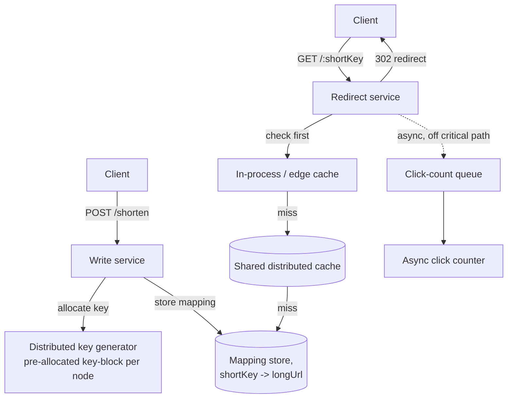

# Architecture Atlas: URL Shortener System

> **Sourcing note:** like [Real-Time Chat System](real-time-chat-system.md) and [Ticket and Event Booking System](ticket-and-event-booking-system.md), this entry is new, original content, not elevated from an existing study-pack exercise — none exists for this problem. It is a third additional canonical design problem toward the Master Topic Register's T-813 (Canonical design problems (12-problem set)) line. *Update:* one further addition after this one — [Distributed Key-Value Store](distributed-key-value-store.md) — brought the Atlas to exactly 12 classic full-system-design entries, matching T-813's stated count; see that entry's sourcing note and the Architecture Atlas README for the full accounting.

**Delivered as a timed, 45-minute exercise using [System Design Method and Estimation](../syllabus/11-system-design/system-design-method-and-estimation.md)'s six-phase method.**

## Table of Contents

1. [Problem Statement](#problem-statement)
2. [Constraints](#constraints)
3. [Functional Requirements](#functional-requirements)
4. [Non-Functional Requirements](#non-functional-requirements)
5. [Capacity Assumptions](#capacity-assumptions)
6. [Architecture Diagram](#architecture-diagram)
7. [Data Model](#data-model)
8. [APIs](#apis)
9. [Request Flow](#request-flow)
10. [Consistency Model](#consistency-model)
11. [Scaling Strategy](#scaling-strategy)
12. [Reliability Strategy](#reliability-strategy)
13. [Security, Observability, and Cost](#security-observability-and-cost)
14. [Trade-offs](#trade-offs)
15. [Alternatives Considered](#alternatives-considered)
16. [Staff-Level Discussion](#staff-level-discussion)
17. [Interview Presentation Sequence](#interview-presentation-sequence)

---

## Problem Statement

Design a service that accepts a long URL and returns a short, unique alias that redirects to it. The central tension distinguishing this from most CRUD systems: the write path (creating a short link) is trivial and infrequent, while the read path (resolving a short link and redirecting) is both the overwhelming majority of traffic *and* sits directly on a user's click-through critical path — every millisecond of redirect latency is felt by a real person waiting for a page to load, which pushes the entire design toward aggressive caching and away from anything that adds read-path complexity for the write path's benefit.

## Constraints

**In scope:** generating a short, unique key for a submitted long URL, redirecting a short-link request to its long URL with minimal latency, and basic click analytics (count only). **Explicitly out of scope for this exercise:** custom/vanity short links, link expiration policies, and a full analytics dashboard (geographic/referrer breakdowns) — naming them as deliberately excluded is itself part of a strong Phase 1 answer.

## Functional Requirements

- Accept a long URL and return a short alias.
- Resolve a short alias to its long URL and issue an HTTP redirect.
- Track a click count per short alias.

## Non-Functional Requirements

- Redirect latency must be low (single-digit milliseconds at p99, excluding network transit) — this is on the critical path of every single click through a shortened link.
- The read:write ratio is extreme (assume at least 100:1) — the design must be optimized for read latency and read throughput first, write throughput a distant second.
- A short alias, once issued, must always resolve to the same long URL for its entire lifetime (no aliasing collisions, ever).
- Click-count tracking must not add latency to the redirect itself — an analytics write must never sit on the critical path of a read that a real user is waiting on.

## Capacity Assumptions

```
Assumption: 100M new short links created per month
            -> ~40 writes/s average (trivial write load)
Assumption: 100:1 read:write ratio -> ~4,000 redirects/s average,
            ~12,000/s peak (3x)
Assumption: a 7-character base62 key space supports 62^7 (~3.5 trillion)
            unique aliases -- far beyond any realistic total-link count,
            so key-space exhaustion is not a real design constraint here
Assumption: long URLs average ~100 bytes; at 100M new links/month the
            raw mapping-table growth is on the order of tens of GB/year,
            not itself a storage-capacity concern

The 100:1-or-worse read:write ratio is the single number that should
drive every subsequent architecture decision -- this is fundamentally a
caching and read-latency problem, not a write-scalability problem.
```

## Architecture Diagram



**Justified against this design's own topics:**

- **A two-tier cache in front of the mapping store** — a fast, small edge/in-process cache backed by a larger shared distributed cache — per [Caching Strategies and Invalidation](../syllabus/11-system-design/caching-strategies-and-invalidation.md), is what actually delivers the sub-10ms redirect latency requirement: at a 100:1+ read:write ratio, the mapping store itself should rarely be touched on the hot path at all once a link has been resolved once anywhere in the fleet.
- **A distributed key generator that pre-allocates a block of keys per write-service node**, rather than a single global auto-increment counter, avoids turning the (already low-volume) write path into a serialization point — each node hands out keys from its own locally-held block and only round-trips to the shared allocator once the block is exhausted, trading a small amount of key-space "waste" (unused keys in a block if a node restarts) for eliminating write-path contention entirely.
- **Click counting is explicitly asynchronous and off the redirect's own critical path** — the redirect service enqueues a click event and returns the `302` immediately; an analytics count that's a few seconds stale is an acceptable trade against ever adding latency to the one operation this design's non-functional requirements treat as latency-critical above everything else.

## Data Model

**Mapping store:** `(shortKey, longUrl, createdAt)` — a simple key-value shape; a relational table with `shortKey` as primary key works identically well to a genuine key-value store here, since there are no relational queries this design actually needs beyond point lookups by key. **Click counts:** a separate, eventually-consistent counter keyed by `shortKey`, updated asynchronously off the click-event queue — deliberately not the same write path or even necessarily the same storage engine as the mapping table, since its consistency and latency requirements are entirely different.

## APIs

```
POST /shorten
  {longUrl}
  -> 201 {shortUrl: "https://short.ly/aZ3kQ1x"}

GET /:shortKey
  -> 302 Found, Location: <longUrl>
  (a real HTTP redirect status, not a 200 with a body -- lets browsers
  and CDNs cache the redirect itself where appropriate)

GET /:shortKey/stats -> {clicks: N}
```

## Request Flow

1. **Write path:** a client submits a long URL; the write service pulls the next key from its locally pre-allocated block (or requests a new block if exhausted), stores the `(shortKey, longUrl)` mapping, and returns the short URL.
2. **Read path:** a client requests a short URL; the redirect service checks its local cache first, then the shared distributed cache, then the mapping store only on a full cache miss — and populates both cache tiers on the way back up so the next request for the same key anywhere in the fleet hits the shared cache instead of the store.
3. The redirect service issues the `302` immediately after resolving the long URL, without waiting on the click-tracking step.
4. Separately, the click event is enqueued and processed asynchronously by a counter service, updating the click count with no impact on redirect latency.

## Consistency Model

The mapping itself is effectively immutable once created (no functional requirement calls for editing an existing short link's target), which is exactly what makes aggressive, long-TTL caching safe here without a cache-invalidation problem to solve at all — a cached mapping never goes stale, because the thing it maps to never changes. Click counts are deliberately eventually consistent: the count returned by `GET /:shortKey/stats` may lag the true count by however long the async queue takes to drain, an explicit, accepted trade for keeping the redirect path itself free of any write-path dependency.

## Scaling Strategy

The read path scales almost entirely through caching, not through mapping-store scaling — at a sustained 100:1+ read:write ratio with an immutable, cache-friendly mapping, a well-sized distributed cache can absorb the overwhelming majority of redirect traffic, leaving the underlying store to handle a comparatively tiny volume of genuine cache misses (new or rarely-accessed links) plus the already-small write volume. The write path scales via the pre-allocated key-block generator, which needs no coordination between write-service nodes for the common case of a node that still has unused keys in its current block.

## Reliability Strategy

1. **A write-service node crashing mid-block is a capacity-planning cost, not a correctness bug** — any keys left unused in that node's pre-allocated block are simply never issued again, a bounded, acceptable waste given the enormous total key space (see Capacity Assumptions), not a re-issuance or collision risk.
2. **A cache-tier outage degrades latency, not correctness** — if the shared distributed cache becomes unavailable, redirects still resolve correctly by falling through to the mapping store directly; p99 latency rises, but no request fails or returns a wrong answer, which is the specific trade-off [Distributed Cache](distributed-cache.md) frames generally for a cache-aside pattern.
3. **The click-count queue backing up under load must never back-pressure the redirect path** — per this repository's own [Capacity Planning and Headroom](../syllabus/16-performance-jvm/capacity-planning-and-headroom.md) framing, the click-counting pipeline should be provisioned and monitored as an independent component with its own headroom target, precisely so a slowdown there is contained to (temporarily) stale click counts rather than propagating into redirect latency.

## Security, Observability, and Cost

Not addressed in this 45-minute exercise, which was deliberately scoped to the caching and key-generation problem (see Constraints). A full treatment would need, at minimum: malicious-URL screening at creation time (a short link is a generic redirect primitive, trivially abusable for phishing if unchecked), rate-limiting link creation per caller to prevent abuse of the free key space, metrics on cache hit rate at each tier as the single leading indicator of whether the redirect-latency requirement is actually being met, and a cost model dominated by cache-tier memory sizing at the given read volume rather than by mapping-store storage (which this design's own capacity assumptions show is comparatively small). These are flagged here as explicit gaps rather than invented to fill out the template.

## Trade-offs

| Decision | Benefit | Cost |
|---|---|---|
| Aggressive multi-tier caching of an immutable mapping | Sub-10ms redirect latency at massive read volume, with no invalidation problem to solve | Real memory cost for cache capacity sized to the working set of "hot" short links |
| Pre-allocated key blocks per write node | No write-path coordination contention | A small amount of key-space waste on node crash/restart |
| Asynchronous click counting | Redirect latency never depends on the analytics write path | Click counts are eventually consistent, not real-time-exact |
| `302` redirect (not a `200` with a body) | Lets intermediary caches/CDNs and browsers cache the redirect itself | Slightly less flexibility than an API response if richer redirect metadata were ever needed |

## Alternatives Considered

- **A single global auto-increment counter for key generation.** Rejected: turns every single write, however infrequent, into a serialization point against one shared counter — an unnecessary bottleneck given this design's own capacity assumptions show write volume was never the actual scaling concern.
- **Random key generation with a collision check on write.** Rejected: at this design's key-space size (62^7), collisions are already vanishingly rare, but a collision-check-then-retry loop adds unnecessary write-path complexity and latency for a problem the pre-allocated-block approach avoids by construction (each block's keys are guaranteed unique by allocation, not probabilistically unique by chance).
- **Synchronous click counting on the redirect's own write path.** Rejected: directly violates the stated non-functional requirement that redirect latency must never depend on the analytics write — this alternative is named specifically to make that trade-off's cost explicit, not because it was ever a close call.

## Staff-Level Discussion

The most instructive decision in this design is recognizing that the mapping's *immutability* is what makes the entire caching strategy simple — many candidates default to a generic "add a cache, handle invalidation" answer out of habit, without noticing that this specific problem has no invalidation problem to solve at all, because nothing about an existing mapping ever legitimately changes. A Staff engineer's value here is recognizing when a system's own data model eliminates an entire class of hard problem (cache invalidation, in this case) rather than reflexively applying the general-purpose pattern for a specific problem that doesn't actually need its full complexity — over-engineering a TTL-and-invalidation strategy for data that never changes is itself a real anti-pattern worth naming explicitly, not just a missed optimization.

## Interview Presentation Sequence

Delivered as a timed, 45-minute exercise using the six-phase method's own stated budget — see [System Design Narration and Whiteboard Discipline](../syllabus/20-interview-preparation/system-design/system-design-narration-and-whiteboard-discipline.md) for sequencing the diagram (client and the read/write entry points first, the core redirect-through-cache path next since it's the design's actual center of gravity, the key-generation mechanism and async click-counting introduced afterward as secondary concerns). A self-verification exit check for this specific problem: the 100:1+ read:write ratio stated explicitly and used to justify every subsequent decision, not left implicit; the mapping's immutability named as the specific reason no cache-invalidation strategy is needed; the pre-allocated key-block mechanism explained as a write-path contention avoidance, not just "how keys are generated"; and click counting explicitly placed off the redirect's critical path with the eventual-consistency trade-off stated aloud.
