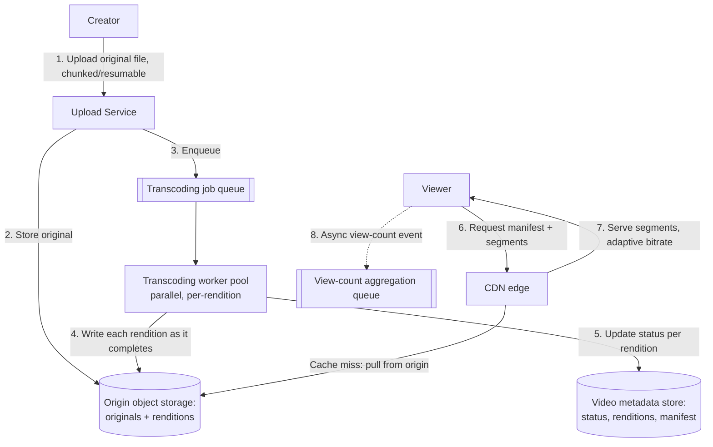

# Architecture Atlas: Video Streaming Platform

> **Sourcing note:** new, original content, added 2026-09-10 as part of a full repository-wide gap audit that found this Atlas — deliberately closed against the Master Topic Register's T-813 "12-problem set" target on 2026-09-01 — was still missing three specific, commonly-asked case studies the audit named explicitly: video streaming, distributed file storage, and web crawler/autocomplete. This is the first of that follow-up set. It is not part of, and does not reopen, T-813's own closed accounting (see the Atlas README); it's a genuinely new addition beyond that target, the same way [Sorting Algorithms](../syllabus/03-data-structures-algorithms/sorting-algorithms.md) was added to `03-data-structures-algorithms` beyond that domain's own closed 18-item plan the same day.

**Delivered as a timed, 45-minute exercise using [System Design Method and Estimation](../syllabus/11-system-design/system-design-method-and-estimation.md)'s six-phase method.**

## Table of Contents

1. [Problem Statement](#problem-statement)
2. [Constraints](#constraints)
3. [Functional Requirements](#functional-requirements)
4. [Non-Functional Requirements](#non-functional-requirements)
5. [Capacity Assumptions](#capacity-assumptions)
6. [Architecture Diagram](#architecture-diagram)
7. [Data Model](#data-model)
8. [APIs](#apis)
9. [Request Flow](#request-flow)
10. [Consistency Model](#consistency-model)
11. [Scaling Strategy](#scaling-strategy)
12. [Reliability Strategy](#reliability-strategy)
13. [Security, Observability, and Cost](#security-observability-and-cost)
14. [Trade-offs](#trade-offs)
15. [Alternatives Considered](#alternatives-considered)
16. [Staff-Level Discussion](#staff-level-discussion)
17. [Interview Presentation Sequence](#interview-presentation-sequence)

---

## Problem Statement

Design a video-on-demand streaming platform (a YouTube/Netflix-shaped system): creators upload video files; the system processes them into multiple playable renditions; viewers stream those renditions with smooth playback across varying network conditions and device types. The central tension is that upload and playback are two almost entirely unrelated problems glued together by one asynchronous pipeline between them — a large, infrequent, write-heavy ingest path, and a small-per-request, extremely read-heavy, latency-and-bandwidth-sensitive delivery path — and conflating their designs (treating video like any other uploaded file) produces a system that's wrong for both.

## Constraints

**In scope:** on-demand (pre-recorded) video upload, asynchronous transcoding into multiple resolutions/bitrates, adaptive-bitrate playback, and view-count tracking. **Explicitly out of scope:** live streaming — stating this exclusion explicitly is itself part of a strong Phase 1 answer, since live streaming's core constraint (sub-second, sustained low latency from camera to viewer, with no time available for a multi-minute transcoding pass) is a fundamentally different problem from on-demand playback's "some processing delay after upload is fine" constraint, not a harder version of the same one. Also out of scope: recommendation/ranking algorithms, comments, and monetization — named as real, adjacent systems this design deliberately doesn't absorb.

## Functional Requirements

- A creator uploads a video file; the system durably stores the original and begins processing it without blocking the upload response on that processing finishing.
- The system produces multiple renditions (several resolution/bitrate combinations) from each uploaded video, packaged for adaptive-bitrate streaming.
- A viewer can start playback within a few seconds of pressing play, and the player automatically switches rendition as available bandwidth changes, without a playback interruption.
- View counts are tracked per video, visible to creators, without being on the playback-request critical path.

## Non-Functional Requirements

- Playback start latency and mid-playback rebuffering are the platform's most visible, most complained-about failure modes — both must be optimized aggressively, even at real cost (storage, compute, CDN spend) elsewhere in the system.
- The system must serve a global audience with acceptable playback latency regardless of a viewer's distance from wherever the video was originally uploaded and processed.
- Processing latency (upload-to-first-available-rendition) is real and non-zero, and must be communicated honestly to creators (a visible "processing" state) rather than hidden or assumed away.
- Storage cost scales with both the number of uploaded videos and the number of renditions produced per video — a real, multiplicative cost the design must account for explicitly, not treat as free.

## Capacity Assumptions

```
Assumption: 500,000 new video uploads/day, average original file size 500MB
            -> ~250TB/day of new original-file ingest
Assumption: 6 renditions produced per video (e.g., 240p/360p/480p/720p/1080p/4K),
            averaging ~40% of the original's size combined across all 6
            -> ~100TB/day of new rendition storage, on top of the originals
Assumption: 200M daily video views, average watch session 8 minutes at an
            average delivered bitrate of ~3 Mbps (mixed rendition mix)
            -> (200M x 8 x 60 x 3Mb) / 8 bits-per-byte ≈ 3.6 exabytes/day
            of egress bandwidth -- a bandwidth cost roughly four orders of
            magnitude larger than the ingest side, driven almost entirely
            by how many renditions get delivered at high bitrate, not by
            upload volume
Assumption: transcoding a single video into 6 renditions takes ~1-3 minutes
            of dedicated compute per minute of source video on typical
            transcoding hardware -> with 500K uploads/day averaging 10
            minutes each, ~5M-15M compute-minutes/day of transcoding work,
            genuinely parallelizable per-video and per-rendition

The single number that reframes this problem is the ~3.6 exabytes/day
egress figure against ~250TB/day of ingest: this is overwhelmingly a
read/delivery/bandwidth problem, not a write/storage/ingest problem --
every architecture decision below is weighted accordingly.
```

## Architecture Diagram



**Justified against this design's own topics:**

- **The upload path and the playback path share almost no infrastructure**, deliberately: uploads go through a dedicated Upload Service straight to origin storage and a job queue, entirely decoupled from the CDN-fronted playback path — a viewer's request never touches the upload or transcoding infrastructure at all, and a surge in uploads cannot degrade playback for existing viewers.
- **A CDN in front of origin storage** is the direct, load-bearing answer to the "global audience, low playback latency" non-functional requirement — per [Caching Strategies and Invalidation](../syllabus/11-system-design/caching-strategies-and-invalidation.md), and, exactly like the [URL Shortener System](url-shortener-system.md)'s own insight, video segments are immutable once produced, so there is no cache-invalidation problem to solve at all once a rendition is published — only a cache-population (cold-start) one.
- **Transcoding is a real, asynchronous, per-rendition-parallelizable pipeline**, not a synchronous step in the upload response — the metadata store's per-rendition status (not a single "processed" boolean) is what lets the platform make the lowest-resolution, fastest-to-produce rendition available for early playback while higher renditions are still processing, directly serving the "playback within a few seconds" requirement without waiting for the whole pipeline.
- **View counting is asynchronous and off the playback critical path**, the same deliberate choice the [URL Shortener System](url-shortener-system.md) makes for click counting — a viewer's playback experience never waits on, or degrades from, view-count aggregation.

## Data Model

**Video metadata:** `videoId`, creator, upload timestamp, per-rendition status (`pending`/`processing`/`ready`/`failed`, one entry per resolution/bitrate), and a manifest reference (the adaptive-bitrate playlist — HLS's `.m3u8` or DASH's `.mpd` — listing which renditions are currently ready and where their segments live). **Segment storage:** each rendition is itself chunked into short (a few seconds each) segments in origin storage, the actual unit the CDN caches and serves — chunking, not whole-file serving, is what makes adaptive bitrate switching mid-playback possible at all, since the player can request the next segment at a different bitrate without restarting the stream. **View-count store:** a simple, eventually-consistent per-video counter, updated by aggregating the async view-count event stream rather than incremented synchronously per view.

## APIs

```
POST /videos
  {creator, filename, ...}
  -> 202 Accepted {videoId, uploadUrl}   (resumable/chunked upload begins
                                          against uploadUrl; response
                                          does not wait on transcoding)

GET /videos/{videoId}/manifest
  -> 200 {manifestUrl}                   (points to the current, possibly
                                          partial, adaptive-bitrate
                                          playlist -- some renditions may
                                          still be "processing")
  -> 404                                 (no renditions ready yet)

GET /videos/{videoId}/status
  -> 200 {renditions: [{resolution, status}, ...]}

POST /videos/{videoId}/views   (fire-and-forget, async-processed)
  -> 202 Accepted
```

## Request Flow

**Upload:** (1) creator initiates upload, receiving a `videoId` and an upload target immediately; (2) the file is chunked and uploaded (resumable, so a dropped connection doesn't require restarting a multi-gigabyte upload from zero); (3) once the original is durably stored, a transcoding job is enqueued; (4) the transcoding worker pool processes each target rendition in parallel, writing each finished rendition's segments to origin storage and updating that rendition's status independently; (5) the manifest is updated (or created) as each rendition becomes ready, so playback can begin using whichever renditions currently exist.

**Playback:** (1) the viewer's player requests the manifest; (2) the player begins requesting segments from the CDN edge nearest it, starting at a rendition appropriate to its measured initial bandwidth; (3) the CDN edge serves from cache if warm, or pulls from origin on a cache miss, caching the segment for subsequent viewers in that region; (4) the player continuously re-measures effective bandwidth and switches which rendition it requests for the *next* segment accordingly — never re-requesting or restarting already-played segments; (5) a view-count event is emitted asynchronously, independent of the segment-serving path.

## Consistency Model

This design is deliberately, explicitly eventually consistent in two distinct, differently-shaped ways that should not be conflated in an interview answer: **rendition availability** is monotonic-but-incomplete (a rendition, once marked ready, never becomes un-ready, but different renditions become ready at different times after upload — the manifest simply reflects whatever subset exists at request time, not an all-or-nothing published state), while **view counts** are a genuinely approximate, asynchronously-aggregated tally with no guarantee of exact real-time accuracy at any given instant. Neither weaker-than-strong-consistency choice is a compromise being apologized for — both are the deliberately correct fit for what actually needs to be exact (nothing here does) versus what needs to be fast and decoupled (everything here does).

## Scaling Strategy

The playback path scales primarily by CDN edge capacity and cache hit rate, not by origin or application-server capacity — a well-performing design should see the overwhelming majority of segment requests served from CDN cache, with origin storage load dominated by the (comparatively tiny) volume of true cache misses and the transcoding pipeline's own writes. The upload/transcoding path scales by adding transcoding workers, since a single video's rendition jobs are independently parallelizable across workers and across videos — this pipeline's throughput is a straightforward function of worker pool size against the real per-rendition compute cost from the Capacity Assumptions. The two paths scale independently, by design, since they share no infrastructure.

## Reliability Strategy

1. **A transcoding job failing partway through must not silently leave a video stuck with no available rendition** — per-rendition status tracking means a failure on the 4K rendition doesn't block the 480p rendition from being marked ready and playable; the failed rendition is retried or surfaced to the creator independently.
2. **CDN edge failure or regional unavailability must fail over to another edge or to origin directly**, at a real, accepted latency cost for affected viewers, rather than failing the request outright — this is a standard CDN capability, not something this design builds itself, but it must be named as a real dependency and failure mode, not assumed away.
3. **Origin storage durability is the real backstop for both originals and renditions** — losing a rendition means re-transcoding (recoverable, at real compute cost and delay); losing an *original* with no rendition yet produced is unrecoverable data loss, which is why origin storage's own durability guarantee (not the CDN's, which is a cache, not a source of truth) is the property this design actually depends on for correctness.

## Security, Observability, and Cost

**Security:** signed, time-limited playback URLs (preventing a manifest or segment URL from being freely shared/hotlinked outside the intended viewing context) and upload-side authentication tying a `videoId` to its owning creator are the minimum real requirements; content moderation (a genuinely large, separate problem) is explicitly out of scope here. **Observability:** per-rendition transcoding success/failure rate and latency (the leading indicator of a pipeline problem before creators report "my video won't play in HD"), and CDN cache-hit ratio by region (the leading indicator of a playback-latency problem before viewers report buffering) are the two most operationally load-bearing metrics for this specific design. **Cost:** per the Capacity Assumptions, egress/CDN bandwidth dominates total cost by roughly four orders of magnitude over storage — a real, quantified reason this design's central optimization target is cache-hit ratio and rendition-bitrate selection efficiency, not storage cost reduction.

## Trade-offs

| Decision | Benefit | Cost |
|---|---|---|
| Fully decoupled upload/transcoding path from playback path | A traffic spike on either side never degrades the other | More total infrastructure and operational surface than one unified pipeline |
| Per-rendition (not per-video) status tracking | Playback can begin on whichever renditions are ready first, without waiting for all six | More complex metadata model and manifest-update logic |
| CDN-fronted, immutable, chunked segment delivery | No cache-invalidation problem; scales playback independent of origin | Real, ongoing CDN cost proportional to egress bandwidth, the platform's dominant cost driver |
| Asynchronous, approximate view counting | Zero impact on playback critical path | View counts are never exactly real-time-accurate |

## Alternatives Considered

- **Transcoding synchronously as part of the upload request, blocking until all renditions are ready.** Rejected: directly violates the stated "upload response doesn't block on processing" requirement, and would make upload latency scale with video length and rendition count rather than with the (much smaller) actual data-transfer time.
- **Serving video directly from origin storage, with no CDN layer.** Rejected: origin storage's physical location cannot be close to every global viewer simultaneously, and would force every playback request — not just cache misses — to pay full cross-region latency, directly conflicting with the platform's most visible non-functional requirement.
- **A single, fixed rendition (e.g., always transcode to one "standard" quality) instead of adaptive bitrate.** Rejected: forces every viewer onto the same bitrate regardless of their actual available bandwidth, producing either wasted bandwidth for viewers who could handle higher quality or rebuffering for viewers who can't handle the fixed choice — adaptive bitrate's entire value is matching delivered quality to each viewer's real-time conditions.

## Staff-Level Discussion

The single most instructive decision in this design is recognizing that "video streaming" is actually two nearly-unrelated systems (an asynchronous, write-oriented processing pipeline; a synchronous, read-oriented, CDN-fronted delivery system) connected by one narrow interface — the manifest and its per-rendition readiness state — and that the platform's overwhelming cost and scaling pressure (per the Capacity Assumptions' ~3.6 exabyte/day egress figure) sits almost entirely on the delivery side, not the processing side many candidates instinctively focus on first. A Staff engineer's value here is redirecting design effort and review scrutiny toward whichever side of a system actually carries the dominant cost and risk — in this design, that means CDN strategy and rendition-bitrate selection efficiency deserve far more design attention than the transcoding pipeline's internals, even though transcoding is the more technically novel-feeling part of the problem to design.

## Interview Presentation Sequence

Delivered as a timed, 45-minute exercise using the six-phase method's own stated budget — see [System Design Narration and Whiteboard Discipline](../syllabus/20-interview-preparation/system-design/system-design-narration-and-whiteboard-discipline.md) for sequencing the diagram (the upload-vs-playback split first, since it's the design's own central idea and everything else is a consequence of it; the transcoding pipeline and per-rendition status next; the CDN/adaptive-bitrate playback path last, spending the most time here given the Capacity Assumptions' own cost-weighting finding). A self-verification exit check for this specific problem: live streaming's exclusion stated explicitly as a scoping decision, not silently ignored; the ~3.6-exabyte/day egress-versus-ingest asymmetry named with real numbers, not asserted as "video is bandwidth-heavy" without quantification; per-rendition (not per-video) status explained as what enables early, partial playback availability; and the immutable-segment/no-invalidation insight named explicitly, the same pattern this Atlas's URL Shortener entry established.
