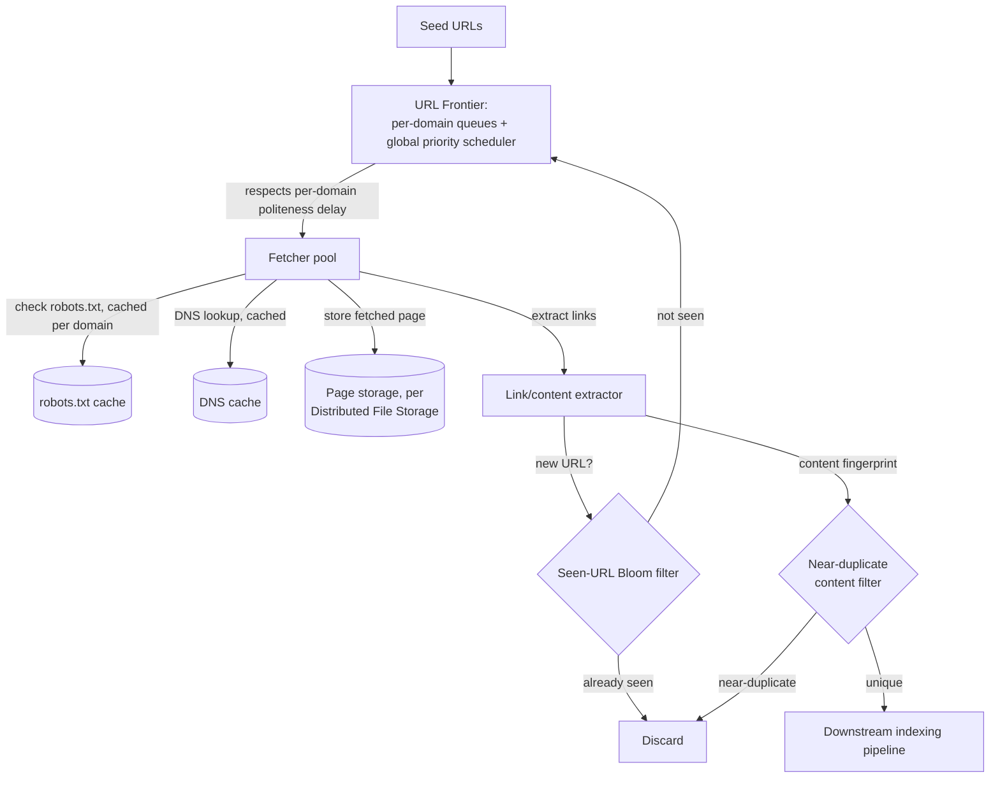

# Architecture Atlas: Web Crawler System

> **Sourcing note:** new, original content, added 2026-09-11 as the third and last entry in the same Architecture Atlas follow-up set as [Video Streaming Platform](video-streaming-platform.md) and [Distributed File Storage System](distributed-file-storage-system.md) — the audit's own "web crawler/autocomplete" gap item, scoped here to the web crawler half specifically (autocomplete/typeahead is a genuinely different problem — trie-based prefix search and ranking, not URL discovery and fetch scheduling — and remains a distinct, still-open gap rather than being force-fit into this entry). Like the two entries before it, this is additive beyond the Atlas's own closed T-813 target, not a reopening of it.

**Delivered as a timed, 45-minute exercise using [System Design Method and Estimation](../syllabus/11-system-design/system-design-method-and-estimation.md)'s six-phase method.**

## Table of Contents

1. [Problem Statement](#problem-statement)
2. [Constraints](#constraints)
3. [Functional Requirements](#functional-requirements)
4. [Non-Functional Requirements](#non-functional-requirements)
5. [Capacity Assumptions](#capacity-assumptions)
6. [Architecture Diagram](#architecture-diagram)
7. [Data Model](#data-model)
8. [APIs](#apis)
9. [Request Flow](#request-flow)
10. [Consistency Model](#consistency-model)
11. [Scaling Strategy](#scaling-strategy)
12. [Reliability Strategy](#reliability-strategy)
13. [Security, Observability, and Cost](#security-observability-and-cost)
14. [Trade-offs](#trade-offs)
15. [Alternatives Considered](#alternatives-considered)
16. [Staff-Level Discussion](#staff-level-discussion)
17. [Interview Presentation Sequence](#interview-presentation-sequence)

---

## Problem Statement

Design a large-scale web crawler: starting from a set of seed URLs, discover and fetch pages across the web, extract new links to crawl further, and store fetched content for downstream indexing — at a scale of billions of pages, without overwhelming any single site being crawled. The central tension is that "crawl as much as possible, as fast as possible" and "never crawl any one site too aggressively" are in direct, structural conflict, and the entire URL-scheduling design exists to resolve that conflict: high *aggregate* throughput across millions of distinct domains, with strict, individually-enforced *per-domain* rate limits.

## Constraints

**In scope:** URL discovery via link extraction, politeness-respecting fetch scheduling, duplicate-URL and near-duplicate-content detection, and durable storage of fetched pages for a downstream indexing system to consume. **Explicitly out of scope:** the indexing/ranking system itself (a genuinely separate problem, referenced but not designed here — see [Search and Indexing Systems](../syllabus/11-system-design/search-and-indexing-systems.md)), JavaScript-rendered content requiring a full browser engine to crawl, and autocomplete/typeahead (a different problem entirely — see this entry's own sourcing note). Naming these exclusions explicitly is itself part of a strong Phase 1 answer, since conflating "crawl the web" with "rank and serve search results from what was crawled" is a common, scope-breaking mistake.

## Functional Requirements

- Given a set of seed URLs, discover new URLs by extracting links from fetched pages, and continue crawling discovered URLs.
- Never fetch the same URL redundantly within a given re-crawl window, and detect near-duplicate content (mirrors, syndicated copies) even when the URLs differ.
- Respect each site's `robots.txt` exclusions and stated crawl-delay preference.
- Re-crawl previously-fetched pages periodically, at a frequency that can vary per page based on how often that page tends to change.

## Non-Functional Requirements

- Aggregate crawl throughput must scale by adding more crawling capacity, without being capped by any single domain's fetch rate.
- No single domain should ever receive a disproportionate share of concurrent or per-second requests, regardless of how many links to that domain are discovered — politeness is a hard constraint, not a best-effort courtesy.
- The seen-URL and seen-content deduplication structures must stay memory-bounded even at billions of URLs — an exact, unbounded-memory set is explicitly not required, and a small, quantified false-positive rate is an acceptable, deliberate trade.
- A slow or unresponsive site must not stall the crawler's overall progress — individual fetch failures and timeouts must be isolated, not allowed to block the frontier.

## Capacity Assumptions

```
Assumption: target 1 billion pages crawled per month, average page
            size 200KB -> ~200TB/month of fetched content, before
            any re-crawl overhead
Assumption: 1 billion pages / (30 days x 86,400 s/day) ≈ 385 pages/s
            sustained average fetch rate needed to hit that target
Assumption: politeness requires spacing requests to the same domain
            by at least ~1-2 seconds -> a single domain caps out at
            well under 1 page/s -- hitting 385 pages/s aggregate
            therefore requires fetching from many hundreds of
            distinct domains concurrently, not from fewer domains
            faster; this is the real, quantified reason the frontier
            must be domain-sharded, not a single global queue
Assumption: seen-URL set at ~10 billion URLs (discovered, not all
            fetched), each URL hashed to a fixed-size fingerprint ->
            a Bloom filter sized for ~1% false-positive rate at that
            scale needs roughly 1.2GB per billion entries (per the
            standard Bloom-filter sizing formula), i.e. ~12GB total
            -- small enough to fit in memory on a modest number of
            machines, versus terabytes for an exact hash-set at the
            same scale

The politeness-vs-domain-count relationship is the single number that
shapes this entire design: sustained throughput is fundamentally a
function of concurrent distinct-domain count, not of how fast any
one domain can be hit.
```

## Architecture Diagram



**Justified against this design's own topics:**

- **The URL Frontier is domain-sharded, with a per-domain politeness queue behind a global priority scheduler** — this is the direct, load-bearing answer to the Capacity Assumptions' own finding that aggregate throughput comes from concurrent distinct-domain count, not per-domain speed. A single global FIFO queue would let one domain's backlog dominate the fetch schedule; per-domain queues, each independently rate-limited, are what makes the "never overwhelm one site" non-functional requirement structurally enforced rather than hoped for.
- **A Bloom filter, not an exact set, backs seen-URL deduplication** — per the Capacity Assumptions' own sizing math, this keeps the structure memory-bounded at billions of entries, at the cost of a real, quantified, accepted false-positive rate (a small fraction of genuinely-new URLs get incorrectly treated as already-seen and skipped) — a deliberate, stated trade, not an oversight.
- **DNS and `robots.txt` are both cached per domain**, since re-resolving DNS or re-fetching `robots.txt` on every single page fetch to the same domain would multiply request volume for no benefit — both are real, common crawler bottlenecks when overlooked.
- **Fetched pages are stored durably** (via the same metadata/data-path separation [Distributed File Storage System](distributed-file-storage-system.md) covers generally) **before being handed to a separate link-extraction and downstream-indexing pipeline** — decoupling "get the bytes safely stored" from "do something with them" the same way [Video Streaming Platform](video-streaming-platform.md)'s upload-vs-processing split does.

## Data Model

**Frontier entry:** URL, discovery timestamp, priority score (a function of the source page's importance and how overdue this URL is for its next crawl), and its target domain (the sharding key for which per-domain queue it lives in). **Seen-URL filter:** a Bloom filter keyed on a normalized URL (lowercased host, sorted query parameters, tracking parameters stripped — real, necessary normalization, since `example.com/page?utm_source=x` and `example.com/page` are the same page for crawling purposes). **Content fingerprint store:** a fixed-size hash (e.g., a simhash or similar locality-sensitive fingerprint) per fetched page's content, allowing near-duplicate detection by comparing fingerprints for approximate similarity rather than requiring byte-for-byte identity. **Page record:** URL, fetch timestamp, HTTP status, content (or a pointer to where it's durably stored), and extracted outbound links.

## APIs

This system's real "API surface" is internal (crawler-to-crawler-component), not a public-facing one:

```
FRONTIER.enqueue(url, priority)
  -> adds to the target domain's queue if not already present
     and not filtered by the seen-URL check

FRONTIER.dequeue(domain)
  -> returns the next URL for this domain, respecting that
     domain's minimum inter-request interval

FETCHER.fetch(url)
  -> 200 {content, links[]}
  -> 3xx {redirectTo}       (re-enqueued as a new frontier entry)
  -> 4xx/5xx/timeout         (logged, retried with backoff up to a
                              limit, then abandoned for this cycle)

EXTRACTOR.process(pageContent)
  -> {links[], contentFingerprint}
```

## Request Flow

1. The scheduler selects a domain whose per-domain politeness interval has elapsed and that has queued URLs, and dequeues the next (highest-priority) URL for that domain.
2. A fetcher checks the cached `robots.txt` for that domain; if the URL is disallowed, it's discarded without a fetch.
3. The fetcher resolves DNS (cached) and fetches the page, handling redirects by re-enqueueing the redirect target as a new frontier entry rather than following it inline.
4. The fetched content is durably stored, then handed to the extractor, which pulls outbound links and computes a content fingerprint.
5. Each extracted link is checked against the seen-URL Bloom filter; genuinely new URLs are enqueued back into the frontier under their target domain.
6. The content fingerprint is checked against the near-duplicate filter; a near-duplicate is discarded before reaching the downstream indexing pipeline, while a unique page is forwarded to it.

## Consistency Model

This design is deliberately, explicitly approximate in two distinct ways, both stated rather than hidden: the **seen-URL Bloom filter** can produce a false positive (treating a genuinely new URL as already-seen and silently skipping it) at a real, quantified, accepted rate — a small amount of missed coverage traded for a memory-bounded structure at billions of URLs. **Freshness** is inherently stale between re-crawls: a page's stored content and link graph reflect its state as of its last fetch, not the current live page, and the re-crawl scheduling frequency (not attempted here to make instantaneous) is the whole mechanism for bounding how stale that gets, per page, based on that page's own observed change frequency.

## Scaling Strategy

The fetcher pool scales horizontally by adding more fetcher workers, each pulling from whichever domain queues are currently eligible (past their politeness interval) — this scales cleanly because, per the Capacity Assumptions, real throughput growth comes from crawling more distinct domains concurrently, which more fetcher workers directly enables. The frontier itself, sharded by domain (consistent hashing, per [Data Partitioning and Consistent Hashing](../syllabus/10-distributed-systems/data-partitioning-and-consistent-hashing.md), determining which frontier shard owns which domain's queue), scales by adding frontier shards as the total number of actively-tracked domains grows, independent of fetcher pool size.

## Reliability Strategy

1. **A single slow or unresponsive domain must never stall the whole crawler** — per-domain queues, each independently scheduled, mean one domain backing up simply delays that domain's own crawl progress, with zero effect on every other domain's queue.
2. **A fetch failure is expected, routine, and must not be treated as a crawler-level fault** — retried with backoff up to a bounded limit, then the URL is simply left for a later re-crawl cycle rather than blocking anything.
3. **A crawler trap** (a site generating effectively infinite distinct URLs, e.g., a calendar with a "next day" link forever) **is a real, named failure mode this design must bound explicitly** — a per-domain crawl budget (a cap on pages fetched per domain per time window) is the direct mitigation, preventing one pathological site from consuming a disproportionate share of total crawl capacity even though its politeness-respecting request rate is individually reasonable.

## Security, Observability, and Cost

**Security:** the crawler must identify itself with an honest user-agent string (per real, standard web-crawling etiquette this design's own `robots.txt`-respecting behavior already commits to), and fetched content must be treated as untrusted input by every downstream consumer — a malicious page could attempt to exploit a parser, so the extraction pipeline should run with the same defensive posture as any other untrusted-input-processing system. **Observability:** per-domain fetch success/failure rate and the Bloom filter's actual observed false-positive rate (measurable by periodic exact-set sampling) are the two most operationally load-bearing signals — a spike in either indicates either a domain-specific problem or the seen-URL structure needing resizing before it degrades crawl coverage further. **Cost:** storage (per the Capacity Assumptions' ~200TB/month) and outbound bandwidth are the dominant, real cost drivers, both scaling directly with total pages crawled — a real, quantified reason crawl-budget allocation (which domains and pages get prioritized re-crawl frequency) is a genuine cost-control decision, not just a freshness one.

## Trade-offs

| Decision | Benefit | Cost |
|---|---|---|
| Domain-sharded frontier with per-domain politeness queues | Aggregate throughput scales with distinct-domain count; no single domain can dominate | More complex scheduling logic than one global queue |
| Bloom filter for seen-URL deduplication | Memory-bounded at billions of URLs | A real, quantified false-positive rate causes some genuinely-new URLs to be silently skipped |
| Per-page, change-frequency-aware re-crawl scheduling | Crawl budget spent proportional to how often content actually changes | More complex scheduling than a fixed, uniform re-crawl interval for every page |
| Per-domain crawl budget cap | Bounds a crawler-trap domain's worst-case impact on total capacity | A legitimately large, fast-changing site can also be capped, potentially under-crawled |

## Alternatives Considered

- **A single global FIFO frontier queue, with no per-domain sharding.** Rejected: directly violates the "never overwhelm one domain" requirement — a burst of newly-discovered URLs from one large site would dominate the queue and starve every other domain's crawl progress.
- **An exact hash set for seen-URL deduplication, instead of a Bloom filter.** Rejected at this design's target scale: an exact set for ~10 billion URLs would require far more memory than a Bloom filter's ~12GB (per the Capacity Assumptions), for a correctness guarantee (zero false positives) this design explicitly doesn't require, having stated a small, acceptable false-positive rate instead.
- **A fixed, uniform re-crawl interval for every page, regardless of how often it actually changes.** Rejected: wastes crawl budget re-fetching rarely-changing pages at the same frequency as fast-changing ones, when a change-frequency-aware schedule spends that same total budget far more usefully.

## Staff-Level Discussion

The single most instructive decision in this design is recognizing that "crawl the web fast" and "never overwhelm any one site" are not in tension because of some incidental implementation detail — they're in tension because *aggregate throughput* and *per-domain rate* are fundamentally different quantities, and the entire frontier-sharding design exists specifically to decouple them: aggregate throughput becomes a function of *how many domains* are crawled concurrently, not of pushing any single domain's rate past its politeness limit. A Staff engineer's value here is naming that reframing explicitly and early, since a design that treats "more throughput" and "be polite" as a single dial to balance (rather than two genuinely separate levers — domain parallelism and per-domain rate) will keep proposing the wrong fix (e.g., "just crawl faster") for a problem that specific fix cannot actually solve.

## Interview Presentation Sequence

Delivered as a timed, 45-minute exercise using the six-phase method's own stated budget — see [System Design Narration and Whiteboard Discipline](../syllabus/20-interview-preparation/system-design/system-design-narration-and-whiteboard-discipline.md) for sequencing the diagram (the domain-sharded frontier and politeness constraint first, since it's this design's own central idea and the direct consequence of the Capacity Assumptions' throughput-vs-domain-count math; the seen-URL/near-duplicate filtering next; the storage-and-downstream-handoff last, explicitly scoped away from indexing itself). A self-verification exit check for this specific problem: the aggregate-throughput-versus-per-domain-rate reframing stated explicitly, with real numbers from the Capacity Assumptions, not asserted as "we need to be polite"; the Bloom filter's real, quantified false-positive trade named rather than glossed over; a crawler trap named as a real, specific failure mode with a specific mitigation (crawl budget), not left unaddressed; and indexing/ranking's exclusion from scope stated up front, not discovered mid-design.
