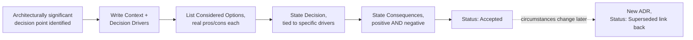

# Architecture Decision Records

> **Topic register:** T-916 (Architecture Decision Records & documentation, IWI 6.2) · Staff tier · Moderate interview frequency
> **Provenance:** the three worked example ADRs in [`practice/architecture/adr-examples/`](../../practice/architecture/adr-examples/README.md) are labeled, representative scenarios — but every number, error message, and result they cite is real, previously-executed evidence from this repository's own [CQRS](cqrs-read-write-separation.md), [multi-region DR](../system-design/multi-region-failover-and-disaster-recovery.md), and [Schema Registry](../kafka/schema-registry-and-compatibility-evolution.md) chapters, cross-linked directly. This chapter also includes a real, tested completeness-checking script — run against both a passing and a deliberately failing input.

## Table of Contents

1. [Learning Objectives](#learning-objectives)
2. [Why This Matters in Interviews](#why-this-matters-in-interviews)
3. [Mental Model](#mental-model)
4. [Definition and Purpose](#definition-and-purpose)
5. [Historical Context](#historical-context)
6. [Core Concepts](#core-concepts)
7. [Internal Implementation](#internal-implementation)
8. [Execution Flow](#execution-flow)
9. [Production Scenarios](#production-scenarios)
10. [Failure Modes and Debugging](#failure-modes-and-debugging)
11. [Trade-offs](#trade-offs)
12. [Organizational Implications](#organizational-implications)
13. [Security Implications](#security-implications)
14. [Decision Framework](#decision-framework)
15. [Comparisons](#comparisons)
16. [Common Mistakes](#common-mistakes)
17. [Anti-Patterns](#anti-patterns)
18. [Best Practices](#best-practices)
19. [Interview Answer Framework](#interview-answer-framework)
20. [Interview Questions](#interview-questions)
21. [Summary](#summary)
22. [Key Takeaways](#key-takeaways)
23. [Cheat Sheet](#cheat-sheet)
24. [Flashcards](#flashcards)
25. [Practice Exercises](#practice-exercises)
26. [Solutions](#solutions)
27. [Additional Reading](#additional-reading)
28. [Official References](#official-references)

---

## Learning Objectives

By the end of this chapter you can:

- Write a complete ADR — Status, Context, Decision, Consequences at minimum — for a real architectural decision, including its negative consequences stated honestly.
- Explain why an ADR's Context section should be reconstructable by someone who wasn't in the room, and what specifically breaks when it isn't.
- Distinguish an ADR from ordinary design documentation, and state what makes a decision "architecturally significant" enough to warrant one.
- Name the concrete cost of *not* writing ADRs, using a real example of a decision this repository's own chapters could otherwise re-litigate.
- Answer "would you write an ADR for this" correctly for a given scenario, with a stated reason, not a reflexive yes or no.

## Why This Matters in Interviews

This topic tests a skill orthogonal to technical depth: whether a candidate can institutionalize their own judgment so it survives their absence. A Staff engineer's most valuable architectural decisions are worthless to the organization the moment that engineer leaves the room, changes teams, or simply forgets the reasoning eighteen months later, unless the *reasoning* — not just the outcome — was captured somewhere durable. Interviewers ask about this because it separates engineers who make good decisions from engineers who make good decisions an organization can actually keep making after they're gone — a distinctly Staff-level, not Senior-level, concern.

## Mental Model

**An ADR is not a record of what was decided — it's a record of why, aimed at a reader who disagrees with the outcome.** The test for whether an ADR is any good is not "does it state the decision clearly" (a Slack message does that) but "if someone reads this in two years, in the middle of arguing the decision was wrong, does it tell them what was actually known and weighed at the time, so they can tell whether circumstances genuinely changed or whether the original reasoning simply wasn't good enough." An ADR that only justifies the chosen option, with no real accounting of what was rejected and why, fails this test even if it's well-written.

## Definition and Purpose

An **Architecture Decision Record (ADR)** is a short, standalone document capturing one significant architectural decision: the context that made it necessary, the options genuinely considered, the option chosen, and the consequences — including the negative ones — accepted as a result. ADRs exist because architecturally significant decisions are made under a specific, temporary set of constraints (a team's size at the time, a deadline, a technology's maturity, data that later became stale) that are invisible in the resulting code — code shows *what* was built, never *why* an alternative wasn't. Without a durable record of the reasoning, every "why don't we just—" conversation that questions a past decision has to be re-litigated from scratch, at real cost, often by people with less context than the original deciders had.

## Historical Context

Michael Nygard's 2011 blog post "Documenting Architecture Decisions" is the original, widely-cited source for the ADR pattern (see [Official References](#official-references)), proposing a minimal, four-section format specifically designed to be lightweight enough that teams would actually keep it up, in contrast to heavyweight architecture documents that go stale the moment they're written. The pattern has since been extended — most notably by **MADR** (Markdown Architecture Decision Records), which adds explicit sections for decision drivers and considered options with their trade-offs made visible — while keeping Nygard's core minimal-and-durable philosophy intact. Both are referenced directly in [Official References](#official-references), and this chapter's own [template](../../templates/adr-template.md) and [worked examples](../../practice/architecture/adr-examples/README.md) follow the MADR-influenced, richer structure while still satisfying Nygard's original four required sections.

## Core Concepts

### What makes a decision "architecturally significant"

Not every decision warrants an ADR — the pattern's own value depends on restraint. A decision is architecturally significant when it's genuinely hard to reverse, affects more than one team or component, or trades off a quality attribute (consistency, latency, cost, operability) in a way future engineers need to understand before proposing to change it. Choosing a variable name is not architecturally significant; choosing CQRS for a specific read path — [this chapter's own worked example](../../practice/architecture/adr-examples/adr-001-cqrs-for-order-reporting.md) — is, because it trades consistency for query performance in a way that isn't visible from reading the resulting code alone.

### The four required sections, and what each one is actually for

- **Status.** Proposed, Accepted, Rejected, Deprecated, or Superseded — a decision's lifecycle state, so a reader immediately knows whether this reasoning is still load-bearing.
- **Context.** The situation as it existed *before* the decision — written so a reader who disagrees with the outcome can at least agree the problem was real and the constraints were accurately described. This is the section most ADRs get wrong by skipping straight to justification.
- **Decision.** The actual choice, stated plainly, tied explicitly back to the specific driver(s) from Context that tipped it — not a restatement of the pros already listed elsewhere.
- **Consequences.** Both positive *and* negative outcomes accepted as a result — an ADR listing only positive consequences has not been honestly interrogated, and this is the single most common real defect this chapter's own [completeness checker](../../practice/architecture/adr-examples/README.md) can catch structurally (a missing section) but cannot catch qualitatively (a Consequences section that only lists upsides).

### ADRs are immutable; decisions change via new ADRs, not edits

An accepted ADR is not edited to reflect a later reversal — a new ADR is written, marked Status: Superseded on the old one, with an explicit link between them. This is deliberate: the historical record of "what we believed and why, at the time" is exactly what makes the pattern valuable for the "were circumstances different, or was the reasoning wrong" test in the [Mental Model](#mental-model) above, and editing history away destroys that.

## Internal Implementation

In practice, ADRs live as version-controlled files (typically Markdown, one file per decision, sequentially numbered) alongside the code they concern — not in a wiki or a separate documentation tool disconnected from the commit history that implements the decision. This repository's own [ADR template](../../templates/adr-template.md) and [worked examples](../../practice/architecture/adr-examples/README.md) follow this convention directly. The mechanical "is this ADR structurally complete" check can be automated cheaply — this chapter's own [`scripts/check_adr_completeness.py`](../../practice/architecture/adr-examples/README.md) parses an ADR's Markdown headings and fails, by name, on any of Nygard's four required sections that's missing, real and demonstrated against both a passing and a deliberately incomplete real file.

## Execution Flow

The dotted arrow matters: nothing in this flow ever loops back to *edit* step E after F — that's what the [Core Concepts](#core-concepts) section's immutability point protects.

## Production Scenarios

Because this topic is a documentation practice rather than a running system, this section uses [this repository's own three worked ADRs](../../practice/architecture/adr-examples/README.md) as its "production scenarios" — each is a labeled, representative decision, but every number and result each one cites is real, already-executed evidence from elsewhere in this repository.

### Scenario: justifying a CQRS adoption with real numbers instead of a general argument

[`adr-001-cqrs-for-order-reporting.md`](../../practice/architecture/adr-examples/adr-001-cqrs-for-order-reporting.md) considers three options for a degrading reporting query and rejects two of them (an index; a read replica) for the same real reason: neither changes the query's fundamental shape problem. The chosen option cites the [CQRS chapter's](cqrs-read-write-separation.md) own real, measured 4.6–5.4x speedup as the specific evidence tipping the decision — not a general claim that "CQRS is faster."

### Scenario: an ADR that changes its outcome because the evidence, not the theory, disagreed with the naive choice

[`adr-002-streaming-replication-for-dr.md`](../../practice/architecture/adr-examples/adr-002-streaming-replication-for-dr.md) considers log-shipping DR first — the cheaper option — and rejects it not on theoretical grounds but because the [multi-region DR chapter's](../system-design/multi-region-failover-and-disaster-recovery.md) own real test showed it losing all 10 of 10 rows in a real 10-second window, directly failing the stated RPO target. This is the pattern's real value made concrete: the ADR's Consequences section can honestly state the cost accepted (a continuously-running standby) because the alternative's cost (real, unacceptable data loss) was actually measured, not assumed.

### Scenario: an ADR whose "obvious" default turns out to have a real, non-obvious cost

[`adr-003-backward-compatibility-for-orders-topic.md`](../../practice/architecture/adr-examples/adr-003-backward-compatibility-for-orders-topic.md) picks Confluent's own default compatibility mode — but the ADR's real value is naming, explicitly in Consequences, the real constraint that default imposes (every new field needs a meaningful default from day one) rather than presenting the default as a free, zero-cost choice.

## Failure Modes and Debugging

- **The Context section only justifies the chosen answer.** A reader disagreeing with the outcome can't tell whether the original constraints were real — the single most common real defect in ADRs, and one this chapter's structural checker cannot detect (see [Internal Implementation](#internal-implementation)'s honest limitation).
- **No negative consequences listed.** A strong signal the decision wasn't honestly interrogated before being written up — every real trade-off has a cost; an ADR is where that cost gets said out loud.
- **ADRs written after the fact, to justify a decision already shipped.** Loses the pattern's real value — the point is capturing reasoning *before* it's forgotten or rationalized, not producing a retroactive defense.
- **An accepted ADR edited in place when circumstances change**, rather than superseded by a new one — destroys the historical record the pattern exists to preserve.

## Trade-offs

| | Writing ADRs | Not writing ADRs |
|---|---|---|
| Cost now | Real time spent writing, up front | None |
| Cost later | Low — a past decision's reasoning is retrievable in minutes | High — every "why don't we just—" re-litigates from scratch, often with less context than the original deciders had |
| Onboarding new engineers | Fast — a new engineer can read the record of *why*, not just *what* | Slow — tribal knowledge, dependent on specific people still being around |
| Risk of repeating a rejected mistake | Low — the rejected options and their real reasons are on record | Real — a future engineer proposes the same rejected option, unaware it was already considered and why it lost |

## Organizational Implications

ADRs are fundamentally an organizational-memory mechanism, not a technical one — their real value scales with team size and turnover, not with system complexity alone. A two-person team that never turns over gets comparatively little marginal value from formal ADRs (the reasoning is still in both people's heads); a team that has grown, split, or seen turnover gets real, compounding value, because the alternative is genuinely losing institutional knowledge that cost real time and real production incidents to acquire the first time. This is the honest, Staff-level answer to "is this overhead worth it" — it depends on organizational half-life, not on the decision's technical difficulty.

## Security Implications

ADRs can end up documenting sensitive architectural details (real capacity numbers, real vendor relationships, real security trade-offs accepted under a specific threat model) — a repository of them needs the same access-control consideration as any other internal architecture documentation, and a decision's Context section should avoid embedding credentials, internal hostnames, or other operational secrets simply because it felt natural to include them for completeness.

## Decision Framework

1. **Is this decision hard to reverse, cross-team, or does it trade off a quality attribute?** If none apply, it likely doesn't need a formal ADR — ordinary code comments or a design doc section suffice.
2. **Would a future engineer reasonably ask "why did we do it this way" without an obvious answer in the code?** If yes, write the ADR now, while the reasoning is fresh, not after the question is actually asked.
3. **Can the Context section be written so someone who disagrees with the outcome would still agree the problem was real?** If the only honest Context is "we wanted to use X," the decision likely isn't architecturally significant enough to need one — or the real driving reason hasn't been identified yet.
4. **Does the Consequences section include at least one real, honestly-stated negative?** If not, the decision hasn't been interrogated enough to write up yet.

## Comparisons

| | ADR | Design doc | Wiki page / tribal knowledge |
|---|---|---|---|
| Scope | One decision | Often a whole system or feature | Anything |
| Lifespan | Immutable once accepted; superseded, not edited | Often edited in place, can drift from reality | Frequently stale, no versioning discipline |
| Lives with the code? | Yes, typically in-repo | Sometimes | Rarely |
| Best for | Capturing *why*, durably, for one significant decision | Explaining *how* a system works, currently | Anything not requiring durability |

## Common Mistakes

- Writing an ADR that only justifies the chosen option, with no honest accounting of what was rejected and why — fails the [Mental Model](#mental-model)'s core test.
- Treating "we already decided" as a reason not to write the ADR — the record's value is precisely for after the decision, not instead of making it.
- Editing an accepted ADR in place instead of superseding it with a new one, destroying the historical reasoning trail.
- Writing ADRs for every decision regardless of significance, diluting the practice until nobody reads them — restraint, per the [Decision Framework](#decision-framework), is part of what makes the pattern work.

## Anti-Patterns

- **The retroactive-justification ADR**, written after a decision already shipped, to defend it rather than to capture real, contemporaneous reasoning.
- **The Consequences-free ADR** — lists only benefits, either because the negative consequences weren't considered or because stating them felt uncomfortable; either way, a real defect in the decision process itself, not just the document.
- **ADR sprawl with no index** — a growing pile of numbered files nobody can navigate defeats the pattern's purpose just as thoroughly as never writing any; a simple index (even a generated one) is part of making the practice actually usable.

## Best Practices

- Keep ADRs short — Nygard's original format is deliberately minimal specifically so teams keep doing it; a heavyweight template that takes hours to fill in will simply stop being used.
- Write the Context section for a reader who disagrees with the outcome, not one already convinced.
- State at least one real negative consequence, every time — an ADR with none has not been honestly interrogated.
- Supersede, never edit, an accepted ADR when circumstances change.
- Automate structural completeness checking (this chapter's own [real, tested script](../../practice/architecture/adr-examples/README.md)) as a cheap CI gate — it cannot judge quality, but it can catch a missing section before merge.

## Interview Answer Framework

### 30-Second Answer

An ADR is a short, durable record of one architecturally significant decision — its context, the options considered, the choice made, and the consequences accepted, including the negative ones — written so someone who disagrees with the outcome years later can still tell whether the original reasoning was sound.

### 2-Minute Answer

Definition: a lightweight, version-controlled document per significant decision, following (at minimum) Nygard's four sections — Status, Context, Decision, Consequences. Why it exists: code shows what was built, never why an alternative wasn't chosen, and without a durable record every past decision gets re-litigated from scratch by people with less context than the original deciders had. How it works: written close to the decision, immutable once accepted, superseded (never edited) when circumstances change. One important discipline: the Consequences section must include real negative outcomes, not just benefits — an ADR that doesn't do this hasn't been honestly interrogated. Production example: in this repository's own worked ADR for choosing streaming replication over log-shipping DR, the decision cites a real measured result (log-shipping losing 10 of 10 rows in a real test) rather than a general argument, which is what makes the ADR actually useful to someone questioning the cost of running a continuous standby later.

### 10-Minute Deep Dive

Cover, in order: the mental model of an ADR written for a future disagreeing reader; the four required sections and what each one is actually for, with emphasis on why Context and Consequences are the two most commonly done poorly; walk the execution-flow diagram, emphasizing the immutable-then-superseded lifecycle; cite this repository's own three worked examples as concrete evidence of grounding a decision in real, already-measured numbers rather than general argument; discuss the organizational-memory framing — value scales with team size and turnover, not technical complexity; close with the Decision Framework's restraint criterion (not every decision needs one) and the real, demonstrated structural-completeness check as a cheap, honest-about-its-limits automation.

### Whiteboard Explanation

Draw a single document icon with four labeled bands stacked inside it: Status, Context, Decision, Consequences. Point at Context and say "written for someone who disagrees with the outcome." Point at Consequences and say "must include at least one real negative, or it wasn't honestly interrogated." Then draw a second document icon below the first with an arrow labeled "supersedes" pointing from it back up to the first — this single arrow is the entire immutability discipline made visible.

### Production Example

Use any of the [three worked ADRs](../../practice/architecture/adr-examples/README.md) — the CQRS, DR pattern-selection, or Schema Registry compatibility examples — each cites real, previously-measured evidence from elsewhere in this repository rather than a general argument.

### Trade-offs to Mention

Writing ADRs costs real time up front for a benefit that mostly accrues later and to other people — a genuine, honest cost worth naming rather than presenting the practice as free. The practice's value is organizational (team size, turnover), not purely technical, which is why a very small, stable team may reasonably get less from it than a larger or higher-turnover one.

### Common Candidate Mistakes

Describing ADRs as just "documentation" without naming the specific failure mode (re-litigating past decisions from scratch) they exist to prevent; forgetting that Consequences must include real negatives; treating ADRs as edited-in-place living documents rather than immutable-then-superseded records.

### Typical Follow-Up Questions

"How would you decide which decisions get an ADR and which don't?" (the significance criteria in the [Decision Framework](#decision-framework) — hard to reverse, cross-team, or a quality-attribute trade-off). "What would you do if circumstances changed and an old ADR's decision no longer holds?" (write a new ADR, mark the old one Superseded, link them). "How would you keep ADRs from going stale or unread?" (keep them short per Nygard's original intent, live them in-repo next to the code, and automate structural checks like this chapter's own script).

### Senior-Level Expectations

Can define an ADR correctly and write one with all four required sections for a real decision.

### Staff-Level Expectations

Frames the practice around organizational memory and turnover, not just documentation hygiene; writes Context sections a disagreeing future reader could still validate; never omits real negative consequences; treats supersession, not editing, as the only correct way to record a changed decision; and can propose a cheap, honest-about-its-limits automation (like this chapter's own completeness script) rather than relying purely on review discipline.

## Interview Questions

### Question 1: "What's the single most common way an ADR fails to be useful, even when it's technically well-formatted?"

**Why interviewers ask it.** Tests whether the candidate understands the pattern's real purpose, not just its template.

**Expected answer.** It only justifies the chosen option, with no honest accounting of the alternatives and why they lost, or no real negative consequences listed — structurally complete, but useless to a future reader trying to evaluate whether the original reasoning still holds.

**Minimum acceptable answer.** Names any real content defect, not just a formatting one.

**Strong Senior answer.** Specifically names the missing-negative-consequences or justification-only-context failure mode.

**Staff-level extension.** Connects this to the pattern's actual purpose (a durable record for a future disagreeing reader) and can propose what a structural check can and can't catch — this chapter's own real completeness script passes a technically-complete-but-shallow ADR, which is an honest, stated limitation, not a gap the candidate should claim is solved by automation.

**Common mistakes.** Focusing only on formatting/template compliance as if that were sufficient.

**Follow-up questions.** "Would an automated linter catch this? Why or why not?" "How would you review an ADR for this specifically?"

**Senior-level expectations.** Names a real content defect.

**Staff-level expectations.** Names it precisely, ties it to the pattern's real purpose, and correctly scopes what automation can and cannot verify.

**Related references.** [§ Failure Modes and Debugging](#failure-modes-and-debugging).

### Question 2: "A past ADR's decision no longer makes sense given how the system has grown. What do you do?"

**Why interviewers ask it.** Tests understanding of the immutable-then-superseded lifecycle, a specific, checkable discipline many candidates get wrong by assuming documents should just be updated.

**Expected answer.** Write a new ADR describing the new decision and its own context; mark the old ADR's status as Superseded, with an explicit link to the new one. Never edit the old ADR's content in place.

**Minimum acceptable answer.** Says a new decision should be documented somehow.

**Strong Senior answer.** Correctly states supersession rather than editing.

**Staff-level extension.** Explains *why* — the old ADR's value as a historical record of what was known and believed at the time is destroyed by editing it, which is exactly what the [Mental Model](#mental-model)'s "was reasoning wrong or did circumstances change" test depends on being preserved.

**Common mistakes.** Suggesting the old ADR should be edited or deleted.

**Likely follow-ups.** "What would you do if you found an old ADR that was simply wrong, not outdated by circumstances?" "How do you make old, superseded ADRs discoverable rather than just abandoned?"

**Evaluation criteria (1–5).** 1: suggests editing the old ADR. 3: correctly says supersede, not edit. 5: correctly says supersede, and explains why in terms of preserving the historical reasoning record.

**Related references.** [§ Core Concepts](#core-concepts).

## Summary

An Architecture Decision Record captures the reasoning behind one significant architectural decision — durably, immutably, and honestly, including its negative consequences — so a future reader who disagrees with the outcome can evaluate whether circumstances genuinely changed or the original reasoning simply wasn't strong enough. Its value is fundamentally organizational: it exists to prevent re-litigating decisions from scratch as teams grow and turn over, and this chapter's own three worked examples show the pattern's real strength — grounding a decision in previously-measured, real evidence rather than a general argument.

## Key Takeaways

- An ADR's real test is whether it's useful to a future reader who disagrees with the outcome — not whether it's well-formatted.
- The Consequences section must include real, honestly-stated negatives; an ADR listing only benefits hasn't been properly interrogated.
- Accepted ADRs are immutable — a changed decision gets a new, superseding ADR, never an in-place edit.
- ADR value is organizational (team size, turnover), not purely technical — a Staff-level framing many candidates miss.
- Structural completeness can be automated cheaply (this chapter's own real, tested script) but cannot verify content quality — an honest, stated limitation.

## Cheat Sheet

- **Four required sections:** Status, Context, Decision, Consequences.
- **Context test:** would a reader who disagrees with the outcome still agree the problem was real?
- **Consequences must include a real negative**, every time.
- **Never edit an accepted ADR** — supersede it with a new one, link both directions.
- **Not every decision needs one** — hard to reverse, cross-team, or a real quality-attribute trade-off.

## Flashcards

## Card: The four required ADR sections

**Prompt:**
What are the four sections Michael Nygard's original ADR pattern requires?

**Answer:**
Status, Context, Decision, Consequences.

**Why it matters:**
The minimal, durable core of the pattern — deliberately lightweight so teams actually keep doing it.

**Common trap:**
Assuming a longer template (MADR-style, with Decision Drivers and Considered Options) replaces these four rather than extending them.

**Related:**
[§ Core Concepts](#core-concepts)

## Card: Editing vs. superseding

**Prompt:**
When a past ADR's decision no longer holds, do you edit it or write a new one?

**Answer:**
Write a new ADR and mark the old one Superseded, linked to the new one. Never edit an accepted ADR's content in place.

**Why it matters:**
Preserves the historical record of what was known and believed at the time — the exact thing that makes the pattern useful for evaluating whether circumstances changed or the original reasoning was simply wrong.

**Common trap:**
Treating ADRs as living documents to keep current, like a wiki page.

**Related:**
[§ Interview Questions, Question 2](#interview-questions)

## Card: The real Consequences test

**Prompt:**
What's the real test for whether an ADR's Consequences section is any good?

**Answer:**
It includes at least one real, honestly-stated negative outcome — not just benefits.

**Why it matters:**
An ADR listing only positive consequences signals the decision wasn't honestly interrogated before being written up.

**Common trap:**
Writing Consequences as a justification restatement of the chosen option's pros, already covered in Considered Options.

**Related:**
[§ Common Mistakes](#common-mistakes)

## Practice Exercises

1. Using [`templates/adr-template.md`](../../templates/adr-template.md), write a real ADR for a genuine architectural decision from your own current or past work — not a hypothetical. Run it through [`scripts/check_adr_completeness.py`](../../practice/architecture/adr-examples/README.md) and confirm it passes structurally, then have a colleague apply the [Mental Model](#mental-model)'s real test: could they, disagreeing with the outcome, still tell from your Context section that the problem was real?
2. Take one of [this chapter's three worked examples](../../practice/architecture/adr-examples/README.md) and write the ADR that would supersede it, given a stated, invented-but-plausible change in circumstances (e.g., a new external consumer being onboarded to the `orders` topic, changing ADR-003's Option A/B trade-off). Link both ADRs to each other correctly.
3. Modify `bad-example-missing-consequences.md` to add a Consequences section that lists only positive outcomes. Run the completeness checker against it and explain, in your own words, why it now passes structurally despite still being a poor ADR by the [Mental Model](#mental-model)'s real test — and propose one concrete, non-automatable review step that would catch this.

## Solutions

1. No single correct output exists for this exercise — the real deliverable is your own genuine ADR, and its value is judged against the Mental Model's test by a real second reader, not against a key. If it fails the completeness script, the missing section will be named explicitly, exactly as this chapter's own `bad-example-missing-consequences.md` demonstrates.
2. The superseding ADR should state, in its own Context, exactly what changed (the new external consumer) and how that specific change alters the original driver that justified the earlier choice — and the original ADR's Status line should be updated to `Superseded by [ADR-NNN]`, never its Context or Decision content.
3. It passes structurally because the checker only verifies the `## Consequences` heading exists, not what's underneath it — this is the exact, honest limitation stated in this chapter's [Failure Modes](#failure-modes-and-debugging) section. A concrete, non-automatable review step: require a second reviewer to explicitly answer "what's the real cost of this decision?" before approving, since a Consequences section with no real negative is a content defect no heading-based script can detect.

## Additional Reading

- [Microservice Decomposition and the Monolith Trade-off](microservice-decomposition-and-monolith-tradeoff.md) — a canonical example of the kind of hard-to-reverse, cross-team decision this chapter's Decision Framework says warrants an ADR.
- [CQRS: Read/Write Separation](cqrs-read-write-separation.md) — the source chapter for this chapter's first worked ADR example.
- [Multi-Region, Failover, and Disaster Recovery](../system-design/multi-region-failover-and-disaster-recovery.md) — the source chapter for this chapter's second worked ADR example.
- [Schema Registry and Compatibility Evolution](../kafka/schema-registry-and-compatibility-evolution.md) — the source chapter for this chapter's third worked ADR example.

## Official References

- [Michael Nygard — Documenting Architecture Decisions](https://cognitect.com/blog/2011/11/15/documenting-architecture-decisions)
- [ADR GitHub Organization — adr.github.io](https://adr.github.io/)
- [MADR — Markdown Architecture Decision Records](https://github.com/adr/madr)
