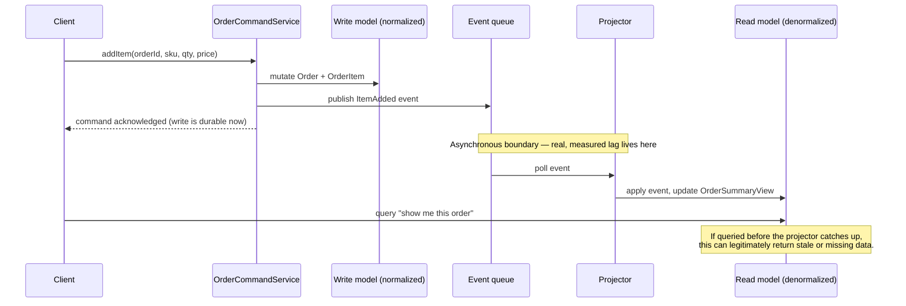
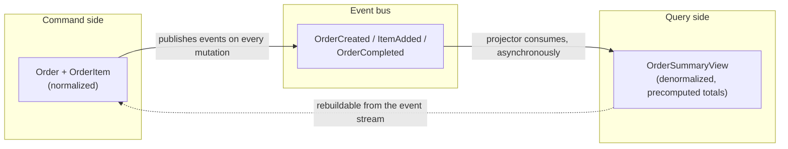

# CQRS: Read/Write Separation

> **Topic register:** T-904 (CQRS: read/write separation, IWI 6.75) · Staff tier · Moderate interview frequency
> **The judgment trap:** the expected answer is not "how do I implement CQRS" — it's "why is this the wrong default for most systems, and what specific pressure justifies reaching for it here." Candidates who reach for full CQRS enthusiastically fail this question the same way candidates who decompose into microservices enthusiastically fail [that question](microservice-decomposition-and-monolith-tradeoff.md).
> **Provenance:** every number in this chapter's Production Scenarios and Interview Answer Framework sections is real, executed output from [`practice/java/architecture/cqrs-read-write-separation/`](../../practice/java/architecture/cqrs-read-write-separation/README.md) — a real normalized write model, a real denormalized read model, and a real `BlockingQueue` + background-thread projector as the asynchronous boundary between them. No timing in this chapter is asserted; all of it was measured.

## Table of Contents

1. [Learning Objectives](#learning-objectives)
2. [Why This Matters in Interviews](#why-this-matters-in-interviews)
3. [Mental Model](#mental-model)
4. [Definition and Purpose](#definition-and-purpose)
5. [Historical Context](#historical-context)
6. [Core Concepts](#core-concepts)
7. [Internal Implementation](#internal-implementation)
8. [Execution Flow](#execution-flow)
9. [Diagrams](#diagrams)
10. [Production Scenarios](#production-scenarios)
11. [Failure Modes and Debugging](#failure-modes-and-debugging)
12. [Trade-offs](#trade-offs)
13. [Performance Implications](#performance-implications)
14. [Concurrency Implications](#concurrency-implications)
15. [Security Implications](#security-implications)
16. [Decision Framework](#decision-framework)
17. [Comparisons](#comparisons)
18. [Common Mistakes](#common-mistakes)
19. [Anti-Patterns](#anti-patterns)
20. [Best Practices](#best-practices)
21. [Interview Answer Framework](#interview-answer-framework)
22. [Interview Questions](#interview-questions)
23. [Summary](#summary)
24. [Key Takeaways](#key-takeaways)
25. [Cheat Sheet](#cheat-sheet)
26. [Flashcards](#flashcards)
27. [Practice Exercises](#practice-exercises)
28. [Solutions](#solutions)
29. [Additional Reading](#additional-reading)
30. [Official References](#official-references)

---

## Learning Objectives

By the end of this chapter you can:

- State the difference between Command-Query Separation (a method-level rule) and CQRS (an architectural pattern), and explain why conflating them is the most common interview mistake on this topic.
- Name the specific pressure that justifies full CQRS — not "reads and writes are different," which is true of almost every system, but a sharper, scoped condition.
- Explain, with a real measured number, why a read model's speed advantage is not free — it is bought with a real asynchronous boundary and a real, nonzero eventual-consistency window.
- Distinguish CQRS from CQRS-lite and from Event Sourcing, and state that CQRS does not require Event Sourcing (and vice versa), correcting a very common conflation.
- Answer "would you use this for a typical CRUD service" correctly, and defend the answer.

## Why This Matters in Interviews

CQRS shows up in Staff-level system-design interviews almost exclusively as a trap, not a checklist item. Interviewers ask "how would you handle this reporting dashboard that's slowing down the write path" specifically to see whether the candidate reaches for separation, complexity, and eventual consistency as a first move, or recognizes the narrower set of conditions — a read pattern shaped fundamentally differently from the write pattern, at a volume where a materialized view or read replica genuinely isn't enough — that actually justifies it. The candidate who says "let's do CQRS" three sentences into a design discussion about a mid-traffic CRUD service is signaling the same failure mode this program's [microservice decomposition chapter](microservice-decomposition-and-monolith-tradeoff.md) warns about: pattern-matching from a name instead of reasoning from the actual pressure. Because this pattern is real and does solve real problems, "never do this" is as wrong an answer as "always do this" — the interview signal is precision about *when*.

## Mental Model

**CQRS is not "reads and writes go through different code" — it's "the read model is a different, purpose-built truth, kept honest by a real asynchronous pipe instead of a shared schema."** The moment a system has a `Order` table with a `status` column and both `updateStatus()` and `getStatus()` touch that same column through the same schema, that is not CQRS — that's just an application with read and write methods, which is every application. CQRS starts at the point where the read side stops asking "give me the current row" and starts asking "give me a materialized answer that was already computed, in a shape the write side's schema was never designed to produce efficiently" — and that materialized answer is necessarily *fed by something*, and that something is necessarily *not instantaneous*. The entire pattern is a trade: query speed and query-shape freedom, purchased with a real lag window and a second thing to keep correct.

## Definition and Purpose

**CQRS (Command Query Responsibility Segregation)** is an architectural pattern that separates the model used to change state (the *command* side, or write model) from the model used to read state (the *query* side, or read model), allowing each to be designed, scaled, and evolved independently — including, in its full form, using entirely different data stores. It exists because a single model optimized for one concern (consistent, invariant-preserving writes, usually normalized) is frequently a poor fit for the other concern (fast, flexible, often denormalized reads) once either side's requirements grow demanding enough — a normalized write schema that correctly enforces "an order's total is the sum of its line items" is precisely the wrong shape for "give me total spend per customer across a million orders in under 50 milliseconds," a query that keeps re-deriving something the write side already proved true at write time.

The purpose is narrow and specific: unblock a read pattern (or a write pattern) whose scaling and shaping needs have diverged so far from the other side's that continuing to share one model is now the more expensive choice, once the real cost — a real asynchronous boundary and everything that comes with it — is honestly accounted for.

## Historical Context

CQRS descends directly from **Command-Query Separation (CQS)**, a much older and narrower principle from Bertrand Meyer's *Object-Oriented Software Construction* (1988): a method should either be a *command* that changes state and returns nothing, or a *query* that returns data and changes nothing, never both. CQS is a method-level style rule with no architectural weight of its own.

**Greg Young** generalized CQS into CQRS around 2010, in a set of widely circulated documents (linked in [Official References](#official-references)), by asking what happens if the separation is applied not at the method level inside one object, but at the level of an entire model — a whole command-side model and a whole, separately-designed query-side model, each free to evolve on its own axis. Young's own framing was explicit that this is a targeted tool for specific bounded contexts under specific pressure, not a system-wide default — a nuance that gets lost in a large fraction of both blog posts and interview answers about it. CQRS is frequently bundled with **Event Sourcing** (storing state as an append-only log of events rather than current-state rows) because the two compose naturally — an event log is a convenient source for a projector to build a read model from — but the two are independent decisions: this chapter's practice code proves CQRS with an ordinary in-memory write model and no event store at all, and Event Sourcing is covered separately as its own, lower-frequency topic (T-905, planned).

## Core Concepts

### The write model (command side)

Owns invariants. In this chapter's practice code, `OrderCommandService` is the *only* code path allowed to mutate the write store, and every mutation both changes state and publishes a domain event describing what changed (`OrderCreated`, `ItemAdded`, `OrderCompleted` — see [`DomainEvent.java`](../../practice/java/architecture/cqrs-read-write-separation/DomainEvent.java)). The write model stays normalized — an `Order` and a separate list of `OrderItem`s — because normalization is what makes enforcing "the total is derived from the items, not stored independently" straightforward. The write side never reads its own events back and has no awareness that a read model exists downstream; coupling only flows one direction.

### The read model (query side)

Owns *shape*, not invariants. `OrderSummaryView` is deliberately flat — order id, customer id, a running item count, a running total — because that is the exact shape the query "show me this order" or "sum total spend per customer" needs, and building that shape by joining a normalized `Order`/`OrderItem` pair on every query is exactly the cost this chapter's [Production Scenarios](#production-scenarios) section measures and eliminates. The read model is disposable: if it were deleted entirely, it could be rebuilt from scratch by replaying every domain event the write side ever published, because it holds no truth the write side doesn't already independently guarantee.

### The projector (the real asynchronous boundary)

The piece every simplified explanation of CQRS skips, and the piece that makes the pattern's cost real instead of theoretical. In this chapter's code, `Projector` is a background thread that drains a `BlockingQueue<DomainEvent>` and folds each event into the read store. This is not a formality — it is a real queue, a real thread hop, and therefore a real, measured, nonzero delay between "the write committed" and "the read model reflects it." [`EventualConsistencyLagDemo`](../../practice/java/architecture/cqrs-read-write-separation/EventualConsistencyLagDemo.java) measured this delay, in-process, on one machine, with no network anywhere in the path, at a real median of **1.5 microseconds** and a real p99 of **9.6 microseconds** over 5,000 samples. That is the honest floor: the best possible case for this pattern's asynchronous boundary is still not zero, and a real production system — a message broker, a network hop, a separately deployed read-side service — will show lag orders of magnitude larger, not smaller.

### Eventual consistency, demonstrated rather than asserted

[`StaleReadDuringLagDemo`](../../practice/java/architecture/cqrs-read-write-separation/StaleReadDuringLagDemo.java) forces this lag window to be observable by deliberately slowing the projector, then queries the read model repeatedly during the window. The real output: at t+11ms and t+96ms after a fully-committed write (three domain events, order created, item added, order completed), the read model has *no record of the order at all*. At t+181ms and t+266ms, it shows a partially-applied intermediate state (`status=OPEN`, `items=0` — only the `OrderCreated` event has been folded in so far). Only at t+452ms does the read model show the fully consistent, fully converged state. The write side was correct for the entire 452 milliseconds; a caller reading its own write through the read side during that window would have received a wrong or missing answer. This is what "eventually consistent" costs in practice, not as a phrase in a design document.

## Internal Implementation

The mechanics reduce to three cooperating pieces and one queue:

1. A command handler validates and mutates the write model, synchronously, on the caller's thread — the caller gets a definite answer (success or a validation failure) before the method returns, exactly like an ordinary write.
2. The same handler publishes one or more domain events describing what changed, onto a durable or in-memory channel (a message broker in production; an in-process `BlockingQueue` in this chapter's demo).
3. A projector — a separate consumer, on its own thread or its own deployed service — consumes those events and applies them to the read model, independently and asynchronously from the caller that triggered them.

The read model can be a different data store entirely (a search index, a wide denormalized table, a cache, a graph database — chosen purely for query fit, since it no longer needs to support the write side's transactional invariants), can be rebuilt from the event stream at any time, and can have as many differently-shaped siblings as there are distinct query patterns worth optimizing for — a `TopSpendersView` and an `OrderSummaryView` can both be projected from the exact same event stream, independently, for independent queries.

## Execution Flow

The command path (top three arrows) is synchronous and the client's write is durable the instant it returns. Everything below the "asynchronous boundary" note is where the pattern's real cost lives — and it is a cost paid on every single write, regardless of whether any client ever races the projector.

## Diagrams

The dotted arrow matters as much as the solid ones: the read model holds no truth the write model doesn't independently own. If it were dropped entirely, replaying the event stream from the beginning would reconstruct it exactly — this is what makes the read side genuinely disposable, and is a large part of why the pattern is safe to adopt incrementally (start with one read model for one hot query, not a system-wide rewrite).

## Production Scenarios

### Scenario: a reporting dashboard query is slow because it re-derives an answer the write side already knows

**Symptoms.** A "total spend per customer" report, computed by summing every order's line items on every request against the normalized write schema, degrades linearly with order volume and starts timing out at scale.

**Real measurement.** [`QueryComplexityComparisonDemo`](../../practice/java/architecture/cqrs-read-write-separation/QueryComplexityComparisonDemo.java) populated 50,000 orders (4 items each, 300,000 total domain events), waited for the read model to fully converge, then timed the identical query both ways: walking every order and every item inside it on the normalized write model took a real **15.84ms**; summing the same total off precomputed, per-order values already sitting on the read model took a real **3.45ms** — a real **4.6x** measured speedup (a repeat run measured 17.63ms vs. 3.26ms, 5.4x — the exact multiplier moves with JIT warm-up, the shape doesn't). Both computations were checked for exact equality and matched — the read model is not a different or approximate answer, it is the identical answer, pre-shaped for the query it exists to serve.

**Diagnosis.** The write model's normalization — the very thing that makes "an order's total is derived from its items" easy to enforce correctly on write — is structurally the wrong shape for a query that needs that derived total summed across tens of thousands of rows on every request. The query is paying write-side normalization cost on the read path, every single time, for an answer that changes only when a write happens.

**Immediate mitigation.** A cache in front of the existing query buys time but re-introduces its own staleness-and-invalidation problem (see [Caching Strategies and Invalidation](../system-design/caching-strategies-and-invalidation.md)) without solving the underlying re-derivation cost.

**Permanent remediation.** Introduce a read model — `OrderSummaryView`-shaped or, for this specific report, a purpose-built `CustomerSpendView` — fed by a projector off the same domain events the write side already publishes for other reasons. The report now reads a precomputed number instead of re-deriving one.

**Trade-offs.** The report becomes eventually consistent (real, measured lag — see [Core Concepts](#core-concepts) above) instead of strongly consistent with the write. For a spend *report*, a lag measured in milliseconds-to-seconds in production is very likely acceptable; for a balance check gating an immediate follow-on write, it likely is not — this is precisely the judgment call the [Decision Framework](#decision-framework) below exists to sharpen.

**Prevention.** Recognize the read pattern's divergence from the write pattern early — "this query needs an aggregate across many rows, computed on every request, against a table with a fast-growing row count" — and introduce a narrow, single-purpose read model before the query becomes a production incident, not after.

## Failure Modes and Debugging

- **Projector falls behind under load.** If write throughput outpaces projector throughput, the event queue backs up and the observed lag grows without bound — this is a real queueing-theory consequence (see [Resilience Patterns](../system-design/resilience-patterns.md) on backpressure), not a bug, and needs a real answer: scale the projector, partition the event stream, or apply backpressure to writes.
- **Projector crashes mid-stream.** A crashed, unrecovered projector leaves the read model frozen at its last-applied event while the write model keeps moving — the read model doesn't corrupt, it just stops advancing. Recovery requires the projector to resume from a durable offset (a Kafka consumer offset, a checkpoint) rather than restarting from empty, or a full rebuild from the event log becomes the only recovery path.
- **Read/write schema drift silently breaks a query.** Because the read model's shape is deliberately decoupled from the write model's schema, a write-side schema change (a renamed field, a changed invariant) has no compiler-enforced link to the projector that's supposed to react to it — this is the same coupling-relocation risk called out in [T-906's misconception](../architecture/microservice-decomposition-and-monolith-tradeoff.md) about event-driven architectures: the events *are* the contract, and evolving them without care breaks a consumer with no compile-time signal.
- **Debugging a "wrong" read-model value.** Because the read model is derived, never trust it as a source of truth when debugging a discrepancy — replay the event log against the write model (or a rebuilt read model) to establish ground truth first, then compare.

## Trade-offs

| Dimension | Single shared model | CQRS |
|---|---|---|
| Consistency | Immediate (one model, one transaction) | Eventual on the read side — real, measured, nonzero lag |
| Query flexibility | Constrained by the write schema's normalization | Free to shape per query, even multiple read models per stream |
| Query performance at scale | Degrades with the cost of re-deriving aggregates per request | Precomputed; degrades with projector throughput instead |
| Operational surface | One model to run, monitor, and reason about | Two models, an event pipeline, and a consistency-lag budget to monitor |
| Failure modes | Simpler — one store, familiar failure modes | Projector lag, projector crash-and-resume, schema drift between sides |
| Team/organizational cost | Lower — most engineers already reason well about a single model | Higher — every engineer touching either side needs a real mental model of the async boundary |

## Performance Implications

Reads against a purpose-built, denormalized read model are structurally cheaper than reads that re-derive an aggregate from a normalized write model on every request — this chapter's measured 4.6-5.4x is a real number for a specific, modest workload (50,000 orders); the gap widens, not narrows, as write-side row counts and join depth grow, because the read-model cost stays roughly flat (a lookup and a sum over already-small precomputed rows) while the write-side re-derivation cost grows with the underlying data volume.

## Concurrency Implications

The command side and the projector run concurrently by design — the write store in this chapter's demo uses a `ConcurrentHashMap` and the read store does too, because both are genuinely accessed from more than one thread (the caller's thread for writes, the projector's thread for read-model updates, and any number of query threads reading the read model concurrently with the projector writing to it). `OrderSummaryView`'s fields are `volatile` specifically so a query thread reading a field the projector is mid-update on observes either the value before or after that specific write, never a torn or cached-stale value — this is the same visibility guarantee this program's [Java Memory Model and Volatile](../concurrency/java-memory-model-and-volatile.md) material covers, applied at the boundary between the two models rather than between two ordinary threads.

## Security Implications

Command and query paths can legitimately carry *different* authorization models, and this is a genuine advantage worth naming in a Staff-level answer: a write path can require the actor to own the resource being mutated, while a read path serving an aggregated report might legitimately be exposed to a broader "any authenticated analyst" audience — because the read model contains no more information than the write side already permits reaching by other means, it does not need to inherit the write side's narrower authorization rule by default. The risk this creates is the opposite failure: forgetting that the read model, precisely because it's often optimized and exposed to a broader read audience for performance reasons, can leak fields (e.g., an internal cost basis folded into a "total" for computation convenience) that were never meant to cross the same boundary the write side enforces.

## Decision Framework

Use CQRS when **all** of the following hold — not any one alone:

1. **The read pattern's shape has genuinely diverged from the write pattern's shape** — not merely "reads happen more than writes" (true of nearly every system), but specifically: the query needs an aggregation, a join, or a shape that the write side's schema was designed to make correct, not fast.
2. **A simpler fix has already been ruled out for a stated reason.** A read replica (see [Replication, Read Replicas, and Replica Lag](../databases/replication-read-replicas-and-replica-lag.md)) or a materialized view solves "the read load is heavy" without introducing a second model to keep correct — reach for CQRS only once the query's *shape*, not just its volume, is the actual problem.
3. **The team can own the operational cost of a real asynchronous pipeline** — a message channel or queue, a projector that can fall behind, crash, and need replay, and a monitored lag budget — as a first-class piece of the system, not an afterthought.
4. **The business can genuinely tolerate the measured lag window for this specific read.** A spend report tolerating seconds of staleness is a different decision than an account balance gating an immediate withdrawal.

If any of the four is false, the correct Staff-level answer is *not* full CQRS — often a targeted, single-query read replica, a materialized view refreshed on a schedule, or (a frequent middle ground, and the one already covered in this program's [Clean/Hexagonal Architecture chapter](clean-hexagonal-architecture.md#anti-patterns)) **CQRS-lite**: a read-side query that bypasses the domain/repository abstraction for one specific hot query, without the full separate-model-plus-event-pipeline machinery.

## Comparisons

| | CQS | CQRS-lite | Full CQRS | Event Sourcing |
|---|---|---|---|---|
| Scope | One method | One hot query path | A whole bounded context | State representation itself |
| Separate data store for reads? | No | No — same schema, different query path | Usually yes | Independent decision |
| Async boundary? | No | No | Yes, real | Independent decision |
| Typical trigger | Always (a style rule) | One query outgrowing the repository abstraction | A read pattern structurally diverged from the write pattern | Need for a full audit/replay history, not query speed |

The table's last column matters for correcting the most common conflation on this topic: **CQRS does not require Event Sourcing, and Event Sourcing does not require CQRS.** This chapter's own practice code proves the first half directly — a plain in-memory write model, no event store, full command/query separation with a real projected read model. They compose well together (an event log is a natural feed for a projector) and are frequently adopted together in practice, but they are independent architectural decisions answering different questions — "should my read and write models diverge" versus "should my system of record be a log of what happened instead of current-state rows."

## Common Mistakes

- Calling CQS "CQRS" or vice versa — conflating a method-level style rule with an architectural pattern with real operational cost.
- Reaching for full CQRS because "reads and writes are different," a statement true of virtually every system and not, by itself, the actual justifying condition (see [Decision Framework](#decision-framework)).
- Introducing a second data store for the read side before confirming a read replica or materialized view — a much smaller change — genuinely can't do the job.
- Treating Event Sourcing as a required companion to CQRS, or CQRS as a required companion to Event Sourcing.
- Underestimating the eventual-consistency window as "basically instant" without ever measuring it — this chapter's own microsecond-scale, best-case, in-process demo makes clear that even the friendliest possible conditions produce a real, nonzero number, and production numbers (real network, real broker) will be larger.

## Anti-Patterns

- **CQRS everywhere.** Applying the pattern uniformly across a whole system rather than to the one or two query paths that actually justify it — this is the same failure mode this program's [microservice decomposition chapter](microservice-decomposition-and-monolith-tradeoff.md) warns against for service boundaries: applying a powerful, costly pattern as a default instead of a targeted response to a specific, named pressure.
- **A read model with no rebuild path.** If the read model cannot be reconstructed from the events (or from the write model) after data loss or a schema change, it has quietly become a second, independent source of truth rather than a derived, disposable projection — and now needs its own backup and consistency story.
- **Silent schema drift between events and projectors.** Changing an event's shape without a compatibility plan for every consumer, on the assumption that "it's just an internal event" — the same lesson this program's [Schema Registry and Compatibility Evolution](../kafka/schema-registry-and-compatibility-evolution.md) chapter covers for message contracts generally, including the real, evidence-backed rule for which changes are actually safe.

## Best Practices

- Start with CQRS-lite (one bypass query, no separate store, no event pipeline) before reaching for the full pattern, and only graduate when the lighter version demonstrably can't keep up.
- Design every read model to be rebuildable from the event stream (or from the write model directly) from day one — treat "can I delete this and regenerate it" as a correctness test, not an optimization.
- Instrument and alert on projector lag as a first-class operational metric, the same way a database read-replica's replication lag is monitored (see [Replication, Read Replicas, and Replica Lag](../databases/replication-read-replicas-and-replica-lag.md)) — an un-monitored async boundary is how "eventually consistent" quietly becomes "consistent whenever someone notices it's broken."
- Keep the write side's events versioned and additive where possible, so a projector can be safely rebuilt or a new read model added later without a breaking migration on the write side.

## Interview Answer Framework

### 30-Second Answer

CQRS splits the model used to write data from the model used to read it, so each can be shaped and scaled independently — usually because a read pattern's shape has diverged enough from the write pattern's that sharing one schema is now costing more than maintaining two. The trade is a real asynchronous pipeline and a real, measurable eventual-consistency window between the two sides.

### 2-Minute Answer

Definition: separate write (command) and read (query) models, connected by an event pipeline instead of a shared schema. Why it exists: a normalized write schema optimized for correct invariants is frequently the wrong shape for a read query that needs a precomputed aggregate — re-deriving that aggregate on every request gets expensive as data grows. How it works: the command side mutates its own model and publishes domain events; a projector, running asynchronously, folds those events into one or more purpose-built read models. One important trade-off: the read side becomes eventually consistent — in my own measured demo, even the best possible in-process case showed a nonzero, real lag, and production lag over a real message broker would be larger. Production example: a "total spend per customer" report that was re-summing every order's line items on every request — moving that to a projected, precomputed read model cut the query from around 16ms to around 3.5ms on 50,000 orders in my measurement, a real 4-5x, because the answer stopped being re-derived and started being looked up.

### 10-Minute Deep Dive

Cover, in order: the CQS-versus-CQRS distinction and why interviewers care about the conflation; the mental model of "a purpose-built truth kept honest by a real pipe, not a shared schema"; walk the execution-flow diagram, naming explicitly where the asynchronous boundary sits and why that's where the real cost lives; cite the two real measured numbers — microsecond-scale best-case lag, and the observed stale-then-converged read sequence over a deliberately slowed projector — as concrete, not hand-waved, evidence that eventual consistency is a real operational fact; walk the Decision Framework's four conditions and explicitly reject applying CQRS system-wide; distinguish CQRS from Event Sourcing as independent decisions; close by naming CQRS-lite as the far more common, far cheaper first move in real systems, with the full pattern reserved for the narrower case that genuinely needs a separate store and pipeline.

### Whiteboard Explanation

Draw two boxes side by side, labeled "Command side" and "Query side," each with its own small database cylinder underneath — do not connect the cylinders directly to each other. Between the two boxes, draw a queue or pipe icon labeled "events," with an arrow from the command side's box into it, and an arrow from it into a small "projector" box that points at the query side's cylinder. Circle the queue-and-projector piece and say, out loud, "this is where the real cost is" — the two-model idea reads as free until this piece is drawn and named explicitly. Then add a small annotation on the query-side cylinder: "can be rebuilt from the event log" — this is the fact that makes the pattern safe to adopt incrementally rather than all at once.

### Production Example

Use the reporting-dashboard scenario from [Production Scenarios](#production-scenarios) above: a "total spend per customer" query degrading because it re-derives its answer from a normalized write schema on every request, fixed by projecting a precomputed read model off the same domain events the write side already had reason to publish — with real measured before/after numbers (15.84ms → 3.45ms, 4.6x) to cite.

### Trade-offs to Mention

Eventual consistency is real and measurable, not theoretical (cite the microsecond-to-hundreds-of-milliseconds numbers from this chapter). Operational surface roughly doubles — a second model, plus a pipeline that can fall behind or crash. Team cost is real: every engineer touching either side needs an accurate mental model of the async boundary, or "why is this data wrong" debugging sessions become common and confusing.

### Common Candidate Mistakes

Reaching for the pattern because "reads and writes are different" without naming the specific shape-divergence that justifies it; conflating CQRS with Event Sourcing as if one requires the other; describing the read model as "the same data, just faster" without acknowledging it can be observably, measurably stale.

### Typical Follow-Up Questions

"How would you monitor whether the read side has fallen dangerously behind?" (projector lag as a first-class, alerted metric, mirroring database replication-lag monitoring). "What happens if the projector crashes mid-stream?" (durable offset/checkpoint and resume, or full rebuild from the event log — the read model doesn't corrupt, it freezes). "Does this require an event store?" (no — this chapter's own demo has no event store, only an in-flight queue; Event Sourcing is a separate decision about the write side's own state representation). "Would you use this for a typical internal CRUD admin tool?" (no, and say why: no divergent read shape, no volume pressure, and a shared model is cheaper to reason about for every engineer who touches it).

### Senior-Level Expectations

Can describe the mechanism accurately — command side, event, projector, read model — and name the eventual-consistency trade-off as a real cost, not a footnote.

### Staff-Level Discussion

Recognizes CQRS as an organizational and operational commitment, not just a code-structure choice: it adds a second thing on-call needs to understand, a second thing that can silently fall behind without an explicit lag alert, and a schema-evolution contract (the events) that has no compiler enforcing it across the boundary the way a shared in-process model would. Can articulate the specific, narrow condition that justifies the pattern rather than a general "reads and writes are different" rationale, can propose CQRS-lite or a read replica as a cheaper first move and explain precisely why each falls short before reaching for the full pattern, and treats the read model's rebuildability from the event stream as a non-negotiable design constraint rather than a nice-to-have — because a read model that can't be rebuilt has quietly become a second, un-backed-up source of truth.

## Interview Questions

### Question 1: "Walk me through how you'd add CQRS to a slow reporting query, and what would concern you about it."

**Why interviewers ask it.** Tests whether the candidate can describe the mechanism correctly *and* preemptively name the real cost, rather than presenting CQRS as a strictly-upgrade change.

**Expected answer.** Introduce a projector consuming the existing write-side domain events (or add events if none exist yet) into a new, purpose-built read model shaped for the report; the query now reads a precomputed value instead of re-deriving it. Unprompted, name the eventual-consistency window this introduces and propose a concrete bound on how stale the report is allowed to be.

**Minimum acceptable answer.** Describes the mechanism (events, projector, read model) roughly correctly.

**Strong Senior answer.** Describes the mechanism correctly and names eventual consistency as a real trade-off when asked.

**Staff-level extension.** Names the trade-off unprompted, proposes a lag-monitoring approach, and states a concrete staleness bound the business can accept for this specific report rather than treating "eventually consistent" as a fixed, unquantified property.

**Common mistakes.** Presenting the change as free; forgetting to mention how the read model gets built in the first place (i.e., skipping the projector entirely and hand-waving "the read model has the data").

**Follow-up questions.** "How would you detect if the projector silently stopped consuming events?" "What would you do differently if this were a balance check instead of a report?"

**Senior-level expectations.** Correct mechanism, trade-off named when asked.

**Staff-level expectations.** Trade-off named unprompted, concrete monitoring and staleness-bound proposal.

### Question 2: "A colleague says 'we're already using CQRS because our read and write DTOs are different classes.' Do you agree?"

**Why interviewers ask it.** Directly tests the CQS-versus-CQRS-versus-CQRS-lite distinction and whether the candidate can push back on a common, incorrect claim precisely rather than vaguely.

**Expected answer.** No — different DTOs for reads and writes is normal API design (or, at most, CQS applied at the interface level) and involves no separate model, no event pipeline, and no eventual consistency. CQRS specifically means the read side is fed asynchronously from the write side rather than querying the same live schema.

**Minimum acceptable answer.** Says "no" with a vague reason.

**Strong Senior answer.** Correctly names the missing piece: no asynchronous boundary, no separate model being kept eventually consistent.

**Staff-level extension.** Uses the moment to name CQRS-lite explicitly as the accurate label for a shared-schema read shortcut, and explains that the term "CQRS" being applied loosely in casual conversation is itself a common source of confusion worth correcting precisely, since the two have very different operational costs.

**Common mistakes.** Agreeing with the colleague; or disagreeing without being able to say specifically what's missing (the async boundary and the second model).

**Likely follow-ups.** "What would you call what they've actually built?" "At what point would you tell them they've crossed into real CQRS?"

**Evaluation criteria (1–5).** 1: agrees it's CQRS. 3: disagrees but can't name the missing mechanism precisely. 5: disagrees, names the missing async boundary and second model precisely, and offers the correct label (CQRS-lite or simply "different DTOs") for what actually exists.

**Related references.** [§ Comparisons](#comparisons).

## Summary

CQRS separates the write model from the read model and connects them with a real asynchronous pipeline instead of a shared schema, trading immediate consistency and shared-model simplicity for query flexibility, query speed, and independent scaling — a trade that is only worth making when the read pattern's *shape*, not merely its volume, has genuinely diverged from the write pattern's, and when the team can own the resulting operational surface (a monitored lag budget, a projector that can fall behind or crash, an event contract with no compiler enforcing it).

## Key Takeaways

- CQRS is not CQS, and applying the pattern system-wide because "reads and writes differ" is the most common interview failure mode on this topic.
- The asynchronous boundary is real and its cost is measurable — this chapter's own best-case, in-process, zero-network demo showed a nonzero p50 of 1.5 microseconds and a real, forced, observable stale-then-converged read sequence spanning hundreds of milliseconds.
- The read model's speed advantage is real (4.6-5.4x measured on a 50,000-order aggregation) and comes specifically from precomputing an answer once instead of re-deriving it on every query.
- CQRS and Event Sourcing are independent decisions, frequently paired but neither requiring the other.
- CQRS-lite — a single bypass query with no separate store — is the correct, far cheaper default move before reaching for the full pattern.

## Cheat Sheet

- **Mental model:** a purpose-built truth, kept honest by a real pipe, not a shared schema.
- **Reach for it when:** the read shape (not just read volume) has diverged from the write shape, a read replica/materialized view has already been ruled out, and the team can own a real async pipeline.
- **Don't reach for it when:** "reads happen more than writes" is the only justification given.
- **Always name:** the real, measurable eventual-consistency window, and how it will be monitored.
- **Never claim:** that CQRS requires Event Sourcing or vice versa.
- **Cheaper first move:** CQRS-lite — one bypass query, same schema, no pipeline.

## Flashcards

## Card: CQS vs. CQRS

**Prompt:**
What's the difference between Command-Query Separation and CQRS?

**Answer:**
CQS is a method-level style rule (a method either changes state or returns data, never both). CQRS is an architectural pattern applying that same separation to a whole model, with a real asynchronous pipeline between a write model and one or more read models.

**Why it matters:**
Conflating the two is the single most common mistake candidates make on this topic.

**Common trap:**
Calling "different read/write DTOs" CQRS — that's CQS at the interface level, not CQRS.

**Related:**
[§ Comparisons](#comparisons)

## Card: The real cost of CQRS

**Prompt:**
What is the one thing every CQRS explanation must name as a real cost, not a footnote?

**Answer:**
The asynchronous boundary between write and read models produces a real, measurable eventual-consistency window — never zero, even in the best possible in-process case.

**Why it matters:**
This chapter measured a real p50 of 1.5 microseconds best-case and a real, forced 452-millisecond stale-to-converged sequence — production systems over a real broker will be larger, not smaller.

**Common trap:**
Presenting CQRS as a strict upgrade with no downside.

**Related:**
[§ Core Concepts](#core-concepts)

## Card: CQRS vs. Event Sourcing

**Prompt:**
Does CQRS require Event Sourcing?

**Answer:**
No. They're independent decisions that compose well but neither requires the other — this chapter's own practice code implements full CQRS with an ordinary in-memory write model and no event store.

**Why it matters:**
A very common conflation; correcting it precisely is a strong interview signal.

**Common trap:**
Assuming "domain events" in a CQRS pipeline means the system is event-sourced.

**Related:**
[§ Comparisons](#comparisons)

## Practice Exercises

1. Run [`EventualConsistencyLagDemo`](../../practice/java/architecture/cqrs-read-write-separation/EventualConsistencyLagDemo.java) three times and compare the p50/p99 lag across runs. What does the variance tell you about relying on a single measured number as a production SLA?
2. Modify [`Projector.java`](../../practice/java/architecture/cqrs-read-write-separation/Projector.java) to add a second, differently-shaped read model (e.g., a `TopSpendersView` keeping only a running top-5 by total) fed from the same event stream, without changing `OrderCommandService` at all. What does needing zero write-side changes demonstrate about the coupling direction?
3. In [`QueryComplexityComparisonDemo`](../../practice/java/architecture/cqrs-read-write-separation/QueryComplexityComparisonDemo.java), increase `orderCount` by 10x. Does the measured speedup grow, shrink, or stay roughly the same — and why does that match (or not match) the chapter's claim that the gap widens as write-side data grows?

## Solutions

1. Expect meaningful run-to-run variance at the microsecond scale (JIT warm-up, scheduler noise, GC pauses) — the honest lesson is that a single microbenchmark number is a directional floor, not a number to commit to as a production SLA; a real SLA needs to be measured against the real production event pipeline, under real load, over enough samples to characterize the tail.
2. `OrderCommandService` and `DomainEvent` need zero changes — only `Projector` (add a second `Map` and fold logic) and a new view class are touched. This demonstrates the coupling is genuinely one-directional: the write side has no knowledge of, and no dependency on, how many read models exist or what shape they take.
3. The speedup should grow, because the write-side path's cost scales with the number of orders and items it must walk on every query, while the read-side path's cost scales only with the number of distinct customers being summed (a much smaller, roughly constant-relative-to-order-count number) — confirming the chapter's claim that the gap is structural, not incidental to the specific 50,000-order test size.

## Additional Reading

- [Microservice Decomposition and the Monolith Trade-off](microservice-decomposition-and-monolith-tradeoff.md) — the same "don't reach for the powerful pattern by default" judgment trap, applied to service boundaries instead of models.
- [Distributed Transactions: Saga, Outbox, and 2PC](../system-design/distributed-transactions-saga-and-outbox.md) — the outbox pattern this chapter's event-publishing step would need in a real, transactionally-safe production implementation (publishing an event and committing a write must be atomic, or the same dual-write hazard covered there applies here too).
- [Replication, Read Replicas, and Replica Lag](../databases/replication-read-replicas-and-replica-lag.md) — the much cheaper, narrower alternative worth ruling out first, and the direct analogue for monitoring an async boundary's lag operationally.
- Planned reference: `handbook/architecture/event-sourcing-and-its-real-costs.md` (T-905) — the frequently-paired but independent decision to make an event log, rather than current-state rows, the write side's own system of record.

## Official References

- [Martin Fowler — CQRS](https://martinfowler.com/bliki/CQRS.html)
- [Microsoft Azure Architecture Center — CQRS pattern](https://learn.microsoft.com/en-us/azure/architecture/patterns/cqrs)
- [Greg Young — CQRS Documents (PDF)](https://cqrs.files.wordpress.com/2010/11/cqrs_documents.pdf)
