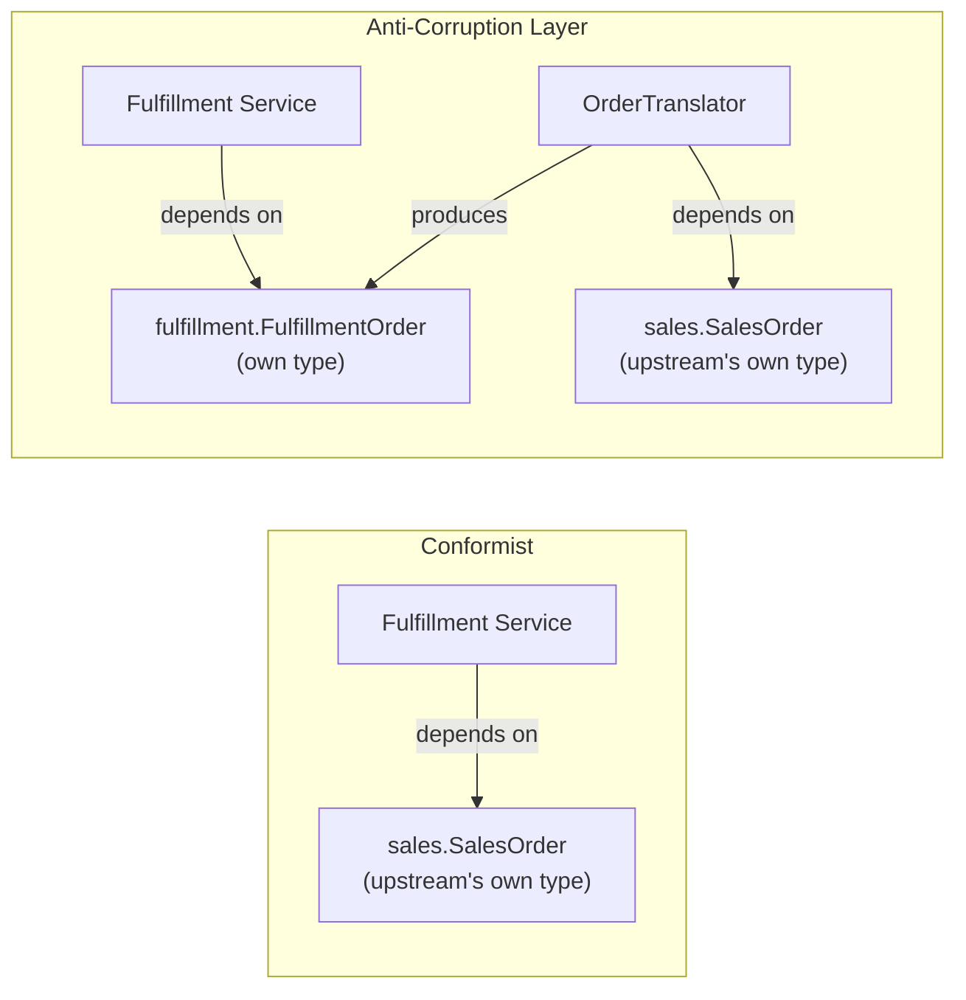

# DDD Strategic Design — Bounded Contexts and Context Mapping

> **Topic register:** T-902 · IWI 7.4 · Staff tier · Moderate interview frequency.
> **Provenance:** the coupling proof in this chapter is real, executed `javac`
> output — a real compile that really succeeds and a real compile that really fails
> with a real compiler error, against file sets verified byte-identical via real
> `diff`. Reproducible source:
> [`practice/java/architecture/ddd-bounded-contexts-and-context-mapping/`](../../practice/java/architecture/ddd-bounded-contexts-and-context-mapping/README.md).

> **Scope note.** [DDD Tactical Design — Aggregates](ddd-tactical-design-aggregates.md)
> covers DDD's tactical patterns — aggregates, entities, value objects — the building
> blocks used *inside* one bounded context. This chapter covers the strategic half:
> how to identify where one context ends and another begins, and how contexts that
> disagree about a shared concept relate to each other. The register's own stated
> misconception is direct: treating DDD as only its tactical patterns misses the half
> that Staff interviews actually reward.

## Table of Contents

1. [Learning Objectives](#learning-objectives)
2. [Why This Matters in Interviews](#why-this-matters-in-interviews)
3. [Mental Model](#mental-model)
4. [Definition and Purpose](#definition-and-purpose)
5. [Core Concepts](#core-concepts)
6. [Internal Implementation](#internal-implementation)
7. [Diagrams](#diagrams)
8. [Java Examples](#java-examples)
9. [Production Scenarios](#production-scenarios)
10. [Failure Modes and Debugging](#failure-modes-and-debugging)
11. [Trade-offs](#trade-offs)
12. [Organizational Implications](#organizational-implications)
13. [Decision Framework](#decision-framework)
14. [Comparisons](#comparisons)
15. [Common Mistakes](#common-mistakes)
16. [Anti-Patterns](#anti-patterns)
17. [Best Practices](#best-practices)
18. [Interview Answer Framework](#interview-answer-framework)
19. [Interview Questions](#interview-questions)
20. [Summary](#summary)
21. [Key Takeaways](#key-takeaways)
22. [Cheat Sheet](#cheat-sheet)
23. [Flashcards](#flashcards)
24. [Practice Exercises](#practice-exercises)
25. [Solutions](#solutions)
26. [Additional Reading](#additional-reading)
27. [Official References](#official-references)

## Learning Objectives

After this chapter you should be able to:

- Define a bounded context precisely, and explain why "Order" (or "Customer," or
  "Product") legitimately means different things in different parts of the same
  system.
- Name and distinguish the core context-mapping relationships: Shared Kernel,
  Customer/Supplier, Conformist, and Anti-Corruption Layer.
- Explain, with a concrete reproduction, exactly what an Anti-Corruption Layer buys
  you that a Conformist relationship doesn't, in terms of real coupling.
- Answer "two teams disagree on what 'Order' means — resolve it" with a structural
  answer, not a negotiation-tactics answer.
- Connect bounded-context boundaries to service boundaries, and explain why they are
  the correct unit of microservice decomposition, not technical layers.

## Why This Matters in Interviews

The register is explicit about the trap here: candidates who prepared DDD by reading
about aggregates, entities, and value objects — the tactical patterns — walk into a
Staff interview and discover the actual question is strategic: "how do you decide
where one service's responsibility ends and another's begins?" or the sharper form,
"two teams disagree about what 'Order' means — resolve it." A candidate who only knows
tactical DDD reaches for a technical answer (add a field, add a flag) or a
process answer (schedule a meeting) — neither addresses the actual structural
question, which is whether these two things should even be forced to be the same
concept at all. The strategic half of DDD is also the half [Microservice Decomposition and Boundary Design](microservice-decomposition-and-monolith-tradeoff.md)
depends on directly: a bounded context is the correct unit for a service boundary,
which is precisely why this chapter is a prerequisite concept for that one, not an
optional extra.

## Mental Model

A **bounded context** is the boundary within which a specific model, and a specific
vocabulary, is unambiguous and internally consistent. Outside that boundary, the same
word can — and often should — mean something else entirely. The mistake nearly every
team makes once is assuming a shared word implies a shared model; DDD's strategic
patterns exist because the alternative — forcing every team's "Order" to be one
universal class — produces a class no team can safely change, because every change
risks breaking someone else's unrelated meaning of the same word.

## Definition and Purpose

A **bounded context** is an explicit boundary (usually, but not necessarily, aligned
with a service, module, or team) inside which a domain model and its **ubiquitous
language** — the shared vocabulary the model, the code, and the domain experts all use
identically — apply consistently. **Context mapping** is the practice of explicitly
naming the relationship between two bounded contexts that must exchange information,
because that relationship determines how change in one context propagates (or
doesn't) to the other. These concepts exist because large domains are not actually
one coherent model — they are several genuinely different models that happen to share
some vocabulary, and pretending otherwise produces the specific, common failure this
chapter's practice code reproduces: a shared class that different teams cannot safely
evolve independently.

## Core Concepts

- **Ubiquitous language.** The vocabulary used identically by domain experts, code,
  and conversation *within one bounded context*. The same word used in a different
  bounded context is not a bug — it's a sign that the word means something different
  there, which is expected, not something to unify away.
- **Shared Kernel.** Two bounded contexts deliberately share a small, jointly-owned
  piece of model — a genuine collaboration, not a shortcut, because changes to the
  shared piece require both teams' agreement.
- **Customer/Supplier.** One context (the supplier) provides data or capability to
  another (the customer), and the customer's needs have real influence over the
  supplier's roadmap — an upstream/downstream relationship with negotiating power on
  the downstream side.
- **Conformist.** The downstream context simply accepts the upstream context's model
  as-is, with no translation and no negotiating power. This chapter's
  `ConformistFulfillmentService` is exactly this relationship, and its real, measured
  cost is this chapter's central proof.
- **Anti-Corruption Layer (ACL).** The downstream context builds a translation layer
  that converts the upstream model into its own, so the upstream context's internal
  changes never propagate past that one layer. This chapter's `OrderTranslator` is
  exactly this relationship.

## Internal Implementation

This chapter's practice code models two real bounded contexts — Sales and
Fulfillment — each with its own "Order" concept:
[`sales/SalesOrder.java`](../../practice/java/architecture/ddd-bounded-contexts-and-context-mapping/README.md)
(a commercial transaction: customer, price) and `fulfillment/FulfillmentOrder.java` (a
physical shipment: recipient, weight) — genuinely different shapes for genuinely
different concerns, not a data-modelling oversight. Two Fulfillment services then
consume Sales's data under the two relevant relationship patterns:
`conformist/ConformistFulfillmentService.java` depends on `sales.SalesOrder` directly;
`acl/AclFulfillmentService.java` depends only on `fulfillment.FulfillmentOrder`, with
`acl/OrderTranslator.java` as the one file allowed to know about both. The demo then
simulates a real, ordinary upstream change — Sales renaming `customerName` to
`buyerName` — as a second, parallel copy of the whole file tree
(`v2-upstream-renamed-field/`), and diffs the two trees to prove which files did and
didn't need to change, before compiling both to prove which ones still can.

## Diagrams



## Java Examples

The Conformist path — a direct dependency on the upstream type:

```java
public final class ConformistFulfillmentService {
    public void prepareShipment(SalesOrder order) {
        System.out.println("Preparing shipment for " + order.getCustomerName()
                + " (order " + order.orderId + ")");
    }
}
```

The Anti-Corruption Layer path — the same functionality, with the upstream dependency
isolated to a translator:

```java
public final class AclFulfillmentService {
    public void prepareShipment(FulfillmentOrder order) {
        System.out.println("Preparing shipment for " + order.recipientName
                + " (order " + order.orderId + ", " + order.weightKg + "kg)");
    }
}

public final class OrderTranslator {
    public FulfillmentOrder toFulfillmentOrder(SalesOrder order) {
        return new FulfillmentOrder(order.orderId, order.getCustomerName(), estimateWeightKg(order));
    }
}
```

After Sales renames `customerName` to `buyerName`, the real, measured result:

```
=== Step 2: compile v1-original-schema (everything) ===
Exit code: 0 (expected 0)

=== Step 3: compile v2-upstream-renamed-field, ACL path only ===
Exit code: 0 (expected 0 -- AclFulfillmentService.java is unchanged and still compiles)

=== Step 4: compile v2-upstream-renamed-field, CONFORMIST path only ===
v2-upstream-renamed-field/conformist/ConformistFulfillmentService.java:14: error: cannot find symbol
        System.out.println("Preparing shipment for " + order.getCustomerName()
                                                            ^
  symbol:   method getCustomerName()
  location: variable order of type SalesOrder
1 error
Exit code: 1 (expected 1 -- ConformistFulfillmentService.java is unchanged and no longer compiles)
```

`ConformistFulfillmentService.java` and `AclFulfillmentService.java` are both,
verifiably, byte-identical between the before and after trees (real `diff`, zero
output) — the only difference in outcome is which relationship pattern the consumer
chose.

## Production Scenarios

**Scenario: a "Customer" model shared across three teams became impossible to change
without a cross-team migration.** Symptoms: adding a single new field to the shared
`Customer` entity (a loyalty-tier flag, needed only by the Marketing team) required a
coordinated deployment across Billing, Support, and Marketing services, because all
three had historically been built directly against one shared `Customer` JPA entity
in a shared library. Initial hypothesis: the field addition itself was risky.
Evidence: the actual risk had nothing to do with the new field — it was that Billing's
tax-calculation logic and Support's account-lookup logic were both silently coupled to
the exact same class as Marketing's loyalty logic, so *any* team's change to that
class required regression-testing all three teams' unrelated use cases. Diagnosis:
three genuinely different bounded contexts (Billing's "Customer" cares about tax
jurisdiction and payment methods; Support's cares about ticket history and account
status; Marketing's cares about loyalty tier and campaign eligibility) had been
collapsed into one Conformist-style shared model with no context boundary drawn at
all. Immediate mitigation: froze the shared entity, requiring sign-off from all three
teams for any change, turning the technical coupling into an explicit process cost.
Permanent remediation: each team introduced its own bounded-context-local `Customer`
representation (a genuine Shared Kernel for the handful of fields all three
legitimately need — customer ID, name — with everything else owned locally), with an
Anti-Corruption Layer at each boundary translating from the legacy shared entity
during the migration window. Trade-off accepted: three `Customer` representations now
exist instead of one, a real duplication cost, deliberately accepted in exchange for
independent deployability. Prevention: any new cross-team shared entity now requires
an explicit context-mapping decision (Shared Kernel vs. ACL vs. Conformist) recorded
in an ADR before it's built, not discovered after the third team joins. Interview
lesson: this is the real, production shape of "two teams disagree about what 'Order'
means" — the resolution isn't a meeting, it's drawing the context boundary that should
have existed from the start.

## Failure Modes and Debugging

- **The "one true model" trap** (the scenario above) — every team's unrelated change
  to a shared entity requires cross-team regression testing. Debug signal: a
  disproportionate fraction of code review time on any change to one specific shared
  class involves people from unrelated teams.
- **Silent Conformist coupling discovered only at the worst time** — a team upgrading
  or refactoring their own model discovers, only via a downstream team's build
  breaking, that another team depended on their internals directly. This chapter's
  own compile-time reproduction (`ConformistFulfillmentService` failing to compile
  after an unrelated team's rename) is the exact mechanism, made deterministic and
  visible on purpose.
- **An Anti-Corruption Layer that leaks anyway** — if the translator's output type
  (here, `FulfillmentOrder`) still exposes the upstream's exact field names, types, or
  invariants rather than genuinely re-modelling them for the downstream context's own
  needs, the ACL provides a false sense of isolation while the coupling persists one
  layer down.

## Trade-offs

Shared Kernel: minimal duplication for a small, genuinely-shared piece of model, but
requires real cross-team coordination on every change to the shared piece — appropriate
only when both teams are willing to accept that coordination cost. Customer/Supplier:
the downstream team gets real influence over the upstream's roadmap, at the cost of
requiring an actual negotiation relationship (planning meetings, prioritization
conversations) between the teams. Conformist: zero translation cost, fastest to build
— at the real, measured cost this chapter proves: every upstream change is a
potential downstream break, with no layer absorbing it. Anti-Corruption Layer: real
isolation from upstream churn, at the cost of a translator to build and maintain, and
a duplicated (though independently-evolvable) downstream model.

## Organizational Implications

Context boundaries and team boundaries should align — this is Conway's Law applied
deliberately rather than discovered accidentally. A context spanning multiple teams
(the shared-Customer scenario above) inevitably becomes a Conformist relationship in
practice even if no one intended it, because whichever team touches the shared model
most often becomes its de facto owner and everyone else conforms to their changes
whether or not that was the plan. Deciding a context-mapping relationship is therefore
also, unavoidably, deciding an organizational relationship — a Shared Kernel is a
statement that two teams will coordinate closely; an ACL is a statement that one team
wants deliberate independence from another's release cadence. A Staff engineer
proposing a context boundary should expect to also be proposing (or at least
surfacing) the team-boundary conversation that goes with it.

## Decision Framework

| Question | If yes, lean toward |
|---|---|
| Do two teams already collaborate tightly and can commit to joint review of shared changes? | Shared Kernel |
| Does the downstream team have real influence over the upstream team's priorities? | Customer/Supplier |
| Is the upstream context a third party or a team you have no leverage over? | Conformist (if the cost is acceptable) or Anti-Corruption Layer |
| Does the downstream context need to evolve independently of upstream churn? | Anti-Corruption Layer |
| Are two "same-named" concepts actually different models under real inspection? | Separate bounded contexts, not one shared model |

## Comparisons

| Relationship | Translation cost | Downstream influence over upstream | Isolation from upstream churn |
|---|---|---|---|
| Shared Kernel | None (shared code) | Joint ownership | None — a shared change affects both by design |
| Customer/Supplier | Low to moderate | Real, negotiated | Moderate — upstream considers downstream's needs |
| Conformist | None | None | None — this chapter's real, measured failure mode |
| Anti-Corruption Layer | Real, ongoing (the translator) | None | High — proven directly in this chapter |

## Common Mistakes

- Treating "DDD" as synonymous with its tactical patterns (aggregates, entities, value
  objects) and having no answer when a strategic question arrives — the exact trap the
  register calls out.
- Assuming a shared word ("Order," "Customer") implies the two contexts should share
  one model, rather than recognizing that different meanings for the same word across
  contexts is the expected, healthy case.
- Choosing Conformist by default because it's the cheapest to build initially, without
  weighing the real coupling cost this chapter measures directly.
- Answering "two teams disagree on what X means" as a communication problem to be
  resolved by consensus, rather than a modelling question resolved by drawing a
  boundary.

## Anti-Patterns

- **The "one true model" shared entity** (this chapter's production scenario) — a
  single class serving multiple bounded contexts' genuinely different needs, becoming
  a de facto Conformist relationship for every team but the one that happens to own
  the most changes to it.
- **An Anti-Corruption Layer that is really just a pass-through** — a translator
  method that returns the upstream type unchanged, or a downstream type with
  identical fields and names to the upstream one, providing no actual isolation while
  looking like it does.
- **Drawing context boundaries along technical layers instead of domain concepts** —
  a "Data Access" bounded context or a "Validation" bounded context is a layering
  concept, not a domain concept, and does not have its own ubiquitous language the way
  Sales or Fulfillment genuinely do.

## Best Practices

- Let a bounded context boundary be discovered from where the ubiquitous language
  actually diverges — when two teams use the same word to mean different things
  without confusion within their own team, that's the boundary.
- Default to an Anti-Corruption Layer at any boundary you don't control (a third-party
  API, a team with a different release cadence and no obligation to coordinate with
  you) rather than Conformist, unless the translation cost is provably not worth it.
- Record context-mapping decisions explicitly — see
  [Architecture Decision Records](architecture-decision-records.md) — rather than
  letting a relationship emerge implicitly and get discovered only once it's already
  costly to change.
- Align context boundaries with team boundaries deliberately, and treat a proposed
  context boundary that crosses team lines as also an organizational proposal, not
  purely a technical one.

## Interview Answer Framework

### 30-Second Answer

A bounded context is where a specific model and vocabulary apply consistently;
outside it, the same word can mean something else. Context mapping names the
relationship between two contexts that must exchange data — Shared Kernel,
Customer/Supplier, Conformist, or Anti-Corruption Layer — and that choice determines
whether one context's internal changes break the other.

### 2-Minute Answer

Large domains aren't one coherent model; they're several genuinely different models
that happen to share vocabulary. A bounded context is the boundary within which "Order"
(or any term) means one specific thing consistently. When two contexts need to
exchange information, the relationship between them matters: a Conformist relationship
takes the upstream model as-is, with zero translation cost but zero isolation from
upstream change; an Anti-Corruption Layer builds a translator that absorbs upstream
changes so they never reach the downstream context's own model. In production, this
distinction is the difference between "a rename in one service breaks three others"
and "a rename in one service requires updating exactly one translator." Bounded
contexts are also the correct unit for microservice decomposition — not technical
layers, not database tables — because a service boundary drawn along a bounded context
boundary keeps one team's model changes from propagating uncontrolled into another
team's code.

### 10-Minute Deep Dive

Cover: the real compile-time proof (Conformist breaks, ACL doesn't, on byte-identical
consumer code); the organizational dimension (context boundaries as team-boundary
proposals, Conway's Law applied deliberately); the "two teams disagree on Order"
resolution as a modelling answer, not a negotiation-tactics answer; when Shared Kernel
or Customer/Supplier are the right call instead of an ACL (when close collaboration is
actually wanted, not just tolerated); and the connection to
[Microservice Decomposition and Boundary Design](microservice-decomposition-and-monolith-tradeoff.md) —
bounded contexts as the correct decomposition unit.

### Whiteboard Explanation

Draw two circles, one labeled "Sales" and one labeled "Fulfillment," each containing
its own box labeled "Order" with different fields listed inside. Draw a line between
the circles; on the Conformist version, draw a direct arrow from Fulfillment's box
straight into Sales's box. On the ACL version, draw a small diamond labeled
"Translator" sitting on the line between them, with the arrow from Fulfillment
stopping at the diamond, and a separate arrow from the diamond into Sales's box. Say
explicitly: "everything on Fulfillment's side of that diamond is protected from
anything that happens on Sales's side."

### Production Example

Use the shared-`Customer`-entity scenario from
[Production Scenarios](#production-scenarios): three teams collapsed into one
Conformist-style shared model, requiring a coordinated cross-team deployment for a
single-team field addition.

### Trade-offs to Mention

Translation cost and maintenance burden (ACL, Customer/Supplier) vs. zero cost but
real coupling exposure (Conformist); joint ownership and coordination cost (Shared
Kernel) vs. independent evolution (ACL).

### Common Candidate Mistakes

Only discussing tactical DDD patterns when asked a strategic question; treating a
same-named concept across contexts as an inconsistency to fix rather than an expected
signal of separate models; proposing Conformist by default without naming its cost.

### Typical Follow-Up Questions

"Two teams disagree on what 'Order' means — resolve it." "When would you choose Shared
Kernel over an Anti-Corruption Layer?" "How do bounded contexts map to microservice
boundaries in your design?" "What happens to your ACL if the upstream context changes
faster than you can maintain the translator?"

### Senior-Level Expectations

Correctly define bounded context and ubiquitous language, and name at least Conformist
and Anti-Corruption Layer with a correct trade-off for each, without prompting.

### Staff-Level Discussion

Connect context-mapping decisions to team topology and Conway's Law explicitly;
discuss how a context boundary decision is simultaneously a technical and
organizational proposal; reason about the migration cost of retrofitting bounded
contexts and context maps onto a legacy system that grew without either, including
which relationship pattern to use *during* a migration window (frequently a temporary
ACL, later replaced by genuine service separation).

## Interview Questions

### Question 1: Two teams disagree on what "Order" means. Resolve it.

**Why interviewers ask it.** It's the register's own named follow-up, designed
specifically to catch candidates who only prepared tactical DDD.

**Expected answer.** They don't have to agree — each team's "Order" concept can be a
legitimate, separate model within its own bounded context, with an explicit
context-mapping relationship (most often an Anti-Corruption Layer) governing how
information crosses between them.

**Minimum acceptable answer.** Recognizes this isn't purely a communication problem,
even without naming the specific pattern.

**Strong Senior answer.** Names bounded contexts and at least one concrete
context-mapping pattern (ACL or Conformist) as the resolution mechanism.

**Staff-level extension.** Discusses which relationship to choose based on the teams'
actual working relationship (tight collaboration → Shared Kernel; arm's-length or
adversarial → ACL) and the organizational implication of that choice.

**Common mistakes.** Proposing a single unified `Order` class as the "clean" solution
— the register calls this out directly as the underlying misconception.

**Likely follow-ups.** "What if the two teams are in different organizations
entirely (a vendor integration)?"

**Evaluation criteria.** Rejects forced unification (2), names a specific pattern (2),
reaches the organizational dimension at Staff level (1).

### Question 2: What's the real difference between Conformist and Anti-Corruption Layer?

**Why interviewers ask it.** Both are legitimate patterns, and confusing them (or
treating ACL as strictly "better" with no cost) signals shallow familiarity.

**Expected answer.** Conformist takes the upstream model as-is with zero translation
cost but zero isolation — upstream changes propagate directly. ACL builds a
translator that isolates the downstream context, at the cost of building and
maintaining that translator.

**Minimum acceptable answer.** States that ACL "protects" the downstream context,
even without precisely naming the mechanism.

**Strong Senior answer.** The above, plus a concrete example of what breaks under
Conformist that wouldn't under ACL.

**Staff-level extension.** Names when Conformist is actually the *correct* choice
despite the coupling cost (e.g., a small, short-lived integration where building a
translator isn't worth it) — showing the pattern isn't a strict downgrade.

**Common mistakes.** Treating ACL as free, or as always strictly better than
Conformist with no trade-off.

**Likely follow-ups.** "How would you decide the translator's output model isn't just
a renamed copy of the upstream model?"

**Evaluation criteria.** Correct mechanism for both (2), concrete example (1), names a
legitimate case for Conformist at Staff level (2).

## Summary

A bounded context is the boundary within which a model and its vocabulary are
consistent; the same term meaning something different elsewhere is expected, not an
error to unify away. Context mapping names the relationship between contexts that
exchange data — Shared Kernel, Customer/Supplier, Conformist, Anti-Corruption Layer —
and this chapter proves concretely, via a real compile that succeeds and a real
compile that fails against byte-identical consumer code, that the choice determines
whether an upstream change propagates uncontrolled or is contained to one translator.

## Key Takeaways

- "Two teams disagree on what 'Order' means" resolves structurally, not
  socially — separate bounded contexts, connected by an explicit context-mapping
  relationship.
- Conformist and Anti-Corruption Layer consumer code can be byte-identical and still
  differ in whether they survive an upstream change — proven here with a real
  compiler error on one side and a clean compile on the other.
- Bounded contexts, not technical layers or database tables, are the correct unit for
  microservice decomposition.
- A context-mapping decision is simultaneously a technical and an organizational
  decision — it implies something about how the two teams involved will work together.

## Cheat Sheet

- **Bounded context**: boundary within which a model and vocabulary are consistent.
- **Ubiquitous language**: the shared vocabulary within one context — expected to
  differ across contexts.
- **Shared Kernel**: joint ownership of a small shared model. Requires coordination.
- **Customer/Supplier**: downstream has real influence over upstream's roadmap.
- **Conformist**: downstream accepts upstream's model as-is. Zero cost, zero
  isolation.
- **Anti-Corruption Layer**: downstream translates upstream's model into its own.
  Real cost, real isolation — proven directly in this chapter.
- **Resolution to "two teams disagree on X"**: separate bounded contexts + an explicit
  relationship, never a forced unified model.

## Flashcards

### Card: Why don't two teams need to agree on "Order"?

**Prompt:**
Two teams disagree on what "Order" means. What's the structural resolution?

**Answer:**
They don't have to agree. Each team's "Order" can be a legitimate, separate model in
its own bounded context, connected by an explicit context-mapping relationship
(typically an Anti-Corruption Layer) rather than forced into one shared class.

**Why it matters:**
This is the register's own named interview follow-up, designed to catch candidates who
only know DDD's tactical patterns.

**Common trap:**
Proposing a single unified model as the "clean" fix — this is the exact misconception
the register calls out.

**Related:**
[[ddd-strategic-bounded-contexts-and-context-mapping]]

### Card: Conformist vs. Anti-Corruption Layer, proven

**Prompt:**
What did this chapter's real compile prove about Conformist vs. ACL?

**Answer:**
Two byte-identical consumer files — one Conformist, one ACL-protected — were compiled
against an upstream type after a real field rename. The Conformist file failed with a
real "cannot find symbol" error; the ACL-protected file compiled unchanged, because
only its translator (a separate file, expected to change) absorbed the rename.

**Why it matters:**
It's real, measured proof rather than an assertion of the trade-off — the exact same
lines of consumer code either survive or don't, based purely on which relationship
pattern was chosen upstream.

**Common trap:**
Treating ACL as strictly "better" with no cost — it requires building and maintaining
the translator that Conformist skips entirely.

**Related:**
[[ddd-strategic-bounded-contexts-and-context-mapping]]

### Card: Bounded contexts as service boundaries

**Prompt:**
Why are bounded contexts the correct unit for microservice decomposition, rather than
technical layers?

**Answer:**
A technical layer ("Data Access," "Validation") has no ubiquitous language of its own
and doesn't correspond to a coherent domain concept a team can own end-to-end. A
bounded context does — it's where a specific model and vocabulary already apply
consistently, making it the natural seam for independent deployability and team
ownership.

**Why it matters:**
Connects this chapter directly to microservice decomposition — a common Staff
system-design follow-up.

**Common trap:**
Drawing service boundaries along layers or database tables instead of domain
concepts.

**Related:**
[[ddd-strategic-bounded-contexts-and-context-mapping]], [[microservice-decomposition-and-monolith-tradeoff]]

## Practice Exercises

1. Extend this chapter's demo with a third bounded context, Marketing, that needs a
   `loyaltyEligible` flag derived from Sales's `totalPrice`. Implement it as a Shared
   Kernel (a small, jointly-defined type both Sales and Marketing import) instead of
   an ACL, and write a short note on which real trade-off changed compared to the
   Conformist/ACL comparison in this chapter.
2. Simulate a second, independent upstream change (Sales adding a new required field
   instead of renaming an existing one) and verify, with the same
   diff-then-compile methodology used in this chapter, whether the Anti-Corruption
   Layer path still requires zero changes to `AclFulfillmentService.java` or whether
   an additive change behaves differently from a rename.
3. Using this repository's own `00-project/knowledge-architecture-blueprint.md` as a
   real domain document, identify two topics that are recorded under a single shared
   heading but plausibly belong to different "bounded contexts" of the register
   itself (e.g., a topic that is really two different concerns sharing one T-code),
   and write the context-mapping relationship you'd use to separate them.

## Solutions

Exercise 1 is a direct extension of the existing five-file scenario — add a fourth
package (`marketing`) and a jointly-owned type in a new `shared` package that both
`sales` and `marketing` compile against, then compare which of the current chapter's
byte-identical-file findings still hold; left as self-directed practice since the
existing `v1-original-schema/` tree provides the pattern to extend. Exercise 2 is a
direct variation on `run-demo.sh`'s methodology (add a `v3-additive-field/` tree
alongside the existing two) and is left unimplemented here to keep this chapter's
practice code focused on the rename case, which is the more commonly-tested interview
scenario. Exercise 3 is intentionally open-ended and specific to this repository's own
evolving register rather than a fixed-answer exercise.

## Additional Reading

- Martin Fowler's bliki entries on Bounded Context and Anti-Corruption Layer (see
  [Official References](#official-references)) are the standard concise references for
  both terms.
- [DDD Tactical Design — Aggregates](ddd-tactical-design-aggregates.md) covers the
  tactical patterns used *inside* a bounded context, deliberately not repeated here.
- [Microservice Decomposition and Boundary Design](microservice-decomposition-and-monolith-tradeoff.md)
  depends directly on this chapter's bounded-context concept as its decomposition unit.

## Official References

- Martin Fowler, [Bounded Context](https://martinfowler.com/bliki/BoundedContext.html)
- Martin Fowler, [Anti-Corruption Layer](https://martinfowler.com/bliki/AntiCorruptionLayer.html)
- Domain Language, [Eric Evans and Domain-Driven Design](https://www.domainlanguage.com/ddd/)
