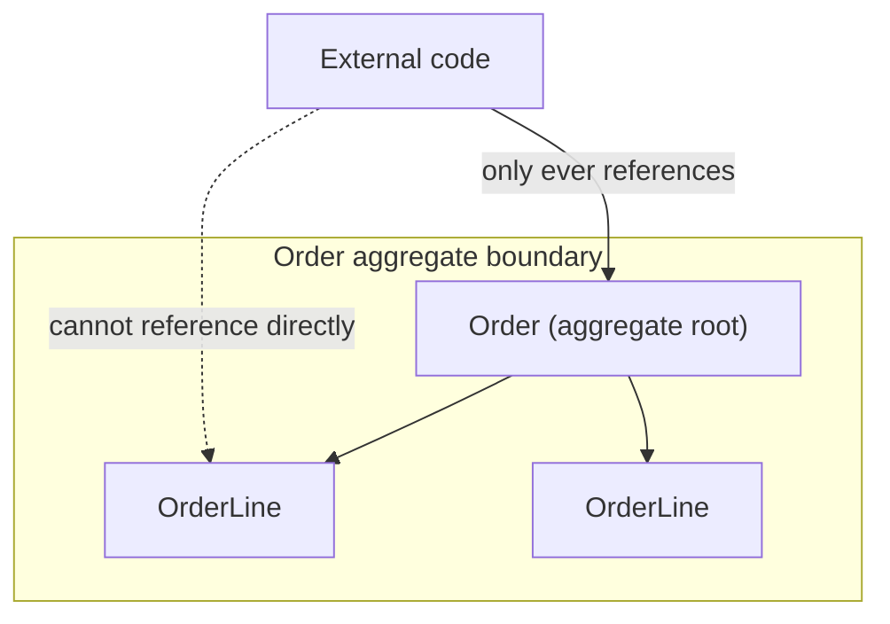

# DDD Tactical Design — Aggregates

> **Topic register:** T-903 · IWI 7.25 (paired with T-901) · Advanced tier · Prerequisite: the domain modelling covered in [Data Modelling and Explicit Join Tables](../databases/data-modelling-and-explicit-join-tables.md) — an aggregate's persistence-agnostic modelling depends on the domain already being free of infrastructure dependencies.

## Table of Contents

1. [Learning Objectives](#learning-objectives)
2. [Why This Matters in Interviews](#why-this-matters-in-interviews)
3. [Mental Model](#mental-model)
4. [Definition and Purpose](#definition-and-purpose)
5. [Core Concepts](#core-concepts)
6. [Internal Implementation](#internal-implementation)
7. [Diagrams](#diagrams)
8. [Java Examples](#java-examples)
9. [Production Scenarios](#production-scenarios)
10. [Trade-offs](#trade-offs)
11. [Decision Framework](#decision-framework)
12. [Common Mistakes](#common-mistakes)
13. [Anti-Patterns](#anti-patterns)
14. [Best Practices](#best-practices)
15. [Interview Answer Framework](#interview-answer-framework)
16. [Interview Questions](#interview-questions)
17. [Summary](#summary)
18. [Key Takeaways](#key-takeaways)
19. [Cheat Sheet](#cheat-sheet)
20. [Flashcards](#flashcards)
21. [Practice Exercises](#practice-exercises)
22. [Solutions](#solutions)
23. [Additional Reading](#additional-reading)
24. [Official References](#official-references)

---

## Learning Objectives

By the end of this chapter you can:

- Define an aggregate root and explain why it's the only object outside code may reference directly.
- State the aggregate sizing rule precisely, and identify an over-sized or under-sized aggregate from its symptoms.
- Explain why an aggregate boundary is deliberately also a transaction boundary, and how cross-aggregate consistency is handled instead.
- Connect aggregate boundaries to service boundaries as the same underlying question asked at different scales.

## Why This Matters in Interviews

Aggregate design tests whether a candidate models a domain around its actual consistency requirements or around superficial object relatedness. It's a recurring Staff-level topic because a poorly-drawn aggregate boundary today is one of the most common root causes of a monolith that resists decomposition later — the coupling isn't accidental, it's modeled in from the start, and interviewers use this topic to see whether a candidate would have caught it at design time.

## Mental Model

**An aggregate boundary answers exactly one question: what has to be true, all at once, for this data to be valid?** Everything that must be consistent together belongs inside the boundary; everything else — no matter how conceptually related — belongs outside it, referenced only by ID, and kept consistent eventually rather than atomically. Getting the boundary right means resisting the urge to group things that merely *feel* related.

## Definition and Purpose

An **aggregate** is a cluster of domain objects treated as a single consistency unit — one object (the **aggregate root**) is the only entry point the outside world is allowed to reference; everything inside the boundary is only reachable through the root. `Order` is a root; its `OrderLine` entities are only ever accessed via `order.getLines()`, never loaded or modified independently.

Without an explicit consistency boundary, business-rule invariants — an order's total must equal the sum of its lines, a bank account can't go negative — have no single place enforcing them, because any code anywhere can load and modify an `OrderLine` independently of its parent `Order`. The aggregate boundary is the answer to "what has to be true, all at once, for this data to be valid" — and it is deliberately also the **transaction boundary**: a single aggregate is saved atomically, in one transaction, and cross-aggregate consistency is handled through eventual consistency (events, sagas) rather than a shared database transaction.

## Core Concepts

### Sizing rule: as small as the true invariant requires

An aggregate should be as small as the true invariant requires, not as large as "everything related." `Order` and `OrderLine` are one aggregate because the order total genuinely must be consistent with its lines at all times. `Customer` is a *separate* aggregate from `Order` — an order references a customer by ID, not by object reference, because there's no invariant requiring the customer's data and a specific order's data to change atomically together.

### Repository-per-aggregate

Each aggregate root gets exactly one repository (`OrderRepository`, not `OrderLineRepository`) — this is the same port pattern as any repository abstraction, applied at aggregate granularity. `OrderLine` has no repository because nothing outside the `Order` aggregate is allowed to load or save it independently.

### Cross-aggregate consistency is eventual, not transactional

A single logical operation spanning two aggregates cannot use a shared ACID transaction across them by design — that would violate the point of drawing separate boundaries. Instead, cross-aggregate consistency uses sagas, an outbox pattern, or domain events, accepting a window of eventual consistency in exchange for aggregates that can each be reasoned about, locked, and scaled independently.

## Internal Implementation

**Sketch — illustrates the shape, not compiled standalone:**

```java
public class Order {
    private OrderId id;
    private List<OrderLine> lines = new ArrayList<>();
    private OrderStatus status;

    public void addLine(ProductId productId, int quantity, Money unitPrice) {
        if (status != OrderStatus.DRAFT) {
            throw new IllegalStateException("cannot modify a placed order");
        }
        lines.add(new OrderLine(productId, quantity, unitPrice));
    }

    public Money total() {
        return lines.stream()
            .map(OrderLine::lineTotal)
            .reduce(Money.ZERO, Money::add);
    }

    // No public method lets external code fetch or replace `lines` directly —
    // every mutation goes through a root method that can enforce an invariant.
}
```

The invariant — "the order total always equals the sum of its lines" — is enforced by construction: there is no code path that can add a line without going through `Order.addLine`, and no code path that can read `lines` and mutate it externally, because the field is never exposed.

## Diagrams



## Java Examples

```java
// Correct: Order is the aggregate root; Customer is a SEPARATE aggregate,
// referenced by ID only -- no invariant requires them to change atomically together.
public class Order {
    private OrderId id;
    private CustomerId customerId; // reference by ID, not by object
    private List<OrderLine> lines;
}

// Incorrect: giving OrderLine its own repository lets code bypass the
// root's invariant-enforcing methods entirely.
public interface OrderLineRepository extends Repository<OrderLine, OrderLineId> {
    // Should not exist -- OrderLine is only ever reachable through OrderRepository.
}
```

**Complexity note:** aggregate design is a modelling decision, not an algorithmic one — the value here is the invariant boundary, not runtime complexity.

## Production Scenarios

### Scenario: an over-sized aggregate causes system-wide lock contention during a routine sales event

**Symptoms.** During a flash sale, every order placement against a popular product times out, even though the underlying database has ample capacity and the product's inventory count itself is updated correctly. Unrelated customer-profile updates during the same window also slow down significantly.

**Impact.** A routine, anticipated traffic spike causes a broad outage touching features (customer profile updates) that have nothing to do with the sale itself.

**Initial hypotheses.** Database connection pool exhaustion (checked — pool utilization is well below its limit); a slow query plan on the order-placement path (checked — the query itself executes quickly); an over-sized aggregate causing broad lock contention (correct).

**Evidence.** Profiling shows every order-placement transaction acquiring a lock on the entire `Customer` row (because `Customer` and all of a customer's `Order`s were modeled as one aggregate, sharing one root), and the flash sale drives many concurrent orders from the same set of frequent customers, serializing all of their concurrent order placements — and blocking unrelated customer-profile updates from the same customers — on that one shared lock.

**Diagnosis.** `Customer` and `Order` were modeled as a single aggregate ("a customer has orders, so they belong together"), rather than as two separate aggregates connected by a `customerId` reference — exactly the over-sizing this chapter warns creates crippling lock contention, discovered only under real concurrent load.

**Immediate mitigation.** Temporarily route flash-sale order placement through a code path that avoids loading the full `Customer` aggregate, accepting some duplicated logic to relieve the immediate contention.

**Permanent remediation.** Re-model `Order` as its own aggregate, referencing `Customer` by ID only — removing the shared lock entirely, since no invariant actually requires a customer's profile data and any one of their orders to change atomically together.

**Alternatives considered.** Optimistic locking on the combined aggregate instead of pessimistic — rejected as treating the symptom (lock contention) without fixing the underlying modelling error (the two things were never one consistency unit to begin with).

**Trade-offs.** Splitting the aggregate means a customer's total order history is no longer trivially available in one atomic read — accepted, since that read was never actually required to be atomic in the first place; it's a query-time join, not a consistency requirement.

**Prevention.** Apply the sizing test explicitly during design review for any proposed aggregate spanning what looks like a natural "has-many" relationship: does a real invariant require these two things to be consistent together, or would a change to one require locking the other anyway for no invariant-driven reason?

**Interview lesson.** This is Interview Question 2's underlying scenario at real production scale: an aggregate sized by object composition ("customers have orders") rather than by true invariant, causing exactly the concurrency cost this chapter predicts.

## Trade-offs

| Benefit | Cost |
|---|---|
| Invariants are enforced in exactly one place, always | Cross-aggregate operations can't use a single ACID transaction — need sagas/eventual consistency |
| Clear repository-per-aggregate boundary simplifies persistence | Under-sizing (aggregate too small) pushes invariants outside the model; over-sizing hurts concurrency (whole aggregate locked/loaded for any change) |
| Concurrency conflicts are scoped to one aggregate instance, not the whole database | Requires real domain modelling effort — this isn't a mechanical, always-obvious decision |

## Decision Framework

1. **Must these two objects be consistent together, right now, always?** If yes, same aggregate. If no, separate aggregates, referenced by ID.
2. **Would a change to one object require locking or loading the other anyway, for no invariant-driven reason?** If yes, the aggregate is likely over-sized.
3. **Is an invariant currently unenforced because it spans two separately-saved objects?** If yes, the aggregate may be under-sized — that invariant has no single place enforcing it.
4. **Does a proposed cross-aggregate operation seem to need a shared transaction?** That's a signal to reach for a saga/outbox/event-driven mechanism, not to merge the aggregates.

## Common Mistakes

- Modelling an aggregate around object *composition* ("an order has lines, so they're one aggregate, and also has a customer, so that's included too") instead of around the actual consistency invariant.
- Giving a non-root entity (`OrderLine`) its own repository, which allows code to bypass the root's invariant-enforcing methods entirely.
- Assuming aggregates map one-to-one onto database tables — they don't; `Order` + `OrderLine` is one aggregate spanning two tables (see [Data Modelling and Explicit Join Tables](../databases/data-modelling-and-explicit-join-tables.md)).

## Anti-Patterns

- **Merging two aggregates because they're conceptually related**, rather than because a real invariant requires them to be consistent together.
- **Giving every entity its own repository**, regardless of whether it's an aggregate root.
- **Reaching for a distributed/shared transaction across aggregates** instead of a saga or outbox pattern when a real cross-aggregate consistency need arises.

## Best Practices

- Draw aggregate boundaries from the actual invariant, and re-test the boundary whenever concurrency or lock-contention symptoms appear.
- Reference other aggregates by ID, never by direct object reference.
- Design cross-aggregate consistency needs around sagas/outbox/events from the start, rather than treating them as an afterthought once a shared-transaction attempt fails.

## Interview Answer Framework

### 30-Second Answer

An aggregate is a cluster of objects that must be consistent together, entered only through its root, and saved atomically as a transaction boundary. The sizing rule is as small as the true invariant requires — `Order`+`OrderLine` are one aggregate because the total must match the lines; `Customer` is separate because no invariant requires it to change atomically with any one order.

### 2-Minute Answer

Definition: an aggregate is the smallest cluster of objects that must be consistent together, with one root as the only external entry point. Why it exists: without an explicit boundary, invariants have no single enforcement point since any code could load and mutate internal entities independently. How it works: sizing follows the true invariant, not object composition; only the root gets a repository; cross-aggregate consistency is eventual (sagas/outbox), not transactional. One important trade-off: under-sizing loses invariant enforcement, over-sizing costs concurrency (broad locks). Production example: a real-shaped incident where merging `Customer` and `Order` into one aggregate caused system-wide lock contention during a flash sale, fixed by separating them and referencing by ID.

### 10-Minute Deep Dive

Cover, in order: the mental model — an aggregate boundary answers "what must be true together" (mental model); the sizing rule and repository-per-aggregate pattern (core concepts); the invariant-enforced-by-construction code sketch (internals); the decision framework for testing a proposed boundary (decision framework); and close with the production scenario — an over-sized aggregate causing a real concurrency-driven outage during a flash sale.

### Whiteboard Explanation

Draw the [§ Diagrams](#diagrams) graph: the `Order` aggregate boundary containing the root and its `OrderLine`s, with external code arrows pointing only at the root, and a crossed-out arrow attempting to reach `OrderLine` directly. Add `Customer` outside the boundary, connected by a plain reference arrow (not composition), annotated "no invariant requires these to change together."

### Production Example

The flash-sale lock contention in [§ Production Scenarios](#production-scenarios): `Customer` and `Order` modeled as one aggregate caused every order placement to lock the shared customer row, cascading into unrelated profile-update slowdowns — fixed by splitting them into separate aggregates referenced by ID.

### Trade-offs to Mention

State unprompted: over-sizing an aggregate creates concurrency costs (broad locking) that only show up under real load, not in design review; under-sizing silently loses invariant enforcement; cross-aggregate consistency requires accepting eventual consistency, not a workaround transaction.

### Common Candidate Mistakes

Grouping aggregates by conceptual relatedness rather than invariant; giving every entity its own repository; assuming aggregates must map one-to-one onto database tables.

### Typical Follow-Up Questions

1. "Two transactions need to update two different aggregates together. Now what?"
2. "Give an example of an aggregate that's too large, and what breaks."

### Senior-Level Expectations

States the invariant-driven boundary correctly; states the sizing principle and can identify an over-sized example.

### Staff-Level Discussion

Aggregate boundaries are, in practice, the seams along which a system can later be decomposed into services — a well-drawn aggregate boundary today is very often the correct service boundary tomorrow, because both are answering the same underlying question: "what has to be consistent together, and what can be eventually consistent." Getting this wrong early (aggregates too large, spanning what should be separate consistency domains) is one of the most common root causes of a monolith that resists decomposition later — the coupling isn't accidental, it was modeled in from the start. See [Microservice Decomposition and the Monolith Trade-off](microservice-decomposition-and-monolith-tradeoff.md) for the service-boundary version of this same question.

## Interview Questions

### Question 1 — What is an aggregate boundary, and why is it a *transaction* boundary?

**Why interviewers ask it.** Tests whether the candidate understands aggregates as a consistency mechanism, not just an object-grouping convention.

**Expected answer.** The boundary around objects that must be consistent together, saved atomically in one transaction; anything outside is eventually consistent.

**Minimum acceptable answer.** States that an aggregate is saved as a unit, even without the full invariant framing.

**Strong Senior answer.** States the invariant-driven boundary correctly.

**Staff-level extension.** Names a concrete cross-aggregate consistency mechanism (saga/outbox) when the follow-up hits, not just "eventual consistency" as a buzzword.

**Common mistakes.** Describing aggregates purely in terms of object composition ("things that belong together") without the invariant/consistency framing.

**Likely follow-ups.** "Two transactions need to update two different aggregates together. Now what?"

**Evaluation criteria (1–5).** 1: describes aggregates as object composition only. 3: states the invariant-driven transaction-boundary framing. 5: correct framing plus names a concrete cross-aggregate mechanism.

**Related references.** [§ Definition and Purpose](#definition-and-purpose).

---

### Question 2 — What is the aggregate sizing rule, precisely?

**Why interviewers ask it.** Tests whether the candidate has a principled sizing test rather than intuition.

**Expected answer.** As small as the true invariant requires — not "everything conceptually related."

**Minimum acceptable answer.** States that aggregates shouldn't be too large, even without the precise invariant test.

**Strong Senior answer.** States the sizing principle and can identify an over-sized example.

**Staff-level extension.** Connects over-sizing to a concrete concurrency cost (lock contention, larger blast radius for conflicts) rather than a purely stylistic objection.

**Common mistakes.** Modelling `Customer` and all their `Order`s as one aggregate "because they're related" — this makes every order touch-lock the customer.

**Likely follow-ups.** "Give an example of an aggregate that's too large, and what breaks."

**Evaluation criteria (1–5).** 1: sizes by conceptual relatedness. 3: states the invariant-driven sizing rule. 5: correct rule plus a concrete concurrency-cost example.

**Related references.** [§ Production Scenarios](#production-scenarios).

## Summary

An aggregate is the smallest cluster of objects that must be consistent together, entered only through its root, and saved atomically as a transaction boundary. Sizing it correctly — no larger than the true invariant requires — is a modelling skill, not a mechanical rule, and getting it wrong shows up later as either broken invariants (too small) or crippling lock contention (too large).

## Key Takeaways

- Aggregate boundary = consistency boundary = transaction boundary, all three together.
- Only the root has a repository; internal entities are reached only through the root.
- Cross-aggregate consistency is eventual, not transactional — sagas/outbox, not a shared `@Transactional`.
- Aggregate boundaries drawn well today are frequently the service boundaries of tomorrow.

## Cheat Sheet

| Question to ask | If yes → same aggregate | If no → separate aggregates |
|---|---|---|
| Must these objects be consistent *right now*, together, always? | Yes | No — reference by ID, eventual consistency |
| Would a change to one require locking/loading the other anyway? | Yes | No |

## Flashcards

### Card: What an aggregate root is

**Prompt:**
What is an aggregate root?

**Answer:**
The only object in an aggregate that external code is allowed to reference directly.

**Why it matters:**
Enforces that all mutations go through methods that can uphold the aggregate's invariants.

**Common trap:**
Giving an internal entity its own repository, bypassing the root.

**Related:**
[Core Concepts](#core-concepts)

### Card: What decides aggregate boundaries

**Prompt:**
What decides aggregate boundaries?

**Answer:**
The true consistency invariant — not object composition or conceptual relatedness.

**Why it matters:**
The single principled test that prevents both under- and over-sizing.

**Common trap:**
Grouping objects because they seem related, not because an invariant requires it.

**Related:**
[Decision Framework](#decision-framework)

### Card: Repositories per aggregate

**Prompt:**
How many repositories does an aggregate get?

**Answer:**
One, for the root only.

**Why it matters:**
Prevents code from bypassing the root's invariant-enforcing methods.

**Common trap:**
Creating a repository for every entity class regardless of aggregate membership.

**Related:**
[Core Concepts](#core-concepts)

## Practice Exercises

1. Take `Order`/`OrderLine`/`Customer` from [Data Modelling and Explicit Join Tables](../databases/data-modelling-and-explicit-join-tables.md). Confirm: is `Customer` correctly a separate aggregate from `Order`? State the invariant test that proves it.
2. Identify one aggregate in a system you know that is arguably over-sized. Name the specific lock-contention or blast-radius cost this creates.

## Solutions

**Exercise 1.** `Customer` is correctly separate: no invariant requires a customer's profile fields and any specific order's line items/total to be consistent at the same instant. The test: would saving one require the other to change atomically for correctness? No — an order can be saved and read entirely independently of any concurrent customer-profile update, so they belong in separate aggregates, connected by `customerId` reference only.

**Exercise 2.** A common real-world example: a `Tenant` aggregate that includes every user and every resource belonging to that tenant. Any single resource update locks/loads the entire tenant aggregate, so unrelated resource updates from the same tenant serialize against each other even though no invariant actually connects them — exactly the flash-sale-style contention this chapter's production scenario demonstrates.

## Additional Reading

- This chapter previews [Microservice Decomposition and the Monolith Trade-off](microservice-decomposition-and-monolith-tradeoff.md) — the aggregate-boundary-as-service-boundary connection is worth re-reading once that chapter is reached.

## Official References

- Vaughn Vernon, *Domain-Driven Design Distilled*, Ch. 5 "Tactical Design with Aggregates"
- Eric Evans, *Domain-Driven Design*, Ch. 6 "The Life Cycle of a Domain Object" (original aggregate definition)
