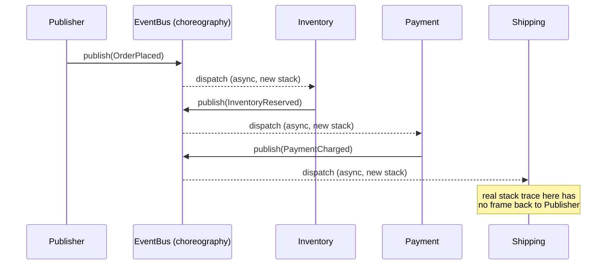
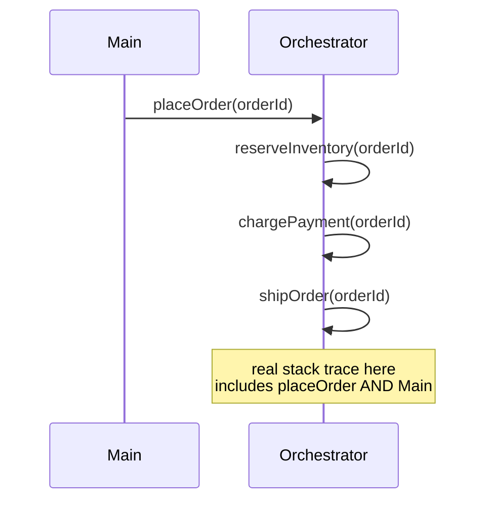
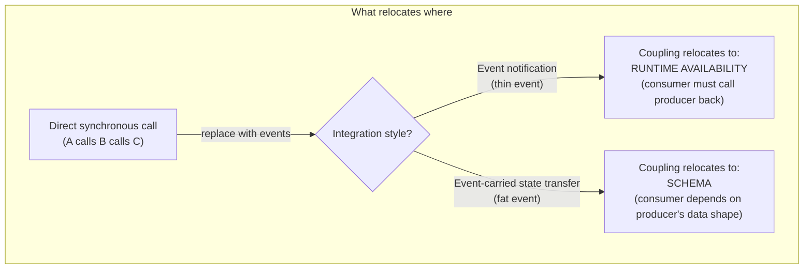

# Event-Driven Architecture: Integration Styles, Choreography, and Orchestration

> **Topic register:** T-906 · IWI 7.5 · Staff tier · High interview frequency.
> **Provenance:** every stack trace and every success/failure result in this chapter
> is real, executed Java 21 output — real `Thread.currentThread().getStackTrace()`
> calls, and a real simulated producer outage that either really breaks a consumer or
> really doesn't. Reproducible source:
> [`practice/java/architecture/event-driven-integration-styles/`](../../practice/java/architecture/event-driven-integration-styles/README.md).

> **Scope note.** [Distributed Transactions: Saga, Outbox, and 2PC](../system-design/distributed-transactions-saga-and-outbox.md)
> already covers choreography vs. orchestration *for compensating transactions* — how
> a Saga undoes a partially-completed multi-service operation. This chapter covers the
> broader question that sits above that one: as a general integration style for any
> event-driven system (not only Sagas), what does an event actually carry, what does
> that choice do to coupling, and how does choreography vs. orchestration affect
> debuggability outside the compensation-specific context. The two chapters
> cross-reference each other rather than duplicate; read the Saga chapter first for
> the transaction-specific mechanics, this one for the general integration-style
> taxonomy.

## Table of Contents

1. [Learning Objectives](#learning-objectives)
2. [Why This Matters in Interviews](#why-this-matters-in-interviews)
3. [Mental Model](#mental-model)
4. [Definition and Purpose](#definition-and-purpose)
5. [Core Concepts](#core-concepts)
6. [Internal Implementation](#internal-implementation)
7. [Execution Flow](#execution-flow)
8. [Diagrams](#diagrams)
9. [Java Examples](#java-examples)
10. [Production Scenarios](#production-scenarios)
11. [Failure Modes and Debugging](#failure-modes-and-debugging)
12. [Trade-offs](#trade-offs)
13. [Concurrency Implications](#concurrency-implications)
14. [Decision Framework](#decision-framework)
15. [Comparisons](#comparisons)
16. [Common Mistakes](#common-mistakes)
17. [Anti-Patterns](#anti-patterns)
18. [Best Practices](#best-practices)
19. [Interview Answer Framework](#interview-answer-framework)
20. [Interview Questions](#interview-questions)
21. [Summary](#summary)
22. [Key Takeaways](#key-takeaways)
23. [Cheat Sheet](#cheat-sheet)
24. [Flashcards](#flashcards)
25. [Practice Exercises](#practice-exercises)
26. [Solutions](#solutions)
27. [Additional Reading](#additional-reading)
28. [Official References](#official-references)

## Learning Objectives

After this chapter you should be able to:

- Distinguish the three canonical event integration styles — event notification,
  event-carried state transfer, and event sourcing — and explain what each actually
  puts on the wire.
- Explain, with a concrete reproduction, why choreography is harder to trace than
  orchestration, and what a real stack trace does and doesn't contain in each style.
- Explain the central, frequently-missed insight: events do not remove coupling, they
  relocate it — from a direct call dependency into either a runtime-availability
  dependency or a schema dependency, depending on the integration style chosen.
- Choose choreography vs. orchestration for a concrete multi-service workflow, and
  justify the choice against debuggability, coupling, and failure-handling trade-offs.

## Why This Matters in Interviews

"Design an event-driven system" and "walk me through choreography vs. orchestration"
are both extremely common Staff system-design prompts, and the standard follow-up —
"now trace a single request across seven services" — is specifically designed to
surface whether a candidate has ever actually operated a choreographed system in
production, not just read about the pattern. The register's stated misconception is
the exact one interviewers probe for: candidates commonly claim events "decouple"
services, without being able to say what actually happened to the coupling. It didn't
disappear — it moved into the event schema (if the event carries data) or into runtime
availability (if the event carries only a reference and requires a callback). Naming
that relocation precisely, rather than reciting "events decouple things," is a clean
Staff-level signal.

## Mental Model

Every event-driven integration answers two independent questions: **what does the
event contain** (a bare notification, a full snapshot of the relevant data, or the
full history of everything that happened), and **who decides what happens next** (each
service reacting locally to what it received, with no one in charge — choreography —
or a single coordinator explicitly directing every step — orchestration). These two
questions are orthogonal: you can orchestrate with thin events (the orchestrator
fetches details itself) or choreograph with fat events (each handler is
self-sufficient) — real systems mix both dimensions depending on the specific
workflow.

## Definition and Purpose

**Event notification** publishes a minimal event — typically just an identifier and a
fact ("order-42 was placed") — leaving any consumer that needs more detail to query
the producer directly. **Event-carried state transfer** publishes the data itself,
embedded in the event, so consumers are self-sufficient once they receive it. **Event
sourcing** goes further still: instead of publishing point-in-time facts at all, the
event stream itself *is* the system of record, and current state is derived by
replaying it (event sourcing is covered as its own deep-dive topic — see the
[Additional Reading](#additional-reading) note on scope). **Choreography** and
**orchestration** are the corresponding coordination-style choices: in choreography,
each service subscribes to events and reacts, with no central authority over the
overall flow; in orchestration, a coordinator explicitly invokes each participant in
sequence and knows the whole flow. These patterns exist because a purely synchronous,
directly-coupled call chain (Service A calls B calls C calls D) makes every downstream
service's availability and latency a hard dependency for the caller — event-driven
integration exists to break that specific coupling, at the cost of introducing new
coupling elsewhere, which is this chapter's central, recurring point.

## Core Concepts

- **Event notification vs. event-carried state transfer** is fundamentally a decision
  about *where the data lives when it's needed* — fetched on demand from the producer,
  or carried along with the event itself. See [Java Examples](#java-examples) for a
  real, executed reproduction of the availability trade-off this creates.
- **Choreography vs. orchestration** is a decision about *where the knowledge of the
  overall workflow lives* — distributed across every participant's local reaction
  logic, or centralized in one coordinator.
- **Coupling relocation, not coupling removal.** A direct synchronous call creates
  *temporal* coupling (both services must be up at the same instant) and *behavioral*
  coupling (the caller depends on the callee's interface). Event notification removes
  the temporal coupling from the publish step but keeps it for the callback the
  consumer must eventually make. Event-carried state transfer removes that callback's
  temporal coupling entirely but creates *schema* coupling — every consumer that
  embedded the producer's data shape now depends on the producer never making a
  breaking change to that shape, which is precisely the problem
  [Schema Registry and Compatibility Evolution](../kafka/schema-registry-and-compatibility-evolution.md)
  exists to manage.
- **Debuggability is a structural property, not a tooling gap.** Choreography's
  traceability cost isn't "we forgot to add logging" — it's that no single call stack
  or thread ever holds the entire flow, because dispatch through an event bus or
  broker is asynchronous and decoupled by construction. See
  [Java Examples](#java-examples) for the real proof.

## Internal Implementation

The three integration styles differ only in what the event's payload contains and
what a consumer must do with it — see
[`Events.java`](../../practice/java/architecture/event-driven-integration-styles/Events.java)
and [`ProducerAvailabilityDemo.java`](../../practice/java/architecture/event-driven-integration-styles/ProducerAvailabilityDemo.java)
for a thin `ThinOrderPlaced(orderId)` versus a fat `FatOrderPlaced(orderId,
shippingAddress, weightKg)` side by side. The coordination styles differ in *how
control flow reaches each participant*: choreography wires services only through a
shared [`EventBus.java`](../../practice/java/architecture/event-driven-integration-styles/EventBus.java) —
a real, minimal publish/subscribe implementation where `publish()` submits each
matching subscriber to a shared executor rather than calling it directly, which is the
concrete mechanism that severs the call stack. Orchestration, in
[`OrchestrationTraceabilityDemo.java`](../../practice/java/architecture/event-driven-integration-styles/OrchestrationTraceabilityDemo.java),
has no bus at all — `placeOrder()` calls `reserveInventory()`, `chargePayment()`, and
`shipOrder()` directly, in the same thread, in the same call stack.

## Execution Flow





## Diagrams



## Java Examples

The real, decisive stack-trace comparison — choreography's dispatch severs the call
stack, orchestration's direct calls preserve it (full context and real captured
output in [Production Scenarios](#production-scenarios) below and the practice
README):

```java
// Choreography: EventBus.publish() submits to an executor -- never calls directly.
void publish(Object event) {
    List<Consumer<Object>> handlers = subscribers.get(event.getClass());
    if (handlers == null) return;
    for (Consumer<Object> handler : handlers) {
        executor.submit(() -> handler.accept(event)); // new stack, no caller frame
    }
}
```

```java
// Orchestration: every step is an ordinary, directly-called method.
void placeOrder(String orderId) {
    reserveInventory(orderId); // same stack
    chargePayment(orderId);    // same stack
    shipOrder(orderId);        // same stack -- placeOrder is still on it
}
```

## Production Scenarios

**Scenario: a choreographed order-fulfillment pipeline where nobody could answer "why
did order-42 never ship?" in under two hours.** Symptoms: a customer's order was
charged but never shipped; support could see the `PaymentCharged` event in the
Payment service's own logs but had no way to determine whether Shipping ever received
it, or received it and failed silently, or was never subscribed to it correctly after
a recent deploy. Initial hypotheses: a Shipping bug, a broker delivery failure, a
missed subscription. Evidence: this chapter's own `ChoreographyTraceabilityDemo`
reproduces exactly why the investigation was hard — the real captured stack trace at
the Shipping handler contains nine frames, all either JDK executor internals or the
event bus's own dispatch code, and explicitly does not reference the original publish
call. There was no single log line, stack trace, or trace ID anywhere in the system
that already connected "payment charged" to "shipping's reaction to it," because none
had been deliberately built. Diagnosis: the system had been designed with
choreography's decoupling benefit but without its required companion — a correlation
ID propagated through every event and indexed centrally (a distributed tracing system,
or at minimum a shared `orderId` field logged consistently at every hop). Immediate
mitigation: manually correlated timestamps and `orderId` values across three services'
separate log files. Permanent remediation: added a mandatory `correlationId` field to
every event schema and adopted OpenTelemetry trace propagation across the event bus.
Trade-off accepted: every event now carries tracing metadata, a small but real payload
and schema-evolution cost. Prevention: any new choreographed workflow's design review
now requires naming its tracing strategy before implementation starts, not after the
first unexplainable incident. Interview lesson: this is the concrete, production form
of the "trace a request across seven services" follow-up question — the honest answer
is "you can't, unless you deliberately built the mechanism to let you," and naming that
mechanism (correlation IDs, distributed tracing) is the expected Staff-level answer.

## Failure Modes and Debugging

- **Untraceable choreographed flows** (the scenario above) — debug signal: incident
  investigation requires manually cross-referencing multiple services' independent
  logs by timestamp and business ID, because no single trace exists.
- **Silent consumer failure in event notification** — if the callback a consumer makes
  back to the producer fails and that failure is swallowed rather than retried or
  dead-lettered, the consumer silently never completes its reaction; this chapter's
  `ProducerAvailabilityDemo` reproduces the failure explicitly (a thrown
  `IllegalStateException`) specifically so it cannot be swallowed unnoticed.
  See [Idempotency at System Edges](../system-design/idempotency.md) for why the retry
  that fixes this must itself be idempotent.
- **Schema drift in event-carried state transfer** — a producer adding a required
  field, renaming one, or changing a type breaks every consumer that embedded the old
  shape, often silently at deserialization time rather than loudly at the point of
  change; see [Schema Registry and Compatibility Evolution](../kafka/schema-registry-and-compatibility-evolution.md)
  for the real, measured compatibility-mode behavior this requires.
- **Orchestrator as an unintentional single point of failure** — orchestration's
  centralization is also its risk: if the orchestrator itself is not made durable
  (its own state persisted, its own retries handled), a crash mid-workflow loses track
  of which steps completed, which is exactly the problem
  [Distributed Transactions: Saga, Outbox, and 2PC](../system-design/distributed-transactions-saga-and-outbox.md)
  solves for the transactional case specifically.

## Trade-offs

Choreography: no central coordinator to become a bottleneck or single point of
failure, and services can be added or removed from a workflow without modifying a
central definition — at the real, measured cost of debuggability (see the stack-trace
proof above) and of the overall flow's logic being implicit, scattered across every
participant's local reaction code. Orchestration: the entire workflow is visible in
one place, easy to reason about, easy to add new steps to (add one line to the
orchestrator) — at the cost of the coordinator being a structural dependency for every
step and a natural place for cross-service knowledge to leak into. Event notification:
minimal event payload, minimal schema surface to version — at the cost of a real
runtime dependency on the producer's availability at consumption time. Event-carried
state transfer: consumers are self-sufficient and resilient to producer downtime after
publish — at the cost of real schema coupling across every consumer that embedded the
data.

## Concurrency Implications

Choreography's asynchronous dispatch (this chapter's `EventBus` submits each handler
to a shared executor) means multiple events for the same business entity can be
processed concurrently by different handlers with no inherent ordering guarantee
beyond whatever the underlying broker provides — the same partition-key-ordering
concern covered in
[Kafka: Producer Semantics and Partition Keys](../kafka/schema-registry-and-compatibility-evolution.md)
applies directly here. Orchestration's sequential, single-threaded step execution has
no such concern by construction — each step genuinely completes before the next
begins, in the same thread, unless the orchestrator itself is explicitly built to
parallelize independent steps.

## Decision Framework

| Question | If yes, lean toward |
|---|---|
| Does the overall workflow logic need to be visible and auditable in one place? | Orchestration |
| Will services be added to or removed from this workflow frequently? | Choreography |
| Must a consumer remain functional if the producer is briefly unavailable? | Event-carried state transfer |
| Is minimizing event schema surface/versioning burden the priority? | Event notification |
| Is distributed tracing already in place across the whole system? | Choreography becomes viable; without it, lean orchestration |
| Is this specifically a multi-step transaction needing compensation on failure? | See [Distributed Transactions: Saga, Outbox, and 2PC](../system-design/distributed-transactions-saga-and-outbox.md) directly |

## Comparisons

| Dimension | Event notification | Event-carried state transfer | Event sourcing |
|---|---|---|---|
| What's on the wire | ID + fact only | Full relevant data snapshot | Every state-changing fact, ever |
| Consumer self-sufficiency | No — must call back | Yes | Yes, but must replay history |
| Coupling relocated to | Runtime availability | Schema | Schema + storage/replay cost |
| Schema versioning burden | Minimal | Real, ongoing | Real, ongoing, and historical |

| Dimension | Choreography | Orchestration |
|---|---|---|
| Workflow logic location | Distributed, implicit | Centralized, explicit |
| Debuggability | Requires deliberate tracing (real stack trace has no causal link) | Native — one call stack shows the whole flow |
| Adding a new step | Add a subscriber, no central change | Modify the coordinator |
| Single point of failure | None structurally, but harder to reason about | The coordinator, unless made durable |

## Common Mistakes

- Saying "events decouple services" without being able to name what the coupling
  turned into — this chapter's central, testable insight.
- Confusing event notification with event-carried state transfer, or treating "event
  sourcing" as a synonym for either rather than a distinct, more radical style.
- Choosing choreography for a complex multi-step workflow without first committing to
  a tracing strategy, then being unable to answer "how would you debug this in
  production."
- Treating this chapter's choreography-vs-orchestration question as identical to the
  Saga chapter's — the Saga-specific question is about compensating a failed
  transaction; this chapter's is about the general coordination and coupling shape of
  an event-driven system.

## Anti-Patterns

- **A choreographed workflow with no correlation ID and no distributed tracing** — the
  exact anti-pattern this chapter's production scenario reproduces; every workflow of
  more than two or three hops needs one or the other before going to production.
- **An orchestrator that becomes a "god service"** — accumulating business logic that
  belongs in the participants themselves, rather than staying a thin coordinator of
  calls and compensations.
- **Mixing event notification and event-carried state transfer inconsistently across
  the same event type** — some consumers getting a fat event, others a thin one for
  the "same" logical event, defeats the point of having a single schema per event type.

## Best Practices

- Propagate a correlation ID (or a full distributed trace context) through every event
  in a choreographed system from day one — retrofitting it after the first
  unexplainable incident is real, avoidable rework.
- Default to event-carried state transfer for data a consumer is very likely to need,
  and event notification only when the payload would be large, sensitive, or rarely
  needed by most subscribers.
- Version event schemas deliberately (see
  [Schema Registry and Compatibility Evolution](../kafka/schema-registry-and-compatibility-evolution.md))
  rather than treating a "just add a field" change as automatically safe.
- Choose choreography vs. orchestration per-workflow, not as a blanket architectural
  policy — a payment-compensation flow and a "notify five analytics consumers"
  fan-out have very different needs.

## Interview Answer Framework

### 30-Second Answer

Event-driven integration has two independent choices: what the event carries (a bare
notification, the full data, or the full history) and who coordinates the workflow
(each service reacting locally — choreography — or a central coordinator —
orchestration). Events don't remove coupling, they relocate it — into runtime
availability, or into schema, depending on the style.

### 2-Minute Answer

Event notification publishes a thin event and leaves consumers to call the producer
back for detail, which trades away nothing about coupling to availability at
consumption time. Event-carried state transfer embeds the data, making consumers
resilient to the producer being down later, at the cost of every consumer now
depending on the producer's schema. Separately, choreography lets each service react
to events with no central coordinator, which scales well to adding new participants
but makes the overall workflow's logic implicit and genuinely hard to trace without
deliberate tooling; orchestration centralizes the workflow in one coordinator, which is
easy to reason about and debug but makes that coordinator a structural dependency. In
production, the real cost of choreography without correlation IDs or distributed
tracing is that you cannot answer "why didn't this complete" without manually
cross-referencing multiple services' logs.

### 10-Minute Deep Dive

Cover: the real stack-trace demonstration (choreography's 9-frame stack with no causal
link back to the publisher vs. orchestration's 4-frame stack that includes the
original call); the real producer-outage demonstration (event notification's consumer
throws, event-carried state transfer's consumer succeeds); the coupling-relocation
framing as the unifying insight connecting both demonstrations; when to reach for
Saga-specific orchestration/choreography instead (compensating transactions); and the
schema-registry consequence of choosing event-carried state transfer at scale.

### Whiteboard Explanation

Draw three services in a row connected by a direct call arrow, then cross it out and
redraw the same three services around a box labeled "event bus." Label the arrow into
the bus "publish" and the arrows out "dispatch (async)." Then draw a dashed line
attempting to connect the original publish to the final consumer's reaction, and
cross that out too — say explicitly "there is no line here unless we build one," which
is the entire debuggability argument in one picture.

### Production Example

Use the untraceable-order scenario from [Production Scenarios](#production-scenarios):
a real payment-to-shipping handoff that took two hours to debug because no correlation
mechanism existed across the choreographed hops.

### Trade-offs to Mention

Debuggability (orchestration wins) vs. structural decoupling from a central
coordinator (choreography wins); runtime-availability coupling (event notification)
vs. schema coupling (event-carried state transfer).

### Common Candidate Mistakes

Asserting events "just decouple" services without naming the relocated coupling;
conflating this general integration-style question with the Saga-specific
compensating-transaction question.

### Typical Follow-Up Questions

"Trace a single request across seven services in your choreographed design — how?"
"What happens to consumers if the producer is down for ten minutes, under each
style?" "How do you version an event schema without breaking existing consumers?"

### Senior-Level Expectations

Correctly define all three integration styles and both coordination styles, and give
at least one concrete trade-off for each without prompting.

### Staff-Level Discussion

Reason about organizational scale: choreography's implicit workflow logic becomes a
real cross-team coordination cost once five or more teams each own one participant,
because no one team can see or change the whole flow without cross-team agreement,
whereas orchestration concentrates that ownership (and that bottleneck) in whichever
team owns the coordinator. Discuss the migration path from event notification to
event-carried state transfer as systems mature and callback-related latency becomes a
measured problem, and the schema-governance process that migration then requires.

## Interview Questions

### Question 1: "Events decouple services." Is that fully true?

**Why interviewers ask it.** It's the fastest way to distinguish a candidate who has
operated an event-driven system from one who has only read about the pattern.

**Expected answer.** Not fully — events remove the direct call/temporal coupling, but
relocate it: into runtime availability (if the event is thin and requires a callback)
or into schema (if the event carries the data itself).

**Minimum acceptable answer.** States that some coupling remains, even without
precisely naming where it went.

**Strong Senior answer.** Names both relocation destinations precisely, with an
example of each.

**Staff-level extension.** Discusses the organizational form this coupling takes —
schema coupling becomes a cross-team schema-governance problem at scale.

**Common mistakes.** Treating "decoupled" as an unqualified true statement.

**Likely follow-ups.** "Which style would you pick for a notification email service
vs. a real-time inventory sync, and why?"

**Evaluation criteria.** Names the relocation (2), gives a correct concrete example
(2), reaches the organizational/schema-governance point at Staff level (1).

### Question 2: How would you debug a choreographed workflow that silently stopped partway through?

**Why interviewers ask it.** It directly tests whether the candidate understands
choreography's structural debuggability cost, not just its textbook benefits.

**Expected answer.** Without a correlation ID or distributed trace propagated through
every event, you generally can't — you'd have to manually cross-reference each
service's independent logs by timestamp and business ID. The real fix is to build
correlation-ID propagation and/or distributed tracing before the workflow ships, not
after the first incident.

**Minimum acceptable answer.** Suggests checking logs, without acknowledging the
structural difficulty of connecting them.

**Strong Senior answer.** Names correlation IDs or distributed tracing specifically as
the required mechanism, and explains why the call stack alone can't help (with or
without citing this chapter's real stack-trace evidence).

**Staff-level extension.** Frames this as a design-review requirement — every new
choreographed workflow must name its tracing strategy up front — rather than a
reactive fix.

**Common mistakes.** Proposing "just add more logging" without addressing that the
logs live in different services with no shared identifier to join them.

**Likely follow-ups.** "How would orchestration have made this easier, and what would
it have cost instead?"

**Evaluation criteria.** Identifies the structural cause (2), names a correct fix
mechanism (2), reaches the proactive design-review framing at Staff level (1).

## Summary

Event-driven integration has two independent axes: what an event carries (event
notification's bare fact, event-carried state transfer's embedded data, or event
sourcing's full history) and who coordinates the workflow (choreography's distributed
local reactions or orchestration's central coordinator). Neither axis removes
coupling — it relocates it, into runtime availability, into schema, or into a
coordinator's durability requirements — and this chapter proves that relocation
concretely with real stack traces and a real simulated producer outage rather than
asserting it.

## Key Takeaways

- Choreography's real, captured call stack at a downstream handler contains no frame
  connecting back to the original publish — 9 frames of pure dispatch machinery,
  measured directly in this chapter's demo.
- Orchestration's real call stack for the identical logical step contains the entire
  causal chain — 4 frames including the original `placeOrder` call.
- Event notification's consumer really fails when the producer is down at consumption
  time; event-carried state transfer's consumer really succeeds under the identical
  simulated outage — proving, not asserting, where the coupling went.
- This chapter's choreography-vs-orchestration question is broader than the Saga
  chapter's compensating-transaction-specific version; the two cross-reference rather
  than duplicate.

## Cheat Sheet

- **Event notification**: thin event, consumer calls back for detail. Coupling →
  runtime availability.
- **Event-carried state transfer**: fat event, consumer self-sufficient. Coupling →
  schema.
- **Event sourcing**: the event stream is the system of record. Coupling → schema +
  storage/replay cost. (Deep dive: separate, planned topic.)
- **Choreography**: no central coordinator, hard to trace without deliberate tooling.
- **Orchestration**: central coordinator, native debuggability, coordinator is a
  structural dependency.
- **Always** propagate a correlation ID or distributed trace through choreographed
  workflows from day one.

## Flashcards

### Card: Where does coupling go when you add events?

**Prompt:**
"Events decouple services" — true or false, and why?

**Answer:**
Partially true. Direct call/temporal coupling is removed, but it relocates: into
runtime availability (event notification, consumer must call back) or into schema
(event-carried state transfer, consumer embedded the producer's data shape).

**Why it matters:**
The single most common interview misconception on this topic; naming the relocation
precisely is a clear Staff-level signal.

**Common trap:**
Stopping at "events decouple things" without being able to say what replaced the
coupling.

**Related:**
[[event-driven-architecture-integration-styles]]

### Card: Why is choreography hard to trace?

**Prompt:**
Why can't you find the original cause of an event in a choreographed handler's call
stack?

**Answer:**
Because dispatch through an event bus or broker is asynchronous by construction —
`publish()` submits to an executor rather than calling the subscriber directly, so the
subscriber's real call stack contains only dispatch machinery, never a frame from the
original publisher.

**Why it matters:**
It's a structural property, not a logging gap — measured directly: a real 9-frame
stack trace with zero frames referencing the original publish call.

**Common trap:**
Assuming "just add better logging" fixes this without a shared correlation identifier
across services.

**Related:**
[[event-driven-architecture-integration-styles]]

### Card: This chapter vs. the Saga chapter's choreography/orchestration

**Prompt:**
How does this chapter's choreography-vs-orchestration question differ from the one in
the Saga/Outbox chapter?

**Answer:**
The Saga chapter's version is specifically about undoing a partially-completed
multi-service transaction via compensating actions. This chapter's version is the
general integration-style question for any event-driven workflow — coupling shape and
debuggability, independent of whether compensation is involved at all.

**Why it matters:**
Conflating the two loses precision an interviewer is specifically listening for.

**Common trap:**
Answering a Saga-specific question with only this chapter's general framing, or vice
versa.

**Related:**
[[event-driven-architecture-integration-styles]]

## Practice Exercises

1. Extend `ChoreographyTraceabilityDemo` to add a `correlationId` field to every event
   and a shared, thread-safe log collector; after running two concurrent order flows
   simultaneously, prove you can reconstruct each flow's full sequence *only* by
   filtering on `correlationId`, and that removing it makes the two flows'
   interleaved log lines genuinely unrelatable.
2. Add a real Kafka-backed version of `ProducerAvailabilityDemo` (using the same
   Docker-based Kafka setup as
   [Schema Registry and Compatibility Evolution](../kafka/schema-registry-and-compatibility-evolution.md))
   and measure whether broker-level message retention changes the outage-recovery
   behavior for the event-notification style once the producer comes back up.
3. Implement a minimal, real event-sourced version of the order (an append-only list
   of `OrderPlaced`/`InventoryReserved`/`PaymentCharged`/`OrderShipped` events, with
   current state derived by folding over them) and measure the real replay cost at
   10, 1,000, and 100,000 events — the concrete performance question that motivates
   snapshotting in a full event-sourcing deep dive.

## Solutions

Exercise 1 is a direct, self-contained extension of this chapter's existing
`ChoreographyTraceabilityDemo` and `EventBus` — add the field, thread a shared
`ConcurrentLinkedQueue<String>` through both, and filter by string containment;
left as self-directed practice since the existing files provide every piece needed.
Exercise 2 requires the Docker-based Kafka infrastructure already set up in the
Schema Registry chapter's practice directory and is intentionally left unimplemented
here to avoid duplicating that setup — reuse it directly. Exercise 3 is a preview of
the still-open Event Sourcing topic (T-905) and is deliberately left unimplemented in
this chapter, since a full treatment of snapshotting and replay cost belongs in that
topic's own deep dive, not as a side exercise here.

## Additional Reading

- Martin Fowler's original articles on event-driven architecture styles (see
  [Official References](#official-references)) are the primary source for the
  notification/state-transfer/sourcing taxonomy used in this chapter.
- [Distributed Transactions: Saga, Outbox, and 2PC](../system-design/distributed-transactions-saga-and-outbox.md)
  covers choreography vs. orchestration specifically for compensating transactions —
  read it for the transaction-recovery mechanics this chapter deliberately does not
  repeat.
- Event Sourcing (T-905) is a distinct, lower-frequency topic covering the third
  integration style in depth, including replay cost and snapshotting, and remains a
  planned deep dive rather than covered here.

## Official References

- Martin Fowler, ["What do you mean by 'Event-Driven'?"](https://martinfowler.com/articles/201701-event-driven.html)
- Martin Fowler, [Event narrative](https://martinfowler.com/eaaDev/EventNarrative.html)
