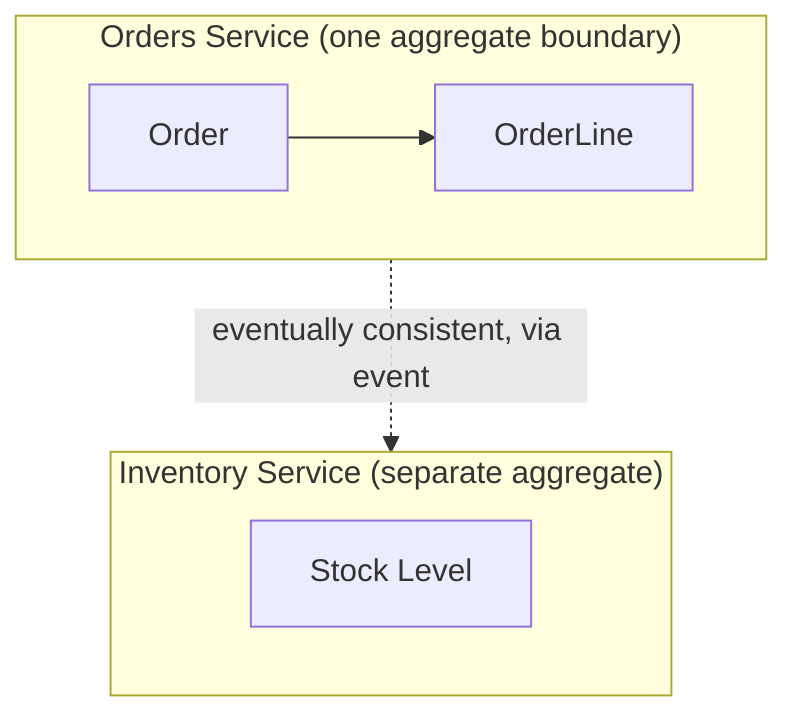

# Microservice Decomposition and the Monolith Trade-off

> **Topic register:** T-907 (Microservice decomposition & boundary design, IWI 8.40, #6 of 198) / T-908 (Monolith vs. microservices, IWI 7.90) · Staff-Level tier · Very High interview frequency [H] — near-universal at Staff
> **The judgment trap:** the expected answer is frequently "don't decompose." Candidates who decompose enthusiastically fail this question; the expected answer weighs organizational structure, transaction boundaries, data ownership, and operational cost.

## Table of Contents

1. [Learning Objectives](#learning-objectives)
2. [Why This Matters in Interviews](#why-this-matters-in-interviews)
3. [Mental Model](#mental-model)
4. [Definition and Purpose](#definition-and-purpose)
5. [Core Concepts](#core-concepts)
6. [Diagrams](#diagrams)
7. [Production Scenarios](#production-scenarios)
8. [Trade-offs](#trade-offs)
9. [Decision Framework](#decision-framework)
10. [Common Mistakes](#common-mistakes)
11. [Anti-Patterns](#anti-patterns)
12. [Best Practices](#best-practices)
13. [Interview Answer Framework](#interview-answer-framework)
14. [Interview Questions](#interview-questions)
15. [Summary](#summary)
16. [Key Takeaways](#key-takeaways)
17. [Cheat Sheet](#cheat-sheet)
18. [Flashcards](#flashcards)
19. [Practice Exercises](#practice-exercises)
20. [Solutions](#solutions)
21. [Additional Reading](#additional-reading)
22. [Official References](#official-references)

---

## Learning Objectives

By the end of this chapter you can:

- Draw a service boundary using a consistency-driven test, not an arbitrary table or code-file split.
- Explain why "two services need one transaction" is a signal about the boundary itself, not a cue to reach for distributed two-phase commit.
- Name three concrete signals for merging services back together, including a detection method for the most common one.
- Answer "does a four-engineer team need microservices" correctly and defend it, naming the specific condition that would change the answer.
- State, unprompted, that microservices' primary justification is organizational, not technical.

## Why This Matters in Interviews

"How would you split this system?" is the canonical Staff architecture question, and it is a deliberate judgment trap: the candidate who decomposes enthusiastically fails it. This topic ties for 6th-highest IWI in the entire 198-topic register, near-universal at Staff level, precisely because the expected answer frequently *inverts* the naive expectation — recognizing when *not* to split is the actual signal being tested, not familiarity with microservices patterns.

## Mental Model

**A service boundary is a consistency boundary wearing a deployment-topology costume.** The question "where do I split this system" and the question "where does strong, single-transaction consistency stop being required" are, in the well-designed case, the *same* question asked two different ways. Once this is the mental model, "two services need one transaction" stops reading as a technical inconvenience to solve with 2PC and starts reading as direct evidence the boundary itself was drawn in the wrong place.

## Definition and Purpose

**Microservice decomposition** is the decision to split a system along boundaries such that each resulting service can be developed, deployed, and scaled independently. The word "independently" carries the entire weight of the decision: a split that still requires two services to deploy together, or to share a database transaction, has paid the cost of distribution (network calls, eventual consistency, operational overhead) without receiving the benefit (independence) that's supposed to justify it. This exists because a monolith's principal failure mode at scale is not technical — it's organizational: many teams committing to one deployable unit means one team's bad deploy can block or break every other team's work, and the blast radius of any change is the entire system by default.

## Core Concepts

### The boundary test: draw the line where strong consistency does not cross

The correct service boundary follows the same test as a domain-driven-design aggregate boundary: draw the line where a strong, single-transaction consistency requirement does *not* cross it. If two pieces of data must be updated atomically together, they belong in the same service (or, more precisely, the same aggregate, which very often *is* the same service). If they can tolerate eventual consistency between them, that's the natural place to cut. A table-by-table split ignores transactional cohesion entirely; an aggregate-boundary split draws the line exactly where the codebase already has to reason about consistency independently.

### "Two services need one transaction" is a boundary signal, not a 2PC problem

This is a strong signal the boundary was drawn in the wrong place, or that eventual consistency (a saga, an outbox pattern) has to replace the transaction. Reaching for a distributed transaction (two-phase commit) to paper over a bad boundary is treating the symptom; the honest answer is often "these two things shouldn't have been split," or "this needs to become an explicitly eventually-consistent workflow, not a disguised single transaction."

### When to merge services back together

Three concrete signals: (a) they are *always* deployed together in practice, meaning the independence the split was supposed to buy was never actually realized; (b) the majority of cross-service calls between them are synchronous and on the critical path, meaning the network hop is pure latency cost with no independence benefit; (c) the operational burden (on-call surface area, monitoring, deployment pipelines) for the split pair measurably exceeds the benefit gained — a real, common outcome of over-eager early decomposition.

### The organizational justification, taken seriously

Microservices exist to give teams independently deployable, independently scalable units of ownership. Conway's Law is not a suggestion here — it's the actual mechanism by which service boundaries either match or fight the organization's communication structure. A team too small to have multiple, separately-scheduled sub-teams gains little from the split and pays the full distributed-systems tax regardless.

## Diagrams

The boundary in this diagram is not arbitrary: `Order`/`OrderLine` must update atomically (one aggregate, one service); `Stock Level` can tolerate an eventually-consistent event from Orders rather than a shared transaction — that gap is exactly where the service boundary belongs.

## Production Scenarios

### Scenario: a premature decomposition doubles on-call burden with no throughput gain

**Context.** A four-person team, six months after a "best practices" migration, has split a single deployable application into five microservices, each with its own deployment pipeline, its own monitoring dashboards, and its own on-call rotation entry.

**Symptoms.** Deployment velocity has *decreased*, not increased — nearly every feature still requires coordinated changes across three or four of the five services, deployed within the same release window. On-call load has measurably increased, with incidents now frequently requiring cross-service log correlation to diagnose.

**Impact.** Slower delivery, higher operational cost, no realized benefit from the split.

**Initial hypotheses.** The team needs better cross-service tooling (partially true, but treats the symptom); the services need clearer API contracts (also partially true, same issue); the decomposition itself was premature for this team's size and structure (correct, on review).

**Evidence.** Deployment logs show that in the prior quarter, deploys of any one of the five services were followed by a deploy of at least one other service within the same day in over 80% of cases — the "always co-deployed" signal, directly measurable.

**Diagnosis.** With four engineers, the team never had multiple, independently-scheduled sub-teams to begin with — the organizational precondition for microservices' benefit was never met. The split paid the full distributed-systems tax (network calls, eventual consistency, five times the operational surface area) while the coordinated-deployment pattern shows the independence benefit was never actually realized.

**Immediate mitigation.** Consolidate the two most tightly-coupled services (measured by co-deployment frequency and synchronous call volume) back into one deployable unit as a pilot.

**Permanent remediation.** Evaluate merging the remaining services into a well-modularized monolith with clear internal module boundaries (following the same aggregate-boundary discipline, but as one deployable unit), reserving actual service splits for the point at which the team genuinely divides into separate, independently-scheduled sub-teams.

**Alternatives considered.** Investing further in cross-service tooling (service mesh, distributed tracing, a shared platform team) to make the existing decomposition more manageable — rejected as treating the symptom, since the underlying organizational precondition for the split still wouldn't exist.

**Trade-offs.** Merging services back together requires an explicit, visible "undo" that can feel like admitting the original decision was wrong — accepted, since the alternative is continuing to pay a real, ongoing operational cost for a benefit that was never captured.

**Prevention.** Before any decomposition, explicitly answer: does this team already have (or is it about to have) multiple, separately-scheduled sub-teams that this split would serve? If not, default to a well-modularized monolith.

**Interview lesson.** This is Interview Question 4 (§ Interview Questions) — "you have four engineers, does microservices still make sense" — arriving as a real, measurable incident, with the "always co-deployed" detection method (§ Core Concepts) providing the concrete evidence a Staff-level answer is expected to reach for.

## Trade-offs

| Benefit of splitting | Cost of splitting |
|---|---|
| Independent deployment per team | Every cross-service call becomes a network call — new failure modes ([Distributed Systems Failure Modes](../system-design/distributed-systems-failure-modes.md)) |
| Independent scaling per component | Distributed transactions become sagas — eventual consistency, more complex failure/compensation logic |
| Smaller blast radius per deploy | Multiplied operational surface — more services to monitor, alert on, and staff on-call for |
| Team autonomy matching Conway's Law | A team of four gets none of the "multiple team" benefit and all of the distributed-systems cost |

## Decision Framework

1. **Does this boundary follow the consistency test?** Draw the line where strong, single-transaction consistency is not required across it — not at an arbitrary table or file boundary.
2. **Do two proposed services need one transaction?** Treat this as a signal to reconsider the boundary itself, or to design an explicit saga/eventual-consistency workflow — never as a cue to reach for distributed 2PC.
3. **Are any of the three merge-back signals present** (always co-deployed, mostly synchronous critical-path calls, operational cost exceeding benefit)? If so, actively consider merging back rather than treating decomposition as a one-way door.
4. **Does the team have multiple, independently-scheduled sub-teams** that this split would actually serve? If not, a well-modularized monolith likely captures nearly all the benefit at a fraction of the cost.

## Common Mistakes

- Drawing service boundaries by table or by code-file proximity instead of by consistency requirement.
- Reaching for a distributed transaction (2PC) as the default fix when two services need coordinated updates.
- Treating decomposition as a one-way door — never considering that a split might need to be reversed.
- Defending microservices as inherently superior regardless of team size.

## Anti-Patterns

- **Decomposing enthusiastically in a system-design interview** without first asking whether the organizational precondition for the split exists — the single most common way this question is failed.
- **Splitting services along a database table boundary** rather than a consistency/aggregate boundary, producing services that constantly need cross-service transactions.
- **Reaching for two-phase commit** to coordinate a "two services need one transaction" situation instead of questioning the boundary.
- **Treating a completed decomposition as permanent** regardless of measured co-deployment frequency or operational cost evidence to the contrary.

## Best Practices

- Use the same consistency-driven test for service boundaries as for domain aggregate boundaries — they are frequently, though not always, the same line.
- When two services seem to need one transaction, ask first whether the boundary is wrong before designing a saga to work around it.
- Measure deployment correlation (do these services always deploy together?) as an objective, ongoing signal for whether a split's independence benefit is actually being realized.
- Default to a well-modularized monolith for small teams, reserving genuine service splits for organizations with multiple, independently-scheduled sub-teams.

## Interview Answer Framework

### 30-Second Answer

Draw service boundaries where strong, single-transaction consistency is not required across the line — the same test as a domain aggregate boundary. If two services need one transaction, that's a signal the boundary is wrong, not a cue for distributed 2PC. Microservices' benefit is organizational (independent teams); a small team gains little and pays the full distributed-systems cost.

### 2-Minute Answer

Definition: decomposition splits a system so each service can be developed, deployed, and scaled independently — "independently" is the entire point. Why it exists: a monolith's failure mode at scale is organizational, not technical — one team's bad deploy blocks every other team. How it works: draw the boundary at the consistency line, the same test as an aggregate boundary; two services needing one transaction signals a wrong boundary. One important trade-off: every cross-service call becomes a network call with new failure modes, and the operational surface multiplies. Production example: a four-engineer team's premature five-service decomposition, measurably co-deployed over 80% of the time, capturing none of the independence benefit while paying the full distributed-systems cost — exactly the pattern this topic exists to catch before it happens.

### Whiteboard Explanation

Draw the [§ Diagrams](#diagrams) two-service box: Orders (with Order/OrderLine nested inside, same box) and Inventory (a separate box), connected by a dotted "eventually consistent, via event" arrow. Narrate explicitly: "Order and OrderLine share a box because they must update atomically together — that's the test, not 'these are different tables.'" This is the moment that converts the abstract "consistency boundary" claim into something visibly demonstrated.

### Production Example

The premature-decomposition incident in [§ Production Scenarios](#production-scenarios): a four-person team's five-service split showed over 80% same-day co-deployment across services, with increased on-call burden and no realized independence benefit — exactly the outcome the "four engineers, does microservices make sense" interview question is designed to test judgment on before it happens for real.

### Trade-offs to Mention

State unprompted: "two services need one transaction" is a boundary-design signal, not a distributed-transaction problem; microservices' benefit is fundamentally organizational, not technical; decomposition is not a one-way door and should be actively reconsidered against measurable signals.

### Common Candidate Mistakes

Proposing a boundary based on code organization or team preference rather than consistency requirement; reaching for a distributed transaction as the default fix; treating microservices as inherently superior regardless of team size; answering "yes, obviously" to the four-engineer question without reasoning.

### Typical Follow-Up Questions

1. "How does this boundary connect to the aggregate boundaries from domain modeling?"
2. "What does a saga look like for this specific case?"
3. "How would you actually detect the 'always co-deployed' signal in practice?"
4. "What would change your answer on the four-engineer question?"

### Senior-Level Expectations

Proposes a boundary using a consistency-driven test; proposes eventual consistency as the general direction when two services need coordination; names at least one merge-back signal; answers the four-engineer question "no," with reasoning.

### Staff-Level Discussion

The single most differentiating thing a candidate can do on this topic is state, unprompted, that the *organizational* structure — not the technical elegance of the split — is the primary justification for microservices, and that a team too small to have this organizational problem gains little from paying the distributed-systems tax. This is Conway's Law taken seriously as a design constraint, not a footnote: service boundaries that fight the organization's actual communication structure produce exactly the coordination overhead microservices were supposed to eliminate, just relocated from code-merge conflicts to cross-team API negotiation.

## Interview Questions

### Question 1 — Where exactly do you draw a service boundary, and why there rather than one table over?

**Why interviewers ask it.** Separates candidates who split by code-organization instinct from those who reason from consistency requirements.

**Expected answer.** The aggregate-boundary test — draw the line where strong single-transaction consistency is not required across it, not at an arbitrary table split.

**Minimum acceptable answer.** Proposes some non-arbitrary criterion, even if not precisely the consistency test.

**Strong Senior answer.** Proposes a boundary using a consistency-driven test.

**Staff-level extension.** Explicitly connects the service boundary to the domain-driven-design aggregate-boundary concept, naming it directly.

**Common mistakes.** Proposing a boundary based on code organization or team preference rather than the consistency requirement.

**Likely follow-ups.** "How does this connect to aggregate boundaries from domain modeling?"

**Evaluation criteria (1–5).** 1: "wherever the code looks messy." 3: consistency-driven test stated. 5: test stated plus explicit aggregate-boundary connection.

**Related references.** [§ Core Concepts](#core-concepts); [§ Diagrams](#diagrams).

---

### Question 2 — Two services need one transaction. Now what?

**Why interviewers ask it.** Tests whether the candidate's first instinct is to fix the symptom (add 2PC) or question the underlying design.

**Expected answer.** Treat it as a signal the boundary may be wrong, or replace the transaction with a saga/eventual-consistency workflow rather than reaching for distributed two-phase commit.

**Minimum acceptable answer.** Proposes eventual consistency as an alternative, even without questioning the boundary itself.

**Strong Senior answer.** Proposes eventual consistency as the general direction.

**Staff-level extension.** Explicitly questions whether the boundary itself was drawn correctly before proposing a saga as the fix.

**Common mistakes.** Proposing a distributed transaction as the default fix.

**Likely follow-ups.** "What does a saga look like for this specific case?"

**Evaluation criteria (1–5).** 1: proposes 2PC. 3: proposes a saga/eventual consistency. 5: questions the boundary first, then proposes a saga if the boundary genuinely holds.

**Related references.** [§ Core Concepts](#core-concepts).

---

### Question 3 — When would you merge two services back together?

**Why interviewers ask it.** Tests whether the candidate treats decomposition as reversible and evidence-driven, rather than a one-way door.

**Expected answer.** Three signals — always co-deployed, mostly synchronous critical-path calls between them, or operational cost exceeding benefit.

**Minimum acceptable answer.** Names at least one plausible reason to merge back.

**Strong Senior answer.** Names at least one merge-back signal explicitly.

**Staff-level extension.** Proposes a concrete detection method (deployment correlation) rather than a purely qualitative judgment.

**Common mistakes.** Treating microservices as a one-way door that's never reconsidered.

**Likely follow-ups.** "How would you actually detect the 'always co-deployed' signal in practice?"

**Evaluation criteria (1–5).** 1: "you never merge services back." 3: one signal named. 5: signal named plus a concrete, measurable detection method.

**Related references.** [§ Core Concepts](#core-concepts); [§ Production Scenarios](#production-scenarios).

---

### Question 4 — You have four engineers. Does microservices still make sense? Defend it.

**Why interviewers ask it.** One of the highest-signal questions in the register — most candidates answer "yes" reflexively, revealing they treat microservices as an unconditional best practice.

**Expected answer.** Generally no — the organizational benefit requires multiple independently-scheduled teams, which four engineers very likely are not.

**Minimum acceptable answer.** Expresses hesitation about microservices for a small team, even without full reasoning.

**Strong Senior answer.** Answers no, with reasoning.

**Staff-level extension.** Names the specific condition that would flip the answer (the team splitting into genuinely separate, independently-scheduled sub-teams) rather than a vague "it depends."

**Common mistakes.** Defending microservices unconditionally as a technical best practice.

**Likely follow-ups.** "What would change your answer?"

**Evaluation criteria (1–5).** 1: "yes, microservices are always better." 3: correctly answers no with reasoning. 5: answers no plus names the precise condition that would change it.

**Related references.** [§ Core Concepts](#core-concepts); [§ Production Scenarios](#production-scenarios).

## Summary

A service boundary should follow the same consistency-driven test as an aggregate boundary: split where strong transactional consistency is not required across the line. Two services needing one transaction is a signal to question the boundary, not a cue to reach for distributed 2PC. Services should be merged back together when they're always co-deployed, mostly synchronous, or costing more operationally than they return — and a team of four engineers is very likely better served by a well-modularized monolith than by microservices at all.

## Key Takeaways

- Draw service boundaries where strong consistency requirements do not cross — the same test as an aggregate boundary.
- Two services needing one transaction signals a possibly-wrong boundary, not a need for distributed 2PC.
- Merge services back when co-deployment, synchronous coupling, or operational cost outweigh the split's benefit.
- Microservices' benefit is fundamentally organizational (independent teams) — a small team gains little and pays the full distributed-systems cost.

## Cheat Sheet

| Situation | What to reach for |
|---|---|
| Deciding where to cut a boundary | Where strong single-transaction consistency is not required across it |
| Two services need one transaction | Question the boundary first; design a saga only if the boundary genuinely holds |
| Services always deploy together | Measurable merge-back signal — consider consolidating |
| Small team (few engineers, one schedule) | Default to a well-modularized monolith, not microservices |

## Flashcards

### Card: The actual boundary test

**Prompt:**
What's the actual test for where to draw a service boundary?

**Answer:**
Where strong single-transaction consistency is NOT required across the line — the same test as an aggregate boundary.

**Why it matters:**
Prevents boundary decisions driven by code organization or team preference instead of consistency requirements.

**Common trap:**
Splitting by table or file proximity rather than consistency.

**Related:**
[Core Concepts](#core-concepts)

### Card: Two services, one transaction

**Prompt:**
Two services need one transaction — what does that signal?

**Answer:**
The boundary may be wrong, or the operation needs to become an explicitly eventually-consistent saga, not a distributed transaction.

**Why it matters:**
The default reflex (reach for 2PC) treats the symptom, not the cause.

**Common trap:**
Proposing distributed 2PC as the fix.

**Related:**
[Core Concepts](#core-concepts)

### Card: Merge-back signal

**Prompt:**
Name a concrete signal that two services should be merged back.

**Answer:**
They are always co-deployed together (detectable via deployment-history correlation).

**Why it matters:**
Makes "should we merge back" an evidence-based question, not a purely qualitative one.

**Common trap:**
Treating decomposition as a one-way door.

**Related:**
[Production Scenarios](#production-scenarios)

### Card: Small-team microservices question

**Prompt:**
Should a 4-engineer team default to microservices?

**Answer:**
Generally no — the organizational benefit requires multiple independently-scheduled teams, which a team that size very likely isn't.

**Why it matters:**
One of the highest-signal questions in the register; most candidates answer "yes" reflexively.

**Common trap:**
Defending microservices as a technical best practice regardless of team size.

**Related:**
[Interview Questions](#interview-questions), Question 4

## Practice Exercises

1. Take a system you know. Identify one service boundary and check it against the consistency test — does it actually hold?
2. Construct a scenario where "two services need one transaction" and design the saga that replaces it.
3. Argue, in writing, for merging two specific services back together in a system you know, using at least one of the three merge-back signals with real (or plausibly real) evidence.

## Solutions

**Exercise 1.** No single expected answer — complete when the candidate has named a real boundary and can state precisely what consistency requirement does or does not cross it, rather than describing the boundary in purely structural terms (e.g., "these are different modules").

**Exercise 2.** A correct saga design names each step, the compensating action for each step's failure, and explicitly states which step is the "pivot point" after which compensation is no longer possible (typically the point where an external, non-reversible side effect like a payment capture occurs).

**Exercise 3.** A strong answer names at least one measurable signal — e.g., deployment logs showing near-100% co-deployment frequency, or a majority of calls between the two services being synchronous and on the critical path — rather than a purely subjective "these feel too coupled" argument.

## Additional Reading

- Sam Newman, *Building Microservices*, 2nd ed., Ch. 1–3

## Official References

- No single official specification governs microservice decomposition — this chapter draws on widely-cited industry practice (Newman's work, Conway's Law) rather than one canonical source.
