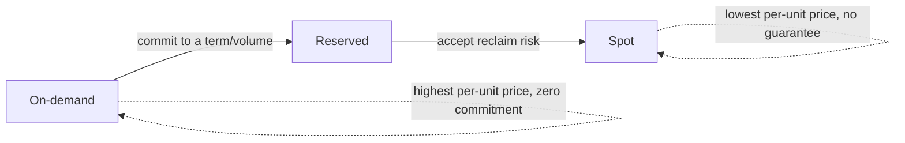

# Cloud Cost and Scaling Economics

> **Topic register:** T-1007 · IWI 5.9 · Staff tier
> **Provenance:** every number in this chapter's worked calculations is real arithmetic against clearly-labeled, illustrative unit prices — stated explicitly as illustrative rather than scraped from a live pricing API, since published cloud pricing changes over time and varies by region/commitment terms. The calculation *method* (not the specific dollar figures) is the transferable, durable skill this chapter teaches, the same framing this repository's system-design estimation chapter uses for capacity math.

## Table of Contents

1. [Learning Objectives](#learning-objectives)
2. [Why This Matters in Interviews](#why-this-matters-in-interviews)
3. [Mental Model](#mental-model)
4. [Definition and Purpose](#definition-and-purpose)
5. [Core Concepts](#core-concepts)
6. [Internal Implementation](#internal-implementation)
7. [Diagrams](#diagrams)
8. [Production Scenarios](#production-scenarios)
9. [Trade-offs](#trade-offs)
10. [Decision Framework](#decision-framework)
11. [Common Mistakes](#common-mistakes)
12. [Anti-Patterns](#anti-patterns)
13. [Best Practices](#best-practices)
14. [Interview Answer Framework](#interview-answer-framework)
15. [Interview Questions](#interview-questions)
16. [Summary](#summary)
17. [Key Takeaways](#key-takeaways)
18. [Cheat Sheet](#cheat-sheet)
19. [Flashcards](#flashcards)
20. [Practice Exercises](#practice-exercises)
21. [Solutions](#solutions)
22. [Additional Reading](#additional-reading)
23. [Official References](#official-references)

---

## Learning Objectives

By the end of this chapter you can:

- Work through a real cost comparison across on-demand, reserved, and spot pricing models for a given workload shape.
- Compute the concrete dollar cost of over-provisioning, given a real (if illustrative) unit price and utilization gap.
- Explain when autoscaling saves money and when it doesn't, with the specific workload-shape condition that determines which.
- Speak about a cost trade-off in the same quantified, defensible terms this program's trade-off-narration chapter establishes generally.

## Why This Matters in Interviews

Staff-level system design conversations increasingly include a cost dimension, and candidates who can only reason about cost qualitatively ("reserved instances are cheaper") lose credibility against those who can produce an actual comparative number on the spot. This topic exists to build that muscle: not memorizing current AWS prices, but being fluent in the calculation method well enough to reason through any pricing model an interviewer supplies.

## Mental Model

**Every cloud cost decision is a bet on how predictable your future usage is, and the pricing models are priced accordingly.** On-demand costs the most per unit but requires zero commitment. Reserved capacity costs less per unit in exchange for committing to pay for it whether you use it or not. Spot costs the least but can be reclaimed by the provider with little notice. The right choice isn't "whichever is cheapest per unit" — it's whichever matches how confidently you can predict the workload it's paying for.

## Definition and Purpose

**On-demand pricing** charges per unit of usage (per instance-hour, for example) with no commitment — maximum flexibility, highest per-unit price. **Reserved/committed-use pricing** charges a lower per-unit rate in exchange for committing to a usage volume (or a specific instance type) over a term (often 1 or 3 years) — the discount is the provider's reward for the demand predictability the commitment gives them. **Spot/preemptible pricing** offers spare provider capacity at a steep discount, with the trade-off that the provider can reclaim it (terminate the instance) with little or no notice when it needs the capacity back for a paying on-demand/reserved customer.

Cloud cost and scaling economics as a topic exists because the "right" pricing model and the "right" scaling strategy are workload-shape-dependent decisions, not universal defaults — the same instance-hour costs different amounts depending on the commitment model, and autoscaling only saves money when a workload's actual demand genuinely varies enough to make scaling down meaningful.

## Core Concepts

### The commitment spectrum trades flexibility for discount

On-demand (no commitment, highest price) → reserved (term commitment, meaningful discount) → spot (no guarantee, steepest discount) — each step trades away some guarantee in exchange for a lower price, and the right point on that spectrum depends on how tolerant the specific workload is of the guarantee being weaker.

### Over-provisioning has a real, computable dollar cost

Sizing infrastructure for peak load and running that size continuously, when actual utilization is far lower most of the time, has a precise cost: the gap between provisioned capacity and actual usage, multiplied by the unit price, integrated over time.

### Autoscaling only saves money when demand genuinely varies

If a workload's demand is flat (steady, predictable, 24/7 near-constant), autoscaling adds operational complexity without saving meaningful cost — the fleet would be sized near-identically whether autoscaled or statically provisioned. Autoscaling's savings come specifically from the *gap* between peak and trough demand.

### Reserved capacity is a bet that must be revisited as usage patterns change

A reservation sized for a workload's usage at commitment time becomes a sunk cost if that workload's actual usage later shrinks — the discount only pays off if the commitment is actually used; an oversized or outdated reservation can end up costing more than on-demand would have, for the unused portion.

## Internal Implementation

**Worked calculation 1 — on-demand vs. reserved for a steady, 24/7 workload**, illustrative unit prices for a mid-size compute instance:

```
Assumptions (illustrative, verify against current published rates for a real decision):
  On-demand:  $0.10 / instance-hour
  1-year reserved (all-upfront-equivalent, amortized): $0.06 / instance-hour  (40% discount)
  Fleet size: 20 instances, running 24/7/365

On-demand annual cost:  20 instances x $0.10/hr x 24hr x 365 days = $17,520/year
Reserved annual cost:   20 instances x $0.06/hr x 24hr x 365 days = $10,512/year
Annual savings from reserving a STEADY, predictable 20-instance baseline: $7,008/year (40%)
```

For a workload confirmed to run this steady baseline continuously (verified from historical utilization data, not assumed), reserving is a straightforward, quantified win — the 40% discount applies to demand that would have been paid for at the on-demand rate regardless.

**Worked calculation 2 — the cost of over-provisioning for peak, running that size continuously:**

```
Assumptions (illustrative):
  Peak demand: 20 instances (observed only ~4 hours/day, e.g. business-hours traffic)
  Trough demand: 6 instances (the other 20 hours/day)
  On-demand: $0.10/instance-hour

Statically provisioned for peak, running 20 instances 24/7:
  20 x $0.10 x 24 x 365 = $17,520/year

Correctly autoscaled to match actual demand (20 instances x 4hr + 6 instances x 20hr, daily):
  Daily cost = (20 x 4 x $0.10) + (6 x 20 x $0.10) = $8.00 + $12.00 = $20.00/day
  Annual cost = $20.00 x 365 = $7,300/year

Annual waste from static peak-provisioning instead of autoscaling to actual demand: $17,520 - $7,300 = $10,220/year (58% of the static cost)
```

This is the precise, quantified version of "autoscaling saves money when demand varies" — the savings figure comes directly from the peak/trough gap, not from autoscaling being inherently cheaper.

**Worked calculation 3 — reserving for the wrong baseline:**

```
If the same team reserves 20 instances (matching PEAK, not the steady baseline) at the $0.06/hr reserved rate,
committing to pay for 20 instances 24/7 regardless of actual usage:
  20 x $0.06 x 24 x 365 = $10,512/year (committed, regardless of actual usage)

Compared to the correctly-autoscaled on-demand cost of $7,300/year (Calculation 2):
Reserving the PEAK count costs MORE than correctly autoscaling on-demand, by $3,212/year --
because the reservation was sized for the wrong number (peak) rather than the actual steady-state
baseline (the 6-instance trough) that calculation 1's reservation logic actually applies to.
```

This is the concrete arithmetic behind a specific, common mistake: reserving capacity sized for peak, rather than reserving only the genuinely steady baseline and letting the variable portion scale on-demand.

## Diagrams



## Production Scenarios

### Scenario: a well-intentioned reservation purchase increases total spend instead of reducing it

**Symptoms.** A team, aiming to reduce cloud costs, purchases a 1-year reserved capacity commitment sized to match their fleet's peak instance count. Six months later, a finance review shows total compute spend is higher than the same period the previous year, before the reservation.

**Impact.** A cost-reduction initiative measurably increases spend instead, undermining confidence in future cost-optimization proposals from the same team.

**Initial hypotheses.** The reserved rate itself was mis-negotiated or priced incorrectly (checked — the per-unit reserved rate is correctly lower than on-demand, exactly as quoted); overall traffic/usage grew significantly in the period (checked — usage patterns are essentially unchanged from the prior year); the reservation was sized for peak demand rather than the workload's actual steady baseline, and the trough-hours capacity is now being paid for at the committed rate whether it's used or not (correct).

**Evidence.** Utilization data shows the fleet's actual demand follows the same peak/trough pattern as this chapter's Calculation 2 — a business-hours peak and a much lower overnight/weekend trough — but the reservation commits to paying for peak-level capacity around the clock, while the workload only genuinely needs that level roughly 4 of every 24 hours.

**Diagnosis.** Exactly this chapter's Calculation 3: reserving the peak count, rather than reserving only the confirmed steady baseline and autoscaling the variable portion on-demand, produces a real, computable spend increase versus the correctly-scoped alternative — the reservation discount doesn't matter if it's applied to capacity that goes unused most of the day.

**Immediate mitigation.** None available mid-term without a financial penalty for early termination — reserved commitments are typically binding for their full term.

**Permanent remediation.** At the reservation's renewal point, right-size the committed volume to the workload's actual confirmed steady baseline (verified from a full year of utilization data, not an assumption), and let the variable, peak-hours portion scale on autoscaled on-demand or spot capacity instead.

**Alternatives considered.** Purchasing a smaller reservation immediately and eating the early-termination cost on the oversized one — evaluated case by case depending on the specific penalty terms, but not a universal answer; often the mathematically correct move is simply waiting out the term while ensuring the NEXT reservation decision uses actual baseline data.

**Trade-offs.** Correctly right-sizing a future reservation to the steady baseline (rather than peak) means accepting on-demand or spot pricing (higher per-unit cost) for the variable portion — accepted, since the total blended cost is lower than over-committing the reservation to cover a peak that doesn't hold most of the day.

**Prevention.** Any reservation-sizing decision should be based on a confirmed, historically-observed steady baseline (the trough, or a genuinely flat portion of demand), never on peak demand, unless the workload is verified to be genuinely flat around the clock.

**Interview lesson.** This is the production-scale version of this chapter's own Calculation 3: a well-intentioned cost optimization that increases spend because it reserved the wrong number, discoverable with the same arithmetic this chapter walks through directly.

## Trade-offs

| Choice | Benefit | Cost |
|---|---|---|
| On-demand | Maximum flexibility, no commitment | Highest per-unit price |
| Reserved (sized to genuine steady baseline) | Meaningful discount on predictable, confirmed usage | Sunk cost if usage patterns shift after commitment |
| Reserved (sized to peak, incorrectly) | None — this is a cost mistake, not a valid trade-off | Pays the committed rate for capacity unused most of the time, as this chapter's Calculation 3 shows directly |
| Spot | Steepest discount | Capacity can be reclaimed with little notice — unsuitable for anything that can't tolerate sudden termination |
| Autoscaling to actual demand | Cost tracks real usage, no waste on unused peak capacity | Operational complexity; only saves money if demand genuinely varies |

## Decision Framework

1. **Is the workload's demand genuinely flat/steady, or does it vary meaningfully between peak and trough?** Flat → reserve near the steady level; variable → provision the steady baseline as reserved, let the variable portion scale on-demand/spot.
2. **How confidently can future usage be predicted for the reservation's term?** Low confidence → shorter commitment terms or on-demand, accepting the higher per-unit cost for the flexibility.
3. **Can this specific workload tolerate sudden capacity reclamation with little notice?** If yes, spot is a legitimate option for cost reduction; if no (e.g., a stateful, hard-to-restart process), spot is unsuitable regardless of the discount.
4. **When was the current reservation sizing last validated against actual, current usage data?** If usage patterns have shifted since the commitment was made, the reservation should be revisited at the next renewal point — never assumed to still be correctly sized indefinitely.

## Common Mistakes

- Sizing a reservation to peak demand instead of the genuinely steady baseline.
- Assuming autoscaling always saves money, regardless of whether the workload's demand actually varies.
- Choosing spot capacity for a workload that can't tolerate sudden reclamation, purely because of the per-unit discount.
- Treating a reservation as a "set once" decision rather than something to revisit as usage patterns evolve.

## Anti-Patterns

- **Reserving capacity sized to peak demand** "to be safe," without confirming the steady baseline the reservation should actually target.
- **Applying autoscaling to a genuinely flat, 24/7-steady workload** and expecting meaningful cost savings that the demand shape doesn't actually support.
- **Choosing spot pricing purely by discount percentage** without verifying the workload can tolerate the reclamation risk.

## Best Practices

- Size any reservation to a confirmed, historically-observed steady baseline, never to peak demand.
- Run the actual arithmetic (unit price × quantity × time, for each pricing model under consideration) before defending a cost decision, rather than reasoning qualitatively ("reserved is usually cheaper").
- Revisit reservation sizing at each renewal point against current, not historical-at-commitment-time, usage data.
- Reserve spot capacity for workloads specifically verified to tolerate sudden reclamation (stateless, easily-restartable, checkpoint-able work).

## Interview Answer Framework

### 30-Second Answer

Cloud pricing models trade flexibility for discount: on-demand (no commitment, highest price), reserved (term commitment, meaningful discount), spot (reclaimable, steepest discount). The right choice depends on demand predictability, not just per-unit price — reserving for peak instead of the genuine steady baseline can actually increase total spend, a real, computable mistake this chapter's worked arithmetic demonstrates directly.

### 2-Minute Answer

Definition: cloud pricing models sit on a spectrum trading commitment/flexibility for per-unit discount. Why it exists: providers reward demand predictability (reservations) and offer spare capacity cheaply with a reclamation risk (spot). How it works: reserving the genuinely steady baseline captures a real discount on demand that was going to be paid for anyway; reserving peak demand instead means paying the committed rate for capacity that sits unused most of the day. One important trade-off: autoscaling only saves money when demand genuinely varies — for flat, steady workloads it adds complexity without meaningful savings. Production example: a real worked calculation showing that reserving 20 instances at peak (annual cost $10,512) costs more than correctly autoscaling the same peak/trough demand shape on-demand (annual cost $7,300) — a $3,212/year real cost of reserving the wrong number.

### 10-Minute Deep Dive

Cover, in order: the mental model — every pricing decision is a bet on demand predictability (mental model); the three worked calculations — steady-baseline reservation savings, over-provisioning waste, and reserving-the-wrong-number cost (internals, real evidence); the decision framework for choosing a pricing model per workload shape (decision framework); and close with the production scenario — a reservation purchase that increased total spend because it targeted peak instead of the steady baseline, exactly matching Calculation 3's arithmetic.

### Whiteboard Explanation

Draw the [§ Diagrams](#diagrams) spectrum: on-demand → reserved → spot, with per-unit price decreasing left to right and commitment/reclamation-risk increasing left to right. Below it, sketch a demand curve with a clear peak and trough, and shade the "reserve this much" region as only the trough-and-below steady baseline, with the peak-hours gap left for on-demand/autoscaled capacity.

### Production Example

The over-committed reservation in [§ Production Scenarios](#production-scenarios): a reservation sized to peak demand increased total spend versus the prior on-demand baseline, discovered via a finance review and diagnosed with the same arithmetic this chapter's Calculation 3 walks through directly.

### Trade-offs to Mention

State unprompted: a reservation's discount only pays off if the committed capacity is actually used; autoscaling's savings come specifically from the peak/trough gap, not from autoscaling being inherently cheaper; spot's discount comes with a real reclamation risk that makes it unsuitable for some workloads regardless of price.

### Common Candidate Mistakes

Reasoning about cost purely qualitatively ("reserved is cheaper") without being able to produce an actual number; assuming autoscaling always saves money; not distinguishing peak from steady-baseline when sizing a reservation.

### Typical Follow-Up Questions

1. "Walk me through the actual math for whether we should reserve or stay on-demand for this workload."
2. "When would autoscaling NOT save money?"

### Senior-Level Expectations

Produces a real, if simplified, cost comparison with actual arithmetic rather than qualitative reasoning alone.

### Staff-Level Discussion

The genuinely Staff-level move on cost economics isn't knowing current prices — it's applying the calculation method correctly to whatever numbers are actually given, and specifically catching the peak-vs-baseline sizing mistake before it's made rather than discovering it in a finance review months later. A Staff engineer treats a cost-optimization proposal (a reservation purchase, an autoscaling policy change) with the same rigor as a technical architecture decision: state the assumption (what demand shape is this sized for), show the arithmetic, and identify what would have to be true for the assumption to hold — exactly the four-beat trade-off structure (Context, Options, Decision criterion, What it cost) this program's own interview-craft material establishes generally, applied here to a dollar-denominated decision.

## Interview Questions

### Question 1 — Walk me through the actual math for whether we should reserve or stay on-demand for this workload.

**Why interviewers ask it.** Tests whether the candidate can produce real arithmetic on the spot, not just qualitative reasoning.

**Expected answer.** Establishes the workload's demand shape (steady vs. variable) first, then computes on-demand cost (unit price × quantity × time) versus reserved cost (discounted rate × committed quantity × time) for the confirmed steady portion specifically — not the peak.

**Minimum acceptable answer.** Attempts a real calculation, even if it conflates peak and baseline.

**Strong Senior answer.** Produces a real, if simplified, cost comparison with actual arithmetic.

**Staff-level extension.** Explicitly separates the steady baseline (correct reservation target) from peak (should scale on-demand/spot instead), and states the specific risk of reserving the wrong number.

**Common mistakes.** Reasoning qualitatively ("reserved is usually cheaper") without ever producing an actual number.

**Likely follow-ups.** "What if the workload's demand isn't flat — how does that change your answer?"

**Evaluation criteria (1–5).** 1: no real arithmetic offered. 3: produces a real calculation. 5: correct calculation plus the peak-vs-baseline sizing distinction stated explicitly.

**Related references.** [§ Internal Implementation](#internal-implementation).

---

### Question 2 — When would autoscaling NOT save money?

**Why interviewers ask it.** Tests whether the candidate understands autoscaling's savings mechanism precisely, rather than treating it as inherently cost-reducing.

**Expected answer.** When demand is genuinely flat/steady — autoscaling adds operational complexity without a meaningful cost benefit, since the fleet would be sized near-identically with or without it; the savings specifically come from the peak/trough demand gap, and a workload without that gap has nothing for autoscaling to capture.

**Minimum acceptable answer.** States that autoscaling doesn't always help, even without the precise mechanism.

**Strong Senior answer.** Correctly identifies flat/steady demand as the condition where autoscaling doesn't meaningfully save money.

**Staff-level extension.** Connects this to the broader principle that autoscaling and reservation strategy are two sides of the same demand-shape question, and a genuinely flat workload should be reserved near its steady level rather than autoscaled at all.

**Common mistakes.** Treating autoscaling as a universal cost-optimization technique regardless of demand shape.

**Likely follow-ups.** "How would you decide the threshold for whether a workload's demand varies 'enough' to benefit?"

**Evaluation criteria (1–5).** 1: claims autoscaling always saves money. 3: correctly identifies the flat-demand exception. 5: correct identification plus connects it to reservation strategy for flat workloads.

**Related references.** [§ Core Concepts](#core-concepts); [§ Internal Implementation](#internal-implementation).

## Summary

Cloud pricing models trade flexibility for discount along a spectrum: on-demand, reserved, spot. A reservation's discount only pays off on capacity that's actually used, which is why sizing it to a confirmed steady baseline (not peak demand) matters — this chapter's worked arithmetic shows reserving the peak count for a real peak/trough demand shape costs more than correctly autoscaling on-demand ($10,512/year vs. $7,300/year, a $3,212/year real cost of reserving the wrong number). Autoscaling's savings come specifically from the gap between peak and trough demand, not from autoscaling being inherently cheaper.

## Key Takeaways

- The commitment spectrum (on-demand → reserved → spot) trades flexibility for discount.
- A reservation's discount only pays off if the committed capacity is actually used — size it to the steady baseline, never to peak.
- Autoscaling saves money specifically because of the peak/trough demand gap — it doesn't help a genuinely flat workload.
- Reserving peak demand instead of the steady baseline can measurably increase total spend, not reduce it.

## Cheat Sheet

| Demand shape | Right approach |
|---|---|
| Genuinely flat, 24/7 steady | Reserve near the steady level; autoscaling adds complexity with little savings |
| Clear peak/trough pattern | Reserve the confirmed steady baseline; autoscale the variable portion on-demand |
| Can tolerate sudden reclamation | Spot capacity for the reclaimable-tolerant portion |
| Uncertain/rapidly-changing usage | On-demand, accepting the higher per-unit price for flexibility |

## Flashcards

### Card: What the commitment spectrum trades

**Prompt:**
What does the on-demand → reserved → spot spectrum trade for a lower price?

**Answer:**
Flexibility/guarantee — reserved requires a term commitment, spot accepts sudden reclamation risk.

**Why it matters:**
The right choice depends on demand predictability, not just per-unit price.

**Common trap:**
Choosing purely by discount percentage without considering the workload's tolerance for the trade-off.

**Related:**
[Definition and Purpose](#definition-and-purpose)

### Card: What a reservation should be sized to

**Prompt:**
What should a capacity reservation be sized to — peak or steady baseline?

**Answer:**
The confirmed steady baseline, never peak — reserving peak means paying the committed rate for capacity unused most of the day, which can cost more than correctly autoscaling.

**Why it matters:**
A real, computable cost mistake this chapter's arithmetic demonstrates directly.

**Common trap:**
Sizing a reservation to peak demand "to be safe."

**Related:**
[Internal Implementation](#internal-implementation)

### Card: When autoscaling doesn't save money

**Prompt:**
When does autoscaling NOT save meaningful money?

**Answer:**
When demand is genuinely flat/steady — the savings come specifically from the peak/trough demand gap, which a flat workload doesn't have.

**Why it matters:**
Prevents applying autoscaling as a default assumed-cost-win regardless of demand shape.

**Common trap:**
Treating autoscaling as inherently cost-reducing.

**Related:**
[Core Concepts](#core-concepts)

## Practice Exercises

1. Reproduce Calculation 2 (the over-provisioning cost) with your own assumed peak/trough split and unit price, and verify the arithmetic.
2. Given a workload with a peak of 50 instances for 6 hours/day and a trough of 15 instances for the other 18 hours, compute the annual cost of static peak-provisioning versus correctly autoscaling, at an illustrative $0.08/instance-hour.
3. A team proposes reserving 100% of their fleet's peak capacity for 3 years to "lock in savings." Using this chapter's framework, identify the specific question you'd ask before agreeing, and explain what answer would change your recommendation.

## Solutions

**Exercise 1.** The general form: `static cost = peak_count × unit_price × 24 × 365`; `autoscaled cost = (peak_count × peak_hours + trough_count × trough_hours) × unit_price × 365`; the waste is the difference between the two, and should always be positive whenever peak_count > trough_count and peak_hours < 24.

**Exercise 2.** Static: `50 × $0.08 × 24 × 365 = $35,040/year`. Autoscaled: `(50 × 6 + 15 × 18) × $0.08 × 365 = (300 + 270) × $0.08 × 365 = $16,644/year`. Waste from static peak-provisioning: `$35,040 − $16,644 = $18,396/year` (roughly 53% of the static cost) — directionally consistent with Calculation 2's finding that a meaningful peak/trough gap produces substantial avoidable waste under static peak-provisioning.

**Exercise 3.** The key question: "what is the workload's confirmed steady baseline, as distinct from its peak, based on actual historical utilization data?" If the answer reveals a genuine peak/trough gap (not a flat, 24/7-steady workload), the recommendation should be to reserve only the confirmed steady baseline and let the variable portion scale on-demand/spot — reserving 100% of peak for 3 years would very likely repeat this chapter's Calculation 3 mistake at a larger scale and a longer, harder-to-exit commitment term.

## Additional Reading

- Werner Vogels, "Cost is a first-class architectural consideration" (AWS re:Invent talks and Amazon's own operational excellence framing on cost-aware architecture)

## Official References

- [AWS EC2 Pricing](https://aws.amazon.com/ec2/pricing/) — for current, real published rates; verify before any real financial decision, since this chapter's figures are illustrative
