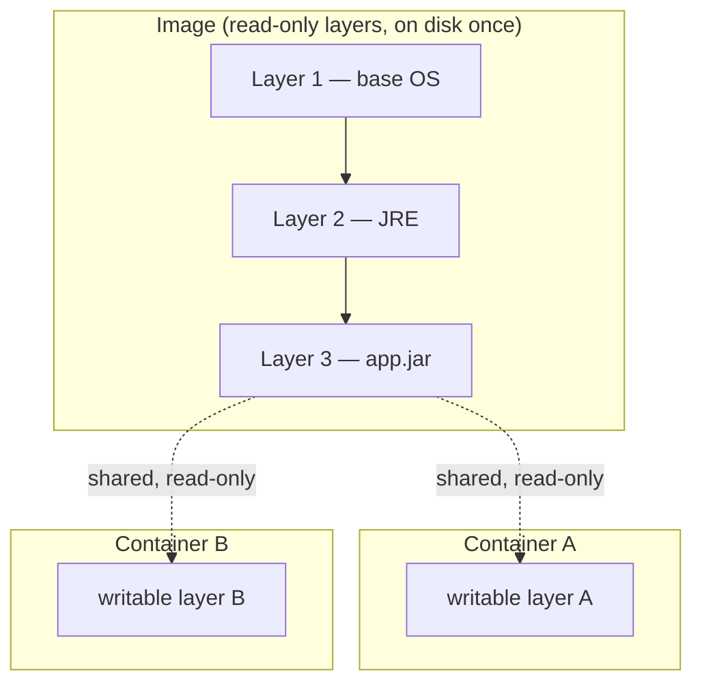
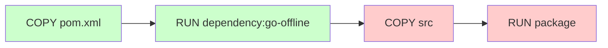

# Containers & Image Internals

> **Topic register:** T-1001 · IWI 5.7 · Core tier · Moderate interview frequency — a supporting axis in cloud/deployment discussion rounds, and the mechanism every Kubernetes and CI/CD conversation quietly assumes.
> **Provenance:** every trace in this chapter is real, executed output from Docker 29.6.2 (Docker Desktop, `overlayfs` storage driver), building a real Maven project through four real Dockerfiles. Source and full output at [`practice/java/cloud/container-image-internals/`](../../practice/java/cloud/container-image-internals/README.md).
> **Scope note:** this chapter covers what an image *is* and how a container's isolation is actually implemented — layers, the build cache, and namespaces/cgroups. It deliberately does not re-cover container *resource limits* from the JVM's perspective (heap sizing against a cgroup memory limit, `OutOfMemoryError` vs. OOMKill) — that is [`kubernetes-resource-limits-probes-and-jvm-sizing.md`](kubernetes-resource-limits-probes-and-jvm-sizing.md)'s job, and it is not duplicated here.

## Table of Contents

1. [Learning Objectives](#learning-objectives)
2. [Why This Matters in Interviews](#why-this-matters-in-interviews)
3. [Mental Model](#mental-model)
4. [Definition and Purpose](#definition-and-purpose)
5. [Core Concepts](#core-concepts)
6. [Internal Implementation](#internal-implementation)
7. [Diagrams](#diagrams)
8. [Production Scenarios](#production-scenarios)
9. [Trade-offs](#trade-offs)
10. [Decision Framework](#decision-framework)
11. [Common Mistakes](#common-mistakes)
12. [Anti-Patterns](#anti-patterns)
13. [Best Practices](#best-practices)
14. [Interview Answer Framework](#interview-answer-framework)
15. [Interview Questions](#interview-questions)
16. [Summary](#summary)
17. [Key Takeaways](#key-takeaways)
18. [Cheat Sheet](#cheat-sheet)
19. [Flashcards](#flashcards)
20. [Practice Exercises](#practice-exercises)
21. [Solutions](#solutions)
22. [Additional Reading](#additional-reading)
23. [Official References](#official-references)

---

## Learning Objectives

By the end of this chapter you can:

- Explain, with measured sizes, why a naive single-stage container build ships 3× more than it needs to, and how a multi-stage build fixes that structurally rather than by manual cleanup.
- Order Dockerfile instructions so the build cache actually pays off, and prove it with real, timed rebuilds.
- Explain what a container image layer *is* (a content-addressed filesystem diff) and read a real `docker history` output as evidence, not folklore.
- Explain Linux namespaces and cgroups as the two real kernel mechanisms — isolation and resource limiting — that a container actually is, distinct from a virtual machine.
- Defend or challenge a distroless base image on its real, measured trade-off: smaller attack surface against the loss of shell-based debugging.

## Why This Matters in Interviews

Every backend candidate has run `docker build` and `docker run`. Very few can explain what a "layer" actually is beyond "a step in the Dockerfile," why their team's CI build takes eleven minutes when a teammate's takes ninety seconds on the identical Dockerfile, or what a container actually *is* at the kernel level once the marketing language ("lightweight VM") is stripped away. Interviewers use this topic as a filter for exactly that gap: a Senior candidate who can explain container images and isolation from first principles signals they've operated infrastructure, not just consumed it through `docker-compose up`. It surfaces most often as a supporting thread inside a broader deployment, CI/CD, or Kubernetes system-design conversation — "why is this image so large," "how would you speed up this pipeline," "is this container actually isolated from the host" — rather than as a standalone question.

## Mental Model

A container image is not a single file — it is a **stack of read-only, content-addressed filesystem layers** plus metadata (entrypoint, environment, exposed ports) describing how to run them. A running container adds exactly one more layer on top: a thin, writable layer unique to that container instance. Two containers started from the same image share every read-only layer on disk and only diverge in their own writable layer — this is copy-on-write, and it is why starting a tenth container from an image already pulled is nearly free.

A running container is not a lightweight virtual machine. There is no hypervisor, no separate kernel, and no virtualized hardware. A container is an ordinary Linux process (or process tree) that the kernel has placed inside a set of **namespaces** — so it cannot *see* most of what the host can see — and constrained with **cgroups** — so it cannot *consume* more than it has been allowed. The isolation is real, but it is implemented entirely with mechanisms the host kernel itself provides, not with a second operating system.

## Definition and Purpose

A **container image** is an [OCI-spec](https://github.com/opencontainers/image-spec) artifact: an ordered list of layers (each an immutable, content-addressed tarball diff, identified by a SHA-256 digest) plus a JSON config describing the command to run, environment variables, and how the layers stack. **Building** an image means executing a Dockerfile's instructions in order, where most instructions (`RUN`, `COPY`, `ADD`) each produce exactly one new layer, and the build engine caches each layer keyed by its instruction plus the content of its inputs.

A **container** is a running instance of an image: a process tree started with its own PID, network, mount, UTS (hostname), IPC, and (optionally) user namespaces, and a cgroup controlling how much CPU, memory, and I/O it may consume. The image supplies the initial filesystem (all its read-only layers, mounted via a union filesystem such as `overlayfs`); the container adds one writable layer on top and a live process inside a fresh set of namespaces.

This exists because deploying software has historically meant reconciling "it works on my machine" against a target environment with a different OS version, different installed libraries, and different filesystem layout. A container image packages the *entire* userspace filesystem the application needs, deterministically, so the only remaining variable between environments is the kernel itself (which containers share with the host, unlike a VM).

## Core Concepts

**Layers are content-addressed and immutable.** Each layer's identity is the cryptographic hash of its own contents. Two Dockerfiles that produce byte-identical output for a given instruction produce the identical layer — which is exactly what makes the build cache possible: Docker doesn't need to know *why* a layer would be the same, only that its content hash already exists locally.

**The build cache is keyed by instruction + input content, evaluated top to bottom.** For `COPY`/`ADD`, the input is the content of the copied files. For `RUN`, the input is the instruction's exact text plus the state of the layer immediately below it. The moment one instruction's cache misses, every instruction after it in that build stage also misses — regardless of whether their own inputs actually changed. This single rule is the entire reason instruction *order* in a Dockerfile is a real engineering decision, not a stylistic one: put what changes least often first.

**Multi-stage builds separate what you need to build from what you need to run.** A Dockerfile can declare more than one `FROM`, naming each a stage (`FROM maven:3.9-eclipse-temurin-21 AS build`). A later stage can `COPY --from=build <path>` to pull forward specific artifacts. Everything else in the build stage — the compiler, the build tool, intermediate files, the source tree itself — is simply never referenced by the final stage and is discarded when the build finishes. This is not an optimization applied after the fact; it structurally prevents build-only tooling from ever reaching the runtime image.

**Namespaces provide isolation, not virtualization.** Linux namespaces (PID, network, mount, UTS, IPC, user, cgroup) each wrap one category of kernel resource so a process sees only its own view of it. A container's process typically runs in a fresh PID namespace, so it sees itself as PID 1 and no other process on the host at all — while the host, outside any namespace, sees that same process under its real host PID.

**cgroups provide resource limits, not isolation.** Control groups (`cgroup.controllers`: `cpu`, `memory`, `io`, `pids`, and others) let the kernel cap how much of a resource a process group may consume. `docker run --memory=64m` writes `67108864` directly into that container's `memory.max` cgroup file — a real, kernel-enforced ceiling, not an application-level convention.

**The union/overlay filesystem is what makes "one image, many containers" cheap.** `overlayfs` (the default driver on modern Docker) presents several read-only lower directories (the image's layers) plus one writable upper directory (the container's own layer) as a single merged view. A write to an existing file triggers copy-up: the file is copied into the upper directory first, then modified there — the lower, shared layers are never touched.

## Internal Implementation

Building `Dockerfile.layered` (see the practice pack) proceeds, per instruction, as:

1. `FROM maven:3.9-eclipse-temurin-21 AS build` — resolve the base image's layers (pulled once, cached locally by digest).
2. `WORKDIR /build` — a metadata-only layer (no filesystem bytes beyond the directory entry).
3. `COPY app/pom.xml .` — hash the file's content; if a layer already exists in the local cache for this exact instruction *and* this exact file content *and* this exact parent layer, reuse it — no bytes are copied.
4. `RUN mvn -q -B dependency:go-offline` — execute inside a container based on the layer stack so far, snapshot the resulting filesystem diff as a new layer.
5. `COPY app/src ./src` — same content-hash cache check, independently of step 3's cache result.
6. `RUN mvn -q -B -o -DskipTests package` — compiles offline against the already-resolved dependencies from step 4's layer.
7. `FROM eclipse-temurin:21-jre-alpine` — a completely separate layer stack; nothing from the build stage is implicitly present.
8. `COPY --from=build /build/target/*.jar app.jar` — the *only* bridge between the two stages: one explicit file, copied by reference to the build stage's final filesystem state.

Measured directly (`cache-comparison-demo.sh`, from a pruned build cache): touching only `HelloContainer.java` and rebuilding this layered Dockerfile completes in **2.4 seconds**, because step 4 reports `CACHED` (its input, `pom.xml`, didn't change) and only steps 5–6 rerun. The same source-only change against `Dockerfile.multistage` — which does steps 3+5 (`COPY pom.xml`, `COPY src`) before a single combined dependency-resolution-and-compile `RUN` — takes **21.5 seconds**, because that one `RUN` layer's cache key includes the now-different `src` content, so Maven re-resolves every dependency from scratch even though `pom.xml` never changed.

At the OS level, `docker run` translates roughly to: allocate a new PID namespace (and network, mount, UTS, IPC namespaces), `pivot_root`/mount the image's overlayed filesystem as that namespace's root, create a cgroup and write the configured limits into it, then `exec` the image's configured entrypoint as PID 1 inside that namespace. No new kernel boots; no hardware is emulated. This chapter's own measurements confirm the pieces directly: a container's `ps aux` shows only its own single process at PID 1 while the host that instant has 537 processes running; `/sys/fs/cgroup/memory.max` inside a `--memory=64m` container reads exactly `67108864`.

## Diagrams

Two containers from the same image share every layer up to `L3` on disk; each gets its own private writable layer on top. A write in Container A's layer never appears in Container B's, and never mutates the shared image layers — this is exactly what §7 of the practice pack measures directly.

Green = cache hit on a source-only rebuild (input unchanged: `pom.xml`). Red = cache miss (input changed: `src`). Because cache invalidation only cascades *forward*, everything before the first miss is still reused — which is the entire reason dependency resolution is placed before source copy, not the reverse.

## Production Scenarios

**Symptom.** A CI pipeline's Docker build step regressed from 90 seconds to 9 minutes after a routine dependency bump, with no change to application logic.

**Initial hypotheses.** Slow CI runner; registry pull throttling; a genuinely larger dependency tree.

**Evidence.** `docker history` on the new image showed the dependency-resolution layer's size roughly unchanged, but `docker build` logs showed the dependency-resolution `RUN` step re-executing on *every* build, including ones that only changed application source — something that had not been true a week earlier.

**Diagnosis.** A recent Dockerfile refactor had merged the previously separate "copy `pom.xml`, resolve dependencies" and "copy source, compile" steps into a single `COPY . .` followed by one `RUN mvn package`, in the name of "simplifying" the Dockerfile. That collapsed the two independent cache keys this chapter's §6 demonstrates into one: any source change now invalidated dependency resolution too.

**Immediate mitigation.** Reverted the merge; restored the two-step `COPY pom.xml` → resolve → `COPY src` → compile shape.

**Permanent remediation.** Added a CI check asserting the Dockerfile copies dependency manifests before application source, and documented the reasoning (this exact chapter's §6 timing numbers, reproduced in the team's own environment) so the "simplification" would not recur without someone re-deriving the cost.

**Trade-offs.** The two-step form is a few lines longer and slightly less obvious to a first-time reader; the team judged the ~9x rebuild-time cost of the "simpler" version to be the wrong trade for a step that runs dozens of times per day.

**Prevention.** A short comment directly above the split, and a linked reference to this chapter, rather than relying on every future editor rediscovering the reason independently.

**Interview lesson.** "We flattened the Dockerfile and CI got slower" is a concrete, defensible story that demonstrates the candidate understands *why* layer order matters, not just that a style guide says to split `COPY` steps.

## Trade-offs

| Choice | Helps | Hurts |
|---|---|---|
| Single-stage build | Simpler Dockerfile, one `FROM` | Ships build tooling and source to production; measured 3.1× larger in this chapter |
| Multi-stage build | Small, minimal runtime image | A second stage to reason about; `COPY --from=` is one more thing to get wrong |
| Splitting dependency resolution into its own layer | Fast rebuilds on source-only changes (measured 2.4s vs. 21.5s here) | Slightly slower cold build (eager resolution vs. lazy); one more Dockerfile step |
| Alpine-based final image | Small (this chapter: 286MB) | musl libc instead of glibc — occasionally surfaces subtle native-library incompatibilities |
| Distroless final image | Smallest attack surface; no shell for an attacker to pivot with (measured here: `sh` genuinely absent) | No shell for *you* either — `docker exec` debugging requires an ephemeral debug container instead |

## Decision Framework

1. **Does the final image need anything the build produced beyond one or a few named artifacts?** No → use a multi-stage build; there is essentially no case where shipping build tooling to production is the right default.
2. **Does the build have a real dependency-resolution step (Maven, npm install, pip install) separate from compiling/bundling application code?** Yes → give it its own layer, ordered before application source is copied in.
3. **Does the runtime environment need a shell or package manager for legitimate operational reasons** (a sidecar that execs into it, a startup script that needs `sh`)? Yes → stick with a minimal but shell-having base (e.g., `-alpine` or `-slim`); No, and the security posture matters more than interactive debuggability → distroless.
4. **Is the team equipped to debug a shell-less container** (ephemeral debug containers, `kubectl debug`, sufficient logging/tracing to rarely need a shell at all)? No → distroless will create real operational pain the first time it's needed; defer it until that tooling exists.

## Common Mistakes

- Believing a container is "a lightweight VM" — it shares the host kernel; there is no virtualized hardware or second kernel boot involved.
- Collapsing dependency-resolution and source-compile into one `COPY . .` + one `RUN` for Dockerfile "simplicity," silently paying full dependency re-resolution on every source change (this chapter's Production Scenario).
- Assuming `docker build --no-cache` is the only way layers get invalidated, and not realizing that changing an *earlier* instruction's output invalidates every instruction after it even without that flag.
- Treating image size purely as a Dockerfile-authoring concern and never checking `docker history` to see which specific instruction is actually responsible for the bulk of an image.
- Assuming an Alpine or distroless base is a drop-in replacement without testing — musl-based Alpine images have caused real, subtle native-library breakage for some JVM/native-dependency combinations.

## Anti-Patterns

- **The "just `COPY . .`" Dockerfile.** Fast to write, guarantees the worst possible cache behavior: any file change in the entire build context invalidates every subsequent layer.
- **Multi-stage builds that still copy the whole build stage forward.** `COPY --from=build /build /app` defeats the entire purpose — it drags every intermediate build artifact into the runtime image, just from a different stage.
- **Debugging by adding a shell "just in case."** Installing `bash`/`curl`/`vim` into a production image "for convenience" reintroduces exactly the attack surface a minimal base image was chosen to avoid, for a benefit (occasional interactive debugging) that ephemeral debug containers or better logging can usually provide instead.

## Best Practices

- Order Dockerfile instructions from least-frequently-changing to most-frequently-changing: base image, OS packages, dependency manifests + resolution, then application source.
- Default to multi-stage builds for any compiled or bundled language; there is rarely a legitimate reason to ship a build toolchain to production.
- Check `docker history <image>` on any image you're responsible for at least once — most engineers never look, and most oversized images have one or two obviously fixable offending layers.
- Pin base images by digest (not just tag) for anything that needs reproducible builds; a mutable tag like `:latest` or even `:21-jre` can silently point at a different image tomorrow.
- Choose the runtime base image (full OS, `-slim`, `-alpine`, distroless) deliberately per service, based on the decision framework above — not as a single blanket team-wide policy applied without exceptions.

## Interview Answer Framework

### 30-Second Answer

A container image is a stack of immutable, content-addressed filesystem layers plus run metadata; a container is a normal Linux process placed in its own namespaces (for isolation) and constrained by a cgroup (for resource limits) — not a lightweight VM. Multi-stage builds and careful instruction ordering keep images small and builds fast by exploiting exactly how the layer cache works.

### 2-Minute Answer

Definition: an image is an OCI-spec artifact — an ordered list of layers plus JSON config — and a container is a running instance of one, given its own PID/network/mount/UTS/IPC namespaces and a cgroup. Why it exists: to package an application's entire userspace filesystem deterministically, so the only remaining variable between environments is the shared host kernel. How it works: each Dockerfile instruction produces one layer, cached by instruction plus input content; a cache miss cascades forward through every later instruction in that stage. One important trade-off: multi-stage builds trade one extra `FROM`/`COPY --from=` for discarding the entire build toolchain from the runtime image — measured in this chapter as a 3.1× size difference for the identical application. Production example: a CI pipeline that regressed from 90 seconds to 9 minutes after a Dockerfile "simplification" accidentally merged the dependency-resolution and source-compile layers, forcing full dependency re-resolution on every source-only change.

### 10-Minute Deep Dive

Cover: OCI image spec and content-addressed layers; the build cache's exact keying rule (instruction + input content + parent layer, evaluated top to bottom, one miss cascades); multi-stage builds as the structural (not manual) fix for build-tooling bloat, illustrated with the measured 893MB → 286MB result; namespaces as the isolation mechanism (PID namespace demonstrated directly: a container sees itself as PID 1 while the host has hundreds of other processes); cgroups as the resource-limiting mechanism (measured: `--memory=64m` becomes exactly `67108864` in `/sys/fs/cgroup/memory.max`); the union/overlay filesystem and copy-on-write (measured: two containers from the same image, one writes a file, the other never sees it); and the distroless trade-off (measured: `sh` genuinely does not exist in the image — `exec: "sh": executable file not found in $PATH`).

### Whiteboard Explanation

Draw two stacked boxes side by side, each showing three shared read-only layers at the bottom (label them "base OS," "JRE," "app.jar") and one small private box on top of each labeled "writable layer" — this is the union filesystem picture from [§ Diagrams](#diagrams). Then draw a single box labeled "host kernel" beneath both stacks, with arrows from each stack down into it, and annotate: "no separate kernel, no hypervisor — isolation comes from namespaces, limits come from cgroups, both provided by this one kernel." Finally annotate the build-cache flow diagram from §6, marking which steps are cache hits (green) vs. misses (red) after a source-only change, to make the ordering argument concrete.

### Production Example

Use the CI-regression scenario from [§ Production Scenarios](#production-scenarios): a Dockerfile "simplification" that merged dependency resolution and source compilation into one layer, silently turning every source-only commit into a full dependency re-resolution, regressing CI build time roughly 6×.

### Trade-offs to Mention

State unprompted: multi-stage builds have no real downside once understood — there is rarely a legitimate reason to ship build tooling to production; distroless images trade real operational cost (no shell for debugging) for a real security benefit (no shell for an attacker either), and that trade should be a deliberate, per-service decision, not a blanket default; splitting a dependency-resolution layer costs a slightly slower cold build in exchange for a much faster warm rebuild — the right call for anything built more than once.

### Common Candidate Mistakes

Describing a container as "a lightweight VM" without qualification; being unable to explain what a "layer" concretely is beyond "a Dockerfile line"; recommending Alpine or distroless as a universal default without acknowledging musl-libc compatibility risk or the loss of shell-based debugging respectively.

### Typical Follow-Up Questions

"Your image is 1.2GB — where do you even start looking?" (`docker history`, largest layer first). "Two containers from the same image — can one see the other's filesystem changes?" (no — copy-on-write, per-container writable layer). "What actually stops a container from seeing the host's other processes?" (PID namespace, not a security boundary by itself but the visibility mechanism). "Why would `--memory=64m` and an OOMKilled container still show plenty of free memory on the host?" (the cgroup limit is per-container, independent of host-wide memory pressure).

### Senior-Level Expectations

Explain the build cache's exact invalidation rule well enough to predict, from reading a Dockerfile, which instructions will be cache hits after a given kind of change — and use that to order a Dockerfile correctly the first time, not by trial and error.

### Staff-Level Discussion

At organizational scale, base-image policy (which distros, which tags, distroless or not) is a governance decision, not a per-service one: a shared base-image standard reduces the number of distinct CVE surfaces security has to track, but removes per-team autonomy to optimize for their own runtime needs. A Staff engineer should be able to argue for a small, centrally-maintained set of approved base images (with an explicit exception process) as the right trade between operational consistency and team velocity, and should be able to speak to the migration cost of changing that standard retroactively across dozens of services — including the real risk that a base-image change (e.g., moving to distroless) breaks any service that quietly relied on shell-based health checks, init scripts, or debugging tooling baked into the old base image.

## Interview Questions

### Question 1 — Why is this Docker image so much larger than it needs to be, and how would you fix it?

**Expected answer.** Run `docker history` to find which layer(s) actually contribute the bulk of the size; identify whether the image is single-stage (shipping build tooling) versus multi-stage; if single-stage, restructure into a multi-stage build so only the final artifact crosses into the runtime stage.

**Minimum acceptable answer.** "Use a smaller base image" without diagnosing which layer is actually the problem.

**Strong Senior answer.** Uses `docker history` as evidence before proposing a fix; explains multi-stage builds structurally (not "delete unnecessary files," which doesn't work — earlier layers' bytes persist regardless of later deletions).

**Staff-level extension.** Proposes a base-image standard across the team/org to prevent recurrence, and discusses the CVE-surface argument for keeping approved base images small and few.

**Common mistakes.** Recommending `RUN rm -rf ...` at the end of a single-stage Dockerfile to "clean up" — this does not shrink the image, because the deleted files' bytes still exist in the earlier layer; only removing them from the layer that created them (or not creating that layer in the runtime stage at all) helps.

**Likely follow-ups.** "Does deleting a file in a later `RUN` actually reduce the image size?" (No — union filesystem layers are additive; the file is marked deleted in a whiteout entry but the bytes remain in the earlier, still-present layer.)

**Evaluation criteria.** Evidence-first diagnosis (1–5); correct structural fix vs. cosmetic fix (1–5); awareness of the layer-immutability reason cleanup-after-the-fact doesn't work (1–5).

### Question 2 — Walk through what actually happens, at the OS level, when you run `docker run my-image`.

**Expected answer.** The image's layers are mounted (typically via `overlayfs`) as a merged read-only filesystem with one new writable layer on top; new namespaces (PID, network, mount, UTS, IPC) are created for the process; a cgroup is created and configured with any specified resource limits; the image's configured entrypoint is executed as PID 1 inside that namespace/cgroup combination.

**Minimum acceptable answer.** "It starts a lightweight VM from the image" — factually wrong and should be corrected, not accepted.

**Strong Senior answer.** Names the specific kernel mechanisms (namespaces for isolation, cgroups for limits) and explains they're provided by the *host* kernel — no second kernel is involved.

**Staff-level extension.** Discusses the security implication directly: because containers share the host kernel, a kernel-level vulnerability can be a cross-container (or container-to-host) escape in a way that's structurally impossible with true hardware virtualization — relevant to any conversation about multi-tenant container platforms.

**Common mistakes.** Confusing containers with virtual machines; being unable to name any specific namespace or cgroup controller.

**Likely follow-ups.** "If containers share the host kernel, what actually stops a container from seeing host processes?" (the PID namespace's visibility scoping — not a hard security boundary by itself, but the reason `ps aux` inside a container only shows its own processes).

**Evaluation criteria.** Correct mental model (VM vs. namespaced process) (1–5); specific mechanism naming (1–5); security implication awareness (1–5).

## Summary

A container image is a stack of immutable, content-addressed layers plus run metadata; building one means running Dockerfile instructions whose results are cached by instruction and input content, where a single cache miss invalidates every later instruction in that stage. Multi-stage builds exploit this structurally to discard build-only tooling from the runtime image — measured directly in this chapter as a 3.1× size reduction. A running container is not a lightweight VM: it is an ordinary host process placed into fresh Linux namespaces (for isolation) and a cgroup (for resource limits), sharing the host kernel throughout — both mechanisms measured directly via a container's own view of `ps aux` and `/sys/fs/cgroup/memory.max`.

## Key Takeaways

- An image layer is an immutable, content-addressed filesystem diff; the build cache is keyed by instruction plus input content, and one miss cascades forward through the rest of the stage.
- Multi-stage builds structurally discard build tooling from the runtime image — not a cleanup step, a different final filesystem entirely.
- Dependency resolution belongs in its own layer, ordered before application source, or every source change forces full re-resolution — measured here as 2.4s vs. 21.5s.
- A container is a host process in its own namespaces plus a cgroup, not a lightweight VM — no second kernel, no virtualized hardware.
- Distroless/minimal base images are a real, measurable security-vs-operability trade-off, not a strictly-better default.

## Cheat Sheet

- **Layer** = one filesystem diff, content-addressed, immutable, cached by (instruction, input content, parent layer).
- **Cache rule** = top-to-bottom; first miss invalidates everything after it in that build stage.
- **Multi-stage** = `FROM ... AS name`, then `COPY --from=name <path>` in a later stage; only named artifacts cross over.
- **Namespaces** = isolation (PID, net, mount, UTS, IPC, user) — what a process can *see*.
- **cgroups** = resource limits (cpu, memory, io, pids) — what a process can *consume*.
- **overlayfs** = shared read-only image layers + one writable layer per container; copy-on-write on first modification.
- **Distroless** = no shell, no package manager; smaller attack surface, no `docker exec ... sh`.
- **Diagnose bloat** = `docker history <image>`, largest layer first, before touching the Dockerfile.

## Flashcards

**Q:** Why does deleting a file in a later `RUN` instruction not shrink a single-stage image?
**A:** Union filesystem layers are additive and immutable; the file's bytes remain in the earlier layer that created it, and the delete is only a whiteout marker in the new layer.

**Q:** What are the two independent kernel mechanisms that together implement container isolation and limits?
**A:** Namespaces (isolation — what a process can see) and cgroups (limits — what a process can consume).

**Q:** Why does splitting dependency resolution into its own Dockerfile layer speed up rebuilds?
**A:** The build cache is keyed by instruction plus input content; if the dependency manifest (e.g., `pom.xml`) hasn't changed, that layer stays cached even when application source changes in a later, separately-cached layer.

## Practice Exercises

1. Using the practice pack's `Dockerfile.multistage`, deliberately merge the dependency-resolution and compile steps back into one `RUN`, rebuild after a source-only change, and confirm the rebuild time regresses to roughly what `Dockerfile.multistage` itself measures in this chapter.
2. Run `docker history` against any image you have locally and identify the single largest layer. Determine whether it's build tooling, OS packages, or application code.
3. Start two containers from the same base image, write a distinct file in each, and confirm neither sees the other's write — reproducing this chapter's overlay-filesystem measurement independently.

## Solutions

1. Reverting to a single combined `RUN` reproduces the non-split behavior measured in this chapter (~21.5s per source-only rebuild) instead of the split version's ~2.4s, because the compile step's cache key now includes the unchanged dependency-resolution work, forcing it to rerun alongside the actual source change.
2. Answers vary by image; the diagnostic method (largest layer via `docker history`, then classify its `CREATED BY` command) is the graded part, not a specific number.
3. `docker run --rm <image> sh -c 'echo x > /tmp/f'` in one container, then `docker run --rm <image> sh -c 'test -f /tmp/f && echo FOUND || echo missing'` in a second, fresh container — `missing` confirms per-container writable layers.

## Additional Reading

- [`practice/java/cloud/container-image-internals/README.md`](../../practice/java/cloud/container-image-internals/README.md) — full real output this chapter draws from.
- [`kubernetes-resource-limits-probes-and-jvm-sizing.md`](kubernetes-resource-limits-probes-and-jvm-sizing.md) — the JVM-specific consequence of the same cgroup mechanism.
- [`kubernetes-objects-scheduling-and-networking.md`](kubernetes-objects-scheduling-and-networking.md) — how these images are actually scheduled and run at scale.
- [`../security/supply-chain-security-sbom-and-dependency-risk.md`](../security/supply-chain-security-sbom-and-dependency-risk.md) — the security-scanning angle for image dependencies this chapter doesn't cover.

## Official References

- [Docker Build Cache](https://docs.docker.com/build/cache/)
- [Docker Multi-Stage Builds](https://docs.docker.com/build/building/multi-stage/)
- [OCI Image Format Specification](https://github.com/opencontainers/image-spec)
- [Distroless Images (GoogleContainerTools)](https://github.com/GoogleContainerTools/distroless)
- [`namespaces(7)` — Linux manual page](https://man7.org/linux/man-pages/man7/namespaces.7.html)
- [`cgroups(7)` — Linux manual page](https://man7.org/linux/man-pages/man7/cgroups.7.html)
