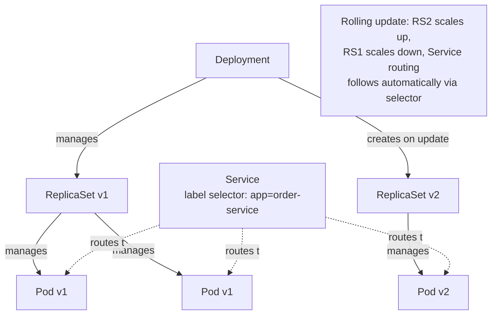

# Kubernetes Objects, Scheduling, and Networking

> **Topic register:** T-1002 · IWI 6.5 · Advanced tier, Moderate-High interview frequency
> **Provenance:** the manifests in this chapter are real, syntactically-valid Kubernetes YAML at [`practice/k8s/week-15/deployment-with-probes-and-limits.yaml`](../../practice/k8s/week-15/deployment-with-probes-and-limits.yaml), validated via `ruby -ryaml` parsing (3 documents parse successfully with correct `kind`/`metadata.name` structure). This chapter's manifests are syntax-validated, not applied against a live Kubernetes API server — stated explicitly, the same scoping discipline this repository applies to Testcontainers (`study-packs/week-11/02-integration-testing-against-real-dependencies.md` §4) and this week's own JVM-container chapter.

## Table of Contents

1. [Learning Objectives](#learning-objectives)
2. [Why This Matters in Interviews](#why-this-matters-in-interviews)
3. [Mental Model](#mental-model)
4. [Definition and Purpose](#definition-and-purpose)
5. [Core Concepts](#core-concepts)
6. [Internal Implementation](#internal-implementation)
7. [Diagrams](#diagrams)
8. [Production Scenarios](#production-scenarios)
9. [Trade-offs](#trade-offs)
10. [Decision Framework](#decision-framework)
11. [Common Mistakes](#common-mistakes)
12. [Anti-Patterns](#anti-patterns)
13. [Best Practices](#best-practices)
14. [Interview Answer Framework](#interview-answer-framework)
15. [Interview Questions](#interview-questions)
16. [Summary](#summary)
17. [Key Takeaways](#key-takeaways)
18. [Cheat Sheet](#cheat-sheet)
19. [Flashcards](#flashcards)
20. [Practice Exercises](#practice-exercises)
21. [Solutions](#solutions)
22. [Additional Reading](#additional-reading)
23. [Official References](#official-references)

---

## Learning Objectives

By the end of this chapter you can:

- Explain the relationship between a Deployment, a ReplicaSet, and the Pods it manages, and what each layer is actually responsible for.
- Explain how a Service routes traffic to a dynamic set of Pods without knowing their individual IPs.
- Explain what `RollingUpdate`'s `maxSurge`/`maxUnavailable` actually control, with the specific failure mode each guards against.
- Read a real Deployment/Service/HorizontalPodAutoscaler manifest and explain every field's operational purpose, not just its syntax.

## Why This Matters in Interviews

Kubernetes questions test whether a candidate has actually operated a service on the platform or only knows the YAML syntax. The Deployment/ReplicaSet/Pod layering specifically trips up candidates who can write a manifest but can't explain why the layering exists — and that gap is exactly what interviewers probe when they ask "what actually happens when you update a Deployment's image."

## Mental Model

**Every Kubernetes object in this chapter exists to answer one question: given that Pods are disposable and can die at any time, how does the system keep the *right number* of the *right version* running, reachable, at all times, without a human intervening?** A Deployment answers "how many, and which version." A ReplicaSet is the Deployment's mechanism for enforcing "how many" at any single point in time. A Service answers "how do other things find and reach them, given their IPs change constantly." Scheduling answers "which node does each Pod actually run on, and why."

## Definition and Purpose

A **Pod** is the smallest deployable unit — one or more containers that share network and storage. A **ReplicaSet** ensures a specified number of Pod replicas matching a label selector are running at all times, replacing any that die. A **Deployment** manages ReplicaSets on the user's behalf, specifically to support rolling updates: changing a Deployment's Pod template creates a new ReplicaSet and gradually shifts replicas from the old one to the new one, rather than requiring the user to manage that transition by hand.

A **Service** provides a stable virtual IP and DNS name that load-balances traffic across whichever Pods currently match its label selector — solving the problem that individual Pod IPs are ephemeral and change on every restart/reschedule. The **scheduler** decides which node each Pod runs on, based on resource requests, affinity/anti-affinity rules, taints/tolerations, and other constraints, so that a Pod's declared resource *requests* (not limits) are what the scheduler actually reasons about when deciding if a node has room.

## Core Concepts

### The Deployment → ReplicaSet → Pod layering exists for rolling updates

A Deployment doesn't manage Pods directly — it manages ReplicaSets, and each ReplicaSet manages Pods. Updating a Deployment's Pod template creates a *new* ReplicaSet; the Deployment controller then gradually scales the new ReplicaSet up and the old one down, which is what makes a rolling update possible without an outage.

### `maxSurge` and `maxUnavailable` control the update's speed-vs-safety trade-off

`maxSurge` (how many extra Pods beyond the desired replica count can exist temporarily during a rollout) and `maxUnavailable` (how many Pods can be below the desired count temporarily) together determine how aggressively a rolling update proceeds. `maxUnavailable: 0` guarantees full capacity is always available (never fewer Pods than desired), at the cost of needing `maxSurge` headroom (extra Pods, extra resource consumption) during the rollout.

### A Service decouples "who's reachable" from "which specific Pods exist right now"

A Service's label selector determines its membership dynamically — Pods are added or removed from a Service's routing pool automatically as they're created, destroyed, or (per the previous chapter) marked not-ready by a failing readiness probe, with no manual reconfiguration needed.

### The scheduler reasons about `requests`, not `limits`

A Pod's `resources.requests` is what the scheduler uses to decide whether a node has enough capacity to place it; `resources.limits` is enforced by the kubelet/container runtime at runtime (throttling CPU, or, for memory, triggering an OOMKill per the previous chapter) but plays no role in the initial scheduling decision.

## Internal Implementation

**A real, syntax-validated Deployment/Service/HorizontalPodAutoscaler manifest set:**

```yaml
apiVersion: apps/v1
kind: Deployment
metadata:
  name: order-service
spec:
  replicas: 3
  strategy:
    type: RollingUpdate
    rollingUpdate:
      maxSurge: 1
      maxUnavailable: 0
  template:
    spec:
      containers:
        - name: order-service
          resources:
            requests: { memory: "512Mi", cpu: "500m" }
            limits: { memory: "512Mi", cpu: "1000m" }
          readinessProbe: { httpGet: { path: /actuator/health/readiness, port: 8080 } }
          livenessProbe: { httpGet: { path: /actuator/health/liveness, port: 8080 } }
---
apiVersion: v1
kind: Service
metadata:
  name: order-service
spec:
  selector: { app: order-service }
  ports: [{ port: 80, targetPort: 8080 }]
---
apiVersion: autoscaling/v2
kind: HorizontalPodAutoscaler
metadata:
  name: order-service-hpa
spec:
  scaleTargetRef: { apiVersion: apps/v1, kind: Deployment, name: order-service }
  minReplicas: 3
  maxReplicas: 12
  metrics: [{ type: Resource, resource: { name: cpu, target: { type: Utilization, averageUtilization: 70 } } }]
```

Validated for YAML correctness:

```
$ ruby -ryaml -e "docs = YAML.load_stream(File.read('deployment-with-probes-and-limits.yaml')); puts \"#{docs.length} YAML documents parsed successfully\"; docs.each { |d| puts \"  - #{d['kind']}: #{d['metadata']['name']}\" }"
3 YAML documents parsed successfully
  - Deployment: order-service
  - Service: order-service
  - HorizontalPodAutoscaler: order-service-hpa
```

**Reading `maxSurge: 1, maxUnavailable: 0` precisely:** with 3 desired replicas, a rolling update can temporarily run up to 4 Pods (3 + `maxSurge`) but never fewer than 3 (3 − `maxUnavailable`) — the new Pod starts, passes its readiness probe, then one old Pod is terminated, repeating until all 3 are the new version. The requests/limits memory being equal (`512Mi`/`512Mi`) means the scheduler's placement decision and the kubelet's OOMKill enforcement bind at the exact same number — a deliberate, predictable choice per the previous chapter's decision framework.

## Diagrams



## Production Scenarios

### Scenario: a rolling update causes a brief capacity shortfall despite `maxUnavailable: 0`

**Symptoms.** A team deploys an update to a service configured with `maxSurge: 1, maxUnavailable: 0`, expecting zero capacity loss during the rollout per the documented semantics. Despite this, p99 latency briefly spikes during every deployment.

**Impact.** A configuration intended to guarantee full capacity throughout a rollout doesn't fully prevent a real, measurable latency spike during deployment.

**Initial hypotheses.** `maxUnavailable: 0` isn't actually being honored (checked — `kubectl get pods` during a rollout confirms exactly 3 old-or-new Pods are always Ready, never fewer); the new version itself is slower (checked — steady-state latency after the rollout completes matches the old version); a new Pod is being counted as available (and receiving traffic) before it's actually warmed up, even though its readiness probe passed (correct).

**Evidence.** The new Pod's readiness probe checks only that the application's health endpoint responds `200 OK`, which happens shortly after Spring context initialization completes — but the JVM's JIT compiler hasn't yet warmed up the request-handling code paths, so the first several seconds of real traffic to a newly-ready Pod are measurably slower than steady-state, even though the Pod is legitimately "ready" by the probe's own definition.

**Diagnosis.** `maxUnavailable: 0` guarantees *count* — the right number of Pods are always marked Ready — but says nothing about whether a newly-Ready Pod is actually performing at steady-state capacity yet. The Service correctly routes traffic to the new Pod the instant its readiness probe passes, which is earlier than the point where its actual serving capacity matches an already-warmed-up Pod's.

**Immediate mitigation.** None available without a configuration change — this is a structural gap in what readiness actually measures, not a transient issue.

**Permanent remediation.** Add a JVM warmup step to the readiness probe itself (e.g., a readiness endpoint that only returns `200` after a synthetic warmup workload has run, or after a minimum uptime threshold), so "ready" more accurately reflects "actually at steady-state capacity," not just "the process started successfully."

**Alternatives considered.** Increasing `maxSurge` further to over-provision extra capacity during every rollout — a partial mitigation (more Pods means the JIT-warming penalty is diluted across more capacity) but doesn't address the root cause, and costs more resources on every single deployment indefinitely.

**Trade-offs.** A warmup-aware readiness check makes rollouts take longer (each new Pod takes more time to become Ready) — accepted, since the alternative is a real, measurable latency spike on every deployment.

**Prevention.** Treat "readiness" as needing to reflect genuine serving capacity, not just process health, for any service where JIT warmup (or any other startup-vs-steady-state performance gap) is a real, measured effect — verified with a load test comparing a freshly-ready Pod's latency against a long-running one before relying on probe-based readiness alone.

**Interview lesson.** This is a specific, realistic gap between what `maxUnavailable: 0` documents (Pod *count* availability) and what teams often assume it guarantees (full-capacity *performance*) — precisely the kind of subtlety that separates a candidate who's read the Kubernetes docs from one who's operated a real rollout and measured the gap.

## Trade-offs

| Choice | Benefit | Cost |
|---|---|---|
| `maxUnavailable: 0`, `maxSurge: 1` | Never fewer than the desired replica count during a rollout | Requires extra resource headroom (the surge Pod) during every deployment |
| `maxUnavailable: 1`, `maxSurge: 0` | No extra resource headroom needed during rollout | Capacity genuinely drops below desired count temporarily |
| `requests == limits` for a container | Predictable scheduling, no risk of throttling/OOMKill surprises within the declared budget | No bursting above the request when a node has spare capacity |
| A single readiness endpoint checking only process health | Simple to implement | Doesn't capture a genuine startup-vs-steady-state performance gap, per this chapter's production scenario |

## Decision Framework

1. **Can this service tolerate zero capacity reduction during a rollout?** Use `maxUnavailable: 0` with an appropriate `maxSurge`, accepting the extra resource headroom cost.
2. **Does the readiness check reflect genuine serving capacity, or just process health?** For any service with a real startup-vs-steady-state performance gap (JIT warmup, cache priming, connection pool establishment), design the readiness check to reflect that, not just "the process started."
3. **Should `requests` equal `limits`, or should there be room to burst?** Equal for predictable, surprise-free behavior; unequal only with an explicit understanding that the node's actual available capacity (not the declared request) determines whether bursting is even possible.
4. **Does the scheduler have enough resource headroom (based on `requests`, not `limits`) across the cluster to place a rollout's surge Pods?** A cluster running near capacity can stall a rollout that assumes surge headroom is available.

## Common Mistakes

- Assuming `maxUnavailable: 0` guarantees full-capacity *performance* throughout a rollout, not just full Pod *count*.
- Confusing what the scheduler reasons about (`requests`) with what's enforced at runtime (`limits`).
- Designing a readiness probe that only checks process health, missing a real startup-vs-steady-state performance gap.

## Anti-Patterns

- **Treating a Deployment's rolling-update guarantees as covering performance, not just Pod count**, without verifying the gap doesn't matter for a specific service.
- **Sizing cluster capacity based on `limits` rather than `requests`**, leading to a mismatch between what the scheduler assumes is available and what's actually enforced.
- **A readiness probe with no relationship to actual serving-readiness**, checking only "the process is up" rather than "this instance can actually serve traffic at expected performance."

## Best Practices

- Verify, with a real load test, whether a newly-Ready Pod's performance matches steady-state before relying on probe-based readiness alone for latency-sensitive services.
- Set `requests` to reflect genuine expected resource usage — the scheduler's placement decisions depend on it being accurate, not just its being present.
- Choose `maxSurge`/`maxUnavailable` deliberately based on the service's actual capacity-loss tolerance, not the Kubernetes default.

## Interview Answer Framework

### 30-Second Answer

A Deployment manages ReplicaSets, which manage Pods — this layering is what makes rolling updates possible: a new ReplicaSet scales up while the old one scales down. A Service routes to whichever Pods currently match its label selector, decoupling callers from ephemeral Pod IPs. `maxSurge`/`maxUnavailable` control the rollout's speed-vs-safety trade-off, but `maxUnavailable: 0` guarantees Pod *count*, not necessarily steady-state *performance* — a newly-ready Pod can still be measurably slower during JIT warmup even while correctly passing its readiness probe.

### 2-Minute Answer

Definition: Pods are the smallest deployable unit; ReplicaSets keep a specified count running; Deployments manage ReplicaSets to support rolling updates; Services provide a stable routing target across a dynamic Pod set. Why it exists: Pods are disposable and their IPs are ephemeral, so something has to keep the right count of the right version running and reachable without manual intervention. How it works: updating a Deployment creates a new ReplicaSet, which scales up as the old one scales down, per `maxSurge`/`maxUnavailable`; the scheduler places Pods based on `requests`, while `limits` are enforced later at runtime. One important trade-off: `maxUnavailable: 0` guarantees count-availability during a rollout, but not necessarily performance-availability. Production example: a real-shaped incident where `maxUnavailable: 0` didn't prevent a measurable latency spike during rollouts, because readiness reflected process health, not JIT-warmed steady-state capacity.

### 10-Minute Deep Dive

Cover, in order: the mental model — every object exists to keep the right count of the right version reachable without manual intervention (mental model); the Deployment/ReplicaSet/Pod layering and why it enables rolling updates (core concepts); the real, validated manifest and precise reading of its `maxSurge`/`maxUnavailable` semantics (internals, real evidence); the requests-vs-limits distinction for scheduling versus runtime enforcement (core concepts); the decision framework for rollout and readiness-probe design (decision framework); and close with the production scenario — a rollout that met its documented Pod-count guarantee but still produced a real latency spike due to a readiness-vs-steady-state performance gap.

### Whiteboard Explanation

Draw the [§ Diagrams](#diagrams) flowchart: Deployment managing two ReplicaSets (old, new), each managing Pods, with a Service's dashed routing arrows following the label selector across both. Annotate the rollout in progress: "the Service doesn't know or care which ReplicaSet a Pod belongs to — only whether it matches the label and is Ready."

### Production Example

The rollout latency spike in [§ Production Scenarios](#production-scenarios): `maxUnavailable: 0` correctly maintained Pod count throughout every rollout, but newly-ready Pods were measurably slower than steady-state due to JIT warmup, a gap the readiness probe's process-health check didn't capture.

### Trade-offs to Mention

State unprompted: `maxUnavailable: 0` guarantees count, not performance; `requests` drives scheduling while `limits` is enforced separately at runtime; a warmup-aware readiness check makes rollouts slower but closes a real performance gap.

### Common Candidate Mistakes

Assuming a Deployment manages Pods directly rather than through a ReplicaSet; confusing requests and limits' respective roles; assuming readiness-probe success implies steady-state performance.

### Typical Follow-Up Questions

1. "What actually happens, step by step, when you update a Deployment's container image?"
2. "Why does the scheduler care about requests but not limits when placing a Pod?"

### Senior-Level Expectations

Correctly explains the Deployment/ReplicaSet/Pod layering and the requests-vs-limits distinction for scheduling versus runtime enforcement.

### Staff-Level Discussion

The gap between "the platform's documented guarantee" (Pod count availability) and "what the team actually needs" (performance availability) is a recurring theme across Kubernetes operations: the platform is honest about what it guarantees, but teams frequently assume a broader guarantee than what's actually documented, discovering the gap only once it manifests as a real, measured symptom. A Staff engineer treats every platform guarantee ("zero downtime," "no capacity loss") as requiring an explicit check of exactly what's measured and guaranteed, rather than assuming the colloquial meaning of the term matches the platform's precise technical definition.

## Interview Questions

### Question 1 — What actually happens, step by step, when you update a Deployment's container image?

**Why interviewers ask it.** Tests whether the candidate understands the actual mechanism, not just that "it does a rolling update."

**Expected answer.** The Deployment controller creates a new ReplicaSet matching the updated Pod template; it scales the new ReplicaSet up and the old one down incrementally, respecting `maxSurge`/`maxUnavailable`; new Pods must pass their readiness probe before being counted as available and receiving traffic via the Service's label-selector-based routing; the old ReplicaSet is scaled to zero (but typically retained for rollback) once the rollout completes.

**Minimum acceptable answer.** States that a rolling update happens gradually, even without the ReplicaSet-level mechanism.

**Strong Senior answer.** Correctly explains the Deployment/ReplicaSet/Pod layering and the requests-vs-limits distinction where relevant.

**Staff-level extension.** Notes the readiness-probe dependency explicitly — a new Pod only starts receiving traffic once it passes readiness, connecting rollout safety directly to correct probe configuration from the previous chapter.

**Common mistakes.** Describing the Deployment as directly managing Pods, skipping the ReplicaSet layer entirely.

**Likely follow-ups.** "What happens if the new Pods never pass their readiness probe?"

**Evaluation criteria (1–5).** 1: vague "it does a rolling deploy." 3: correctly explains the ReplicaSet mechanism. 5: correct mechanism plus the readiness-probe dependency connection.

**Related references.** [§ Core Concepts](#core-concepts); [§ Internal Implementation](#internal-implementation).

---

### Question 2 — Why does the scheduler care about `requests` but not `limits` when placing a Pod?

**Why interviewers ask it.** Tests precise understanding of a commonly-conflated pair of fields.

**Expected answer.** `requests` represents the resource amount the scheduler must guarantee is available on a node before placing the Pod there — a scheduling-time decision. `limits` is enforced later, at runtime, by the kubelet/container runtime (CPU throttling, or an OOMKill for memory) — it plays no role in the initial placement decision, since a Pod could theoretically use anywhere between its request and its limit depending on actual load.

**Minimum acceptable answer.** States that requests and limits serve different purposes, even without the scheduling-vs-runtime-enforcement framing.

**Strong Senior answer.** Correctly distinguishes what the scheduler reasons about (requests) from what's enforced at runtime (limits).

**Staff-level extension.** Connects this to a specific operational risk: sizing cluster capacity planning around `limits` rather than `requests` can lead to a cluster that looks like it has room (by limits) but doesn't (by requests), or vice versa — a genuine capacity-planning trap.

**Common mistakes.** Treating requests and limits as interchangeable, or assuming the scheduler enforces limits at placement time.

**Likely follow-ups.** "What happens if a node is oversubscribed on limits but not on requests?"

**Evaluation criteria (1–5).** 1: conflates requests and limits. 3: correctly distinguishes scheduling-time vs. runtime enforcement. 5: correct distinction plus the capacity-planning trap.

**Related references.** [§ Core Concepts](#core-concepts); [Kubernetes Resource Limits, Probes, and JVM Sizing](kubernetes-resource-limits-probes-and-jvm-sizing.md).

## Summary

A Deployment manages ReplicaSets, which manage Pods, and this layering is specifically what makes rolling updates possible without manual Pod-by-Pod management. A Service decouples callers from individual Pods' ephemeral IPs via label-selector-based routing that updates automatically as Pods come and go. `maxSurge`/`maxUnavailable` control a rollout's speed-vs-safety trade-off, but — as a real-shaped production scenario in this chapter demonstrates — `maxUnavailable: 0` guarantees Pod-count availability, not necessarily steady-state performance availability, a gap worth checking explicitly for any latency-sensitive service.

## Key Takeaways

- Deployment → ReplicaSet → Pod layering exists specifically to enable rolling updates.
- A Service routes to whatever Pods currently match its label selector, automatically tracking Pod churn.
- The scheduler places Pods based on `requests`; `limits` is enforced separately, later, at runtime.
- `maxUnavailable: 0` guarantees Pod count during a rollout, not necessarily steady-state performance — verify readiness actually reflects serving capacity for latency-sensitive services.

## Cheat Sheet

| Question | Answer |
|---|---|
| What decides which node a Pod runs on? | The scheduler, based on `resources.requests` |
| What decides whether a Pod receives traffic right now? | Its Service's label selector, combined with readiness-probe status |
| What decides whether a Pod gets restarted? | Its liveness probe |
| What guarantees zero Pod-count reduction during a rollout? | `maxUnavailable: 0` |

## Flashcards

### Card: Why Deployments manage ReplicaSets, not Pods directly

**Prompt:**
Why does a Deployment manage ReplicaSets rather than Pods directly?

**Answer:**
So updating the Pod template can create a new ReplicaSet and gradually shift replicas from old to new — the mechanism that makes rolling updates possible.

**Why it matters:**
Explains the actual object model, not just "Kubernetes does rolling updates."

**Common trap:**
Describing Deployments as directly managing Pods, skipping the ReplicaSet layer.

**Related:**
[Core Concepts](#core-concepts)

### Card: requests vs limits

**Prompt:**
What's the functional difference between `resources.requests` and `resources.limits`?

**Answer:**
`requests` is what the scheduler uses to decide if a node has room; `limits` is enforced later, at runtime, by the kubelet/container runtime.

**Why it matters:**
A common source of capacity-planning confusion.

**Common trap:**
Assuming the scheduler enforces limits at placement time.

**Related:**
[Core Concepts](#core-concepts)

### Card: What maxUnavailable: 0 actually guarantees

**Prompt:**
Does `maxUnavailable: 0` guarantee performance is unaffected during a rollout?

**Answer:**
No — it guarantees Pod *count* never drops below the desired replica count, but says nothing about whether a newly-ready Pod is actually at steady-state performance yet.

**Why it matters:**
A real, measured gap between documented guarantee and commonly-assumed guarantee.

**Common trap:**
Assuming "zero unavailable" means "zero performance impact."

**Related:**
[Production Scenarios](#production-scenarios)

## Practice Exercises

1. Validate the syntax of [`deployment-with-probes-and-limits.yaml`](../../practice/k8s/week-15/deployment-with-probes-and-limits.yaml) yourself using a YAML parser of your choice.
2. Modify the manifest to use `maxUnavailable: 1, maxSurge: 0` instead, and explain the precise capacity difference during a rollout compared to the original configuration.
3. Design a readiness-probe check for a JVM service that would actually capture the JIT-warmup gap described in this chapter's production scenario, rather than only checking process health.

## Solutions

**Exercise 1.** A valid YAML parser should confirm all 3 documents (`Deployment`, `Service`, `HorizontalPodAutoscaler`) parse without error, matching this chapter's own `ruby -ryaml` validation output.

**Exercise 2.** With `maxUnavailable: 1, maxSurge: 0` and 3 desired replicas, a rollout can run as few as 2 Pods temporarily (3 − 1) but never more than 3 (3 + 0) — the opposite trade-off from the original: no extra resource headroom needed, but capacity genuinely drops by one Pod's worth during the transition.

**Exercise 3.** A readiness endpoint that only returns `200 OK` after either (a) a minimum uptime threshold past process start (e.g., 60 seconds, empirically chosen from observed JIT-warmup duration) or (b) a synthetic warmup workload has executed a representative number of requests through the actual hot code paths, would more accurately reflect genuine steady-state serving capacity than a check that only confirms the process started successfully.

## Additional Reading

- [Kubernetes documentation — Deployments](https://kubernetes.io/docs/concepts/workloads/controllers/deployment/)

## Official References

- [Kubernetes documentation — Service](https://kubernetes.io/docs/concepts/services-networking/service/)
