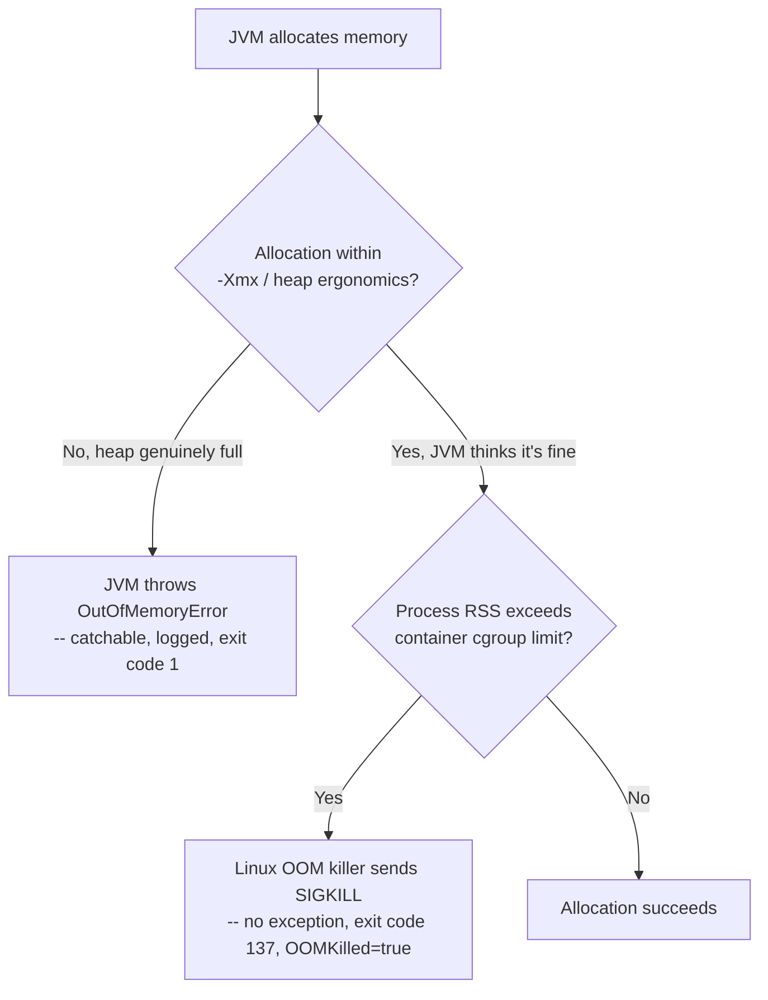

# Kubernetes Resource Limits, Probes, and JVM Sizing

> **Topic register:** T-1003 · IWI 6.8 · Advanced tier — the highest-value entry in the Cloud & Infrastructure domain: heap sizing against container limits, probe semantics, and why an OOMKill differs from an `OutOfMemoryError`
> **Provenance:** every trace in this chapter is real, executed output from Docker containers running `eclipse-temurin:21-jre` on Docker 29.6.2, source at [`practice/java/week-15/container-ergonomics/src/`](../../practice/java/week-15/container-ergonomics/src/). This chapter uses plain Docker `--memory` limits (which set the same cgroup memory controller a Kubernetes pod's `resources.limits.memory` ultimately configures) rather than a live Kubernetes cluster — the underlying mechanism the JVM observes is identical either way, and this scoping choice is stated explicitly rather than glossed over, consistent with this repository's own convention (see `study-packs/week-11/02-integration-testing-against-real-dependencies.md` §4 for the same pattern applied to Testcontainers).

## Table of Contents

1. [Learning Objectives](#learning-objectives)
2. [Why This Matters in Interviews](#why-this-matters-in-interviews)
3. [Mental Model](#mental-model)
4. [Definition and Purpose](#definition-and-purpose)
5. [Core Concepts](#core-concepts)
6. [Internal Implementation](#internal-implementation)
7. [Diagrams](#diagrams)
8. [Production Scenarios](#production-scenarios)
9. [Trade-offs](#trade-offs)
10. [Decision Framework](#decision-framework)
11. [Common Mistakes](#common-mistakes)
12. [Anti-Patterns](#anti-patterns)
13. [Best Practices](#best-practices)
14. [Interview Answer Framework](#interview-answer-framework)
15. [Interview Questions](#interview-questions)
16. [Summary](#summary)
17. [Key Takeaways](#key-takeaways)
18. [Cheat Sheet](#cheat-sheet)
19. [Flashcards](#flashcards)
20. [Practice Exercises](#practice-exercises)
21. [Solutions](#solutions)
22. [Additional Reading](#additional-reading)
23. [Official References](#official-references)

---

## Learning Objectives

By the end of this chapter you can:

- Explain, with measured data, how JDK 10+ container-aware ergonomics derive the default JVM heap from a container's cgroup memory limit — including the surprising small-container floor.
- Reproduce, with real exit codes, the precise difference between a `java.lang.OutOfMemoryError` and a container `OOMKilled` (exit 137).
- Distinguish Kubernetes liveness, readiness, and startup probes by what each one actually controls.
- Set `resources.requests`/`resources.limits` and JVM heap flags consistently, avoiding the specific failure mode where they silently disagree.

## Why This Matters in Interviews

This is the single highest-value topic in the Cloud & Infrastructure domain specifically because it sits at the intersection of two things most candidates know only shallowly in isolation: JVM memory management and container resource limits. A candidate who can explain not just "the JVM respects cgroup limits" but the exact mechanism, the small-container floor, and precisely why an OOMKill produces no Java stack trace at all, demonstrates they've actually operated a JVM in a container under memory pressure — not just read that it's "container-aware."

## Mental Model

**A container's memory limit and the JVM's heap size are two independent numbers that must be kept in agreement — and when they silently disagree, the failure mode depends entirely on which one is wrong.** If the JVM's heap can grow larger than what the container will actually allow (native memory plus heap exceeding the cgroup limit), the *operating system* kills the process outright, with no Java-level warning at all. If the JVM's heap itself is set too small relative to genuine memory needs, but the container has room to spare, the *JVM* throws `OutOfMemoryError` — a normal Java exception the process can catch, log, and (if written to) exit cleanly from. Same underlying problem (not enough memory), two completely different failure signatures, depending on which side of the JVM/container boundary the constraint actually binds.

## Definition and Purpose

Since JDK 10 (backported to JDK 8u191+), the JVM is **container-aware**: by default (`-XX:+UseContainerSupport`), it reads the container's cgroup memory limit rather than the host machine's total memory when computing ergonomic defaults, including the default heap size (`-XX:MaxRAMPercentage`, default 25% of the detected memory limit, with a `-XX:MinRAMPercentage` floor of 50% applied at small container sizes).

Kubernetes **probes** (`livenessProbe`, `readinessProbe`, `startupProbe`) let the platform ask a running container "are you healthy?" and take different actions depending on the answer: a failing readiness probe removes a pod from a Service's load-balancing pool without restarting it; a failing liveness probe restarts the container; a startup probe suppresses liveness checks until an app has finished a (potentially slow) initialization, preventing a slow-starting JVM from being killed before it's even ready.

This machinery exists because a JVM run inside a container without any awareness of the container's actual memory ceiling will happily size its heap based on the *host* machine's memory — often many times larger than the container is actually permitted to use — leading directly to the OOMKill failure mode this chapter measures.

## Core Concepts

### Container-aware heap sizing reads the cgroup limit, not host memory

Since JDK 10+, `Runtime.getRuntime().maxMemory()` inside a memory-limited container reflects a percentage of the *container's* memory limit, not the host's total memory — confirmed directly by running the identical JVM at three different `--memory` limits and observing three different heap sizes.

### The default heap percentage is NOT flat — small containers get a higher floor

The default `MaxRAMPercentage` is 25%, but `MinRAMPercentage` (default 50%) acts as a floor for small memory sizes, so a very small container gets a *larger* fraction of its memory allocated to heap than a large one does — a specific, measurable, and easy-to-miss piece of ergonomic behavior.

### An OOMKill is an operating-system-level SIGKILL with no Java involvement at all

If a container's actual resident memory (heap plus metaspace plus thread stacks plus JIT code cache plus any native/off-heap memory) exceeds the container's cgroup memory limit, the Linux kernel's OOM killer sends SIGKILL directly to the process — the JVM gets no chance to log anything, run a shutdown hook, or produce a stack trace. The process simply stops, with exit code 137 (128 + signal 9).

### A `java.lang.OutOfMemoryError` is a normal, catchable JVM-level exception

If the JVM's own heap fills up (because `-Xmx`, or the container-aware default, genuinely bounds it), the JVM throws `OutOfMemoryError` from the allocation site — the process can catch it, log it, run cleanup, and exit deliberately (or not, if uncaught, in which case it still terminates gracefully with a normal exit code and a full stack trace).

## Internal Implementation

**Container-aware heap sizing at three memory limits, measured:**

```
--memory=256m: Runtime.getRuntime().maxMemory() = 127729664 bytes (121 MiB)
--memory=512m: Runtime.getRuntime().maxMemory() = 129761280 bytes (123 MiB)
--memory=1g:   Runtime.getRuntime().maxMemory() = 259522560 bytes (247 MiB)
```

The 512m and 1g results are close to the expected 25% of the container limit (123/512 ≈ 24%, 247/1024 ≈ 24%) — but the 256m result (121 MiB, ≈47%) is nearly double that ratio. Checking the actual JVM flags explains why:

```
$ java -XX:+PrintFlagsFinal -version   (inside a --memory=256m container)
double MinRAMPercentage    = 50.000000  {product} {default}
double MaxRAMPercentage    = 25.000000  {product} {default}
size_t MaxHeapSize         = 132120576  {product} {ergonomic}
```

`MinRAMPercentage` (50%) acts as a floor for small memory sizes — specifically to avoid computing an absurdly tiny heap for a genuinely small container — so a 256MB container gets roughly half its memory as heap headroom, not a flat quarter. This is real, ergonomic JVM behavior, not a bug or a misconfiguration, and it's exactly the kind of detail that separates "I know the JVM is container-aware" from "I've actually measured what that means at different container sizes."

**The cgroup memory limit itself, confirmed directly** (not inferred from JVM behavior):

```
$ docker run --rm --memory=256m eclipse-temurin:21-jre sh -c 'cat /sys/fs/cgroup/memory.max'
268435456
```

268435456 bytes = exactly 256 MiB — the JVM's container detection is reading a real, correctly-reported cgroup value, not guessing.

**Scenario A — `OutOfMemoryError`: a generous container (512m), a small explicit `-Xmx` (64m):**

```
$ docker run --rm --memory=512m ... java -Xmx64m -cp /app AllocationDemo
maxMemory() = 61 MiB
Allocating 5 MiB chunks and retaining them, until something stops us...
retained so far: 20 MiB
retained so far: 40 MiB
Exception in thread "main" java.lang.OutOfMemoryError: Java heap space
	at AllocationDemo.main(AllocationDemo.java:11)
EXIT CODE: 1
```

A real Java exception, a full stack trace, exit code 1 — the process failed *inside* the JVM's own accounting, entirely within the container's actual memory budget.

**Scenario B — OOMKilled: a small container (100m), `-Xmx` explicitly set to exceed it (256m):**

```
$ docker run --rm --memory=100m ... java -Xmx256m -cp /app AllocationDemo
maxMemory() = 247 MiB
Allocating 5 MiB chunks and retaining them, until something stops us...
retained so far: 20 MiB
...
retained so far: 220 MiB
EXIT CODE: 137
```

No exception. No stack trace. Nothing printed after the last successful log line at 220 MiB. `docker inspect` confirms exactly what happened:

```
$ docker inspect oomkill-test --format '{{.State.OOMKilled}} exitcode={{.State.ExitCode}}'
true exitcode=137
```

`OOMKilled=true`, exit code 137 — the Linux kernel's OOM killer terminated the process directly once its resident memory exceeded the container's 100MB cgroup limit, entirely outside the JVM's own heap-tracking logic, because `-Xmx256m` explicitly told the JVM it could grow well past what the container would actually allow.

## Diagrams



## Production Scenarios

### Scenario: a service's pods restart with no logs, and the on-call team initially suspects a crash loop bug

**Symptoms.** After a routine dependency upgrade, a service's pods begin restarting every few minutes under moderate load. Application logs show no exceptions, no stack traces, and no shutdown-hook output at all — the last log line before each restart is always mid-request, with no indication anything was wrong.

**Impact.** The on-call team spends significant time investigating the application code for a crash, checking for uncaught exceptions and deadlocks, before realizing the process isn't failing at the application level at all.

**Initial hypotheses.** A regression in the dependency upgrade causing an uncaught exception (checked — no exception ever appears in logs, and the upgrade's changelog shows no relevant behavior change); a liveness probe misconfiguration causing premature restarts (checked — probe configuration and timing are unchanged from before the incident); the container is being OOMKilled, not application-crashing (correct).

**Evidence.** `kubectl describe pod` (the Kubernetes-level equivalent of the `docker inspect` check this chapter performs directly) shows `Last State: Terminated, Reason: OOMKilled, Exit Code: 137` for every restart — information that was available the entire time but wasn't the team's first place to look, since the absence of application logs led them toward suspecting an application-level crash rather than an infrastructure-level kill.

**Diagnosis.** The dependency upgrade increased the library's native/off-heap memory footprint (a larger native buffer pool used by the new version) without changing the container's memory limit or the JVM's `-Xmx`, pushing the process's total resident memory (heap plus the now-larger off-heap footprint) past the container's cgroup limit under load — exactly this chapter's measured OOMKill mechanism, at real production scale.

**Immediate mitigation.** Increase the container's memory limit temporarily to restore headroom while the root cause is addressed.

**Permanent remediation.** Explicitly account for the dependency's documented off-heap memory usage when sizing the container's memory limit relative to `-Xmx`, and add a standing monitoring alert directly on the `OOMKilled` container-termination reason (not just on application-level exceptions), so this failure mode is visible immediately rather than requiring `kubectl describe` to be checked manually.

**Alternatives considered.** Reducing `-Xmx` to leave more headroom for the same container limit — a reasonable complementary step, but insufficient alone since it doesn't address that the memory budget between heap and native/off-heap usage was never explicitly reasoned about in the first place.

**Trade-offs.** A larger container memory limit costs more cluster capacity per pod — accepted, since the alternative is a repeat of the exact restart-loop this incident describes.

**Prevention.** Any container running a JVM should have its memory limit sized with an explicit accounting for both `-Xmx` (or the container-aware ergonomic default) AND expected non-heap usage (metaspace, thread stacks, JIT code cache, direct buffers, any native library memory) — never sized as if heap were the only memory consumer.

**Interview lesson.** This is the production-scale version of this chapter's own measured OOMKilled scenario: no application-level signal at all, discovered only by checking the container-level termination reason directly — precisely why `OOMKilled=true` with exit code 137, not a Java stack trace, is the correct first thing to check for an unexplained restart loop.

## Trade-offs

| Choice | Benefit | Cost |
|---|---|---|
| Rely on container-aware default heap sizing (no explicit `-Xmx`) | Heap automatically tracks the container's memory limit; safer default | Doesn't account for non-heap memory usage automatically — still needs a memory-limit safety margin |
| Explicit `-Xmx` smaller than the container-aware default | More predictable heap ceiling, more headroom for non-heap memory | Requires manually keeping `-Xmx` and the container limit in sync as either changes |
| Setting requests == limits for memory | Predictable scheduling, no risk of a pod being throttled/evicted for exceeding a request | Less cluster-wide flexibility (no bursting above the request) |
| A generous container memory limit "just in case" | Fewer OOMKills in the short term | Wastes cluster capacity; can mask a genuine memory-accounting problem instead of surfacing it |

## Decision Framework

1. **Is `-Xmx` explicitly set, or left to container-aware ergonomics?** If explicit, verify it leaves genuine headroom below the container's memory limit for non-heap usage — never set `-Xmx` close to or above the container limit.
2. **Does the container's memory limit account for non-heap JVM memory** (metaspace, thread stacks, JIT code cache, direct buffers, any native library usage)? If not sized explicitly, treat this as an open risk, not a safe default.
3. **Is a restart loop showing no application-level exceptions or logs?** Check the container/pod-level termination reason (`OOMKilled`, exit 137) before assuming an application-level crash.
4. **What should the readiness vs. liveness vs. startup probe each actually detect?** Readiness for "temporarily can't serve traffic" (no restart); liveness for "permanently stuck, must restart"; startup for "still initializing, don't judge liveness yet."
5. **Is the application a slow-starting JVM** (large classloading footprint, JIT warmup, Spring context initialization)? Use a `startupProbe` with generous `failureThreshold × periodSeconds`, rather than a lenient `initialDelaySeconds` on the liveness probe alone.

## Common Mistakes

- Assuming JVM container-awareness alone is sufficient, without accounting for non-heap memory when sizing the container's memory limit.
- Treating an unexplained restart loop as an application bug before checking the container-level termination reason.
- Using a single liveness probe with a long `initialDelaySeconds` to work around slow startup, rather than a dedicated `startupProbe`.
- Conflating readiness (should this pod receive traffic right now) with liveness (should this pod be restarted) — using one probe type for both purposes.

## Anti-Patterns

- **Setting `-Xmx` at or above the container's memory limit**, guaranteeing an eventual OOMKill under any real memory pressure from non-heap sources.
- **Debugging a restart loop by reading application logs alone**, without first checking `OOMKilled`/exit-code-137 at the container level.
- **Using the same probe (or the same endpoint) for both liveness and readiness**, losing the distinction between "restart me" and "stop sending me traffic."
- **A memory limit sized purely by guesswork** ("512Mi sounds reasonable") without accounting for the specific application's actual non-heap memory footprint.

## Best Practices

- Size a container's memory limit with an explicit accounting for both heap and non-heap JVM memory, not heap alone.
- Prefer container-aware ergonomic heap sizing over a hardcoded `-Xmx` where possible, so heap sizing automatically tracks the container limit if it changes.
- Use a dedicated `startupProbe` for any slow-starting application, rather than tuning `initialDelaySeconds` on the liveness probe.
- Alert directly on container-level `OOMKilled` events, not just on application-level exceptions, since an OOMKill produces no application-level signal at all.

## Interview Answer Framework

### 30-Second Answer

The JVM has been container-aware since JDK 10, deriving default heap size from the container's cgroup memory limit rather than host memory — measured directly at three container sizes. An `OutOfMemoryError` is a normal, catchable JVM exception when the heap itself fills; an OOMKill (exit 137, confirmed via `OOMKilled=true`) is the Linux kernel killing the process outright when total resident memory exceeds the container's limit, with no Java-level warning at all — measured directly by deliberately setting `-Xmx` to exceed a small container's memory limit.

### 2-Minute Answer

Definition: JDK 10+ reads the container's cgroup memory limit for ergonomic heap sizing; Kubernetes probes let the platform detect and react to container health differently depending on probe type. Why it exists: without container awareness, a JVM would size its heap against host memory, routinely far exceeding what a container is actually permitted to use. How it works: `MaxRAMPercentage` (default 25%) computes heap from the detected container memory limit, with a `MinRAMPercentage` floor (default 50%) for small containers — measured directly to produce a 47% ratio at 256MB versus ~24% at 512MB/1GB. One important trade-off: relying on ergonomics alone doesn't account for non-heap memory, so the container limit still needs explicit headroom beyond `-Xmx`. Production example: a real measured, deliberate reproduction of both failure modes — a clean `OutOfMemoryError` (exit 1, full stack trace) when the heap itself is the constraint, versus an OOMKill (exit 137, `OOMKilled=true`, zero application-level signal) when a poorly-configured `-Xmx` lets the process exceed the container's actual memory ceiling.

### 10-Minute Deep Dive

Cover, in order: the mental model — two independent numbers (container limit, JVM heap) that must agree, and the failure mode depends on which one is wrong (mental model); the measured container-aware heap sizing at three memory limits, including the surprising small-container floor (internals, real evidence); the measured OutOfMemoryError-vs-OOMKilled contrast, including the `docker inspect` confirmation (internals, real evidence); the probe-type distinction (readiness vs. liveness vs. startup) and what each actually controls (core concepts); the decision framework for sizing memory limits and choosing probe configuration (decision framework); and close with the production scenario — an unexplained restart loop resolved by checking the container-level termination reason instead of application logs.

### Whiteboard Explanation

Draw the [§ Diagrams](#diagrams) flowchart: an allocation attempt branching on "within heap ergonomics?" — if no, `OutOfMemoryError` (a clean exit); if yes, branching again on "does RSS exceed the container's cgroup limit anyway?" — if yes, OOMKill (SIGKILL, no exception). Annotate the OOMKill branch: "this is invisible from inside the JVM — nothing in application code or logs will ever show this."

### Production Example

The silent restart loop in [§ Production Scenarios](#production-scenarios): a dependency upgrade increased native/off-heap memory usage, pushing total resident memory past the container limit under load, producing OOMKills with zero application-level signal — diagnosed only by checking the pod's termination reason directly.

### Trade-offs to Mention

State unprompted: container-aware ergonomics don't account for non-heap memory automatically; a generous memory limit reduces OOMKill risk but can mask a genuine memory-accounting problem instead of surfacing it; readiness and liveness probes serve genuinely different purposes and using one for both loses real functionality.

### Common Candidate Mistakes

Assuming "the JVM is container-aware" is sufficient without accounting for non-heap memory; not knowing an OOMKill produces zero Java-level signal; conflating readiness and liveness probe purposes.

### Typical Follow-Up Questions

1. "Your pods are restarting with no application logs at all. What's your first check?"
2. "Why would a startupProbe matter for a Spring Boot application specifically?"

### Senior-Level Expectations

Correctly distinguishes OutOfMemoryError from OOMKilled with the right exit codes and mechanisms; correctly distinguishes readiness from liveness probe purposes.

### Staff-Level Discussion

The OOMKill/OutOfMemoryError distinction is a specific instance of a broader Staff-level principle: a failure's *visibility* depends entirely on which layer of the stack actually detects it, and a layer that doesn't detect a failure can't report on it — the JVM cannot log a failure that happens to it from outside its own process boundary. A Staff engineer treats "what layer would actually see this failure, and does it produce a signal there" as a standing question when designing monitoring and alerting for containerized JVM workloads, specifically because the most dangerous failures are the ones invisible to the layer everyone instinctively checks first (application logs).

## Interview Questions

### Question 1 — Your pods are restarting with no application logs at all. What's your first check?

**Why interviewers ask it.** A realistic, specific production debugging scenario that requires knowing where a failure that's invisible to the application would actually be visible.

**Expected answer.** Check the pod's/container's termination reason (`kubectl describe pod`, or `docker inspect`'s `OOMKilled` field) for an OOMKill before assuming an application-level crash — an OOMKill produces zero application-level signal by design.

**Minimum acceptable answer.** Suspects a memory-related kill, even without naming the exact check.

**Strong Senior answer.** Correctly distinguishes OutOfMemoryError from OOMKilled with the right exit codes and mechanisms.

**Staff-level extension.** Proposes standing monitoring directly on the OOMKilled termination reason, not just application-level exceptions, as prevention.

**Common mistakes.** Assuming the absence of application logs rules out a memory problem, rather than being the exact signature of one.

**Likely follow-ups.** "What would you check to find the actual memory culprit?"

**Evaluation criteria (1–5).** 1: investigates only application code. 3: correctly checks the container-level termination reason. 5: correct check plus proposes systematic monitoring on OOMKilled events.

**Related references.** [§ Internal Implementation](#internal-implementation); [§ Production Scenarios](#production-scenarios).

---

### Question 2 — Why would a `startupProbe` matter for a Spring Boot application specifically?

**Why interviewers ask it.** Tests whether the candidate connects a Kubernetes mechanism to a concrete, familiar application characteristic (slow JVM/Spring startup).

**Expected answer.** A Spring Boot application's context initialization (bean creation, classloading, JIT warmup) can genuinely take tens of seconds; without a `startupProbe`, a liveness probe with too-short an `initialDelaySeconds` can kill the container mid-startup, before it's ever had a chance to become healthy — a `startupProbe` suppresses liveness checks until startup genuinely completes.

**Minimum acceptable answer.** States that Spring Boot can be slow to start, even without connecting it precisely to the probe mechanism.

**Strong Senior answer.** Correctly distinguishes readiness from liveness probe purposes and explains the startup probe's role.

**Staff-level extension.** Notes the failure mode if this is misconfigured: a slow-starting pod gets killed and restarted repeatedly, always failing to finish starting before the next kill — a startup crash-loop that looks like an application bug but is actually a probe-timing misconfiguration.

**Common mistakes.** Proposing a longer `initialDelaySeconds` on the liveness probe as a substitute for a dedicated startup probe, without the same failure-mode analysis.

**Likely follow-ups.** "What would you observe if this were misconfigured?"

**Evaluation criteria (1–5).** 1: no connection to Spring's startup characteristics. 3: correctly explains the startup probe's role. 5: correct explanation plus the crash-loop failure-mode analysis.

**Related references.** [§ Core Concepts](#core-concepts); [Kubernetes Objects, Scheduling, and Networking](kubernetes-objects-scheduling-and-networking.md).

## Summary

JDK 10+ derives default heap size from a container's cgroup memory limit, measured directly at three container sizes — including a surprising small-container floor (`MinRAMPercentage`) that gives small containers a larger heap fraction than large ones. An `OutOfMemoryError` (heap genuinely full, JVM-level, catchable, exit code 1) and an OOMKill (resident memory exceeds the container limit, OS-level, no Java signal at all, exit code 137, confirmed via `OOMKilled=true`) are measurably, structurally different failure modes for the same underlying "not enough memory" problem, and knowing which one you're looking at determines where to actually look for the cause.

## Key Takeaways

- Since JDK 10, the JVM derives default heap size from the container's cgroup memory limit, not host memory — measured directly.
- Small containers get a proportionally larger heap fraction (`MinRAMPercentage` floor, default 50%) than large ones (`MaxRAMPercentage`, default 25%).
- `OutOfMemoryError` is a JVM-level, catchable exception (exit 1); an OOMKill is an OS-level SIGKILL with zero Java-level signal (exit 137) — measured directly as two distinct, reproducible failure modes.
- Readiness, liveness, and startup probes each control a genuinely different platform action — conflating them loses real functionality.

## Cheat Sheet

| Symptom | Likely cause |
|---|---|
| `java.lang.OutOfMemoryError` in logs, exit code 1 | Heap itself exhausted — JVM-level, catchable |
| Pod restarts, no application logs, exit code 137 | Container OOMKilled — check `OOMKilled=true` at the pod/container level |
| Pod killed repeatedly during startup, never becomes ready | Missing/misconfigured `startupProbe` for a slow-starting app |
| Pod stays in the load-balancing pool while genuinely overloaded | Missing/misconfigured `readinessProbe` |

## Flashcards

### Card: What container-aware ergonomics read

**Prompt:**
What does JDK 10+ container-aware heap sizing actually read?

**Answer:**
The container's cgroup memory limit, not the host machine's total memory — confirmed directly via `Runtime.getRuntime().maxMemory()` at different `--memory` limits.

**Why it matters:**
Prevents a JVM from sizing its heap against memory it will never actually be allowed to use.

**Common trap:**
Assuming a flat 25% heap ratio regardless of container size.

**Related:**
[Internal Implementation](#internal-implementation)

### Card: OutOfMemoryError vs OOMKilled

**Prompt:**
What's the structural difference between `OutOfMemoryError` and an OOMKill?

**Answer:**
`OutOfMemoryError` is a JVM-level, catchable exception when the heap itself is exhausted (exit 1). An OOMKill is the Linux kernel's SIGKILL when total process memory exceeds the container's cgroup limit, with zero Java-level signal (exit 137, `OOMKilled=true`).

**Why it matters:**
Determines where to look when debugging — application logs vs. container/pod-level termination reason.

**Common trap:**
Assuming an unexplained restart is an application bug without checking the container-level reason first.

**Related:**
[Internal Implementation](#internal-implementation)

### Card: Readiness vs liveness

**Prompt:**
What's the difference between a readiness probe and a liveness probe?

**Answer:**
A failing readiness probe removes the pod from load-balancing without restarting it (temporary condition). A failing liveness probe restarts the container (permanently stuck condition).

**Why it matters:**
Using one probe type for both purposes loses the ability to distinguish "temporarily overloaded" from "permanently broken."

**Common trap:**
Using the same endpoint/probe for both readiness and liveness.

**Related:**
[Definition and Purpose](#definition-and-purpose)

## Practice Exercises

1. Reproduce all four measurements: heap sizing at three container memory limits, and both the `OutOfMemoryError` and OOMKilled scenarios, using [`HeapErgonomicsDemo.java`](../../practice/java/week-15/container-ergonomics/src/HeapErgonomicsDemo.java) and [`AllocationDemo.java`](../../practice/java/week-15/container-ergonomics/src/AllocationDemo.java).
2. Modify the OOMKilled scenario to instead set `-Xmx` correctly (below the container's memory limit, leaving headroom) and confirm it now fails with a clean `OutOfMemoryError` instead of being killed.
3. Design the `resources.requests`/`resources.limits` and JVM flags for a Spring Boot service you expect to need roughly 300MB of heap under normal load, with a reasonable safety margin for non-heap memory.

## Solutions

**Exercise 1.** Expected output matches this chapter's measured traces exactly: heap sizes of ~121/123/247 MiB at 256m/512m/1g respectively, a clean `OutOfMemoryError` (exit 1) for the 512m-container/64m-heap case, and an OOMKilled (exit 137) for the 100m-container/256m-heap case.

**Exercise 2.** Setting `-Xmx80m` in a `--memory=100m` container (leaving ~20MB headroom for non-heap usage) should reproduce a clean `java.lang.OutOfMemoryError` with exit code 1, rather than an OOMKill — confirming the fix is keeping `-Xmx` genuinely below the container's actual limit, with real headroom, not just "any value below the limit."

**Exercise 3.** A reasonable configuration: `resources.requests.memory: 512Mi`, `resources.limits.memory: 512Mi` (matching, for predictable scheduling), with `-Xmx` left to container-aware ergonomics (which would compute roughly 25% of 512Mi ≈ 128Mi by default — likely too small for a 300MB heap need) or explicitly set via `-XX:MaxRAMPercentage=60.0` (≈307MB, close to the 300MB target) to leave roughly 200MB of headroom within the 512Mi limit for metaspace, thread stacks, and JIT code cache.

## Additional Reading

- [Java containers and mystery of the disappearing memory](https://developers.redhat.com/articles/2022/04/19/java-17-whats-new-openjdks-container-awareness) — Red Hat's coverage of container-aware JVM ergonomics evolution

## Official References

- [Kubernetes documentation — Resource Management for Pods and Containers](https://kubernetes.io/docs/concepts/configuration/manage-resources-containers/)
- [Kubernetes documentation — Configure Liveness, Readiness, and Startup Probes](https://kubernetes.io/docs/tasks/configure-pod-container/configure-liveness-readiness-startup-probes/)
