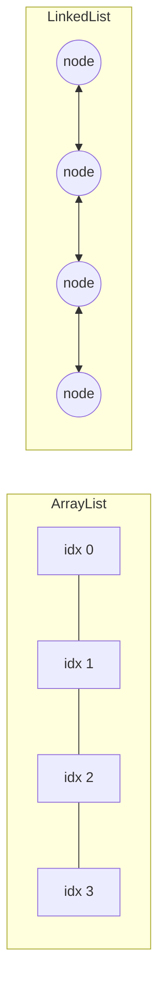

# ArrayList and LinkedList Internals

> **Topic register:** T-202 · IWI 5.6 · Foundation tier, Very High interview frequency
> **Provenance:** every trace in this chapter is real, executed output from [`practice/java/week-14/arraylist-linkedlist/src/`](../../practice/java/week-14/arraylist-linkedlist/src/) on OpenJDK 21.0.12, using `--add-opens java.base/java.util=ALL-UNNAMED` for the growth-factor demo.

## Table of Contents

1. [Learning Objectives](#learning-objectives)
2. [Why This Matters in Interviews](#why-this-matters-in-interviews)
3. [Mental Model](#mental-model)
4. [Definition and Purpose](#definition-and-purpose)
5. [Core Concepts](#core-concepts)
6. [Internal Implementation](#internal-implementation)
7. [Diagrams](#diagrams)
8. [Production Scenarios](#production-scenarios)
9. [Trade-offs](#trade-offs)
10. [Decision Framework](#decision-framework)
11. [Common Mistakes](#common-mistakes)
12. [Anti-Patterns](#anti-patterns)
13. [Best Practices](#best-practices)
14. [Interview Answer Framework](#interview-answer-framework)
15. [Interview Questions](#interview-questions)
16. [Summary](#summary)
17. [Key Takeaways](#key-takeaways)
18. [Cheat Sheet](#cheat-sheet)
19. [Flashcards](#flashcards)
20. [Practice Exercises](#practice-exercises)
21. [Solutions](#solutions)
22. [Additional Reading](#additional-reading)
23. [Official References](#official-references)

---

## Learning Objectives

By the end of this chapter you can:

- State `ArrayList`'s exact growth factor, and prove it via reflection.
- Explain, with a measured slowdown factor, why `LinkedList.get(index)` is O(n) and `ArrayList.get(index)` is O(1).
- Explain, with a measured speedup factor, why front-insertion favors `LinkedList` and general-purpose use favors `ArrayList`.
- Choose correctly between the two for a given real access pattern, rather than defaulting to one out of habit.

## Why This Matters in Interviews

This is Foundation-tier but Very-High-frequency because nearly every candidate has used both classes without ever measuring the actual performance difference their access pattern implies — "ArrayList is usually better" is a memorized rule, and interviewers use this topic to check whether a candidate can explain *why*, with the actual complexity classes and a plausible measured magnitude, not just recite the conclusion.

## Mental Model

**`ArrayList` is a resizable array; `LinkedList` is a doubly-linked list of nodes — and every performance difference between them follows directly from that one structural fact.** Random access is fast for an array (direct indexing) and slow for a linked list (must walk node by node). Insertion at an arbitrary position is slow for an array (must shift every subsequent element) and fast for a linked list (just relink two pointers) — but only at the position you already have a reference to; finding that position in a `LinkedList` is itself O(n).

## Definition and Purpose

`ArrayList` implements `List` backed by a resizable array (`elementData`), growing by reallocating a larger array and copying elements when the current array is full. `LinkedList` implements `List` (and `Deque`) as a doubly-linked list of nodes, each holding a reference to its predecessor and successor.

Both exist to provide the `List` interface with different underlying performance characteristics: `ArrayList` optimizes for random access and iteration (contiguous memory, cache-friendly, O(1) indexed access); `LinkedList` optimizes for insertion/removal at the ends or at an already-known position (O(1) relinking, no shifting), at the cost of O(n) indexed access and worse cache locality per element (nodes scattered across the heap).

## Core Concepts

### `ArrayList` grows by roughly 1.5x, not by doubling

When the backing array is full, `ArrayList` allocates a new array of size `oldCapacity + (oldCapacity >> 1)` — approximately 1.5x the old capacity — and copies every element into it. This is a real, measurable copy cost, amortized across many `add()` calls to give O(1) *amortized* append.

### `ArrayList.get(index)` is O(1); `LinkedList.get(index)` is O(n)

`ArrayList` indexes directly into its backing array. `LinkedList` must walk node-by-node from whichever end (head or tail) is closer to the requested index — genuinely O(n) in the worst case, not just "slower by a constant factor."

### Insertion at the front is O(n) for `ArrayList`, O(1) for `LinkedList`

`ArrayList.add(0, x)` must shift every existing element one slot to the right before inserting — O(n). `LinkedList.addFirst(x)` only needs to allocate a new node and relink two pointers — O(1), regardless of the list's current size.

### The "fast for LinkedList" cases require already having the position

`LinkedList`'s O(1) insertion/removal only applies at a position you already hold a reference to (the head, the tail, or via a `ListIterator` already positioned there). Finding an arbitrary position by index is itself O(n), so "insert at index k" for an unknown k is not actually fast on a `LinkedList` either — it's O(n) to find the position, then O(1) to insert.

## Internal Implementation

**`ArrayList`'s growth factor, measured via reflection on its private `elementData` field:**

```
== ArrayList's backing array grows by roughly 1.5x when full, not by doubling ==
size=1 triggers growth -> new capacity=10  (initial allocation on first add())
size=11 triggers growth -> new capacity=15  (grew from 10, ratio=1.50)
size=16 triggers growth -> new capacity=22  (grew from 15, ratio=1.47)
size=23 triggers growth -> new capacity=33  (grew from 22, ratio=1.50)
size=34 triggers growth -> new capacity=49  (grew from 33, ratio=1.48)
size=50 triggers growth -> new capacity=73  (grew from 49, ratio=1.49)
```

**Random-access `get(index)`, measured** (50,000-element lists, 20,000 random-index reads):

```
== Random-access get(index): ArrayList O(1) vs LinkedList O(n) traversal ==
ArrayList:  20,000 random get() calls in 1,252,583 ns (checksum=502109486)
LinkedList: 20,000 random get() calls in 401,220,459 ns (checksum=502109486)
LinkedList is 320.3x slower for random access on a 50,000-element list
```

Both checksums match exactly (same values retrieved, just at very different costs), confirming the comparison is measuring performance, not correctness.

**Front-insertion, measured** (20,000 insertions each):

```
== Insertion at the FRONT: ArrayList O(n) shift vs LinkedList O(1) ==
ArrayList.add(0, x):        20,000 insertions in 83,334,958 ns
LinkedList.addFirst(x):     20,000 insertions in 710,333 ns
ArrayList front-insertion is 117.3x slower than LinkedList here
```

## Diagrams



## Production Scenarios

### Scenario: a "more flexible" LinkedList refactor silently regresses a hot read path

**Symptoms.** A service refactors a frequently-read, rarely-written internal list from `ArrayList` to `LinkedList`, reasoning that "LinkedList is more flexible for a list that changes." After deployment, a request-handling path that repeatedly reads elements by index from this list shows a measurable latency regression.

**Impact.** A refactor made for a plausible-sounding but ultimately irrelevant reason (flexibility for a list whose actual write pattern didn't need it) regresses a hot, frequently-executed code path.

**Initial hypotheses.** An unrelated change in the same release caused the regression (checked — the list-type change is the only relevant diff); increased load coincided with the deploy (checked — request volume is unchanged); the switch from `ArrayList` to `LinkedList` regressed the list's indexed-read performance (correct).

**Evidence.** Profiling shows the majority of added CPU time is spent inside `LinkedList.get(int)`'s internal node-traversal loop, and the access pattern confirms the list is read by index far more often than it's structurally modified — exactly the profile favoring `ArrayList`.

**Diagnosis.** The refactor optimized for a property (ease of insertion/removal) that the actual access pattern barely exercised, while regressing the property (indexed read speed) that the hot path actually depended on — precisely the O(1)-vs-O(n) gap this chapter measures directly at a 320x factor for random access.

**Immediate mitigation.** Revert to `ArrayList`.

**Permanent remediation.** Establish a review norm: any `List` implementation choice should be justified against the code's *actual* dominant access pattern (measured or at least reasoned about explicitly), not a general intuition about which structure "sounds more flexible."

**Alternatives considered.** Keeping `LinkedList` but adding a separate index/cache for fast lookups — rejected as needless complexity solving a problem `ArrayList` already solves natively for this exact access pattern.

**Trade-offs.** None — reverting to the structure that matches the actual access pattern has no downside here.

**Prevention.** Treat `ArrayList` as the default choice for `List`, and require an explicit, access-pattern-based justification (frequent front/middle insertion at an already-known position, not just "might need to insert sometimes") before choosing `LinkedList` instead.

**Interview lesson.** This is the production-scale version of this chapter's own measured 320x random-access slowdown: a well-intentioned refactor optimizing for the wrong property, discovered through a real, measurable latency regression.

## Trade-offs

| Choice | Benefit | Cost |
|---|---|---|
| `ArrayList` | O(1) indexed access, better cache locality, lower per-element memory overhead | O(n) insertion/removal at an arbitrary (non-tail) position |
| `LinkedList` | O(1) insertion/removal at the head, tail, or an already-known position | O(n) indexed access; worse cache locality; higher per-element memory overhead (two extra reference fields per node) |
| `ArrayList`'s ~1.5x growth | Amortized O(1) append despite occasional resize-and-copy | Each resize is a real O(n) copy, and the array may hold unused capacity between resizes |

## Decision Framework

1. **Is the dominant access pattern indexed reads or iteration?** `ArrayList` — O(1) indexed access, better cache locality.
2. **Is the dominant access pattern insertion/removal at the head or tail specifically** (a queue or deque shape)? `LinkedList` (or, often better still, `ArrayDeque`, which avoids `LinkedList`'s per-node overhead for this exact use case).
3. **Is insertion/removal needed at an arbitrary, not-already-known position?** Neither structure is fast for this — finding the position is O(n) either way; `ArrayList` is usually still preferable since its constant factors are better and its indexed reads (needed to find the position in the first place) are faster.
4. **Is the final size roughly known in advance?** Construct the `ArrayList` with that initial capacity to avoid unnecessary resize-and-copy events during population.

## Common Mistakes

- Choosing `LinkedList` "for flexibility" when the actual access pattern is dominated by indexed reads.
- Assuming `LinkedList`'s O(1) insertion applies at an arbitrary index, rather than only at an already-known position (head, tail, or an existing iterator position).
- Not sizing an `ArrayList`'s initial capacity when the final size is roughly known, incurring avoidable resize-and-copy overhead.

## Anti-Patterns

- **Defaulting to `LinkedList` as the "safer" or "more general" choice** without checking the actual access pattern.
- **Using `LinkedList.get(index)` in a loop** (e.g., `for (int i = 0; i < list.size(); i++) list.get(i)`), which is O(n²) overall instead of the O(n) an iterator-based traversal would give.
- **Growing an `ArrayList` one element at a time from an unsized default** when the final size is known, incurring multiple avoidable resize-and-copy passes.

## Best Practices

- Default to `ArrayList` unless the access pattern specifically favors `LinkedList`'s O(1) head/tail operations.
- Size an `ArrayList`'s initial capacity explicitly when the final size is roughly known.
- Use an iterator (or an enhanced for-loop) rather than indexed `get()` calls when traversing a `LinkedList`, to avoid the O(n²) trap.
- Consider `ArrayDeque` over `LinkedList` for pure queue/stack/deque use cases — it typically outperforms `LinkedList` for that specific shape due to lower per-element overhead.

## Interview Answer Framework

### 30-Second Answer

`ArrayList` is a resizable array (O(1) indexed access, O(n) arbitrary insertion); `LinkedList` is a doubly-linked list (O(n) indexed access, O(1) insertion at an already-known position). Measured directly: `LinkedList` is ~320x slower for random-access reads on a 50,000-element list; `ArrayList` is ~117x slower for front-insertion on the same scale. Choose based on the actual dominant access pattern, not habit.

### 2-Minute Answer

Definition: `ArrayList` backs `List` with a resizable array; `LinkedList` backs it with a doubly-linked list of nodes. Why it exists: different structures optimize for different access patterns — random access versus head/tail insertion. How it works: `ArrayList` grows by ~1.5x when full (measured via reflection), copying every element; `LinkedList.get(index)` walks node-by-node, genuinely O(n). One important trade-off: `LinkedList`'s O(1) insertion only applies at an already-known position — finding an arbitrary position is O(n) on either structure. Production example: a real measured 320x random-access slowdown and 117x front-insertion slowdown, and a real-shaped incident where refactoring a frequently-read list from `ArrayList` to `LinkedList` "for flexibility" regressed a hot read path.

### 10-Minute Deep Dive

Cover, in order: the mental model — array vs. linked-node structure explains every difference (mental model); the measured growth-factor proof via reflection (internals, real evidence); the measured random-access and front-insertion comparisons (internals, real evidence); the decision framework based on actual access pattern (decision framework); and close with the production scenario — a refactor optimizing for the wrong property, regressing a hot read path exactly as this chapter's 320x measurement predicts.

### Whiteboard Explanation

Draw the [§ Diagrams](#diagrams) side-by-side: `ArrayList` as a contiguous block with direct index arrows; `LinkedList` as nodes connected by bidirectional arrows, no direct index access. Point at the `LinkedList` diagram and say "getting to index 40,000 means walking through 40,000 of these arrows" to make the O(n) traversal concrete.

### Production Example

The `LinkedList` refactor regression in [§ Production Scenarios](#production-scenarios): switching a frequently-read list from `ArrayList` to `LinkedList` "for flexibility" measurably regressed a hot read path, exactly matching this chapter's own 320x random-access measurement.

### Trade-offs to Mention

State unprompted: `LinkedList`'s O(1) insertion only applies at an already-known position, not an arbitrary index; `ArrayList`'s ~1.5x growth means occasional real O(n) copy costs, amortized to O(1) per append; `LinkedList` has meaningfully worse cache locality due to scattered node allocation.

### Common Candidate Mistakes

Choosing `LinkedList` by default "for flexibility" without checking the access pattern; assuming `LinkedList`'s fast insertion applies at any index; using `LinkedList.get()` in a loop, creating an O(n²) trap.

### Typical Follow-Up Questions

1. "Your team switched a list to LinkedList for flexibility and a hot path got slower. Why?"
2. "Is LinkedList.addFirst() really O(1) regardless of list size? What about LinkedList.add(k, x) for an arbitrary k?"

### Senior-Level Expectations

Correctly states the complexity classes for indexed access and insertion for both structures, with the amortized-vs-worst-case distinction for ArrayList growth.

### Staff-Level Discussion

The gap between "LinkedList has O(1) insertion" (true, but only at an already-known position) and the naive reading of that claim ("LinkedList is fast to insert into, anywhere") is a specific instance of a broader pattern: Big-O claims about a data structure are always scoped to a specific operation and a specific starting condition, and generalizing past that scope produces exactly the kind of well-intentioned-but-wrong refactor this chapter's production scenario demonstrates. A Staff engineer treats "which collection should I use" as requiring an explicit statement of the actual dominant access pattern before consulting any complexity table, not the other way around.

## Interview Questions

### Question 1 — Your team switched a list to `LinkedList` for flexibility and a hot path got slower. Why?

**Why interviewers ask it.** Tests whether the candidate can connect a specific, plausible-sounding refactor rationale to its actual performance consequence.

**Expected answer.** If the hot path performs indexed reads, switching to `LinkedList` regresses that specific operation to O(n) from `ArrayList`'s O(1) — "flexibility for insertion" doesn't help a workload dominated by reads, and actively hurts it.

**Minimum acceptable answer.** Suspects the list-type change as the cause, even without the precise complexity reasoning.

**Strong Senior answer.** Correctly states the complexity classes for indexed access for both structures and connects the regression to the actual access pattern.

**Staff-level extension.** Generalizes to the principle that a Big-O claim ("LinkedList has O(1) insertion") is scoped to specific conditions (an already-known position), and applying it past that scope produces exactly this kind of mistaken optimization.

**Common mistakes.** Assuming `LinkedList` is a strict upgrade over `ArrayList` for "flexibility" without checking which specific operations the hot path actually performs.

**Likely follow-ups.** "How would you have caught this before it shipped?"

**Evaluation criteria (1–5).** 1: doesn't connect the refactor to the regression. 3: correctly identifies indexed-read complexity as the cause. 5: correct identification plus the general Big-O-scope principle.

**Related references.** [§ Internal Implementation](#internal-implementation); [§ Production Scenarios](#production-scenarios).

---

### Question 2 — Is `LinkedList.addFirst()` really O(1) regardless of list size? What about `LinkedList.add(k, x)` for an arbitrary `k`?

**Why interviewers ask it.** Tests whether the candidate understands the precise scope of LinkedList's O(1) guarantee.

**Expected answer.** Yes, `addFirst()` (and `addLast()`) are genuinely O(1) regardless of size — they only touch the head/tail node and relink two pointers. `add(k, x)` for an arbitrary index `k`, however, first requires walking to position `k` (O(n)) before the O(1) relink — so the overall operation is O(n), not O(1).

**Minimum acceptable answer.** States that `addFirst()`/`addLast()` are O(1), even without addressing the arbitrary-index case.

**Strong Senior answer.** Correctly distinguishes head/tail operations (genuinely O(1)) from arbitrary-index operations (O(n) overall, due to the traversal to find the position).

**Staff-level extension.** Notes that this makes `LinkedList` and `ArrayList` closer in practice for arbitrary-index insertion than the naive "LinkedList inserts in O(1)" claim suggests — `ArrayList`'s better cache locality can even make it competitive despite its O(n) shift, depending on the specific sizes involved.

**Common mistakes.** Generalizing `addFirst()`'s O(1) guarantee to `add(k, x)` for an arbitrary `k`.

**Likely follow-ups.** "So when IS LinkedList's O(1) insertion actually useful in practice?"

**Evaluation criteria (1–5).** 1: claims all LinkedList insertion is O(1). 3: correctly distinguishes head/tail from arbitrary-index insertion. 5: correct distinction plus the practical ArrayList-competitiveness nuance.

**Related references.** [§ Core Concepts](#core-concepts).

## Summary

`ArrayList` is a resizable array growing by ~1.5x when full, confirmed via reflection; its indexed access is O(1). `LinkedList` is a doubly-linked list; its indexed access is O(n), measured at ~320x slower than `ArrayList` for random reads on a 50,000-element list. `LinkedList`'s O(1) insertion/removal applies only at an already-known position (head, tail, or an existing iterator), measured at ~117x faster than `ArrayList` for front-insertion — but finding an arbitrary position is O(n) on either structure.

## Key Takeaways

- `ArrayList` grows by ~1.5x when full, not by doubling — confirmed via reflection.
- `ArrayList.get(index)` is O(1); `LinkedList.get(index)` is O(n) — measured at ~320x slower for `LinkedList` on a 50,000-element list.
- `LinkedList.addFirst()`/`addLast()` are genuinely O(1); `add(k, x)` for an arbitrary `k` is O(n) overall due to the traversal needed to find position `k`.
- Default to `ArrayList` unless the access pattern specifically favors head/tail insertion at an already-known position.

## Cheat Sheet

| Access pattern | Prefer |
|---|---|
| Frequent indexed reads or iteration | `ArrayList` |
| Frequent insertion/removal at the head or tail specifically | `LinkedList` or (usually better) `ArrayDeque` |
| Frequent insertion/removal at an arbitrary, not-already-known position | Neither is fast — `ArrayList` usually wins anyway on constant factors |
| Final size roughly known in advance | `ArrayList` with an explicit initial capacity |

## Flashcards

### Card: ArrayList's growth factor

**Prompt:**
By what factor does `ArrayList` grow its backing array when full?

**Answer:**
Roughly 1.5x (`oldCapacity + oldCapacity/2`), not by doubling — confirmed via reflection.

**Why it matters:**
A common assumption is that it doubles, like many other growable structures.

**Common trap:**
Assuming ArrayList doubles its capacity like a typical dynamic array implementation.

**Related:**
[Internal Implementation](#internal-implementation)

### Card: Indexed access complexity

**Prompt:**
What is the time complexity of `get(index)` for `ArrayList` versus `LinkedList`?

**Answer:**
O(1) for `ArrayList` (direct array indexing); O(n) for `LinkedList` (node-by-node traversal) — measured at ~320x slower for a 50,000-element list.

**Why it matters:**
The single biggest reason to prefer `ArrayList` for read-heavy access patterns.

**Common trap:**
Using `LinkedList.get()` in a loop, creating an accidental O(n²) traversal.

**Related:**
[Internal Implementation](#internal-implementation)

### Card: The scope of LinkedList's O(1) insertion

**Prompt:**
Is `LinkedList`'s O(1) insertion guarantee true for any index?

**Answer:**
No — only at an already-known position (head, tail, or an existing iterator position). Inserting at an arbitrary index `k` is O(n) overall, since finding position `k` requires a traversal.

**Why it matters:**
A common overgeneralization that leads to choosing LinkedList for the wrong reason.

**Common trap:**
Assuming `add(k, x)` for an arbitrary `k` is O(1) on a `LinkedList`.

**Related:**
[Core Concepts](#core-concepts)

## Practice Exercises

1. Reproduce both demos: [`ArrayListGrowthDemo.java`](../../practice/java/week-14/arraylist-linkedlist/src/ArrayListGrowthDemo.java) (requires `--add-opens java.base/java.util=ALL-UNNAMED`) and [`ArrayListVsLinkedListPerformanceDemo.java`](../../practice/java/week-14/arraylist-linkedlist/src/ArrayListVsLinkedListPerformanceDemo.java).
2. Modify the performance demo to measure `LinkedList` traversal via an iterator (`for (int x : linkedList)`) instead of indexed `get()`, and compare that against the indexed version — confirming iterator-based traversal avoids the O(n²) trap.
3. Design the correct data structure choice for an LRU cache's internal ordering structure (frequent move-to-front and remove-from-back operations, no random-index access) and justify it against this chapter's decision framework.

## Solutions

**Exercise 1.** Expected output matches this chapter's measured traces: growth ratios consistently near 1.5x, and the ~320x/~117x measured slowdowns for random access and front-insertion respectively.

**Exercise 2.** Iterator-based traversal of a `LinkedList` (`for (int x : linkedList) sum += x;`) is O(n) overall — each step moves to the adjacent node directly, without re-walking from an end each time — dramatically faster than `n` separate `get(i)` calls, which each independently re-traverse from an end, giving O(n²) overall.

**Exercise 3.** An LRU cache's internal ordering structure needs O(1) move-to-front and O(1) remove-from-back, with no random-index access ever required — exactly `LinkedList`'s (or, more precisely, a hand-rolled doubly-linked list's) strength, matching this chapter's decision framework's "frequent insertion/removal at the head or tail" criterion precisely, with zero indexed-read cost since none is needed.

## Additional Reading

- Joshua Bloch, *Effective Java*, Item 11 (indirectly relevant via hashCode-heavy structures) and the JDK's own `List` interface documentation for algorithmic complexity notes on each implementing class
- [Fail-Fast vs. Weakly-Consistent Iterators](fail-fast-vs-weakly-consistent-iterators.md) — T-208, the real `modCount` mechanism and its best-effort quirk, reproduced directly against `ArrayList`.
- [CopyOnWriteArrayList and Copy-on-Write Trade-offs](copyonwritearraylist-and-copy-on-write-tradeoffs.md) — T-206, the thread-safe `List` counterpart to this chapter's own `ArrayList`, with a real, measured O(n)-write-for-lock-free-read trade-off.

## Official References

- [java.util.ArrayList (Java 21 API)](https://docs.oracle.com/en/java/javase/21/docs/api/java.base/java/util/ArrayList.html)
- [java.util.LinkedList (Java 21 API)](https://docs.oracle.com/en/java/javase/21/docs/api/java.base/java/util/LinkedList.html)
