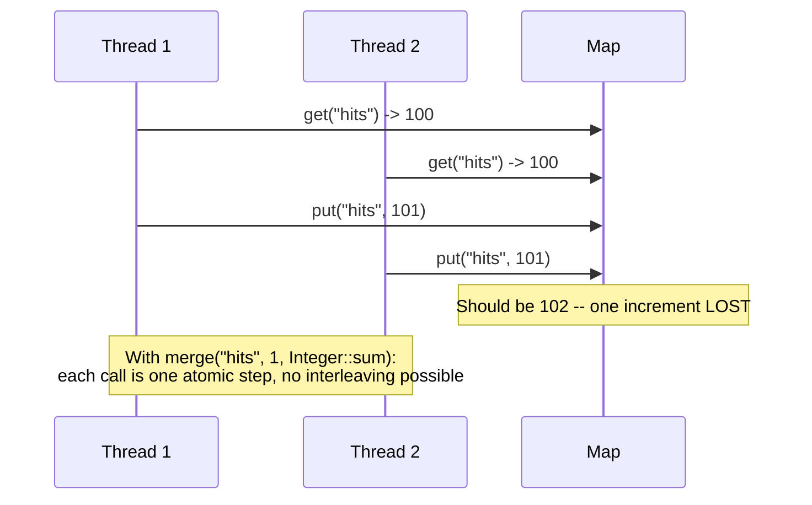

# ConcurrentHashMap Internals

> **Topic register:** T-205 · IWI 6.65 · Advanced tier, High interview frequency
> **Provenance:** every trace in this chapter is real, executed output from [`practice/java/week-14/concurrenthashmap/src/ConcurrentHashMapDemo.java`](../../practice/java/week-14/concurrenthashmap/src/ConcurrentHashMapDemo.java) on OpenJDK 21.0.12.

## Table of Contents

1. [Learning Objectives](#learning-objectives)
2. [Why This Matters in Interviews](#why-this-matters-in-interviews)
3. [Mental Model](#mental-model)
4. [Definition and Purpose](#definition-and-purpose)
5. [Core Concepts](#core-concepts)
6. [Internal Implementation](#internal-implementation)
7. [Diagrams](#diagrams)
8. [Production Scenarios](#production-scenarios)
9. [Trade-offs](#trade-offs)
10. [Decision Framework](#decision-framework)
11. [Common Mistakes](#common-mistakes)
12. [Anti-Patterns](#anti-patterns)
13. [Best Practices](#best-practices)
14. [Interview Answer Framework](#interview-answer-framework)
15. [Interview Questions](#interview-questions)
16. [Summary](#summary)
17. [Key Takeaways](#key-takeaways)
18. [Cheat Sheet](#cheat-sheet)
19. [Flashcards](#flashcards)
20. [Practice Exercises](#practice-exercises)
21. [Solutions](#solutions)
22. [Additional Reading](#additional-reading)
23. [Official References](#official-references)

---

## Learning Objectives

By the end of this chapter you can:

- Reproduce, with real measured output, why a plain `HashMap` corrupts under concurrent writes and `ConcurrentHashMap` does not.
- Explain precisely why `ConcurrentHashMap`'s per-operation thread safety does NOT make a `get()`-then-`put()` sequence atomic, with a measured lost-update count.
- Use `merge()`/`compute()` to perform an atomic read-modify-write, and explain why it works where `get()`+`put()` doesn't.
- State how `ConcurrentHashMap` achieves its safety without a single lock for the whole map.

## Why This Matters in Interviews

`ConcurrentHashMap` is one of the most commonly *misused* thread-safe classes in real Java codebases: engineers correctly avoid a plain `HashMap` under concurrency, reach for `ConcurrentHashMap`, and then write a `get()`/`put()` counter-increment pattern that's just as broken as if they'd used a `HashMap` — because per-call thread safety and multi-call atomicity are different guarantees, and this topic exists specifically to test whether a candidate understands that distinction.

## Mental Model

**`ConcurrentHashMap` makes every individual method call safe — it says nothing about the safety of a *sequence* of calls.** `get()` is safe. `put()` is safe. But `get()` followed by a separate `put()` is two independent safe operations with an unprotected gap between them, during which another thread can interleave and cause a lost update. The fix isn't "use a thread-safe map harder" — it's using the single-method atomic operations (`merge`, `compute`, `computeIfAbsent`) that perform the entire read-modify-write as one indivisible operation.

## Definition and Purpose

`ConcurrentHashMap` is a thread-safe hash map that allows safe concurrent reads and writes without external synchronization, achieving this through fine-grained internal locking (historically per-segment; since JDK 8, per-bucket via CAS operations and synchronized blocks on individual bin heads) rather than a single lock for the entire map.

It exists because a plain `HashMap` is not thread-safe: concurrent structural modifications (resizes, bucket list changes) can corrupt its internal structure, losing entries with no exception thrown at all. `ConcurrentHashMap` provides the thread-safety guarantee `HashMap` lacks, while — critically — also providing atomic compound operations (`merge`, `compute`, `computeIfAbsent`) for the common case where a caller needs a read-modify-write to happen as a single atomic step.

## Core Concepts

### A plain HashMap corrupts silently under concurrent writes

Concurrent `put()` calls from multiple threads on a plain `HashMap` can corrupt its internal bucket structure, losing entries — with no exception, just a wrong final size.

### ConcurrentHashMap's individual operations are safe

Concurrent `put()` calls on a `ConcurrentHashMap` always produce the correct final size — every individual method call is internally synchronized correctly.

### Per-operation safety does not compose into multi-operation atomicity

`int current = map.get(key); map.put(key, current + 1);` is two separate method calls. Between them, another thread can also read the same `current` value and perform its own increment, and one of the two increments is lost — even though both individual `get()` and `put()` calls were themselves perfectly safe.

### `merge()`/`compute()` perform the entire read-modify-write atomically

`map.merge(key, 1, Integer::sum)` performs the read, the combination, and the write as one atomic operation per key — no other thread can interleave in the middle of it, eliminating the lost-update pattern entirely.

## Internal Implementation

**A plain `HashMap` corrupted under concurrent writes, measured** (8 threads, 20,000 `put()` calls each, disjoint keys):

```
== A plain HashMap under real concurrent writes: corrupted, not just "unsafe in theory" ==
Expected size: 160000, actual size: 68683  <-- CORRUPTED (lost entries from concurrent structural modification, no exception thrown)
```

**`ConcurrentHashMap` correctly handling the identical concurrent writes, measured:**

```
== The correct, thread-safe replacement: ConcurrentHashMap ==
Expected size: 160000, actual size: 160000  (always correct -- ConcurrentHashMap's per-bucket locking makes individual put() calls safe)
```

**`get()`-then-`put()` losing updates on a `ConcurrentHashMap`, measured** (8 threads, each incrementing a shared counter key 20,000 times via separate `get()`/`put()` calls):

```
== But ConcurrentHashMap's per-operation safety does NOT make get-then-put atomic ==
Expected "hits" count: 160000, actual: 26212  (LOST UPDATES -- get() then put() is two separate operations; the map is thread-safe per-call, but the read-modify-write sequence across two calls is not atomic)
```

**`merge()` correctly performing the same increment atomically, measured:**

```
== The correct fix: merge()/compute() perform the read-modify-write atomically ==
Expected "hits" count: 160000, actual: 160000  (correct -- merge() performs the whole read-modify-write under one atomic per-key operation)
```

## Diagrams



## Production Scenarios

### Scenario: a request-counting metric silently undercounts under real production load

**Symptoms.** A service tracks per-endpoint request counts in a `ConcurrentHashMap<String, Integer>`, incrementing via a `get()`-then-`put()` pattern on each request. Under low traffic, the dashboard's counts match load-balancer request logs closely; under peak traffic, the dashboard consistently undercounts by a significant, load-dependent margin.

**Impact.** A metric used for capacity planning and alerting silently underreports exactly when traffic is highest — the moment accurate counting matters most.

**Initial hypotheses.** The load balancer's own request log double-counts (checked — the load balancer's counts are independently verified accurate); metric collection is being sampled or dropped under load (checked — no sampling or dropping is configured); the counter-increment pattern itself loses updates under concurrent access (correct).

**Evidence.** The undercount percentage scales with concurrent request rate — exactly what a lost-update race would produce, since more concurrent threads means more opportunities for two `get()` calls to observe the same value before either `put()` call commits.

**Diagnosis.** The `get()`-then-`put()` increment pattern is exactly this chapter's measured lost-update mechanism: `ConcurrentHashMap`'s individual method calls are safe, but the two-call sequence has an unprotected gap where concurrent threads can read the same stale value.

**Immediate mitigation.** None available without a code change — the undercounting is a structural property of the increment pattern, not a runtime-tunable setting.

**Permanent remediation.** Replace every `get()`-then-`put()` counter increment with `map.merge(key, 1, Integer::sum)`, converting the read-modify-write into one atomic per-key operation, eliminating the race entirely.

**Alternatives considered.** Wrapping the increment in an external `synchronized` block — rejected as strictly worse than `merge()`, since it would serialize all increments across all keys through one lock, discarding `ConcurrentHashMap`'s per-bucket concurrency for no additional correctness benefit over the built-in atomic operation.

**Trade-offs.** None — `merge()` is both correct and at least as performant as the broken pattern it replaces.

**Prevention.** Treat any `get()`-then-`put()` sequence on a `ConcurrentHashMap` as a code-review flag by default, requiring justification for why an atomic compound operation (`merge`, `compute`, `computeIfAbsent`) isn't used instead.

**Interview lesson.** This is the production-scale version of this chapter's own measured lost-update demo: a metric silently undercounting specifically under the load conditions where accuracy matters most, fixed by switching from `get()`+`put()` to `merge()`.

## Trade-offs

| Choice | Benefit | Cost |
|---|---|---|
| Plain `HashMap` under concurrency | Fastest single-threaded performance | Corrupts silently under any concurrent structural modification |
| `ConcurrentHashMap` with `get()`+`put()` | Looks correct, compiles, "seems" thread-safe | Loses updates under real concurrent access — a subtle, load-dependent bug |
| `ConcurrentHashMap` with `merge()`/`compute()` | Genuinely atomic per-key read-modify-write | Slightly less flexible API than manual get/put for complex multi-step logic |
| An external lock around the whole map | Simple to reason about | Serializes all access, discarding ConcurrentHashMap's per-bucket concurrency entirely |

## Decision Framework

1. **Is this map accessed from multiple threads at all?** If yes, `ConcurrentHashMap` (or an equivalent), never a plain `HashMap`.
2. **Does an operation on this map require reading the current value and writing a new one based on it?** Use `merge()`, `compute()`, or `computeIfAbsent()` — never a separate `get()` followed by a separate `put()`.
3. **Is the read-modify-write logic too complex for a single lambda?** `compute()` accepts an arbitrary `BiFunction`, so most logic still fits; only reach for external synchronization if genuinely multiple keys must be updated as one atomic unit (a different problem `ConcurrentHashMap` alone doesn't solve).
4. **Is a metric or counter silently undercounting under load?** Check for exactly this `get()`+`put()` pattern before assuming the issue lies elsewhere.

## Common Mistakes

- Using a plain `HashMap` under any concurrent access, assuming "it probably won't cause a problem in practice."
- Using `get()` followed by a separate `put()` on a `ConcurrentHashMap` for a read-modify-write, assuming the map's thread-safety extends across the two calls.
- Wrapping `ConcurrentHashMap` access in external synchronization "to be extra safe," discarding its per-bucket concurrency for no correctness benefit.

## Anti-Patterns

- **`int v = map.get(key); map.put(key, v + 1);`** — the single most common instance of the lost-update bug this chapter measures directly.
- **Assuming `ConcurrentHashMap` alone is sufficient for any concurrent counter/aggregation use case** without checking whether the specific access pattern is a multi-step read-modify-write.
- **Adding a `synchronized` block around ConcurrentHashMap access "for safety,"** serializing all access and discarding the structure's actual concurrency benefit.

## Best Practices

- Always use `ConcurrentHashMap` (or an equivalent) instead of a plain `HashMap` for any map accessed from multiple threads.
- Use `merge()`/`compute()`/`computeIfAbsent()` for any read-modify-write on a shared map — never a separate `get()` and `put()`.
- Treat a `get()`-then-`put()` sequence on a concurrent map as a code-review flag requiring explicit justification.

## Interview Answer Framework

### 30-Second Answer

`ConcurrentHashMap` makes every individual method call thread-safe via fine-grained internal locking — measured directly, it produces a correct size under concurrent `put()` calls where a plain `HashMap` corrupts. But per-call safety doesn't compose: a `get()`-then-`put()` counter increment loses updates under real concurrency, measured at 26,212 instead of an expected 160,000. `merge()`/`compute()` fix this by performing the whole read-modify-write as one atomic operation.

### 2-Minute Answer

Definition: `ConcurrentHashMap` provides thread-safe concurrent access via fine-grained internal locking, plus atomic compound operations. Why it exists: a plain `HashMap` corrupts silently under concurrent writes; `ConcurrentHashMap` fixes that AND provides atomic read-modify-write operations for the common counter/aggregation case. How it works: individual method calls are internally synchronized correctly, but a sequence of two separate calls (get then put) has an unprotected gap where another thread can interleave. One important trade-off: `merge()`/`compute()` are the correct tool for read-modify-write, not a manual get/put pair, which looks correct but isn't. Production example: a real measured lost-update rate (26,212 of an expected 160,000) from a `get()`-then-`put()` counter pattern, and a real-shaped incident where a production request-counting metric silently undercounted specifically under peak load.

### 10-Minute Deep Dive

Cover, in order: the mental model — per-call safety versus multi-call atomicity (mental model); the measured HashMap-corruption vs. ConcurrentHashMap-correctness comparison (internals, real evidence); the measured get-then-put lost-update demonstration (internals, real evidence); the measured merge()-based fix (internals, real evidence); the decision framework for when a read-modify-write needs an atomic compound operation (decision framework); and close with the production scenario — a metric silently undercounting under peak load from exactly this pattern.

### Whiteboard Explanation

Draw the [§ Diagrams](#diagrams) sequence: Thread 1 and Thread 2 both `get("hits")` returning 100, both computing 101, both `put()`-ing 101 — annotate "should be 102, one increment lost." Below it, draw a single `merge()` call as one atomic block with no interleaving possible.

### Production Example

The undercounting metric in [§ Production Scenarios](#production-scenarios): a `ConcurrentHashMap`-backed request counter using `get()`-then-`put()` silently undercounted specifically under peak load, fixed by switching to `merge()`.

### Trade-offs to Mention

State unprompted: per-call thread safety and multi-call atomicity are different guarantees; wrapping ConcurrentHashMap access in external synchronization discards its actual concurrency benefit for no correctness gain; `merge()`/`compute()` are not a performance trade-off versus get/put — they're strictly more correct at equal or better performance.

### Common Candidate Mistakes

Assuming `ConcurrentHashMap` alone makes any access pattern safe, including get()-then-put(); not knowing `merge()`/`compute()` exist as atomic alternatives.

### Typical Follow-Up Questions

1. "Your metrics dashboard undercounts under peak load but matches at low load. Why?"
2. "How does ConcurrentHashMap achieve thread safety without one lock for the whole map?"

### Senior-Level Expectations

Correctly identifies that get()-then-put() is not atomic even on a thread-safe map, and proposes merge()/compute() as the fix.

### Staff-Level Discussion

The gap between "this class is thread-safe" and "this sequence of calls on this class is thread-safe" is one of the most common sources of real production concurrency bugs, precisely because the code compiles, looks reasonable, and passes casual review — the bug only manifests under genuine concurrent load, which most local testing and even most integration tests don't reproduce reliably. A Staff engineer treats every multi-step operation on a shared, thread-safe structure as requiring an explicit atomicity check: is this genuinely one atomic call, or does it decompose into multiple calls with a race window between them? This is the same category of reasoning as checking whether a database transaction actually wraps every statement that needs to be atomic, just applied to an in-memory structure instead of a database.

## Interview Questions

### Question 1 — Your metrics dashboard undercounts under peak load but matches at low load. Why?

**Why interviewers ask it.** A specific, realistic production symptom that requires connecting an observed pattern (worse under more concurrency) to the correct underlying mechanism.

**Expected answer.** A `get()`-then-`put()` counter-increment pattern on a `ConcurrentHashMap` loses updates under concurrent access — more concurrent threads means more opportunities for two reads to observe the same stale value before either write commits, so the undercount scales with load.

**Minimum acceptable answer.** Suspects a race condition in the counting logic, even without the precise mechanism.

**Strong Senior answer.** Correctly identifies that get()-then-put() is not atomic even on a thread-safe map, and proposes merge()/compute() as the fix.

**Staff-level extension.** Explains why the bug is load-dependent specifically (more concurrent threads = more race opportunities), and proposes a code-review rule flagging any get()-then-put() sequence on a shared map.

**Common mistakes.** Assuming the load balancer or metric collection pipeline itself is at fault before examining the counting code.

**Likely follow-ups.** "How would you fix this with minimal code change?"

**Evaluation criteria (1–5).** 1: doesn't suspect the counting pattern. 3: correctly diagnoses the lost-update mechanism. 5: correct diagnosis plus the load-dependence explanation and a systematic prevention proposal.

**Related references.** [§ Internal Implementation](#internal-implementation); [§ Production Scenarios](#production-scenarios).

---

### Question 2 — How does ConcurrentHashMap achieve thread safety without one lock for the whole map?

**Why interviewers ask it.** Tests whether the candidate understands the actual mechanism behind the class's performance characteristics, not just that it's "thread-safe."

**Expected answer.** Fine-grained internal locking — since JDK 8, per-bucket synchronization (synchronizing on individual bin heads) combined with CAS operations for lock-free fast paths where possible, rather than one lock guarding the entire map.

**Minimum acceptable answer.** States that ConcurrentHashMap uses some form of finer-grained locking than a single whole-map lock.

**Strong Senior answer.** Correctly describes per-bucket/per-bin locking as the mechanism.

**Staff-level extension.** Connects this to why ConcurrentHashMap scales better under concurrent access than a `Collections.synchronizedMap(new HashMap<>())` wrapper, which does use a single lock for every operation.

**Common mistakes.** Assuming ConcurrentHashMap uses one single lock, the same as a synchronized wrapper would.

**Likely follow-ups.** "What's the difference between ConcurrentHashMap and Collections.synchronizedMap(new HashMap<>())?"

**Evaluation criteria (1–5).** 1: assumes a single whole-map lock. 3: correctly describes fine-grained/per-bucket locking. 5: correct description plus the contrast with `synchronizedMap`.

**Related references.** [§ Definition and Purpose](#definition-and-purpose).

## Summary

A plain `HashMap` corrupts silently under concurrent writes (measured: 68,683 of an expected 160,000 entries survive); `ConcurrentHashMap`'s fine-grained internal locking makes individual operations safe (measured: correct 160,000 every time). But that per-call safety does not make a `get()`-then-`put()` sequence atomic — measured at a 26,212-of-160,000 lost-update rate for a naive counter increment. `merge()`/`compute()` perform the entire read-modify-write as one atomic operation, measured to eliminate the lost updates entirely.

## Key Takeaways

- A plain `HashMap` corrupts silently (no exception) under concurrent structural modification.
- `ConcurrentHashMap` makes individual method calls safe via fine-grained (per-bucket) locking, not one whole-map lock.
- Per-call safety does not compose into multi-call atomicity — `get()` then `put()` is not atomic, even on a `ConcurrentHashMap`.
- `merge()`/`compute()`/`computeIfAbsent()` perform a read-modify-write as one atomic operation, the correct fix for the lost-update pattern.

## Cheat Sheet

| Situation | Correct approach |
|---|---|
| A map accessed from multiple threads | `ConcurrentHashMap`, never a plain `HashMap` |
| Incrementing a counter or aggregating a value per key | `merge(key, delta, combiner)`, never `get()` then `put()` |
| Computing a value only if absent, atomically | `computeIfAbsent(key, function)` |
| A complex read-modify-write per key | `compute(key, biFunction)` |

## Flashcards

### Card: HashMap vs ConcurrentHashMap under concurrency

**Prompt:**
What happens to a plain HashMap under concurrent writes from multiple threads?

**Answer:**
It can corrupt silently — measured at 68,683 of an expected 160,000 entries surviving, with no exception thrown.

**Why it matters:**
The core reason ConcurrentHashMap exists.

**Common trap:**
Assuming a plain HashMap "probably won't cause a problem in practice" under light concurrent access.

**Related:**
[Internal Implementation](#internal-implementation)

### Card: Why get-then-put is not atomic

**Prompt:**
Is `get()` followed by `put()` atomic on a ConcurrentHashMap?

**Answer:**
No — measured at a 26,212-of-160,000 lost-update rate. Each call is individually safe, but the sequence has an unprotected gap between them.

**Why it matters:**
The most common ConcurrentHashMap misuse in real codebases.

**Common trap:**
Assuming ConcurrentHashMap's thread-safety extends across multiple separate method calls.

**Related:**
[Internal Implementation](#internal-implementation)

### Card: The correct atomic increment

**Prompt:**
What's the correct way to atomically increment a counter in a ConcurrentHashMap?

**Answer:**
`map.merge(key, 1, Integer::sum)` — performs the whole read-modify-write as one atomic operation.

**Why it matters:**
Eliminates the lost-update race entirely, measured directly.

**Common trap:**
Using a manual get()/put() pair instead of the built-in atomic compound operation.

**Related:**
[Internal Implementation](#internal-implementation)

## Practice Exercises

1. Reproduce: [`ConcurrentHashMapDemo.java`](../../practice/java/week-14/concurrenthashmap/src/ConcurrentHashMapDemo.java).
2. Modify the naive increment demo to use `computeIfAbsent()` plus a mutable holder (e.g., an `AtomicInteger` value) instead of `merge()`, and confirm it also produces the correct count.
3. Design a scenario where even `merge()` alone isn't sufficient — where two DIFFERENT keys must be updated as one atomic unit — and explain what mechanism (beyond `ConcurrentHashMap` itself) would be needed.

## Solutions

**Exercise 1.** Expected output matches this chapter's measured traces: HashMap corruption (~68,683 of 160,000), ConcurrentHashMap correctness (160,000), get-then-put lost updates (~26,212 of 160,000), and merge()-based correctness (160,000).

**Exercise 2.** `map.computeIfAbsent(key, k -> new AtomicInteger(0)).incrementAndGet()` also produces the correct count, since `computeIfAbsent` atomically ensures the `AtomicInteger` exists exactly once, and `incrementAndGet()` on that `AtomicInteger` is itself atomic — combining two independently-atomic operations correctly, unlike the broken get()/put() pattern.

**Exercise 3.** A two-key atomic transfer (e.g., moving a value from one key's balance to another) requires a mechanism beyond what `ConcurrentHashMap` alone provides, since its atomic operations are scoped to a single key — a genuine multi-key atomic update needs either an external lock covering both keys' updates, a compare-and-swap loop across both values with retry, or moving the two related values into one composite value under a single key so a single `compute()` call can update both atomically.

## Additional Reading

- Brian Goetz et al., *Java Concurrency in Practice*, Ch. 5 ("Building Blocks")

## Official References

- [java.util.concurrent.ConcurrentHashMap (Java 21 API)](https://docs.oracle.com/en/java/javase/21/docs/api/java.base/java/util/concurrent/ConcurrentHashMap.html)
