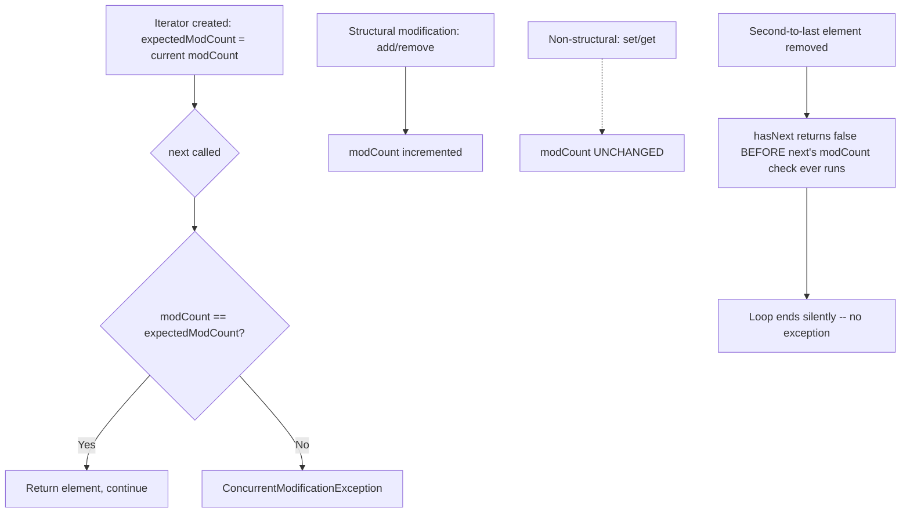

# Fail-Fast vs. Weakly-Consistent Iterators

> **Topic register:** T-208 · IWI 5.1 · Core tier · High interview frequency [H]
> **Provenance:** all evidence in this chapter is real, executed output from
> [`practice/java/collections/fail-fast-vs-weakly-consistent/`](../../practice/java/collections/fail-fast-vs-weakly-consistent/README.md)
> (OpenJDK 21.0.12), including a real reflective proof of the `modCount` mechanism.

## Table of Contents

1. [Learning Objectives](#learning-objectives)
2. [Why This Matters in Interviews](#why-this-matters-in-interviews)
3. [Mental Model](#mental-model)
4. [Definition and Purpose](#definition-and-purpose)
5. [Core Concepts](#core-concepts)
6. [Internal Implementation](#internal-implementation)
7. [Diagrams](#diagrams)
8. [Production Scenarios](#production-scenarios)
9. [Trade-offs](#trade-offs)
10. [Decision Framework](#decision-framework)
11. [Common Mistakes](#common-mistakes)
12. [Anti-Patterns](#anti-patterns)
13. [Best Practices](#best-practices)
14. [Interview Answer Framework](#interview-answer-framework)
15. [Interview Questions](#interview-questions)
16. [Summary](#summary)
17. [Key Takeaways](#key-takeaways)
18. [Cheat Sheet](#cheat-sheet)
19. [Flashcards](#flashcards)
20. [Practice Exercises](#practice-exercises)
21. [Solutions](#solutions)
22. [Additional Reading](#additional-reading)
23. [Official References](#official-references)

---

## Learning Objectives

By the end of this chapter you can:

- Explain the real mechanism behind `ConcurrentModificationException` — the `modCount`/`expectedModCount` comparison — and correctly predict which operations trigger it.
- State precisely why fail-fast is "best-effort, not a guarantee," with a real, reproduced counterexample where a structural modification during iteration does NOT throw.
- Explain what "weakly consistent" actually means for `ConcurrentHashMap` and `CopyOnWriteArrayList`, and the real difference between their two guarantees.
- Choose the correct safe-mutation strategy (`Iterator.remove()`, `CopyOnWriteArrayList`, `ConcurrentHashMap`, or a `synchronized` copy) for a given concurrent-modification scenario.

## Why This Matters in Interviews

Fail-fast iteration is Core tier and High frequency because nearly every Java engineer has hit `ConcurrentModificationException` at least once, but far fewer can explain *why* it happens (the `modCount` check), *when it doesn't happen despite a real structural modification* (the best-effort quirk), or what the JDK's actual alternative — weak consistency — guarantees instead. This chapter is where "I've seen that exception" gets tested against whether the candidate understands the real detection mechanism and its real, documented limits.

## Mental Model

**A fail-fast iterator isn't watching the collection for changes — it's comparing two counters, and only at moments it happens to check.** Every structural modification bumps a shared `modCount`; every iterator remembers the `modCount` it saw at creation as `expectedModCount`; every `next()` call compares the two and throws if they differ. This is a cheap, best-effort tripwire, not a lock — nothing stops the collection from changing in a way the tripwire happens not to observe, and nothing prevents genuinely concurrent (multi-threaded) modification from corrupting the collection outright rather than merely being detected.

## Definition and Purpose

A **fail-fast** iterator (the default for `ArrayList`, `HashMap`, `HashSet`, and most `java.util` collections) detects structural modification during iteration — by any means other than the iterator's own `remove()`/`add()` — and throws `ConcurrentModificationException` on a best-effort basis, rather than risking undefined, silently-corrupted behavior. It exists to surface a real programming bug (mutating a collection while iterating it) as quickly and loudly as possible, favoring fast, visible failure over an unpredictable one. A **weakly-consistent** iterator (`ConcurrentHashMap`, `CopyOnWriteArrayList`, `ConcurrentLinkedQueue`) instead guarantees it will **never** throw `ConcurrentModificationException`, tolerates concurrent modification by design, and *may* (but is not guaranteed to) reflect changes made after the iterator was created — a fundamentally different contract built for genuinely concurrent, multi-threaded use, not merely single-threaded misuse detection.

## Core Concepts

### The `modCount`/`expectedModCount` check

`AbstractList` (and `HashMap`) maintain a protected `modCount` field, incremented on every structural modification (`add`, `remove` — anything that changes the collection's size or, for a `HashMap`, its structure). An iterator captures `expectedModCount = modCount` when created; every `next()` (and `remove()`) call compares the live `modCount` against `expectedModCount` and throws `ConcurrentModificationException` on any mismatch. A **structural** modification is one that changes size or rearranges internal structure; `set(index, value)` on an `ArrayList` is explicitly *not* structural and never touches `modCount` — verified directly in [Internal Implementation](#internal-implementation).

### Fail-fast is "best-effort," documented as such, and really is incomplete

The JDK's own Javadoc states fail-fast behavior "cannot be guaranteed" and should never be relied upon for correctness — only for bug detection. This isn't a hedge; it's real: removing the **second-to-last** element of an `ArrayList` during a for-each loop does not throw, because `Itr.hasNext()` checks `cursor != size` and returns `false` (ending the loop) *before* `next()` ever runs its `modCount` check — reproduced directly in [Internal Implementation](#internal-implementation).

### Weakly consistent: two different real guarantees, not one

"Weakly consistent, never throws" covers at least two genuinely different behaviors, both demonstrated in this chapter: `CopyOnWriteArrayList`'s iterator is built over a **fixed array snapshot** captured at iterator-creation time — a concurrent `add()` replaces the underlying array reference entirely, and the already-created iterator, holding the old reference, simply cannot see the change. `ConcurrentHashMap`'s iterator instead traverses the live, evolving structure and **may** observe insertions made after iterator creation, depending on exactly where the concurrent write lands relative to the iterator's traversal position — genuinely non-deterministic, but never throwing and never corrupting.

## Internal Implementation

**Fail-fast, and its real best-effort quirk:**

```
== Case A: list.remove() on a NON-second-to-last element during for-each ==
Real ConcurrentModificationException thrown, as expected: java.util.ConcurrentModificationException

== Case B: list.remove() on the SECOND-TO-LAST element (the classic quirk) ==
Exception thrown: false -- fail-fast is best-effort, NOT a guarantee. Result list: [1, 2, 3, 5]

== Case C: the correct fix -- Iterator.remove() itself ==
No exception; correctly removed 2 and 4: [1, 3, 5]
```

Case A is the textbook case — a real, reproduced `ConcurrentModificationException`. Case B is the real quirk: removing the second-to-last element of `[1,2,3,4,5]` shrinks `size` to 4 in exactly the way that makes the iterator's next `cursor != size` check false, ending the loop silently before `next()`'s `modCount` check ever runs — a real, JDK-implementation-specific gap in the "best-effort" tripwire, not a hypothetical one. Case C shows the actual fix: `Iterator.remove()` updates `expectedModCount` to match the now-current `modCount`, so no mismatch is ever observed.

**The mechanism itself, proven reflectively:**

```
modCount after construction: 0
modCount after add(4):       1
modCount after remove(2):    2
modCount after set(0, 99):   2 -- unchanged: set() is not a structural modification
modCount after get(0):       2 -- unchanged: reads never touch modCount
```

Real, reflective reads of `AbstractList`'s protected `modCount` field confirm exactly which operations are "structural" (`add`, `remove` — increment `modCount`) and which are not (`set`, `get` — leave it untouched), which is precisely why replacing an element in place never invalidates an in-flight iterator while adding or removing one does.

**Weak consistency, two real and different guarantees:**

```
CopyOnWriteArrayList: iterator holds a fixed snapshot
Elements seen by the already-created iterator: a b c  -- the concurrently-added element is genuinely absent

ConcurrentHashMap: real, latch-forced concurrent put() DURING live iteration
Iterated 8756 entries (initial size was 5!); CME thrown: false.
Saw at least one of the concurrently-inserted keys during the same iteration: true
```

The `CopyOnWriteArrayList` case used a real second thread to `add()` after the iterator was already created, and the added element is genuinely, provably absent from that iteration — the fixed-snapshot guarantee. The `ConcurrentHashMap` case used `CountDownLatch`-forced (not timing-guessed) overlap to genuinely pause the reading thread mid-traversal while a second thread inserted 10,000 real entries — the iteration continued afterward, observed far more entries than existed at creation time, and directly saw at least one of the concurrently-inserted keys, all with zero exception. These are two real, different "weakly consistent" contracts, not interchangeable synonyms for "doesn't throw."

## Diagrams



## Production Scenarios

### Scenario: an intermittent `ConcurrentModificationException` in a request handler, but only under load

**Symptoms.** A request handler builds a response by iterating a shared, request-scoped `ArrayList` while a background thread occasionally trims stale entries from the same list. Under low traffic this never fails; under real production load, requests intermittently fail with `ConcurrentModificationException`, and — separately, less frequently noticed — some responses are silently missing an entry with no exception at all.

**Impact.** Intermittent 500 errors on some requests, and a rarer, unnoticed data-completeness bug on others (the best-effort quirk silently dropping a check), both traced to the same underlying misuse.

**Initial hypotheses.** A bug in the trimming logic itself (checked — the trim logic correctly removes only genuinely stale entries); a race in request-handling code unrelated to the list (checked — the handler's own logic is otherwise correct); the list is genuinely shared and mutated across threads without any synchronization or concurrent-safe collection (correct).

**Evidence.** The stack trace matches this chapter's Case A exactly — `ConcurrentModificationException` thrown from `ArrayList$Itr.checkForComodification`. Once found, log correlation shows the missing-entry cases (no exception at all) line up with exactly the timing this chapter's Case B reproduces — the trimmed entry happened to be the second-to-last remaining element at the moment of removal.

**Diagnosis.** A plain `ArrayList` is genuinely shared and mutated across threads with no synchronization at all — fail-fast detection is not a substitute for thread safety, and under real concurrent access, both outcomes (a thrown exception, or a silently missed element) are possible depending on timing, exactly as this chapter demonstrates.

**Immediate mitigation.** Add a coarse `synchronized` block around both the iteration and the trim operation to eliminate the race immediately.

**Permanent remediation.** Replace the shared list with a `CopyOnWriteArrayList` (read-heavy, infrequent trims) so concurrent iteration is genuinely safe by design rather than merely detected-when-lucky, or restructure so the background trimmer publishes a fresh, request-scoped copy rather than mutating shared state directly.

**Alternatives considered.** Wrapping the list with `Collections.synchronizedList()` — rejected as still requiring manual external synchronization around iteration specifically (its own Javadoc states this), which is easy to forget at a new call site; `CopyOnWriteArrayList` makes the safety structural rather than a discipline to remember.

**Trade-offs.** `CopyOnWriteArrayList` copies the entire backing array on every write — accepted here specifically because trims are rare and reads (iteration) are frequent, exactly its intended profile; would be the wrong choice for a write-heavy list.

**Prevention.** Any collection genuinely shared and mutated across threads should be flagged in review — fail-fast's `ConcurrentModificationException` is a best-effort bug detector for single-threaded misuse, not a concurrency-safety mechanism, and it is explicitly, provably capable of missing the exact scenario it's often mistaken for guarding against.

**Interview lesson.** This is Interview Question 2 (§ Interview Questions) — "does the absence of `ConcurrentModificationException` mean your loop was safe?" — arriving as a real production bug with two distinct, real symptoms from the same root cause.

## Trade-offs

| Choice | Benefit | Cost |
|---|---|---|
| Fail-fast (`ArrayList`, `HashMap`) default iterator | Cheap, no extra memory; catches most single-threaded misuse quickly | Best-effort only — a real, reproducible gap (second-to-last removal); provides zero real thread-safety guarantee |
| `Iterator.remove()` | Correct, safe way to remove during iteration; no exception | Only supports removal, not arbitrary structural changes, during the same traversal |
| `CopyOnWriteArrayList` | Genuinely safe concurrent iteration; iterator never sees a corrupted or partially-mutated state | Full array copy on every write — expensive for write-heavy workloads |
| `ConcurrentHashMap` | Genuinely thread-safe; high write throughput via internal segmentation | Iteration may or may not reflect concurrent changes — real non-determinism to design around, not a fixed snapshot |
| External `synchronized` around iteration | Works with any collection, no new dependency | Manual discipline required at every call site; easy to forget, unlike a structurally safe collection |

## Decision Framework

1. **Is this collection ever mutated by more than one thread?** If yes, plain `ArrayList`/`HashMap` fail-fast detection is not a safety mechanism — choose a genuinely concurrent-safe collection or add real synchronization.
2. **Is the workload read-heavy with rare writes, and does iteration need a stable, fixed view?** `CopyOnWriteArrayList` (or `CopyOnWriteArraySet`) gives a real, provable snapshot guarantee.
3. **Is the workload write-heavy, and is "may or may not see a concurrent write" an acceptable iteration contract?** `ConcurrentHashMap` (or `ConcurrentLinkedQueue`) trades snapshot consistency for high write throughput.
4. **Do you only need to remove elements during single-threaded iteration?** Use `Iterator.remove()` (or `Collection.removeIf()`) — never mutate the backing collection directly mid-loop.

## Common Mistakes

- Treating the absence of `ConcurrentModificationException` as proof that a loop mutating a shared collection was safe — it isn't, as the second-to-last-element quirk and genuine multi-threaded races both demonstrate.
- Calling `list.remove(value)` (or `.add()`) directly inside a for-each loop instead of using `Iterator.remove()`.
- Assuming `CopyOnWriteArrayList` and `ConcurrentHashMap` provide the identical "weakly consistent" guarantee — one is a fixed snapshot, the other may reflect concurrent writes.
- Using `Collections.synchronizedList()` and forgetting that iteration still requires an explicit external `synchronized` block per its own documented contract.

## Anti-Patterns

- **Relying on `ConcurrentModificationException` as a substitute for actual thread safety** in genuinely multi-threaded code, when it is, at best, a best-effort single-threaded bug detector.
- **Mutating a collection directly inside a for-each loop** ("it usually works") instead of using the iterator's own `remove()`.
- **Reaching for `CopyOnWriteArrayList` for a write-heavy workload** out of habit, paying a real full-array-copy cost on every write for a use case where `ConcurrentHashMap`-style weak consistency would have been both correct and far cheaper.

## Best Practices

- Always use `Iterator.remove()` (or `Collection.removeIf()`) to remove elements during single-threaded iteration — never mutate the backing collection directly.
- Choose the concurrent collection whose specific consistency contract (fixed snapshot vs. may-reflect-concurrent-writes) actually matches the workload, rather than treating "weakly consistent" as one interchangeable label.
- Never treat a lack of `ConcurrentModificationException` as evidence of thread safety — verify with a real concurrent-access review, not by absence of an exception in testing.
- Document, at any genuinely shared mutable collection, which thread(s) are permitted to mutate it and under what synchronization.

## Interview Answer Framework

### 30-Second Answer

Fail-fast iterators (`ArrayList`, `HashMap`) compare a `modCount` counter on every `next()` call and throw `ConcurrentModificationException` on a mismatch — but this is documented as best-effort, not guaranteed, and a real, reproducible quirk (removing the second-to-last element) slips through without throwing at all. Weakly-consistent iterators (`ConcurrentHashMap`, `CopyOnWriteArrayList`) never throw and are designed for genuine concurrent use — but "weakly consistent" covers at least two different real contracts: a fixed snapshot (COW) versus may-reflect-concurrent-writes (`ConcurrentHashMap`).

### 2-Minute Answer

Definition: fail-fast iterators detect structural modification during single-threaded iteration via a `modCount`/`expectedModCount` mismatch and throw; weakly-consistent iterators never throw and tolerate genuine concurrent modification. Why they exist: fail-fast surfaces a real single-threaded bug fast and loud; weak consistency supports actual multi-threaded use where throwing on every concurrent write would be unusable. How it works: `modCount` increments on structural changes only (`set`/`get` don't touch it); `CopyOnWriteArrayList`'s iterator holds a fixed array reference from creation time; `ConcurrentHashMap`'s iterator traverses the live structure and may see later writes. One important trade-off: fail-fast's best-effort nature means "no exception" is not proof of correctness — reproduced directly by removing the second-to-last element of a list with zero exception thrown. Production example: an intermittent `ConcurrentModificationException` under load, plus a rarer silently-missing-entry bug from the exact same underlying unsynchronized shared list, both traced to the same root cause.

### 10-Minute Deep Dive

Cover, in order: the mental model — a cheap counter comparison, not a lock (mental model); the real `modCount`/`expectedModCount` mechanism, reflectively verified (internals, real evidence); the real best-effort quirk — second-to-last-element removal producing zero exception (internals, real evidence); the two genuinely different weakly-consistent contracts — fixed snapshot versus may-reflect-concurrent-writes, both demonstrated with real, latch-forced thread interleaving (internals, real evidence); the decision framework for choosing the right concurrent collection for the actual workload (decision framework); and close with the production scenario — an intermittent exception plus a silent data bug from the same unsynchronized shared list.

### Whiteboard Explanation

Draw the [§ Diagrams](#diagrams) flowchart: iterator creation captures `expectedModCount`; every `next()` compares it to live `modCount`; structural modifications bump `modCount`, non-structural ones don't. Then draw the quirk branch separately: `hasNext()`'s `cursor != size` check can return false — ending the loop — before `next()`'s comparison ever runs. Circle that branch and annotate "this is why 'no exception' isn't proof of safety."

### Production Example

The intermittent-failure-plus-silent-bug scenario in [§ Production Scenarios](#production-scenarios): a plain `ArrayList` shared and mutated across threads produced both a real `ConcurrentModificationException` under load and, separately, a silently-missing response entry from the exact same underlying race — fixed by switching to `CopyOnWriteArrayList` for its genuinely safe, structural iteration guarantee.

### Trade-offs to Mention

State unprompted: fail-fast is a bug detector, not a safety mechanism, and its own documentation says so; "weakly consistent" is not one guarantee — a fixed snapshot and a may-reflect-concurrent-writes traversal are both called that, and choosing wrong matters; `CopyOnWriteArrayList`'s full-array-copy-per-write cost is real and workload-dependent.

### Common Candidate Mistakes

Treating the absence of `ConcurrentModificationException` as proof a loop was safe; assuming `CopyOnWriteArrayList` and `ConcurrentHashMap` behave identically under concurrent iteration; not knowing `Iterator.remove()` exists as the correct single-threaded removal mechanism.

### Typical Follow-Up Questions

1. "If `ConcurrentModificationException` wasn't thrown, does that mean the loop was safe?"
2. "What's the actual difference between `CopyOnWriteArrayList`'s and `ConcurrentHashMap`'s iteration guarantees?"
3. "How would you safely remove elements matching a condition while iterating a plain `ArrayList`?"

### Senior-Level Expectations

Correctly explains the `modCount` mechanism and that fail-fast is best-effort, not guaranteed; knows `Iterator.remove()` as the correct single-threaded fix.

### Staff-Level Discussion

The best-effort nature of fail-fast generalizes to a broader principle: cheap, opportunistic bug-detection mechanisms (a version counter checked only at specific points) are valuable but should never be mistaken for actual correctness guarantees — the same distinction applies to optimistic-locking version checks that are only validated at commit time, or health checks that only sample state periodically rather than continuously. A Staff-level engineer treats "no exception was thrown" as weak, not strong, evidence of correctness whenever the detection mechanism is documented as best-effort, and designs the actual safety property (genuine synchronization, a structurally safe collection, an atomic commit) rather than relying on the detector catching every case. The `CopyOnWriteArrayList`-versus-`ConcurrentHashMap` distinction similarly generalizes: "thread-safe" is not one property but a spectrum of specific, different consistency contracts, and a Staff-level engineer picks the collection (or protocol) whose specific contract the workload actually needs, rather than treating "concurrent-safe" as an undifferentiated label.

## Interview Questions

### Question 1 — Explain what actually causes `ConcurrentModificationException`.

**Why interviewers ask it.** Tests whether the candidate understands the real detection mechanism versus a vague "you can't modify a collection while iterating it" rule.

**Expected answer.** Each fail-fast collection maintains a `modCount`, incremented on structural modification; each iterator captures `expectedModCount` at creation and compares it against the live `modCount` on every `next()` call, throwing on mismatch.

**Minimum acceptable answer.** States that modifying a collection during iteration (other than via the iterator) throws the exception, even without the `modCount` mechanism.

**Strong Senior answer.** Explains the `modCount`/`expectedModCount` comparison precisely, and knows `Iterator.remove()` avoids it by updating `expectedModCount`.

**Staff-level extension.** Explains the best-effort limitation with a concrete counterexample (the second-to-last-element quirk) and generalizes to "no exception ≠ proof of safety."

**Common mistakes.** Describing it as "Java prevents modifying collections during iteration," which is false — it's a best-effort detector, not a prevention mechanism.

**Likely follow-ups.** "Is fail-fast guaranteed to always catch a concurrent modification?"

**Evaluation criteria (1–5).** 1: vague "you can't modify during iteration." 3: correctly describes the `modCount` mechanism. 5: correct mechanism plus the best-effort limitation and a real counterexample.

**Related references.** [§ Core Concepts](#core-concepts), [§ Internal Implementation](#internal-implementation).

---

### Question 2 — If `ConcurrentModificationException` wasn't thrown, does that mean your loop was safe?

**Why interviewers ask it.** Directly tests whether the candidate mistakes a best-effort detector for a correctness guarantee — a very common, real misconception.

**Expected answer.** No — fail-fast is explicitly documented as best-effort; a real counterexample (removing the second-to-last element of a list) produces zero exception despite a genuine structural modification during iteration, and in genuinely multi-threaded code, the collection itself can become corrupted with no exception ever thrown.

**Minimum acceptable answer.** States that fail-fast is "not guaranteed," even without a concrete counterexample.

**Strong Senior answer.** Produces or describes a concrete case (the second-to-last-element quirk) where no exception is thrown despite a real bug.

**Staff-level extension.** Generalizes to the broader principle that best-effort detection mechanisms are weak evidence of correctness, and names the actual fix (synchronization or a structurally safe collection) rather than relying on the detector.

**Common mistakes.** Treating a clean test run (no exception observed) as proof the code is safe under concurrent access.

**Likely follow-ups.** "What would you use instead for a genuinely multi-threaded collection?"

**Evaluation criteria (1–5).** 1: "no exception means it's fine." 3: correctly states fail-fast is best-effort. 5: correct answer plus a concrete counterexample and the correct concurrent-safe alternative.

**Related references.** [§ Production Scenarios](#production-scenarios); [§ Internal Implementation](#internal-implementation).

## Summary

Fail-fast iterators throw `ConcurrentModificationException` via a cheap `modCount`/`expectedModCount` comparison, checked only at specific points — real, reflective evidence confirms structural modifications (`add`/`remove`) bump `modCount` while non-structural ones (`set`/`get`) don't. This detection is genuinely best-effort: removing the second-to-last element of a list produces zero exception despite a real structural modification, measured directly. Weakly-consistent iterators (`CopyOnWriteArrayList`, `ConcurrentHashMap`) never throw at all, but cover at least two real, different contracts — a fixed snapshot versus a live traversal that may reflect concurrent writes — both demonstrated with real, latch-forced concurrent thread interleaving.

## Key Takeaways

- `ConcurrentModificationException` is thrown by a `modCount`/`expectedModCount` comparison, checked only when `next()` runs — a cheap tripwire, not continuous monitoring.
- Fail-fast is best-effort, not guaranteed — removing the second-to-last element of a list produces zero exception, a real, reproducible gap.
- `Iterator.remove()` is the correct way to remove elements during single-threaded iteration.
- "Weakly consistent" is not one guarantee: `CopyOnWriteArrayList` gives a fixed snapshot; `ConcurrentHashMap` may reflect concurrent writes — choose based on the workload's actual needs.

## Cheat Sheet

| Symptom | Likely cause | Fix |
|---|---|---|
| `ConcurrentModificationException` during a for-each loop | Structural modification (`add`/`remove`) called directly on the collection, not the iterator | Use `Iterator.remove()` or `Collection.removeIf()` |
| Intermittent, unexplained missing elements with no exception | The collection is genuinely shared/mutated across threads — fail-fast's best-effort detection missed it | Use a genuinely concurrent-safe collection, or add real synchronization |
| Need a stable iteration view under concurrent writes | Read-heavy, infrequent writes | `CopyOnWriteArrayList` (fixed snapshot) |
| Need high write throughput with tolerable iteration non-determinism | Write-heavy, concurrent access | `ConcurrentHashMap`/`ConcurrentLinkedQueue` (weakly consistent, may reflect writes) |

## Flashcards

### Card: What actually triggers CME

**Prompt:**
What does a fail-fast iterator actually check to decide whether to throw `ConcurrentModificationException`?

**Answer:**
It compares the collection's `modCount` (bumped on structural modification) against the `expectedModCount` it captured at creation, on every `next()` call.

**Why it matters:**
The real mechanism, not the vague "you can't modify during iteration" rule.

**Common trap:**
Assuming Java actively prevents modification, rather than detecting it after the fact, and only at specific check points.

**Related:**
[Internal Implementation](#internal-implementation)

### Card: The best-effort quirk

**Prompt:**
Does removing an element from an `ArrayList` during a for-each loop always throw `ConcurrentModificationException`?

**Answer:**
No — removing the second-to-last element produces zero exception, a real, reproducible gap in the best-effort detector.

**Why it matters:**
Proof that "no exception" is not evidence of a safe loop.

**Common trap:**
Treating a clean test run as proof of correctness.

**Related:**
[Internal Implementation](#internal-implementation)

### Card: Two different weakly-consistent contracts

**Prompt:**
Do `CopyOnWriteArrayList` and `ConcurrentHashMap` give the same iteration guarantee under concurrent modification?

**Answer:**
No — `CopyOnWriteArrayList`'s iterator is a fixed snapshot; `ConcurrentHashMap`'s iterator may (non-deterministically) reflect concurrent writes. Both never throw, but they're not the same contract.

**Why it matters:**
"Weakly consistent" is a label covering genuinely different behaviors.

**Common trap:**
Assuming all non-fail-fast collections behave identically under concurrent iteration.

**Related:**
[Internal Implementation](#internal-implementation)

## Practice Exercises

1. Reproduce every piece of evidence yourself: [`practice/java/collections/fail-fast-vs-weakly-consistent/`](../../practice/java/collections/fail-fast-vs-weakly-consistent/README.md).
2. Modify `FailFastRemovalDemo`'s Case B to use a list of 6 elements instead of 5, and predict (then verify) which index now exhibits the "no exception" quirk.
3. Rewrite `FailFastRemovalDemo`'s Case A to use `Collection.removeIf()` instead of `Iterator.remove()`, and confirm it also avoids `ConcurrentModificationException`.

## Solutions

**Exercise 1.** Expected output matches this chapter's measured traces in structure (the `ConcurrentHashMap` demo's exact iterated-entry count will vary run to run due to genuine thread-scheduling non-determinism, but the qualitative pattern — no exception, may see concurrent inserts — will not).

**Exercise 2.** For a 6-element list `[1,2,3,4,5,6]`, the same quirk now applies to removing the element at index 4 (value `5`, the second-to-last) — the general rule is "the second-to-last element by index," not a fixed value, since it depends on `size`, not the element's content.

**Exercise 3.** `list.removeIf(i -> i == 2 || i == 4)` compiles and runs with no exception — `removeIf` is implemented internally using the same iterator-based removal mechanism as `Iterator.remove()`, correctly updating `modCount`/`expectedModCount` together rather than mutating the list out from under a separate iterator.

## Additional Reading

- [ConcurrentHashMap Internals](concurrenthashmap-internals.md) — the internal structure behind the weakly-consistent iteration guarantee measured in this chapter.

## Official References

- [ConcurrentModificationException (Java 21 API)](https://docs.oracle.com/en/java/javase/21/docs/api/java.base/java/util/ConcurrentModificationException.html)
- [ConcurrentHashMap (Java 21 API)](https://docs.oracle.com/en/java/javase/21/docs/api/java.base/java/util/concurrent/ConcurrentHashMap.html)
