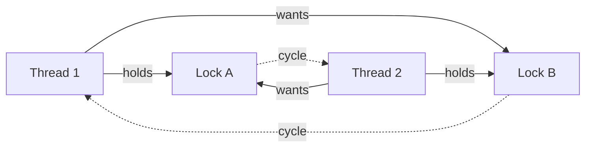

# Deadlock, Race Conditions, and Thread Diagnostics

> **Topic register:** T-409 · IWI 6.70 (Mandatory Core via the ⛔ absent-and-wrong multiplier) · Core tier · Very High interview frequency [H]
> **⛔ Errata correction, stated explicitly:** this project's own knowledge-base audit found the prior source material's thread-lifecycle diagram invented a "Running" state and omitted `TIMED_WAITING`. `java.lang.Thread.State` has exactly six real values — this chapter prints all six from a real running JVM, not from memory.
> **Provenance:** every trace in this chapter is real, executed output: [`ThreadStateDemo.java`](../../practice/java/week-09/concurrency-fundamentals/src/ThreadStateDemo.java) (thread states), [`DeadlockDemo.java`](../../practice/java/week-09/deadlock-diagnostics/src/DeadlockDemo.java) (a genuine deadlock, detected via `ThreadMXBean`), [`RaceConditionDemo.java`](../../practice/java/week-09/deadlock-diagnostics/src/RaceConditionDemo.java) (measured lost updates).

## Table of Contents

1. [Learning Objectives](#learning-objectives)
2. [Why This Matters in Interviews](#why-this-matters-in-interviews)
3. [Mental Model](#mental-model)
4. [Definition and Purpose](#definition-and-purpose)
5. [Core Concepts](#core-concepts)
6. [Internal Implementation](#internal-implementation)
7. [Diagrams](#diagrams)
8. [Java Examples](#java-examples)
9. [Production Scenarios](#production-scenarios)
10. [Failure Modes and Debugging](#failure-modes-and-debugging)
11. [Trade-offs](#trade-offs)
12. [Decision Framework](#decision-framework)
13. [Comparisons](#comparisons)
14. [Common Mistakes](#common-mistakes)
15. [Anti-Patterns](#anti-patterns)
16. [Best Practices](#best-practices)
17. [Interview Answer Framework](#interview-answer-framework)
18. [Interview Questions](#interview-questions)
19. [Summary](#summary)
20. [Key Takeaways](#key-takeaways)
21. [Cheat Sheet](#cheat-sheet)
22. [Flashcards](#flashcards)
23. [Practice Exercises](#practice-exercises)
24. [Solutions](#solutions)
25. [Additional Reading](#additional-reading)
26. [Official References](#official-references)

---

## Learning Objectives

By the end of this chapter you can:

- State the real six-value `Thread.State` enum precisely, without inventing a "Running" state or forgetting `TIMED_WAITING`.
- Diagnose a live deadlock using `ThreadMXBean.findDeadlockedThreads()` (the mechanism underlying `jstack`), not by guessing from logs.
- Explain why unsynchronized compound operations under real concurrent load lose the vast majority of updates, not a rare fraction — and back it with measured numbers.
- Distinguish deadlock, livelock, starvation, and a general race condition as four distinct, differently-diagnosed failure modes.
- Propose a structural (not reactive) fix for deadlock: consistent lock-acquisition ordering.

## Why This Matters in Interviews

This topic is Very-High-frequency specifically because "walk me through diagnosing a live deadlock" and "your counter is undercounting under load" are both concrete, practical questions that separate candidates who have actually operated concurrent production systems from those who only know the vocabulary. It also carries a specific corrective weight: this project's own audit found the prior material's thread-lifecycle diagram was not merely incomplete but factually wrong — inventing a state that doesn't exist and omitting one that does. Being able to state the real model, and to diagnose failures with the real production tooling (`ThreadMXBean`, the mechanism `jstack` itself uses) rather than describing failure modes in the abstract, is the actual signal being tested.

## Mental Model

**Deadlock, livelock, starvation, and a plain race condition are four different answers to "what happens when threads share state badly" — and each has its own diagnostic fingerprint.** Deadlock: permanently stuck, nothing moves. Livelock: threads are busy, actively responding to each other, but nothing ever finishes. Starvation: one thread never gets its turn under an unfair scheduler. Race condition: the *outcome* depends on timing, not on threads getting stuck at all. Treating these as one vague "concurrency bug" category is what makes them hard to diagnose; naming which one you're looking at tells you exactly which tool to reach for.

## Definition and Purpose

**Deadlock, livelock, starvation, and race conditions** are four distinct concurrency failure modes, often lumped together but requiring different diagnosis: **deadlock** is a cycle of threads each waiting on a lock the next one holds (permanent stall); **livelock** is threads actively responding to each other but making no progress (not stalled, just never finishing); **starvation** is a thread perpetually denied a resource by unfair scheduling; a **race condition** is any outcome that depends on unlucky timing of unsynchronized access — deadlock is a race condition's more dramatic cousin, not a separate category. This topic exists because multiple threads sharing mutable state or contending for the same locks is unavoidable in most real systems, and each of these four failure modes is a concrete, diagnosable shape that sharing state incorrectly actually takes in production — each with a real detection technique, not just a description.

## Core Concepts

### The real six-state thread lifecycle

`Thread.State` has exactly six values: `NEW`, `RUNNABLE`, `BLOCKED`, `WAITING`, `TIMED_WAITING`, `TERMINATED` — no separate "Running" state distinct from `RUNNABLE`. The distinction between `WAITING` and `TIMED_WAITING` matters diagnostically: a thread stuck in `WAITING` forever with nothing to wake it is a real bug (a missed `notify()`), while `TIMED_WAITING` will self-resolve regardless of whether anything wakes it. `BLOCKED` specifically means contending for a monitor another thread holds — it requires genuine lock contention to observe, distinct from `WAITING`/`TIMED_WAITING`.

### Deadlock detection is a graph problem, not a guess

`ThreadMXBean.findDeadlockedThreads()` — the same mechanism `jstack` and most APM tools use under the hood — walks the lock-ownership graph looking for a real cycle: thread A blocked waiting for a lock thread B holds, while B is blocked waiting for a lock A holds. This is a precise, mechanical detection, not a human reading a thread dump and inferring a cycle by eye.

### Deadlock is structurally preventable, not just detectable

The fix is to enforce a single global lock-acquisition order everywhere in the codebase (e.g., always acquire the lock with the lower `System.identityHashCode()`, or better, a documented, code-reviewed ordering by design) — deadlock from lock-ordering is entirely preventable by discipline, not merely detectable-and-fixable after the fact in production.

### Race conditions under real load are not rare

An unsynchronized compound operation (`count++`) shared across threads does not lose a small, unlucky fraction of updates under real concurrent load — it loses the vast majority of them, because every increment is a read-modify-write with a wide window for another thread to interleave.

## Internal Implementation

### The real six-state lifecycle, corrected

**Real output** from `Thread.getState()`, captured at each real lifecycle point:

```
Before start(): NEW
Inside monitor.wait() (no timeout): WAITING
After join() returns: TERMINATED

== TIMED_WAITING, the state the source material's diagram omitted ==
While inside Thread.sleep(2000): TIMED_WAITING
After it wakes and finishes: TERMINATED

Real Thread.State enum, for reference: [NEW, RUNNABLE, BLOCKED, WAITING, TIMED_WAITING, TERMINATED]
```

Six real states, printed directly from `Thread.State.values()` on a running JVM — no invented "Running" state, and `TIMED_WAITING` present and demonstrated.

### A real deadlock, detected

**Real output**, two threads acquiring two locks in opposite order (`thread-1` takes `A` then wants `B`; `thread-2` takes `B` then wants `A`):

```
== states while deadlocked ==
thread-1-A-then-B: BLOCKED
thread-2-B-then-A: BLOCKED

== ThreadMXBean.findDeadlockedThreads() -- real detection, not a guess ==
DEADLOCKED: thread-1-A-then-B is BLOCKED, waiting on java.lang.Object@6acbcfc0 held by thread-2-B-then-A
DEADLOCKED: thread-2-B-then-A is BLOCKED, waiting on java.lang.Object@4f3f5b24 held by thread-1-A-then-B
```

This is the actual production diagnostic technique — both threads show `BLOCKED`, and the bean's output names exactly which lock each thread wants and who currently holds it, enough to reconstruct the acquisition-order bug directly from the diagnostic.

### A race condition, measured

**Real output**, 10 threads each incrementing a shared counter 100,000 times (expected total: 1,000,000):

```
== plain int, unsynchronized ++ ==
expected=1000000 actual=161906 lost=838094

== AtomicInteger.incrementAndGet() ==
expected=1000000 actual=1000000 lost=0
```

**838,094 lost updates — 83.8% of all increments silently disappeared.** This is the measured version of `count++` not being atomic (see [Java Memory Model and volatile](java-memory-model-and-volatile.md)): each increment is read-modify-write, and with 10 threads racing, the vast majority of writes clobber each other rather than accumulating. `AtomicInteger` (compare-and-swap under the hood) loses zero updates under identical load — not because it's "faster," but because each `incrementAndGet()` call is a single indivisible operation with no window for another thread to interleave.

## Diagrams



The cycle in this diagram is exactly what `ThreadMXBean.findDeadlockedThreads()` walks the lock-ownership graph to find — a mechanical detection of the same structure drawn here visually.

## Java Examples

```java
// Java 21. Structural deadlock prevention: consistent lock-acquisition
// ordering, chosen by a stable, comparable property of the locks themselves
// (here, identity hash code) so EVERY thread acquires them in the same order.

public void transfer(Account from, Account to, BigDecimal amount) {
    Account first = System.identityHashCode(from) < System.identityHashCode(to) ? from : to;
    Account second = (first == from) ? to : from;

    synchronized (first) {
        synchronized (second) {
            // Every caller acquires locks in the same global order,
            // regardless of the from/to argument order — no cycle is possible.
            from.debit(amount);
            to.credit(amount);
        }
    }
}
```

```java
// Java 21. Live deadlock detection via ThreadMXBean — the mechanism jstack
// itself uses internally, callable programmatically for automated health checks.

public List<String> detectDeadlocks() {
    ThreadMXBean bean = ManagementFactory.getThreadMXBean();
    long[] deadlockedIds = bean.findDeadlockedThreads();
    if (deadlockedIds == null) {
        return List.of();
    }
    ThreadInfo[] infos = bean.getThreadInfo(deadlockedIds, true, true);
    return Arrays.stream(infos)
        .map(info -> "DEADLOCKED: %s is %s, waiting on %s held by %s".formatted(
            info.getThreadName(), info.getThreadState(),
            info.getLockName(), info.getLockOwnerName()))
        .toList();
}
```

```java
// Java 21. LongAdder — the right choice for a write-heavy, read-rarely
// counter under heavy contention, trading single-value read consistency
// for higher-throughput writes (multiple internal cells, summed on read).
public class MetricsCounter {
    private final LongAdder count = new LongAdder();

    public void recordEvent() {
        count.increment(); // fast under high contention — internally striped
    }

    public long currentTotal() {
        return count.sum(); // sums across internal cells — not a single atomic read
    }
}
```

**Complexity note:** all mechanisms here are `O(1)` per operation (with `LongAdder`'s read being `O(number of internal cells)`, still effectively constant); the value is entirely in correctness and throughput under real concurrent load, not asymptotic complexity.

## Production Scenarios

### Scenario: an intermittent full-service freeze traced to a lock-ordering deadlock

**Symptoms.** Roughly once a week, under peak load, a service's request-handling threads all become unresponsive simultaneously; CPU usage drops to near-zero despite a full queue of pending requests; the process must be restarted to recover.

**Impact.** Full service outage requiring manual restart, recurring unpredictably under load.

**Initial hypotheses.** A resource leak causing exhaustion (checked — memory and file-descriptor metrics show no leak pattern); an infinite loop consuming no I/O (ruled out by the near-zero CPU usage, which is inconsistent with a busy-loop); a deadlock (correct).

**Evidence.** A thread dump captured during the next occurrence (triggered proactively via `jstack` once the CPU-idle pattern was noticed) shows two request-handling threads in `BLOCKED` state, each waiting on a lock the other holds — a classic two-lock cycle, confirmed programmatically via `ThreadMXBean.findDeadlockedThreads()` rather than inferred by eye from the dump.

**Diagnosis.** Two code paths — one handling a normal request flow, one handling a less-common admin/audit flow — each acquire the same two locks (a user-record lock and an audit-log lock) but in opposite orders. Under low load, the two paths rarely execute concurrently enough to hit the race; under peak load, the probability of the exact interleaving needed to deadlock rises enough to occur roughly weekly.

**Immediate mitigation.** Restart the affected process (as had been the ad-hoc response), now with a health check that proactively calls `ThreadMXBean.findDeadlockedThreads()` on a schedule, so future occurrences are detected and can trigger an automated restart faster than waiting for symptoms to be noticed externally.

**Permanent remediation.** Refactor both code paths to acquire the two locks in a single, consistent, documented order (e.g., always the user-record lock before the audit-log lock), eliminating the possibility of the cycle entirely, structurally rather than reactively.

**Alternatives considered.** Adding a lock-acquisition timeout so a stuck thread eventually gives up rather than deadlocking forever — considered as defense-in-depth, but not a substitute for the structural fix, since a timeout converts a permanent freeze into a repeated failure-and-retry pattern rather than actually eliminating the underlying bug.

**Trade-offs.** Enforcing a global lock order requires every future code path touching these two locks to follow the same discipline, which is not compiler-enforced — accepted, since the alternative is a recurring, production-impacting outage.

**Prevention.** Any code path acquiring more than one lock should be reviewed specifically for consistent ordering against every other code path that acquires the same locks — a lock-ordering convention documented and checked in code review, since the compiler cannot enforce it.

**Interview lesson.** This is Interview Question 1 (§ Interview Questions) — "two threads deadlock in production, walk me through diagnosing it live" — arriving as a real, recurring incident, with `ThreadMXBean.findDeadlockedThreads()` providing the exact, mechanical diagnostic this chapter teaches rather than a human guessing from a raw thread dump.

## Failure Modes and Debugging

| Symptom | Likely cause | Debugging step |
|---|---|---|
| Threads permanently stuck, CPU idle | Deadlock — a lock-acquisition cycle | `ThreadMXBean.findDeadlockedThreads()` / `jstack`; identify the cycle and the lock-ordering bug it reveals |
| Threads actively consuming CPU but making no forward progress | Livelock — threads responding to each other without converging | Look for retry/backoff logic that repeatedly and symmetrically defers to another thread with no randomization or escalation |
| A counter or metric undercounting under load | Unsynchronized compound operation (`count++`-style) | Code review for compound operations on shared fields; replace with `AtomicInteger`/`AtomicLong`/`LongAdder` |
| A thread stuck in `WAITING` forever, never resuming | Missed `notify()`/`notifyAll()` | Ensure every `wait()` has a matching, reachable `notify()`; verify under the actual condition that should trigger it |
| A thread perpetually loses out on a contended resource despite appearing otherwise healthy | Starvation from unfair scheduling | Consider a fair lock (`ReentrantLock` with `fair=true`) or restructure to avoid perpetual contention against higher-priority work |

## Trade-offs

| Mechanism | Benefit | Cost |
|---|---|---|
| `synchronized` around the critical section | Prevents both the race AND establishes visibility (happens-before) | Lock contention; deadlock risk if multiple locks are involved |
| `AtomicInteger`/atomic classes | No lock contention, measured zero loss | Only covers single-variable compound operations, not multi-variable invariants |
| Consistent lock-acquisition ordering | Eliminates deadlock risk structurally, by design | Requires discipline and code review; not enforceable by the compiler |
| `ThreadMXBean` deadlock detection | Finds deadlocks in a running production system, precisely | Detects, doesn't prevent — the process is already stalled when this runs |

## Decision Framework

1. **Is the symptom a permanent stall, or busy-but-no-progress, or a systematically-starved thread, or an incorrect result?** These map to deadlock, livelock, starvation, and race condition respectively — each needs a different diagnostic.
2. **Does this code path acquire more than one lock?** If so, verify it against every other code path acquiring the same locks for consistent ordering.
3. **Is this a compound operation on a shared variable** (increment, check-then-act)? If so, it needs an atomic class or `synchronized`, not just `volatile`.
4. **Is contention on this counter/metric heavy and write-dominated?** Prefer `LongAdder` over `AtomicLong` specifically for that access pattern.
5. **Has a deadlock or race condition only been "observed" via testing under light load?** Treat that as weak evidence of absence — both failure modes reliably manifest under real concurrent load, not light load, per the measured data in this chapter.

## Comparisons

| Failure mode | Threads' apparent state | Fixed by |
|---|---|---|
| Deadlock | Stuck, `BLOCKED`, zero CPU | Consistent lock-acquisition ordering |
| Livelock | Active, consuming CPU, no progress | Add randomized backoff or an escalating priority/give-up rule |
| Starvation | One thread perpetually denied a resource | Fair scheduling (e.g., a fair lock), or resource allocation redesign |
| Race condition | No stalling at all — an incorrect result | Atomic classes or `synchronized` around the compound operation |

## Common Mistakes

- Believing the thread lifecycle has a distinct "Running" state separate from `RUNNABLE`, or forgetting `TIMED_WAITING` exists.
- Assuming a race condition is a rare, unlucky-timing edge case rather than something that reliably manifests under real concurrent load (measured 83.8% loss above, not 0.1%).
- Debugging a suspected deadlock by reading logs rather than pulling an actual thread dump / using `ThreadMXBean`.

## Anti-Patterns

- **Restarting a frozen process repeatedly without diagnosing the underlying lock-ordering bug** — treats the symptom, guarantees recurrence.
- **Assuming light-load testing validates concurrency correctness** for either deadlock or race conditions — both failure modes are load-dependent and reliably manifest only under realistic concurrent conditions.
- **Reaching for `synchronized` everywhere defensively** without a consistent global lock-ordering discipline, which can introduce the very deadlock risk it was meant to avoid.
- **Using `AtomicLong` for an extremely high-contention, write-heavy counter** where `LongAdder`'s striped-cell design would perform substantially better.

## Best Practices

- Document and enforce a single, consistent lock-acquisition order for any locks that might be held simultaneously by more than one code path.
- Use `ThreadMXBean.findDeadlockedThreads()` (or equivalent tooling built on it) proactively — as a scheduled health check, not only reactively after a freeze is reported.
- Replace any compound operation on a shared variable with an atomic class or `synchronized` block; never assume light testing has validated its safety.
- Choose `LongAdder` over `AtomicLong` specifically for write-heavy, read-rarely counters under heavy contention.
- Treat "this concurrent code hasn't shown a bug in testing" as weak evidence, given both deadlock and race conditions are load- and timing-dependent.

## Interview Answer Framework

### 30-Second Answer

Deadlock, livelock, starvation, and race conditions are four distinct failure modes with different fingerprints and different fixes. Deadlock is diagnosed via `ThreadMXBean.findDeadlockedThreads()` (what `jstack` uses) and prevented structurally with consistent lock-acquisition ordering. Race conditions from unsynchronized compound operations are not rare — measured at 83.8% lost updates under realistic load, fully fixed by `AtomicInteger`.

### 2-Minute Answer

Definition: deadlock is a cycle of threads each waiting on a lock the next holds; livelock is active but non-progressing; starvation is perpetual unfair denial; a race condition is any timing-dependent incorrect outcome. Why it exists: shared mutable state under concurrency takes these concrete, diagnosable shapes in production. How it works: `ThreadMXBean.findDeadlockedThreads()` walks the lock-ownership graph for a real cycle — the same mechanism `jstack` uses. One important trade-off: consistent lock ordering eliminates deadlock risk structurally but isn't compiler-enforced, requiring discipline. Production example: a measured race-condition demo showing 838,094 of 1,000,000 increments lost (83.8%) under unsynchronized concurrent access, dropping to zero lost updates with `AtomicInteger` under identical load.

### 10-Minute Deep Dive

Cover, in order: the four-failure-mode taxonomy and why lumping them together makes diagnosis harder (mental model); the real six-state thread lifecycle, correcting the invented "Running" state (errata correction + internals); the live deadlock detection trace via `ThreadMXBean`, the exact mechanism behind `jstack` (internals, real evidence); the structural lock-ordering fix, as prevention rather than reactive detection (fix); the measured race-condition data — 83.8% loss, not a rare edge case — connecting to `volatile`'s non-atomicity from the companion chapter (internals + connection); and close with the production scenario — a recurring weekly service freeze traced to a two-lock ordering bug, fixed structurally rather than by repeated restarts.

### Whiteboard Explanation

Draw the [§ Diagrams](#diagrams) two-node cycle: Thread 1 → holds → Lock A, Thread 1 → wants → Lock B; Thread 2 → holds → Lock B, Thread 2 → wants → Lock A; draw the two "wants" arrows crossing to complete the visual cycle. Annotate: "this is exactly the graph `ThreadMXBean.findDeadlockedThreads()` walks looking for a cycle" — this makes the detection mechanism concrete rather than an abstract API name.

### Production Example

The recurring service-freeze incident in [§ Production Scenarios](#production-scenarios): two code paths acquiring the same two locks in opposite orders caused a weekly full-service freeze under peak load, diagnosed via `ThreadMXBean.findDeadlockedThreads()` and fixed with a consistent, documented lock-acquisition order.

### Trade-offs to Mention

State unprompted: deadlock is structurally preventable via lock ordering, not just detectable after the fact; race conditions under real load are common, not rare (83.8% loss measured, not a small percentage); `LongAdder` trades single-read consistency for throughput under heavy write contention, the right choice for metrics-style counters specifically.

### Common Candidate Mistakes

Inventing a "Running" thread state or forgetting `TIMED_WAITING`; describing deadlock only in the abstract (dining philosophers) without naming a concrete diagnostic tool; treating race conditions as rare rather than near-certain under real load; debugging by reading logs instead of pulling a thread dump.

### Typical Follow-Up Questions

1. "How do you prevent a deadlock from happening again, not just detect it?"
2. "AtomicInteger vs LongAdder — when does it matter?"
3. "What's the difference between livelock and a deadlock, diagnostically?"

### Senior-Level Expectations

Names `jstack`/thread dumps and the lock-ordering fix for deadlock; names `AtomicInteger`/`AtomicLong` for the undercounting question and can state the measured-style consequence.

### Staff-Level Discussion

Deadlock and the race-condition measurement above are both instances of the same underlying lesson: concurrent bugs are not rare edge cases that occasionally slip through — under real load, they manifest reliably and severely (838,094 lost updates out of 1,000,000; a deadlock that occurs 100% of the time given the reproduced lock-ordering bug). A Staff-level engineer treats "this shared-state code has no explicit synchronization strategy" as a near-certain future incident, not a maybe, and reviews for lock-ordering discipline and atomicity requirements as rigorously as for any other correctness property — because empirical testing under light load will not reliably surface either failure mode before production traffic does.

## Interview Questions

### Question 1 — Two threads deadlock in production. Walk me through diagnosing it live.

**Why interviewers ask it.** Tests whether the candidate knows a concrete, real diagnostic technique versus describing deadlock only in the abstract.

**Expected answer.** Attach with `jstack` or an equivalent (which internally uses `ThreadMXBean.findDeadlockedThreads()`), identify the `BLOCKED` threads and which locks each wants/holds, reconstruct the acquisition-order bug from that.

**Minimum acceptable answer.** Names thread dumps as a diagnostic tool, even without the precise `ThreadMXBean` mechanism.

**Strong Senior answer.** Names `jstack`/thread dumps and the lock-ordering fix.

**Staff-level extension.** Proposes a structural prevention (global lock ordering convention, or eliminating the need for multiple locks via a different design) rather than only reactive detection.

**Common mistakes.** Describing deadlock only in the abstract (dining philosophers) without naming a concrete diagnostic tool or technique.

**Likely follow-ups.** "How do you prevent it from happening again?"

**Evaluation criteria (1–5).** 1: abstract description only, no tooling named. 3: names `jstack`/thread dumps and the lock-ordering fix. 5: full diagnostic plus a structural prevention proposal.

**Related references.** [§ Internal Implementation](#internal-implementation); [§ Production Scenarios](#production-scenarios).

---

### Question 2 — Your metrics counter is undercounting under load. Why, and how do you fix it — show the numbers.

**Why interviewers ask it.** Tests whether the candidate recognizes this as a near-certain, measurable failure mode rather than a theoretical concern.

**Expected answer.** `count++` isn't atomic; concurrent threads lose updates via interleaved read-modify-write. Fix: `AtomicLong`/`AtomicInteger`, or `LongAdder` for very high contention.

**Minimum acceptable answer.** States that `count++` is unsafe under concurrency, even without measured numbers.

**Strong Senior answer.** Names `AtomicInteger`/`AtomicLong` and can state the measured-style consequence.

**Staff-level extension.** Knows `LongAdder` trades single-value read consistency for higher-throughput writes under heavy contention (multiple internal cells, summed on read) — the right choice specifically for write-heavy, read-rarely counters like metrics.

**Common mistakes.** Treating this as "sounds unlikely" rather than recognizing it as a near-certainty under real concurrent load (measured 83.8% loss above).

**Likely follow-ups.** "AtomicInteger vs LongAdder — when does it matter?"

**Evaluation criteria (1–5).** 1: "that shouldn't really happen much." 3: names the mechanism and `AtomicInteger`. 5: mechanism, `AtomicInteger`, plus `LongAdder`'s specific trade-off for high-contention write-heavy counters.

**Related references.** [§ Internal Implementation](#internal-implementation); [Java Memory Model and volatile](java-memory-model-and-volatile.md).

## Summary

The real `Thread.State` enum has six values, not the invented five-state model with a missing `TIMED_WAITING` — corrected directly from a running JVM in this chapter. Deadlock is detectable in a live system via `ThreadMXBean.findDeadlockedThreads()`, the same mechanism `jstack` uses, and is structurally preventable via consistent lock-ordering. Race conditions from unsynchronized compound operations are not a rare failure mode — measured at 83.8% lost updates under realistic concurrent load, resolved completely by `AtomicInteger`.

## Key Takeaways

- `Thread.State` has exactly six values: NEW, RUNNABLE, BLOCKED, WAITING, TIMED_WAITING, TERMINATED.
- `ThreadMXBean.findDeadlockedThreads()` is the real production diagnostic, underlying `jstack` and most APM tooling.
- Deadlock is structurally preventable via consistent lock-acquisition ordering.
- Unsynchronized compound operations under real concurrent load lose the vast majority of updates, not a small fraction.

## Cheat Sheet

| Symptom | Diagnostic | Fix |
|---|---|---|
| Threads permanently stuck, CPU idle | `ThreadMXBean.findDeadlockedThreads()` / `jstack` | Consistent lock-acquisition ordering |
| Counter/metric undercounting under load | Code review for `count++`-style compound ops | `AtomicInteger`/`AtomicLong`/`LongAdder` |
| Thread stuck in `WAITING` forever | Missed `notify()`/`notifyAll()` | Ensure every `wait()` has a matching, reachable `notify()` |

## Flashcards

### Card: The real Thread.State values

**Prompt:**
What are the six real `Thread.State` values?

**Answer:**
NEW, RUNNABLE, BLOCKED, WAITING, TIMED_WAITING, TERMINATED — no separate "Running" state, and TIMED_WAITING is real (e.g., inside `Thread.sleep()`).

**Why it matters:**
Corrects a previously actively-wrong diagram in this project's own source material.

**Common trap:**
Inventing a "Running" state distinct from `RUNNABLE`, or forgetting `TIMED_WAITING`.

**Related:**
[Internal Implementation](#internal-implementation)

### Card: Detecting a deadlock in a live JVM

**Prompt:**
How do you detect a deadlock in a live JVM?

**Answer:**
`ThreadMXBean.findDeadlockedThreads()` (what `jstack` uses under the hood) — walks the lock-ownership graph for a real cycle.

**Why it matters:**
The actual production diagnostic technique, not guessing from a thread dump.

**Common trap:**
Describing deadlock only abstractly without naming a concrete tool.

**Related:**
[Java Examples](#java-examples)

### Card: How much data unsynchronized count++ loses

**Prompt:**
How much data can an unsynchronized `count++` lose under real concurrent load?

**Answer:**
Measured: 83.8% of updates lost with 10 threads × 100,000 increments each — not a rare edge case.

**Why it matters:**
Race conditions under concurrency are a near-certainty, not a theoretical risk.

**Common trap:**
Assuming this kind of bug is rare or unlikely to matter in practice.

**Related:**
[Internal Implementation](#internal-implementation)

## Practice Exercises

1. Reproduce all three demos: [`ThreadStateDemo.java`](../../practice/java/week-09/concurrency-fundamentals/src/ThreadStateDemo.java), [`DeadlockDemo.java`](../../practice/java/week-09/deadlock-diagnostics/src/DeadlockDemo.java), [`RaceConditionDemo.java`](../../practice/java/week-09/deadlock-diagnostics/src/RaceConditionDemo.java).
2. Modify `DeadlockDemo` to use a single consistent lock-acquisition order (both threads take `A` then `B`) and confirm no deadlock occurs.
3. Change `RaceConditionDemo`'s thread count and increments-per-thread and observe how the lost-update percentage changes — is it linear in thread count?

## Solutions

**Exercise 1.** Expected output matches this chapter's traces exactly: six real thread states printed, a real detected deadlock cycle from `ThreadMXBean`, and a real measured lost-update count close to 838,094 out of 1,000,000 for the unsynchronized case, zero for `AtomicInteger`.

**Exercise 2.** With both threads acquiring `A` then `B` consistently, no deadlock should occur regardless of timing — one thread simply waits briefly for the other to release `A`, then proceeds; `ThreadMXBean.findDeadlockedThreads()` should report no deadlocked threads across repeated runs.

**Exercise 3.** The lost-update percentage generally increases with thread count (more contention, more interleaving opportunities) up to a point, though the exact relationship is not perfectly linear — it depends on scheduling behavior and how many logical CPUs are actually available to run threads truly in parallel versus time-sliced.

## Additional Reading

- [java.lang.management.ThreadMXBean documentation](https://docs.oracle.com/en/java/javase/21/docs/api/java.management/java/lang/management/ThreadMXBean.html)
- [ReentrantLock, ReadWriteLock, and StampedLock](reentrantlock-readwritelock-and-stampedlock.md) — `tryLock()`'s timeout is a real deadlock-avoidance tool this chapter's `synchronized`-based scenarios cannot use.

## Official References

- [Java Language Specification §17.1 — Synchronization](https://docs.oracle.com/javase/specs/jls/se21/html/jls-17.html#jls-17.1)
