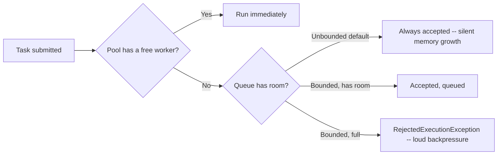

# Executors and Thread Pool Sizing

> **Topic register:** T-406 · IWI 7.15 (top-25 tied of 198) · Core tier · High interview frequency [H]
> **Provenance:** both traces in this chapter are real, executed output from [`practice/java/week-09/executors/src/ExecutorSizingDemo.java`](../../practice/java/week-09/executors/src/ExecutorSizingDemo.java).

## Table of Contents

1. [Learning Objectives](#learning-objectives)
2. [Why This Matters in Interviews](#why-this-matters-in-interviews)
3. [Mental Model](#mental-model)
4. [Definition and Purpose](#definition-and-purpose)
5. [Core Concepts](#core-concepts)
6. [Internal Implementation](#internal-implementation)
7. [Diagrams](#diagrams)
8. [Production Scenarios](#production-scenarios)
9. [Trade-offs](#trade-offs)
10. [Decision Framework](#decision-framework)
11. [Common Mistakes](#common-mistakes)
12. [Anti-Patterns](#anti-patterns)
13. [Best Practices](#best-practices)
14. [Interview Answer Framework](#interview-answer-framework)
15. [Interview Questions](#interview-questions)
16. [Summary](#summary)
17. [Key Takeaways](#key-takeaways)
18. [Cheat Sheet](#cheat-sheet)
19. [Flashcards](#flashcards)
20. [Practice Exercises](#practice-exercises)
21. [Solutions](#solutions)
22. [Additional Reading](#additional-reading)
23. [Official References](#official-references)

---

## Learning Objectives

By the end of this chapter you can:

- Explain, with a measured number, why `Executors.newFixedThreadPool()`'s default queue is a hidden unbounded-memory liability.
- Design a `ThreadPoolExecutor` with a bounded queue and an explicit rejection policy that converts silent overload into loud backpressure.
- Size a thread pool from Little's Law, distinguishing CPU-bound from IO-bound workloads.
- Recognize an unbounded queue as a specific instance of the general anti-pattern of absorbing overload internally instead of surfacing it as backpressure.

## Why This Matters in Interviews

Thread pool sizing is where "I've used `ExecutorService`" gets tested against an actual capacity-planning mechanism. This topic is High-frequency because the convenience factory methods (`Executors.newFixedThreadPool`, `newCachedThreadPool`) hide a design decision — an unbounded queue — that most candidates have used without examining, and this chapter measures the exact consequence directly rather than describing it abstractly.

## Mental Model

**A thread pool has two independent decisions, and most engineers only ever tune one of them.** Pool size controls how many tasks run concurrently. The queue controls what happens to a task that arrives when every worker is busy — and this second decision is the one `Executors.newFixedThreadPool()` makes silently, on your behalf, in the direction that feels safest (never reject) but is actually the most dangerous (unbounded memory growth with zero warning).

## Definition and Purpose

A **thread pool** decouples task submission from task execution: a fixed set of worker threads pulls tasks from a queue. The two decisions that actually matter are the pool size (how many workers) and the queue (what happens to a task that arrives when every worker is busy). This exists because, without pooling, every task would either run on a new thread (unbounded thread creation, real memory/scheduling cost per thread) or block the submitter until a thread is free — pools bound the first cost; queues decide what happens to the second.

## Core Concepts

### The unbounded-queue trap

`Executors.newFixedThreadPool()` and `newSingleThreadExecutor()` are backed by an unbounded `LinkedBlockingQueue` by default. This means the pool never rejects a task — which sounds safe but actually means unbounded memory growth under sustained overload, with zero backpressure signal to the caller: `execute()` always returns immediately regardless of how backed up the pool is.

### Bounded queues convert silent overload into loud backpressure

A `ThreadPoolExecutor` built explicitly with a bounded queue and a `RejectedExecutionHandler` (e.g., `AbortPolicy`) rejects excess work immediately via `RejectedExecutionException`, giving the caller a chance to apply backpressure (retry, shed load, alert) instead of silently accumulating unbounded memory.

### Sizing from Little's Law

`L = λ × W` — the average number of items in a system equals the arrival rate times the average time each item spends in the system. For **CPU-bound** tasks, more threads than CPU cores just adds context-switching overhead — size near `N_cores`. For **IO-bound** tasks (blocking on network/disk), threads spend most of their time waiting, not computing, so the useful pool size scales with `N_cores × (1 + waitTime/computeTime)` — bounded by memory (each platform thread reserves real stack space) rather than CPU. This asymmetry is exactly what [virtual threads](virtual-threads.md) are designed to eliminate for IO-bound workloads.

## Internal Implementation

**The unbounded-queue trap, measured** — `Executors.newFixedThreadPool(2)` fed 500 tasks that each take 100ms:

```
== newFixedThreadPool(2): backed by an UNBOUNDED LinkedBlockingQueue ==
200ms after submitting 500 tasks to a 2-thread pool: queue size=496, completed=2, active=2 (every unstarted task sits in memory in the unbounded queue)
after full drain: completed=500 (all 500 eventually ran -- unbounded means no rejection, just unbounded memory growth under sustained overload)
```

200ms in, 496 of 500 tasks are sitting in the queue, unbounded — under sustained overload (producer consistently faster than consumers), this queue grows without limit until the process runs out of memory.

**A bounded queue with backpressure, measured** — a `ThreadPoolExecutor` built explicitly with a bounded queue and `AbortPolicy`, same 2 workers, 20 tasks submitted:

```
== ThreadPoolExecutor with a BOUNDED queue + AbortPolicy: backpressure, not silent growth ==
submitted 20 tasks to a 2-thread pool with a 5-slot bounded queue: accepted=7 rejected=13
(2 running + 5 queued = 7 can be accepted immediately; the rest are rejected loudly instead of silently piling up)
```

Exactly `corePoolSize + queueCapacity` = 2 + 5 = 7 accepted, matching the arithmetic precisely — the remaining 13 are rejected immediately via `RejectedExecutionException`.

## Diagrams



## Production Scenarios

### Scenario: a slow downstream dependency causes an out-of-memory crash via an unbounded queue

**Symptoms.** A service using `Executors.newFixedThreadPool(10)` to call a downstream dependency experiences a sudden OutOfMemoryError and crashes during an incident where the downstream dependency itself became slow (but not fully down).

**Impact.** A slow (not even failed) dependency cascades into a full crash of the calling service, rather than a bounded, recoverable slowdown.

**Initial hypotheses.** A memory leak unrelated to the incident (checked — heap dumps from the crash show the vast majority of retained memory is queued `Runnable` task objects, not leaked application objects); a sudden traffic spike (checked — request rate was within normal bounds); the unbounded default queue accepting more work than the pool could ever drain (correct).

**Evidence.** Heap analysis at crash time shows tens of thousands of queued tasks, each representing an in-flight call to the now-slow downstream dependency, submitted faster than the fixed 10-thread pool could process them once each call's latency increased.

**Diagnosis.** Exactly this chapter's measured mechanism: the fixed thread pool's default unbounded queue accepted every submitted task with no rejection, and as the downstream dependency slowed (increasing time-per-task), the arrival rate exceeded the drain rate, and the queue grew without limit until the process ran out of heap.

**Immediate mitigation.** Restart the service to recover, and manually throttle traffic to the slow downstream dependency while it recovers.

**Permanent remediation.** Replace the `Executors.newFixedThreadPool()` call with an explicitly configured `ThreadPoolExecutor` using a bounded queue and a `CallerRunsPolicy` (or `AbortPolicy` paired with an explicit retry/circuit-breaker layer), converting a silent, unbounded failure mode into a loud, immediate, actionable one.

**Alternatives considered.** Simply increasing the pool size — rejected as treating the symptom, since a slow (not merely under-provisioned) downstream dependency would still eventually overwhelm any fixed-size pool's drain rate; the actual fix is bounding the queue, not growing the pool.

**Trade-offs.** A bounded queue with `AbortPolicy` means some requests are now explicitly rejected during a downstream slowdown, rather than silently queued — accepted, since the alternative (an eventual OOM crash) is strictly worse for every request, not just the rejected ones.

**Prevention.** Any use of `Executors.newFixedThreadPool()`/`newCachedThreadPool()`/`newSingleThreadExecutor()` in a code review should be flagged for its default unbounded-queue (or unbounded-thread-creation) behavior and replaced with an explicitly configured `ThreadPoolExecutor` stating the queue bound and rejection policy deliberately.

**Interview lesson.** This is Interview Question 2 (§ Interview Questions) — "queue is unbounded and memory is climbing, why" — arriving as a real production crash, with the exact mechanism (arrival rate exceeding drain rate under a slowed, not failed, dependency) this chapter measures directly.

## Trade-offs

| Choice | Benefit | Cost |
|---|---|---|
| Unbounded queue (`newFixedThreadPool` default) | Never rejects a task | Unbounded memory growth under sustained overload; no backpressure signal |
| Bounded queue + `AbortPolicy` | Loud, immediate backpressure | Caller must handle `RejectedExecutionException` |
| Bounded queue + `CallerRunsPolicy` | Backpressure that also slows the producer down (runs the rejected task on the calling thread) | Producer thread is now doing worker duty, which caps its own throughput |
| Larger pool for CPU-bound work | — | Diminishing/negative returns past `N_cores`, more context-switch overhead |
| Larger pool for IO-bound work | Higher achievable concurrency for genuinely wait-heavy tasks | Each platform thread costs real memory (~1MB default stack) — caps how far this scales |

## Decision Framework

1. **Is this workload CPU-bound or IO-bound?** Size CPU-bound pools near `N_cores`; size IO-bound pools using Little's Law and the wait/compute ratio, or consider virtual threads instead.
2. **Does this pool use a convenience factory method** (`newFixedThreadPool`, `newCachedThreadPool`, `newSingleThreadExecutor`)? If so, explicitly verify and consciously choose its queue behavior rather than accepting the default.
3. **What should happen when the pool is saturated?** Choose a bounded queue with an explicit rejection policy (`AbortPolicy` for a hard reject, `CallerRunsPolicy` for producer-side throttling) rather than defaulting to unbounded absorption.
4. **Is this workload a mix of CPU-bound and IO-bound work?** Consider separating them into differently-sized pools rather than one pool trying to serve both profiles.

## Common Mistakes

- Using `Executors.newFixedThreadPool()`/`newCachedThreadPool()` in production without understanding their unbounded queue or unbounded thread-creation behavior respectively.
- Sizing a pool by intuition rather than Little's Law and the workload's actual CPU-vs-IO profile.
- Treating "the pool never rejects" as a feature rather than a hidden unbounded-memory liability.

## Anti-Patterns

- **Reaching for `Executors.newFixedThreadPool()` as a default** in production code without an explicit, conscious decision about queue bound and rejection policy.
- **Sizing a pool by picking a round number** ("8, because that sounds reasonable") without deriving it from the workload's actual arrival rate and service time.
- **Growing pool size to fix a slowdown-induced memory problem**, when the actual fix is bounding the queue and applying backpressure.
- **Using one pool for both CPU-bound and IO-bound work**, sized for neither profile correctly.

## Best Practices

- Always construct a `ThreadPoolExecutor` explicitly with a bounded queue and a deliberately chosen `RejectedExecutionHandler`, rather than using the unbounded-queue convenience factory methods.
- Derive pool size from Little's Law and the workload's actual CPU-vs-IO profile, not intuition.
- Separate CPU-bound and IO-bound work into differently-sized, independently-tuned pools.
- Treat every queue, cache, and pool in a design as needing an explicit bound and an explicit policy for what happens when that bound is hit.

## Interview Answer Framework

### 30-Second Answer

`Executors.newFixedThreadPool()`'s default queue is unbounded — it never rejects work, which sounds safe but means unbounded memory growth under sustained overload with zero backpressure. A `ThreadPoolExecutor` with an explicit bounded queue and rejection policy converts that silent failure into loud, immediate backpressure. Size pools from Little's Law, distinguishing CPU-bound (near `N_cores`) from IO-bound (scales with wait ratio).

### 2-Minute Answer

Definition: a thread pool decouples task submission from execution via a fixed worker count and a queue. Why it exists: without pooling, tasks either create unbounded threads or block the submitter. How it works: the default `newFixedThreadPool` queue is unbounded, accepting every task with no rejection; a `ThreadPoolExecutor` with an explicit bounded queue and rejection policy rejects excess work loudly instead. One important trade-off: `CallerRunsPolicy` throttles the producer by making it do worker duty, capping its own throughput as a side effect. Production example: a real measured trace showing 496 of 500 tasks queued 200ms after submission with the default unbounded queue, versus exactly 7 accepted and 13 rejected with a bounded queue — the arithmetic (`corePoolSize + queueCapacity`) matching precisely.

### 10-Minute Deep Dive

Cover, in order: the two independent decisions — pool size and queue behavior — and why most engineers only tune the first (mental model); the measured unbounded-queue trap, with the precise mechanism (arrival rate exceeding drain rate) (internals, real evidence); the measured bounded-queue-with-rejection fix, matching the exact arithmetic (internals); Little's Law applied to CPU-bound vs. IO-bound sizing (decision framework); the general anti-pattern of absorbing overload internally instead of surfacing backpressure, connecting to caches, retries, and connection pools (Staff-level framing); and close with the production scenario — a slow (not failed) downstream dependency causing a real OOM crash via exactly this unbounded-queue mechanism.

### Whiteboard Explanation

Draw the [§ Diagrams](#diagrams) flowchart: task submitted → pool has a free worker? → if not, queue has room? → branching into "unbounded: always accepted" versus "bounded: accepted or rejected." Circle the unbounded branch and annotate "this is the silent failure mode" — this makes the hidden default concrete rather than an abstract warning.

### Production Example

The OOM crash in [§ Production Scenarios](#production-scenarios): a slowed (not failed) downstream dependency caused arrival rate to exceed drain rate on a `newFixedThreadPool`'s unbounded queue, growing memory until the process crashed — fixed by replacing it with an explicitly bounded `ThreadPoolExecutor` and rejection policy.

### Trade-offs to Mention

State unprompted: the unbounded default queue is a hidden liability, not a safety feature; `CallerRunsPolicy` throttles the producer as a side effect of providing backpressure; CPU-bound and IO-bound workloads need genuinely different pool sizing and ideally separate pools.

### Common Candidate Mistakes

Picking a pool size by intuition rather than deriving it from Little's Law; assuming the fixed thread count itself caps memory usage; treating "the pool never rejects" as a positive property.

### Typical Follow-Up Questions

1. "What if the workload is a mix of both CPU-bound and IO-bound?"
2. "How do you fix a climbing-memory unbounded queue?"
3. "What's the difference in effect between `AbortPolicy` and `CallerRunsPolicy`?"

### Senior-Level Expectations

States the CPU-bound vs. IO-bound sizing distinction and picks a formula accordingly; proposes a bounded queue with an explicit rejection policy when asked about climbing memory.

### Staff-Level Discussion

An unbounded queue is a specific instance of a general anti-pattern: absorbing overload internally instead of surfacing it as backpressure. The same principle governs unbounded in-memory caches, unbounded retry loops, and unbounded connection pools — anywhere a system can silently accept more work than it can sustainably process, it will eventually fail catastrophically (OOM, cascading timeout) rather than degrading predictably. A Staff-level engineer treats every queue, cache, and pool in a design as a place that needs an explicit bound and an explicit policy for what happens when that bound is hit — "unbounded" is rarely actually the intended design, just the unexamined default.

## Interview Questions

### Question 1 — Size this pool. Show the arithmetic.

**Why interviewers ask it.** Tests whether the candidate derives pool size from actual load characteristics rather than picking an intuitive round number.

**Expected answer.** Applies Little's Law with a stated request rate and average service time, distinguishing CPU-bound (near `N_cores`) from IO-bound (scales with wait ratio) sizing.

**Minimum acceptable answer.** Distinguishes CPU-bound from IO-bound sizing conceptually, even without the precise Little's Law formula.

**Strong Senior answer.** States the CPU-bound vs. IO-bound distinction and picks a formula accordingly.

**Staff-level extension.** Proposes separating CPU-bound and IO-bound work into different pools entirely, sized independently, rather than one pool trying to serve both profiles.

**Common mistakes.** Picking a round number ("8, because that sounds reasonable") without deriving it from actual load characteristics.

**Likely follow-ups.** "What if the workload is a mix of both?"

**Evaluation criteria (1–5).** 1: picks an arbitrary number. 3: correctly distinguishes CPU-bound vs. IO-bound sizing. 5: correct distinction plus proposes separate, independently-sized pools for mixed workloads.

**Related references.** [§ Core Concepts](#core-concepts), Little's Law.

---

### Question 2 — Queue is unbounded and memory is climbing. Why?

**Why interviewers ask it.** A near-certain real-world failure mode that most candidates have never diagnosed directly, despite having used the default factory methods.

**Expected answer.** The default `newFixedThreadPool`/`newSingleThreadExecutor` queue is an unbounded `LinkedBlockingQueue`; under sustained overload (arrival rate > service rate), tasks accumulate in the queue without limit, each one retained in memory until a worker can process it.

**Minimum acceptable answer.** States that the default queue has no limit, even without the precise mechanism.

**Strong Senior answer.** Proposes a bounded queue with an explicit rejection policy.

**Staff-level extension.** Connects the fix to a broader system design point — a queue backing up is a signal the system is overloaded, and the correct response is backpressure/shedding, not "make the queue absorb more."

**Common mistakes.** Assuming the fixed thread count itself caps memory usage.

**Likely follow-ups.** "How do you fix it?"

**Evaluation criteria (1–5).** 1: "the fixed thread count should limit this." 3: correctly identifies the unbounded queue and proposes a bounded fix. 5: correct diagnosis plus the broader backpressure/shedding framing.

**Related references.** [§ Internal Implementation](#internal-implementation); [§ Production Scenarios](#production-scenarios).

## Summary

`Executors.newFixedThreadPool()`'s unbounded queue means the pool never rejects work, which sounds safe but actually means unbounded memory growth under sustained overload with zero backpressure signal to the caller — measured directly at 496 of 500 tasks queued 200ms after submission. A `ThreadPoolExecutor` built explicitly with a bounded queue and rejection policy converts that silent failure mode into loud, immediate, actionable backpressure. Pool sizing itself should come from Little's Law applied to the workload's actual CPU-vs-IO profile, not intuition.

## Key Takeaways

- `newFixedThreadPool`'s default queue is unbounded — no rejection, unbounded memory growth under overload.
- A bounded queue + explicit rejection policy converts silent overload into loud backpressure.
- CPU-bound pools size near `N_cores`; IO-bound pools scale with the wait/compute ratio.
- Separate CPU-bound and IO-bound work into differently-sized pools rather than one pool serving both.

## Cheat Sheet

| Symptom | Likely cause | Fix |
|---|---|---|
| Memory climbing under load, pool never rejects | Unbounded default queue | Bounded queue + `RejectedExecutionHandler` |
| Pool threads mostly idle, throughput low despite CPU headroom | Pool too small for IO-bound workload | Scale pool with wait/compute ratio, or move to virtual threads |
| Pool threads maxed, CPU pegged, throughput flat or falling | Pool too large for CPU-bound workload | Size down toward `N_cores` |

## Flashcards

### Card: Default queue's consequence

**Prompt:**
What queue does `Executors.newFixedThreadPool()` use by default, and what's the consequence?

**Answer:**
An unbounded `LinkedBlockingQueue` — tasks are never rejected, so memory grows without limit under sustained overload.

**Why it matters:**
The hidden default most candidates have used without examining.

**Common trap:**
Assuming "never rejects" is a purely positive property.

**Related:**
[Internal Implementation](#internal-implementation)

### Card: Getting real backpressure

**Prompt:**
How do you get real backpressure from a thread pool?

**Answer:**
Build a `ThreadPoolExecutor` with a bounded queue and an explicit `RejectedExecutionHandler` (e.g., `AbortPolicy`).

**Why it matters:**
Converts a silent, catastrophic failure mode into a loud, actionable one.

**Common trap:**
Assuming pool size alone controls memory usage under load.

**Related:**
[Internal Implementation](#internal-implementation)

### Card: CPU-bound vs IO-bound sizing

**Prompt:**
How should CPU-bound vs IO-bound pool sizing differ?

**Answer:**
CPU-bound scales near `N_cores`; IO-bound scales with the wait/compute ratio (Little's Law), since threads spend most time blocked, not computing.

**Why it matters:**
A single pool-sizing heuristic is wrong for at least one of the two profiles.

**Common trap:**
Applying the same sizing rule to both workload types.

**Related:**
[Core Concepts](#core-concepts)

## Practice Exercises

1. Reproduce both traces yourself: [`practice/java/week-09/executors/src/ExecutorSizingDemo.java`](../../practice/java/week-09/executors/src/ExecutorSizingDemo.java).
2. Change the bounded-queue demo's `AbortPolicy` to `CallerRunsPolicy` and explain, from the real output, why the total wall time changes even though rejected-vs-accepted counts wouldn't apply the same way.
3. Given a workload spending 90% of its time waiting on a downstream HTTP call and 10% computing, derive a pool size using Little's Law from a stated request rate.

## Solutions

**Exercise 1.** Expected output matches this chapter's measured traces: 496 of 500 tasks queued 200ms after submission for the unbounded case, and exactly 7 accepted/13 rejected for the bounded case with a 2-thread pool and 5-slot queue.

**Exercise 2.** With `CallerRunsPolicy`, rejected tasks run on the calling thread instead of throwing an exception — this slows the producer down (since it's now doing worker duty for the rejected task), which naturally throttles the submission rate; total wall time increases compared to `AbortPolicy` because the producer's own throughput is now capped by the work it's forced to do directly, but no tasks are lost.

**Exercise 3.** For a workload where each task spends 90% waiting and 10% computing, on a machine with `N_cores` cores, a reasonable pool size is roughly `N_cores × (1 + 0.9/0.1) = N_cores × 10`. Given a stated arrival rate λ and this per-task profile, Little's Law (`L = λ × W`) gives the expected steady-state concurrent task count directly, which should inform the pool size (or signal that virtual threads may be a better fit if the wait ratio is this extreme).

## Additional Reading

- [java.util.concurrent.ThreadPoolExecutor documentation](https://docs.oracle.com/en/java/javase/21/docs/api/java.base/java/util/concurrent/ThreadPoolExecutor.html)
- [CompletableFuture and Async Composition](completablefuture-and-async-composition.md) — sizing and supplying an executor to `*Async` methods builds directly on this chapter's Little's Law sizing.

## Official References

- [JEP 444: Virtual Threads](https://openjdk.org/jeps/444) — the eventual answer to IO-bound pool sizing pain, covered in [Virtual Threads](virtual-threads.md)
