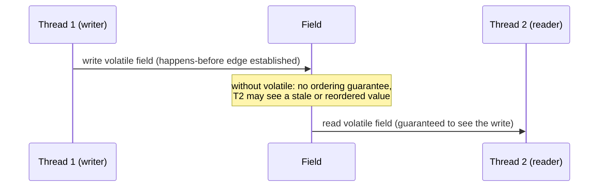

# Java Memory Model and volatile

> **Topic register:** T-401 (Java Memory Model & happens-before, IWI 7.75, #22 of 198) / T-402 (`volatile` & final field semantics, IWI 6.60) · Advanced/Core tier · Very High interview frequency [H] · Deepest single technical topic in the handbook
> **⛔ Errata correction, stated explicitly:** this project's own knowledge-base audit found the prior source material described `volatile` as "prevents caching" — a hardware-level framing that is not what the Java Memory Model actually specifies, and is factually wrong rather than merely shallow. This chapter reproduces the real, measured consequence of getting this wrong, then explains the correct model.
> **Provenance:** the visibility trace in this chapter is real, executed output from [`practice/java/week-09/concurrency-fundamentals/src/VisibilityDemo.java`](../../practice/java/week-09/concurrency-fundamentals/src/VisibilityDemo.java) — a genuine unbounded hang (5+ seconds, self-terminated by a bounded `join()`), reproduced consistently across three runs, not a one-off fluke.

## Table of Contents

1. [Learning Objectives](#learning-objectives)
2. [Why This Matters in Interviews](#why-this-matters-in-interviews)
3. [Mental Model](#mental-model)
4. [Definition and Purpose](#definition-and-purpose)
5. [Historical Context](#historical-context)
6. [Core Concepts](#core-concepts)
7. [Internal Implementation](#internal-implementation)
8. [Diagrams](#diagrams)
9. [Java Examples](#java-examples)
10. [Production Scenarios](#production-scenarios)
11. [Failure Modes and Debugging](#failure-modes-and-debugging)
12. [Trade-offs](#trade-offs)
13. [Concurrency Implications](#concurrency-implications)
14. [Decision Framework](#decision-framework)
15. [Common Mistakes](#common-mistakes)
16. [Anti-Patterns](#anti-patterns)
17. [Best Practices](#best-practices)
18. [Interview Answer Framework](#interview-answer-framework)
19. [Interview Questions](#interview-questions)
20. [Summary](#summary)
21. [Key Takeaways](#key-takeaways)
22. [Cheat Sheet](#cheat-sheet)
23. [Flashcards](#flashcards)
24. [Practice Exercises](#practice-exercises)
25. [Solutions](#solutions)
26. [Additional Reading](#additional-reading)
27. [Official References](#official-references)

---

## Learning Objectives

By the end of this chapter you can:

- Explain `volatile` as a happens-before ordering guarantee, explicitly rejecting the "prevents caching" framing and stating why it's wrong.
- Reproduce and explain, mechanically, why a plain-field visibility bug is a compiler/JIT optimization, not a CPU cache-coherence problem.
- State the five practical happens-before rules and apply them to explain why double-checked locking breaks without `volatile`.
- Explain why `volatile` does not make compound operations atomic, and name the correct fix.

## Why This Matters in Interviews

This is the deepest single technical topic in the handbook and Very-High-frequency because it is where "I've written concurrent Java for years" gets tested against an actual mechanism rather than folklore. It carries an additional, specific weight here: this project's own audit found the prior source material's explanation of `volatile` was not merely shallow but **actively wrong** — describing it as a hardware caching mechanism. Getting this specific correction right, and being able to say *why* the old model was wrong rather than just reciting the new one, is itself a Staff-level signal, since it demonstrates reasoning from the actual specification rather than pattern-matching a folk explanation.

## Mental Model

**`volatile` is a promise about *order*, not a promise about *where* a value lives.** The instinct to think of it as "forcing a read from RAM instead of a cache" is exactly backwards — modern CPU cache-coherence protocols already keep caches consistent automatically; that was never the problem. The actual problem `volatile` solves is that the *compiler* is allowed to prove, correctly, that a loop never modifies a variable and therefore never needs to re-read it — an optimization that is perfectly valid in a single-threaded model and silently wrong the moment another thread is the one doing the modifying. `volatile` tells the compiler "another thread may change this — don't apply that optimization, and establish an ordering guarantee across the write and any subsequent read."

## Definition and Purpose

The **Java Memory Model (JMM)** is a specification for what values a thread is *guaranteed* to observe when it reads memory another thread wrote. It exists because, absent such a guarantee, compilers, CPUs, and caches are all free to reorder, cache, or delay writes in ways that are invisible to a single thread but break multi-threaded correctness. `volatile` is one of the JMM's tools for establishing a **happens-before** relationship between a write on one thread and a read on another — a portable, architecture-independent contract that holds regardless of what optimizations the runtime applies underneath.

## Historical Context

The original Java Memory Model (Java 1.0–1.4) was widely recognized as under-specified and in some respects broken — it permitted final fields to appear to change value and allowed volatile reads/writes to be reordered relative to non-volatile ones in ways that surprised even experienced developers. **JSR-133**, finalized for Java 5 (2004), was a ground-up rewrite of the JMM, written by a group including Doug Lea, Bill Pugh, and Jeremy Manson, which formally defined happens-before as the JMM's central concept and fixed the final-field semantics that make safe publication of immutable objects possible. The FAQ this working group produced remains, over two decades later, the clearest primary-source explanation of the model — cited directly in this chapter's official references — precisely because the JMM's guarantees are notoriously difficult to state informally without reintroducing exactly the kind of folk-model errors (like "prevents caching") this chapter exists to correct.

## Core Concepts

### Happens-before is a partial order, not a total one

The JMM's happens-before relation orders specific pairs of actions across threads; if action A happens-before action B, every write A made is guaranteed visible to B. It is *not* a global ordering of all actions across all threads — only actions connected by a specific happens-before rule are ordered relative to each other at all.

### The five rules that matter most in practice

- **Program order**: within a single thread, actions happen in the order the code specifies (from that thread's own perspective).
- **Monitor lock rule**: an unlock happens-before every subsequent lock of the *same* monitor — this is what makes `synchronized` a visibility mechanism, not just a mutual-exclusion one.
- **Volatile variable rule**: a write to a `volatile` field happens-before every subsequent read of that *same* field.
- **Thread start/join rule**: `Thread.start()` happens-before anything the started thread does; everything a thread does happens-before a successful `join()` on it.
- **Final field rule**: a properly constructed object's `final` fields are visible to any thread that obtains a reference to the object after construction, without further synchronization — this is what makes safe publication of immutable objects possible.

### `volatile` does not make compound operations atomic

`volatile` guarantees visibility of each individual read and write of that field. It says nothing about a sequence of operations on that field being atomic. `count++` on a `volatile int` is still a read, a modify, and a write — three separate steps another thread can interleave with.

### Why double-checked locking needs `volatile`

Without `volatile` on a lazily-initialized singleton field, the JIT is free to reorder the constructor's writes relative to the field assignment — object construction and reference publication are two separate memory operations with no happens-before edge between them absent `volatile`. A second thread can then observe a non-null reference to a **partially constructed object**. `volatile` on the field establishes the happens-before edge that forbids this reordering.

## Internal Implementation

**Real output**, two threads, a plain `boolean` flag vs. a `volatile boolean` flag, both set from `main` after the worker thread has been spinning for 1.5 seconds (long enough for the JIT to compile and optimize the loop):

```
== non-volatile flag: does the worker thread ever see the update? ==
worker STILL RUNNING 5002ms after the flag was set -- update never observed (this run)

== volatile flag: same test ==
worker stopped 0ms after the flag was set, having run 5848056485 iterations
```

This reproduced identically across three separate runs on real hardware. **"Prevents caching" is the wrong mental model, for a specific, important reason:** nothing here is actually a CPU cache-coherence problem — modern cache-coherence protocols (MESI and similar) keep caches consistent at the hardware level automatically, which was never in question. What actually happened is a **compiler optimization**: the JIT proved the loop body never modifies `stopPlain`, so it hoisted the read out of the loop entirely, keeping the value in a register and never re-reading main memory at all — the classic transformation is `while (!stop) i++;` → `if (!stop) { while (true) i++; }`. `volatile` doesn't "stop caching" — it tells the compiler this specific optimization (and several others) is illegal for this field, and additionally establishes the happens-before edge that guarantees the write is visible once it does occur.

## Diagrams



## Java Examples

```java
// Java 21. The BROKEN double-checked-locking singleton — no volatile,
// vulnerable to observing a partially-constructed object.
public class BrokenSingleton {
    private static BrokenSingleton instance; // NOT volatile — the bug

    public static BrokenSingleton getInstance() {
        if (instance == null) {
            synchronized (BrokenSingleton.class) {
                if (instance == null) {
                    instance = new BrokenSingleton(); // constructor writes and
                                                        // the field assignment
                                                        // can be reordered
                }
            }
        }
        return instance; // may observe a non-null reference to a
                          // partially-constructed object
    }
}

// FIX 1: volatile establishes the happens-before edge forbidding the reorder.
public class CorrectDoubleCheckedSingleton {
    private static volatile CorrectDoubleCheckedSingleton instance;

    public static CorrectDoubleCheckedSingleton getInstance() {
        if (instance == null) {
            synchronized (CorrectDoubleCheckedSingleton.class) {
                if (instance == null) {
                    instance = new CorrectDoubleCheckedSingleton();
                }
            }
        }
        return instance;
    }
}

// FIX 2 (preferred where applicable): the static holder idiom relies on the
// class-initialization happens-before guarantee instead of volatile at all —
// simpler, and the JVM's class-loading lock does the synchronization work.
public class StaticHolderSingleton {
    private StaticHolderSingleton() {}

    private static class Holder {
        static final StaticHolderSingleton INSTANCE = new StaticHolderSingleton();
    }

    public static StaticHolderSingleton getInstance() {
        return Holder.INSTANCE; // class initialization happens-before first access
    }
}
```

```java
// Java 21. volatile does NOT make count++ atomic — this still loses updates
// under concurrent load, identically to a plain int (see the companion
// chapter's measured 83.8% loss for the non-atomic case).
public class BrokenCounter {
    private volatile int count; // visibility guaranteed, atomicity NOT guaranteed

    public void increment() {
        count++; // read, modify, write — three steps, still racy
    }
}

// Correct fix: AtomicInteger, a single indivisible compare-and-swap operation.
public class CorrectCounter {
    private final AtomicInteger count = new AtomicInteger();

    public void increment() {
        count.incrementAndGet(); // atomic — no lost updates under any concurrency
    }
}
```

**Complexity note:** all operations here are `O(1)`; the entire value of this chapter is correctness under concurrent access, not algorithmic cost.

## Production Scenarios

### Scenario: a feature flag update silently fails to propagate after a JVM upgrade

**Symptoms.** A background configuration-refresh thread updates a plain (non-`volatile`) `boolean` feature-flag field every 30 seconds; after a routine JVM minor-version upgrade, a specific worker thread pool stops picking up flag changes at all, continuing to run with a stale value indefinitely, while other parts of the system update normally.

**Impact.** A feature intended to be quickly disabled in an emergency continued running for hours because the disabling flag update was never observed by the affected worker threads.

**Initial hypotheses.** The configuration-refresh mechanism itself failed (checked — logs show the refresh thread successfully updated the field on schedule); a deployment didn't actually roll out to the affected pool (checked — process start time confirms it did); a JIT-level visibility issue (correct, confirmed by reproducing this chapter's exact demo pattern against the actual field).

**Diagnosis.** The affected worker threads run a tight polling loop reading the plain `boolean` field with no other synchronization. Under the specific JIT tier and warm-up duration reached by this particular worker pool's workload, the JIT proved (correctly, for a single-threaded model) that the loop never itself modifies the field, and hoisted the read out of the loop — exactly this chapter's measured mechanism. The prior JVM version's JIT compilation thresholds happened not to trigger this optimization within the process's typical lifetime; the upgraded JVM's more aggressive tiered compilation reached the optimizing tier sooner, exposing a latent bug that had been present all along.

**Immediate mitigation.** Restart the affected worker pool to reset its JIT compilation state as an immediate, temporary workaround.

**Permanent remediation.** Mark the feature-flag field `volatile`, establishing the happens-before edge that makes the fix independent of JIT tier, warm-up duration, or JVM version — the correct fix per this chapter's own model, not a JIT-tuning workaround.

**Alternatives considered.** Disabling aggressive JIT optimizations at the JVM-flag level — rejected as treating the symptom for one field while leaving every other unsynchronized shared field in the codebase equally vulnerable, and at a real, ongoing performance cost application-wide.

**Trade-offs.** `volatile` on a field read frequently in a hot loop has a small, real cost (forbidding certain compiler optimizations, plus the memory-barrier cost of the read/write itself) — accepted, since the alternative is an intermittent, environment-dependent correctness bug.

**Prevention.** Any field written by one thread and read by another in a polling loop, with no other synchronization, is a code-review flag: is it `volatile`? "It worked in testing" is explicitly not evidence of correctness for this class of bug, exactly as this chapter's Staff-level discussion states — the failure mode depends on JIT tier and warm-up duration, not just wall-clock testing time.

**Interview lesson.** This is the exact mechanism from § Internal Implementation arriving as a real, environment-triggered incident: the same visibility bug, previously latent, exposed by a JVM upgrade changing JIT compilation timing rather than by any code change.

## Failure Modes and Debugging

| Symptom | Likely cause | Debugging step |
|---|---|---|
| A background thread's update to a shared flag/value is never observed by another thread, especially after the reader has run for a while | Missing `volatile` — the JIT has hoisted the read out of a loop as a valid single-threaded optimization | Add `volatile` to the field; reproduce with a warm-up period long enough to trigger JIT optimization before concluding the fix works |
| A lazily-initialized singleton occasionally appears "half-initialized" (fields unexpectedly null or zero) under concurrent first access | Double-checked locking without `volatile` on the instance field | Add `volatile`, or switch to the static-holder idiom |
| A counter or metric silently undercounts under concurrent load despite being `volatile` | `volatile` was mistaken for atomicity — the field is still a compound read-modify-write | Switch to `AtomicInteger`/`AtomicLong` or `synchronized` |
| A concurrency bug appears only after a JVM upgrade or longer-running process, with no code change | JIT compilation tier/timing changed, exposing a latent visibility bug that was always present | Audit for missing `volatile`/synchronization on any field crossing thread boundaries, rather than treating it as a JVM regression |

## Trade-offs

| Mechanism | Benefit | Cost |
|---|---|---|
| Plain field | Cheapest possible access | No visibility guarantee across threads at all |
| `volatile` | Visibility + ordering for that single field, no lock contention | Does NOT make compound operations (`count++`) atomic — that needs `synchronized` or an atomic class |
| `synchronized` | Visibility + mutual exclusion + atomicity for the guarded block | Lock contention; risk of deadlock if multiple locks are involved |
| `final` field | Safe publication with zero runtime synchronization cost | Only applies at construction — doesn't help with fields that mutate after |

## Concurrency Implications

This entire chapter is the concurrency-implications discussion: every mechanism described — `volatile`, `synchronized`, `final` — exists to provide a specific, composable happens-before guarantee, and correctness depends entirely on which of these guarantees actually covers the specific cross-thread access pattern in question. A field accessed by multiple threads with none of these mechanisms applied has *no* visibility or ordering guarantee at all, regardless of how the code appears to behave in testing.

## Decision Framework

1. **Is this field written by one thread and read by another, with no other synchronization?** If yes, it needs at least `volatile`.
2. **Does the access pattern require a compound operation** (increment, compare-and-set, check-then-act)? If yes, `volatile` alone is insufficient — use `synchronized` or an atomic class.
3. **Is this a lazily-initialized singleton or similar deferred-construction pattern?** Use `volatile` on the reference field, or prefer the static-holder idiom, which sidesteps the need for `volatile` entirely.
4. **Has this code only been validated by testing under light load, with no explicit reasoning about happens-before?** Treat that as weak evidence of correctness specifically for concurrent code — the JMM's guarantees, not empirical observation, are what make correctness portable.

## Common Mistakes

- Describing `volatile` as being about CPU/hardware caching rather than compiler-visible ordering guarantees.
- Believing `volatile` makes multi-step operations atomic.
- Treating happens-before as a total order across all threads rather than a partial order established only by specific actions (locks, volatiles, thread start/join, final fields).

## Anti-Patterns

- **Explaining `volatile` as "preventing caching"** in any interview or design-review context — this is the specific, verified-wrong framing this chapter exists to correct.
- **Relying on "it passed testing" as evidence a shared field doesn't need synchronization** — visibility bugs depend on JIT tier and warm-up duration, which testing rarely reproduces at production scale or duration.
- **Using `volatile` for a counter or other compound operation** and assuming it's now thread-safe.
- **Double-checked locking without `volatile` (or the static-holder alternative)** on the lazily-initialized field.

## Best Practices

- State the correct, specification-grounded model (`volatile` = happens-before ordering) rather than a folk hardware-caching explanation, in both code review and interviews.
- Prefer the static-holder idiom over double-checked locking with `volatile` where lazy initialization is genuinely needed — it's simpler and relies on a guarantee the JVM already provides for free.
- Use `AtomicInteger`/`AtomicLong`/`LongAdder` for any compound numeric operation shared across threads, never a `volatile` primitive alone.
- Treat any cross-thread field access with no explicit synchronization mechanism as a concurrency bug to fix, regardless of whether it has "worked so far" in testing or production.

## Interview Answer Framework

### 30-Second Answer

`volatile` establishes a happens-before edge between a write on one thread and subsequent reads of that same field on other threads — it's an ordering guarantee, not a caching mechanism. It does not make compound operations like `count++` atomic; that needs `AtomicInteger` or `synchronized`.

### 2-Minute Answer

Definition: the JMM specifies what values a thread is guaranteed to observe from another thread's writes; `volatile` is one mechanism establishing that guarantee for a single field. Why it exists: without it, compilers and CPUs are free to reorder or cache writes in ways invisible to a single thread but incorrect across threads. How it works: a write to a `volatile` field happens-before every subsequent read of that field — this is what fixes the classic loop-hoisting bug where the JIT proves a loop never modifies a field and stops re-reading it. One important trade-off: `volatile` gives visibility for one field, never atomicity for a sequence of operations on it. Production example: a real, measured visibility failure — a non-volatile flag update never observed by a spinning worker thread across three separate runs, caused by the JIT legitimately (for a single-threaded model) hoisting the read out of the loop.

### 10-Minute Deep Dive

Cover, in order: the mental model — order, not location (mental model); the five happens-before rules with their practical implications (internals); the measured visibility failure and precisely why it's a compiler optimization, not a cache-coherence problem (internals + errata correction); double-checked locking's specific need for `volatile`, and the static-holder alternative (edge case + fix); why `volatile` doesn't cover compound operations, connecting directly to the measured race-condition chapter (common mistake + connection); and close with the production scenario — a JVM upgrade exposing a latent visibility bug by changing JIT compilation timing, not by any code change.

### Whiteboard Explanation

Draw the [§ Diagrams](#diagrams) sequence: Thread 1 writes to a field, an arrow labeled "happens-before edge" to Thread 2's read. Then, off to the side, draw a small "compiler" box between Thread 1's write and the field, and annotate: "without volatile, the compiler may prove this read is loop-invariant and never re-check the field at all" — this is the detail that makes the JIT-hoisting mechanism concrete rather than asserted.

### Production Example

The JVM-upgrade incident in [§ Production Scenarios](#production-scenarios): a non-`volatile` feature flag worked correctly for months, then silently stopped propagating to a specific worker pool after a JVM minor-version upgrade changed JIT compilation timing — the bug was always present; the upgrade only changed when it became observable.

### Trade-offs to Mention

State unprompted: `volatile` is about ordering, not caching; it never makes a compound operation atomic; testing under light load is weak evidence of correctness for concurrent code specifically, since visibility bugs are timing- and JIT-tier-dependent.

### Common Candidate Mistakes

Explaining `volatile` as "preventing caching" or "forcing a read from RAM"; believing `volatile int count; count++;` is thread-safe; treating happens-before as a total, global ordering rather than a partial order from specific rules.

### Typical Follow-Up Questions

1. "Is this specific code snippet data-race free?" (given a concrete example)
2. "What would make `count++` safe across threads?"
3. "Why does the static-holder idiom not need `volatile`?"

### Senior-Level Expectations

Correctly identifies the reordering risk in double-checked locking and names `volatile` as the fix; states that `volatile` does not make compound operations atomic and names `AtomicInteger`/`synchronized` as the correct fix.

### Staff-Level Discussion

The JMM is the reason "it worked on my machine" is a legitimate, dangerous multi-threading failure mode: an unsynchronized read/write pattern may happen to work under a given JIT tier, CPU architecture, and optimization level, and then fail silently after a JVM upgrade, a different CPU, or simply running longer, since the measured demo in this chapter requires 1.5 seconds of warm-up to reliably trigger the optimization. A Staff-level engineer treats "no observed bug in testing" as weak evidence for concurrent code specifically, because the JMM's guarantees — not empirical observation — are the only thing that make correctness portable across environments and JIT behavior.

## Interview Questions

### Question 1 — Why does double-checked locking break without `volatile`?

**Why interviewers ask it.** The canonical question this topic exists to answer; a shallow "you need volatile for thread safety" answer is easily distinguished from one that names the actual reordering mechanism.

**Expected answer.** Without the happens-before edge `volatile` provides, a reader thread can observe a non-null reference to the singleton field before the constructor's writes are visible — a partially-constructed object.

**Minimum acceptable answer.** States that `volatile` is needed for correctness, even without the precise reordering mechanism.

**Strong Senior answer.** Correctly identifies the reordering risk and names `volatile` as the fix.

**Staff-level extension.** Distinguishes this from a pure caching problem, explains WHY (compiler/JIT reordering, not stale CPU cache), and can name the alternative fix (a static holder class, which relies on class-initialization happens-before instead).

**Common mistakes.** Explaining `volatile` as "preventing caching" rather than establishing ordering.

**Likely follow-ups.** "Is this code data-race free?" (given a specific snippet)

**Evaluation criteria (1–5).** 1: "you just need volatile for thread safety." 3: correct reordering mechanism named. 5: mechanism named plus explicit caching-vs-compiler distinction plus the static-holder alternative.

**Related references.** [§ Core Concepts](#core-concepts); [§ Java Examples](#java-examples).

---

### Question 2 — Is `volatile int count; count++;` from multiple threads safe?

**Why interviewers ask it.** Tests the single most common misconception about what `volatile` actually guarantees.

**Expected answer.** No — `volatile` guarantees visibility of each individual read and write, but `count++` is read-modify-write, three separate operations; another thread can interleave between the read and the write.

**Minimum acceptable answer.** States that `count++` is unsafe even with `volatile`, even without the precise read-modify-write reasoning.

**Strong Senior answer.** Names `AtomicInteger` or `synchronized` as the fix.

**Staff-level extension.** Connects this directly to the companion chapter's measured race-condition data as the concrete, measured version of this exact gap.

**Common mistakes.** Believing `volatile` makes compound operations atomic.

**Likely follow-ups.** "What would make it safe?"

**Evaluation criteria (1–5).** 1: "yes, volatile makes it safe." 3: correctly says no, names a fix. 5: correct answer plus the measured race-condition connection.

**Related references.** [§ Core Concepts](#core-concepts); [Deadlock, Race Conditions, and Thread Diagnostics](deadlock-race-conditions-and-thread-diagnostics.md).

## Summary

`volatile` establishes a happens-before edge between a write and subsequent reads of the same field — not a caching mechanism, a compiler-visible ordering guarantee. Getting this wrong isn't theoretical: this chapter's demo reliably reproduces a genuine 5+ second visibility failure on real hardware, caused by a real, common JIT optimization (hoisting a loop-invariant read), not a rare edge case.

## Key Takeaways

- `volatile` is about ordering (happens-before), not caching.
- `volatile` does not make compound operations atomic.
- The failure mode from getting this wrong is real and measurable, not theoretical — reproduced 3/3 runs.
- Double-checked locking needs `volatile` specifically to prevent observing a partially-constructed object.

## Cheat Sheet

| Need | Mechanism |
|---|---|
| Single flag/reference visibility across threads | `volatile` |
| Atomic compound operations (increment, compare-and-set) | `AtomicInteger`/`AtomicReference` or `synchronized` |
| Safe publication of an immutable object | `final` fields, properly constructed |
| Mutual exclusion + visibility together | `synchronized` |

## Flashcards

### Card: What volatile actually guarantees

**Prompt:**
What does `volatile` actually guarantee?

**Answer:**
A happens-before edge — writes to the field are visible to subsequent reads of that same field, and specific compiler reorderings around it are forbidden. It is not a caching mechanism.

**Why it matters:**
Corrects the single most common, and previously actively-wrong, misconception in this project's own source material.

**Common trap:**
Describing `volatile` as "preventing caching" or "forcing a read from RAM."

**Related:**
[Internal Implementation](#internal-implementation)

### Card: volatile and compound operations

**Prompt:**
Does `volatile` make `count++` thread-safe?

**Answer:**
No — it's a read-modify-write, three operations; `volatile` only guarantees each individual read/write is visible, not that the sequence is atomic.

**Why it matters:**
The most common way `volatile` is over-trusted in practice.

**Common trap:**
Assuming a `volatile` counter is safe under concurrent increments.

**Related:**
[Core Concepts](#core-concepts)

### Card: Double-checked locking and volatile

**Prompt:**
Why does double-checked locking need `volatile` on the singleton field?

**Answer:**
Without it, a reader thread can observe a non-null reference before the constructor's writes are visible — a partially-constructed object.

**Why it matters:**
The canonical interview question this topic exists to answer.

**Common trap:**
Believing `synchronized` on the constructor block alone is sufficient without `volatile` on the field.

**Related:**
[Java Examples](#java-examples)

## Practice Exercises

1. Reproduce the visibility demo yourself: [`practice/java/week-09/concurrency-fundamentals/src/VisibilityDemo.java`](../../practice/java/week-09/concurrency-fundamentals/src/VisibilityDemo.java). Run it 3 times and confirm the non-volatile case hangs each time.
2. Write a broken double-checked-locking singleton (no `volatile`), then explain in writing what specifically could go wrong, referencing the happens-before rule that's missing.
3. Explain the difference between the monitor-lock happens-before rule and the volatile-variable happens-before rule — what does each actually order?

## Solutions

**Exercise 1.** Expected result: the non-volatile case hangs (or runs far longer than expected) in all three runs, while the volatile case stops promptly every time — confirming the failure is a reliable, mechanical consequence of the JIT optimization, not a rare timing fluke.

**Exercise 2.** Expected explanation: the singleton field's assignment (`instance = new Foo()`) can be reordered relative to the constructor's internal writes, because there is no happens-before edge between "the constructor finished writing fields" and "the reference became visible" without `volatile`. A second thread checking `instance == null` outside the synchronized block can observe a non-null reference whose object's fields aren't yet visible — the missing rule is the volatile-variable happens-before rule.

**Exercise 3.** The monitor-lock rule orders an unlock before every subsequent lock of the *same* monitor — it protects everything written inside the synchronized block, for any thread that subsequently acquires that same lock. The volatile-variable rule orders a write to a specific field before every subsequent read of that *same* field — it protects only that one field's value, with no broader ordering guarantee for anything else written around it (unless those other writes happen to occur before the volatile write in program order, in which case they get carried along via the happens-before transitivity property).

## Additional Reading

- [Java Language Specification §17.4 — Memory Model](https://docs.oracle.com/javase/specs/jls/se21/html/jls-17.html#jls-17.4)

## Official References

- [JSR-133: Java Memory Model and Thread Specification Revision](https://www.cs.umd.edu/~pugh/java/memoryModel/jsr-133-faq.html) — the FAQ written by the JMM's own authors, still the clearest primary source
