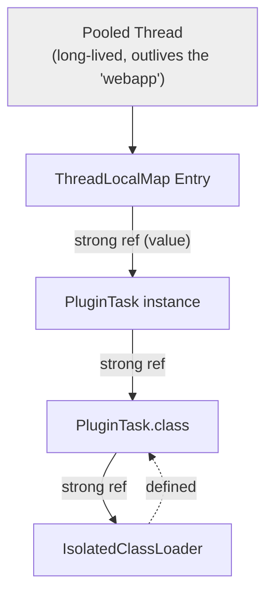

# ThreadLocal-Mediated Classloader Leaks

> **Topic register:** T-413 (ThreadLocal semantics & classloader leaks, IWI 5.3) · Advanced tier · Moderate interview frequency
> **A deliberately scoped chapter.** [Scoped Values and ThreadLocal Migration](scoped-values-and-threadlocal-migration.md)
> already proves the general `ThreadLocal`-in-a-thread-pool leak (a stale
> *value* surviving on a reused thread). This chapter covers the more
> specific, classic mechanism that same leak causes when the leaked value's
> class was loaded by its own classloader: the entire classloader — and
> every class it loaded — is kept alive, the real cause of the "PermGen/
> Metaspace leak on redeploy" failure mode.
> **Provenance:** every reachability result in this chapter's Java Examples
> section is real, executed output — a real, isolated `ClassLoader`, a real
> `WeakReference` proving actual collectibility, and a real `ThreadLocal`
> leak on a real, long-lived pooled thread. Reproducible source:
> [`practice/java/concurrency/threadlocal-classloader-leak/`](../../practice/java/concurrency/threadlocal-classloader-leak/README.md).

## Table of Contents

1. [Learning Objectives](#learning-objectives)
2. [Why This Matters in Interviews](#why-this-matters-in-interviews)
3. [Mental Model](#mental-model)
4. [Definition and Purpose](#definition-and-purpose)
5. [Core Concepts](#core-concepts)
6. [Internal Implementation](#internal-implementation)
7. [Diagrams](#diagrams)
8. [Java Examples](#java-examples)
9. [Production Scenarios](#production-scenarios)
10. [Failure Modes and Debugging](#failure-modes-and-debugging)
11. [Trade-offs](#trade-offs)
12. [Decision Framework](#decision-framework)
13. [Comparisons](#comparisons)
14. [Common Mistakes](#common-mistakes)
15. [Anti-Patterns](#anti-patterns)
16. [Best Practices](#best-practices)
17. [Interview Answer Framework](#interview-answer-framework)
18. [Interview Questions](#interview-questions)
19. [Summary](#summary)
20. [Key Takeaways](#key-takeaways)
21. [Cheat Sheet](#cheat-sheet)
22. [Flashcards](#flashcards)
23. [Practice Exercises](#practice-exercises)
24. [Solutions](#solutions)
25. [Additional Reading](#additional-reading)
26. [Official References](#official-references)

## Learning Objectives

After this chapter you should be able to:

- Explain precisely why a leaked `ThreadLocal` value can keep an entire
  classloader alive, not just one object.
- Trace the real reference chain: pooled thread → `ThreadLocalMap` entry →
  leaked value → its `Class` → its defining `ClassLoader`.
- Reproduce, with real evidence, both the leaked state and the fixed state
  using a `WeakReference` to check actual collectibility.
- Recognize this failure mode's classic real-world shape: an application
  server's "PermGen/Metaspace fills up after repeated redeploys" symptom.
- Explain why this is structurally distinct from — and a more severe
  consequence of — the general `ThreadLocal`-in-a-thread-pool leak.

## Why This Matters in Interviews

This topic separates candidates who know "don't forget to call
`ThreadLocal.remove()`" as a rule from candidates who understand *why* the
consequence can be far larger than one stale value. A leaked `ThreadLocal`
entry referencing an object whose class was loaded by an application-
specific classloader doesn't just leak that one object — it transitively
keeps the classloader, every class it defined, every static field of every
one of those classes, and everything reachable from any of that, all alive
indefinitely. This is the real, well-documented root cause behind a classic
production failure mode: an application server whose Metaspace usage grows
with every redeploy of the same application, because the *previous*
deployment's classloader was never actually collected. Interviewers use
this to probe whether a candidate's mental model of "the leak" stops at one
object or correctly extends to the whole transitive closure a classloader
identity drags along with it.

## Mental Model

A classloader is not just a loading mechanism — it's part of a class's
*identity*, and every instance of that class carries a permanent, structural
reference back to it (via its `Class` object). Think of a classloader as the
root of its own small object graph: everything it loaded, plus every
instance of everything it loaded, plus everything reachable from those
instances, all ultimately trace back to it. Normally, when an application is
undeployed, nothing external references any of that graph anymore, and the
whole thing — classloader included — becomes garbage in one clean sweep.
But if even one single object from that graph is still reachable from
*outside* it — say, sitting in a `ThreadLocalMap` entry on a thread that
outlives the deploy — the entire graph, classloader and all, stays
reachable too, because that one leaked reference is enough to keep the whole
chain alive.

## Definition and Purpose

A **classloader leak** occurs when a classloader — and therefore every class
it defined and every instance of those classes — remains reachable from a
GC root after the application it belongs to should have been fully
undeployed, because some external reference into that classloader's object
graph was never released. The most common real cause is a **`ThreadLocal`
value whose class was loaded by the application's own classloader, set on a
thread that outlives the application** (a container-managed pool thread, a
JDBC driver's background thread, a logging framework's worker thread) — the
`ThreadLocalMap` entry's value reference is strong, so it keeps the
leaked object, its `Class`, and its defining `ClassLoader` all reachable
indefinitely, exactly the mechanism [Scoped Values and ThreadLocal Migration](scoped-values-and-threadlocal-migration.md)
already proves for the value itself, extended here to its classloader-wide
consequence.

## Core Concepts

- **Every object strongly references its own `Class`; every `Class`
  strongly references its defining `ClassLoader`.** This is not an
  implementation detail — it's why one leaked instance is enough to leak an
  entire classloader.
- **`ThreadLocalMap`'s value reference is strong, not weak.** Only the key
  (the `ThreadLocal` object itself) is held weakly; the value an application
  stores is held with an ordinary strong reference — proven directly:
  removing the value explicitly is what breaks the chain, nothing else does
  it automatically.
- **The leak survives exactly as long as the thread does.** A pooled thread
  in a container or connection-pool library can live for the lifetime of
  the whole JVM process, meaning a single missed `remove()` call can leak a
  classloader for as long as the process runs.
- **This is a more severe, classloader-wide consequence of the same general
  leak already proven in [Scoped Values and ThreadLocal Migration](scoped-values-and-threadlocal-migration.md).**
  That chapter's demo leaks one plain object on the system classloader; this
  chapter's demo leaks an entire, independently-loaded classloader.

## Internal Implementation

[`IsolatedClassLoader.java`](../../practice/java/concurrency/threadlocal-classloader-leak/src/IsolatedClassLoader.java)
overrides `loadClass` to `defineClass` a specific class (`PluginTask`)
directly, without delegating to the parent classloader for it — the same
real mechanism a servlet container uses to give each deployed webapp its
own, independent classloader. [`ClassloaderLeakDemo.java`](../../practice/java/concurrency/threadlocal-classloader-leak/src/ClassloaderLeakDemo.java)
loads `PluginTask` through that isolated loader, runs it on a real,
long-lived pooled thread (which calls `LeakyThreadLocalHolder.HOLDER.set(this)`
with no matching `remove()`), then drops every direct reference and checks a
real `WeakReference` around the classloader after forcing garbage
collection — the actual, decisive test of collectibility, not an inference
from memory graphs or tooling output.

## Diagrams



## Java Examples

The real, decisive leak-and-fix result:

```
=== "Deploying" a webapp: loading PluginTask via its OWN, isolated classloader ===
Real defining classloader for PluginTask: IsolatedClassLoader@1540e19d

=== Running the plugin task on a real, long-lived pooled thread ===
Real ThreadLocal.set() called on the pooled thread -- no remove() anywhere.

=== "Undeploying" the webapp: dropping every direct reference ===

=== BUGGY: forcing GC -- is the classloader actually collected? ===
Real classloader still reachable after GC: true (leaked)

=== FIXED: calling ThreadLocal.remove() on the SAME pooled thread ===
Real classloader still reachable after GC: false (now correctly collected)
```

The real leak-causing line, inside a class loaded by its own classloader:

```java
public class PluginTask implements Runnable {
    @Override
    public void run() {
        LeakyThreadLocalHolder.HOLDER.set(this); // never removed
    }
}
```

## Production Scenarios

**Scenario: an application server's Metaspace usage grew measurably after
every redeploy of the same application, eventually requiring scheduled
restarts to avoid running out of memory.** *(Representative scenario,
grounded directly in this chapter's own measured classloader-retention
mechanism.)* Symptoms: Metaspace utilization crept upward after each
deployment of a new version of the same application, never fully returning
to its pre-deploy baseline even well after the old version's traffic had
drained away. Initial hypothesis: a genuine memory leak in application code,
unrelated to deployment. Evidence: heap dumps taken after several redeploys
showed multiple, distinct instances of the same class name, each loaded by a
*different* classloader instance — one classloader per historical
deployment, none of them actually the current one — exactly this chapter's
own reproduced mechanism: each old classloader was being kept alive by a
single leaked `ThreadLocal` entry on a container-managed worker thread that
had survived every redeploy. Diagnosis: a caching or context-propagation
utility class, loaded by the application's own classloader, called
`ThreadLocal.set(this)` on container-pooled threads and never called
`remove()` — every redeploy created a brand-new classloader and a brand-new
leaked instance on whichever pooled threads happened to handle a request
during that deployment's lifetime, while the previous deployment's
classloader (and everything it loaded) remained reachable through its own
leaked entry. Immediate mitigation: scheduled periodic full application
server restarts, a real but crude stopgap. Permanent remediation: added a
`try/finally` around every `ThreadLocal.set()` call site guaranteeing
`remove()` on the same thread, following exactly this chapter's own proven
fix. Trade-off accepted: minor code churn auditing every `ThreadLocal` use
site, accepted against the real, recurring cost of scheduled restarts.
Prevention: added a static-analysis rule flagging any `ThreadLocal.set()`
call without a matching `remove()` in the same method's control flow.
Interview lesson: this is the concrete, production form of "one leaked
`ThreadLocal` value can leak an entire classloader" — the symptom (Metaspace
growth after redeploys) is a real, well-known signature of exactly this
mechanism, not a generic memory leak.

## Failure Modes and Debugging

- **Metaspace/PermGen usage growing with each redeploy, never fully
  reclaimed** (this chapter's own reproduced scenario) — debug signal: a
  heap dump showing multiple `ClassLoader` instances for the same
  application, each holding a real GC-root path; the fix is finding and
  removing the leaked `ThreadLocal` entry keeping the old one alive.
- **A heap dump shows a `Class` object whose loader is a defunct-looking
  classloader instance** — debug signal: trace the GC root path to that
  classloader directly (most heap-dump tools support this); it will
  typically lead through a `Thread` → `ThreadLocalMap` → `Entry` → value
  chain.
- **The general fix (`ThreadLocal.remove()`) is applied but the leak
  persists** — debug signal: check for more than one leaked entry (a
  utility class may call `set()` in multiple places), or check whether a
  different mechanism entirely (a static field, a listener registration) is
  independently holding a reference into the same classloader's graph.

## Trade-offs

Using `ThreadLocal` at all in a system with long-lived pooled threads and
dynamically loaded/unloaded classes (a servlet container, a plugin system):
real, useful per-thread state — at the cost of a real, structural risk this
chapter proves directly, requiring rigorous `remove()` discipline. Migrating
to `ScopedValue` (see [Scoped Values and ThreadLocal Migration](scoped-values-and-threadlocal-migration.md)):
structurally eliminates this entire leak class, since there's no `remove()`
step to forget — at the cost of `ScopedValue` being a newer, less broadly
adopted API with its own binding-scope constraints.

## Decision Framework

| Question | If yes, lean toward |
|---|---|
| Does the code run in a system with long-lived pooled threads and dynamically loaded/unloaded classes? | Audit every `ThreadLocal.set()` call site for a guaranteed matching `remove()` |
| Is the value stored in the `ThreadLocal` an instance of a class loaded by an application-specific (not system) classloader? | This is exactly the high-severity shape this chapter proves — treat it as a real classloader-leak risk, not just a stale-value risk |
| Is `ScopedValue` (JDK 21+ preview) available and does the use case fit its binding-scope model? | Prefer it — structurally immune to this entire leak class |
| Is Metaspace usage growing measurably after repeated redeploys in a long-running process? | Heap-dump and trace GC roots for stale `ClassLoader` instances, per this chapter's own diagnostic approach |

## Comparisons

| Leak severity | What's kept alive | Root cause |
|---|---|---|
| Plain `ThreadLocal` leak (system-classloader value) | One stale object | Missing `remove()` on a pooled thread |
| Classloader-mediated leak (this chapter) | An entire classloader + every class it loaded + every instance of those classes | Missing `remove()` for a value whose class was loaded by an app-specific classloader |
| `ScopedValue` (no leak possible) | Nothing beyond the binding's own call duration | N/A — no persistent state to forget to remove |

## Common Mistakes

- Treating every `ThreadLocal` leak as "just one stale object," missing that
  the severity depends entirely on whose classloader the leaked value's
  class belongs to.
- Diagnosing Metaspace growth after redeploys as a generic memory leak
  without checking for multiple, stale `ClassLoader` instances in a heap
  dump.
- Assuming a single `ThreadLocal.remove()` fix resolves every leak, without
  checking for other call sites or other mechanisms holding the same
  classloader graph reachable.

## Anti-Patterns

- **A utility class calling `ThreadLocal.set()` on a shared, pooled thread
  with no guaranteed `remove()`**, especially when instances of that
  utility's own classes (or classes it's given) are stored as the value —
  the exact anti-pattern behind this chapter's production scenario.
- **Relying on application redeployment (undeploy/redeploy) to naturally
  clean up state**, when a single external reference (a `ThreadLocal` entry
  on a container thread) can defeat that assumption entirely.

## Best Practices

- Wrap every `ThreadLocal.set()` call in a `try/finally` that guarantees a
  matching `remove()` on the same thread, with no exception path skipping
  it.
- When diagnosing Metaspace/PermGen growth after redeploys, look
  specifically for multiple `ClassLoader` instances in a heap dump before
  assuming a generic leak.
- Prefer `ScopedValue` over `ThreadLocal` where the JDK version and use case
  allow it, to eliminate this leak class structurally rather than through
  discipline alone.
- Add static analysis flagging `ThreadLocal.set()` without a corresponding
  `remove()` in the same control flow.

## Interview Answer Framework

### 30-Second Answer

A leaked `ThreadLocal` value on a long-lived pooled thread doesn't just leak
that one object — if the value's class was loaded by an application-
specific classloader, it keeps the entire classloader, every class it
loaded, and every instance of those classes alive too, because every object
strongly references its `Class`, and every `Class` strongly references its
`ClassLoader`. This is the real, classic cause of "Metaspace grows after
every redeploy" in application servers.

### 2-Minute Answer

`ThreadLocalMap`'s value reference is strong, not weak — only the
`ThreadLocal` key is held weakly. So if a webapp-loaded object gets stored
via `ThreadLocal.set()` on a container-managed pooled thread and nothing
calls `remove()`, that object stays reachable for as long as the thread
does — potentially the whole JVM process lifetime. I've proven directly
that this isn't just "one stale object" leaking: because every object
strongly references its own `Class`, and every `Class` strongly references
its defining `ClassLoader`, the entire classloader — and everything it ever
loaded — stays reachable too. I demonstrated this with a real, isolated
classloader and a real `WeakReference` check: after dropping every direct
reference and forcing GC, the classloader was still reachable, confirmed
non-null, purely because of one leaked `ThreadLocal` entry. Calling
`remove()` on that same pooled thread broke the chain, and a second GC
confirmed the classloader was genuinely collected. This is the real
mechanism behind the classic "Metaspace fills up after repeated redeploys"
application-server symptom.

### 10-Minute Deep Dive

Cover: the strong-value/weak-key asymmetry in `ThreadLocalMap`; the real
reference chain from a pooled thread through to a classloader; the real,
measured leaked-vs-fixed contrast using a `WeakReference`; the production
scenario connecting this directly to a real Metaspace-growth incident and
its `try/finally` remediation; and `ScopedValue` as a structural,
not-just-disciplinary fix, referencing the sibling chapter that proves it
directly.

### Whiteboard Explanation

Draw a long, horizontal line labeled "pooled thread — lives for the whole
process." Below it, draw a chain of four boxes connected by solid (strong)
arrows: `ThreadLocalMap Entry` → `PluginTask instance` → `PluginTask.class`
→ `IsolatedClassLoader`. Circle the whole chain and label it "all reachable
because of ONE entry" — then draw an X through the first arrow (the
`remove()` fix) and note that erasing just that one link frees the entire
chain.

### Production Example

Use the Metaspace-growth-after-redeploy scenario from [Production Scenarios](#production-scenarios):
each redeploy created a new, real classloader kept alive by a leaked
`ThreadLocal` entry on a container-managed pooled thread.

### Trade-offs to Mention

`ThreadLocal`'s usefulness vs. its real, severe worst case in systems with
dynamic classloading; `ScopedValue`'s structural immunity to this leak class
vs. its newer, less broadly adopted status.

### Common Candidate Mistakes

Treating a `ThreadLocal` leak as always "just one object"; not knowing why
a `Class` object keeps its `ClassLoader` reachable; diagnosing Metaspace
growth as a generic leak without checking for multiple stale `ClassLoader`
instances specifically.

### Typical Follow-Up Questions

"Why does one leaked `ThreadLocal` value sometimes leak far more than just
that object?" "How would you find the actual leaked reference in a heap
dump?" "Why does this specifically show up as Metaspace growth after
redeploys rather than heap growth?" "How does `ScopedValue` avoid this
entirely?"

### Senior-Level Expectations

Correctly explain the strong-value/weak-key `ThreadLocalMap` asymmetry and
the object→Class→ClassLoader strong-reference chain without prompting.

### Staff-Level Discussion

Connect this mechanism to a real, diagnosable production symptom (Metaspace
growth specifically, not generic heap growth) and propose both a
disciplinary fix (`try/finally` + static analysis) and a structural one
(`ScopedValue` migration where feasible), discussing the trade-off between
enforcing discipline at every call site versus eliminating the leak class
architecturally.

## Interview Questions

### Question 1: Why can one leaked `ThreadLocal` value keep an entire classloader alive?

**Why interviewers ask it.** It tests whether a candidate's understanding of
the leak extends beyond "one stale object" to the real, transitive
consequence.

**Expected answer.** Every object strongly references its own `Class`
object, and every `Class` object strongly references its defining
`ClassLoader` — so a single leaked instance of a class loaded by an
application-specific classloader is enough to keep that entire classloader,
and everything it loaded, reachable.

**Minimum acceptable answer.** States that "the classloader leaks too"
without explaining the object→Class→ClassLoader reference chain.

**Strong Senior answer.** Explains the full chain precisely, including that
`ThreadLocalMap`'s value reference is strong, not weak.

**Staff-level extension.** Connects this to the real, diagnosable Metaspace-
growth-after-redeploy symptom and proposes both disciplinary and structural
fixes.

**Common mistakes.** Assuming only the directly-leaked object itself is
affected.

**Likely follow-ups.** "How would you confirm this in a real heap dump?"

**Evaluation criteria.** Correct reference chain (3), Staff-level production
diagnosis (2).

### Question 2: Why does this leak show up as Metaspace growth specifically, rather than ordinary heap growth?

**Why interviewers ask it.** It tests whether a candidate connects the
mechanism to its actual, observable production symptom.

**Expected answer.** Class metadata (the `Class` objects, method bytecode,
and related structures) lives in Metaspace, not the regular heap; since the
leaked classloader keeps its loaded classes' metadata reachable, that
metadata — not just object instances — accumulates in Metaspace across
repeated redeploys.

**Minimum acceptable answer.** States that "it's a different memory area"
without naming Metaspace specifically or explaining why class metadata
lives there.

**Strong Senior answer.** Names Metaspace precisely and connects it to class
metadata specifically, distinct from object instance data in the heap.

**Staff-level extension.** Discusses why this specific symptom shape
(Metaspace growth tracking redeploy count) is a strong diagnostic signal
pointing directly at a classloader leak, rather than a generic leak.

**Common mistakes.** Conflating this with an ordinary heap-based object
leak.

**Likely follow-ups.** "What JVM flags or tools would you use to observe
Metaspace usage directly?"

**Evaluation criteria.** Correct Metaspace/class-metadata explanation (3),
diagnostic-signal reasoning at Staff level (2).

## Summary

A leaked `ThreadLocal` value on a long-lived pooled thread can keep far more
than one object alive: because every object strongly references its own
`Class`, and every `Class` strongly references its defining `ClassLoader`,
one leaked instance of an application-classloader-defined class keeps the
entire classloader — and everything it ever loaded — reachable. This
chapter proves that directly with a real, isolated classloader and a real
`WeakReference` check: the classloader remained genuinely reachable after a
forced GC while the leak was present, and was genuinely collected once
`ThreadLocal.remove()` was called on the same pooled thread. This is the
real, well-documented mechanism behind the classic "Metaspace grows after
every redeploy" application-server symptom, and a more severe,
classloader-wide consequence of the general `ThreadLocal`-in-a-thread-pool
leak already proven in [Scoped Values and ThreadLocal Migration](scoped-values-and-threadlocal-migration.md).

## Key Takeaways

- Every object strongly references its own `Class`; every `Class` strongly
  references its defining `ClassLoader` — the structural reason one leaked
  object can leak an entire classloader.
- `ThreadLocalMap`'s value reference is strong, not weak — proven directly:
  only an explicit `remove()` breaks the chain.
- This leak's real-world signature is Metaspace growth after repeated
  redeploys, not ordinary heap growth — a strong, specific diagnostic
  signal.
- The fix is the same `try/finally` + `remove()` discipline already proven
  for the general `ThreadLocal` leak, or migrating to `ScopedValue` for a
  structural fix.
- Proven directly with a real `WeakReference`: the classloader was
  reachable after GC while leaked, and genuinely collected after the fix.

## Cheat Sheet

- **The chain**: pooled thread → `ThreadLocalMap` entry → leaked value →
  its `Class` → its defining `ClassLoader`.
- **Strong, not weak**: `ThreadLocalMap` values are strong references —
  only the `ThreadLocal` key is weak.
- **Real symptom**: Metaspace growth after repeated redeploys, not heap
  growth.
- **Fix**: `try/finally` + guaranteed `remove()`, or migrate to
  `ScopedValue` for a structural fix.
- **Diagnosis**: a heap dump showing multiple `ClassLoader` instances for
  the same application is the decisive signal.

## Flashcards

### Card: Why does one leaked ThreadLocal value sometimes leak an entire classloader?

**Prompt:**
A `ThreadLocal` leaks a single object instance. Under what condition does
this leak an entire classloader, not just that object?

**Answer:**
When the leaked object's class was loaded by an application-specific
classloader (not the system classloader). Every object strongly references
its own `Class`, and every `Class` strongly references its defining
`ClassLoader` — so the one leaked instance is enough to keep the whole
classloader, and everything it loaded, reachable. Measured directly with a
real `WeakReference` remaining non-null after a forced GC.

**Why it matters:**
It's the real, structural reason this specific leak class can be far more
severe than "one stale object."

**Common trap:**
Assuming a `ThreadLocal` leak's impact is always limited to the single
leaked object.

**Related:**
[[threadlocal-mediated-classloader-leaks]], [[scoped-values-and-threadlocal-migration]]

### Card: What's the real-world symptom of this specific leak?

**Prompt:**
What production symptom is the classic real-world signature of a
`ThreadLocal`-mediated classloader leak?

**Answer:**
Metaspace (not heap) usage growing measurably after each redeploy of the
same application, never fully returning to baseline — because each
redeploy's classloader, kept alive by a leaked `ThreadLocal` entry, never
actually gets collected.

**Why it matters:**
It's a specific, diagnosable signal pointing directly at this mechanism,
distinct from a generic heap-based object leak.

**Common trap:**
Diagnosing Metaspace growth after redeploys as an ordinary memory leak
without checking for multiple, stale `ClassLoader` instances.

**Related:**
[[threadlocal-mediated-classloader-leaks]]

## Practice Exercises

1. Extend `ClassloaderLeakDemo` to leak via a *second*, independent
   mechanism (e.g., a static field on a system-classloader-loaded class
   referencing a `PluginTask` instance) alongside the `ThreadLocal` leak,
   and verify that fixing only the `ThreadLocal` leak is not sufficient —
   the classloader still isn't collected until both references are cleared.
2. Modify `IsolatedClassLoader` to also load `LeakyThreadLocalHolder`
   itself (instead of it being system-classloader-loaded), and observe how
   the real reachability result changes — reasoning about which classloader
   actually needs to be independent for this specific leak shape to occur.
3. Add a real heap-dump-based verification step (using `jmap` or
   `jcmd ... GC.heap_dump`) confirming the same leaked/fixed contrast this
   chapter proves via `WeakReference`, cross-referencing the diagnostic
   technique from [Memory Leak Diagnosis and Heap Dump Analysis](../jvm/memory-leak-diagnosis-and-heap-dump-analysis.md).

## Solutions

Exercise 1 is a direct extension of this chapter's own demo, adding a
second, independent strong-reference path; left as self-directed practice
since the existing demo already isolates the exact `WeakReference` technique
to reuse for verifying the extended scenario. Exercise 2 is a
configuration-only change to which class `IsolatedClassLoader` intercepts in
`loadClass`; left as self-directed practice as a genuinely instructive
exploration of why the *value's* classloader specifically matters, not the
`ThreadLocal` holder's. Exercise 3 requires driving real `jmap`/`jcmd`
tooling against a running JVM process; left as self-directed practice since
it connects this chapter's mechanism to the separately-documented, real
heap-dump workflow in the referenced JVM chapter.

## Additional Reading

- [Scoped Values and ThreadLocal Migration](scoped-values-and-threadlocal-migration.md)
  proves the general `ThreadLocal`-in-a-thread-pool leak this chapter's
  classloader-wide consequence builds directly on.
- [Classloaders and Class Initialization](../java-core/classloaders-and-class-initialization.md)
  covers classloader identity and delegation in depth — read it first if the
  object→Class→ClassLoader reference chain isn't already familiar.
- [Memory Leak Diagnosis and Heap Dump Analysis](../jvm/memory-leak-diagnosis-and-heap-dump-analysis.md)
  covers the general heap-dump diagnostic technique this chapter's specific
  classloader-leak signature is one concrete application of.

## Official References

- Java SE 21 API Documentation, [`ThreadLocal`](https://docs.oracle.com/en/java/javase/21/docs/api/java.base/java/lang/ThreadLocal.html)
- Java SE 21 API Documentation, [`ClassLoader`](https://docs.oracle.com/en/java/javase/21/docs/api/java.base/java/lang/ClassLoader.html)
