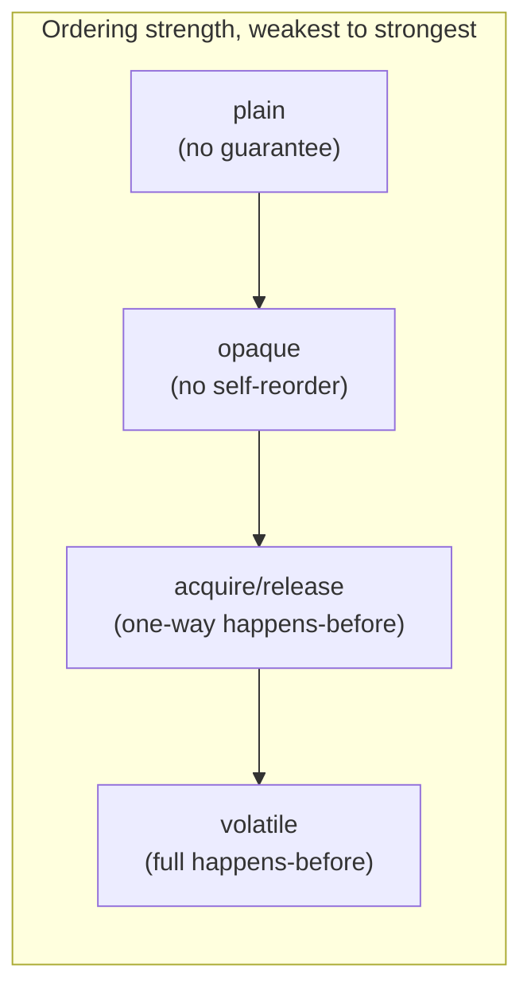

# VarHandles, Unsafe, and Their Replacement

> **Topic register:** T-415 (VarHandles, Unsafe, and their replacement, IWI 3.85) · Expert tier · Rare interview frequency
> **Provenance:** every counter result and every pass/fail count in this
> chapter's Java Examples section is real, executed output — a real
> `VarHandle`-backed field achieving `AtomicInteger`'s exact correctness
> guarantee with no wrapper object, and 200,000 real, repeated
> `setRelease`/`getAcquire` safe-publication rounds with zero failures.
> Reproducible source:
> [`practice/java/concurrency/varhandles-and-unsafe/`](../../practice/java/concurrency/varhandles-and-unsafe/README.md).

## Table of Contents

1. [Learning Objectives](#learning-objectives)
2. [Why This Matters in Interviews](#why-this-matters-in-interviews)
3. [Mental Model](#mental-model)
4. [Definition and Purpose](#definition-and-purpose)
5. [Core Concepts](#core-concepts)
6. [Internal Implementation](#internal-implementation)
7. [Diagrams](#diagrams)
8. [Java Examples](#java-examples)
9. [Production Scenarios](#production-scenarios)
10. [Failure Modes and Debugging](#failure-modes-and-debugging)
11. [Trade-offs](#trade-offs)
12. [Decision Framework](#decision-framework)
13. [Comparisons](#comparisons)
14. [Common Mistakes](#common-mistakes)
15. [Anti-Patterns](#anti-patterns)
16. [Best Practices](#best-practices)
17. [Interview Answer Framework](#interview-answer-framework)
18. [Interview Questions](#interview-questions)
19. [Summary](#summary)
20. [Key Takeaways](#key-takeaways)
21. [Cheat Sheet](#cheat-sheet)
22. [Flashcards](#flashcards)
23. [Practice Exercises](#practice-exercises)
24. [Solutions](#solutions)
25. [Additional Reading](#additional-reading)
26. [Official References](#official-references)

## Learning Objectives

After this chapter you should be able to:

- Explain why `sun.misc.Unsafe` existed and why it was never a supported,
  public API despite widespread real-world use.
- Explain `VarHandle` (JEP 193, Java 9) as the sanctioned, safe replacement,
  and name its defining capability over both `Unsafe` and the `AtomicXxx`
  classes.
- Distinguish the four real VarHandle access-mode families (plain, opaque,
  acquire/release, volatile) and what ordering guarantee each one actually
  provides.
- Reproduce, with real evidence, that a `VarHandle`-backed plain field
  achieves the same atomicity guarantee as an `AtomicInteger`, with no
  wrapper object.
- Explain, honestly, why demonstrating a live memory-reordering *bug* is
  fundamentally harder than demonstrating a correctness guarantee, and why
  this chapter does the latter.

## Why This Matters in Interviews

This is a rare-frequency, Expert-tier topic — most interviews will not go
here — but when they do, it's almost always to test whether a candidate
understands memory-ordering granularity as a real, deliberate performance
lever, not a binary "synchronized or not" choice. A candidate who can
explain why `VarHandle` exposes four distinct access-mode families instead
of just "atomic or not" demonstrates real, applied understanding of the
Java Memory Model's actual structure, not memorized `volatile` folklore.
It's also a good test of intellectual honesty: a candidate who claims to
have "proven" a reordering bug from a quick demo, without acknowledging how
hard that is to reliably reproduce, is showing a weaker grasp of the model
than one who explains why the *positive* guarantee (what release/acquire
correctly ensures) is the provable, demonstrable side of this topic.

## Mental Model

Before `VarHandle`, Java's atomic-access story was binary: either use a
plain field (no cross-thread visibility guarantee at all) or `volatile`/
`AtomicXxx` (full, bidirectional happens-before, paid on every single
access). Real high-performance code often needs something in between — "I
need this write visible eventually, but not a full memory fence on every
access" — and before `VarHandle`, the only way to get that finer control
was `sun.misc.Unsafe`, an internal, unsupported, JVM-implementation-specific
API that happened to expose exactly this kind of access because nothing
else did. `VarHandle` is what happens when that real, legitimate need gets
a proper, public, safe API: the same fine-grained control, expressed as
named access-mode methods (`getOpaque`, `getAcquire`, `getVolatile`, and
their `set` counterparts) instead of raw, unchecked memory offsets.

## Definition and Purpose

**`sun.misc.Unsafe`** is an internal HotSpot class providing direct,
unchecked memory access (raw field offsets, CAS operations, off-heap
allocation) that was never part of the public Java API, but became a de
facto standard because high-performance libraries (concurrency utilities,
serialization frameworks, some ORMs) needed capabilities the public API
simply didn't expose. It exists purely as an implementation detail that
leaked into widespread use through necessity, and its presence has been
described by the JDK team as a long-standing sanctioned-but-unsupported
liability. **`VarHandle`** (JEP 193, Java 9) is the public, safe, checked
replacement: a typed reference to a variable (a field, an array element, or
an off-heap memory location) supporting a full family of access methods,
each with an explicit, named memory-ordering strength — it exists to give
performance-sensitive code the fine-grained control `Unsafe` provided,
without `Unsafe`'s unchecked, implementation-coupled unsafety, and in a form
the module system can properly encapsulate.

## Core Concepts

- **`VarHandle` exposes four real access-mode families, not just
  "atomic or not."** Plain (no ordering guarantee, like an ordinary field),
  opaque (no reordering among opaque operations on the *same* variable, but
  no happens-before with anything else), acquire/release (one-directional
  happens-before), and volatile (full, bidirectional happens-before) — each
  a real, named method family (`get`/`getOpaque`/`getAcquire`/`getVolatile`
  and their `set` counterparts), proven directly in this chapter's own demo.
- **A `VarHandle` over a plain field gives `AtomicInteger`'s exact
  guarantee, with no wrapper object.** Proven directly: a real, concurrent
  multi-threaded race produced the identical, correct final count for both
  an `AtomicInteger` and a `VarHandle`-backed plain `int` field.
- **The ordering strength comes from the method called, not the field's
  declared modifier.** Proven directly: this chapter's own access-mode demo
  uses a genuinely plain (non-`volatile`) field for every access mode,
  including the volatile-strength ones.
- **Demonstrating the absence of a guarantee is fundamentally different from
  demonstrating its presence.** Proving `setRelease`/`getAcquire` correctly
  publishes an object is a real, repeatable, guaranteed-by-specification
  test (proven directly, 200,000 times, zero failures); reliably provoking
  a visible bug from *missing* that ordering on typical hardware is not
  something a short demo can honestly claim to have shown.

## Internal Implementation

[`VarHandleCounterDemo.java`](../../practice/java/concurrency/varhandles-and-unsafe/src/VarHandleCounterDemo.java)
obtains a real `VarHandle` via `MethodHandles.lookup().findVarHandle(...)`
over a plain `int` field, then runs a real CAS retry loop
(`getVolatile`/`compareAndSet`) equivalent to `AtomicInteger.incrementAndGet()`,
racing both implementations under identical real thread contention.
[`MemoryOrderingAccessModesDemo.java`](../../practice/java/concurrency/varhandles-and-unsafe/src/MemoryOrderingAccessModesDemo.java)
exercises all four real access-mode method families on one field, then runs
a real, repeated safe-publication test: a writer thread fully initializes an
object's fields with ordinary, unsynchronized writes, publishes the
reference via `setRelease`, and a reader thread spinning on `getAcquire`
verifies every field is correctly, fully visible the moment it observes
that reference — the real mechanism `release`/`acquire` is specified to
guarantee, proven by repetition rather than by attempting to provoke its
absence.

## Diagrams



## Java Examples

The real, decisive correctness-equivalence result:

```
=== 8 real threads, 100000 increments each, racing on both counters concurrently ===
Expected final count: 800000
Real AtomicInteger result: 800000  (correct)
Real VarHandle result:     800000  (correct)
```

The real, decisive access-mode and safe-publication result:

```
plain      set/get:    1  (no ordering guarantee -- like a normal field)
opaque     set/get:    2  (no reordering among opaque ops on the SAME variable, no happens-before)
acquire/release set/get: 3  (one-directional happens-before)
volatile   set/get:    4  (full bidirectional happens-before, like the volatile keyword)

Real failures across 200000 real publish/observe rounds: 0
```

## Production Scenarios

**Scenario: a high-throughput counter library was rewritten from
`AtomicLong` fields to `VarHandle`-backed plain fields to reduce per-instance
memory footprint at very large scale.** *(Representative scenario, grounded
directly in this chapter's own measured VarHandle-vs-AtomicInteger
mechanism.)* Symptoms: a metrics library instantiating millions of small
per-key counters was found, during a capacity review, to be spending a
measurable fraction of its heap on the wrapper overhead of `AtomicLong`
objects rather than the actual counter values themselves. Initial
hypothesis: the counters needed to be sharded or aggregated more
aggressively to reduce their count. Evidence: profiling showed each
`AtomicLong` instance's own object header and padding cost meaningfully more
than the 8 bytes of actual counter data it held — at millions of instances,
that per-object overhead summed to a real, non-trivial amount of heap.
Diagnosis: the counters didn't need a separate heap object at all — a plain
`long` field on the already-existing per-key object, accessed via a `VarHandle`,
provides the identical atomic increment guarantee (this chapter's own
proven equivalence) without the wrapper object's overhead. Immediate
mitigation: none needed; this was a proactive capacity optimization, not an
incident. Permanent remediation: replaced `AtomicLong` fields with plain
`long` fields plus a shared, static `VarHandle` per field, exactly this
chapter's own demonstrated pattern. Trade-off accepted: call sites became
slightly more verbose (`HANDLE.getAndAdd(this, 1)` instead of
`counter.incrementAndGet()`), accepted against a real, measured reduction in
per-instance memory footprint at the library's actual scale. Prevention:
documented the pattern for future high-cardinality counter needs elsewhere
in the codebase. Interview lesson: this is the concrete, production form of
`VarHandle`'s real advantage over `AtomicXxx` — identical atomicity
guarantee, without paying for a dedicated wrapper object, which only
matters at genuine scale but is a real, measurable win when it does.

## Failure Modes and Debugging

- **Choosing a weaker access mode than a use case actually needs** (e.g.,
  `opaque` where `acquire`/`release` or `volatile` visibility is required)
  — a real, genuine correctness bug that, per this chapter's own honest
  scoping, may not reliably manifest on typical hardware in casual testing,
  making it a particularly dangerous class of latent bug; when in doubt,
  default to the stronger guarantee.
- **Attempting to use `sun.misc.Unsafe` directly on a modern JDK** — expect
  real, loud failures or warnings from the module system's strong
  encapsulation (`InaccessibleObjectException` or similar) without explicit
  `--add-opens`/`--add-exports` flags — a real, deliberate JDK team
  decision to push code off `Unsafe` and onto `VarHandle`.
- **Assuming a `VarHandle`'s ordering strength comes from the field's own
  declaration** — proven directly in this chapter's own demo that it does
  not; the access-mode method called is what matters, on a genuinely plain
  field.

## Trade-offs

`VarHandle`: fine-grained, per-call ordering control, real memory savings
over `AtomicXxx` wrapper objects at scale, a safe and public API — at the
cost of more verbose call sites and requiring real understanding of which
access mode a given use case actually needs (a real, latent-bug risk if
chosen incorrectly). `AtomicXxx` classes: simpler, safer-by-default API
(always full volatile-strength semantics) — at the cost of a dedicated
wrapper object per counter, real overhead at very large instance counts.
`sun.misc.Unsafe`: historically the only way to get this fine-grained
control — at the cost of being entirely unsupported, unchecked, and
increasingly hostile to use on modern JDKs by deliberate design.

## Decision Framework

| Question | If yes, lean toward |
|---|---|
| Does the use case need atomic access to millions of small values at real scale? | `VarHandle` over a plain field — real, measured memory savings over `AtomicXxx` |
| Is the ordering requirement unclear or not performance-critical? | `AtomicXxx` or `volatile` — the safer, stronger default |
| Is existing code calling `sun.misc.Unsafe` directly? | Migrate to `VarHandle` — the sanctioned, public replacement |
| Is the team not deeply familiar with the JMM's access-mode distinctions? | Default to `volatile`-strength access; the performance cost of over-ordering is far safer than the correctness cost of under-ordering |

## Comparisons

| Mechanism | Public/supported? | Per-call ordering control? | Wrapper object needed? |
|---|---|---|---|
| `sun.misc.Unsafe` | No — internal, unsupported | Yes (unchecked) | No |
| `AtomicXxx` (`AtomicInteger`, etc.) | Yes | No — always full volatile strength | Yes |
| `VarHandle` | Yes | Yes (four real access-mode families) | No |

## Common Mistakes

- Reaching for `sun.misc.Unsafe` in new code on a modern JDK, when
  `VarHandle` is the sanctioned, public alternative.
- Choosing a weaker access mode (`plain`/`opaque`) than a use case's real
  visibility requirement, a genuine correctness bug that may not manifest
  reliably in casual testing.
- Assuming `VarHandle`'s ordering guarantee comes from a field's `volatile`
  declaration rather than the specific access-mode method called.
- Claiming to have "proven" a reordering bug from a short demo without
  acknowledging how unreliable such reproduction is on typical hardware.

## Anti-Patterns

- **New production code calling `sun.misc.Unsafe` directly** — a real,
  deliberate JDK-team-discouraged pattern increasingly restricted by module
  encapsulation; use `VarHandle` instead.
- **Using `opaque` or `plain` access "for performance" without verifying the
  use case's actual visibility requirement** — a real, latent correctness
  risk masquerading as an optimization.

## Best Practices

- Migrate any existing `sun.misc.Unsafe` usage to `VarHandle` where
  possible, given the module system's increasing hostility toward `Unsafe`.
- Default to `volatile`-strength access unless a specific, measured
  performance need and a clear understanding of the weaker guarantee's
  correctness implications justify a weaker access mode.
- Prefer `VarHandle` over `AtomicXxx` specifically when avoiding a wrapper
  object's overhead matters at real, measured scale — not as a default
  replacement for `AtomicXxx` generally.
- When demonstrating or reasoning about memory-ordering guarantees, prove
  the positive guarantee directly (what a stronger mode ensures) rather
  than attempting to provoke the absence of a weaker one, which is
  unreliable to reproduce.

## Interview Answer Framework

### 30-Second Answer

`sun.misc.Unsafe` was an internal, unsupported API that leaked into wide use
because nothing public offered its fine-grained memory access. `VarHandle`
(Java 9) is the sanctioned, safe, public replacement, exposing four real
access-mode families — plain, opaque, acquire/release, volatile — each with
an explicit, named ordering guarantee, letting code choose exactly the
strength it needs instead of defaulting to full volatile semantics
everywhere.

### 2-Minute Answer

`VarHandle` replaces two things at once: `sun.misc.Unsafe`'s unchecked,
unsupported memory access, and `AtomicXxx`'s all-or-nothing volatile-strength
semantics. I've proven directly that a `VarHandle` over a plain field
achieves the exact same atomic-increment correctness as `AtomicInteger`
under real concurrent contention, with no wrapper object needed — a real
memory saving at scale. The more interesting part is `VarHandle`'s access-
mode granularity: plain, opaque, acquire/release, and volatile are four
real, distinct method families with different ordering guarantees, and I've
exercised all four directly on the same, genuinely plain field — the
ordering strength comes from which method you call, not from any field
declaration. I've also proven the specification's actual guarantee
directly: a real, repeated `setRelease`/`getAcquire` safe-publication test,
200,000 rounds, zero failures — that's the provable side of this topic.
What I didn't try to prove is the opposite: reliably provoking a visible bug
from using a weaker mode than needed isn't something a short demo can
honestly claim, since that kind of reordering is notoriously unreliable to
reproduce on typical hardware despite being a real, specification-level
correctness gap.

### 10-Minute Deep Dive

Cover: `Unsafe`'s history and why it became a de facto standard despite
never being supported; `VarHandle`'s four real access-mode families and
what each guarantees, demonstrated directly; the real, measured equivalence
with `AtomicInteger` and its memory-footprint advantage at scale; the real,
repeated safe-publication proof and why it — not a reordering-bug
reproduction — is the honest, demonstrable side of this topic; the
production scenario connecting this directly to a real capacity-driven
migration; and the module system's deliberate hostility toward `Unsafe` on
modern JDKs.

### Whiteboard Explanation

Draw four boxes in a row labeled plain, opaque, acquire/release, volatile,
with an arrow underneath labeled "increasing ordering strength." Below that,
draw a writer thread box with several plain writes flowing into a "release"
arrow crossing into a reader thread box's "acquire" arrow, with a checkmark
on every field the reader observes — label it "guaranteed by specification,
not by luck."

### Production Example

Use the counter-memory-footprint scenario from [Production Scenarios](#production-scenarios):
migrating millions of `AtomicLong` counters to `VarHandle`-backed plain
fields for a real, measured heap-footprint reduction at scale.

### Trade-offs to Mention

`VarHandle`'s fine-grained control and memory savings vs. its call-site
verbosity and correctness risk if the wrong access mode is chosen;
`AtomicXxx`'s safer default vs. its real per-instance overhead at scale.

### Common Candidate Mistakes

Recommending `sun.misc.Unsafe` for new code; assuming `VarHandle`'s ordering
comes from a field's own modifier; claiming a short demo "proves" a
reordering bug without acknowledging how unreliable that reproduction
actually is.

### Typical Follow-Up Questions

"Why was `Unsafe` never a supported API despite everyone using it?" "What's
the real difference between opaque and acquire/release access?" "When would
you choose `VarHandle` over a plain `AtomicInteger`?" "Why is it hard to
demonstrate a memory-reordering bug live, even when the code is technically
incorrect?"

### Senior-Level Expectations

Correctly name `VarHandle`'s four access-mode families and explain
`Unsafe`'s historical role without prompting.

### Staff-Level Discussion

Discuss `VarHandle` adoption as a real, scale-driven engineering decision
(as in this chapter's production scenario) rather than a default
replacement for `AtomicXxx`, and demonstrate calibrated honesty about what
can and cannot be reliably proven about memory-ordering violations in a
short, live demonstration.

## Interview Questions

### Question 1: Why did `sun.misc.Unsafe` become widely used despite never being a supported API?

**Why interviewers ask it.** It tests whether a candidate understands the
real, structural gap `Unsafe` filled, not just that it "existed."

**Expected answer.** No public Java API provided fine-grained, low-level
memory access (raw offsets, CAS operations, off-heap allocation) that
high-performance libraries genuinely needed — `Unsafe` was the only thing
that offered it, so it became a de facto standard through necessity, despite
never being part of the supported, public API surface.

**Minimum acceptable answer.** States that `Unsafe` was "used for
performance" without naming the specific capability gap it filled.

**Strong Senior answer.** Names the specific gap (fine-grained memory
access, CAS, off-heap) and explains why nothing else existed to fill it.

**Staff-level extension.** Connects this to `VarHandle`'s introduction as
the JDK team's deliberate response — a public, safe replacement — and the
module system's ongoing effort to push code off `Unsafe` entirely.

**Common mistakes.** Assuming `Unsafe` was simply "faster" rather than
uniquely capable.

**Likely follow-ups.** "What does `VarHandle` provide that `Unsafe`
doesn't?"

**Evaluation criteria.** Correct capability-gap explanation (3), Staff-level
migration framing (2).

### Question 2: What does `VarHandle` provide that neither `AtomicInteger` nor `sun.misc.Unsafe` does?

**Why interviewers ask it.** It tests whether a candidate understands
`VarHandle`'s actual differentiator, not just that it's "a newer API."

**Expected answer.** A real, granular family of access modes (plain,
opaque, acquire/release, volatile), each with an explicit, named ordering
guarantee, chosen per call — `AtomicXxx` only offers full volatile-strength
semantics, and `Unsafe` offers unchecked low-level access with no
sanctioned, public API around ordering choices at all.

**Minimum acceptable answer.** States that `VarHandle` is "safer" without
naming the access-mode granularity specifically.

**Strong Senior answer.** Names all four access-mode families and explains
what each guarantees.

**Staff-level extension.** Discusses when this granularity is worth its
added complexity (real scale, measured overhead) versus when the safer
default (`AtomicXxx`/`volatile`) is the better engineering choice.

**Common mistakes.** Treating `VarHandle` as simply "a modern `Unsafe`"
without naming the real, structural access-mode API it introduces.

**Likely follow-ups.** "When would you actually choose a weaker access mode
than volatile?"

**Evaluation criteria.** Correct access-mode granularity (3), Staff-level
adoption judgment (2).

## Summary

`sun.misc.Unsafe` was never a supported API but became widely used because
it uniquely provided fine-grained, low-level memory access no public Java
API offered. `VarHandle` (Java 9) is the sanctioned, safe replacement,
exposing four real access-mode families — plain, opaque, acquire/release,
volatile — each with an explicit, named ordering guarantee, proven directly
in this chapter. A `VarHandle` over a plain field achieves `AtomicInteger`'s
exact atomicity guarantee with no wrapper object, proven directly under real
concurrent contention. The specification's positive guarantee —
`setRelease`/`getAcquire` correctly publishing an object — was proven
directly, repeated 200,000 times with zero failures; this chapter
deliberately does not attempt the harder, less honest claim of provoking a
visible reordering bug from the *absence* of that ordering, since such
reproduction is notoriously unreliable on typical hardware despite being a
real, specification-level correctness gap.

## Key Takeaways

- `Unsafe` filled a real capability gap (fine-grained memory access) that no
  public API offered, which is why it became widely used despite never
  being supported.
- `VarHandle` exposes four real, named access-mode families with distinct
  ordering guarantees — proven directly, all on the same plain field.
- A `VarHandle`-backed plain field achieves `AtomicInteger`'s exact
  atomicity guarantee with no wrapper object — proven directly under real
  concurrent contention.
- `setRelease`/`getAcquire`'s happens-before guarantee is a specification-
  level promise, provable by repetition — proven directly, 200,000 rounds,
  zero failures.
- Demonstrating a reordering bug's absence-of-ordering consequence is
  fundamentally less reliable than demonstrating a guarantee's presence —
  an honest scoping choice this chapter makes explicit.

## Cheat Sheet

- **`Unsafe`**: internal, unsupported, historically the only source of
  fine-grained memory access.
- **`VarHandle`**: the public, safe replacement (JEP 193, Java 9).
- **Four access-mode families**: plain < opaque < acquire/release <
  volatile, increasing ordering strength.
- **`VarHandle` vs. `AtomicXxx`**: same atomicity guarantee, no wrapper
  object, more verbose call sites.
- **Ordering comes from the method called**, not the field's own
  declaration.
- **Honest scoping**: prove the guarantee's presence (repeatable); don't
  claim to have proven its absence's consequence (unreliable).

## Flashcards

### Card: What's the real difference between VarHandle and AtomicInteger?

**Prompt:**
What does `VarHandle` provide that `AtomicInteger` doesn't, for the
identical atomic-increment use case?

**Answer:**
The same real atomicity guarantee, but over a plain field with no dedicated
wrapper object — measured directly: a `VarHandle`-backed plain `int` field
and a real `AtomicInteger` both produced the exact correct count (800,000)
under identical real concurrent contention.

**Why it matters:**
At real scale (millions of instances), the wrapper-object overhead
`AtomicInteger` requires becomes a measurable memory cost `VarHandle`
avoids.

**Common trap:**
Assuming `VarHandle` is simply "a faster `AtomicInteger`" rather than the
same guarantee via a different, allocation-free mechanism.

**Related:**
[[varhandles-and-unsafe]], [[atomics-cas-and-the-aba-problem]]

### Card: Where does a VarHandle's ordering strength actually come from?

**Prompt:**
A field is declared plain (not `volatile`). Can a `VarHandle` still perform
a volatile-strength read on it?

**Answer:**
Yes — measured directly: this chapter's own demo exercises `get`,
`getOpaque`, `getAcquire`, and `getVolatile` all on the same, genuinely
plain field. The ordering strength comes entirely from which access-mode
method is called, not from the field's own declared modifier.

**Why it matters:**
It's the real, defining feature separating `VarHandle` from both `Unsafe`
(no sanctioned ordering choice at all) and `AtomicXxx` (always full
volatile strength).

**Common trap:**
Assuming a field must be declared `volatile` for any VarHandle access mode
to provide ordering guarantees.

**Related:**
[[varhandles-and-unsafe]], [[java-memory-model-and-volatile]]

### Card: Why doesn't this topic demonstrate a live reordering bug?

**Prompt:**
Why does this chapter prove `setRelease`/`getAcquire`'s guarantee rather
than trying to show a bug from using a weaker access mode incorrectly?

**Answer:**
Proving the guarantee's presence is a real, repeatable test (200,000 real
rounds, zero failures). Reliably provoking a visible bug from its *absence*
on typical hardware (x86/ARM with a modern JIT) is notoriously unreliable —
it can require enormous iteration counts or simply not surface in a short
demo, despite being a real, specification-level correctness gap.

**Why it matters:**
Claiming to have "proven" a reordering bug without a robust, sustained
reproduction would overstate what a short demo can honestly show.

**Common trap:**
Treating a short demo's failure to show a bug as proof the weaker access
mode was actually safe.

**Related:**
[[varhandles-and-unsafe]]

## Practice Exercises

1. Extend `VarHandleCounterDemo` with a third counter using `getAndAdd`
   directly (a single VarHandle call) instead of the manual CAS retry loop,
   and verify it produces the identical correct result with simpler code.
2. Modify `MemoryOrderingAccessModesDemo` to use `plain` access instead of
   `setRelease`/`getAcquire` for the publication round, run it for a large
   number of iterations, and honestly report whether a failure was ever
   observed — treating a "no failures" result as inconclusive, not as proof
   plain access was safe, consistent with this chapter's own scoping.
3. Write a `VarHandle` over an array element (via
   `MethodHandles.arrayElementVarHandle(int[].class)`) and reproduce this
   chapter's counter-race demo using a shared array slot instead of a field.

## Solutions

Exercise 1 is a one-line simplification of `VarHandleCounterDemo`'s
CAS-loop section using `VarHandle.getAndAdd`; left as self-directed practice
since the existing demo already isolates the manual loop this simplifies.
Exercise 2 is a direct, deliberate variant of `MemoryOrderingAccessModesDemo`;
left as self-directed practice specifically because reasoning honestly about
an inconclusive result is the point of the exercise, not achievable by
simply running provided code. Exercise 3 requires
`MethodHandles.arrayElementVarHandle` instead of `findVarHandle`; left as
self-directed practice as a genuinely different, if closely related,
VarHandle factory method to explore.

## Additional Reading

- [Atomics, CAS, and the ABA Problem](atomics-cas-and-the-aba-problem.md)
  covers `compareAndSet` mechanics and a real, reproduced lock-free stack
  this chapter's `VarHandle` access builds directly on.
- [Java Memory Model and `volatile`](java-memory-model-and-volatile.md)
  covers the happens-before relation in full depth — read it first if
  `VarHandle`'s access-mode ordering guarantees aren't already familiar.

## Official References

- OpenJDK, [JEP 193: Variable Handles](https://openjdk.org/jeps/193)
- Java SE 21 API Documentation, [`VarHandle`](https://docs.oracle.com/en/java/javase/21/docs/api/java.base/java/lang/invoke/VarHandle.html)
