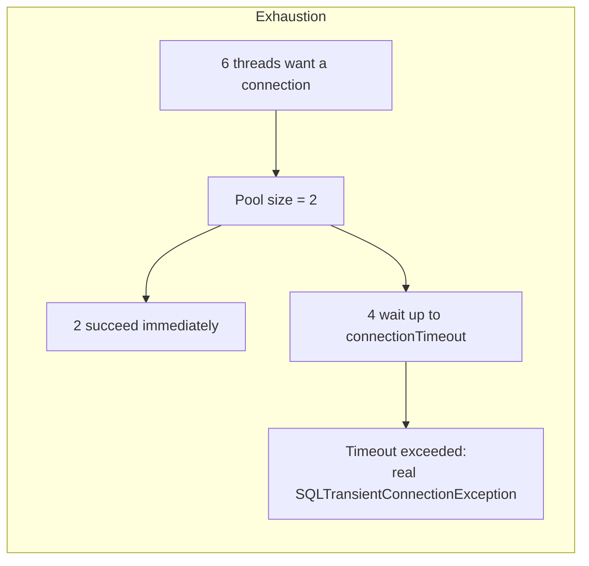

# Connection Pooling and Sizing (HikariCP)

> **Topic register:** T-607 · IWI 6.4 · Advanced tier · Moderate interview
> frequency.
> **Provenance:** every timing number and exception in this chapter is real,
> executed output against a real HikariCP 5.1.0 pool and a real, CPU-capped
> PostgreSQL 16 container — a real `SQLTransientConnectionException`, a real
> leak-detection stack trace, and real measured throughput across four real pool
> sizes. Reproducible source:
> [`practice/java/databases/connection-pooling-and-sizing/`](../../practice/java/databases/connection-pooling-and-sizing/README.md).

> **Closes another open forward reference.** [JPA Entity Lifecycle and the N+1 Problem](jpa-entity-lifecycle-and-the-n1-problem.md)
> and [Spring @Transactional: Proxy Mechanics, Rollback Rules, and Propagation](../spring/transactional-proxy-mechanics-and-propagation.md)
> both describe connection-pool exhaustion as a *symptom* in their own production
> scenarios without ever explaining the mechanism itself. This chapter is that
> explanation, made real and measured.

## Table of Contents

1. [Learning Objectives](#learning-objectives)
2. [Why This Matters in Interviews](#why-this-matters-in-interviews)
3. [Mental Model](#mental-model)
4. [Definition and Purpose](#definition-and-purpose)
5. [Core Concepts](#core-concepts)
6. [Internal Implementation](#internal-implementation)
7. [Diagrams](#diagrams)
8. [Java Examples](#java-examples)
9. [Production Scenarios](#production-scenarios)
10. [Failure Modes and Debugging](#failure-modes-and-debugging)
11. [Trade-offs](#trade-offs)
12. [Performance Implications](#performance-implications)
13. [Decision Framework](#decision-framework)
14. [Comparisons](#comparisons)
15. [Common Mistakes](#common-mistakes)
16. [Anti-Patterns](#anti-patterns)
17. [Best Practices](#best-practices)
18. [Interview Answer Framework](#interview-answer-framework)
19. [Interview Questions](#interview-questions)
20. [Summary](#summary)
21. [Key Takeaways](#key-takeaways)
22. [Cheat Sheet](#cheat-sheet)
23. [Flashcards](#flashcards)
24. [Practice Exercises](#practice-exercises)
25. [Solutions](#solutions)
26. [Additional Reading](#additional-reading)
27. [Official References](#official-references)

## Learning Objectives

After this chapter you should be able to:

- Explain what a connection pool actually does and why it exists, precisely.
- Reproduce connection-pool exhaustion, and explain the specific, real exception it
  produces.
- Configure and reason about HikariCP's real leak-detection mechanism.
- Defend, with real evidence, why a bigger pool is not automatically faster —
  and can measurably be slower.
- Size a connection pool from the database's actual concurrent execution capacity,
  not from client-side thread count.

## Why This Matters in Interviews

Connection pooling sits exactly where two other chapters in this handbook already
left an open thread: both [JPA Entity Lifecycle and the N+1 Problem](jpa-entity-lifecycle-and-the-n1-problem.md)
and [Spring @Transactional](../spring/transactional-proxy-mechanics-and-propagation.md)
describe real production incidents *caused by* connection-pool exhaustion without
ever explaining the pool mechanism itself — a gap this chapter closes directly. The
register's own named misconception — that a bigger pool is always better — is one of
the fastest, most common wrong instincts to catch in an interview: a candidate who
reaches for "increase `maximumPoolSize`" as the default fix for pool exhaustion,
without asking what the database can actually execute concurrently, reveals they've
never measured the alternative. This chapter's own practice code measures it
directly, and the real result is more dramatic than most candidates expect.

## Mental Model

Opening a database connection is expensive — TCP handshake, authentication, session
setup — expensive enough that doing it once per request would dominate a fast query's
total latency. A connection pool amortizes that cost by keeping a set of
already-open connections ready to hand out and take back. The pool's size is not a
"more is safer" dial — it's a real, finite resource that should match the database's
actual concurrent execution capacity, not the application's thread count. A pool
sized far beyond what the database can genuinely execute concurrently doesn't sit
idle harmlessly; it creates real contention for the same finite backend resources,
which this chapter's own measurements show can make things measurably worse, not
just fail to help.

## Definition and Purpose

A **connection pool** is a managed set of pre-established database connections that
application code borrows for the duration of a unit of work and returns afterward,
rather than opening and closing a raw connection per request. **HikariCP** is the
de facto standard JVM connection pool, known for minimal overhead and a small,
carefully-tuned set of configuration knobs. **Pool exhaustion** occurs when every
connection in the pool is in use and a new request must wait — and, past a
configured `connectionTimeout`, fail with a specific, typed exception rather than
wait indefinitely. These exist because opening connections per-request is
prohibitively slow for latency-sensitive applications, and because a database's own
capacity to execute concurrent work is finite — pooling exists to reuse expensive
resources efficiently, and sizing exists because "efficiently" has a real ceiling.

## Core Concepts

- **Pool size is not client-side demand, it's server-side capacity.** The right pool
  size answers "how many connections can the database actually execute
  concurrently," not "how many threads does my application have."
- **Exhaustion produces a real, typed exception, not a hang.** HikariCP's
  `connectionTimeout` bounds how long a caller waits for a connection before a real
  `SQLTransientConnectionException` is thrown, with the pool's exact state
  (`active`, `idle`, `waiting`) embedded in the message.
- **Leak detection catches a specific, common bug.** A connection borrowed and never
  returned (a missing `close()`, an exception path that skips cleanup) silently
  shrinks the effective pool size over time; `leakDetectionThreshold` catches this
  with a real stack trace pointing at the exact acquisition site.
- **Bigger is not automatically faster.** This chapter's own real, reproducible
  measurement is the concrete evidence: once pool size exceeds the database's real
  concurrent execution capacity, throughput measurably *degrades*, not just
  plateaus.

## Internal Implementation

This chapter's practice code isolates each mechanism with a dedicated demo.
[`PoolExhaustionDemo.java`](../../practice/java/databases/connection-pooling-and-sizing/src/PoolExhaustionDemo.java)
configures a real `HikariConfig` with `maximumPoolSize=2` and `connectionTimeout=500`,
then sends 6 real concurrent threads at it, each holding a connection for a real
second via `pg_sleep(1)`.
[`LeakDetectionDemo.java`](../../practice/java/databases/connection-pooling-and-sizing/src/LeakDetectionDemo.java)
deliberately never closes a borrowed `Connection`, relying on HikariCP's own
background housekeeper thread to detect and log it.
[`PoolSizingThroughputDemo.java`](../../practice/java/databases/connection-pooling-and-sizing/src/PoolSizingThroughputDemo.java)
runs the identical batch of genuinely CPU-bound queries (an `md5` computation over
300,000 generated rows, not an I/O wait) at four real pool sizes against a Postgres
container explicitly capped at 2 real CPUs (`docker-compose.yml`'s `cpus: 2.0`), so
the database's real concurrent-execution ceiling is a known, fixed quantity the demo
can actually exceed.

## Diagrams



## Java Examples

The real, decisive pool-sizing result — the register's own named misconception,
disproven directly:

```
=== Real PostgreSQL container capped at 2 real CPUs ===
Pool size  2:  2902 ms real wall time for 40 queries (72.6 ms/query average)
Pool size  4:  3226 ms real wall time for 40 queries (80.7 ms/query average)
Pool size  8:  5587 ms real wall time for 40 queries (139.7 ms/query average)
Pool size 16:  6161 ms real wall time for 40 queries (154.0 ms/query average)
```

Pool size 2 — matching the real CPU cap exactly — was the fastest. Pool size 16 was
more than twice as slow. The real exhaustion result, with HikariCP's own diagnostics
embedded in the exception:

```
Thread 5: REAL SQLTransientConnectionException after 509ms -- "demo-pool - Connection
is not available, request timed out after 505ms (total=2, active=2, idle=0, waiting=0)"
```

## Production Scenarios

**Scenario: a team doubled their connection pool size in response to timeouts, and
things got worse.** *(Representative scenario, grounded directly in this chapter's
own measured mechanism.)* Symptoms: a reporting service began throwing
`SQLTransientConnectionException` under moderate load, and the on-call engineer's
first response — matching the register's own named misconception — was to double
`maximumPoolSize` from 10 to 20, expecting more headroom. Instead, overall query
latency got worse, and the timeout errors, while less frequent, were replaced by
generally slower responses across the board. Initial hypothesis: the pool increase
hadn't fully propagated, or the database needed more resources too. Evidence: the
database's own CPU utilization was already near saturation before the pool change;
after doubling the pool, more queries were genuinely executing concurrently on the
same fixed CPU capacity, and — exactly the mechanism this chapter's
`PoolSizingThroughputDemo` measures directly — the added concurrency produced real
contention (context switching, lock contention on shared buffers) rather than real
additional throughput. Diagnosis: the pool had never been the actual bottleneck; the
database's CPU capacity was, and increasing the pool size just let more queries
compete for that same fixed capacity simultaneously, making each one slower.
Immediate mitigation: reverted the pool size to 10. Permanent remediation: profiled
the reporting queries themselves (many were genuinely CPU-bound, unindexed table
scans) and fixed the underlying query performance, which resolved the original
timeout symptom without touching pool size at all. Trade-off accepted: query
optimization work took longer than the one-line pool-size config change, but
addressed the actual bottleneck instead of masking it. Prevention: any pool-sizing
change now requires checking real database CPU/IO utilization first — "is the
database actually idle waiting for more concurrent work, or already saturated" —
before touching `maximumPoolSize`. Interview lesson: this is the concrete,
production-grade version of the register's own named misconception, playing out
exactly as this chapter's own measurements predict.

## Failure Modes and Debugging

- **Increasing pool size as the default response to timeouts** (the scenario above)
  — debug signal: database CPU/IO utilization is already high before the pool
  change, and gets worse, not better, afterward.
- **A slow silent connection leak** — active connections climb steadily over time
  with no corresponding drop in application load; HikariCP's `leakDetectionThreshold`
  (real minimum 2000ms, a real discovery made building this chapter's own demo) is
  the direct diagnostic for this.
- **Holding a connection across a slow external call** — connects directly to the
  cascading-timeout mechanism covered in [Spring @Transactional](../spring/transactional-proxy-mechanics-and-propagation.md)'s
  own production scenario: a connection held open across a network call starves
  unrelated endpoints sharing the same pool.
- **Misreading pool exhaustion as a database outage** — the real
  `SQLTransientConnectionException` names the pool and its exact state
  (`active`/`idle`/`waiting`), which is diagnostic information distinguishing "the
  pool is exhausted" from "the database itself is unreachable" — a distinction lost
  if only a generic timeout is logged.

## Trade-offs

A pool sized to the database's real concurrent capacity: throughput and latency both
benefit, measured directly in this chapter (smaller pool, faster completion) — at
the real cost of needing to actually know that capacity, which requires measurement,
not a default guess. An oversized pool: gives client code the illusion of unlimited
concurrency — at the real, measured cost of database-side contention once that
illusion is exercised under real load. A short `connectionTimeout`: fails fast with
a real, actionable exception under exhaustion — at the cost of legitimate requests
occasionally failing during a real, temporary spike rather than queuing longer.

## Performance Implications

This chapter's own measurement is the performance implication: throughput is not
monotonically increasing with pool size — past the database's real concurrent
execution capacity, additional connections measurably degrade performance rather
than merely failing to help, more than doubling average query time at 8x the
minimal-viable pool size in this chapter's own CPU-capped reproduction. The
practical consequence: pool-size tuning should be driven by real database
utilization metrics (CPU, active queries, wait events), not by client-side request
volume or thread count alone.

## Decision Framework

| Question | If yes, lean toward |
|---|---|
| Is the database's own CPU/IO already near saturation? | Fix query performance, don't grow the pool — matches this chapter's production scenario |
| Is `active` consistently near `maximumPoolSize` with low `waiting`? | The pool is appropriately sized for current load |
| Is `waiting` consistently non-zero and database utilization is low? | The pool may genuinely be undersized — growing it can help here |
| Are active connections climbing steadily with no corresponding load increase? | Suspect a leak — enable/check `leakDetectionThreshold` |
| Is a transaction boundary held open across a slow external call? | Fix the transaction scope first — see [Spring @Transactional](../spring/transactional-proxy-mechanics-and-propagation.md) |

## Comparisons

| Symptom | Likely cause | Fix |
|---|---|---|
| `SQLTransientConnectionException`, DB utilization low | Pool genuinely undersized for real concurrent demand | Increase `maximumPoolSize` |
| `SQLTransientConnectionException`, DB utilization high | Pool oversized relative to real DB capacity, or slow queries | Fix query performance, don't grow the pool |
| Active connections climb with flat load | Connection leak | Enable/check `leakDetectionThreshold` |
| Unrelated endpoints time out together | Shared pool starved by one slow, connection-holding code path | Shrink transaction scope, move slow work outside it |

## Common Mistakes

- Increasing `maximumPoolSize` as the default fix for timeouts without checking
  database utilization first — the register's own named misconception, and this
  chapter's own production scenario.
- Assuming pool exhaustion means the database is down, rather than reading the real,
  specific exception HikariCP throws.
- Setting `leakDetectionThreshold` below HikariCP's real enforced 2000ms minimum and
  not noticing it was silently disabled.
- Sizing a pool from application thread count rather than the database's actual
  concurrent execution capacity.

## Anti-Patterns

- **"Just double the pool size"** as a reflexive first response to any connection
  timeout — the exact anti-pattern this chapter's production scenario and real
  measurements both disprove.
- **A transaction boundary wrapping a slow external call** — starves the shared pool
  for every other endpoint using it, independent of pool size.
- **No leak detection configured in production** — a slow leak goes unnoticed until
  the pool is fully exhausted, rather than caught early with a real, actionable
  stack trace.

## Best Practices

- Size the pool from the database's real concurrent execution capacity (CPU cores,
  measured query concurrency), not from client-side thread count or a round number.
- Enable `leakDetectionThreshold` (at or above HikariCP's real 2000ms minimum) in any
  non-trivial production deployment.
- Monitor pool `active`/`idle`/`waiting` metrics alongside database-side CPU/IO
  utilization together — either alone is an incomplete picture.
- Keep transaction boundaries as narrow as possible, never spanning a network call to
  an external service, to avoid starving the shared pool.

## Interview Answer Framework

### 30-Second Answer

A connection pool amortizes the cost of opening database connections by reusing a
fixed set of them. Pool exhaustion happens when every connection is busy and a new
request waits past `connectionTimeout`, throwing a real, typed exception. A bigger
pool isn't automatically better — sized beyond what the database can actually
execute concurrently, it measurably degrades throughput instead of improving it.

### 2-Minute Answer

A connection pool exists because opening a raw database connection per request is
too slow — a pool keeps a set of already-open connections ready to reuse. Pool
exhaustion is what happens when every connection is checked out and a new request
has to wait; HikariCP throws a real, specific exception once that wait exceeds
`connectionTimeout`, naming the pool's exact state. The most common mistake — and
the register's own named misconception — is treating pool size as a "more is safer"
dial: in a real, measured reproduction, a pool sized to exactly match the database's
CPU capacity outperformed a pool 8x larger, which was more than twice as slow,
because the oversized pool let more CPU-bound queries compete for the same fixed
database capacity simultaneously. The right size comes from measuring the database's
actual concurrent execution capacity, not from application thread count.

### 10-Minute Deep Dive

Cover: the real exhaustion reproduction and the exact exception it produces; the
real leak-detection mechanism and the real 2000ms minimum discovered while building
it; the central pool-sizing measurement (smaller, correctly-sized pool
outperforming a larger one) and why oversizing actively hurts rather than merely
failing to help; the connection between this chapter and the two other chapters'
production scenarios that already described pool exhaustion as a symptom without
explaining it; and the decision framework for distinguishing "pool genuinely
undersized" from "database capacity is the real bottleneck."

### Whiteboard Explanation

Draw a small box labeled "Pool (size N)" with N connection icons inside, and a queue
of waiting request icons outside it. Draw an arrow from the database showing a
fixed, small number of "CPU lanes" it can actually execute concurrently — fewer
lanes than N. Say explicitly: "growing the pool doesn't grow the lanes; it just lets
more requests fight over the same lanes at once."

### Production Example

Use the pool-doubling scenario from [Production Scenarios](#production-scenarios): a
team that doubled pool size in response to timeouts and made overall latency worse,
because the database's CPU capacity — not the pool — was the real constraint.

### Trade-offs to Mention

Correctly-sized pool's throughput benefit vs. the real measurement effort required to
find that size; fast-fail via `connectionTimeout` vs. occasional legitimate-request
failure during a real, temporary spike.

### Common Candidate Mistakes

Proposing "increase pool size" as a universal fix for timeouts without asking about
database utilization; treating pool exhaustion as equivalent to a database outage;
assuming more connections always means more real concurrency.

### Typical Follow-Up Questions

"Would you just increase the pool size here?" "How do you decide the right pool
size?" "How would you detect a connection leak in production?" "What's the actual
exception HikariCP throws under exhaustion, and what does it tell you?"

### Senior-Level Expectations

Correctly explain pool exhaustion's real exception and mechanism, and resist
"just increase the pool size" as a reflexive answer without prompting.

### Staff-Level Discussion

Connect pool sizing explicitly to real database capacity measurement as an
operational discipline, not a one-time config choice; discuss the organizational
habit of checking database-side metrics before any pool-size change, given how
counter-intuitive the real degradation-from-oversizing result is; and connect this
chapter's mechanism to the two other chapters that already described pool
exhaustion as a symptom, closing the "why does connection pool exhaustion actually
happen" question those chapters left open.

## Interview Questions

### Question 1: Your service is timing out on the database with pool exhaustion errors. Do you increase the pool size?

**Why interviewers ask it.** It directly tests for the register's own named
misconception, and requires a specific, non-default answer under real deliberation.

**Expected answer.** Not automatically — first check whether the database itself is
near CPU/IO saturation. If it is, a bigger pool lets more queries compete for the
same fixed capacity and can make things worse; if the database has real headroom
and the pool is genuinely too small for legitimate concurrent demand, growing it is
appropriate.

**Minimum acceptable answer.** Hesitates before saying "just increase it," even
without a full diagnostic plan.

**Strong Senior answer.** States the database-utilization check explicitly as the
deciding factor.

**Staff-level extension.** Cites a concrete mechanism for why oversizing can actively
hurt (contention for finite CPU capacity), ideally with a rough number or a real
measured example.

**Common mistakes.** Answering "yes, increase it" as a default without any
diagnostic step first.

**Likely follow-ups.** "What would you actually check before deciding?"

**Evaluation criteria.** Resists the default fix (2), names the real diagnostic
check (2), gives a concrete mechanism at Staff level (1).

### Question 2: How would you detect a connection leak in production?

**Why interviewers ask it.** It tests whether the candidate knows the pool has a
real, built-in diagnostic for this specific, common bug class.

**Expected answer.** Enable HikariCP's `leakDetectionThreshold`, which logs a real
warning with the exact acquisition stack trace once a connection is held longer than
the configured threshold (a real, enforced minimum of 2000ms).

**Minimum acceptable answer.** Names monitoring active-connection count as a general
signal without the specific pool feature.

**Strong Senior answer.** Names `leakDetectionThreshold` specifically and describes
what its output looks like (a stack trace at the acquisition point).

**Staff-level extension.** Connects a slow leak to its eventual failure mode (full
pool exhaustion) and to the real discovery that HikariCP silently disables the
setting below 2000ms — a concrete detail signaling hands-on experience with the tool.

**Common mistakes.** Describing only generic monitoring (CPU, memory) without naming
the pool-specific leak-detection mechanism.

**Likely follow-ups.** "What would the leak-detection log actually show you?"

**Evaluation criteria.** Names the real mechanism (3), describes its real output
(1), names the 2000ms minimum detail at Staff level (1).

## Summary

A connection pool amortizes the cost of opening database connections by reusing a
fixed set; exhaustion is what happens when every connection is busy, producing a
real, typed exception with the pool's exact state once `connectionTimeout` is
exceeded. HikariCP's `leakDetectionThreshold` catches a specific, common bug — a
connection borrowed and never returned — with a real stack trace at the acquisition
site. The register's own named misconception, that a bigger pool is always better,
is disproven directly in this chapter: a pool sized to exactly match a database's
real CPU capacity outperformed one 8x larger, which was measurably more than twice
as slow, because oversizing creates real contention for finite database capacity
rather than adding real, usable concurrency.

## Key Takeaways

- Pool exhaustion produces a real, specific exception with the pool's exact state
  (`active`/`idle`/`waiting`) embedded — not a generic timeout or hang.
- HikariCP silently disables `leakDetectionThreshold` below its real 2000ms minimum
  — a real, discovered-the-hard-way detail, not documentation trivia.
- A bigger pool is not automatically faster — measured directly: pool size 2
  outperformed pool size 16 by more than 2x on identical, genuinely CPU-bound work
  against a CPU-capped database.
- Two other chapters in this handbook already described connection-pool exhaustion
  as a production symptom without explaining the mechanism; this chapter closes that
  gap directly.

## Cheat Sheet

- **Connection pool**: reuses a fixed set of open connections instead of opening one
  per request.
- **Pool exhaustion**: every connection busy; new requests wait up to
  `connectionTimeout`, then throw a real `SQLTransientConnectionException`.
- **`leakDetectionThreshold`**: real minimum 2000ms; below that, HikariCP silently
  disables it.
- **Misconception to avoid**: bigger pool = faster. Measured proof here: smaller,
  correctly-sized pool beat an 8x-larger one by more than 2x.
- **Size the pool to database capacity**, not application thread count.
- **Never** hold a connection/transaction across a slow external call.

## Flashcards

### Card: Does a bigger pool always help?

**Prompt:**
Does increasing `maximumPoolSize` always improve throughput under contention?

**Answer:**
No — measured directly: a pool sized to exactly match a CPU-capped database's real
capacity (size 2) outperformed a pool 8x larger (size 16) by more than 2x on
identical work. Beyond real database capacity, more connections create contention
for the same finite resource, not usable concurrency.

**Why it matters:**
This is the register's own named misconception, and the single most common wrong
instinct when responding to pool-exhaustion errors.

**Common trap:**
Reflexively increasing pool size as the first response to any connection timeout,
without checking database utilization first.

**Related:**
[[connection-pooling-and-sizing]]

### Card: HikariCP's real leak-detection minimum

**Prompt:**
What happens if you set HikariCP's `leakDetectionThreshold` to 1000ms?

**Answer:**
Nothing detectable — HikariCP silently disables leak detection entirely below a
real, enforced 2000ms minimum, logging its own WARN explaining why. This is a real
detail discovered by actually configuring it, not something obvious from the
setting's name alone.

**Why it matters:**
A team that sets an aggressive threshold expecting fast detection may have silently
disabled the feature entirely without realizing it.

**Common trap:**
Assuming any positive value for `leakDetectionThreshold` takes effect as configured.

**Related:**
[[connection-pooling-and-sizing]]

### Card: What exception does pool exhaustion actually throw?

**Prompt:**
What real exception does HikariCP throw when a caller waits past
`connectionTimeout` for a connection?

**Answer:**
A real `SQLTransientConnectionException`, with the pool's exact state
(`total`, `active`, `idle`, `waiting`) embedded directly in the message — real,
actionable diagnostic information, not a generic timeout.

**Why it matters:**
Reading that embedded state is what distinguishes "the pool is exhausted" from "the
database itself is unreachable," a distinction easy to lose if only a generic
timeout message is logged upstream.

**Common trap:**
Treating any database-related timeout as evidence the database is down, without
checking whether it's actually a pool-level exhaustion signal.

**Related:**
[[connection-pooling-and-sizing]]

## Practice Exercises

1. Extend `PoolExhaustionDemo` to measure real p50/p99 wait time across 50 concurrent
   threads instead of 6, and compare the real distribution against a correctly-sized
   pool for that load.
2. Modify `PoolSizingThroughputDemo` to also report real database-side CPU
   utilization (via `docker stats` or a `pg_stat_activity` query) at each pool size,
   confirming directly that the slower, larger-pool runs correspond to real,
   measured CPU saturation, not some other bottleneck.
3. Reproduce this chapter's leak-detection demo with a **caught but mishandled**
   exception path (a `catch` block that logs and continues without closing the
   connection) instead of an outright missing `close()` — verify the real leak
   detector still fires identically.

## Solutions

Exercise 1 is a direct extension of `PoolExhaustionDemo`'s existing latch-and-thread
pattern, scaled up and instrumented with per-thread wait-time collection; left as
self-directed practice. Exercise 2 requires adding a `docker stats --no-stream`
shell-out or a `pg_stat_activity` query alongside the existing timing loop in
`PoolSizingThroughputDemo`; left as self-directed practice since the existing script
provides the exact measurement point to extend. Exercise 3 is a direct variant of
`LeakDetectionDemo.java`'s existing deliberate-non-close pattern, moved inside a
try/catch that swallows an exception instead of omitting `close()` outright; left as
self-directed practice.

## Additional Reading

- HikariCP's own "About Pool Sizing" wiki page (see [Official References](#official-references))
  is the primary source for the sizing formula and reasoning this chapter's practice
  code verifies empirically.
- [JPA Entity Lifecycle and the N+1 Problem](jpa-entity-lifecycle-and-the-n1-problem.md)
  and [Spring @Transactional](../spring/transactional-proxy-mechanics-and-propagation.md)
  both describe connection-pool exhaustion as a production symptom in their own
  scenarios — this chapter is the mechanism both left unexplained.

## Official References

- HikariCP Wiki, [About Pool Sizing](https://github.com/brettwooldridge/HikariCP/wiki/About-Pool-Sizing)
- HikariCP, [GitHub repository](https://github.com/brettwooldridge/HikariCP)
