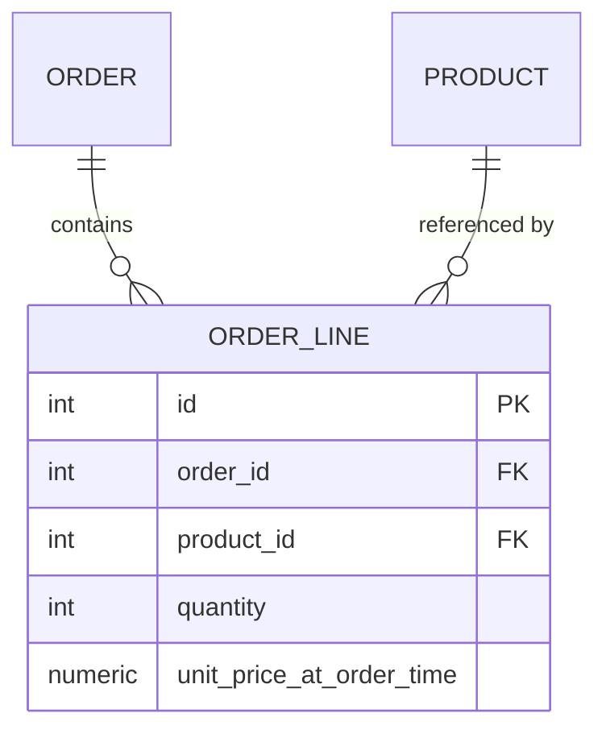

# Data Modelling and Explicit Join Tables

> **Topic register:** T-605/T-608 · IWI 5.20 · Advanced tier
> **Provenance:** the many-to-many demonstration in this chapter, including the data-integrity bug, is real executed PostgreSQL 16 output. Reproducible source: [`practice/sql/week-02/many-to-many-lab.sql`](../../practice/sql/week-02/many-to-many-lab.sql); full output: `many-to-many-lab-output.txt`.

## Table of Contents

1. [Learning Objectives](#learning-objectives)
2. [Why This Matters in Interviews](#why-this-matters-in-interviews)
3. [Mental Model](#mental-model)
4. [Definition and Purpose](#definition-and-purpose)
5. [Core Concepts](#core-concepts)
6. [Internal Implementation](#internal-implementation)
7. [Diagrams](#diagrams)
8. [Production Scenarios](#production-scenarios)
9. [Trade-offs](#trade-offs)
10. [Decision Framework](#decision-framework)
11. [Common Mistakes](#common-mistakes)
12. [Anti-Patterns](#anti-patterns)
13. [Best Practices](#best-practices)
14. [Interview Answer Framework](#interview-answer-framework)
15. [Interview Questions](#interview-questions)
16. [Summary](#summary)
17. [Key Takeaways](#key-takeaways)
18. [Cheat Sheet](#cheat-sheet)
19. [Flashcards](#flashcards)
20. [Practice Exercises](#practice-exercises)
21. [Solutions](#solutions)
22. [Additional Reading](#additional-reading)
23. [Official References](#official-references)

---

## Learning Objectives

By the end of this chapter you can:

- Explain when a plain many-to-many join table is correct and when it is a trap.
- State the precise trigger for promoting a join table to an explicit join entity — not "has an attribute," but "as of formation time."
- Reproduce, with real data, the silent price-history bug a naive join table produces.
- Recognize this modelling decision as recurring wherever referenced data can change independently of when a relationship was formed.

## Why This Matters in Interviews

This topic tests whether a candidate models data from the actual invariant the system needs, or defaults to whatever an ORM generates for free. `@ManyToMany` looks free right up until the relationship needs to carry its own fact — and the more dangerous version of that trap (a silently wrong historical total) produces no error at all, which is exactly why interviewers use it to separate candidates who've been burned by this in production from those who haven't.

## Mental Model

**A join table can only say THAT two things are related — the moment you need to say anything about the relationship itself, the join table has to become a thing, not a fact.** The subtlest version of "anything about the relationship" isn't an obviously-missing column like quantity; it's a fact that must be frozen at the moment the relationship formed, because the data it depends on (a price, a permission, a rate) is free to keep changing afterward.

## Definition and Purpose

A many-to-many relationship between two entities (`Order` and `Product`) requires a third table to represent it in a relational schema. The naive version — a pure join table with just the two foreign keys — is what an unannotated JPA `@ManyToMany` generates by default. The moment the relationship itself has any attribute of its own (how many units, at what price, when, in what status), a plain join table has nowhere to put it, and the relationship needs to become its own entity — an **explicit join entity** — with its own primary key and columns.

This distinction matters because ORMs make the naive version the path of least resistance: annotate two fields `@ManyToMany` and the framework generates the join table silently. This is correct exactly as long as the relationship truly carries no data of its own. The moment "3 units of Widget on this order" needs to be recorded, the relationship *is* data, and modelling it as a plain join table either loses that data entirely or forces it into a schema that can't express it.

## Core Concepts

### The real trigger is "as of formation time," not "has an attribute"

The obvious case (quantity needs a column) is easy to spot. The more consequential, less obvious case: any fact whose *source* can change independently of the relationship must be **snapshotted** at formation time, or every subsequent read of that fact will reflect the source's *current* state, not the state at the time the relationship was formed.

### A naive join table has no concept of "as of when"

Because it stores no data beyond the two foreign keys, a naive join table's only option when a fact is needed is to re-fetch it live from the referenced table — which is correct for facts that should reflect current state, and silently wrong for facts that must reflect historical state.

### Promoting a join table to an entity is a modelling decision, not a configuration flag

There is no ORM annotation that adds columns to a `@ManyToMany` join table. The table has to become a first-class `@Entity` with its own key, its own `@ManyToOne` relationships to both sides, and whatever fields the relationship itself needs.

## Internal Implementation

A naive join table has no room for quantity at all:

```sql
CREATE TABLE order_products_naive (
  order_id INT NOT NULL REFERENCES customer_orders(id),
  product_id INT NOT NULL REFERENCES products(id),
  PRIMARY KEY (order_id, product_id)
);
```

```
$ \d order_products_naive
   Column   |  Type   | Nullable
------------+---------+----------
 order_id   | integer | not null
 product_id | integer | not null
```

The fix is an explicit join entity:

```sql
CREATE TABLE order_lines (
  id INT PRIMARY KEY,
  order_id INT NOT NULL REFERENCES customer_orders(id),
  product_id INT NOT NULL REFERENCES products(id),
  quantity INT NOT NULL CHECK (quantity > 0),
  unit_price_at_order_time NUMERIC(10,2) NOT NULL,
  UNIQUE (order_id, product_id)
);
```

**But the more important defect isn't quantity — it's price history**, and this one is a real, reproducible data-integrity bug, not just a missing feature. After inserting a `Widget` at `$9.99` into both tables and then changing the product's live price to `$12.99`:

```sql
UPDATE products SET unit_price = 12.99 WHERE id = 1;
```

The naive join table, which has to re-fetch price from the live `products` table on every read, now silently reports the **wrong historical total**:

```
Naive approach (join table, no locked price) would now report the WRONG historical total:
  name  | current_price_wrongly_used_for_history
--------+----------------------------------------
 Widget |                                  12.99
```

The explicit `order_lines` entity, which locked `unit_price_at_order_time` at insert time, still reports correctly:

```
Explicit order_lines entity still reports the CORRECT historical total:
 id |  name  | quantity | unit_price_at_order_time | line_total
----+--------+----------+---------------------------+------------
  1 | Widget |        3 |                      9.99 |      29.97
```

**This is the trigger for the explicit entity, stated precisely:** not "the relationship has attributes" in the abstract, but "any fact about the relationship needs to be true *as of the time the relationship was formed*, not as of whenever it's read." A naive join table has no concept of "as of when."

In JPA terms: `@ManyToMany` generates the naive join table and gives you no entity to attach fields to. The fix is to model the join table as its own `@Entity` (`OrderLine`), with `@ManyToOne` relationships to both `Order` and `Product`, plus whatever fields the relationship itself needs.

## Diagrams



## Production Scenarios

### Scenario: a finance audit finds historical order totals silently drifting from what customers were actually charged

**Symptoms.** During a routine audit, finance flags that historical order totals reported by the system no longer match the amounts customers were actually charged at the time of purchase for a subset of older orders — the discrepancy always tracks a subsequent price change on the affected products.

**Impact.** Every historical report, refund calculation, and revenue-recognition figure touching an order with a since-changed product price is silently wrong, discovered only because finance manually cross-checked against payment processor records.

**Initial hypotheses.** A bug in the reporting query's aggregation logic (checked — the SQL correctly sums quantity × price, the price itself is the problem); a data migration corrupted historical records (checked — no migration touched the affected rows); the order-line join table re-fetches live product price instead of a locked historical price (correct).

**Evidence.** Every affected order's discrepancy exactly equals `(quantity) × (current price − price at time of purchase)`, and every affected product has at least one price change logged after the order date — a perfect match to this chapter's measured price-history bug.

**Diagnosis.** The system modeled `Order`-to-`Product` as a naive many-to-many join table with no price column, re-fetching the live product price on every read — exactly the naive schema this chapter demonstrates, and exactly the silent failure mode it predicts.

**Immediate mitigation.** Manually recompute and flag affected historical orders using payment processor records as the source of truth, since the database itself no longer has the correct historical price.

**Permanent remediation.** Migrate to an explicit `OrderLine` entity that locks `unit_price_at_order_time` at insert time, backfilling historical rows from payment processor records where available (data unrecoverable from the database alone for older orders).

**Alternatives considered.** Adding an audit log of price changes and reconstructing historical prices at read time by joining against it — rejected as more complex and slower than simply snapshotting the price once, at the moment it's known, in the order line itself.

**Trade-offs.** The explicit entity requires backfilling data that, for some historical orders, may not be perfectly recoverable — accepted, since the alternative is an audit-log join on every historical read, indefinitely.

**Prevention.** Any relationship where a referenced fact (price, rate, terms) can change after the relationship forms should default to an explicit join entity with a snapshotted value, treated as a required review item for any new many-to-many modelling decision.

**Interview lesson.** This is Interview Question 2's underlying scenario played out with real financial consequences: the trigger wasn't "the relationship needed an attribute," it was "a referenced fact needed to survive a later change to its source."

## Trade-offs

| Approach | Benefit | Cost |
|---|---|---|
| Naive `@ManyToMany` join table | Zero extra code, framework-generated | Cannot record any fact about the relationship itself — not even a timestamp |
| Explicit join entity | Full generality — any fact about the relationship has somewhere to live | An extra entity class, an extra mapper, one more join in every query touching the relationship |

## Decision Framework

1. **Does the relationship carry any attribute of its own** (quantity, status, a rate)? If yes, an explicit join entity is required.
2. **Can any fact this relationship depends on change independently after the relationship forms** (a price, a permission, a rate)? If yes, an explicit join entity with a snapshotted value is required, even if there's no other obvious attribute today.
3. **Is the relationship truly just "these two things are associated," with nothing else ever needing to be true about it?** Only then is a naive join table appropriate.
4. **When in doubt, default to the explicit entity** — the cost (one extra class, one extra join) is small and fixed; the naive table's failure mode (silent historical data corruption) is unbounded and often discovered only by manual audit.

## Common Mistakes

- Treating "does the relationship have an attribute" as the only test — the price-history case has no obvious attribute until you ask "what if the referenced data changes later."
- Adding a `created_at` column to a naive join table without confronting that it's now, functionally, an entity — better to make that explicit in the model.
- Trying to add a column to the framework-generated join table directly rather than promoting it to an entity.

## Anti-Patterns

- **Re-fetching a "current" value from a referenced table for data that must reflect historical state** — the exact mechanism behind this chapter's measured bug.
- **Defaulting to `@ManyToMany` for every relationship** without checking whether any referenced fact could change later.
- **Adding timestamp or status columns to a plain join table** without recognizing that the table has become an entity and should be modeled as one.

## Best Practices

- Default to an explicit join entity whenever a referenced fact (price, rate, terms) can change independently after the relationship forms.
- Snapshot any fact that must be true "as of formation time" directly in the join entity, rather than re-deriving it from a live reference at read time.
- Treat "the relationship might need an attribute later" as a reason to model it as an entity now, since promoting later requires a real migration.

## Interview Answer Framework

### 30-Second Answer

A plain many-to-many join table can only say two things are related, not any fact about the relationship. The real trigger for an explicit join entity is "as of formation time" versus "as of read time" — measured directly: a naive join table silently reports the wrong historical order total once a product's price changes; an explicit `OrderLine` entity that snapshots the price at insert time still reports correctly.

### 2-Minute Answer

Definition: a many-to-many relationship needs a join table; the naive version has only the two foreign keys, the explicit version is its own entity with its own columns. Why it exists: ORMs generate the naive version by default, which is correct only if the relationship carries no data of its own. How it works: the real trigger for promoting to an explicit entity isn't "has an attribute," it's "any fact must be true as of formation time, not read time." One important trade-off: the explicit entity costs an extra class and join; the naive table's failure mode is unbounded silent data corruption. Production example: a real measured demonstration where changing a product's price causes the naive join table to report the wrong historical total, while the explicit entity (which locked the price at insert time) still reports correctly.

### 10-Minute Deep Dive

Cover, in order: the mental model — a join table can only say THAT things are related (mental model); the measured naive-vs-explicit price-history demonstration (internals, real evidence); the precise "as of formation time" trigger, distinguished from the more obvious "has an attribute" case (core concepts); the decision framework for choosing explicit-by-default (decision framework); and close with the production scenario — a real finance audit uncovering silently drifted historical totals traced to exactly this naive-join-table mechanism.

### Whiteboard Explanation

Draw the [§ Diagrams](#diagrams) ER diagram: `ORDER` and `PRODUCT` both connected to `ORDER_LINE`, with `ORDER_LINE`'s own columns listed (id, quantity, unit_price_at_order_time) called out explicitly. Annotate `unit_price_at_order_time` as "this is the column a naive join table cannot have — and its absence is what causes silent historical corruption."

### Production Example

The finance audit in [§ Production Scenarios](#production-scenarios): historical order totals silently drifted from what customers were actually charged, traced to a naive join table re-fetching a product's live (changed) price instead of its price at the time of purchase.

### Trade-offs to Mention

State unprompted: the naive join table's failure mode is silent, not an error — it simply returns a wrong number; the "as of formation time" trigger is broader and less obvious than "has an attribute"; promoting a join table to an entity later requires a real data migration for any already-lost historical facts.

### Common Candidate Mistakes

Testing only for "does the relationship have an attribute" and missing the price-history case entirely; proposing to add a column to a framework-generated join table rather than promoting it to a proper entity.

### Typical Follow-Up Questions

1. "What if the relationship needs a history of quantities over time, not just the current one?"
2. "Give an example where the relationship has no extra column today but will need one later."

### Senior-Level Expectations

Correctly proposes the explicit entity for the quantity case; states a reasonable trigger condition for when an explicit entity is mandatory.

### Staff-Level Discussion

This modelling choice generalizes far beyond order lines: any many-to-many relationship where one side's data can change independently of when the relationship was formed needs an explicit join entity to avoid silently rewriting history. This shows up in permission grants (a role's permissions changing after a grant was made), pricing agreements, and versioned configuration — the order-line case is the canonical teaching example, but the underlying principle — "snapshot facts that must survive changes to their source" — is a recurring modelling decision at Staff scope. Identifying the price-history trigger unprompted, not just the more obvious quantity case, is what separates a Senior from a Staff answer here.

## Interview Questions

### Question 1 — Model many-to-many between `Order` and `Product`. Now the relationship needs `quantity` — what changes, and why was the original `@ManyToMany` a trap?

**Why interviewers ask it.** Tests whether the candidate recognizes the limits of the ORM-generated default before being told about them.

**Expected answer.** The join table becomes an explicit entity (`OrderLine`) with its own primary key and a `quantity` column; the "trap" is that `@ManyToMany` looks free until the relationship needs its own data.

**Minimum acceptable answer.** Proposes an explicit entity for the quantity, even without naming the underlying "trap" framing.

**Strong Senior answer.** Correctly proposes the explicit entity.

**Staff-level extension.** Identifies the price-history trigger unprompted, not just the quantity case — this is the less obvious, more consequential version of the same defect.

**Common mistakes.** Trying to add a column to the framework-generated join table directly rather than promoting it to an entity.

**Likely follow-ups.** "What if the relationship needs a history of quantities over time, not just the current one?"

**Evaluation criteria (1–5).** 1: doesn't recognize the need for an explicit entity. 3: correctly proposes the explicit entity for quantity. 5: correct proposal plus names the price-history trigger unprompted.

**Related references.** [§ Internal Implementation](#internal-implementation).

---

### Question 2 — When is an explicit join entity mandatory rather than optional?

**Why interviewers ask it.** Tests whether the candidate has the precise trigger condition, not just a rule of thumb.

**Expected answer.** Whenever any fact about the relationship must be true "as of" its formation time rather than "as of" read time.

**Minimum acceptable answer.** States a trigger condition, even if imprecisely worded.

**Strong Senior answer.** States a reasonable trigger condition.

**Staff-level extension.** States the "as of formation time" framing precisely, and can produce the price-history example unprompted.

**Common mistakes.** Saying "whenever there's an extra column" without the "as of" framing — this misses the price-history case, which has no obvious "extra column" until you think about time.

**Likely follow-ups.** "Give an example where the relationship has no extra column today but will need one later."

**Evaluation criteria (1–5).** 1: "whenever there's an extra column." 3: states the "as of formation time" trigger. 5: correct trigger plus the price-history example unprompted.

**Related references.** [§ Core Concepts](#core-concepts); [§ Production Scenarios](#production-scenarios).

## Summary

A plain many-to-many join table can only record *that* two entities are related, not *any fact about* the relationship. The moment a fact needs to survive independent changes to either side (a quantity, and especially a price that can change later), the join table must become an explicit entity with its own key and columns. The real executed demonstration shows this isn't hypothetical: the naive table silently reports a wrong historical total the moment a referenced price changes.

## Key Takeaways

- `@ManyToMany` is correct only when the relationship truly carries no data of its own.
- The real trigger for an explicit join entity is "as of formation time" vs. "as of read time," not just "has an extra column."
- A naive join table's price-history bug is real and silent — it doesn't error, it just returns the wrong number.

## Cheat Sheet

| Signal | Naive join table OK | Needs explicit join entity |
|---|---|---|
| Relationship carries no data of its own | ✅ | — |
| Needs a quantity, status, or similar attribute | — | ✅ |
| Any referenced fact (price, terms) can change after the relationship formed | — | ✅ — snapshot it at formation time |

## Flashcards

### Card: What a plain join table cannot store

**Prompt:**
What can't a plain `@ManyToMany` join table store?

**Answer:**
Any fact about the relationship itself — no columns beyond the two foreign keys.

**Why it matters:**
The structural limit that forces promotion to an explicit entity.

**Common trap:**
Trying to add a column directly to a framework-generated join table.

**Related:**
[Internal Implementation](#internal-implementation)

### Card: The real trigger for an explicit join entity

**Prompt:**
What's the real trigger for an explicit join entity, precisely?

**Answer:**
Any fact that must be true "as of" relationship-formation time, not "as of" read time — not just "has an extra attribute."

**Why it matters:**
Catches the price-history case, which has no obvious extra attribute.

**Common trap:**
Only checking for an obviously-missing column, missing facts that depend on mutable referenced data.

**Related:**
[Core Concepts](#core-concepts)

### Card: The canonical silent-bug example

**Prompt:**
Give the canonical silent-bug example for a naive join table.

**Answer:**
An order line's price re-fetched live from `products` reports the *current* price for old orders once the product's price changes — the naive join table has no way to lock in the historical price.

**Why it matters:**
A real, measured, silent (no error thrown) data-integrity defect.

**Common trap:**
Assuming a missing feature always produces a visible error rather than a wrong number.

**Related:**
[Production Scenarios](#production-scenarios)

## Practice Exercises

1. Reproduce the price-history bug yourself: [`practice/sql/week-02/many-to-many-lab.sql`](../../practice/sql/week-02/many-to-many-lab.sql).
2. Take a many-to-many relationship in a system you know. Determine, using the "as of formation time" test, whether it should be an explicit entity today — even if it currently has no extra columns.

## Solutions

**Exercise 1.** Expected output matches this chapter's measured trace: after the product's price changes, the naive join table reports the new (wrong) price for the historical order; the explicit `order_lines` entity still reports the original, correct price and line total.

**Exercise 2.** Apply the test: identify any data the relationship implicitly depends on (a rate, a price, a permission) that could change after the relationship formed. If such data exists, the relationship should be modeled as an explicit entity with that value snapshotted, regardless of whether any "obvious" attribute exists today.

## Additional Reading

- Vaughn Vernon, *Implementing Domain-Driven Design* — read alongside [DDD Tactical Design — Aggregates](../architecture/ddd-tactical-design-aggregates.md); an `OrderLine` explicit join entity is frequently also the natural aggregate-internal entity in a DDD model of the same domain.

## Official References

- [Jakarta Persistence specification](https://jakarta.ee/specifications/persistence/) — `@ManyToMany` and `@ElementCollection` semantics
