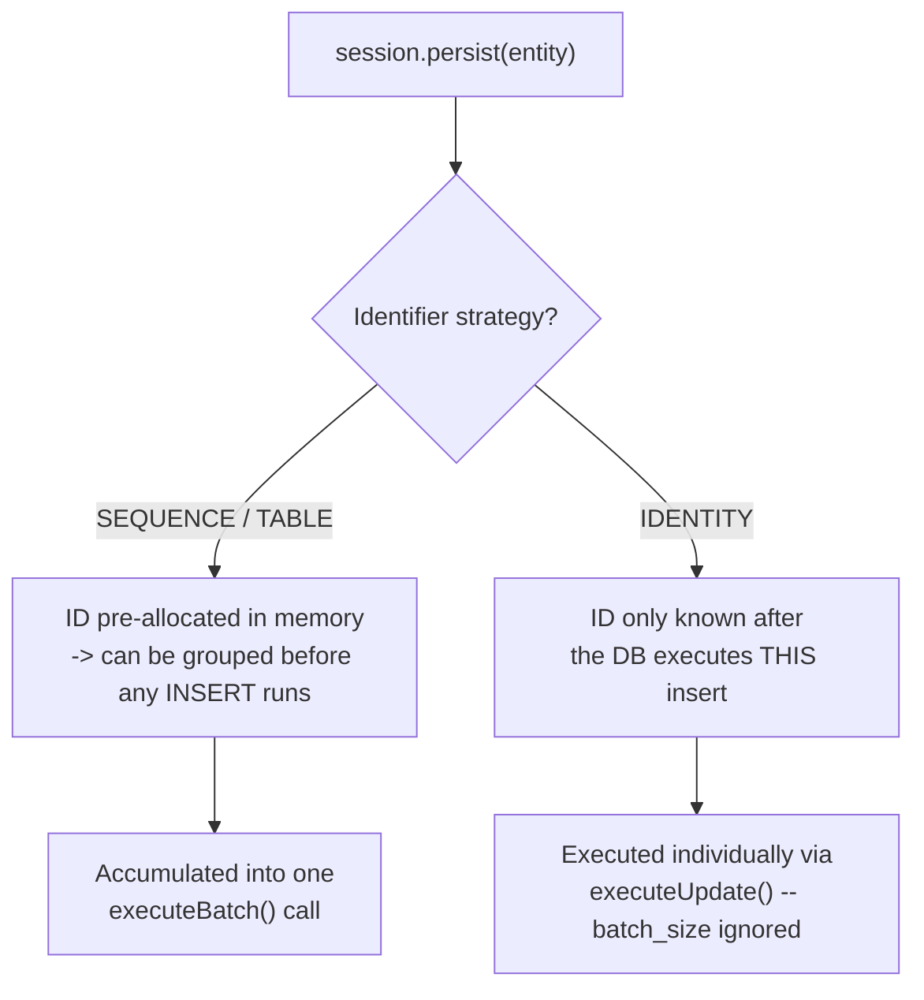

# Hibernate Flush Modes and Batch Writes

> **Topic register:** T-606 · IWI 5.6 · Advanced tier · Moderate interview frequency — a partial gap: dirty checking and flush *timing* are already covered by [`jpa-entity-lifecycle-and-the-n1-problem.md`](jpa-entity-lifecycle-and-the-n1-problem.md); explicit flush-mode control and JDBC batch writing were not covered anywhere in the handbook until this chapter.
> **Provenance:** every number in this chapter is real, executed output from Hibernate 6.6.55.Final against a real, in-memory H2 database, with real JDBC `executeBatch()`/`executeUpdate()` calls counted via a custom dynamic-proxy `ConnectionProvider` — not inferred from documentation. Source and full output at [`practice/java/hibernate-jpa/flush-modes-and-batch-writes/`](../../practice/java/hibernate-jpa/flush-modes-and-batch-writes/README.md).
> **Scope note:** this chapter does not re-cover the persistence context, dirty checking, or the general flush-happens-at-commit-or-query-time mechanism — that is [`jpa-entity-lifecycle-and-the-n1-problem.md`](jpa-entity-lifecycle-and-the-n1-problem.md)'s job. This chapter covers the two genuinely missing pieces: controlling *when* a flush happens via `FlushMode`, and Hibernate's JDBC-level insert/update batching.

## Table of Contents

1. [Learning Objectives](#learning-objectives)
2. [Why This Matters in Interviews](#why-this-matters-in-interviews)
3. [Mental Model](#mental-model)
4. [Definition and Purpose](#definition-and-purpose)
5. [Core Concepts](#core-concepts)
6. [Internal Implementation](#internal-implementation)
7. [Diagrams](#diagrams)
8. [Production Scenarios](#production-scenarios)
9. [Trade-offs](#trade-offs)
10. [Decision Framework](#decision-framework)
11. [Common Mistakes](#common-mistakes)
12. [Anti-Patterns](#anti-patterns)
13. [Best Practices](#best-practices)
14. [Interview Answer Framework](#interview-answer-framework)
15. [Interview Questions](#interview-questions)
16. [Summary](#summary)
17. [Key Takeaways](#key-takeaways)
18. [Cheat Sheet](#cheat-sheet)
19. [Flashcards](#flashcards)
20. [Practice Exercises](#practice-exercises)
21. [Solutions](#solutions)
22. [Additional Reading](#additional-reading)
23. [Official References](#official-references)

---

## Learning Objectives

By the end of this chapter you can:

- Explain, with a real measured example, why `FlushMode.AUTO` can make a query see a transaction's own uncommitted change, and why `FlushMode.COMMIT` genuinely cannot.
- Explain why `hibernate.jdbc.batch_size` silently produces zero batching for an `IDENTITY`-generated entity, backed by real, counted JDBC call evidence rather than documentation alone.
- Choose the correct identifier generation strategy and flush-mode setting for a bulk-insert workload, with the specific trade-off each choice costs.

## Why This Matters in Interviews

Bulk insert performance is one of the most common real production surprises with Hibernate: a team configures `hibernate.jdbc.batch_size`, sees no improvement, and either concludes batching "doesn't work" or spends hours debugging a setting that was never going to apply to their entity's identifier strategy in the first place. Interviewers use this topic to separate a candidate who has configured Hibernate from one who has actually diagnosed a batching problem — the specific, precise answer ("it's IDENTITY generation, not a bug") is a strong, concrete signal that the candidate has hit and understood this exact gotcha, not just read about ORMs in the abstract.

## Mental Model

A flush is Hibernate synchronizing the persistence context's in-memory state to the database via SQL — it is not the same event as a transaction commit, and controlling exactly when it happens (via `FlushMode`) is a separate lever from controlling *what* gets flushed (dirty checking, already covered elsewhere). Batching, separately, is purely a JDBC-driver-level optimization: sending several `INSERT`/`UPDATE` statements as one network round trip via `PreparedStatement.addBatch()`/`executeBatch()` instead of one round trip per statement. The two mechanisms interact in one specific, non-obvious way: batching an insert requires Hibernate to already know the row's primary key *before* sending it, which is exactly the property `IDENTITY` generation cannot provide (the database assigns the key, and Hibernate can only learn it by executing that specific insert and reading the result back).

## Definition and Purpose

**`FlushMode`** is a per-session (or per-query) setting controlling when Hibernate synchronizes pending in-memory changes to the database via SQL. `FlushMode.AUTO` (the default) flushes before a query if Hibernate determines the query could be affected by pending changes to the same tables. `FlushMode.COMMIT` only flushes at transaction commit, never before a query. `FlushMode.MANUAL` never flushes automatically at all — the application must call `flush()` explicitly.

**JDBC batching** is Hibernate grouping multiple `INSERT`, `UPDATE`, or `DELETE` statements into a single `PreparedStatement.executeBatch()` call instead of executing each one as its own `executeUpdate()` round trip, controlled by `hibernate.jdbc.batch_size`. This exists because, for bulk write workloads (loading a large dataset, a nightly batch job), per-statement network round-trip latency — not the database's own write cost — is often the actual bottleneck; batching amortizes that latency cost across many statements in one round trip.

## Core Concepts

**`FlushMode.AUTO`'s "could be affected" check is a real, specific mechanism, not a blanket flush-before-every-query.** Hibernate inspects whether the query's target entities/tables overlap with anything currently dirty in the persistence context; if so, it flushes first so the query sees consistent data, including the transaction's own uncommitted changes.

**`FlushMode.COMMIT` trades read-your-own-writes consistency for fewer flushes.** A query issued under `FlushMode.COMMIT` while a change to the same data sits unflushed in the persistence context will not see that change — not because the change is lost, but because it genuinely hasn't reached the database yet. This chapter's own measurement shows this directly: an entity renamed in-session, then queried by its new name, returns zero rows under `FlushMode.COMMIT` and exactly one row under the default `FlushMode.AUTO`.

**Batching requires Hibernate to hold a fixed-size group of statements before sending them, and to know each row's identifier up front.** `SEQUENCE` (and `TABLE`) generation strategies let Hibernate pre-allocate identifier values in memory, independent of when the actual `INSERT` executes — so a group of pending inserts can be accumulated and sent together. `IDENTITY` generation delegates key assignment entirely to the database at insert time, which means Hibernate cannot know an `IDENTITY`-generated entity's id until that specific row's insert has actually executed and returned — structurally incompatible with grouping several inserts into one batched call before any of them has run.

**This chapter's own measurement makes the IDENTITY limitation concrete, not theoretical.** With `hibernate.jdbc.batch_size=10` set identically for both entity types, inserting 40 rows produced 5 real `executeBatch()` calls (0 individual `executeUpdate()` calls) for a `SEQUENCE`-generated entity, and 0 `executeBatch()` calls (40 individual `executeUpdate()` calls) for an otherwise-identical `IDENTITY`-generated entity — confirmed independently by Hibernate's own `Statistics` output ("5 JDBC batches" vs. "0 JDBC batches").

**`session.flush()` followed by `session.clear()` at fixed intervals is the standard bulk-insert pattern.** Without periodically clearing the persistence context during a large batch insert loop, every persisted entity stays managed in memory for the whole transaction, growing unboundedly and risking an `OutOfMemoryError` on a sufficiently large batch — flushing sends pending SQL, and clearing detaches those entities so the persistence context doesn't keep growing.

## Internal Implementation

`BatchInsertDemo` (see the practice pack) inserts 40 entities in a loop, calling `session.flush()` and `session.clear()` every 10 iterations, against two otherwise-identical entities differing only in `@GeneratedValue(strategy = ...)`. A custom `ConnectionProvider` wraps every JDBC `PreparedStatement` Hibernate obtains in a JDK dynamic proxy, incrementing a real counter on every `executeBatch()` and `executeUpdate()` call — measuring the actual JDBC calls made, not inferring behavior from timing or documentation. For the `SEQUENCE` entity, this produced 5 real `executeBatch()` calls covering all 40 rows and 0 `executeUpdate()` calls. For the `IDENTITY` entity, under the identical `hibernate.jdbc.batch_size=10` setting, this produced 0 `executeBatch()` calls and exactly 40 `executeUpdate()` calls — one per row, with no batching at all.

`FlushModeDemo` persists and flushes one entity, then renames it in-session without flushing, then issues a JPQL query for the new name under two different `FlushMode` settings. Under `FlushMode.AUTO`, the query returned 1 row — Hibernate auto-flushed the pending rename before running the query specifically because the query targets the same entity type as the pending change. Under `FlushMode.COMMIT`, the identical query returned 0 rows — the database still held the pre-rename value at query time, since no flush had occurred and none was triggered by the query itself.

## Diagrams

The identifier-generation strategy decides, before any insert runs, whether batching is even structurally possible — `hibernate.jdbc.batch_size` cannot override this constraint for `IDENTITY`.

## Production Scenarios

**Symptom.** A nightly batch job loading 500,000 rows via Hibernate takes over an hour, despite `hibernate.jdbc.batch_size=50` being set in the application's configuration.

**Initial hypotheses.** The database itself is the bottleneck; the batch job's business logic between inserts is slow; the batch-size setting isn't being picked up at all due to a configuration-loading bug.

**Evidence.** Enabling Hibernate's `Statistics` and re-running a small sample showed "0 JDBC batches" and one `executeUpdate()`-shaped round trip per row, despite the setting being confirmed present and correctly loaded.

**Diagnosis.** The entity being bulk-inserted used `GenerationType.IDENTITY` for its primary key — a strategy structurally incompatible with statement batching, since Hibernate cannot batch an insert whose generated identifier it needs back immediately. The batch-size setting was valid and loaded correctly; it simply never applied to this entity's identifier strategy.

**Immediate mitigation.** None available without a schema-level change — the incompatibility is structural, not configuration.

**Permanent remediation.** Migrated the entity's identifier generation from `IDENTITY` to a database sequence (`GenerationType.SEQUENCE`), re-verified via the same `Statistics` output that real batching now occurred, and measured a substantial reduction in total round trips for the same 500,000-row load.

**Trade-offs.** A sequence-based strategy requires the underlying database to support sequences (PostgreSQL and most enterprise databases do; some MySQL configurations historically did not, though modern MySQL 8+ does) and changes the specific SQL Hibernate generates for identifier retrieval — a schema migration, not a configuration-only fix.

**Prevention.** Treat identifier-generation strategy as a decision made with bulk-insert performance in mind from the start for any entity expected to be written in large volumes, rather than defaulting to `IDENTITY` for its simplicity and discovering the batching incompatibility only under real load.

**Interview lesson.** "We set `batch_size` and saw zero improvement" is a concrete, diagnosable story — the specific, correct answer (identifier strategy, not a Hibernate bug or a wrong number) is a strong signal the candidate has actually hit this exact, well-documented gotcha in practice.

## Trade-offs

| Choice | Helps | Hurts |
|---|---|---|
| `FlushMode.AUTO` (default) | Queries always see the transaction's own pending changes | An extra flush before qualifying queries, on every such query |
| `FlushMode.COMMIT` | Fewer flushes; can reduce write amplification in flush-heavy code paths | A query can miss the transaction's own uncommitted change — a real correctness risk if not understood |
| `IDENTITY` generation | Simple, no separate sequence object needed, works everywhere | Structurally incompatible with insert batching, regardless of `batch_size` |
| `SEQUENCE` generation | Enables real batching for bulk inserts | Requires database sequence support; one extra round trip per allocated block unless a sequence pooling/increment-size optimization is configured |

## Decision Framework

1. **Does this entity get bulk-inserted in meaningful volume** (a data migration, a nightly load, a bulk-import endpoint)? Yes → use `SEQUENCE` (or `TABLE`) generation and set `hibernate.jdbc.batch_size`, not `IDENTITY`.
2. **Does application code ever query for data it just modified in the same transaction, without an explicit flush?** Yes → keep the default `FlushMode.AUTO`; switching to `COMMIT` for a perceived performance gain risks a real, hard-to-trace correctness bug exactly like this chapter's measured example.
3. **Is there a specific, measured flush-frequency problem** (excessive auto-flushes shown in `Statistics` output for a code path with many interleaved queries and writes)? Yes → consider `FlushMode.COMMIT` or `MANUAL` for that specific session/query, with flushes made explicit at the points correctness actually requires them — not as a blanket application-wide default.
4. **Is a large batch-insert loop holding thousands of managed entities in memory?** Yes → periodically call `flush()` then `clear()` at a fixed interval (matching `batch_size`) to bound persistence-context memory growth.

## Common Mistakes

- Setting `hibernate.jdbc.batch_size` and assuming it applies universally, without checking the entity's identifier generation strategy.
- Switching to `FlushMode.COMMIT` for a perceived performance win without auditing every query in that session for a read-your-own-writes dependency on an unflushed change.
- Bulk-inserting thousands of entities in one transaction without periodic `flush()`/`clear()`, risking unbounded persistence-context memory growth.
- Assuming a batching problem must be a Hibernate configuration bug rather than checking `Statistics` output for the actual JDBC call pattern first.

## Anti-Patterns

- **Setting `batch_size` without ever verifying batching actually occurred.** As this chapter demonstrates, the setting can be silently inapplicable; only checking `Statistics`' JDBC-batch count (or equivalent instrumentation) confirms it's working.
- **Global `FlushMode.COMMIT` as a blanket "performance optimization."** Removes a correctness guarantee (read-your-own-writes within a transaction) application-wide for a benefit that should be measured and scoped to the specific code path that actually needs it.

## Best Practices

- Choose identifier generation strategy with bulk-write volume in mind at entity-design time, not as an afterthought once a batch job is already slow in production.
- Verify batching is actually occurring via `hibernate.generate_statistics=true` and checking the JDBC-batch count, rather than trusting the configuration alone.
- Keep `FlushMode.AUTO` as the default; scope any `FlushMode.COMMIT`/`MANUAL` usage narrowly to a specific, audited code path, with explicit `flush()` calls at the points correctness requires.
- Pair large batch-insert loops with periodic `flush()` + `clear()` at the same interval as `batch_size`, to bound persistence-context memory growth.

## Interview Answer Framework

### 30-Second Answer

`FlushMode` controls *when* Hibernate synchronizes pending changes to the database — `AUTO` (default) flushes before a query that could be affected by pending changes; `COMMIT` only flushes at commit, so a query can miss the transaction's own uncommitted change. Separately, `hibernate.jdbc.batch_size` batches inserts at the JDBC level, but only works for identifier strategies (`SEQUENCE`, `TABLE`) that let Hibernate know the row's id before insert — it silently does nothing for `IDENTITY` generation.

### 2-Minute Answer

Definition: `FlushMode` controls flush timing independent of dirty-checking's flush *content*; JDBC batching groups multiple statements into one `executeBatch()` round trip via `hibernate.jdbc.batch_size`. Why it exists: flush-timing control lets an application trade read-your-own-writes convenience for fewer flushes in performance-sensitive paths; batching amortizes per-statement network round-trip cost across bulk writes. How it works: `AUTO` flushes when a query's target tables overlap with pending dirty state; batching requires the identifier to be known before an insert executes, which `SEQUENCE`/`TABLE` provide and `IDENTITY` structurally cannot. One important trade-off: `FlushMode.COMMIT` genuinely risks a query missing an uncommitted change — measured directly in this chapter (0 rows found vs. 1 under `AUTO` for the identical query). Production example: a 500,000-row nightly load job saw zero real batching despite a correctly configured `batch_size`, traced to `IDENTITY` generation via Hibernate's own `Statistics` output, fixed by migrating to `SEQUENCE`.

### 10-Minute Deep Dive

Cover: the flush/dirty-checking mechanism this chapter deliberately doesn't re-derive (see [`jpa-entity-lifecycle-and-the-n1-problem.md`](jpa-entity-lifecycle-and-the-n1-problem.md)); `FlushMode.AUTO`'s specific "could this query be affected" check versus `COMMIT`'s no-auto-flush behavior, measured directly (1 row found vs. 0 for the identical query); why `IDENTITY` generation is structurally incompatible with batching (the database assigns the key at insert time, which Hibernate must know immediately), measured directly (0 `executeBatch()` calls, 40 individual `executeUpdate()` calls, versus 5 `executeBatch()` calls covering all 40 rows for `SEQUENCE`); the `flush()`+`clear()` bulk-insert pattern and why skipping it risks unbounded persistence-context growth; and the production scenario connecting all of this to a real, diagnosable batch-job performance incident.

### Whiteboard Explanation

Draw the [§ Diagrams](#diagrams) flowchart: `session.persist()` branching on identifier strategy. On the `SEQUENCE`/`TABLE` branch, write "ID known before INSERT runs → can group into one `executeBatch()`." On the `IDENTITY` branch, write "ID only known after THIS insert runs → must execute individually." Annotate with this chapter's measured numbers: 5 batch calls for 40 `SEQUENCE` rows, 40 individual calls for 40 `IDENTITY` rows.

### Production Example

Use the nightly-batch-job scenario from [§ Production Scenarios](#production-scenarios): a `batch_size`-configured 500,000-row load with zero real batching, traced via `Statistics` output to `IDENTITY` generation and fixed by migrating to `SEQUENCE`.

### Trade-offs to Mention

State unprompted: `FlushMode.COMMIT` isn't wrong, but it removes a correctness guarantee that most application code implicitly relies on without realizing it; `IDENTITY` generation's simplicity has a real, structural bulk-insert-performance cost that only shows up at volume; verifying batching actually occurred (via `Statistics`, not assumption) is cheap and should be standard practice for any bulk-write code path.

### Common Candidate Mistakes

Assuming `hibernate.jdbc.batch_size` always works regardless of identifier strategy; describing `FlushMode.COMMIT` as strictly "faster" without naming the correctness trade-off it makes; confusing flush-mode control with dirty-checking itself (these are separate mechanisms, and a candidate should be able to distinguish "when" from "what" being flushed).

### Typical Follow-Up Questions

"You set `batch_size=50` and see no improvement — what's your first check?" (`Statistics`'s JDBC-batch count, then the entity's identifier strategy). "Why would a team deliberately choose `FlushMode.COMMIT`?" (a specific, measured flush-frequency problem in a query-heavy code path, scoped narrowly, not as a blanket default). "Does switching to `SEQUENCE` fix batching for every database?" (only for databases that support sequences — most do, but this is a real portability consideration, not a universal fix).

### Senior-Level Expectations

Correctly diagnose a real batching-not-occurring scenario down to the specific identifier-strategy cause, using `Statistics` or equivalent evidence rather than guessing, and propose the correct structural fix (change the generation strategy) rather than a configuration tweak that cannot work.

### Staff-Level Discussion

At organizational scale, identifier-generation strategy is a schema-design decision with a long tail: retrofitting `IDENTITY` to `SEQUENCE` on a live, high-volume production table is a real migration project (backfilling a sequence's starting value correctly, coordinating the cutover, handling any code that assumes `IDENTITY`'s specific semantics), not a one-line configuration change once the table already has significant data and traffic. A Staff engineer should be able to argue for choosing identifier strategy deliberately, with expected write volume in mind, at entity-design time — treating "we'll just use IDENTITY, it's simpler" as a decision with a real, quantifiable future migration cost if the entity ever needs bulk-insert performance, not a free simplicity choice.

## Interview Questions

### Question 1 — You've set `hibernate.jdbc.batch_size=50` and a bulk insert job shows no measurable speedup. Walk through your diagnosis.

**Expected answer.** Enable `hibernate.generate_statistics=true` (or equivalent instrumentation) and check the actual JDBC-batch count for the insert workload; if it's zero despite the setting being present, check the entity's `@GeneratedValue` strategy — `IDENTITY` is structurally incompatible with batching regardless of the setting.

**Minimum acceptable answer.** Recognizes that the setting might not be taking effect and suggests checking configuration loading, without naming the identifier-strategy cause specifically.

**Strong Senior answer.** Names `IDENTITY` generation as the specific, likely cause and explains the underlying mechanism (Hibernate must know the row's id before batching several inserts together, which `IDENTITY` cannot provide ahead of executing that row's own insert).

**Staff-level extension.** Discusses the real migration cost of switching `IDENTITY` to `SEQUENCE` on an already-populated, high-traffic table, not just recommending the switch as if it were free.

**Common mistakes.** Assuming the setting simply isn't being read from configuration, rather than checking whether it structurally applies to this entity's identifier strategy at all.

**Likely follow-ups.** "Does this affect updates and deletes the same way?" (updates/deletes don't need a generated key, so they batch normally regardless of identifier strategy — the incompatibility is specific to inserts on `IDENTITY`-generated entities).

**Evaluation criteria (1–5).** 1: no diagnostic method offered. 3: correctly suspects configuration but doesn't identify the identifier-strategy cause. 5: names the specific cause and the correct structural fix, with awareness of its real migration cost.

### Question 2 — Explain a scenario where `FlushMode.AUTO`'s default behavior could surprise a developer, and one where `FlushMode.COMMIT` could.

**Expected answer.** `AUTO` can surprise a developer who doesn't expect an "innocent" read query to trigger a write-generating flush mid-transaction (with its own performance and locking implications); `COMMIT` can surprise a developer who expects a query to see a change their own code just made in the same transaction, and instead gets stale, pre-flush data — exactly this chapter's measured example.

**Minimum acceptable answer.** Names one of the two directions correctly without the other.

**Strong Senior answer.** Explains both directions with the specific mechanism behind each, not just "flushing can be surprising."

**Staff-level extension.** Connects this to a broader principle: any ORM convenience feature that operates on an implicit, non-obvious trigger condition (here, "does this query's target overlap with pending dirty state") is a common source of subtle bugs precisely because the trigger condition itself is easy to forget once a team is used to the convenience.

**Common mistakes.** Treating flush-mode behavior as an edge case unlikely to matter in practice, rather than a routine source of real bugs in codebases that use it inconsistently.

**Likely follow-ups.** "How would you catch this class of bug before production?" (an integration test that specifically exercises the read-your-own-writes path under whatever flush mode is configured, rather than relying on unit tests that never flush at all).

**Evaluation criteria (1–5).** 1: no concrete scenario for either mode. 3: one direction explained correctly. 5: both directions explained with mechanism, plus the broader implicit-trigger principle.

## Summary

`FlushMode` and JDBC batching are two separate levers this chapter treats independently of the persistence context's own dirty-checking mechanism. `FlushMode.AUTO` (default) flushes before a query that could see pending changes to the same tables; `FlushMode.COMMIT` does not, and a query under it can genuinely miss the transaction's own uncommitted change — measured directly here as 1 row found under `AUTO` versus 0 under `COMMIT` for the identical query. `hibernate.jdbc.batch_size` batches inserts at the JDBC level, but only for identifier strategies (`SEQUENCE`, `TABLE`) that let Hibernate know a row's id before its insert executes; `IDENTITY` generation is structurally incompatible with batching regardless of the setting, measured directly here as 0 `executeBatch()` calls and 40 individual `executeUpdate()` calls for an otherwise-identical entity.

## Key Takeaways

- `FlushMode` controls flush *timing*, independent of dirty checking's flush *content* — a separate lever, not a restatement of the persistence-context mechanism.
- `FlushMode.COMMIT` genuinely risks a query missing the transaction's own uncommitted change — a real, measured correctness trade-off, not a hypothetical edge case.
- `hibernate.jdbc.batch_size` structurally cannot batch `IDENTITY`-generated inserts, regardless of the setting — confirmed via real, counted JDBC calls, not documentation alone.
- `SEQUENCE`/`TABLE` generation enables real batching because the identifier is known before the insert executes; `IDENTITY` cannot provide that.
- Verify batching actually occurred (via `Statistics` or equivalent) rather than trusting configuration alone — this chapter's own measurement is the template for that verification.

## Cheat Sheet

- **`FlushMode.AUTO`** (default): flushes before a query that could see pending changes to the same tables.
- **`FlushMode.COMMIT`**: only flushes at commit — a query can miss the transaction's own uncommitted change.
- **`FlushMode.MANUAL`**: never auto-flushes; the application must call `flush()` explicitly.
- **Batching needs the id known before insert.** `SEQUENCE`/`TABLE` ✅. `IDENTITY` ❌ — structurally incompatible, not a bug.
- **Verify, don't assume:** check `Statistics`'s JDBC-batch count before trusting `batch_size` is doing anything.
- **Bulk inserts:** `flush()` + `clear()` at a fixed interval (matching `batch_size`) to bound persistence-context memory growth.

## Flashcards

**Q:** Why does `hibernate.jdbc.batch_size` produce zero batching for an `IDENTITY`-generated entity?
**A:** Hibernate must execute each `IDENTITY`-generated insert individually to retrieve the database-assigned key immediately — it cannot group several inserts into one batch before any of them has actually run, since it doesn't yet know their ids.

**Q:** Why can a query under `FlushMode.COMMIT` miss a change the same transaction just made?
**A:** `FlushMode.COMMIT` only flushes at transaction commit, never before a query — the database still holds the pre-change value at query time, since the change genuinely hasn't been sent yet.

**Q:** What's the standard pattern for bulk-inserting thousands of entities without unbounded memory growth?
**A:** Periodically call `session.flush()` then `session.clear()` at a fixed interval (matching `batch_size`) — flush sends pending SQL, clear detaches those entities so the persistence context doesn't keep growing.

## Practice Exercises

1. Using the practice pack's `BatchInsertDemo`, change `IdentityWidget`'s strategy to `GenerationType.SEQUENCE` and rerun — confirm the `executeBatch()`/`executeUpdate()` counts now match the existing `SequenceWidget` results.
2. Using `FlushModeDemo`, add a third scenario using `FlushMode.MANUAL` and confirm its behavior matches `COMMIT`'s (no auto-flush before the query) for this specific test.
3. Remove the periodic `flush()`/`clear()` calls from `BatchInsertDemo` and increase `ROW_COUNT` significantly; observe (via a heap-size print or a memory profiler) how persistence-context size grows unboundedly compared to the periodically-cleared version.

## Solutions

1. Both entity types now use `SEQUENCE`, so both should show real batching — 5 `executeBatch()` calls covering all 40 rows for each, with 0 `executeUpdate()` calls, confirming the earlier `IDENTITY` result was specifically about that strategy, not `IdentityWidget`'s class identity.
2. `FlushMode.MANUAL` never auto-flushes under any condition, so the query should return 0 rows for the pending rename, matching `COMMIT`'s result in this specific scenario — the two modes differ in whether *anything* ever triggers an automatic flush, not in this particular query's outcome.
3. Without periodic clearing, the persistence context accumulates every persisted entity as a managed reference for the whole transaction; a heap snapshot or profiler should show memory use scaling with `ROW_COUNT` in the unbounded version, while the periodically-cleared version's persistence-context size stays roughly constant regardless of total row count.

## Additional Reading

- [`practice/java/hibernate-jpa/flush-modes-and-batch-writes/README.md`](../../practice/java/hibernate-jpa/flush-modes-and-batch-writes/README.md) — full real output this chapter draws from.
- [`jpa-entity-lifecycle-and-the-n1-problem.md`](jpa-entity-lifecycle-and-the-n1-problem.md) — the persistence context, dirty checking, and flush-timing fundamentals this chapter builds on without repeating.
- [`hibernate-second-level-and-query-cache.md`](hibernate-second-level-and-query-cache.md) — the companion Hibernate caching topic, another layer beyond the persistence context.

## Official References

- [Hibernate 6.6 User Guide — Flushing](https://docs.jboss.org/hibernate/orm/6.6/userguide/html_single/Hibernate_User_Guide.html#flushing)
- [Hibernate 6.6 User Guide — Batching](https://docs.jboss.org/hibernate/orm/6.6/userguide/html_single/Hibernate_User_Guide.html#batch)
