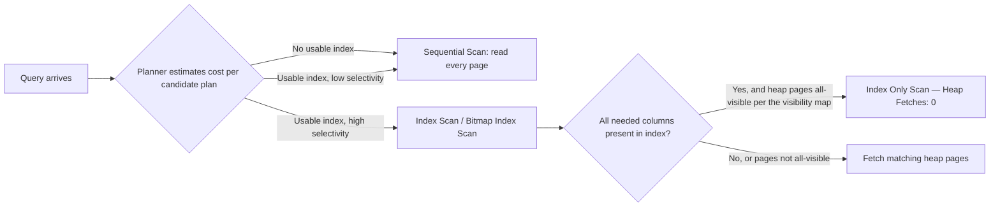
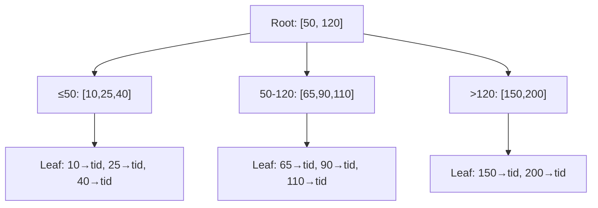

# Database Index Structures — B+Tree, Composite, Covering

> **Topic register:** T-609 · IWI 8.30 (#7 of 198) · Advanced tier · Near-Certain interview frequency [H]
> **Provenance:** every `EXPLAIN` block in this chapter is real PostgreSQL 16 output, captured in a disposable Docker container against a seeded 300,000-row `orders` table (5,000 `customers`). Reproducible source: [`practice/sql/week-01/index-lab.sql`](../../practice/sql/week-01/index-lab.sql), full output in [`index-lab-output.txt`](../../practice/sql/week-01/index-lab-output.txt). Nothing below is illustrative.

## Table of Contents

1. [Learning Objectives](#learning-objectives)
2. [Why This Matters in Interviews](#why-this-matters-in-interviews)
3. [Mental Model](#mental-model)
4. [Definition and Purpose](#definition-and-purpose)
5. [Historical Context](#historical-context)
6. [Core Concepts](#core-concepts)
7. [Internal Implementation](#internal-implementation)
8. [Execution Flow](#execution-flow)
9. [Diagrams](#diagrams)
10. [Java Examples](#java-examples)
11. [Production Scenarios](#production-scenarios)
12. [Failure Modes and Debugging](#failure-modes-and-debugging)
13. [Trade-offs](#trade-offs)
14. [Performance Implications](#performance-implications)
15. [Memory Implications](#memory-implications)
16. [Concurrency Implications](#concurrency-implications)
17. [Security Implications](#security-implications)
18. [Decision Framework](#decision-framework)
19. [Comparisons](#comparisons)
20. [Common Mistakes](#common-mistakes)
21. [Anti-Patterns](#anti-patterns)
22. [Best Practices](#best-practices)
23. [Interview Answer Framework](#interview-answer-framework)
24. [Interview Questions](#interview-questions)
25. [Summary](#summary)
26. [Key Takeaways](#key-takeaways)
27. [Cheat Sheet](#cheat-sheet)
28. [Flashcards](#flashcards)
29. [Practice Exercises](#practice-exercises)
30. [Solutions](#solutions)
31. [Additional Reading](#additional-reading)
32. [Official References](#official-references)

---

## Learning Objectives

By the end of this chapter you can:

- Explain how a B+Tree index resolves a lookup, from root to heap tuple, without hand-waving the final fetch.
- Predict, before running a query, whether a given composite index will actually be used — and in which column order to build it.
- Read `EXPLAIN (ANALYZE, BUFFERS)` output well enough to tell "index exists" apart from "index is being used for this query."
- Recognize when the planner is *right* to ignore an index, instead of assuming every ignored index is a bug.
- State the write-path cost of an index in terms a Staff interviewer accepts as capacity planning, not folklore.
- Correct the "clustered vs non-clustered" framing when the engine under discussion is PostgreSQL, not SQL Server or MySQL/InnoDB.

## Why This Matters in Interviews

Indexing is where "I have five years of backend experience" gets tested against a live artifact instead of a definition. An interviewer can hand you a slow query and a real plan, and your answer is either right or it isn't — few Java/backend topics discriminate this cleanly between a candidate who has *read about* indexes and one who has *operated* them. It is also the single most common production performance lever a backend engineer pulls, which makes it Near-Certain in both dedicated database rounds and as unscripted follow-up pressure inside system design rounds (T-801, T-813).

Phase 1 of this project's own knowledge-base audit found 15 generic SQL rows and **zero PostgreSQL-specific content** against a PostgreSQL-targeted brief — this chapter exists specifically to close that gap, and to correct the "clustered index" terminology error that a real interview surfaced as direct feedback (see [§ Historical Context](#historical-context)).

## Mental Model

Hold one idea and the rest of the chapter is detail: **an index is a second, sorted copy of a narrow slice of your table, purpose-built to answer one shape of question fast.**

That framing carries three consequences that most candidates miss:

1. **It's a copy** — it must be kept in sync on every write. An index is not free storage or a free lookup; it is a standing obligation the database re-pays on every `INSERT`/`UPDATE`/`DELETE`.
2. **It's sorted** — which is *why* it's fast for equality and range predicates, and *why* it stops helping the instant your predicate isn't a prefix of that sort order (the leftmost-prefix rule, § Core Concepts).
3. **It's narrow** — it only contains the columns you told it to, plus (implicitly) a way back to the full row. If the query needs a column the index doesn't have, the database must go fetch the row anyway.

Every other fact in this chapter — composite ordering, covering indexes, selectivity, write amplification — is a restatement of one of these three consequences.

## Definition and Purpose

A **B+Tree index** is a sorted, balanced, disk-page-aware tree structure that lets a database locate a row (or a contiguous range of rows) in `O(log n)` page reads instead of scanning every row in the table. PostgreSQL's default index type (`CREATE INDEX ... USING btree`, the implicit default) is a B+Tree; it exists because the alternative — a full sequential scan — is `O(n)` and becomes ruinous as tables grow past what fits comfortably in memory or a single disk read pass.

It exists to answer one question cheaply: *"where is the row (or rows) matching this predicate?"* — trading write-time cost (every index must be updated on every write) and storage (the index itself occupies disk and competes for cache) for read-time speed on the specific access pattern it was built to serve.

## Historical Context

B-Trees were introduced by Rudolf Bayer and Edward McCreight in 1970 (Boeing Scientific Research Labs), explicitly to minimize disk seeks on the read/write hardware of that era — the high fan-out that defines a B-Tree exists *because* disk pages are expensive to fetch and cheap to scan linearly once fetched, a physical constraint that is still true of SSD page reads today, just with different constants. The **B+Tree** variant — which pushes all data references into leaf nodes and links leaves together for efficient range scans — became the near-universal choice for relational database indexes because range queries (`BETWEEN`, `>`, `ORDER BY`) are common and a plain B-Tree's internal-node data complicates that scan.

PostgreSQL's specific architectural choice matters and is frequently misstated: PostgreSQL has **no clustered-index concept**. Every table is a heap; every index, including the primary key's, is a secondary structure pointing at a heap tuple ID (see § Comparisons for the InnoDB contrast). This is not a historical accident — it is why PostgreSQL added `INCLUDE` columns and index-only scans as a separate mechanism (PostgreSQL 11, 2018) to claw back some of the "no heap fetch needed" benefit that InnoDB gets for free from its primary key.

## Core Concepts

### The B+Tree lookup path

Root → internal routing nodes (each holding separator keys, not data) → leaf node → either the row directly (a clustered/index-organized table) or a pointer to the row's physical location. In PostgreSQL, that pointer is a **heap tuple ID (TID)** — every PostgreSQL index is a secondary index over a heap. There is no InnoDB-style clustered primary key.

### The leftmost-prefix rule

A composite index `CREATE INDEX ON orders(customer_id, created_at)` builds **one** B+Tree sorted first by `customer_id`, then by `created_at` within each `customer_id`. It serves:

- `WHERE customer_id = ?` — yes, uses the leading column.
- `WHERE customer_id = ? AND created_at > ?` — yes, uses both, fully sorted for this predicate.
- `WHERE created_at > ?` alone — **no**. Rows matching a `created_at` range are scattered across every branch of the tree, in no useful order for this query.

This is the single most common index-design defect: assuming an index on `(a, b)` helps any query touching `a` or `b`, when it only helps `a` alone or `(a, b)` together.

### Covering indexes and index-only scans

`CREATE INDEX ON orders(customer_id, created_at) INCLUDE (amount)` stores `amount` in the index's leaf pages without making it part of the sort key. If a query's `SELECT` list and predicates are fully satisfied by columns present in the index, PostgreSQL can skip the heap entirely — an **index-only scan**. This is conditional, not automatic (§ Failure Modes).

### Selectivity

**Selectivity** is the fraction of rows a predicate matches. An index scan pays a random-I/O cost per matching row (walk the tree, then fetch that row's heap page); a sequential scan pays one linear-I/O cost for the whole table. Below some selectivity threshold — no fixed percentage, typically single digits to ~15% of the table, and dependent on physical row clustering and storage medium — random I/O via the index costs more than reading the table once. The planner is right to ignore a low-selectivity index; this is cost-based reasoning working correctly, not a bug.

### Expression and partial indexes

A plain index on `status` cannot serve `WHERE UPPER(status) = 'REFUNDED'` — the index stores raw values, not the function's output. An **expression index**, `CREATE INDEX ON orders(UPPER(status))`, indexes the function's result instead. A **partial index**, `CREATE INDEX ON orders(customer_id) WHERE status = 'pending'`, indexes only rows matching a condition — smaller, cheaper to maintain, and useful when queries reliably filter to a stable subset (e.g., only "pending" rows are ever looked up by this path).

## Internal Implementation

Walking a real, measured example makes the abstract tree concrete. Before any index exists, a point lookup on `customer_id` over the 300,000-row `orders` table:

```sql
EXPLAIN (ANALYZE, BUFFERS) SELECT * FROM orders WHERE customer_id = 42;
```

```
 Gather  (cost=1000.00..5912.88 rows=60 width=35) (actual time=0.107..5.744 rows=60 loops=1)
   Workers Planned: 1
   ->  Parallel Seq Scan on orders  (cost=0.00..4906.88 rows=35 width=35) (actual time=0.053..4.082 rows=30 loops=2)
         Filter: (customer_id = 42)
         Rows Removed by Filter: 149970
         Buffers: shared hit=2701
 Execution Time: 5.754 ms
```

`Rows Removed by Filter: 149970` is the tell: the planner read (its half of) all 300,000 rows to find 60. After `CREATE INDEX idx_orders_customer ON orders(customer_id);`, the identical query:

```
 Bitmap Heap Scan on orders  (cost=4.76..218.68 rows=60 width=35) (actual time=0.014..0.101 rows=60 loops=1)
   Recheck Cond: (customer_id = 42)
   Heap Blocks: exact=60
   Buffers: shared hit=60 read=2
   ->  Bitmap Index Scan on idx_orders_customer  (cost=0.00..4.75 rows=60 width=0) (actual time=0.008..0.008 rows=60 loops=1)
         Index Cond: (customer_id = 42)
 Execution Time: 0.111 ms
```

**5.754ms → 0.111ms, ~52×.** The engine walked the B+Tree to find 60 matching entries, then fetched their heap pages (`Bitmap Heap Scan`) for the full row — because a plain index stores only the indexed column(s) plus a heap pointer, not the whole row.

### Composite index, leftmost-prefix, measured both ways

```sql
CREATE INDEX idx_orders_customer_created ON orders(customer_id, created_at);

-- Query filtering both columns (leading + trailing): uses the index fully
SELECT * FROM orders WHERE customer_id = 42 AND created_at > '2025-01-01';
```
```
 Bitmap Heap Scan on orders (actual time=0.015..0.047 rows=30 loops=1)
   ->  Bitmap Index Scan on idx_orders_customer_created
         Index Cond: ((customer_id = 42) AND (created_at > '2025-01-01 00:00:00'))
 Execution Time: 0.056 ms
```

```sql
-- Query filtering only the trailing column: cannot use this index at all
SELECT * FROM orders WHERE created_at > '2025-06-01' AND created_at < '2025-06-02';
```
```
 Gather (actual time=0.214..6.077 rows=410 loops=1)
   ->  Parallel Seq Scan on orders
         Filter: ((created_at > ...) AND (created_at < ...))
         Rows Removed by Filter: 149795
 Execution Time: 6.094 ms
```

The second query falls back to a sequential scan even though an index containing `created_at` exists — proof, not assertion, of the leftmost-prefix rule.

### Covering index, measured

```sql
CREATE INDEX idx_orders_covering ON orders(customer_id, created_at) INCLUDE (amount);

SET enable_bitmapscan = off;  -- see note below
EXPLAIN (ANALYZE, BUFFERS)
SELECT customer_id, created_at, amount FROM orders
WHERE customer_id = 42 AND created_at > '2025-01-01';
```
```
 Index Only Scan using idx_orders_covering on orders (actual time=0.015..0.016 rows=28 loops=1)
   Index Cond: ((customer_id = 42) AND (created_at > ...))
   Heap Fetches: 0
   Buffers: shared hit=1 read=3
```

`Heap Fetches: 0` is the proof: every byte of the answer came from the index. The `enable_bitmapscan = off` is itself a finding worth stating out loud: at this table's size and statistics, PostgreSQL's cost model preferred a `Bitmap Heap Scan` — which always revisits the heap for a final recheck — over the index-only scan, so the covering index alone did not guarantee the index-only path. **The planner is cost-based, not rule-based**: a covering index makes an index-only scan *possible*, never *guaranteed*.

## Execution Flow



The branch most candidates omit: even a fully covering index only reaches an index-only scan if PostgreSQL's **visibility map** marks the relevant heap pages "all visible" — which requires a recent `VACUUM`. A covering index over a heavily-written, rarely-vacuumed table can still fall back to heap fetches.

## Diagrams



Read this left to right during a whiteboard explanation (see § Interview Answer Framework): the root and internal nodes hold **routing keys only** — no row data — and exist purely to narrow the search by a large fan-out per level. Real B+Trees fan out in the hundreds per page, which is why a multi-million-row table is typically only 3–4 levels deep.

## Java Examples

Indexing decisions are made in SQL and schema DDL, not in application code, but the ORM layer is where index-defeating query shapes are most often introduced unintentionally. This example shows a JPA/Hibernate repository method that silently defeats a composite index, and the fix.

```java
// Java 21. Assumes an `orders` table with a composite index on (customer_id, created_at).

// DEFEATS the index: wrapping the indexed column in a function at query time
// is the JPQL equivalent of Scenario 2 in this chapter (UPPER(status) in raw SQL).
public interface OrderRepository extends JpaRepository<Order, Long> {

    // Generates: WHERE UPPER(o.status) = ?1  — no index on UPPER(status) exists,
    // so this forces a sequential scan regardless of the plain `status` index.
    @Query("SELECT o FROM Order o WHERE UPPER(o.status) = UPPER(:status)")
    List<Order> findByStatusIgnoreCaseBroken(@Param("status") String status);

    // Correct: normalize case at write time (or add an expression index — see
    // T-610 for the CREATE INDEX ON orders(UPPER(status)) alternative), keeping
    // the predicate a plain, indexable equality.
    List<Order> findByStatus(String status);
}
```

```java
// Verifying the leftmost-prefix assumption from application code before relying on it:
// this is a smoke test, not a substitute for EXPLAIN ANALYZE against production data.

@SpringBootTest
class OrderRepositoryIndexUsageTest {

    @Autowired
    private JdbcTemplate jdbcTemplate;

    @Test
    void compositeIndexServesLeadingColumnQuery() {
        String plan = jdbcTemplate.queryForList(
            "EXPLAIN (FORMAT TEXT) SELECT * FROM orders WHERE customer_id = ?",
            String.class, 42
        ).toString();

        assertThat(plan)
            .as("a leading-column query should be able to use idx_orders_customer_created")
            .containsAnyOf("Bitmap Index Scan", "Index Scan")
            .doesNotContain("Seq Scan");
    }
}
```

**Complexity:** the B+Tree lookup itself is `O(log n)` page reads; the JPA/Hibernate examples above are `O(1)` additional application-layer cost — the risk they illustrate is entirely about which SQL shape gets generated, not algorithmic complexity in Java.

## Production Scenarios

### Scenario: database index regression after an ORM upgrade

**Symptoms.** p99 latency on an order-history endpoint triples after a routine Hibernate minor-version upgrade; no schema change shipped in the same release.

**Initial hypotheses.** Connection pool exhaustion (ruled out — pool metrics flat); a new N+1 query pattern (plausible); a changed query shape from the ORM (plausible).

**Evidence.** `pg_stat_statements` shows the endpoint's primary query's `mean_exec_time` up ~40×; `EXPLAIN ANALYZE` on the logged query text shows a sequential scan where a composite index scan is expected.

**Diagnosis.** The upgraded Hibernate version changed how it renders a `LIKE` prefix filter combined with a `status` equality — the new generated SQL wraps `status` in a `CAST(status AS text)`, which — exactly as in this chapter's Scenario 2 — defeats the existing plain index on `status`, because the index has no entry for the cast expression's output.

**Immediate mitigation.** `CREATE INDEX CONCURRENTLY idx_orders_status_cast ON orders((CAST(status AS text)));` — an expression index matching the new generated predicate, applied without locking the table.

**Permanent remediation.** Pin the ORM's generated-SQL behavior with a regression test asserting the query plan (as in the Java example above) for the endpoint's hot-path queries, so the *next* dependency bump is caught by a failing test instead of a production p99 alert.

**Trade-offs.** The expression index is a second index to maintain on every write to `status`; accepted because the write volume on `orders.status` is low relative to the read volume on this endpoint.

**Prevention.** Add `EXPLAIN`-plan assertions to CI for the top five hot-path queries identified by `pg_stat_statements`, so ORM/library upgrades that change generated SQL are caught before production.

**Interview lesson.** This is precisely T-609 §9 Q6 ("why did the planner ignore your index?") arriving as a real incident rather than a quiz question — the same three causes (selectivity, stale statistics, function/cast wrapping) apply whether the wrapping was written by a human or generated by a framework.

## Failure Modes and Debugging

| Symptom in `EXPLAIN` | Likely cause | Debugging step |
|---|---|---|
| `Seq Scan` despite an index existing on the filtered column | Low selectivity, or a function/cast wraps the column | Check the predicate's estimated selectivity; check for `UPPER()`, `CAST`, or similar wrapping |
| Large gap between `rows=` (estimate) and `actual rows=` | Stale statistics, or correlated columns the planner's per-column stats can't model | Run `ANALYZE`; consider `CREATE STATISTICS` for correlated columns |
| `Index Only Scan` expected but `Bitmap Heap Scan`/`Index Scan` with heap fetches appears instead | Visibility map not up to date (table not recently vacuumed), or planner's cost model preferred a different plan at this table's statistics | Run `VACUUM`; compare costs with `SET enable_bitmapscan = off` as a diagnostic only, never in production code |
| Query got *slower* after adding an index | Write amplification on the insert path, or the new index skewed the planner's statistics/estimate toward a worse plan | Compare `EXPLAIN ANALYZE` and write-latency metrics before/after; do not assume — measure |
| Composite index exists, query still scans | Predicate only touches a non-leading column | Re-check the leftmost-prefix rule against the actual `WHERE` clause |

## Trade-offs

| Benefit | Cost |
|---|---|
| `O(log n)` point lookups and range scans instead of `O(n)` sequential scans | Every `INSERT`/`UPDATE`/`DELETE` also updates every index on the table |
| A composite index serves multiple query shapes via the leftmost prefix | Wrong column order makes the index invisible to the very queries it was meant for |
| A covering index can eliminate heap access entirely | Duplicates column data into the index, increasing storage and vacuum cost |
| The planner automatically picks the cheapest available plan | The planner can be wrong when statistics are stale — `ANALYZE` after bulk loads matters |

## Performance Implications

An index converts an `O(n)` operation into an `O(log n)` one for the access pattern it targets — but that gain is conditional on selectivity (§ Core Concepts) and on the planner's cost model actually choosing it (§ Execution Flow). The measured numbers in this chapter (52× for a point lookup, near-zero marginal cost for an index-only scan) are representative of the *upper* end of realistic gains; the honest middle case — a modest, not dramatic, improvement — belongs to this chapter's companion, [Query Planning and EXPLAIN ANALYZE](query-planning-and-explain-analyze.md) (T-610), which deliberately reports one unglamorous result alongside two dramatic ones.

## Memory Implications

Indexes compete with table data (and with each other) for space in PostgreSQL's shared buffer cache. A table with many indexes not only pays write-time cost on every mutation, it also increases the working set that must stay resident in memory for reads to remain fast — a large, rarely-used index can evict more valuable pages from cache under memory pressure. `INCLUDE` columns in a covering index increase the index's on-disk and in-cache footprint in exchange for eliminating heap fetches; that trade is only favorable when the covered query is frequent enough to justify the extra bytes cached.

## Concurrency Implications

`CREATE INDEX` takes a lock that blocks writes to the table for the duration of the build; `CREATE INDEX CONCURRENTLY` avoids that by building the index in two passes without holding a long-lived exclusive lock, at the cost of a longer overall build time and the possibility of leaving behind an `INVALID` index if the operation is interrupted (which must then be dropped and retried, not assumed complete). This is the mechanism behind "how do you add an index to a 500M-row table in production without downtime" (§ Interview Questions Q7). Long-running transactions holding open snapshots also delay how quickly newly-dead index entries can be cleaned up by autovacuum, which is the connective link to isolation levels (T-611) and MVCC/vacuum (T-612).

## Security Implications

Indexes are not an access-control mechanism, but they do have two indirect security-relevant effects worth naming if asked: (1) an index on a sensitive column (e.g., an expression index on a hashed credential) still stores that column's data or a derived form of it on disk and in cache, so index design is in scope for any data-classification or encryption-at-rest review; (2) query timing differences between an indexed and non-indexed lookup path can, in principle, leak information about data existence via a timing side-channel in systems where that matters (e.g., a lookup that returns fast only when a record exists) — a niche concern, but one a Staff-level candidate should be able to name rather than dismiss outright.

## Decision Framework

Use this sequence when deciding whether — and how — to index a column or predicate:

1. **Is the predicate actually selective?** If it matches a large fraction of the table, a sequential scan may already be the right plan — don't force an index.
2. **What's the exact predicate shape?** Plain equality/range on the raw column → plain B-Tree. Equality on a function/cast of the column → expression index. Filter reliably scoped to a stable subset → partial index.
3. **Is this a composite access pattern?** If queries filter on `(A)`, and separately on `(A, B)`, one composite index `(A, B)` serves both. If queries also filter on `B` alone, a *second* index (on `B`, or reordered) is required — the leftmost-prefix rule does not stretch to cover it.
4. **Would a covering index pay for itself?** Only worth the extra storage if the query is frequent enough, and only *effective* if the table is vacuumed often enough to keep the visibility map current.
5. **What's the write-path cost?** Every additional index is write amplification on every insert/update/delete to that table — weigh against actual write:read ratio, not against read-side benefit alone.

## Comparisons

| Concept | PostgreSQL | MySQL/InnoDB | SQL Server |
|---|---|---|---|
| Clustered index | **None** — every table is a heap; every index (including PK) is secondary | The primary key **is** the clustered index; rows physically stored in PK order | Optional clustered index, often the PK, similar effect to InnoDB |
| Secondary index row pointer | Heap tuple ID (TID) | Primary key value (bloats every secondary index if PK is wide) | Row locator (clustered key or heap RID) |
| Physical reordering | `CLUSTER` command exists but is a one-off, **not maintained** — the next `UPDATE` breaks the ordering | Maintained automatically by the storage engine | Maintained automatically for the clustered index |
| Covering index mechanism | `INCLUDE` columns (PostgreSQL 11+) enabling index-only scans, conditional on the visibility map | Secondary index already includes the PK, often naturally "covering" for PK lookups | `INCLUDE` columns in nonclustered indexes |

**The interview-relevant point:** stating "clustered index" without naming the engine is itself a minor red flag — the term means something structurally different in PostgreSQL than in InnoDB, and naming that distinction unprompted is a Staff-level signal (§ Historical Context).

## Common Mistakes

- Assuming "I added an index" is sufficient without checking `EXPLAIN` — the planner may correctly ignore it (selectivity), or the column order may not match the query (leftmost-prefix).
- Indexing every column "just in case" — each index carries a real write-time and storage cost; index what queries actually filter or sort by.
- Forgetting `ANALYZE` after a large bulk load — stale statistics can make the planner choose a sequential scan even when an index would clearly win.
- Conflating "has an index" with "uses that index for this specific query" — these are different claims, and only `EXPLAIN` distinguishes them.
- Believing a covering index guarantees an index-only scan regardless of the planner's cost model or vacuum state.

## Anti-Patterns

- **Index-everything defensiveness.** Adding an index per column without a corresponding query pattern; the result is write-path tax with no matching read-path benefit, and a planner with more (worse) options to consider per query.
- **Composite index built in "alphabetical" or "declaration" column order** instead of "most selective / most commonly leading predicate first" order — column order in a composite index is a query-serving decision, not a schema-tidiness one.
- **Tuning by adding an index and eyeballing wall-clock time**, without `EXPLAIN ANALYZE` — this cannot distinguish "the index helped" from "the second run was cached," and cannot detect a write-path regression at all.
- **Treating `SET enable_seqscan = off` (or similar planner-hint overrides) as a production fix** rather than a diagnostic-only tool for proving what the planner would otherwise choose.

## Best Practices

- Design indexes from actual query shapes (`pg_stat_statements` or application query logs), not from schema inspection alone.
- Order composite index columns by leading-predicate frequency, then by additional selectivity.
- Use `CREATE INDEX CONCURRENTLY` in production to avoid blocking writes; verify the result isn't left `INVALID` after the build.
- Re-run `ANALYZE` after any bulk load or major data shift before trusting a plan.
- Prefer a targeted expression or partial index over a wide, all-columns composite index when the access pattern is narrow.
- Validate every indexing decision with `EXPLAIN (ANALYZE, BUFFERS)` against production-representative data volumes, not a small local seed set.

## Interview Answer Framework

### 30-Second Answer

An index is a sorted, secondary structure — in PostgreSQL, a B+Tree by default — that lets the planner find matching rows in `O(log n)` instead of scanning the whole table. It costs write-time maintenance and storage, and it only helps the query shapes it was built for: a composite index on `(A, B)` serves `A` alone or `A` and `B` together, never `B` alone.

### 2-Minute Answer

Definition: a B+Tree index is a balanced, sorted tree of routing keys leading to leaf entries that point back to heap rows. Why it exists: without one, any non-trivial lookup requires a full sequential scan, which is fine for small tables and ruinous at scale. How it works: the planner estimates the cost of every candidate plan (sequential scan vs. index scan vs. index-only scan) using table statistics, and picks the cheapest — this is why "I added an index" doesn't guarantee it gets used. One important trade-off: every index is a write-time tax; a table with fifteen indexes pays fifteen updates per insert. Production example: adding `CREATE INDEX CONCURRENTLY` on a customer-lookup column took a query from ~5.7ms (full scan) to ~0.1ms (index scan) on a 300k-row table, without blocking writes during the build.

### 10-Minute Deep Dive

Cover, in order: the B+Tree structure and why high fan-out minimizes disk page reads (internals); the leftmost-prefix rule with a live example of a composite index failing on a trailing-column-only query (edge case); covering indexes and the visibility-map/planner-cost caveat that a covering index doesn't *guarantee* an index-only scan (edge case + trade-off); selectivity and the "no fixed percentage" honest answer for when the planner correctly ignores an index (trade-off); expression and partial indexes as targeted alternatives to a wide composite (alternative); write amplification and stale statistics as the two distinct mechanisms behind "I added an index and it got slower" (failure mode); and close with the production scenario in this chapter — an ORM upgrade silently wrapping a column in `CAST`, defeating an existing index, diagnosed via `pg_stat_statements` and fixed with a targeted expression index under `CONCURRENTLY`.

### Whiteboard Explanation

Draw the tree from the [§ Diagrams](#diagrams) section first: a root box with two or three routing keys, branching to two or three internal nodes, branching to leaf nodes. Label the leaves "→ heap TID" and draw a separate box labeled "heap" to the side, with an arrow from each leaf to it — this is the step candidates most often skip narrating. Then, next to the tree, write the composite-index example `(customer_id, created_at)` as a two-column sorted list grouped by `customer_id`, and visually cross out `created_at` as a standalone lookup path — this makes the leftmost-prefix rule self-evident rather than asserted. Narrate each arrow as you draw it; an unnarrated diagram scores as unscored reasoning.

### Production Example

The ORM-upgrade regression in [§ Production Scenarios](#production-scenarios): a Hibernate minor-version bump changed generated SQL to wrap `status` in `CAST(... AS text)`, silently defeating a plain index and tripling p99 latency with no schema change in the release. Diagnosed via `pg_stat_statements` mean-execution-time delta and confirmed with `EXPLAIN ANALYZE`; mitigated with a `CONCURRENTLY`-built expression index; prevented going forward with `EXPLAIN`-plan assertions in CI for hot-path queries.

### Trade-offs to Mention

State unprompted: every index is a write-path cost, not just a read-path benefit; column order in a composite index is a design decision with a right and wrong answer for a given query set; a covering index's benefit is conditional on vacuum/visibility-map state, not automatic.

### Common Candidate Mistakes

Describing a binary search tree instead of a B+Tree (wrong fan-out/disk-page model); forgetting the final heap-fetch step for a non-covering index; claiming a composite index helps any query touching either column; citing a fixed selectivity percentage as a hard rule instead of reasoning about random-I/O cost; naming only one of the two "index made it slower" mechanisms (write amplification, stale statistics) when asked for two.

### Typical Follow-Up Questions

1. "Why B+Tree and not a plain binary search tree or a hash table for this?"
2. "Composite index on `(a, b)` — does it help a query filtering only `b`? Why not, precisely?"
3. "You built a covering index and still see a `Bitmap Heap Scan` touching the heap. Why?"
4. "Is there a fixed selectivity percentage where a sequential scan starts winning?"
5. "You added an index and the query got slower — give two distinct mechanisms."
6. "How do you add an index to a 500-million-row table in production without downtime?"
7. "What does PostgreSQL's `CLUSTER` command actually do, and why isn't it maintained afterward?"

### Senior-Level Expectations

Walks the full B+Tree lookup path correctly including the heap fetch; states the leftmost-prefix rule precisely and identifies a failing query shape; names `Index Only Scan` + `Heap Fetches: 0` as the actual proof of a covering-index win rather than asserting it from the `CREATE INDEX` statement alone; names both write-amplification and stale-statistics as candidate causes when a new index makes things worse.

### Staff-Level Discussion

At Staff scope, indexing stops being a per-query read-side optimization and becomes **write-path capacity planning**: a table with fifteen indexes has fifteen times the write amplification on every insert, which surfaces as replication lag, longer transaction hold times, and vacuum pressure — costs invisible in a single `EXPLAIN` but dominant at production write volume. The Staff-level version of "should we add this index" is "what does this cost the write path, and does the read-side win justify it at our actual write:read ratio" — plus naming `CREATE INDEX CONCURRENTLY` unprompted for any production index-addition question, and correctly rejecting "clustered vs non-clustered" as an engine-agnostic term.

## Interview Questions

### Question 1 — Walk the B+Tree lookup path, root to heap

**Why interviewers ask it.** It's the fastest way to separate "recited the word B-Tree" from "understands the physical I/O reasoning that makes indexing work at all."

**Expected answer.** Root → internal routing nodes (keys only, no row data) → leaf node → heap tuple ID → heap page fetch for the actual row (unless the index is covering, § Core Concepts).

**Minimum acceptable answer.** States that the tree is sorted and that traversal is `O(log n)`, even without precise fan-out/page terminology.

**Strong Senior answer.** Full path above, correctly distinguishing "index has the value" from "index points to the row," and naming the heap-fetch step without prompting.

**Staff-level extension.** Explains *why* high fan-out specifically matters — minimizing disk page reads, the exact reason B-Trees were invented (§ Historical Context) — connecting tree shape to physical I/O cost rather than reciting "it's a tree, so it's fast."

**Common mistakes.** Describing a binary search tree; omitting the heap-fetch step entirely, implying the index alone answers the query.

**Likely follow-ups.** "Why not a hash index for equality lookups?" (Hash indexes can't serve range queries or `ORDER BY`; PostgreSQL's hash index type exists but is narrowly applicable for exactly this reason.)

**Evaluation criteria (1–5).** 1: names "index" with no mechanism. 3: correct path, missing the heap-fetch nuance or the "why B+Tree" reasoning. 5: full path plus the disk-I/O rationale plus at least one measured number from having actually run `EXPLAIN ANALYZE` in practice.

**Related references.** [§ Internal Implementation](#internal-implementation); [§ Diagrams](#diagrams).

---

### Question 2 — Composite index `(customer_id, created_at)`: which queries does it serve?

**Why interviewers ask it.** The leftmost-prefix rule is the single most common real-world index-design defect; this question tests whether the candidate has actually hit it, not just heard of it.

**Expected answer.** Serves `customer_id` alone and `customer_id` + `created_at` together; does **not** serve `created_at` alone — states the leftmost-prefix rule with the measured example from this chapter.

**Minimum acceptable answer.** Correctly identifies that column order matters, even if the terminology is imprecise.

**Strong Senior answer.** States the rule precisely and correctly identifies the failing query shape when given one.

**Staff-level extension.** Proposes the correct remedy (a second index on `created_at` alone, or reconsidering the composite's column order against the actual query mix) and discusses the write-cost trade-off of adding it — an index decision is never one-sided.

**Common mistakes.** Claiming the index helps any query touching either column; treating `(A, B)` and `(B, A)` as interchangeable.

**Likely follow-ups.** "What would you add to also serve a `created_at`-only query efficiently, without duplicating the whole index?"

**Evaluation criteria (1–5).** 1: no awareness column order matters. 3: states the rule but can't identify a failing example unprompted. 5: states the rule, identifies the failing shape, and proposes a cost-aware remedy.

**Related references.** [§ Core Concepts](#core-concepts), leftmost-prefix section; [§ Internal Implementation](#internal-implementation), measured example.

---

### Question 3 — What proves an index-only scan happened, and what has to be true for PostgreSQL to choose one?

**Why interviewers ask it.** Distinguishes candidates who assume a covering index "just works" from those who know it's conditional on the planner's cost model and the visibility map.

**Expected answer.** `EXPLAIN` shows `Index Only Scan` as the node type and `Heap Fetches: 0`; this requires the query's needed columns to all be present in the index **and** the relevant heap pages to be marked all-visible (a recent `VACUUM`), **and** the planner's cost estimate to actually favor this plan over alternatives.

**Minimum acceptable answer.** Names the covering-index requirement (query columns present in the index).

**Strong Senior answer.** Names the correct `EXPLAIN` markers (`Index Only Scan`, `Heap Fetches: 0`) rather than just asserting "it's faster."

**Staff-level extension.** Names the visibility-map/`VACUUM` requirement and the planner-cost-model caveat together, as demonstrated live in this chapter (§ Internal Implementation, the `enable_bitmapscan = off` note) — and can explain why a covering index over an infrequently-vacuumed table might still show heap fetches.

**Common mistakes.** Believing "I built a covering index" is sufficient by itself; stopping at "the index has all the needed columns" without mentioning the visibility map.

**Likely follow-ups.** "You built a covering index and still see a `Bitmap Heap Scan`. Why?"

**Evaluation criteria (1–5).** 1: no distinction between "covering index exists" and "index-only scan occurred." 3: names the correct `EXPLAIN` markers. 5: names markers, visibility map, and planner-cost caveat together.

**Related references.** [§ Internal Implementation](#internal-implementation), covering index section; [§ Execution Flow](#execution-flow).

---

### Question 4 — When is a sequential scan genuinely faster than an index scan?

**Why interviewers ask it.** Tests whether the candidate reasons from cost mechanics or recites a memorized percentage.

**Expected answer.** When the predicate's selectivity is high enough that the random-I/O cost of walking the index and fetching each matching heap page (potentially scattered across the table) exceeds the cost of one linear sequential read of the whole table. No fixed percentage — depends on physical row clustering and storage medium.

**Minimum acceptable answer.** States that low selectivity makes an index less useful, even without the random-vs-sequential I/O framing.

**Strong Senior answer.** Gives the correct qualitative reasoning (random I/O cost vs. sequential I/O cost) and rejects a fixed-percentage framing when pressed.

**Staff-level extension.** Explicitly rejects the "fixed percentage" framing unprompted and explains why physical clustering and storage medium change the crossover point — the honest, non-memorized answer this chapter models throughout.

**Common mistakes.** Citing a specific percentage (e.g., "always at 20%") as a hard rule.

**Likely follow-ups.** "Is there a fixed percentage where this flips?" (No — reject the premise and explain why.)

**Evaluation criteria (1–5).** 1: "indexes are always faster." 3: correct qualitative reasoning. 5: correct reasoning plus explicit, confident rejection of the fixed-percentage framing.

**Related references.** [§ Core Concepts](#core-concepts), selectivity section; [§ Internal Implementation](#internal-implementation), selectivity example.

---

### Question 5 — You added an index and the query got slower. Two distinct mechanisms?

**Why interviewers ask it.** Nearly every candidate names one mechanism; naming both, unprompted, is a genuine Senior/Staff signal.

**Expected answer.** (a) Write amplification — the insert/update/delete path now updates one more structure; measured on the write side, not the read side. (b) The new index shifted planner statistics or introduced a new candidate plan that the cost model now (incorrectly, pending fresh `ANALYZE`) prefers over the previous, better plan.

**Minimum acceptable answer.** Names write amplification alone.

**Strong Senior answer.** Names both mechanisms when prompted for a second.

**Staff-level extension.** Names both unprompted and proposes a detection method — `EXPLAIN ANALYZE` before/after, and write-latency monitoring — rather than guessing which mechanism is at fault.

**Common mistakes.** Naming only write amplification and stopping.

**Likely follow-ups.** "How would you confirm, in a live production system, which of the two is actually happening?"

**Evaluation criteria (1–5).** 1: one mechanism named, no detection method. 3: both mechanisms named on prompting. 5: both named unprompted, with a concrete detection method.

**Related references.** [§ Failure Modes and Debugging](#failure-modes-and-debugging); [§ Production Scenarios](#production-scenarios).

---

### Question 6 — Why did the planner ignore your index? Give three reasons.

**Why interviewers ask it.** A comprehensive answer here demonstrates the candidate has internalized the cost-based-planner mental model rather than treating index behavior as mysterious.

**Expected answer.** (1) Low selectivity — the predicate matches too large a fraction of the table. (2) Stale statistics — `ANALYZE` hasn't run since a data shift, so the cost estimate is wrong. (3) The predicate wraps the column in a function or cast the plain index can't match — needs an expression index instead.

**Minimum acceptable answer.** Names at least one reason correctly.

**Strong Senior answer.** Names at least two of the three unprompted.

**Staff-level extension.** Names all three and can sketch a concrete expression-index fix on the spot (e.g., `CREATE INDEX ON orders(UPPER(status))` for a `WHERE UPPER(status) = ?` predicate), tying the answer directly to a measured example rather than a rule recited from memory.

**Common mistakes.** Naming only selectivity and stopping; forgetting the function/cast-wrapping case specifically, which is the one most often hit in practice via ORM-generated SQL (§ Production Scenarios).

**Likely follow-ups.** "What's a functional index, and when would you actually need one?"

**Evaluation criteria (1–5).** 1: no reasons, or "the index is broken." 3: two of three reasons. 5: all three, with a live example of the expression-index fix.

**Related references.** [§ Core Concepts](#core-concepts); [§ Production Scenarios](#production-scenarios).

---

### Question 7 — "Clustered vs non-clustered" — what changes when the engine is PostgreSQL?

**Why interviewers ask it.** This is a direct engine-precision check; sloppy terminology here is a specific, previously-observed feedback item for this candidate (see provenance note), making it worth over-preparing.

**Expected answer.** PostgreSQL has no clustered-index concept: every table is a heap, and every index — including the primary key's — is a secondary structure pointing at a heap TID. InnoDB's primary key *is* the clustered index, with rows physically stored in PK order, which is why a wide InnoDB primary key is expensive (it bloats every secondary index) and comparatively cheap in PostgreSQL.

**Minimum acceptable answer.** Recognizes the terms don't map identically across engines, even if the PostgreSQL-specific detail is fuzzy.

**Strong Senior answer.** Correctly states PostgreSQL has no maintained clustered index and explains the heap-plus-secondary-index model.

**Staff-level extension.** Names the engine explicitly *before being asked*, and explains PostgreSQL's `CLUSTER` command as a one-off, unmaintained physical reordering — not an ongoing structural guarantee.

**Common mistakes.** Using "clustered index" for PostgreSQL as though it behaves like InnoDB's; not realizing `CLUSTER` doesn't stay clustered after the next write.

**Likely follow-ups.** "What does PostgreSQL's `CLUSTER` command actually do, then, and why doesn't it stay that way?"

**Evaluation criteria (1–5).** 1: uses "clustered index" incorrectly for PostgreSQL with no correction. 3: correctly states PostgreSQL has no clustered index when prompted. 5: names the engine and the distinction unprompted, including the `CLUSTER` command's one-off nature.

**Related references.** [§ Comparisons](#comparisons); [§ Historical Context](#historical-context).

## Summary

Indexes trade write-time cost and storage for read-time speed by letting the planner avoid a full sequential scan. A B+Tree serves point and range lookups in `O(log n)`; a composite index only serves its leftmost-prefix column combinations; a covering index can eliminate heap access entirely, but only when the planner's cost model and the visibility map both cooperate. The planner is always cost-based, which means it can correctly *ignore* a low-selectivity index — that's the mechanism working as intended, not a defect. Every claim in this chapter is backed by real, reproducible `EXPLAIN ANALYZE` output specifically because a plan can only be trusted when measured.

## Key Takeaways

- `Rows Removed by Filter` in a sequential scan is the signal an index would help.
- Leftmost-prefix rule: `(A, B)` serves `A` and `(A, B)`, never `B` alone.
- `Index Only Scan` + `Heap Fetches: 0` is the only proof of a true covering-index win — the covering index itself is necessary but not sufficient.
- The planner correctly ignoring a low-selectivity index is cost-based reasoning working, not a bug.
- "Clustered index" means something different in PostgreSQL than in InnoDB — name the engine.
- Every index is write-path capacity planning, not a free read-side win.

## Cheat Sheet

| Situation | What to reach for |
|---|---|
| Point lookup on one column | Single-column B-Tree index |
| Filter on A, sometimes A+B together | Composite index `(A, B)` — never `(B, A)` for this pattern |
| Filter on B alone, unrelated to A | A separate index on `B`, or reconsider the query shape |
| Query needs columns already reachable via the index | Add extra columns via `INCLUDE` for an index-only scan (verify with `Heap Fetches: 0`) |
| Predicate wraps the column in a function/cast | Expression index on that function/cast, or rewrite the predicate |
| Filter reliably scoped to a stable subset of rows | Partial index (`WHERE` clause on the index itself) |
| Filter matches a large fraction of the table | Don't force an index — a sequential scan may genuinely be faster |
| Plan doesn't match expectation | `ANALYZE` the table first; stale statistics are the most common cause |
| Adding an index to a huge production table | `CREATE INDEX CONCURRENTLY`, verify it isn't left `INVALID` |

## Flashcards

### Card: B+Tree lookup path

**Prompt:**
Describe the B+Tree lookup path for an indexed query, root to result, in one sentence.

**Answer:**
Root → internal routing nodes (keys only) → leaf node → heap tuple ID → heap page fetch for the full row, in `O(log n)` comparisons — unless the index is covering, in which case the heap fetch is skipped.

**Why it matters:**
Distinguishes "recited the word B-Tree" from actually understanding the physical I/O reasoning interviewers probe for.

**Common trap:**
Describing a plain binary search tree, or omitting the final heap-fetch step.

**Related:**
[Internal Implementation](#internal-implementation)

### Card: Leftmost-prefix rule

**Prompt:**
What queries does a composite index on `(customer_id, created_at)` actually serve?

**Answer:**
`customer_id` alone, and `customer_id` + `created_at` together — never `created_at` alone.

**Why it matters:**
The single most common real-world index-design defect.

**Common trap:**
Assuming an index on `(A, B)` helps any query touching either column.

**Related:**
[Core Concepts](#core-concepts)

### Card: Proof of an index-only scan

**Prompt:**
What does `EXPLAIN` show when an index-only scan actually happens, versus merely being possible?

**Answer:**
Node type `Index Only Scan` with `Heap Fetches: 0` — a covering index alone doesn't guarantee this; it also requires the visibility map to be current (recent `VACUUM`) and the planner's cost model to favor it.

**Why it matters:**
Prevents overclaiming a "covering index" benefit that the planner never actually took.

**Common trap:**
Assuming a covering index automatically produces an index-only scan.

**Related:**
[Execution Flow](#execution-flow)

### Card: Two mechanisms for "index made it slower"

**Prompt:**
Name two distinct reasons adding an index can make a query slower.

**Answer:**
(1) Write amplification on every insert/update/delete. (2) The new index shifted planner statistics/candidate plans toward a worse choice, pending fresh `ANALYZE`.

**Why it matters:**
Most candidates name only one; naming both unprompted is a Senior/Staff signal.

**Common trap:**
Stopping at write amplification alone.

**Related:**
[Failure Modes and Debugging](#failure-modes-and-debugging)

### Card: PostgreSQL vs InnoDB clustering

**Prompt:**
Does PostgreSQL have a clustered index the way InnoDB does?

**Answer:**
No. Every PostgreSQL table is a heap; every index, including the primary key's, is secondary and points at a heap TID. InnoDB's primary key *is* the clustered index, storing rows in PK order.

**Why it matters:**
Using "clustered index" loosely for PostgreSQL is a specific, previously-flagged terminology error.

**Common trap:**
Assuming `CLUSTER` keeps the table physically ordered after the command runs — it doesn't; the next write breaks it.

**Related:**
[Comparisons](#comparisons)

## Practice Exercises

1. Reproduce the point-lookup measurement from § Internal Implementation yourself: seed a table, run `EXPLAIN ANALYZE` before and after adding an index, and identify the `Rows Removed by Filter` line in the "before" plan.
2. Design an index (or set of indexes) for a table queried both as `WHERE customer_id = ? AND status = ?` and `WHERE status = ? AND created_at > ?`. Justify the column order for each index you propose, and state which queries would *not* be served if you only built one composite index.
3. Take a query in a system you know, run `EXPLAIN ANALYZE`, and determine whether it's using an available index — and if not, whether that's actually a planner mistake or the planner correctly rejecting a low-selectivity index (§ Core Concepts).
4. Given a table with a plain index on `email`, and a reported bug that `WHERE LOWER(email) = ?` is slow, write both candidate fixes (expression index vs. predicate rewrite) and state one situation where each is the better choice.

## Solutions

**Exercise 1.** Expected before-plan: `Seq Scan` with a nonzero `Rows Removed by Filter` roughly equal to `(total rows − matching rows)`. Expected after-plan: `Bitmap Index Scan` or `Index Scan` referencing the new index, with `Rows Removed by Filter` absent or near zero, and a lower `Execution Time`. If the after-plan still shows a sequential scan, first suspect low selectivity (predicate matches a large fraction of the table) before assuming the index build failed.

**Exercise 2.** One correct design: a composite index `(customer_id, status)` serves the first query fully (leading-column-plus-second-column), and a separate index `(status, created_at)` serves the second query fully. A single composite index cannot serve both shapes, because the second query does not lead with `customer_id` — this is the leftmost-prefix rule applied to two genuinely different access patterns, not a single one viewed two ways.

**Exercise 3.** No single expected answer — the exercise is complete when the candidate can point to the specific `EXPLAIN` line that justifies their conclusion (either `Rows Removed by Filter` indicating a missed opportunity, or a selectivity estimate/actual-rows count showing the predicate matches too large a fraction of the table for an index to help).

**Exercise 4.** Expression index (`CREATE INDEX ON users(LOWER(email))`) is the better choice when the application cannot control how the predicate is written — e.g., a third-party ORM or multiple call sites generate the `LOWER(email)` predicate independently. Predicate rewrite (normalize email to lowercase at write time, then query `email = LOWER(?)` against a plain index) is better when the write path is fully within the team's control and a single normalization point is easy to enforce — it avoids maintaining a second index entirely.

## Additional Reading

- Markus Winand, *Use The Index, Luke* — Ch. 1–3 (B-Tree structure, concatenated/composite indexes, clustering), free online at [use-the-index-luke.com](https://use-the-index-luke.com/)

## Official References

- PostgreSQL documentation, [Chapter 11, "Indexes"](https://www.postgresql.org/docs/current/indexes.html) — full chapter, especially 11.3 (Multicolumn Indexes), 11.5 (Partial Indexes), 11.9 (Index-Only Scans and Covering Indexes)
- PostgreSQL documentation, [Chapter 14, "Performance Tips"](https://www.postgresql.org/docs/current/performance-tips.html) — §14.1 "Using EXPLAIN", §14.2 "Statistics Used by the Planner"
