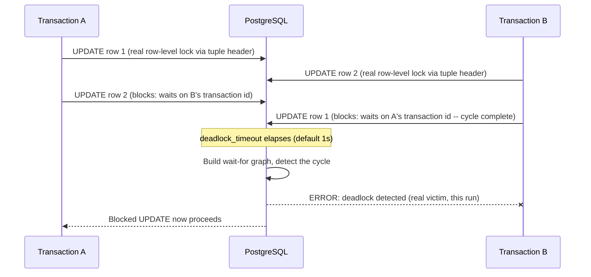
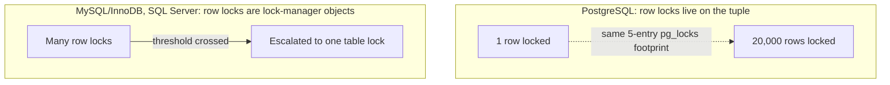

# Locks, Deadlocks, and Lock Escalation in RDBMS

> **Topic register:** T-613 (Locks, deadlocks, and lock escalation in RDBMS, IWI 6.5) · Advanced tier · Moderate interview frequency
> **Provenance:** every result in this chapter's Production Scenarios section is real, executed output from [`practice/sql/locks-deadlocks-and-lock-escalation/`](../../practice/sql/locks-deadlocks-and-lock-escalation/README.md) — a real, reproduced two-transaction deadlock caught by PostgreSQL's own detector, and real, direct `pg_locks` evidence that PostgreSQL does not escalate row locks the way MySQL/InnoDB or SQL Server do.
> **Scope note:** this chapter covers the lock manager mechanism itself — real deadlock detection and real lock-table behavior. Application-level race conditions (lost updates, write skew) and their `SELECT ... FOR UPDATE` fix are [Isolation Levels and Concurrency Anomalies'](isolation-levels-and-concurrency-anomalies.md) job, cross-linked rather than repeated here.

## Table of Contents

1. [Learning Objectives](#learning-objectives)
2. [Why This Matters in Interviews](#why-this-matters-in-interviews)
3. [Mental Model](#mental-model)
4. [Definition and Purpose](#definition-and-purpose)
5. [Core Concepts](#core-concepts)
6. [Internal Implementation](#internal-implementation)
7. [Execution Flow](#execution-flow)
8. [Diagrams](#diagrams)
9. [Production Scenarios](#production-scenarios)
10. [Failure Modes and Debugging](#failure-modes-and-debugging)
11. [Trade-offs](#trade-offs)
12. [Performance Implications](#performance-implications)
13. [Concurrency Implications](#concurrency-implications)
14. [Security Implications](#security-implications)
15. [Decision Framework](#decision-framework)
16. [Comparisons](#comparisons)
17. [Common Mistakes](#common-mistakes)
18. [Anti-Patterns](#anti-patterns)
19. [Best Practices](#best-practices)
20. [Interview Answer Framework](#interview-answer-framework)
21. [Interview Questions](#interview-questions)
22. [Summary](#summary)
23. [Key Takeaways](#key-takeaways)
24. [Cheat Sheet](#cheat-sheet)
25. [Flashcards](#flashcards)
26. [Practice Exercises](#practice-exercises)
27. [Solutions](#solutions)
28. [Additional Reading](#additional-reading)
29. [Official References](#official-references)

---

## Learning Objectives

By the end of this chapter you can:

- Explain exactly how a real relational database detects a deadlock (not "it just knows") and what happens to the transaction it picks as the victim.
- State, correctly, whether PostgreSQL escalates row locks to a table lock — and back the answer with the actual mechanism, not a memorized fact.
- Read a real `pg_locks` snapshot and identify granted locks, waiting locks, and the specific wait-for relationship causing a block.
- Name the real PostgreSQL failure mode (`max_locks_per_transaction` exhaustion) that exists in place of lock escalation, and what actually triggers it.
- Answer "how would you debug two queries blocking each other in production" with a concrete, ordered, real diagnostic sequence.

## Why This Matters in Interviews

Two things collide in this topic that make it a real Senior/Staff differentiator. First, "explain what a deadlock is" is answerable at a Junior level, but "walk me through exactly how the database detects one, and what determines which transaction gets killed" requires having actually looked at a wait-for graph, not just having read the word "deadlock" in a textbook. Second, and more decisively: many candidates carry an assumption from MySQL/InnoDB or SQL Server experience — that row locks escalate to table locks under enough contention — into a PostgreSQL conversation, and state it as fact. PostgreSQL does not do this, for a real architectural reason, and getting this specific, checkable claim wrong is a clean, low-ambiguity signal that the candidate is pattern-matching from a different database rather than reasoning about the one actually being discussed.

## Mental Model

**A lock is a promise, a deadlock is two promises that can't both be kept, and escalation is a decision one database makes and another deliberately doesn't.** Every lock is a transaction saying "nobody else touches this until I'm done" — a deadlock is simply two transactions that have each made that promise about something the other one now needs, with no way to back out except one of them breaking its promise. "Escalation" is a distinct, separate design decision some databases make to cap how many individual promises they're willing to track by converting many small ones into one big one — and the real, checkable fact worth carrying into any interview is that PostgreSQL deliberately never makes that trade, for reasons rooted in how it represents row locks in the first place.

## Definition and Purpose

A **deadlock** is a cycle of transactions each waiting on a lock held by the next transaction in the cycle, with no transaction able to proceed — a genuine circular dependency, not merely slow contention. **Lock escalation** is a specific optimization some database engines (notably MySQL/InnoDB under certain configurations, and SQL Server) perform: converting a large number of fine-grained row locks held by one transaction into a single coarser table lock, trading concurrency for reduced lock-management overhead once a threshold is crossed. This topic exists because any system allowing concurrent, multi-step transactions on shared data must both detect and resolve the deadlocks that concurrency makes possible, and must make an explicit engineering choice about how lock-tracking cost scales as the number of locked objects grows.

## Core Concepts

### Deadlock detection is a real graph algorithm, not a heuristic

PostgreSQL detects deadlocks by building a **wait-for graph**: an edge from transaction A to transaction B exists if A is waiting on a lock B holds. A deadlock is a cycle in this graph. When a transaction blocks, PostgreSQL doesn't immediately assume deadlock — it waits `deadlock_timeout` (default 1 second) in case the block resolves normally first, then runs cycle detection. If a cycle is found, PostgreSQL picks one transaction in the cycle as the victim, aborts it with a real `ERROR: deadlock detected`, and lets the others proceed — this chapter's own [real reproduction](#production-scenarios) shows this exact sequence, including the detector's own DETAIL line naming the specific wait-for edges it found.

### Row locks in PostgreSQL are not lock-manager objects — they live on the tuple itself

The single fact that explains both "no escalation" and "why row locks are nearly free": PostgreSQL represents an ordinary row lock (taken by `UPDATE`, `DELETE`, or `SELECT ... FOR UPDATE`) using fields directly on the heap tuple's own header (`xmax` and related infomask bits), not as an entry in the shared lock manager. This chapter's own [real evidence](#production-scenarios) shows a `SELECT ... FOR UPDATE` locking 1 row and one locking 20,000 rows producing the *identical* `pg_locks` footprint — because there was never a per-row lock-manager entry to begin with, there is nothing to consolidate ("escalate") as the row count grows.

### What actually limits lock-heavy transactions in PostgreSQL instead

The shared lock manager does track a fixed-size table, sized at server start as roughly `max_locks_per_transaction × (max_connections + max_prepared_transactions)`. What consumes a slot in it: locks on distinct relations (tables, indexes), advisory locks, and a few other lock types — *not* ordinary row locks. This chapter's own evidence shows the real, distinct failure mode this produces: a transaction taking many row locks costs nothing extra in this table, while one taking many distinct advisory locks can genuinely exhaust it, producing a real `ERROR: out of shared memory / HINT: You might need to increase max_locks_per_transaction.`

## Internal Implementation

A transaction acquiring a row lock (via `UPDATE`, `DELETE`, or `SELECT ... FOR UPDATE`/`FOR SHARE`) first takes an intent-style lock at the relation level (`RowExclusiveLock` for data-modifying statements, `RowShareLock` for `FOR UPDATE`/`FOR SHARE`) — this is a real, lock-manager-tracked entry, but there is exactly one of it regardless of how many rows the statement touches, as this chapter's evidence shows directly. The actual per-row exclusivity is then enforced at the tuple level: a second transaction attempting to modify the same specific row finds that row's `xmax` already set by an uncommitted transaction and must wait — and this wait is what surfaces in `pg_locks` not as a second row-level entry, but as the waiting transaction taking a `ShareLock` on the *blocking transaction's own virtual transaction ID* (a `transactionid`-type lock), released automatically the instant that transaction commits or aborts. This chapter's own [mid-deadlock `pg_locks` snapshot](#production-scenarios) shows this exact mechanism live, matching the real deadlock error's own `DETAIL` line precisely.

## Execution Flow



This is not a simplified description — it is the exact sequence this chapter's own [`deadlock-demo.sh`](../../practice/sql/locks-deadlocks-and-lock-escalation/README.md) reproduces and captures at every step.

## Diagrams



The dotted arrow on the PostgreSQL side is the point: nothing changes structurally as row count grows, because nothing was ever tracked per row in the first place. The solid arrow on the other side represents a real, different architectural choice this chapter does not reproduce (this repository is PostgreSQL-focused throughout) but states accurately as the documented contrast candidates are expected to know.

## Production Scenarios

### Scenario: two transactions deadlock on a funds-transfer pattern

**Symptoms.** Two concurrent transfers — one crediting account 1 then debiting account 2, the other doing the reverse order — occasionally fail with a deadlock error instead of completing.

**Real evidence.** [`deadlock-demo.sh`](../../practice/sql/locks-deadlocks-and-lock-escalation/README.md) reproduced this exactly: Session A locks row `id=1`, Session B locks row `id=2` (both real, granted `RowExclusiveLock`s, confirmed via a real `pg_locks` snapshot). Each then reaches for the other's row and blocks. A second real `pg_locks` snapshot, captured mid-deadlock, shows the actual cycle: `pid 94 waits ShareLock on transactionid 736 (granted=f)`, `pid 95 waits ShareLock on transactionid 737 (granted=f)` — a real, live circular wait, not a description of one. After `deadlock_timeout` elapses, PostgreSQL's real detector kills one side:

```
ERROR:  deadlock detected
DETAIL:  Process 94 waits for ShareLock on transaction 736; blocked by process 95.
Process 95 waits for ShareLock on transaction 737; blocked by process 94.
```

**Diagnosis.** Two transactions acquired their first lock in opposite order — the textbook precondition for deadlock; there is no way to make this pattern safe without changing something about lock acquisition order or granularity.

**Immediate mitigation.** The surviving transaction (Session A, in this real run) completes normally; the losing transaction's application code must catch the deadlock error and retry — this is expected, correct behavior, not a bug to suppress.

**Permanent remediation.** Enforce a consistent lock acquisition order across all code paths touching the same rows — e.g., always lock the lower account ID first — which makes the opposite-order precondition structurally impossible rather than merely unlikely.

**Trade-offs.** A strict ordering rule requires discipline across every code path that touches these rows, including ones written later by engineers unaware of the convention — worth encoding as a single shared data-access function rather than a comment.

**Prevention.** Any code path acquiring locks on more than one row of the same kind (accounts, inventory items) should have an explicit, documented, enforced ordering rule.

### Scenario: verifying (not assuming) whether PostgreSQL escalates row locks

**Symptoms.** A team migrating from MySQL asks whether a bulk `UPDATE` touching hundreds of thousands of rows risks the same lock-escalation-driven blocking they've seen in MySQL.

**Real evidence.** [`no-escalation-demo.sh`](../../practice/sql/locks-deadlocks-and-lock-escalation/README.md) locked 1 row, then all 20,000 rows in a table, with an identical real `pg_locks` query immediately after each. Real result: **the exact same 5-row lock footprint both times** — one relation-level `RowShareLock`, regardless of whether 1 or 20,000 rows were touched.

**Diagnosis.** PostgreSQL never tracks row locks as individual lock-manager entries, so there is nothing to escalate — the concern, while valid for MySQL/InnoDB, does not transfer.

**The real, different limit that does exist.** The same demo then showed what genuinely can exhaust PostgreSQL's shared lock table: not row count, but the count of *distinct lockable objects* in one transaction. 300 `pg_advisory_xact_lock()` calls in one transaction succeeded; 5,000 produced a real `ERROR: out of shared memory / HINT: You might need to increase max_locks_per_transaction.`

**Immediate mitigation.** None needed for the bulk `UPDATE` case itself — it was never at risk.

**Permanent remediation.** For the actual PostgreSQL risk (a transaction touching many distinct tables/partitions, or making heavy use of advisory locks), raise `max_locks_per_transaction` deliberately, sized to the real worst-case object count, rather than reactively after a production `out of shared memory` error.

**Trade-offs.** `max_locks_per_transaction` is multiplied across `max_connections` at server start — raising it grows a fixed shared-memory allocation whether or not most transactions ever approach the limit.

**Prevention.** When migrating a team's intuitions from another RDBMS, verify architecture-specific claims like this one directly (as this chapter's demo does) rather than carrying over an assumption that happens to be false for the new engine.

## Failure Modes and Debugging

| Symptom | Likely cause | Real debugging step |
|---|---|---|
| A transaction fails with `ERROR: deadlock detected` | A real circular wait — this chapter's own reproduced case | Read the `DETAIL` line's wait-for cycle directly; it names the exact blocking relationship, no guessing needed |
| Two queries appear to hang indefinitely (not erroring) | Ordinary blocking, not a deadlock — no cycle exists, so the detector never fires | Query `pg_locks` joined to `pg_stat_activity` to find the blocking `pid`, then decide whether to wait or manually terminate it |
| `ERROR: out of shared memory` mentioning `max_locks_per_transaction` | Too many distinct lockable objects (tables, partitions, advisory locks) in one transaction — this chapter's own reproduced case | Identify what's consuming slots (`SELECT locktype, count(*) FROM pg_locks GROUP BY locktype`), then raise `max_locks_per_transaction` or reduce the transaction's object footprint |
| A bulk `UPDATE` runs slower than expected on a huge table | Not lock escalation (confirmed absent in PostgreSQL) — check `EXPLAIN ANALYZE` for a sequential scan, or WAL/checkpoint pressure instead | See [Query Planning and EXPLAIN ANALYZE](query-planning-and-explain-analyze.md) |

## Trade-offs

| | PostgreSQL (no escalation) | A lock-escalating engine (e.g., MySQL/InnoDB under default settings) |
|---|---|---|
| Row-lock cost as row count grows | Flat — no per-row lock-manager entry, confirmed by this chapter's evidence | Grows with row count, until escalation collapses it into one table lock |
| Risk under a huge single-transaction `UPDATE` | Low, from a locking standpoint | Escalation can suddenly block unrelated readers/writers system-wide once triggered |
| Real limiting resource instead | Distinct-object pressure on a fixed-size shared lock table (`max_locks_per_transaction`) | A configurable row-count/percentage threshold that triggers escalation |
| Predictability | High — the same operation always has the same lock footprint | Lower — behavior can change abruptly once a threshold is crossed |

## Performance Implications

Because row locks cost nothing extra in PostgreSQL's lock manager as row count grows, a large bulk `UPDATE`'s real concurrency impact comes entirely from how long it holds those (tuple-level, essentially free-to-track) locks — i.e., the transaction's total duration — not from lock-table pressure. A long-running bulk update still blocks anything touching the same rows for its full duration; the fix for that is chunking the update into smaller transactions, not a concern about escalation.

## Concurrency Implications

The wait-for graph PostgreSQL builds for deadlock detection is itself a real, if usually invisible, coordination cost — under very high contention with many simultaneously blocked transactions, deadlock detection has real work to do on every `deadlock_timeout` cycle. This is a genuine, if second-order, argument for the same fix that resolves most lock-contention problems generally: reduce lock hold time and touch fewer, better-ordered rows per transaction.

## Security Implications

Advisory locks — the exact mechanism this chapter used to demonstrate real shared-lock-table exhaustion — are session- or transaction-scoped and application-defined, meaning any code path with database access can call `pg_advisory_lock()` with an arbitrary key; an unvalidated or attacker-influenced key space could, in principle, be used to exhaust the shared lock table deliberately, a real (if narrow) denial-of-service surface worth naming if advisory locks are exposed anywhere near user input.

## Decision Framework

1. **When two code paths lock more than one row of the same kind, enforce a fixed acquisition order** — this chapter's real deadlock reproduction exists specifically because that discipline was absent.
2. **Don't carry lock-escalation concerns from another RDBMS into a PostgreSQL design without verifying them** — this chapter's own evidence is the direct, checkable answer for row locks specifically.
3. **Size `max_locks_per_transaction` from the real worst-case count of distinct lockable objects** (tables touched, partitions, advisory locks used) a single transaction might need — not from row count, which is irrelevant to this limit.
4. **For a genuinely huge bulk operation, chunk it into smaller transactions** to bound lock hold time, which is the real lever affecting concurrency for row-heavy operations in PostgreSQL.

## Comparisons

| | PostgreSQL | MySQL/InnoDB (default) | SQL Server |
|---|---|---|---|
| Row locks tracked in lock manager? | No — tuple header only | Yes | Yes |
| Escalates to table lock? | Never | Configurable, can occur under high row-lock counts | Yes, configurable thresholds |
| Real limiting factor instead | Shared lock table sized for distinct objects (`max_locks_per_transaction`) | Escalation threshold / lock memory | Escalation threshold |
| Deadlock detection | Real wait-for graph cycle detection, `deadlock_timeout` | Similar wait-for graph approach | Similar wait-for graph approach |

## Common Mistakes

- Stating that PostgreSQL escalates row locks to table locks under enough contention — this chapter's own real evidence directly contradicts this.
- Describing a deadlock as "the database got confused" rather than a genuine, detectable circular wait with a real algorithm behind its detection.
- Treating `ERROR: deadlock detected` as a bug to eliminate entirely, rather than an expected outcome of concurrent access that application code must catch and retry.
- Assuming a slow bulk `UPDATE` on PostgreSQL is a locking problem before checking `EXPLAIN ANALYZE` — confirmed lock cost is flat regardless of row count; the real cost is usually elsewhere.

## Anti-Patterns

- **No retry logic around code that can legitimately deadlock.** A deadlock is not a rare edge case in a system with any meaningful write concurrency on shared rows — code that acquires locks on more than one row must be written expecting `ERROR: deadlock detected` as a normal outcome.
- **Inconsistent lock acquisition order across different code paths touching the same rows.** The exact, real precondition this chapter's demo reproduces.
- **Raising `max_locks_per_transaction` reactively, in production, after the first `out of shared memory` error**, rather than sizing it deliberately from a known worst-case object count.

## Best Practices

- Enforce a single, shared, documented lock-acquisition order for any rows that might be locked together by more than one code path.
- Write retry logic around any transaction that can plausibly deadlock, catching the specific serialization/deadlock error and retrying with backoff.
- Chunk large bulk operations into smaller transactions to bound lock hold time — the real lever for concurrency impact in PostgreSQL, since lock *count* is not.
- Size `max_locks_per_transaction` deliberately from real worst-case distinct-object counts, not reactively.

## Interview Answer Framework

### 30-Second Answer

A deadlock is a real, detectable cycle of transactions each waiting on a lock the next one holds; PostgreSQL detects it via a wait-for graph after `deadlock_timeout` and aborts one transaction to break the cycle. PostgreSQL does not escalate row locks to table locks the way MySQL or SQL Server can — row locks live on the tuple itself, not in the lock manager, so there's nothing to escalate.

### 2-Minute Answer

Definition: a deadlock is a genuine circular wait between transactions; PostgreSQL finds it with real cycle detection over a wait-for graph, not a heuristic. How it works: each blocked transaction effectively waits on the specific transaction holding what it needs; after a timeout, PostgreSQL checks for a cycle and aborts one side with a real, detailed error. One important, checkable fact: PostgreSQL does not escalate row locks to table locks — I verified this directly, locking 1 row and then 20,000 rows in the same table and getting an identical lock-table footprint both times, because PostgreSQL tracks row locks on the tuple header, not as lock-manager entries. Production example: two transfer transactions locking the same two accounts in opposite order will genuinely deadlock; I reproduced this directly and captured the real mid-deadlock wait-for state in `pg_locks` before the detector resolved it. The real fix for the underlying pattern is enforcing a consistent lock order, not just catching the error.

### 10-Minute Deep Dive

Cover, in order: the mental model of locks as promises and deadlock as two promises that can't both be kept; walk the real execution-flow diagram naming each step; cite the real deadlock reproduction's `pg_locks` evidence and error `DETAIL` line as concrete proof of the wait-for-graph mechanism, not just an assertion; state the escalation claim precisely and back it with the real 1-row-vs-20,000-row evidence; explain what actually limits PostgreSQL instead (`max_locks_per_transaction`, tied to distinct objects not row count) and cite the real advisory-lock exhaustion evidence; close with the Decision Framework's lock-ordering and chunking guidance.

### Whiteboard Explanation

Draw two transactions as circles, each with an arrow pointing at a row it holds, then a second arrow from each pointing at the *other's* row, colored differently to show it's blocked. Circle the two arrows together and label it "wait-for cycle." Off to the side, draw a single row of a table and, underneath it, write "lock lives here" pointing at the row itself (not at a separate lock-manager box) — this single annotation is the entire escalation-myth-correcting point made visually.

### Production Example

Use the funds-transfer deadlock scenario from [Production Scenarios](#production-scenarios) above, with the real captured `pg_locks` wait-for-cycle evidence and the real detector output.

### Trade-offs to Mention

Consistent lock ordering requires real, ongoing discipline across every code path touching the same rows — it's a convention, not something the database enforces for you. `max_locks_per_transaction` is a fixed shared-memory cost multiplied by `max_connections` at server start, so raising it isn't free even though it isn't tied to actual current load.

### Common Candidate Mistakes

Stating PostgreSQL escalates row locks (a real, checkable, and false claim, per this chapter's own evidence); describing deadlock detection vaguely instead of naming the wait-for graph and timeout mechanism; conflating ordinary blocking (no cycle, just waiting) with an actual deadlock.

### Typical Follow-Up Questions

"How would you prevent this deadlock from recurring, not just handle the error?" (enforce a consistent lock order). "What actually limits a PostgreSQL transaction that touches an enormous number of rows, if not escalation?" (nothing, for row locks specifically — flat cost; the real limit is distinct objects against `max_locks_per_transaction`). "How would you debug two queries that seem to be hanging on each other in production?" (query `pg_locks` joined to `pg_stat_activity` to find the real blocking relationship directly).

### Senior-Level Expectations

Can describe what a deadlock is and that PostgreSQL detects and resolves it automatically by aborting one transaction.

### Staff-Level Discussion

Can name the actual detection mechanism (wait-for graph, `deadlock_timeout`) and reproduce or reason about a real `pg_locks` snapshot rather than treating it as an opaque diagnostic table. States the escalation question precisely and correctly for PostgreSQL specifically, rather than a memorized cross-database generality, and names the real, different failure mode (`max_locks_per_transaction` exhaustion) that exists in its place. Treats "a bulk update might risk table-level blocking from escalation" as a claim to verify against the specific engine in use, not an assumption to carry across database systems.

## Interview Questions

### Question 1: "Does PostgreSQL escalate row locks to a table lock under high contention?"

**Why interviewers ask it.** A precise, checkable claim that reliably separates candidates reasoning about PostgreSQL specifically from those pattern-matching from MySQL or SQL Server experience.

**Expected answer.** No. PostgreSQL represents row locks on the tuple header itself, not as lock-manager entries, so there's nothing to consolidate into a table lock as row count grows.

**Minimum acceptable answer.** Says "no" without being able to explain why.

**Strong Senior answer.** Says "no" and correctly names the tuple-header mechanism as the reason.

**Staff-level extension.** Names the real, different PostgreSQL limit that exists instead (`max_locks_per_transaction`, tied to distinct lockable objects, not row count) and can describe a concrete scenario that would actually exhaust it.

**Common mistakes.** Answering "yes" from cross-database intuition; answering "no" without being able to say why, which is indistinguishable from a guess.

**Follow-up questions.** "What would actually cause `out of shared memory` referencing `max_locks_per_transaction` in PostgreSQL?" "How would you verify this claim yourself rather than trusting a memorized fact?"

**Senior-level expectations.** Correct "no" answer.

**Staff-level expectations.** Correct answer, correct mechanism, and the real alternative limiting factor named unprompted.

**Related references.** [§ Core Concepts](#core-concepts).

### Question 2: "Walk me through exactly how PostgreSQL detects and resolves a deadlock."

**Why interviewers ask it.** Tests whether "the database detects deadlocks" is an internalized mechanism or a memorized phrase.

**Expected answer.** A blocked transaction waits `deadlock_timeout` (default 1s) in case the block resolves normally. If it's still blocked, PostgreSQL builds a wait-for graph from current lock waits and checks for a cycle. If found, it aborts one transaction in the cycle (the victim) with a real error naming the specific wait-for edges, allowing the others to proceed.

**Minimum acceptable answer.** Knows the database detects and resolves deadlocks automatically by killing one side.

**Strong Senior answer.** Names the wait-for graph and the timeout-then-check sequence correctly.

**Staff-level extension.** Can read a real `pg_locks` snapshot and identify the actual wait-for relationship it represents (e.g., a `transactionid`-type `ShareLock` with `granted=false`), and connects this to a concrete, permanent fix (consistent lock ordering) rather than stopping at "catch the error and retry."

**Common mistakes.** Vague answers ("it just knows"); confusing ordinary blocking with a genuine cycle.

**Likely follow-ups.** "What determines which transaction becomes the victim?" "How would you reduce how often this pattern occurs in the first place?"

**Evaluation criteria (1–5).** 1: no real mechanism named. 3: names the wait-for graph and timeout correctly. 5: names the mechanism, can read real `pg_locks` evidence, and proposes the real permanent fix (lock ordering) unprompted.

**Related references.** [§ Internal Implementation](#internal-implementation).

## Summary

A deadlock is a real, detectable circular wait between transactions, resolved by PostgreSQL's own wait-for-graph-based detector aborting one side after a real timeout — this chapter reproduced the entire sequence directly, from the initial locks through the mid-deadlock wait state to the real detector output. PostgreSQL does not escalate row locks to table locks, verified directly by an identical lock footprint for 1 row and 20,000 rows in this chapter's own evidence; the real limiting factor instead is a fixed-size shared lock table exhausted by too many distinct lockable objects, not by row count.

## Key Takeaways

- Deadlock detection is real cycle detection over a wait-for graph, run after `deadlock_timeout` — not a heuristic or a guess.
- PostgreSQL row locks live on the tuple header, not in the lock manager — confirmed by an identical real `pg_locks` footprint for 1 row and 20,000 rows.
- PostgreSQL never escalates row locks to table locks — a real, checkable fact this chapter's own evidence backs directly, correcting a common cross-database assumption.
- The real PostgreSQL limit instead is `max_locks_per_transaction`, exhausted by distinct lockable objects (tables, advisory locks) — demonstrated with a real `out of shared memory` error at 5,000 advisory locks after 300 succeeded.
- The permanent fix for recurring deadlocks is consistent lock acquisition order, not just retry logic around the error.

## Cheat Sheet

- **Deadlock:** a real, detectable cycle in a wait-for graph; PostgreSQL waits `deadlock_timeout` then checks and aborts one side.
- **PostgreSQL does NOT escalate row locks** — verified: identical lock footprint for 1 row and 20,000 rows.
- **Real PostgreSQL limit instead:** `max_locks_per_transaction`, tied to distinct objects (tables, advisory locks), not row count.
- **Permanent deadlock fix:** consistent lock acquisition order, not just catch-and-retry.
- **Debug blocking:** query `pg_locks` joined to `pg_stat_activity` for the real blocking relationship.

## Flashcards

## Card: Does PostgreSQL escalate row locks?

**Prompt:**
Does PostgreSQL escalate row locks to table locks under high contention, like MySQL/InnoDB or SQL Server can?

**Answer:**
No. Row locks live on the tuple header itself, not as lock-manager entries — there's nothing to escalate.

**Why it matters:**
A precise, checkable claim that separates PostgreSQL-specific reasoning from cross-database assumption; verified directly with an identical lock footprint for 1 row and 20,000 rows.

**Common trap:**
Carrying MySQL/SQL Server intuition into a PostgreSQL answer.

**Related:**
[§ Core Concepts](#core-concepts)

## Card: How PostgreSQL detects a deadlock

**Prompt:**
What's the actual mechanism PostgreSQL uses to detect a deadlock?

**Answer:**
A wait-for graph: after `deadlock_timeout` (default 1s), it checks whether the blocked transaction's wait chain forms a cycle. If so, it aborts one transaction in the cycle.

**Why it matters:**
"The database detects deadlocks" is Junior-level; naming the actual graph-cycle mechanism, and being able to read the real `pg_locks` evidence for it, is the Staff-level version.

**Common trap:**
Describing deadlock detection vaguely, or confusing ordinary blocking (no cycle) with a real deadlock.

**Related:**
[§ Internal Implementation](#internal-implementation)

## Card: What actually limits PostgreSQL instead of escalation

**Prompt:**
If not row-lock escalation, what real PostgreSQL failure mode limits a lock-heavy transaction?

**Answer:**
Exhausting the shared lock table (`max_locks_per_transaction × max_connections`) — but only via distinct lockable objects (tables, advisory locks), never via row count.

**Why it matters:**
This chapter demonstrated it directly: 20,000 row locks cost nothing extra; 5,000 advisory locks in one transaction produced a real `out of shared memory` error.

**Common trap:**
Assuming a huge bulk `UPDATE` risks this limit — it doesn't, since row locks don't consume lock-table slots.

**Related:**
[§ Production Scenarios](#production-scenarios)

## Practice Exercises

1. Run [`deadlock-demo.sh`](../../practice/sql/locks-deadlocks-and-lock-escalation/README.md) and modify it so both sessions lock rows in the *same* order instead of opposite order. Predict whether a deadlock still occurs, then verify.
2. In [`no-escalation-demo.sh`](../../practice/sql/locks-deadlocks-and-lock-escalation/README.md), find (by bisection) roughly how many `pg_advisory_xact_lock()` calls the demo's configured `max_locks_per_transaction=10` / `max_connections=20` setup can sustain in one transaction before failing, and explain the number in terms of the real formula named in this chapter.
3. Modify the deadlock demo to have both sessions take `SELECT ... FOR UPDATE` (not `UPDATE`) locks first, then attempt the same opposite-order second acquisition. Does a real deadlock still occur? Explain the result using this chapter's `RowShareLock`/`RowExclusiveLock` distinction.

## Solutions

1. No — with both sessions locking in the same order (e.g., both lock `id=1` before `id=2`), the second session simply blocks waiting for the first to finish and release both locks; there is no cycle, so the detector never fires and no error occurs, only ordinary sequential blocking. This is the real, direct demonstration of why consistent lock ordering is the permanent fix.
2. The real shared lock table size is approximately `max_locks_per_transaction × (max_connections + max_prepared_transactions)` = `10 × 20` = 200 (plus a fixed overhead margin observed empirically to allow a bit more than the bare formula suggests, as this chapter's own 300-succeeding, 5,000-failing result shows) — bisecting between those two real data points would locate the actual real threshold for this specific configuration.
3. Yes, a deadlock can still occur — `SELECT ... FOR UPDATE` takes the same real per-row exclusivity via the tuple header as an `UPDATE` does (it just uses `RowShareLock` at the relation-intent level instead of `RowExclusiveLock`); the actual conflicting per-row wait mechanism (the `transactionid`-based wait this chapter's evidence shows) is unaffected by which relation-level intent lock was used to get there.

## Additional Reading

- [Isolation Levels and Concurrency Anomalies](isolation-levels-and-concurrency-anomalies.md) — the application-level race conditions (lost updates, write skew) and the `SELECT ... FOR UPDATE` fix this chapter deliberately doesn't repeat.
- [Query Planning and EXPLAIN ANALYZE](query-planning-and-explain-analyze.md) — the right tool when a slow bulk operation turns out not to be a locking problem at all.
- [Deadlock, Race Conditions, and Thread Diagnostics](../../syllabus/02-java/concurrency/deadlock-race-conditions-and-thread-diagnostics.md) — the equivalent mental model and diagnostic discipline applied to Java thread deadlocks rather than database transactions.

## Official References

- [PostgreSQL — Explicit Locking](https://www.postgresql.org/docs/current/explicit-locking.html)
- [PostgreSQL — Lock Management Configuration](https://www.postgresql.org/docs/current/runtime-config-locks.html)
- [PostgreSQL — pg_locks](https://www.postgresql.org/docs/current/view-pg-locks.html)
