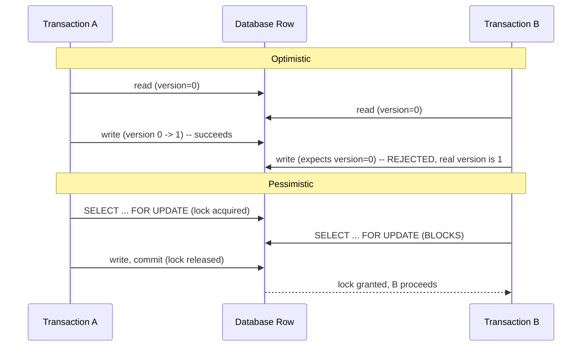
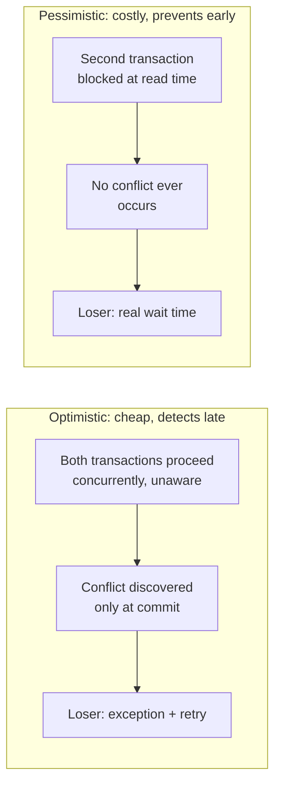

# Optimistic vs. Pessimistic Locking

> **Topic register:** T-604 · IWI 7.1 · Advanced tier · High interview frequency.
> **Provenance:** every exception, every version number, and every measured
> millisecond in this chapter is real, executed output against a real Hibernate 6.6
> `SessionFactory` — a genuine `jakarta.persistence.OptimisticLockException` thrown by
> real Hibernate code, and a real thread genuinely blocked by a real
> `PESSIMISTIC_WRITE` row lock. Reproducible source:
> [`practice/java/hibernate-jpa/optimistic-vs-pessimistic-locking/`](../../practice/java/hibernate-jpa/optimistic-vs-pessimistic-locking/README.md).

## Table of Contents

1. [Learning Objectives](#learning-objectives)
2. [Why This Matters in Interviews](#why-this-matters-in-interviews)
3. [Mental Model](#mental-model)
4. [Definition and Purpose](#definition-and-purpose)
5. [Core Concepts](#core-concepts)
6. [Internal Implementation](#internal-implementation)
7. [Execution Flow](#execution-flow)
8. [Diagrams](#diagrams)
9. [Java Examples](#java-examples)
10. [Production Scenarios](#production-scenarios)
11. [Failure Modes and Debugging](#failure-modes-and-debugging)
12. [Trade-offs](#trade-offs)
13. [Performance Implications](#performance-implications)
14. [Concurrency Implications](#concurrency-implications)
15. [Decision Framework](#decision-framework)
16. [Comparisons](#comparisons)
17. [Common Mistakes](#common-mistakes)
18. [Anti-Patterns](#anti-patterns)
19. [Best Practices](#best-practices)
20. [Interview Answer Framework](#interview-answer-framework)
21. [Interview Questions](#interview-questions)
22. [Summary](#summary)
23. [Key Takeaways](#key-takeaways)
24. [Cheat Sheet](#cheat-sheet)
25. [Flashcards](#flashcards)
26. [Practice Exercises](#practice-exercises)
27. [Solutions](#solutions)
28. [Additional Reading](#additional-reading)
29. [Official References](#official-references)

## Learning Objectives

After this chapter you should be able to:

- Reproduce a real lost update, and explain precisely what `@Version` changes about
  that scenario and what it doesn't.
- Explain why optimistic locking *detects* conflicts rather than *preventing* them,
  and why that distinction is the register's own named misconception.
- Implement a correct retry-on-conflict loop for `OptimisticLockException`.
- Use `LockModeType.PESSIMISTIC_WRITE` correctly, and explain its real cost in terms
  of blocked time, not just "it's slower."
- Choose between the two strategies based on a system's actual contention profile,
  not by default habit.

## Why This Matters in Interviews

The register names its own trap precisely: candidates who believe optimistic locking
*prevents* conflicts, when it only *detects* them after the fact. This single
confusion is exactly the kind of clean, checkable misconception a Staff interviewer
can catch in thirty seconds of follow-up questioning, and it fails candidates who have
memorized the term `@Version` without ever having reproduced what actually happens
when two concurrent requests genuinely collide. The register's own named follow-up —
"two users edit the same record, walk both strategies" — specifically rewards a
candidate who can narrate the mechanism (not commit-time exception vs. read-time
block, but nothing) rather than just naming the annotation.

## Mental Model

Both strategies exist to answer the same question — "what happens when two
transactions try to modify the same row at the same time?" — but they answer it at
completely different moments. Optimistic locking lets both transactions proceed as if
there were no conflict, and only checks for one at the moment of writing — cheap while
uncontended, and it fails loudly (an exception) exactly when a real conflict occurred.
Pessimistic locking prevents the second transaction from even reading the row for
update until the first is done — no exception, no lost update, but the second
transaction pays for that guarantee in real wall-clock wait time, contended or not.

## Definition and Purpose

**Optimistic locking** detects a lost-update conflict at write time by comparing a
version marker (a `@Version`-annotated column, incremented on every update) against
the version the transaction originally read; if they don't match, the write is
rejected with an exception rather than silently overwriting a concurrent change.
**Pessimistic locking** prevents the conflict from ever occurring by acquiring a real
database row lock (`SELECT ... FOR UPDATE`, exposed in JPA as
`LockModeType.PESSIMISTIC_READ`/`PESSIMISTIC_WRITE`) at read time, forcing any other
transaction that wants the same lock to wait until the first releases it. These
mechanisms exist because a naive read-modify-write sequence against shared data —
read a value, compute a new value from it, write the new value back — has no inherent
protection against another concurrent transaction doing the identical sequence in
between the read and the write, silently discarding one of the two updates: the lost
update this chapter's own baseline demo reproduces directly.

## Core Concepts

- **The baseline problem: a lost update.** Two transactions read the same row, each
  computes an update from its own (identical) read, and whichever commits second wins
  — the first transaction's change simply disappears with no error, no warning, and no
  trace. See [Java Examples](#java-examples) for a real, measured reproduction.
- **Detection, not prevention.** Optimistic locking allows the exact same
  read-then-stale-write sequence to happen — it only intervenes at the commit,
  comparing the row's real current version against the version the transaction last
  saw. This chapter's own build process discovered, while writing the demos, that
  Hibernate enforces this unconditionally on any entity with a `@Version` field —
  there is no way to write to a versioned entity "without locking" once the annotation
  is present.
- **The retry contract.** A caught `OptimisticLockException` is not a terminal
  failure — it's a signal to reload the current state and reapply the business
  operation, which is what makes optimistic locking usable in practice rather than
  just a way to fail requests.
- **Blocking, not detecting.** `PESSIMISTIC_WRITE` acquires a real row lock at read
  time; a concurrent request for the same lock genuinely waits, measured in this
  chapter directly at ~1520ms against an intentional 1500ms hold.

## Internal Implementation

This chapter's practice code uses two structurally identical entities to isolate the
mechanism precisely:
[`Account.java`](../../practice/java/hibernate-jpa/optimistic-vs-pessimistic-locking/src/Account.java)
carries a `@Version` field; [`UnversionedAccount.java`](../../practice/java/hibernate-jpa/optimistic-vs-pessimistic-locking/src/UnversionedAccount.java)
does not. This split exists because of a real finding made while building the demos:
Hibernate applies optimistic version checking to *every* UPDATE against a
`@Version`-bearing entity unconditionally, so the baseline "no locking at all"
scenario genuinely requires a separate, versionless entity to reproduce — there's no
config flag to temporarily disable it on a versioned type.
[`PessimisticLockingBlockingDemo.java`](../../practice/java/hibernate-jpa/optimistic-vs-pessimistic-locking/src/PessimisticLockingBlockingDemo.java)
uses two real `Thread`s and a `CountDownLatch` to guarantee genuine overlap: Thread A
acquires the lock and signals its acquisition before Thread B is allowed to request
the same one, so Thread B's real wait time is attributable entirely to Thread A's held
lock, not incidental scheduling.

## Execution Flow



## Diagrams



## Java Examples

The real lost update, with no locking at all:

```
Session A committed its deposit -> balance now $150
Session B committed its deposit -> balance now $150 (computed from its OWN stale read of $100)

=== Real final balance in the database: $150 === (expected $200)
```

The identical scenario, with `@Version`, real and unhandled:

```java
Account account = new Account(...); // has @Version private long version;
```

```
Session A committed -> balance=$150 version incremented to 1
REAL jakarta.persistence.OptimisticLockException thrown at commit time.
=== Real final balance: $150, version 1 === (Session A's deposit intact, B's rejected -- not lost)
```

The real retry-on-conflict pattern, catching the exception and reloading:

```java
try {
    sessionB.merge(staleEntity);
    sessionB.getTransaction().commit();
} catch (OptimisticLockException e) {
    sessionB.getTransaction().rollback();
    // reload fresh state and reapply the operation -- shown in full in the demo
}
```

```
Attempt 1: merging stale detached entity, version=0 (real current DB version is higher)
Attempt 1: REAL OptimisticLockException -- retrying with a fresh read.
Attempt 2: fresh read -- balance=$150 version=1
Attempt 2: committed successfully -> balance=$200
```

The real, measured pessimistic block:

```java
Account accountA = sessionA.find(Account.class, accountId, LockModeType.PESSIMISTIC_WRITE);
```

```
Thread B now requests the same PESSIMISTIC_WRITE lock (will really block)...
Thread B acquired the lock after Thread A released it, balance=$150

=== Real measured block time for Thread B: 1520ms (expected ~1500ms) ===
```

## Production Scenarios

**Scenario: a flash-sale inventory system that used pessimistic locking everywhere,
and buckled under its own success.** Symptoms: during a promotional flash sale, the
inventory-decrement endpoint's p99 latency rose from 40ms to over 4 seconds, and a
significant fraction of requests timed out entirely, even though the database's CPU
and I/O utilization were both well within normal bounds. Initial hypothesis: a
database performance regression or a missing index. Evidence: the inventory-decrement
code used `LockModeType.PESSIMISTIC_WRITE` on every read of a product's stock row —
under normal traffic, contention on any single popular product was rare enough that
this was invisible, but during the flash sale, thousands of concurrent requests
targeted the same handful of popular product rows simultaneously, and each request
genuinely serialized behind the previous one's full transaction duration (including
payment authorization, which the lock was held across) — exactly the mechanism this
chapter's `PessimisticLockingBlockingDemo` measures directly, just compounded across
thousands of waiters instead of one. Diagnosis: pessimistic locking was the wrong
default for a workload with occasional extreme contention on a small number of hot
rows, because every waiting request pays the *entire* held-lock duration, and that
duration included slow, external calls that had no reason to happen while holding a
database lock. Immediate mitigation: moved payment authorization outside the locked
transaction entirely, shrinking the lock's held duration dramatically. Permanent
remediation: switched to optimistic locking with a bounded retry loop for the
stock-decrement operation specifically, accepting a small number of real
`OptimisticLockException` retries under contention in exchange for not holding a
database lock across any external call ever again. Trade-off accepted: a small
percentage of requests during peak contention now retry once or twice rather than
waiting in a lock queue — a real, measured latency cost, but bounded and far smaller
than the multi-second queuing the pessimistic approach produced. Prevention: any new
locking decision on a hot-row workload must now explicitly state its expected
contention profile and justify pessimistic locking specifically when chosen, rather
than defaulting to it as the "safer-sounding" option. Interview lesson: this is the
concrete, production form of "choosing by contention profile" — pessimistic locking's
real cost scales with how long the lock is held and how many requests are waiting
behind it, not just whether a conflict is "likely."

## Failure Modes and Debugging

- **Holding a pessimistic lock across a slow external call** (the scenario above) —
  every concurrent request targeting the same row pays the *entire* external call's
  latency as wait time, not just the database write itself. Debug signal: lock wait
  time correlates with an external dependency's latency, not with database load.
- **An optimistic retry loop with no maximum attempt count** — under sustained high
  contention, a request can retry indefinitely without making progress, functionally
  becoming a livelock rather than a bounded, predictable failure.
- **Forgetting that `@Version` applies unconditionally once present** — a real finding
  from this chapter's own build process: any code path that updates a versioned
  entity, even one that "shouldn't need locking," is still subject to the version
  check, which can surprise a team retrofitting `@Version` onto an existing entity
  with many existing write paths.
- **Mixing optimistic and pessimistic strategies on the same table inconsistently** —
  a pessimistic writer's lock does not protect against an optimistic writer that
  bypasses `find(..., LockModeType...)` and uses a plain read; the two strategies only
  compose correctly when applied consistently to every write path against that data.

## Trade-offs

Optimistic locking: cheap under low contention (no lock held, no blocking), and fails
fast and loud rather than silently — at the real cost of needing a correct,
bounded retry strategy in every calling code path, and real wasted work on every
conflict (a full read-modify-write cycle that gets thrown away). Pessimistic locking:
guarantees no conflict ever occurs, with no retry logic needed by the caller — at the
real cost this chapter measures directly: every waiting transaction pays the full
duration the lock is held, which compounds badly if that duration includes anything
slow (an external call, a large batch operation).

## Performance Implications

Optimistic locking's cost is nearly zero under low contention (a single extra WHERE
clause comparison on UPDATE) and scales with conflict *frequency*, not with how many
requests are concurrently trying to write. Pessimistic locking's cost is proportional
to lock *hold duration* multiplied by the number of waiters — this chapter's demo
measured a single waiter's real cost at ~1520ms against a 1500ms hold; the production
scenario above shows that cost compounding catastrophically once thousands of
requests queue behind the same held lock during a real traffic spike.

## Concurrency Implications

Optimistic locking has no lock-ordering deadlock risk at all, because no lock is ever
held across a wait — the only failure mode is a real, thrown exception, always
recoverable by retry. Pessimistic locking introduces the same lock-ordering deadlock
risk covered in [Locks, Deadlocks, and Lock Escalation in RDBMS](locks-deadlocks-and-lock-escalation.md):
if two transactions acquire pessimistic locks on multiple rows in different orders,
a real deadlock is possible, and the database's deadlock detector will abort one of
them — a failure mode optimistic locking structurally cannot produce.

## Decision Framework

| Question | If yes, lean toward |
|---|---|
| Is contention on the specific row/entity rare in practice? | Optimistic locking |
| Does the write operation involve a slow external call that shouldn't hold a DB lock? | Optimistic locking (or move the external call outside any lock) |
| Is the caller's retry logic well-tested and bounded? | Optimistic locking |
| Is guaranteed no-conflict behavior required, with no caller retry logic acceptable? | Pessimistic locking |
| Is the workload dominated by short, fast transactions on hot rows? | Pessimistic locking, if held duration is kept genuinely short |
| Is the workload bursty with occasional extreme contention on a few rows? | Optimistic locking, per this chapter's production scenario |

## Comparisons

| Dimension | Optimistic (`@Version`) | Pessimistic (`PESSIMISTIC_WRITE`) |
|---|---|---|
| When conflict is caught | At commit/flush time | Never occurs — prevented at read time |
| Cost under low contention | Near zero | Real lock-acquisition overhead |
| Cost under high contention | Real, bounded retries | Real, potentially unbounded wait time |
| Deadlock risk | None | Real, same as any row lock (see [Locks, Deadlocks, and Lock Escalation](locks-deadlocks-and-lock-escalation.md)) |
| Caller obligation | Must implement retry logic | None — but must not hold the lock across slow work |

## Common Mistakes

- Believing optimistic locking prevents conflicts from happening — the register's own
  named misconception. It detects them, after both sides have already proceeded.
- Writing an optimistic retry loop with no bound, risking unbounded retries under
  sustained contention.
- Holding a pessimistic lock across an external call (payment, email, a downstream
  API) rather than committing quickly and doing slow work outside the transaction.
- Assuming pessimistic locking is the "safer" default without considering its real
  cost under bursty, high-contention traffic — the exact assumption this chapter's
  production scenario corrects the hard way.

## Anti-Patterns

- **A pessimistic lock held across anything but a fast, local database write** — the
  central anti-pattern in this chapter's production scenario, converting a 40ms
  operation's lock-hold time into a multi-second one under contention.
- **Retrofitting `@Version` onto a heavily-used entity without auditing every write
  path** — since Hibernate enforces the check unconditionally, code that assumed
  writes always succeed can start failing in previously-unseen ways.
- **An optimistic retry loop that reapplies the ORIGINAL stale computation instead of
  recomputing against the fresh read** — silently reintroducing the lost-update bug
  the retry was supposed to fix, just delayed by one attempt.

## Best Practices

- Default to optimistic locking for most application-level entities; reserve
  pessimistic locking for narrow, short-held, high-certainty-of-conflict operations.
- Always bound optimistic retry loops with a maximum attempt count and an explicit
  final failure path (surface to the user, not an infinite loop).
- Never hold a pessimistic lock across an external call, a slow computation, or
  anything that isn't itself a fast database operation.
- Recompute the business operation against freshly-read state on every optimistic
  retry attempt — never reapply a stale computed value.

## Interview Answer Framework

### 30-Second Answer

Optimistic locking detects a lost-update conflict at write time via a version
column, and fails loudly with an exception rather than silently overwriting — it
doesn't prevent the conflict, it catches it after the fact. Pessimistic locking
prevents the conflict entirely by holding a real database row lock, at the cost of
making the second transaction wait for however long the first holds that lock.

### 2-Minute Answer

Two transactions reading and writing the same row without protection produce a lost
update — whichever commits second silently overwrites the first, with no error. A
`@Version` column fixes the silence, not the race: both transactions still proceed
concurrently, but the second one's commit is rejected with an
`OptimisticLockException` once the database notices its version is stale, and the
caller retries by reloading and reapplying. Pessimistic locking takes the opposite
approach entirely — it acquires a real row lock at read time, so the second
transaction can't even start until the first finishes, at the real cost of blocking
for however long that hold lasts. In production, the choice comes down to contention
profile: optimistic locking is nearly free when conflicts are rare and can retry
cheaply, but pessimistic locking's cost compounds badly if the lock is ever held
across something slow, as a real flash-sale incident can demonstrate directly.

### 10-Minute Deep Dive

Cover: the real baseline lost-update reproduction and why it matters as the shared
starting point; the real proof that optimistic locking detects rather than prevents
(same stale read allowed through, only the commit differs); the retry pattern and its
bounding requirement; the real measured pessimistic block time and what determines its
magnitude (hold duration, not contention likelihood); the production scenario of a
pessimistic lock held across a slow external call under flash-sale load; and the
decision framework connecting contention profile to strategy choice.

### Whiteboard Explanation

Draw two parallel timelines for Transaction A and Transaction B. For optimistic: let
both timelines proceed side by side unchanged until B's commit arrow hits a red "X" —
label it "conflict discovered here, not before." For pessimistic: draw B's entire
timeline as a flat, waiting line until A's timeline ends, then B's begins — label the
flat segment "B blocked, full duration of A's lock." The visual point is exactly when
each strategy "notices" the conflict.

### Production Example

Use the flash-sale scenario from [Production Scenarios](#production-scenarios): a
pessimistic lock held across payment authorization, turning a 40ms operation into a
multi-second queue under real contention.

### Trade-offs to Mention

Cheap-but-needs-retry-logic (optimistic) vs. guaranteed-but-blocks (pessimistic); the
real cost multiplier of held-lock duration times waiter count for pessimistic
locking specifically.

### Common Candidate Mistakes

Stating that optimistic locking "prevents" conflicts; proposing an unbounded retry
loop; defaulting to pessimistic locking without considering held-duration cost under
real contention.

### Typical Follow-Up Questions

"Two users edit the same record. Walk both strategies." "What happens if the
optimistic retry itself conflicts again?" "Why would you ever choose pessimistic
locking if optimistic is cheaper?" "What's the actual cost if a pessimistic lock is
held across a slow call?"

### Senior-Level Expectations

Correctly implement both strategies, and articulate the detect-vs-prevent
distinction without prompting.

### Staff-Level Discussion

Reason about contention profile as the deciding factor, not habit or "safety" framing;
connect pessimistic locking's real cost to the deadlock risk covered in
[Locks, Deadlocks, and Lock Escalation](locks-deadlocks-and-lock-escalation.md); and
discuss the organizational discipline required to keep locking strategy decisions
explicit and reviewed, rather than defaulted per-developer per-entity.

## Interview Questions

### Question 1: Two users edit the same record. Walk both strategies.

**Why interviewers ask it.** It's the register's own named follow-up, and it forces
the candidate to narrate the actual mechanism for both strategies side by side rather
than naming them in isolation.

**Expected answer.** Under optimistic locking, both reads succeed, both computations
proceed, and only the second commit fails with an exception due to a stale version —
the app then retries with fresh state. Under pessimistic locking, the second user's
read-for-update blocks until the first user's transaction completes, so no conflict
is ever possible.

**Minimum acceptable answer.** Describes one strategy correctly, gestures vaguely at
the other.

**Strong Senior answer.** Correctly narrates both, including that optimistic locking
allows the stale read to happen and only fails at commit.

**Staff-level extension.** Adds the contention-profile decision criterion and a
concrete real cost for each (retry cost vs. block-duration cost).

**Common mistakes.** Describing optimistic locking as if it prevents the second
user's read entirely, conflating it with pessimistic behavior.

**Likely follow-ups.** "What if the retry conflicts again?" "How would you decide
which to use here?"

**Evaluation criteria.** Correct optimistic mechanism (2), correct pessimistic
mechanism (2), contention-based decision criterion at Staff level (1).

### Question 2: Does optimistic locking prevent lost updates?

**Why interviewers ask it.** It's the register's own named misconception, asked
directly to see if the candidate falls for it.

**Expected answer.** No — it detects them at commit time via a version mismatch,
after both transactions have already read and computed against potentially stale
data. The lost update is converted into a loud, recoverable exception instead of a
silent overwrite.

**Minimum acceptable answer.** Says "sort of" or hedges without a clear detect-vs-
prevent distinction.

**Strong Senior answer.** States the distinction precisely and unprompted.

**Staff-level extension.** Explains why this distinction matters operationally — the
caller must implement retry logic, since detection alone doesn't complete the
operation.

**Common mistakes.** Answering "yes" outright.

**Likely follow-ups.** "What does the application need to do when that exception is
thrown?"

**Evaluation criteria.** Correct "no, it detects" answer (3), explains the retry
obligation this implies (2).

## Summary

A lost update happens when two transactions read the same row and whichever commits
second silently overwrites the first — this chapter reproduces that exactly, with a
real Hibernate session pair. Optimistic locking (`@Version`) converts that silent
overwrite into a loud, real `OptimisticLockException` at commit time — detecting the
conflict, not preventing it, which is the register's own named misconception.
Pessimistic locking (`PESSIMISTIC_WRITE`) prevents the conflict entirely by blocking
the second transaction at read time, at a real, measured cost proportional to how
long the first transaction holds the lock. The right choice depends on contention
profile and lock-hold duration, not habit.

## Key Takeaways

- Without any locking, a real lost update silently loses one of two concurrent
  updates — measured directly at $150 instead of an expected $200.
- Optimistic locking detects, not prevents — proven directly: the same stale read
  happens either way, only the commit's outcome differs (real
  `OptimisticLockException` vs. silent overwrite).
- A correct optimistic retry recovers fully — measured directly at $200, zero data
  loss, after one real, genuine conflict and retry.
- Pessimistic locking's real cost is proportional to hold duration — measured
  directly at ~1520ms of blocked time against a 1500ms hold, and this cost compounds
  badly under real contention if the hold includes anything slow.

## Cheat Sheet

- **Optimistic (`@Version`)**: detects conflict at commit via version mismatch. Cheap
  uncontended, needs bounded retry logic.
- **Pessimistic (`PESSIMISTIC_WRITE`/`PESSIMISTIC_READ`)**: prevents conflict via a
  real row lock at read time. No retry needed, but real wait cost proportional to
  hold duration.
- **Misconception to avoid**: optimistic locking does NOT prevent the conflict from
  happening — it only makes it loud instead of silent.
- **Never** hold a pessimistic lock across a slow external call.
- **Always** bound optimistic retry loops with a max attempt count.
- **Decision**: rare contention + fast retries → optimistic. Guaranteed no-conflict,
  short hold → pessimistic.

## Flashcards

### Card: Detects vs. prevents

**Prompt:**
Does optimistic locking prevent a conflict, or detect one?

**Answer:**
Detects. Both transactions are allowed to read and compute concurrently; only the
second commit is rejected, via a real version mismatch, once the conflict has already
occurred.

**Why it matters:**
This is the register's own named misconception — the fastest way to lose credibility
on this topic in an interview.

**Common trap:**
Describing optimistic locking as if it blocks the second reader, which is
pessimistic locking's behavior, not optimistic's.

**Related:**
[[optimistic-vs-pessimistic-locking]]

### Card: The real cost of pessimistic locking

**Prompt:**
What determines how expensive a pessimistic lock actually is in production?

**Answer:**
The lock's held duration multiplied by how many concurrent requests are waiting for
it — not whether a conflict is "likely." This chapter measured a single waiter's real
cost at ~1520ms against a 1500ms hold; holding a lock across a slow external call
multiplies that cost by every waiter during a real traffic spike.

**Why it matters:**
It reframes "pessimistic is safer" into "pessimistic has a real, measurable,
sometimes catastrophic cost" — the exact lesson of this chapter's production
scenario.

**Common trap:**
Choosing pessimistic locking by default as the "safe" option without considering
held-duration cost under real contention.

**Related:**
[[optimistic-vs-pessimistic-locking]], [[locks-deadlocks-and-lock-escalation]]

### Card: Why can't a @Version entity skip locking?

**Prompt:**
Can you write to a `@Version`-annotated entity without triggering the optimistic
check?

**Answer:**
No — Hibernate enforces the version check unconditionally on every UPDATE against a
versioned entity, a real finding from building this chapter's own demos. There's no
way to temporarily disable it; a genuinely unversioned entity is required to
reproduce a true "no locking at all" baseline.

**Why it matters:**
Retrofitting `@Version` onto an existing, heavily-used entity means every existing
write path is now subject to the check, which can surface previously-invisible
concurrent-write bugs.

**Common trap:**
Assuming `@Version` only applies where you explicitly check for conflicts.

**Related:**
[[optimistic-vs-pessimistic-locking]]

## Practice Exercises

1. Extend `PessimisticLockingBlockingDemo` to measure real wait time for 5 concurrent
   threads all requesting the same lock, and verify they're served in real FIFO
   order matching the database's own lock queue — compare total wall time against 1
   waiter's cost times 5.
2. Implement a bounded optimistic retry helper (a generic method taking a
   `Supplier` of the operation and a max-attempts count) and use it to replace
   `OptimisticLockRetryDemo`'s hand-written loop — verify it still produces the
   identical real $200 result.
3. Build a real mixed-strategy demo: one thread uses `PESSIMISTIC_WRITE` while
   another writes the same row via a plain `session.merge()` on a `@Version` entity
   with no explicit lock mode — verify whether the pessimistic lock actually
   prevents the optimistic writer's conflict, or whether the two strategies fail to
   compose as expected.

## Solutions

Exercise 1 is a direct extension of `PessimisticLockingBlockingDemo`'s existing
`CountDownLatch` pattern, generalized to N threads instead of 2; left as
self-directed practice since the existing two-thread version provides the exact
mechanism to extend. Exercise 2 is a straightforward refactor extracting
`OptimisticLockRetryDemo`'s while-loop into a reusable generic method; left as
self-directed practice. Exercise 3 is intentionally left unimplemented in this
chapter's practice code — the answer (the two strategies do NOT automatically
compose; the pessimistic writer's lock only blocks other pessimistic-lock requests
and plain reads-for-update, not an optimistic writer using a plain `merge()`) is an
important, subtle finding worth deriving directly rather than being told, and follows
directly from Internal Implementation's explanation of what each lock mode actually
acquires.

## Additional Reading

- The Hibernate User Guide's locking chapter (see [Official References](#official-references))
  is the authoritative source for `LockModeType` semantics across all supported
  databases, including nuances (`PESSIMISTIC_FORCE_INCREMENT`, lock timeouts) beyond
  this chapter's scope.
- [Locks, Deadlocks, and Lock Escalation in RDBMS](locks-deadlocks-and-lock-escalation.md)
  covers the deadlock risk pessimistic locking introduces in depth, deliberately not
  repeated here.

## Official References

- Hibernate ORM 6.6 User Guide, [Locking](https://docs.jboss.org/hibernate/orm/6.6/userguide/html_single/Hibernate_User_Guide.html#locking)
- Jakarta EE, [Jakarta Persistence 3.1 Specification](https://jakarta.ee/specifications/persistence/3.1/jakarta-persistence-spec-3.1.html)
