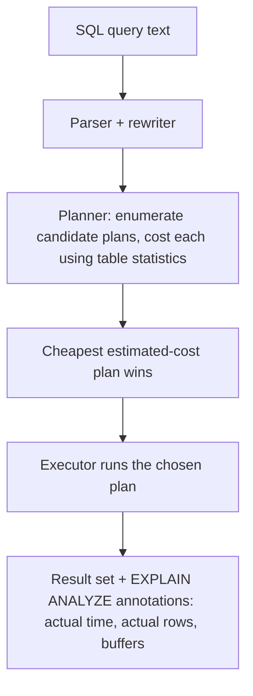
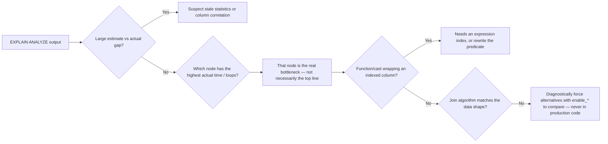

# Query Planning and EXPLAIN ANALYZE

> **Topic register:** T-610 · IWI 7.90 (#15 of 198) · Advanced tier · High interview frequency [H]
> **Prerequisite:** [Database Index Structures](index-structures-btree-composite-covering.md) (T-609) — reading a plan requires already knowing what an index does and what it costs.
> **Provenance:** all three scenarios in this chapter are real, executed PostgreSQL 16 output from a disposable Docker container, seeded with the same 300,000-row `orders` / 5,000-row `customers` schema used in T-609. Reproducible source: [`practice/sql/week-02/query-plan-lab.sql`](../../practice/sql/week-02/query-plan-lab.sql), full output in [`query-plan-lab-output.txt`](../../practice/sql/week-02/query-plan-lab-output.txt). Nothing below is illustrative.

## Table of Contents

1. [Learning Objectives](#learning-objectives)
2. [Why This Matters in Interviews](#why-this-matters-in-interviews)
3. [Mental Model](#mental-model)
4. [Definition and Purpose](#definition-and-purpose)
5. [Historical Context](#historical-context)
6. [Core Concepts](#core-concepts)
7. [Internal Implementation](#internal-implementation)
8. [Execution Flow](#execution-flow)
9. [Diagrams](#diagrams)
10. [Java Examples](#java-examples)
11. [Production Scenarios](#production-scenarios)
12. [Failure Modes and Debugging](#failure-modes-and-debugging)
13. [Trade-offs](#trade-offs)
14. [Performance Implications](#performance-implications)
15. [Memory Implications](#memory-implications)
16. [Concurrency Implications](#concurrency-implications)
17. [Security Implications](#security-implications)
18. [Decision Framework](#decision-framework)
19. [Comparisons](#comparisons)
20. [Common Mistakes](#common-mistakes)
21. [Anti-Patterns](#anti-patterns)
22. [Best Practices](#best-practices)
23. [Interview Answer Framework](#interview-answer-framework)
24. [Interview Questions](#interview-questions)
25. [Summary](#summary)
26. [Key Takeaways](#key-takeaways)
27. [Cheat Sheet](#cheat-sheet)
28. [Flashcards](#flashcards)
29. [Practice Exercises](#practice-exercises)
30. [Solutions](#solutions)
31. [Additional Reading](#additional-reading)
32. [Official References](#official-references)

---

## Learning Objectives

By the end of this chapter you can:

- Read `EXPLAIN (ANALYZE, BUFFERS)` output well enough to identify the node where cost actually concentrates, not just the largest number on the page.
- Explain why a large gap between estimated and actual row counts is itself a diagnosis, and what to do about it.
- State when the planner picks a nested loop, a hash join, or a merge join — in the planner's own cost terms, not folklore.
- Recognize a function- or cast-wrapped predicate as an index killer before running anything.
- Predict, from a plan's shape, whether a proposed fix will actually move the needle — before spending engineering time on it.

## Why This Matters in Interviews

"The query is slow" is a symptom, not a diagnosis — and the plan is the only place the actual mechanism is visible. This is High-frequency across backend and database rounds precisely because it's unusually verifiable: an interviewer can hand you a real plan and a real number, and there is a right answer. It is also the topic where candidates who "know indexes" but have never diagnosed a live query fall apart — reciting "add an index" without being able to say *which* structural problem the plan reveals reads as memorized, not operated. This chapter's own dataset produced one honest, unglamorous result specifically because most study material only shows the dramatic wins, and a Staff-level candidate is expected to distinguish the two before promising a fix will help.

## Mental Model

**A query plan is a bet, and `ANALYZE` is the only way to see if the bet paid off.** The planner enumerates several structurally different ways to execute the same SQL — different scan types, different join algorithms, different join orders — assigns each an estimated cost from table statistics, and executes the cheapest one it can find. `EXPLAIN` alone shows you the bet; `EXPLAIN ANALYZE` shows you the bet *and* what actually happened when it was placed. The single most important habit this chapter teaches: never trust the estimate alone, and never predict a fix's payoff without checking which part of the plan actually dominates the measured time.

## Definition and Purpose

`EXPLAIN` displays the execution plan PostgreSQL's query optimizer selected for a given SQL statement — a tree of physical operations (scans, joins, aggregates), each annotated with the planner's estimated cost, row count, and width. `EXPLAIN ANALYZE` goes further: it actually **executes** the query and augments every node with real elapsed time and real row counts, which is what turns a plan from descriptive into diagnosable. It exists because SQL is declarative — the same statement can be executed a dozen structurally different ways, all producing identical results at wildly different speeds, and the plan is the only artifact that exposes which one actually ran.

## Historical Context

PostgreSQL's optimizer is a **cost-based optimizer**, a lineage tracing to System R (IBM, 1970s) — the first relational system to demonstrate that a query optimizer could choose among semantically-equivalent execution strategies by estimating I/O and CPU cost rather than relying on fixed, rule-based heuristics. This choice is why the same query can produce a different plan on two databases with identical schemas but different data distributions: the plan is a function of the *statistics*, not just the SQL text. `EXPLAIN`'s `ANALYZE` and `BUFFERS` options were added specifically because estimated cost, while sufficient for the planner's own internal decision-making, is not sufficient for a human diagnosing a real production query — you need to know what the plan predicted **and** what actually happened, side by side.

## Core Concepts

### Estimate vs. actual

Every `EXPLAIN ANALYZE` node reports both `rows=` (the planner's pre-execution estimate) and `actual rows=` (the measured count). A small gap is normal noise. A **large** gap — an order of magnitude or more — means the planner's statistics don't reflect reality, either because they're stale (no recent `ANALYZE`) or because they can't model a correlation between columns (per-column statistics, by default, assume independence). This single number is frequently the entire diagnosis.

### Scan types

Sequential scan (read every page), index scan (walk the index, fetch each matching heap page individually), bitmap heap scan (walk the index to build a bitmap of matching pages, then visit the heap pages in physical order — better than a plain index scan when many scattered matches exist), and index-only scan (covering index, no heap visit at all — see T-609).

### Join algorithms

| Algorithm | Wins when | Cost shape |
|---|---|---|
| **Nested loop** | One side is small, or a highly selective index lookup exists per outer row | `O(outer rows × cost of inner lookup)` — cheap if the inner lookup is `O(log n)` via an index |
| **Hash join** | Neither side is small enough for a cheap nested loop; equality condition | Build a hash table over the smaller side once, `O(n + m)` total |
| **Merge join** | Both sides are already sorted (or cheaply sortable) on the join key | `O(n log n + m log m)` for the sorts, `O(n + m)` for the merge itself |

### Function-wrapped predicates defeat plain indexes

A plain B-Tree index on `status` has no entry for `UPPER(status)` — it indexes raw values, not a function's output. Wrapping an indexed column in a function or cast at query time silently defeats the index regardless of the column's selectivity; this is a distinct mechanism from low selectivity or stale statistics (see [§ Index Structures, Core Concepts](index-structures-btree-composite-covering.md#core-concepts)), and it is the mechanism most often introduced unintentionally by ORM-generated SQL.

## Internal Implementation

### Scenario 1 — a missing index with a modest, honestly-reported payoff

Joining 5,000 customers to 300,000 orders, filtered by region, with no index on `orders.customer_id` or `customers.region`:

```sql
EXPLAIN (ANALYZE, BUFFERS)
SELECT c.id, COUNT(o.id) FROM customers c
JOIN orders o ON o.customer_id = c.id
WHERE c.region = 'eu' GROUP BY c.id;
```
```
 ->  Hash Join (actual time=0.270..13.813 rows=37500 loops=2)
       ->  Parallel Seq Scan on orders o (actual time=0.003..6.105 rows=150000 loops=2)
       ->  Hash
             ->  Seq Scan on customers c (actual time=0.004..0.191 rows=1250 loops=2)
                   Filter: (region = 'eu'::text)
 Execution Time: 18.446 ms
```

After `CREATE INDEX idx_orders_customer_id ON orders(customer_id); CREATE INDEX idx_customers_region ON customers(region);`:

```
 ->  Hash Join (actual time=0.153..14.029 rows=37500 loops=2)
       ->  Parallel Seq Scan on orders o (actual time=0.002..6.297 rows=150000 loops=2)
       ->  Hash
             ->  Bitmap Heap Scan on customers c (actual time=0.019..0.088 rows=1250 loops=2)
                   ->  Bitmap Index Scan on idx_customers_region
 Execution Time: 18.074 ms
```

**18.446ms → 18.074ms — real, but modest.** The query still touches all 300,000 `orders` rows regardless of the new customer-side index, because nothing filters `orders` itself — the hash join reads the entire table as its probe side either way. The customer-side index sped up building the (already small) hash table, which was never the bottleneck. **This is the chapter's central lesson:** the "obviously missing index" doesn't always produce a dramatic win. Identify which side of the plan actually dominates cost before predicting the payoff — this scenario is included deliberately, alongside two dramatic ones, so the lesson isn't lost in a sea of impressive numbers.

### Scenario 2 — a function wrapped around an indexed column defeats the index

Filtering with `UPPER(status) = 'REFUNDED'` even though a plain index exists on `status`:

```sql
EXPLAIN (ANALYZE, BUFFERS) SELECT * FROM orders WHERE UPPER(status) = 'REFUNDED';
```
```
 Gather (actual time=0.090..20.613 rows=49635 loops=1)
   ->  Parallel Seq Scan on orders (actual time=0.024..18.575 rows=24818 loops=2)
         Filter: (upper(status) = 'REFUNDED'::text)
         Rows Removed by Filter: 125182
 Execution Time: 21.614 ms
```

Fix: `CREATE INDEX idx_orders_status_upper ON orders(UPPER(status));` — an expression index built from the function's *result*.

```
 Bitmap Heap Scan on orders (actual time=0.806..4.850 rows=49635 loops=1)
   Recheck Cond: (upper(status) = 'REFUNDED'::text)
   ->  Bitmap Index Scan on idx_orders_status_upper
         Index Cond: (upper(status) = 'REFUNDED'::text)
 Execution Time: 5.805 ms
```

**21.614ms → 5.805ms, ~3.7×.** The fix could equally have been "don't wrap the column in a function" — normalize case at write time and query `status = 'REFUNDED'` directly. The expression index is the right call specifically when the application can't control how the predicate is written (an ORM, or multiple independent call sites).

### Scenario 3 — nested loop vs. hash join, forced vs. free planner choice

Aggregating average order amount by customer region. Forced nested loop (`SET enable_hashjoin = off; SET enable_mergejoin = off;` — a diagnostic override, never a production setting):

```
 ->  Nested Loop (actual time=0.008..32.484 rows=150000 loops=2)
       ->  Parallel Seq Scan on orders o (actual time=0.002..5.878 rows=150000 loops=2)
       ->  Memoize
             Cache Key: o.customer_id
             Hits: 148741  Misses: 5000
             ->  Index Scan using customers_pkey on customers c (actual time=0.000..0.000 rows=1 loops=10000)
 Execution Time: 47.811 ms
```

The planner's free choice (no restrictions):

```
 ->  Hash Join (actual time=0.538..19.539 rows=150000 loops=2)
       ->  Parallel Seq Scan on orders o (actual time=0.003..5.881 rows=150000 loops=2)
       ->  Hash
             ->  Seq Scan on customers c (actual time=0.003..0.236 rows=5000 loops=2)
 Execution Time: 35.048 ms
```

**47.811ms → 35.048ms.** Even with PostgreSQL's `Memoize` operator softening the nested loop's repeated-lookup cost (148,741 cache hits out of 300,000 outer rows), a hash join that builds one in-memory table over all 5,000 customers and probes it once per order still wins at this join cardinality. Nested loops win instead when one side is genuinely small **and** the inner lookup is cheaply indexed with low repetition.

## Execution Flow



The step candidates most often skip narrating: the planner's cost model runs **before** anything executes, entirely from statistics (row counts, most-common values, histograms) maintained by `ANALYZE` — never from a live sample of the current query. Stale statistics corrupt every downstream decision without producing any error; the plan simply looks confident and is wrong.

## Diagrams



## Java Examples

Query-plan literacy is exercised from application code primarily through JPA/Hibernate query derivation, where a seemingly harmless method signature can generate a plan-defeating predicate. This example logs and asserts on the generated SQL shape before it ever reaches production.

```java
// Java 21. Demonstrates catching a plan-relevant regression via a generated-SQL assertion,
// the same category of check recommended in the Production Scenario below.

@SpringBootTest
class OrderQueryPlanRegressionTest {

    @Autowired
    private JdbcTemplate jdbcTemplate;

    @Test
    void statusFilterRemainsIndexable() {
        // Fails loudly if a future change (ORM upgrade, refactor) wraps `status`
        // in a function/cast, silently defeating idx_orders_status (Scenario 2).
        String plan = jdbcTemplate.queryForList(
            "EXPLAIN (FORMAT TEXT) SELECT * FROM orders WHERE status = ?",
            String.class, "refunded"
        ).toString();

        assertThat(plan)
            .as("a plain equality filter on `status` must be able to use idx_orders_status")
            .containsAnyOf("Bitmap Index Scan", "Index Scan")
            .doesNotContain("Seq Scan");
    }

    @Test
    void regionJoinDoesNotRegressToNestedLoopUnexpectedly() {
        // Guards against Scenario 3's forced-nested-loop pathology reappearing
        // due to a statistics change or a planner-setting regression in config.
        String plan = jdbcTemplate.queryForList(
            "EXPLAIN (FORMAT TEXT) " +
            "SELECT c.id, COUNT(o.id) FROM customers c " +
            "JOIN orders o ON o.customer_id = c.id WHERE c.region = ? GROUP BY c.id",
            String.class, "eu"
        ).toString();

        assertThat(plan).contains("Hash Join");
    }
}
```

**Complexity note:** these are `O(1)` application-layer assertions; the value they provide is catching a plan *shape* regression in CI, before it becomes a production `pg_stat_statements` alert — the same failure category as the Production Scenario below.

## Production Scenarios

### Scenario: a dashboard query regresses after a "harmless" filter is added

**Context.** A reporting dashboard adds a new optional `region` filter to an existing, previously fast orders-summary endpoint. No index changes ship with it.

**Symptoms.** The endpoint's p95 latency triples specifically when the new filter is applied; unfiltered requests are unaffected.

**Impact.** The dashboard is used by ops during incident response; a slow dashboard during an incident compounds the incident.

**Initial hypotheses.** A missing index on the new filter column (plausible); the join order changed because of the new predicate (plausible); connection pool contention (ruled out — pool metrics flat).

**Evidence.** `EXPLAIN ANALYZE` on the filtered query shows a hash join with `customers` — filtered by `region` — as the **build** side, and the planner's row estimate for the filtered `customers` set is far higher than the actual count.

**Investigation timeline.** Confirmed via `pg_stat_statements` that the filtered query variant appeared only after the release; reproduced locally with `EXPLAIN ANALYZE`; found no index on `customers.region` at all, exactly Scenario 1's missing-index case, but on a table where the new predicate is *far* more selective than the "eu region" example in this chapter (2% of customers, not 25%) — so the payoff here is dramatic, not modest, precisely because the underlying selectivity differs.

**Root cause.** Missing index on a newly-added, highly selective filter column, compounded by no statistics yet reflecting the new query shape's frequency.

**Immediate mitigation.** `CREATE INDEX CONCURRENTLY idx_customers_region ON customers(region);`, followed by `ANALYZE customers;`.

**Permanent fix.** Add the index as a tracked migration, and add an `EXPLAIN`-plan regression test (as in the Java example above) for the dashboard's top query variants, so a future added filter without a matching index fails CI instead of production.

**Alternatives considered.** Materializing the dashboard's aggregate into a summary table refreshed on a schedule — rejected for this endpoint because near-real-time freshness is a stated requirement.

**Trade-offs.** The new index adds write-path cost to `customers` inserts/updates, accepted given `customers` is a low-write-volume table relative to `orders`.

**Prevention.** Any new filter added to an existing hot-path query should be treated as a new query shape requiring its own `EXPLAIN ANALYZE` check, not an incremental tweak to an already-verified plan — this is precisely why Scenario 1 in this chapter reports a *modest* result: not every "obvious" index pays off the same way, and the only way to know is to measure the specific shape in question.

**Interview lesson.** This is T-610 arriving as a real incident: the diagnosis required identifying which side of the plan the new predicate touched, not just noticing "there's a WHERE clause on an unindexed column."

## Failure Modes and Debugging

| Symptom in `EXPLAIN ANALYZE` | Likely cause | Debugging step |
|---|---|---|
| `rows=1000` vs `actual rows=48000` | Stale statistics, or a correlation between columns the per-column stats can't model | Run `ANALYZE`; if the mismatch persists, consider `CREATE STATISTICS` on the correlated columns |
| Query still slow after adding "the obvious" index | The added index wasn't on the side of the plan that actually dominates cost | Identify the highest actual-time, highest-loop-count node first, then check whether the new index touches it |
| Sequential scan despite a plain index existing on the filtered column | Function/cast wraps the column, defeating the plain index | Check for `UPPER()`, `CAST`, or similar wrapping in the filter predicate |
| Nested loop chosen where a hash join seems obviously better (or vice versa) | Statistics misjudge one side's size/selectivity, or a planner setting (e.g., `work_mem`) constrains the hash table | Compare `EXPLAIN ANALYZE` under `SET enable_hashjoin = off` **as a diagnostic only** to see what the alternative would have cost |
| Plan looks fine in staging, terrible in production | Data volume or distribution differs materially between environments | Never trust a staging-only `EXPLAIN ANALYZE` for a production capacity decision; re-verify against production-representative volume |

## Trade-offs

| Approach | Benefit | Cost |
|---|---|---|
| Trust the planner's free choice | Correct in the overwhelming majority of cases; no manual tuning burden | Occasionally wrong under stale statistics or unusual data skew |
| Forcing a join strategy (`SET enable_*`) | Useful for diagnosis — proves what the planner would otherwise choose | Never appropriate in production application code; it's a debugging tool, not a tuning lever |
| Expression indexes for function-wrapped predicates | Makes an otherwise-unindexable predicate indexable | One more index to maintain on every write |
| Adding an index reactively per slow-query report | Fast to ship | Risks the Scenario 1 trap — shipping an index that doesn't touch the actual bottleneck, without ever measuring |

## Performance Implications

Query-plan literacy is the mechanism that turns "the database is slow" into a specific, falsifiable claim. This chapter's own three scenarios span a ~1.02× (Scenario 1, honest and modest), ~3.7× (Scenario 2), and ~1.4× (Scenario 3) improvement — a deliberately unglamorous range compared to T-609's ~52× point-lookup win, because most real production query tuning looks like this chapter's numbers, not a textbook's. A Staff-level engineer's value here is predicting, from the plan shape alone, which of these ranges a proposed fix will land in — before spending the engineering time.

## Memory Implications

Hash joins build an in-memory hash table over the smaller input side, bounded by `work_mem`; when the build side doesn't fit, PostgreSQL spills to disk-based batches, which shows up in `EXPLAIN ANALYZE` as `Batches: N` (N > 1) and a corresponding jump in execution time. This is a direct, measurable connection between a configuration setting (`work_mem`) and which join algorithm is even viable at a given data size — a query that gets a fast in-memory hash join in one environment can spill to disk in another with a lower `work_mem` setting, and the plan will show it if `ANALYZE` is used.

## Concurrency Implications

`EXPLAIN ANALYZE` **executes** the query, including any writes if the statement is a `DELETE`/`UPDATE`/`INSERT` — running it carelessly against production data is itself a hazard; wrap it in an explicit transaction with a rollback, or restrict its use to read-only statements in production. Separately, plan choice interacts with concurrency indirectly: a plan that holds a snapshot for a long-running scan (e.g., a large sequential scan under `REPEATABLE READ` or `SERIALIZABLE`) extends how long that transaction's snapshot must be preserved, which delays vacuum's ability to reclaim dead tuples — the connective link to isolation levels (T-611) and MVCC (T-612).

## Security Implications

Because `EXPLAIN` reveals the query's actual execution strategy including table and column names, sharing raw `EXPLAIN ANALYZE` output outside a trusted engineering context can leak schema and data-distribution information (e.g., approximate row counts, value skew via row estimates) that a stricter data-handling policy might not want exposed. Separately, never run `EXPLAIN ANALYZE` on a statement built by unsanitized string concatenation from user input during live debugging — parameterize exactly as you would the underlying query, since `EXPLAIN ANALYZE` executes the statement it's given.

## Decision Framework

Use this sequence when a query is reported slow:

1. **Get the real plan.** `EXPLAIN (ANALYZE, BUFFERS)` against production-representative data — never a guess, never a staging table with 1% of the row count.
2. **Check estimate vs. actual first.** A large gap redirects the entire investigation toward statistics/correlation before anything else.
3. **Find the node that actually dominates time**, not the top line or the largest raw number — usually the deepest, most-looped node.
4. **Classify the mechanism**: missing/unused index, function-wrapped predicate, suboptimal join algorithm choice, or stale statistics. These are distinct and require different fixes.
5. **Predict the fix's payoff before applying it**, using the dominant-node analysis from step 3 — Scenario 1 in this chapter exists precisely because "add the obvious index" doesn't always mean "dramatic win."
6. **Verify with `EXPLAIN ANALYZE` again after the fix**, comparing the same metric (execution time, buffers) rather than eyeballing wall-clock time.

## Comparisons

| Tool/technique | What it shows | When to reach for it |
|---|---|---|
| `EXPLAIN` (no `ANALYZE`) | Estimated plan and cost only, does not execute | Safe against production write statements; useful for a quick shape check |
| `EXPLAIN ANALYZE` | Estimated **and** actual plan, time, and row counts — executes the query | Default choice for any real diagnosis; add `BUFFERS` for I/O visibility |
| `pg_stat_statements` | Aggregate execution statistics across many calls of normalized query shapes | Finding *which* queries to investigate in the first place, before drilling into one with `EXPLAIN ANALYZE` |
| `SET enable_hashjoin = off` (and similar) | Forces the planner away from one strategy, revealing the cost of the alternative | Diagnostic comparison only — confirming a suspicion about *why* the planner chose what it chose, never a production setting |

## Common Mistakes

- Reading only the top line of a plan and missing where the actual cost concentrates — usually the deepest, most-looped node, not the outermost one.
- Assuming an added index will help without first checking which side of the join or filter actually dominates measured cost (Scenario 1's honest lesson).
- Treating `EXPLAIN` (without `ANALYZE`) as sufficient for diagnosis — estimates alone can't reveal a stale-statistics or correlation problem.
- Using `SET enable_hashjoin = off`-style overrides as a production fix rather than a diagnostic-only comparison tool.
- Assuming a staging-environment plan predicts production behavior when data volume or distribution differs.

## Anti-Patterns

- **Index-and-pray tuning**: adding an index in response to a slow-query report without first running `EXPLAIN ANALYZE` to confirm the index would even be used, or which node it would help.
- **Trusting `EXPLAIN` without `ANALYZE`** as if the estimated plan were the actual one — this misses every stale-statistics and correlation problem entirely.
- **Shipping a planner-hint override (`enable_*`) to production** to "fix" a specific query, rather than fixing the underlying statistics, index, or predicate shape that caused the planner to choose poorly.
- **Benchmarking by wall-clock feel** ("it seems faster now") instead of comparing `EXPLAIN ANALYZE` execution time before and after a change.

## Best Practices

- Always pair `ANALYZE` with `BUFFERS` when diagnosing I/O-bound queries; timing alone can hide a cache-warm effect from a repeated run.
- Use `pg_stat_statements` to find *which* queries deserve `EXPLAIN ANALYZE` attention, rather than guessing from anecdote.
- Re-run `ANALYZE` on affected tables after any bulk load, migration, or major data-distribution shift before trusting a plan.
- Treat every newly added filter or join on an existing hot-path query as a new query shape requiring its own plan verification — not an incremental tweak assumed safe.
- Reserve `SET enable_*` planner overrides strictly for diagnostic comparison, documented as such, never committed as application configuration.
- Add `EXPLAIN`-plan assertions to CI for a system's known hot-path queries, so dependency or ORM upgrades that silently change generated SQL are caught before production.

## Interview Answer Framework

### 30-Second Answer

`EXPLAIN` shows the plan the optimizer chose; `EXPLAIN ANALYZE` actually runs it and adds real timings and row counts, which is what makes a plan diagnosable instead of merely descriptive. The two things that matter most: find the node where cost actually concentrates, and check whether the estimated row count matches the actual — a big gap means stale statistics.

### 2-Minute Answer

Definition: `EXPLAIN` is the optimizer's chosen tree of physical operations with estimated costs; `EXPLAIN ANALYZE` executes the query and adds actual timing and row counts per node. Why it exists: SQL is declarative, so the same statement can run a dozen structurally different ways at wildly different speeds — the plan is the only place that's visible. How it works: the planner enumerates candidate plans (different scan types, join algorithms, join orders) and picks the cheapest by its own cost model, built from table statistics maintained by `ANALYZE`. One important trade-off: trusting the planner's free choice is right the overwhelming majority of the time, but forcing a strategy via `SET enable_*` is a diagnostic tool only, never a production setting. Production example: a "missing index" fix that measured only an 18.4ms→18.1ms improvement, because the new index didn't touch the plan's actual bottleneck — proof that not every obvious-looking fix pays off the way it's expected to.

### 10-Minute Deep Dive

Cover, in order: the estimate-vs-actual gap as the single most valuable diagnostic signal (internals); the three join algorithms and the cost shape that determines which one wins (internals); Scenario 1's honest, modest result and why "add the missing index" isn't always the win it sounds like (edge case); Scenario 2's function-wrapped predicate defeating an existing index, fixed with an expression index (failure mode + fix); Scenario 3's forced-vs-free join comparison, including the `Memoize` operator softening a nested loop's repeated-lookup cost (edge case); and close with the production scenario in this chapter — a dashboard filter regression diagnosed via `pg_stat_statements` plus `EXPLAIN ANALYZE`, distinguishing it from Scenario 1 specifically because the new filter's *selectivity* differed enough to make the fix dramatic rather than modest.

### Whiteboard Explanation

Draw the [§ Execution Flow](#execution-flow) pipeline first: SQL → Parser → Planner (candidate plans, cost each) → cheapest wins → Executor → annotated result. Then draw one plan as a small tree (2–3 nodes) and, next to each node, write two numbers stacked: estimated rows on top, actual rows below — leave a visible gap between them on at least one node, and narrate that gap as the entry point into diagnosis. This visually anchors "the gap is the diagnosis" rather than making it an assertion the interviewer has to take on faith.

### Production Example

The dashboard-filter regression in [§ Production Scenarios](#production-scenarios): a newly added `region` filter tripled p95 latency because no index existed on the highly selective new column; diagnosed via `pg_stat_statements` plus `EXPLAIN ANALYZE`, fixed with `CREATE INDEX CONCURRENTLY`, and prevented going forward by treating every new filter on a hot-path query as a new query shape requiring its own plan check.

### Trade-offs to Mention

State unprompted: the planner is right the overwhelming majority of the time, so tuning should start from measurement, not suspicion; forcing a join strategy is diagnostic-only; not every "obviously missing" index produces a dramatic win, and predicting which it'll be requires identifying the dominant plan node first.

### Common Candidate Mistakes

Reading only the top line of a plan; treating `EXPLAIN` (without `ANALYZE`) as sufficient; assuming any added index helps without checking which side of the plan it touches; naming only one of the three reasons a plan can defeat an index (low selectivity, stale statistics, function/cast wrapping — see T-609 §9 Q6, the query-planning half of the same fact); claiming one join algorithm is "always faster."

### Typical Follow-Up Questions

1. "`rows=1000` vs `actual rows=48000` — what's that telling you, and what would you do about it?"
2. "Why did the forced nested loop in Scenario 3 only cost 47ms instead of far more, given 300,000 outer rows?"
3. "You added an index and the query got slower — two distinct mechanisms?"
4. "Why did the planner ignore your index — three reasons?"
5. "You just found a function-wrapped predicate defeating an index. Two possible fixes?"
6. "This dashboard query is fine in staging and terrible in production. Why might that be, independent of the SQL itself?"

### Senior-Level Expectations

Reads `EXPLAIN ANALYZE` well enough to name the dominant node, not just the top line; states the join-algorithm decision table in the planner's own cost terms; identifies at least two of the three plan-defeating mechanisms (selectivity, stale statistics, function-wrapping) when prompted.

### Staff-Level Discussion

At Staff scope, query-plan literacy is what separates "the query is slow, add an index" from "the query is slow because of this specific mechanism, here's the fix, and here's what it costs on the write path." This chapter's three scenarios were deliberately chosen to include one modest, honestly-reported result alongside two dramatic ones: a Staff-level engineer predicts, from the plan shape, whether a proposed fix will actually move the needle **before** spending engineering time implementing it — and treats a newly-added filter or join on an existing hot-path query as a new, unverified query shape rather than an incremental, presumed-safe tweak.

## Interview Questions

### Question 1 — `rows=1000` vs `actual rows=48000`: what does the gap tell you?

**Why interviewers ask it.** Tests whether the candidate distinguishes an estimate from a measurement, and knows what to do with a large divergence between them.

**Expected answer.** The planner's row-count estimate is off by 48×, a strong signal of stale statistics or a correlation between columns the planner's single-column statistics can't model.

**Minimum acceptable answer.** Recognizes the two numbers mean different things (predicted vs. measured), even without naming the likely cause.

**Strong Senior answer.** Identifies the mismatch, states it likely means stale statistics, and proposes running `ANALYZE`.

**Staff-level extension.** Names extended statistics (`CREATE STATISTICS`) as the fix when the mismatch persists after `ANALYZE` because the issue is column *correlation*, not staleness — the deeper of the two possible causes.

**Common mistakes.** Treating the estimate as if it were measured; not noticing the mismatch at all.

**Likely follow-ups.** "What would you do about it?"

**Evaluation criteria (1–5).** 1: no distinction between estimate and actual. 3: notices the gap, proposes `ANALYZE`. 5: notices the gap, proposes `ANALYZE`, and names `CREATE STATISTICS` as the deeper fix when staleness alone doesn't explain it.

**Related references.** [§ Core Concepts](#core-concepts), estimate vs. actual; [§ Internal Implementation](#internal-implementation).

---

### Question 2 — Nested loop vs. hash join vs. merge join: when does the planner pick each?

**Why interviewers ask it.** Separates candidates who've memorized "hash joins are usually faster" from those who reason from the actual cost shapes.

**Expected answer.** The § Core Concepts table, in the planner's own cost terms — not just "small vs. big tables."

**Minimum acceptable answer.** States that join choice depends on table size and indexing, even without precise cost-shape language.

**Strong Senior answer.** States the general rule correctly for all three algorithms.

**Staff-level extension.** Names `Memoize` and its effect on nested-loop cost, as demonstrated live in Scenario 3 — explaining why a nested loop over 300,000 outer rows cost only 47ms rather than far more, because repeated lookups became cache hits rather than fresh index probes.

**Common mistakes.** Claiming one algorithm is "always faster" regardless of data shape.

**Likely follow-ups.** "Why did Scenario 3's nested loop only cost 47ms instead of far more, given 300,000 outer rows?"

**Evaluation criteria (1–5).** 1: no join-algorithm reasoning. 3: correct general rule for all three. 5: general rule plus the `Memoize` mechanism unprompted.

**Related references.** [§ Core Concepts](#core-concepts), join algorithms; [§ Internal Implementation](#internal-implementation), Scenario 3.

---

### Question 3 — You added an index and the query got slower. Two distinct mechanisms?

**Why interviewers ask it.** The query-planning half of the identical fact tested in T-609; most candidates name only one mechanism.

**Expected answer.** Write amplification (same as T-609), **and** stale statistics leading the planner to prefer a worse plan than it did before the index existed.

**Minimum acceptable answer.** Names one mechanism correctly.

**Strong Senior answer.** Names both.

**Staff-level extension.** Proposes `EXPLAIN ANALYZE` before/after as the confirming diagnostic rather than guessing which mechanism is at fault.

**Common mistakes.** Naming only write amplification.

**Likely follow-ups.** "How would you confirm which one it is, in a live system?"

**Evaluation criteria (1–5).** 1: one mechanism, no detection method. 3: both mechanisms. 5: both, plus a concrete before/after diagnostic.

**Related references.** [§ Failure Modes and Debugging](#failure-modes-and-debugging); [index-structures-btree-composite-covering.md § Interview Questions Q5](index-structures-btree-composite-covering.md#interview-questions).

---

### Question 4 — Why did the planner ignore your index? Three reasons.

**Why interviewers ask it.** Comprehensive, unprompted coverage of all three reasons demonstrates the cost-based-planner mental model is fully internalized, not partially recited.

**Expected answer.** Low selectivity; stale statistics; or a function/cast wrapped around the column with no matching expression index (Scenario 2).

**Minimum acceptable answer.** Names at least one reason.

**Strong Senior answer.** Names at least two of the three.

**Staff-level extension.** Names all three and proposes both fixes for the function-wrapping case — an expression index, or rewriting the predicate to avoid the wrap entirely — trading off which is appropriate depending on whether the application controls the predicate's origin.

**Common mistakes.** Forgetting the function-wrapping case specifically, the one most often introduced by ORM-generated SQL rather than hand-written queries.

**Likely follow-ups.** "You just found a function-wrapped predicate defeating an index. Two possible fixes?"

**Evaluation criteria (1–5).** 1: no reasons named. 3: two of three. 5: all three plus both function-wrapping fixes.

**Related references.** [§ Internal Implementation](#internal-implementation), Scenario 2; [index-structures-btree-composite-covering.md § Interview Questions Q6](index-structures-btree-composite-covering.md#interview-questions).

## Summary

`EXPLAIN ANALYZE` shows the actual plan, not just the estimated one, which is what turns "it's slow" into a diagnosable problem. This chapter's three real scenarios show a missing index with a modest, honestly-reported payoff; a function-wrapped predicate fixed by an expression index (~3.7×); and a forced nested loop versus the planner's free hash-join choice (~1.4×) — three genuinely different mechanisms, not one universal "just add an index" story. Reading a plan well means finding the node that actually dominates cost and checking the estimate-vs-actual gap before proposing any fix.

## Key Takeaways

- `EXPLAIN ANALYZE`, not `EXPLAIN` alone — estimates without actuals can't be diagnosed.
- A large estimate-vs-actual row mismatch signals stale statistics or under-modeled column correlation.
- Not every missing index produces a dramatic win — identify which side of the plan actually dominates cost first.
- A function or cast wrapped around an indexed column needs a matching expression index (or a rewritten predicate).
- `enable_hashjoin`/`enable_mergejoin` overrides are diagnostic tools only, never production configuration.
- The same "index made it slower" fact has two mechanisms: write amplification and stale statistics.

## Cheat Sheet

| Situation | What to check |
|---|---|
| Query reported slow | `EXPLAIN (ANALYZE, BUFFERS)` against production-representative data first — never guess |
| Estimate vs. actual differ by an order of magnitude | Run `ANALYZE`; if it persists, consider `CREATE STATISTICS` for correlated columns |
| Seq scan despite an index on the filtered column | Check for `UPPER()`/`CAST`/function-wrapping around the column |
| Index added, no measured improvement | Identify which node in the plan actually dominated cost before the change — the new index may not touch it |
| Suspect the planner picked the wrong join | Compare with `SET enable_hashjoin = off` / `enable_mergejoin = off` as a diagnostic only |
| Fast in staging, slow in production | Re-verify with production-representative data volume; never trust a small-table plan for a capacity decision |

## Flashcards

### Card: Most useful EXPLAIN flag combination

**Prompt:**
What's the single most useful `EXPLAIN` flag combination for diagnosing a slow query?

**Answer:**
`(ANALYZE, BUFFERS)` — real timings and real row counts, plus real I/O buffer counts.

**Why it matters:**
`EXPLAIN` alone shows only estimates; without `ANALYZE` a stale-statistics problem is invisible.

**Common trap:**
Reading `EXPLAIN` output without `ANALYZE` and treating the estimate as fact.

**Related:**
[Core Concepts](#core-concepts)

### Card: Estimate-vs-actual mismatch

**Prompt:**
What does a large gap between estimated and actual row counts in a plan usually mean?

**Answer:**
Stale statistics, or a correlation between columns the planner's per-column statistics can't capture.

**Why it matters:**
This single number is frequently the entire diagnosis for a misbehaving plan.

**Common trap:**
Not noticing the mismatch, or treating the estimate as measured.

**Related:**
[Internal Implementation](#internal-implementation)

### Card: Function-wrapped predicate

**Prompt:**
Why can't a plain index serve `WHERE UPPER(col) = ?`?

**Answer:**
The index is built on raw column values; it has no entry matching the function's output. Needs an expression index, or a rewritten predicate.

**Why it matters:**
The most common plan-defeating mistake introduced by ORM-generated SQL.

**Common trap:**
Assuming any index on the column helps, regardless of how the predicate is written.

**Related:**
[Internal Implementation](#internal-implementation), Scenario 2

### Card: Nested loop beating a hash join

**Prompt:**
When does a nested loop beat a hash join despite a large outer side?

**Answer:**
When the inner-side lookups are cheap (indexed) and repeated values let `Memoize` turn many of them into cache hits instead of fresh probes.

**Why it matters:**
Prevents the "hash joins are always faster" oversimplification.

**Common trap:**
Claiming one join algorithm is universally faster regardless of data shape.

**Related:**
[Internal Implementation](#internal-implementation), Scenario 3

## Practice Exercises

1. Reproduce all three scenarios yourself: [`practice/sql/week-02/query-plan-lab.sql`](../../practice/sql/week-02/query-plan-lab.sql).
2. Construct your own function-wrapped-predicate case against a table you control, confirm it defeats an existing index via `EXPLAIN ANALYZE`, then fix it with an expression index and re-verify.
3. Take a real slow query from a system you know, run `EXPLAIN ANALYZE`, and classify which of this chapter's mechanisms (missing index, function-wrapped predicate, suboptimal join choice, stale statistics) is actually responsible before proposing a fix.
4. Given a plan where `rows=200` but `actual rows=40000`, write out the two candidate causes and one concrete step to distinguish between them.

## Solutions

**Exercise 1.** Expected output matches this chapter's three scenarios exactly when run against the same seed data; if numbers differ meaningfully, check the seed script's row counts and distribution first, since the mechanism (not the exact millisecond values) is what's being verified.

**Exercise 2.** Expected before-plan: `Seq Scan` with a filter showing the function-wrapped predicate and a nonzero `Rows Removed by Filter`. Expected after-plan (with an expression index matching the function): `Bitmap Index Scan`/`Index Scan` on the new expression index, with a materially lower execution time.

**Exercise 3.** No single expected answer — complete when the candidate can point to the specific `EXPLAIN` line (a `Rows Removed by Filter`, an estimate-vs-actual gap, a `Seq Scan` node beneath a function-wrapped filter, or a join type mismatched to data shape) that justifies their classification.

**Exercise 4.** Two candidate causes: stale statistics (no `ANALYZE` since a significant data change) or under-modeled column correlation (the planner's independent per-column assumption breaks down for correlated predicates). One distinguishing step: run `ANALYZE` and re-check the estimate; if the gap persists, the cause is correlation, not staleness, and `CREATE STATISTICS` on the correlated columns is the next step.

## Additional Reading

- Markus Winand, *Use The Index, Luke*, Chapter 4, "The Join Operation"

## Official References

- PostgreSQL documentation, [Chapter 14.1, "Using EXPLAIN"](https://www.postgresql.org/docs/current/using-explain.html)
- PostgreSQL documentation, [Chapter 14.2, "Statistics Used by the Planner"](https://www.postgresql.org/docs/current/planner-stats.html)
