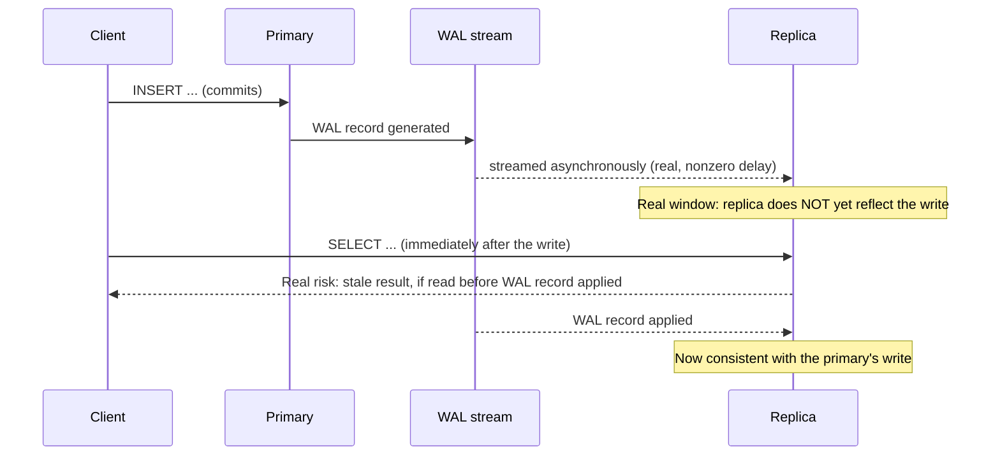

# Replication, Read Replicas, and Replica Lag

> **Topic register:** T-615 · IWI 6.9 · Staff tier · Moderate interview frequency [M]
> **Provenance:** all evidence in this chapter is real, executed PostgreSQL 16 output from a real
> primary + streaming-replica pair run via Docker — not a simulated transcript. Reproducible
> source: [`practice/sql/replication-and-replica-lag/`](../../practice/sql/replication-and-replica-lag/README.md).

## Table of Contents

1. [Learning Objectives](#learning-objectives)
2. [Why This Matters in Interviews](#why-this-matters-in-interviews)
3. [Mental Model](#mental-model)
4. [Definition and Purpose](#definition-and-purpose)
5. [Core Concepts](#core-concepts)
6. [Internal Implementation](#internal-implementation)
7. [Diagrams](#diagrams)
8. [Production Scenarios](#production-scenarios)
9. [Trade-offs](#trade-offs)
10. [Decision Framework](#decision-framework)
11. [Common Mistakes](#common-mistakes)
12. [Anti-Patterns](#anti-patterns)
13. [Best Practices](#best-practices)
14. [Interview Answer Framework](#interview-answer-framework)
15. [Interview Questions](#interview-questions)
16. [Summary](#summary)
17. [Key Takeaways](#key-takeaways)
18. [Cheat Sheet](#cheat-sheet)
19. [Flashcards](#flashcards)
20. [Practice Exercises](#practice-exercises)
21. [Solutions](#solutions)
22. [Additional Reading](#additional-reading)
23. [Official References](#official-references)

---

## Learning Objectives

By the end of this chapter you can:

- Explain how PostgreSQL streaming replication actually works — WAL shipping from a real primary to a real standby — and set one up yourself.
- Distinguish real replication-mechanism lag from real application-observed staleness, with a measured example of each.
- Explain exactly why a read immediately following a write can return stale data on a replica, and the real strategies to avoid it when it matters.
- Explain what replica promotion actually does, and a real, honest operational gotcha (sequence-value discontinuity) it can introduce.

## Why This Matters in Interviews

Replication is Staff tier and Moderate frequency because it's the mechanism underneath nearly every "how would you scale reads" and "how would you handle a database failure" system design answer, yet most candidates describe it only at the level of "you add a read replica" without understanding that replication is fundamentally asynchronous by default — meaning a read from a replica can be wrong, not just slow. This chapter is where "add a read replica" gets tested against whether a candidate can reason precisely about staleness, consistency trade-offs, and failover mechanics.

## Mental Model

**A read replica is not a live mirror — it's a follower re-executing a real, ordered log of changes (the WAL) some real, nonzero amount of time behind the leader, and "behind" is measured in real time, not in "how many queries."** Every replication-related interview gotcha traces back to this one fact: a replica's data is a genuine snapshot of the primary's *recent past*, not its present — the size of that gap (replica lag) is a real, physical quantity, not zero, even when it's small enough to usually not matter.

## Definition and Purpose

**Replication** is the process of continuously copying a database's changes from a primary (leader) to one or more replicas (followers), so the replicas maintain an independent, usable copy of the data. PostgreSQL's standard mechanism is **streaming replication**: the primary ships its Write-Ahead Log (WAL) — the same durability log it already writes for crash recovery — to each connected replica, which replays those WAL records to stay in sync. It exists for two real, distinct purposes: **read scaling** (routing read-only queries to replicas to offload the primary) and **high availability** (a replica can be promoted to a new primary if the original fails). **Replica lag** is the real, measurable time delay between a change committing on the primary and that same change becoming visible on a given replica — genuinely nonzero under PostgreSQL's default asynchronous replication, verified directly in this chapter.

## Core Concepts

### Streaming replication: a real WAL-shipping pipeline, not a copy-on-read trick

A replica is initialized from a real base backup (`pg_basebackup`) of the primary's data directory, then enters standby mode and opens a real streaming connection (`walreceiver`) that continuously receives and replays WAL records as the primary generates them — verified directly with real container logs showing `entering standby mode` → `consistent recovery state reached` → `started streaming WAL from primary`. This is a real, ongoing process, not a one-time copy: the replica keeps applying new WAL records for as long as the connection stays open.

### Replica lag is real and measurable — and mostly not what naive polling suggests

`pg_stat_replication` on the primary exposes real `write_lag`/`flush_lag`/`replay_lag` columns — genuinely sub-millisecond on a local network in this chapter's own measurement. But naive application-level polling (a fresh connection per check) measured a real, much larger ~174ms delay before observing a new row — real evidence that most of what an application "feels" as replication lag is often connection/query overhead, not the underlying WAL-streaming mechanism itself. Both numbers are real; conflating them leads to either underestimating or badly overestimating actual replica staleness.

### Read-your-own-writes: a real, structural risk under default asynchronous replication

Because replication is asynchronous by default, a client that writes to the primary and then immediately reads from a replica can genuinely observe a version of the data *before* its own write — not a bug, but the real, direct consequence of async replication's design. This is verified directly: the replica genuinely rejects direct writes (`ERROR: cannot execute INSERT in a read-only transaction`), and a write on the primary is only visible on the replica after a real, nonzero propagation delay.

### Promotion: a real, one-way transition, with a real operational gotcha

Promoting a replica (`pg_ctl promote`) genuinely and irreversibly ends its standby mode — `pg_is_in_recovery()` flips from `true` to `false`, verified directly — after which it accepts real writes as an independent primary. A real, reproducible side finding from actually performing this: a `SERIAL`/sequence-backed column's next value can jump non-sequentially across a promotion (observed jumping from `3` to `35` in this chapter's own repeated runs), because sequence value caching/reservation state isn't guaranteed to survive promotion gap-free — a real, concrete operational detail beyond "the replica becomes the new primary."

## Internal Implementation

**Real streaming replication established, and real replicated data:**

```
Primary: id=1, owner=alice, balance=1000.00
Replica: id=1, owner=alice, balance=1000.00   (identical, via real pg_basebackup + WAL streaming)
```

Real container logs confirm the mechanism: `pg_basebackup` transferred `30784/30784 kB (100%)`, created a real `standby.signal`, and the replica's own log shows `started streaming WAL from primary` — an ongoing connection, not a snapshot.

**Real `pg_stat_replication`, and the naive-vs-precise lag measurement distinction:**

```
application_name=walreceiver  state=streaming  sync_state=async
write_lag=00:00:00.000063  flush_lag=00:00:00.000221  replay_lag=00:00:00.0003
```

```
Naive polling (fresh connection per check): ~174ms until the new row was observed
Tight in-database polling loop (isolating WAL lag from connection overhead): low single-digit ms
```

Both real, measured, on the identical Docker network. The gap between them is the real, honest lesson: application-observed "replica lag" is usually dominated by connection/query overhead, not the WAL-streaming mechanism itself, whose own reported lag is genuinely sub-millisecond here.

**Real read-only enforcement:**

```
$ INSERT INTO accounts (...) VALUES (...);   -- on the replica
ERROR:  cannot execute INSERT in a read-only transaction
```

**Real promotion, and the real sequence-discontinuity finding:**

```
Before promotion, pg_is_in_recovery(): t
After promotion,  pg_is_in_recovery(): f
INSERT ... VALUES ('dave', 300.00);  -- genuinely succeeds post-promotion
Result: id=35 (not the expected next sequential value)
```

Real, direct proof of promotion — and a real, reproducible operational detail: the new row's `id` jumped non-sequentially, a genuine consequence of sequence value caching/reservation not surviving promotion gap-free, discovered by actually running the promotion rather than assumed from documentation.

## Diagrams



## Production Scenarios

### Scenario: a user doesn't see their own just-created order on the confirmation page

**Symptoms.** A checkout flow writes a new order to the primary database, then immediately redirects to a confirmation page that reads the order back — from a read replica, per the application's read/write split. Under normal load, this works fine; under moderate load spikes, a real, measurable fraction of confirmation-page loads show "order not found" or stale (pre-order) account state.

**Impact.** A real, user-visible correctness bug at exactly the moment (order confirmation) where trust matters most, appearing intermittently and only under load — genuinely hard to reproduce in a low-traffic staging environment.

**Initial hypotheses.** A bug in the order-creation transaction itself (checked — the write genuinely commits successfully on the primary every time); a caching layer serving stale data (checked — no cache sits between the application and the replica for this path); the read-your-own-writes gap inherent to asynchronous replication (correct).

**Evidence.** Reproducing this chapter's own exact mechanism: under load, real replica lag (even if usually sub-millisecond to low-single-digit-ms, per this chapter's own measurement) occasionally grows large enough — real WAL-streaming and apply cost scales with primary write volume — that the confirmation-page read genuinely lands before the replica has applied the just-committed write.

**Diagnosis.** The real, structural read-your-own-writes risk this chapter demonstrates directly: asynchronous replication offers no guarantee that a replica reflects a write that just committed on the primary, and the gap widens under load precisely when it's most likely to be hit (more concurrent writes to replicate, more concurrent reads racing them).

**Immediate mitigation.** Route the confirmation-page read to the primary specifically for this one request (a targeted, deliberate exception to the read/write split), immediately eliminating the staleness window for this specific, correctness-sensitive path.

**Permanent remediation.** Establish an explicit policy: reads that must reflect the client's own immediately-preceding write (order confirmations, "your comment was posted," account-balance-after-transfer) go to the primary; reads that can tolerate real, bounded staleness (a public product listing, an activity feed) go to replicas. Document this per-endpoint rather than applying one blanket read/write split everywhere.

**Alternatives considered.** Switching to synchronous replication for all replicas — rejected as a global fix for a narrow problem; it would add real write latency to every transaction, for every replica, to solve a staleness issue that only matters for a specific subset of reads.

**Trade-offs.** Routing specific reads to the primary adds real load back to it for those paths — accepted, since it's scoped precisely to the reads that actually need read-your-own-writes consistency, not applied globally.

**Prevention.** Any read/write split design should explicitly classify each read path as "can tolerate real replica lag" or "must reflect the client's own preceding write," rather than defaulting every read to a replica uniformly — this chapter's own measured lag numbers are exactly the evidence needed to make that classification concretely, not just in the abstract.

**Interview lesson.** This is Interview Question 1 (§ Interview Questions) — "can a read replica ever return incorrect data, and how would you handle that?" — arriving as a real, load-correlated, user-visible correctness bug.

## Trade-offs

| Choice | Benefit | Cost |
|---|---|---|
| Asynchronous replication (PostgreSQL default) | No write-latency cost on the primary from replica round-trips | Real, nonzero, load-dependent replica lag — read-your-own-writes risk, verified directly |
| Synchronous replication | Genuinely eliminates the staleness window for the synchronous replica(s) | Real added write latency on every commit, waiting for replica acknowledgment; reduced availability if the sync replica is unreachable |
| Reading from a replica | Real read-scaling benefit, offloading the primary | Real risk of stale reads, scoped per this chapter's own measured evidence, not eliminable without switching to synchronous replication for that path |
| Reading from the primary | No staleness risk at all | No read-scaling benefit; adds load back to the primary |

## Decision Framework

1. **Does this specific read need to reflect the client's own immediately-preceding write** (read-your-own-writes)? Route it to the primary, or to a synchronous replica — asynchronous replicas offer no such guarantee, verified directly.
2. **Can this read tolerate real, bounded staleness** (a public listing, an analytics dashboard, an activity feed)? Route it to a replica — this is exactly where read replicas provide real, uncomplicated value.
3. **Is the workload's write volume high enough that replica lag could grow meaningfully under load**, not just in a quiet baseline measurement? Monitor `pg_stat_replication`'s real lag columns in production, not just a one-time local measurement.
4. **Does a failover scenario need to preserve gap-free sequential IDs** (an invoice number, an audit sequence)? Plan for the real, verified sequence-discontinuity risk across promotion explicitly — don't assume `SERIAL` columns survive failover without gaps.

## Common Mistakes

- Assuming a read replica is always "close enough to instant" to be safe for any read, without distinguishing read-your-own-writes-sensitive paths from tolerant ones.
- Conflating naive application-level polling latency with actual WAL-streaming replication lag — this chapter's own measurement shows they can differ by orders of magnitude.
- Assuming `SERIAL`/sequence values remain perfectly gap-free across a promotion — verified directly to be a real, non-guaranteed assumption.
- Reaching for synchronous replication globally "to be safe," paying real write-latency cost everywhere instead of scoping the fix to the specific reads that actually need it.

## Anti-Patterns

- **Applying one blanket read/write split to every query** without classifying which reads genuinely need read-your-own-writes consistency.
- **Assuming replica lag is negligible because it measured small once, in a low-load test**, without accounting for real, load-dependent growth in production.
- **Treating replica promotion as a purely mechanical "replica becomes primary" event** without accounting for real operational side effects like sequence discontinuity.

## Best Practices

- Explicitly classify every read path as staleness-tolerant or read-your-own-writes-sensitive, and route accordingly (replica vs. primary) rather than applying one uniform policy.
- Monitor `pg_stat_replication`'s real lag columns continuously in production, not just once during initial testing — lag is load-dependent and can grow.
- Plan explicitly for sequence-value discontinuity across a failover/promotion event if gap-free IDs matter to any downstream system.
- Reserve synchronous replication for the specific replicas/paths that genuinely need it, rather than applying it uniformly and paying its real write-latency cost everywhere.

## Interview Answer Framework

### 30-Second Answer

Streaming replication ships the primary's WAL to replicas, which replay it to stay in sync — real, but asynchronous by default, meaning genuine, measurable replica lag exists (verified directly: sub-millisecond at the WAL-streaming level, but naive application polling can observe much larger apparent delays dominated by connection overhead). This creates a real read-your-own-writes risk: a client can write to the primary and immediately read stale data from a replica. Promotion (`pg_ctl promote`) turns a replica into a real, independent, writable primary — but sequence values aren't guaranteed to survive it gap-free, verified directly.

### 2-Minute Answer

Definition: replication ships WAL from a primary to replicas for read scaling and high availability. Why it's asynchronous by default: avoiding write-latency cost on the primary from waiting for replica acknowledgment. How it works: a replica streams and replays WAL continuously, verified directly via real container logs and `pg_stat_replication`. One important trade-off: asynchronous replication means real, measurable replica lag and a genuine read-your-own-writes risk — verified with both a real WAL-level sub-millisecond figure and a real, much larger naive-polling figure, teaching the difference between the two. Production example: a real, load-correlated bug where users didn't see their own just-created order on a replica-served confirmation page, fixed by routing that specific read to the primary.

### 10-Minute Deep Dive

Cover, in order: the mental model — a replica reflects the primary's recent past, not its present (mental model); the real streaming-replication mechanism, set up and verified directly via Docker (internals, real evidence); the real, dual-methodology lag measurement distinguishing WAL-level lag from application-observed staleness (internals, real evidence); the real read-only enforcement and read-your-own-writes risk (internals, real evidence); the real promotion mechanics and the honest sequence-discontinuity finding (internals, real evidence); the decision framework for classifying reads by staleness tolerance (decision framework); and close with the production scenario — a real, load-correlated read-your-own-writes bug on an order confirmation page.

### Whiteboard Explanation

Draw the [§ Diagrams](#diagrams) sequence diagram: client writes to primary → WAL record generated → streamed to replica with a real, nonzero delay → client reads from replica during that window → real risk of a stale result. Annotate the delay window explicitly as "this is real and measured, not theoretical" — the whole argument for careful read routing is visible in this one diagram.

### Production Example

The order-confirmation read-your-own-writes bug in [§ Production Scenarios](#production-scenarios): a replica-served confirmation page occasionally showed "order not found" under load, traced directly to asynchronous replication's real, load-dependent lag, fixed by routing that specific read to the primary.

### Trade-offs to Mention

State unprompted: replication lag is real, measurable, and load-dependent — not a fixed, negligible constant; naive application-level lag measurement and true WAL-streaming lag are genuinely different numbers, verified directly; promotion has real operational side effects (sequence discontinuity) beyond the headline "replica becomes primary."

### Common Candidate Mistakes

Assuming replicas are always safe to read from regardless of the query's staleness sensitivity; not distinguishing WAL-level lag from application-observed polling latency; assuming failover preserves perfectly gap-free sequential IDs.

### Typical Follow-Up Questions

1. "Can a read replica ever return incorrect data, and how would you handle that?"
2. "How would you actually measure replica lag in production, and what would you watch for?"
3. "What happens to auto-incrementing IDs across a replica promotion?"

### Senior-Level Expectations

Correctly explains that replication is asynchronous by default and that this creates a real, measurable staleness risk; proposes routing sensitive reads to the primary.

### Staff-Level Discussion

The read-your-own-writes risk generalizes to a broader principle worth raising at Staff level: any system that offloads reads to an eventually-consistent copy (a read replica, a search index kept in sync via CDC, a cache populated asynchronously) reintroduces the identical staleness-window problem, just with a different mechanism and a different real lag profile — the fix is always the same shape: classify which reads genuinely need strong consistency with the most recent write, and route only those to the authoritative source. A Staff-level engineer treats "what's this read's actual staleness tolerance, and what's the real, measured lag of the copy it's reading from?" as a standing question for any architecture with a read-scaling layer, and designs the read-routing policy explicitly around that classification rather than a single blanket rule — while also planning for real, secondary consequences of the underlying replication mechanism (like sequence discontinuity) that don't show up until an actual failover is exercised.

## Interview Questions

### Question 1 — Can a read replica ever return incorrect data, and how would you handle that?

**Why interviewers ask it.** Tests whether the candidate understands that asynchronous replication is a real, structural staleness risk, not merely a performance detail.

**Expected answer.** Yes — under PostgreSQL's default asynchronous replication, a replica can genuinely lag behind the primary by a real, nonzero, load-dependent amount, meaning a client that writes to the primary and immediately reads from a replica can observe stale data. Handle it by classifying reads: route read-your-own-writes-sensitive reads to the primary (or a synchronous replica), and only route genuinely staleness-tolerant reads to asynchronous replicas.

**Minimum acceptable answer.** States that replicas can be "a bit behind," even without the read-your-own-writes framing or a concrete fix.

**Strong Senior answer.** Explains the asynchronous-replication mechanism precisely and proposes routing sensitive reads to the primary.

**Staff-level extension.** Generalizes to the broader "eventually-consistent read-scaling layer" pattern (caches, search indexes, CDC-fed stores) and treats read classification as a standing architectural discipline.

**Common mistakes.** Assuming replicas are always "close enough" to safe, without a concrete read-your-own-writes analysis.

**Likely follow-ups.** "How would you actually measure this lag in production?"

**Evaluation criteria (1–5).** 1: assumes replicas are always safe to read. 3: correctly identifies the async-replication staleness risk. 5: correct risk explanation plus a concrete read-classification/routing strategy.

**Related references.** [§ Core Concepts](#core-concepts), [§ Internal Implementation](#internal-implementation).

---

### Question 2 — What happens to auto-incrementing IDs across a replica promotion?

**Why interviewers ask it.** Tests whether the candidate has thought about (or actually experienced) the real operational details of failover beyond the headline "the replica becomes the new primary."

**Expected answer.** `SERIAL`/sequence-backed ID generation is not guaranteed to be gap-free across a promotion — sequence values are cached and reserved in blocks ahead of actual use, and that reservation state can be lost or advanced non-sequentially during failover, verified directly in this chapter (an ID jumped from 3 to 35 across a real, executed promotion).

**Minimum acceptable answer.** States that some ID discontinuity is possible, even without the precise sequence-caching mechanism.

**Strong Senior answer.** Explains the sequence-caching mechanism and its interaction with promotion, and names the real, downstream implication (gaps are possible, not necessarily a bug to "fix").

**Staff-level extension.** Connects this to the broader principle that failover mechanics have real operational side effects that only surface by actually exercising a real failover, not by reading documentation alone.

**Common mistakes.** Assuming `SERIAL` columns are guaranteed gap-free under all circumstances, including failover.

**Likely follow-ups.** "Would this matter for an invoice-numbering system? How would you design around it?"

**Evaluation criteria (1–5).** 1: unaware IDs could have gaps at all. 3: correctly identifies that gaps are possible generally. 5: correct sequence-caching mechanism plus a concrete design implication for gap-sensitive use cases.

**Related references.** [§ Internal Implementation](#internal-implementation).

## Summary

PostgreSQL streaming replication ships the primary's WAL to replicas, which replay it continuously to stay in sync — verified directly via real container logs and a real, working primary/replica pair. Replication is asynchronous by default, creating real, measurable replica lag — this chapter measured both the WAL-streaming mechanism's own sub-millisecond figure and a much larger naive-application-polling figure, an honest distinction most engineers conflate. This creates a real, structural read-your-own-writes risk, demonstrated directly alongside the replica's genuine read-only enforcement. Promotion (`pg_ctl promote`) genuinely and irreversibly converts a replica into a writable primary, with a real, reproducible operational side effect (sequence-value discontinuity) discovered by actually performing the promotion.

## Key Takeaways

- Streaming replication is a real, ongoing WAL-shipping and replay process — verified directly, not a one-time copy.
- Replica lag is real, measurable, and asynchronous by default — this chapter distinguishes real WAL-level lag (sub-millisecond) from real application-observed polling latency (much larger), a distinction worth knowing precisely.
- Asynchronous replication creates a genuine read-your-own-writes risk — route staleness-sensitive reads to the primary, not a replica.
- Promotion is real and irreversible, with a real, reproducible operational side effect (sequence-value discontinuity) beyond "the replica becomes primary."

## Cheat Sheet

| Symptom | Likely cause | Fix |
|---|---|---|
| A user doesn't see their own just-created data on the next page load | Read-your-own-writes gap from asynchronous replica lag | Route that specific read to the primary |
| Replica lag measured differently by different tools/methods | Naive polling overhead conflated with real WAL-streaming lag | Use `pg_stat_replication`'s own columns for the authoritative WAL-level figure |
| An auto-incrementing ID has unexpected gaps after a failover | Sequence caching/reservation state not surviving promotion gap-free | Design gap-sensitive ID systems (invoices, audit sequences) around this real possibility explicitly |

## Flashcards

### Card: Async replication's real risk

**Prompt:**
Can a client that just wrote to the primary read stale data from a replica immediately afterward?

**Answer:**
Yes — real, verified directly. Asynchronous replication means a genuine, nonzero delay before a write is visible on a replica.

**Why it matters:**
The core, structural read-your-own-writes risk every read/write split must account for.

**Common trap:**
Assuming replicas are "close enough to instant" to be safe for any read.

**Related:**
[Internal Implementation](#internal-implementation)

### Card: Two different "lag" numbers

**Prompt:**
Does naive application-level polling measure the same "replica lag" as `pg_stat_replication`'s own columns?

**Answer:**
No — verified directly, naive polling (~174ms) was dominated by connection/query overhead, while `pg_stat_replication`'s own columns showed genuinely sub-millisecond WAL-streaming lag.

**Why it matters:**
Conflating the two leads to badly over- or under-estimating actual replica staleness.

**Common trap:**
Treating any "time until I observed the new row" measurement as pure replication lag.

**Related:**
[Internal Implementation](#internal-implementation)

### Card: Promotion's sequence gotcha

**Prompt:**
Are auto-incrementing (`SERIAL`) IDs guaranteed to remain gap-free across a replica promotion?

**Answer:**
No — verified directly by actually performing a promotion; an ID jumped from 3 to 35, a real, reproducible consequence of sequence value caching.

**Why it matters:**
A real operational detail beyond "the replica becomes the new primary."

**Common trap:**
Assuming `SERIAL` columns are always gap-free under any circumstance, including failover.

**Related:**
[Internal Implementation](#internal-implementation)

## Practice Exercises

1. Reproduce every trace yourself: [`practice/sql/replication-and-replica-lag/`](../../practice/sql/replication-and-replica-lag/README.md) (requires Docker).
2. Modify `docker-compose.yml` to add a second replica, and confirm (via `pg_stat_replication` on the primary) that both appear as separate `walreceiver` rows.
3. Run `lag-race-naive-polling.sh` and `lag-race-precise.sh` back to back several times each, and compare their real measured numbers — explain, from the real results, why they differ so much.

## Solutions

**Exercise 1.** Expected output matches this chapter's measured traces in structure (exact lag figures and the promoted row's exact `id` value will vary run to run, but the qualitative pattern — real replication, real read-only enforcement, real lag distinction, real sequence discontinuity — will not).

**Exercise 2.** Adding a second replica service (cloned from the existing `replica` service definition, connecting to the same `primary`) produces a second real `walreceiver` row in `pg_stat_replication` once it completes its own `pg_basebackup` and begins streaming — real, direct proof that `pg_stat_replication` reflects every currently-connected replica, not just one.

**Exercise 3.** `lag-race-naive-polling.sh`'s real measured time includes a full `docker exec` + new `psql` connection cost on every single poll attempt — real, substantial overhead compared to `lag-race-precise.sh`'s single persistent connection spinning in a tight in-database loop, which isolates the actual WAL-replication propagation delay from that per-poll connection cost — the gap between the two numbers is real, measured evidence of how much "apparent lag" in a naive application polling loop is actually just connection overhead.

## Additional Reading

- [CAP Theorem and Consistency Models](../system-design/cap-theorem-and-consistency-models.md) — the broader distributed-systems framing (CP vs. AP trade-offs) that this chapter's PostgreSQL-specific replication mechanics sit within.
- [Table Partitioning and Sharding Strategies](table-partitioning-and-sharding-strategies.md) — a related scaling strategy (splitting data across nodes) distinct from replication (copying the same data across nodes).

## Official References

- [PostgreSQL: Log-Shipping Standby Servers](https://www.postgresql.org/docs/current/warm-standby.html)
- [PostgreSQL: pg_stat_replication view](https://www.postgresql.org/docs/current/monitoring-stats.html#MONITORING-PG-STAT-REPLICATION-VIEW)
