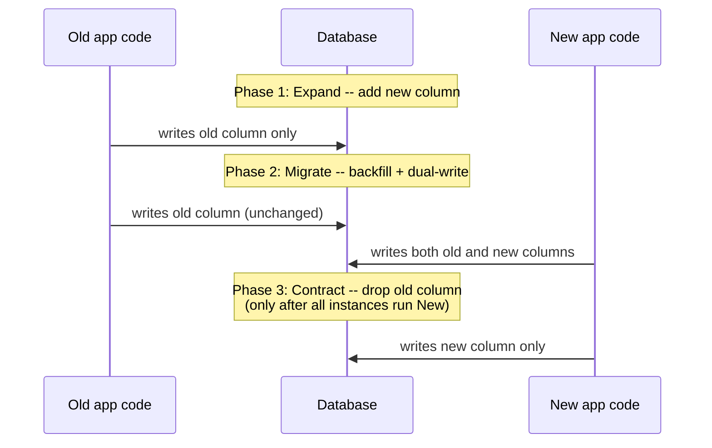

# Zero-Downtime Schema Migration

> **Topic register:** T-616 · IWI 7.30 · Staff tier
> **Provenance:** the blocking-vs-`CONCURRENTLY` timings in this chapter are real, measured wall-clock output from [`practice/sql/week-10/zero-downtime-migration/`](../../practice/sql/week-10/zero-downtime-migration/) against a live PostgreSQL 16 (Docker), a genuine 2-million-row table, and a real concurrent `INSERT` from a second session.

## Table of Contents

1. [Learning Objectives](#learning-objectives)
2. [Why This Matters in Interviews](#why-this-matters-in-interviews)
3. [Mental Model](#mental-model)
4. [Definition and Purpose](#definition-and-purpose)
5. [Core Concepts](#core-concepts)
6. [Internal Implementation](#internal-implementation)
7. [Diagrams](#diagrams)
8. [Production Scenarios](#production-scenarios)
9. [Trade-offs](#trade-offs)
10. [Decision Framework](#decision-framework)
11. [Common Mistakes](#common-mistakes)
12. [Anti-Patterns](#anti-patterns)
13. [Best Practices](#best-practices)
14. [Interview Answer Framework](#interview-answer-framework)
15. [Interview Questions](#interview-questions)
16. [Summary](#summary)
17. [Key Takeaways](#key-takeaways)
18. [Cheat Sheet](#cheat-sheet)
19. [Flashcards](#flashcards)
20. [Practice Exercises](#practice-exercises)
21. [Solutions](#solutions)
22. [Additional Reading](#additional-reading)
23. [Official References](#official-references)

---

## Learning Objectives

By the end of this chapter you can:

- State, with a measured number, what a plain `CREATE INDEX` blocks and for how long, versus `CREATE INDEX CONCURRENTLY`.
- Walk through the three phases of expand-contract for a column rename/retype on a live, rolling-deployed system.
- Explain why a direct `ALTER TABLE ... RENAME COLUMN` is dangerous despite being instant at the catalog level.
- Recognize that expand-contract's dual-write phase inherits the same atomicity hazard as any other dual write.

## Why This Matters in Interviews

Zero-downtime migration questions test whether a candidate has actually operated a schema change against a live, traffic-serving database, versus only having run migrations against an empty local database where every operation looks instantaneous. The gap between "works on my machine" and "works against a 500M-row production table under load" is exactly what this topic is designed to expose.

## Mental Model

**Every zero-downtime migration technique exists to answer one question: what needs to keep working while the migration is in flight, and for how long?** A `CREATE INDEX` needs writes to keep working during a build that might take minutes to hours at scale — `CONCURRENTLY` answers that. A column rename needs *both* the old and new application code to keep working during a rolling deploy that might take minutes to hours — expand-contract answers that. Neither problem is really about the schema change being slow; it's about what else is happening concurrently while it runs.

## Definition and Purpose

Zero-downtime migration is the discipline of changing a live database's schema (add/rename/retype a column, add an index, change a constraint) without blocking the application's normal reads and writes for the duration — because "take a maintenance window" is rarely an option for a system with real concurrent traffic and no acceptable downtime.

Many schema changes that look instantaneous in a small local database take real, measurable time against production-scale data, and several of Postgres's default DDL operations hold locks for that entire duration — a `CREATE INDEX` on a large table isn't a millisecond operation at scale, and by default it blocks every write to that table until it finishes.

## Core Concepts

### Lock duration, not the operation itself, is the hazard

A plain `CREATE INDEX` holds a `SHARE` lock on the table for its entire build — the operation is correct, it just blocks writes for however long the build takes, which scales with table size. The fix (`CONCURRENTLY`) doesn't change what the index does, only how it acquires locks while building it (multiple passes, each holding only a brief lock).

### Expand-contract solves the mixed-version problem, not a lock problem

Column renames and type changes need a different technique than index creation, because the hazard isn't lock duration — it's that old application code (mid-deploy, or simply not yet redeployed) and new application code must both work correctly against the schema simultaneously, since a rolling deploy means both versions run concurrently for some period. Expand-contract solves this in three phases:

1. **Expand**: add the new column/structure alongside the old one — nothing is removed yet, so both old and new code work unmodified.
2. **Migrate**: backfill the new column from the old one for existing rows, and have the application dual-write to both during the transition. This is exactly the dual-write pattern from [Distributed Transactions, Saga, and the Outbox Pattern](../system-design/distributed-transactions-saga-and-outbox.md), applied to a single database instead of two systems, and it inherits the same hazard: a crash between the two writes needs the same at-least-once-plus-idempotency treatment, or the backfill has to reconcile the two later.
3. **Contract**: once all application instances are confirmed running the new code and both columns are verified in sync, drop the old column.

### A fast catalog operation can still be unsafe

`ALTER TABLE ... RENAME COLUMN` is instant at the catalog level regardless of table size (it doesn't rewrite data), but it breaks any still-running old code referencing the old name immediately — "fast" and "safe" are different properties, and this operation is fast but not safe under a rolling deploy.

## Internal Implementation

**Real setup**: a 2,000,000-row table, `big_table`. Two real sessions: one running `CREATE INDEX`, the other attempting a concurrent `INSERT` shortly after the index build starts.

**Real output, plain `CREATE INDEX`:**

```
Starting blocking CREATE INDEX in the background...
Attempting a concurrent INSERT while the index build is in flight...
CREATE INDEX
INSERT 0 1
RESULT: concurrent INSERT took 1943ms while a plain CREATE INDEX was running
```

**Real output, `CREATE INDEX CONCURRENTLY`:**

```
Starting CREATE INDEX CONCURRENTLY in the background...
Attempting a concurrent INSERT while the CONCURRENTLY index build is in flight...
INSERT 0 1
CREATE INDEX
RESULT: concurrent INSERT took 84ms while CREATE INDEX CONCURRENTLY was running
```

**1943ms vs. 84ms — roughly 23x.** The plain `CREATE INDEX` holds a `SHARE` lock on the table for its entire ~2-second build, which blocks writes (though not reads) — the concurrent `INSERT` in that run had to wait for the ENTIRE index build to finish before it could proceed, visible directly in the output ordering: `CREATE INDEX` completes, THEN `INSERT 0 1` prints. `CREATE INDEX CONCURRENTLY` uses a weaker locking strategy (building the index in multiple passes, each holding only a brief lock) specifically so writes are never blocked for the operation's duration — visible in the output ordering flipping: `INSERT 0 1` completes WHILE the index build is still running, and `CREATE INDEX` finishes afterward.

**"Rename a column on a live 200M-row table"** is answered directly by the expand-contract sequence above: a plain rename is instant at the catalog level regardless of table size, but it breaks any still-running old code referencing the old name immediately — which is why the safe version is expand (add the new column), migrate (dual-write + backfill), contract (drop the old column), never a single atomic rename against a system with a rolling deploy.

## Diagrams



## Production Scenarios

### Scenario: a direct column rename during a rolling deploy causes a partial outage

**Symptoms.** A team renames `orders.status` to `orders.order_status` via a single `ALTER TABLE ... RENAME COLUMN` migration, deployed alongside application code that references the new name. Mid-rollout, with roughly half the fleet still running the previous version, every request served by an old-version instance starts failing with a column-does-not-exist error.

**Impact.** A rolling deploy that should have been zero-downtime causes a partial outage proportional to the fraction of the fleet still running old code — worse the slower the rollout, since the mismatch window is longer.

**Initial hypotheses.** A bad deploy unrelated to the migration (checked — the failing instances are all running the previous, previously-working version); a database connectivity issue (checked — connections succeed, only the specific query referencing the old column name fails); the column rename breaking old code during the mixed-version window (correct).

**Evidence.** Every failing request's error references the old column name (`orders.status`), and failures stop entirely once the rollout completes and no old-version instances remain — timing that lines up exactly with the mixed-version window, not with any database-level incident.

**Diagnosis.** The single-statement rename changed the schema atomically for all sessions at once, but the application-code rollout is never atomic — a rolling deploy runs old and new code concurrently for its entire duration. Every old-code instance queries a column name that no longer exists the instant the migration runs, regardless of how far along the code rollout is.

**Immediate mitigation.** Roll back the application deploy to the previous version and simultaneously revert the rename, restoring the old column name so all currently-running code (old version) works again.

**Permanent remediation.** Redo the change with expand-contract: add `order_status` alongside `status`, deploy application code that dual-writes both and reads from whichever is present, verify all instances are on the new code and both columns are in sync, then drop `status` in a separate, later migration.

**Alternatives considered.** Forcing an instantaneous full-fleet deploy to avoid a mixed-version window — rejected as fragile and operationally risky (no ability to gradually roll back a bad deploy) compared to accepting a longer but safe expand-contract migration.

**Trade-offs.** Expand-contract takes more total calendar time (three separate deploys/migrations instead of one) — accepted, since the alternative is a guaranteed partial outage during every future rolling deploy that touches a renamed or retyped column.

**Prevention.** Any column rename or type change should go through expand-contract by default; a lint rule or migration-review checklist flagging direct `RENAME COLUMN`/type-changing `ALTER TABLE` statements against tables serving live traffic would catch this before it reaches production.

**Interview lesson.** This is Interview Question 1's underlying scenario, played out at real production scale: a fast, catalog-level-instant operation causing an outage specifically because "fast" and "safe under a rolling deploy" are different properties.

## Trade-offs

| Approach | Benefit | Cost |
|---|---|---|
| Plain `CREATE INDEX` | Simpler, single-pass, generally faster to complete | Blocks writes for the full duration — measured 1943ms of blocked `INSERT` here |
| `CREATE INDEX CONCURRENTLY` | Doesn't block writes — measured 84ms here | Slower overall (multiple passes), can fail and leave an invalid index requiring cleanup, cannot run inside a transaction block |
| Direct column rename/retype | Simple, one statement | Breaks any code still running the old schema assumption during a rolling deploy |
| Expand-contract | Old and new code both work throughout the transition | More steps, more total migration time, and the dual-write phase inherits its own atomicity hazard |

## Decision Framework

1. **Is this an index addition on a live, actively-written table?** Use `CREATE INDEX CONCURRENTLY`, and plan for the possibility of a leftover `INVALID` index requiring cleanup on failure.
2. **Is this a column rename, retype, or any change that a still-running old application version would misinterpret?** Use expand-contract — never a direct, single-statement change against a system with a rolling deploy.
3. **Does the migrate phase require dual-writing to two columns?** Treat it with the same crash-safety rigor as any cross-system dual write — verify the backfill reconciles correctly even if a write crashes between the two columns.
4. **Before the contract phase**, confirm every application instance is running code that no longer depends on the old column, not just that the deploy "looks complete."
5. **Is this table also a sharding/partitioning candidate?** See [Table Partitioning and Sharding Strategies](table-partitioning-and-sharding-strategies.md) — a shard-key migration follows this same expand-contract discipline at a larger scale.

## Common Mistakes

- Assuming a maintenance window is available for schema changes.
- Using plain `CREATE INDEX` on a large, actively-written table without considering `CONCURRENTLY`.
- Performing a direct column rename/retype against a system with a rolling deploy, breaking whichever application version doesn't match the new schema during the transition window.

## Anti-Patterns

- **Running a single, direct `ALTER TABLE ... RENAME COLUMN`** against a table serving live traffic during a rolling deploy, trusting that "it's instant at the catalog level" makes it safe.
- **Skipping `CONCURRENTLY` "because the table is small in staging"** without accounting for production data volume.
- **Treating the migrate phase's dual-write as automatically safe** just because it's within a single database, without the same crash-recovery reasoning applied to any other dual write.
- **Declaring the contract phase safe based on deploy dashboards alone**, without verifying no instance still queries the old column.

## Best Practices

- Default to `CREATE INDEX CONCURRENTLY` for any index addition against a table with live write traffic.
- Default to expand-contract for any column rename, retype, or structurally breaking change against a system with a rolling deploy.
- Apply the same crash-safety rigor to the migrate phase's dual-write as to any cross-system dual write.
- Verify the contract phase's precondition (no code depends on the old structure) explicitly, not just by inference from deploy completion.

## Interview Answer Framework

### 30-Second Answer

`CREATE INDEX CONCURRENTLY` avoids blocking writes during index builds — measured at 84ms vs. 1943ms of blocked `INSERT` for a plain `CREATE INDEX`. Column renames/retypes need expand-contract (add, dual-write + backfill, then drop) rather than a direct rename, because a rolling deploy runs old and new application code concurrently, and a direct rename breaks whichever version doesn't match.

### 2-Minute Answer

Definition: zero-downtime migration changes a live schema without blocking normal reads/writes. Why it exists: schema operations that look instant locally take real, lock-holding time at production scale. How it works: `CONCURRENTLY` avoids `CREATE INDEX`'s blocking lock via a multi-pass build; expand-contract avoids breaking mixed-version rolling deploys by keeping both old and new schema working simultaneously, then cutting over. One important trade-off: expand-contract's migrate phase requires dual-writing, which inherits the same atomicity hazard as any cross-system dual write. Production example: a real measured 1943ms vs. 84ms gap for blocking vs. concurrent index creation, and a real production incident where a direct column rename broke every old-version instance during a rolling deploy's mixed-version window.

### 10-Minute Deep Dive

Cover, in order: the mental model — every technique answers "what needs to keep working while this runs" (mental model); the measured blocking-vs-`CONCURRENTLY` index creation gap (internals, real evidence); the three-phase expand-contract sequence and why a fast catalog rename is still unsafe (core concepts); the dual-write phase's inherited atomicity hazard, cross-linked to the outbox pattern (core concepts + cross-reference); the decision framework distinguishing index changes from structural changes (decision framework); and close with the production scenario — a direct rename causing a partial outage during a rolling deploy's mixed-version window.

### Whiteboard Explanation

Draw the [§ Diagrams](#diagrams) sequence: old app code and new app code both querying the database concurrently during a rollout, with three phases stacked vertically — expand (new column added, only old writes), migrate (both old and new code writing, dual-write arrows to both columns), contract (only new code, old column gone). Annotate the migrate phase as "this is where the crash-safety question lives."

### Production Example

The rolling-deploy outage in [§ Production Scenarios](#production-scenarios): a direct column rename, deployed alongside code expecting the new name, broke every still-running old-version instance for the duration of the rollout — fixed by redoing the change as expand-contract.

### Trade-offs to Mention

State unprompted: `CONCURRENTLY` is slower overall despite not blocking writes; a fast catalog operation (rename) is not automatically a safe one under a rolling deploy; expand-contract's dual-write phase is not free of atomicity risk just because it's one database.

### Common Candidate Mistakes

Proposing a direct `RENAME COLUMN` as if it were safe merely because it's fast at the catalog level; not knowing `CONCURRENTLY` exists or that it can leave an invalid index on failure; assuming dual-writing within one database needs no crash-safety consideration.

### Typical Follow-Up Questions

1. "The backfill crashes halfway through. Now what?"
2. "It failed partway through the CONCURRENTLY build. What state is the index in, and what do you do?"
3. "How does this interact with a shard-key migration?"

### Senior-Level Expectations

Names `CONCURRENTLY` and its non-blocking property; correctly proposes expand-contract with the three phases named for a rename/retype.

### Staff-Level Discussion

The 23x measured gap between blocking and `CONCURRENTLY` index creation is a small, safe demonstration of a class of production incident that's entirely self-inflicted: a schema change that looks routine in a staging environment (small table, no concurrent load) can cause a real production outage purely from lock duration once the table is large and under real write traffic — the operation itself isn't wrong, its blocking behavior at scale is the hazard. A Staff engineer treats every schema change against a production-scale table as requiring an explicit answer to "what does this lock, and for how long, under real concurrent load" before running it, and treats every rename/retype against a rolling-deployed system as requiring expand-contract by default, not as a special case reserved for unusually large tables.

## Interview Questions

### Question 1 — Rename a column on a live 200M-row table.

**Why interviewers ask it.** Tests whether the candidate recognizes that catalog-level speed and rolling-deploy safety are different properties.

**Expected answer.** Expand-contract — add the new column, dual-write + backfill, verify, then drop the old column, never a single rename against a system serving live traffic from potentially-mixed application versions.

**Minimum acceptable answer.** States that a direct rename is risky and some staged approach is needed, even without naming all three phases precisely.

**Strong Senior answer.** Correctly proposes expand-contract with the three phases named.

**Staff-level extension.** Names the dual-write phase's own atomicity hazard explicitly and connects it to the outbox pattern's dual-write measurement — the backfill/dual-write step needs the same idempotency-or-outbox-style thinking, not a naive assumption that "just write to both columns" is itself safe under a crash.

**Common mistakes.** Proposing a direct `RENAME COLUMN` as if it were safe merely because it's fast at the catalog level, without addressing the mixed-version rolling-deploy hazard.

**Likely follow-ups.** "The backfill crashes halfway through. Now what?"

**Evaluation criteria (1–5).** 1: proposes a direct rename. 3: correctly proposes expand-contract. 5: correct proposal plus names the dual-write atomicity hazard explicitly.

**Related references.** [§ Core Concepts](#core-concepts); [Distributed Transactions, Saga, and the Outbox Pattern](../system-design/distributed-transactions-saga-and-outbox.md).

---

### Question 2 — How do you add an index to a 500M-row table in production without downtime?

**Why interviewers ask it.** Tests basic operational fluency with a mechanism every backend engineer eventually needs.

**Expected answer.** `CREATE INDEX CONCURRENTLY` — measured directly in this chapter to not block concurrent writes, at the cost of a slower, multi-pass build.

**Minimum acceptable answer.** Names `CONCURRENTLY`, even without the failure-mode detail.

**Strong Senior answer.** Names `CONCURRENTLY` and its non-blocking property.

**Staff-level extension.** Knows the failure mode (an `INVALID` index left behind, consuming disk and requiring explicit cleanup before retrying) and that `CONCURRENTLY` cannot run inside an explicit transaction block, which affects how migration tooling must invoke it.

**Common mistakes.** Not knowing `CONCURRENTLY` exists, or not knowing it can leave an invalid index on failure.

**Likely follow-ups.** "It failed partway through. What state is the index in, and what do you do?"

**Evaluation criteria (1–5).** 1: proposes a plain `CREATE INDEX`. 3: names `CONCURRENTLY`. 5: correct answer plus the `INVALID`-index failure mode and transaction-block restriction.

**Related references.** [§ Internal Implementation](#internal-implementation).

## Summary

A plain `CREATE INDEX` measurably blocked a concurrent `INSERT` for the index build's full ~2-second duration; the identical operation with `CONCURRENTLY` let the same `INSERT` complete in 84ms while the index was still building — roughly 23x faster for the write path, at the cost of a slower overall index build. Column renames/retypes need expand-contract, not a direct schema change, specifically to keep old and new application code both working during a rolling deploy — and the dual-write phase of expand-contract inherits the same atomicity hazard as any other dual write, not a free pass just because it's within one database.

## Key Takeaways

- Plain `CREATE INDEX` blocks writes for its full build duration — measured at ~1943ms of blocked INSERT here.
- `CREATE INDEX CONCURRENTLY` avoids that block — measured at 84ms — at the cost of a slower, multi-pass build and the risk of a leftover `INVALID` index on failure.
- Direct column renames/retypes break mixed-version rolling deploys; expand-contract keeps both versions working throughout.
- The dual-write phase of expand-contract has the same atomicity hazard as any cross-system dual write — it isn't automatically safe just because it's one database.

## Cheat Sheet

| Change | Safe approach |
|---|---|
| Add an index to a large, live table | `CREATE INDEX CONCURRENTLY` |
| Rename or retype a column | Expand (add new) → migrate (dual-write + backfill) → contract (drop old) |
| Add a new column with a default | Generally safe directly in modern Postgres (metadata-only default since PG 11) — verify for the specific type/version |
| Drop a column | Only after confirming zero code references it — the "contract" step, not a standalone operation |

## Flashcards

### Card: What a plain CREATE INDEX blocks

**Prompt:**
What lock does a plain `CREATE INDEX` hold, and what does it block?

**Answer:**
A `SHARE` lock on the table, held for the entire build duration — blocks writes (not reads) — measured at ~1943ms here.

**Why it matters:**
The specific mechanism that makes "just run CREATE INDEX" dangerous at scale.

**Common trap:**
Assuming index creation is always fast because it's fast on a small local table.

**Related:**
[Internal Implementation](#internal-implementation)

### Card: What CONCURRENTLY trades away

**Prompt:**
What does `CREATE INDEX CONCURRENTLY` trade for not blocking writes?

**Answer:**
A slower, multi-pass build, and the risk of a leftover `INVALID` index requiring manual cleanup on failure; also can't run inside an explicit transaction block.

**Why it matters:**
Not a free lunch — the write-blocking fix has its own operational cost.

**Common trap:**
Assuming `CONCURRENTLY` is strictly better with no downside.

**Related:**
[Trade-offs](#trade-offs)

### Card: Why direct column rename is unsafe

**Prompt:**
Why can't you just directly rename a column during a rolling deploy?

**Answer:**
Old and new application code versions run concurrently during the rollout; a direct rename breaks whichever version doesn't match — expand-contract keeps both working throughout.

**Why it matters:**
The core reason "fast at the catalog level" doesn't mean "safe."

**Common trap:**
Proposing a direct rename because it's fast and simple, ignoring the rolling-deploy mixed-version window.

**Related:**
[Core Concepts](#core-concepts)

## Practice Exercises

1. Reproduce both scripts: [`practice/sql/week-10/zero-downtime-migration/run-blocking.sh`](../../practice/sql/week-10/zero-downtime-migration/run-blocking.sh) and [`run-concurrently.sh`](../../practice/sql/week-10/zero-downtime-migration/run-concurrently.sh).
2. Kill a `CREATE INDEX CONCURRENTLY` mid-build (Ctrl+C or a session timeout) and inspect `pg_index` for the resulting `INVALID` index — write out the exact cleanup steps.
3. Design the full expand-contract sequence for renaming `orders.amount` to `orders.amount_cents` (a type-compatible rename) on a live, actively-written table, including what the dual-write phase's crash-safety requirement is.

## Solutions

**Exercise 1.** Expected output matches this chapter's measured traces: the blocking run shows `CREATE INDEX` completing before `INSERT 0 1` prints (1943ms blocked); the concurrent run shows `INSERT 0 1` printing while the build is still in progress (84ms).

**Exercise 2.** A killed `CREATE INDEX CONCURRENTLY` leaves an index row in `pg_index` with `indisvalid = false`. Cleanup: `DROP INDEX` the invalid index explicitly, then re-run `CREATE INDEX CONCURRENTLY` — Postgres does not automatically retry or clean up a failed concurrent build.

**Exercise 3.** Expand: add `orders.amount_cents` as a new column. Migrate: backfill `amount_cents = round(amount * 100)` for existing rows, and have the application dual-write both columns on every insert/update going forward. Contract: once all instances are confirmed writing `amount_cents` and read paths use it exclusively, drop `amount`. The dual-write phase's crash-safety requirement: a crash between writing `amount` and `amount_cents` (or vice versa) must not leave the two out of sync silently — either wrap both writes in the same transaction (straightforward here since both columns are in the same row/table, unlike a cross-system dual write) or run a reconciliation pass comparing the two columns before the contract phase.

## Additional Reading

- [PostgreSQL documentation — Building Indexes Concurrently](https://www.postgresql.org/docs/16/sql-createindex.html#SQL-CREATEINDEX-CONCURRENTLY)

## Official References

- [PostgreSQL documentation — Explicit Locking](https://www.postgresql.org/docs/16/explicit-locking.html) — the lock-mode table naming exactly which operations conflict with which
