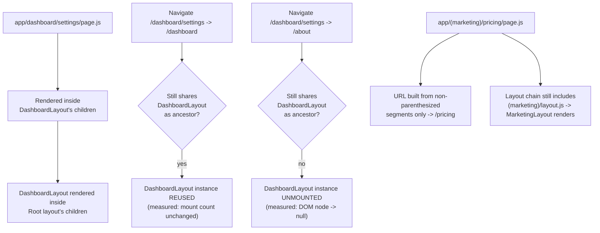

# Next.js App Router Fundamentals: Nested Layouts and Route Groups

> **Topic register:** F-202 (App Router fundamentals — layouts, pages, nested routing, route groups) · Beginner tier · `00-project/frontend-topic-register.md`
> **Scope note:** per `CLAUDE.md`'s Scope Addendum, this is the sixteenth frontend chapter, continuing D-F2 (Next.js) after F-201 established file-based routing, a single root layout, and dynamic segments. This chapter deliberately does NOT re-prove those — it covers what's new: layouts NESTED more than one level deep, layout SCOPING (a layout only persists within the subtree that actually uses it), and route groups (`(name)` folders that organize/scope without affecting the URL).
> **Provenance:** every claim is verified against the SAME real, running Next.js 16.3.1 App Router app as F-201 — [`practice/frontend/react-nextjs-fundamentals/`](../../practice/frontend/react-nextjs-fundamentals/), extended in place rather than re-scaffolded — including a real captured route manifest, a real measured two-level-layout persistence proof, a real DOM-node-presence proof of layout unmounting once its ancestry no longer applies, and a real `window.location.pathname` + build-manifest confirmation that a route group's folder name never reaches the URL.

## Table of Contents

1. [Learning Objectives](#learning-objectives)
2. [Why This Matters in Interviews](#why-this-matters-in-interviews)
3. [Mental Model](#mental-model)
4. [Definition and Purpose](#definition-and-purpose)
5. [Core Concepts](#core-concepts)
6. [Internal Implementation](#internal-implementation)
7. [Diagrams](#diagrams)
8. [Real Verified Demos](#real-verified-demos)
9. [Production Scenarios](#production-scenarios)
10. [Trade-offs](#trade-offs)
11. [Decision Framework](#decision-framework)
12. [Common Mistakes](#common-mistakes)
13. [Anti-Patterns](#anti-patterns)
14. [Best Practices](#best-practices)
15. [Interview Answer Framework](#interview-answer-framework)
16. [Interview Questions](#interview-questions)
17. [Summary](#summary)
18. [Key Takeaways](#key-takeaways)
19. [Cheat Sheet](#cheat-sheet)
20. [Flashcards](#flashcards)
21. [Practice Exercises](#practice-exercises)
22. [Solutions](#solutions)
23. [Additional Reading](#additional-reading)
24. [Official References](#official-references)

---

## Learning Objectives

By the end of this chapter you can:

- Explain nested layouts precisely: how many levels can nest, and what actually happens (measurably) at each level on navigation.
- State exactly WHEN a nested layout persists versus unmounts, backed by a real, direct DOM-presence check rather than an assumption.
- Explain what a route group is, why its folder name never reaches the URL, and when you'd reach for one.
- Distinguish "nested routing" (folders creating deeper URL paths) from "route groups" (folders that organize without adding a URL segment) — a common source of confusion this chapter resolves with a real, side-by-side demo of both.

## Why This Matters in Interviews

This is a Beginner-tier topic, but it's the one where candidates who've only skimmed Next.js docs most often blur two genuinely different mechanisms together: nested folders that DO add URL segments (nested routing) versus parenthesized folders that DON'T (route groups). "Route groups organize files without affecting the URL" is a fact anyone can recite; "I verified it — `app/(marketing)/pricing/page.js` resolves to `window.location.pathname === '/pricing'`, confirmed in both a live session and the real build manifest, with no `/marketing` segment anywhere" is the depth this chapter is built to produce.

## Mental Model

**A layout's persistence is scoped to exactly the part of the route tree that actually renders through it — not global, and not just "whichever layout happens to be nearest."** F-201 proved the ROOT layout persists across every route, because every route renders through it. This chapter proves the SAME mechanism applies at any nesting depth: a layout declared at `app/dashboard/layout.js` persists across navigation WITHIN `/dashboard/*` (because every one of those routes shares it as an ancestor) but genuinely unmounts the moment you navigate to a route that doesn't share that ancestor. Route groups are a separate, unrelated mechanism solving a different problem: letting you apply a shared layout (or just organize files) to a SET of routes without those routes' URLs reflecting that grouping at all.

## Definition and Purpose

**Nested layouts** are `layout.js` files declared at any folder depth within `app/`, not just the root — by default, layouts nest according to the folder hierarchy, so a layout at `app/dashboard/layout.js` wraps every route under `app/dashboard/` (and is itself wrapped by the root layout). They exist to let different SECTIONS of an app share section-specific UI (a dashboard's sidebar nav, a docs section's table of contents) without that UI leaking into unrelated routes, while still getting the same navigation-persistence guarantee the root layout gets — proven in this chapter to hold at the nested level too, not just the root. **Route groups** are folders wrapped in parentheses (`(groupName)`) that participate in the file tree for ORGANIZATIONAL and layout-SCOPING purposes only — the App Router explicitly excludes a route group's folder name from the resulting URL. They exist to solve a problem nested layouts alone can't: applying a distinct layout to a set of routes (e.g., a "marketing" section vs. an "app" section) WITHOUT forcing every route in that set to live under a shared URL prefix like `/marketing/*` — the routes can each have whatever URL makes sense (`/pricing`, `/about`, `/`) while still sharing that group's layout.

## Core Concepts

### Nested layouts get the identical persistence guarantee as the root layout, at any depth

This chapter's demo nests three levels: root layout → `app/dashboard/layout.js` (`DashboardLayout`) → `app/dashboard/settings/page.js`. Real captured evidence: navigating `/dashboard` → `/dashboard/settings` left BOTH the root layout's mount counter AND `DashboardLayout`'s own mount counter unchanged, while the page content changed. This is the same mechanism F-201 proved for the root layout, now confirmed to apply identically to a layout nested two levels deep.

### A nested layout genuinely unmounts once you leave its subtree

Real captured evidence, navigating `/dashboard/settings` → `/about`: `document.querySelector('[data-testid="dashboard-layout"]')` went from returning a real DOM element to returning `null` — the `DashboardLayout` component didn't just "stop updating," it was genuinely removed from the tree, because `/about` shares no layout ancestry with anything under `/dashboard/`. Navigating back to `/dashboard` afterward showed the layout mounted again — a real, observable mount/unmount/remount cycle, not a hidden cache.

### Route groups: the folder name never reaches the URL — proven live and in the build manifest

`app/(marketing)/pricing/page.js` — the `(marketing)` folder is a route group. Real captured evidence: `window.location.pathname === "/pricing"` after navigating there, confirmed independently by a real `next build` route manifest listing `/pricing` with no `/marketing` segment anywhere. `MarketingLayout`, declared at `app/(marketing)/layout.js`, applies to every route inside that group — this chapter's demo has only one (`/pricing`), but the mechanism scales to any number of routes sharing that group's layout while keeping their own independent, unprefixed URLs.

## Internal Implementation

The App Router's file-tree walk (established in F-201) composes layouts by nesting: for a given route's leaf `page.js`, the framework walks UP the folder tree collecting every `layout.js` it encounters, then renders them nested from the ROOT down to the leaf, each passing its own `children` prop to the next layout in (or the page itself, at the innermost level) — this is why `DashboardLayout`'s `{children}` prop, in this chapter's demo, receives either `DashboardPage` or `DashboardSettingsPage` depending on the current route, exactly mirroring how the root layout's `{children}` receives whichever top-level route is active. React's reconciliation is what makes the persistence (and the unmounting) observable: as long as a given layout component occupies the SAME position in the rendered tree across a navigation (i.e., the new route still shares that layout as an ancestor), React reuses the existing component instance; the moment a navigation target's ancestor-layout chain no longer includes that layout at all, React's diffing has no matching position to reuse, and the component instance is genuinely unmounted — which is exactly the DOM-node-disappearance this chapter measured directly, not a documentation claim taken on faith. Route groups are resolved at the SAME build-time file-tree walk from F-201, with one explicit rule: a folder segment wrapped in parentheses is recognized by the router as a grouping construct and is excluded from the URL PATH construction step, while still fully participating in layout composition — the framework builds the URL from the non-parenthesized segments only, but still walks through the parenthesized folder's `layout.js` when composing that route's rendered layout chain, which is exactly why `MarketingLayout` applies to `/pricing` even though `/pricing`'s literal URL contains no trace of `(marketing)` at all.

## Diagrams

## Real Verified Demos

All demos extend the SAME real Next.js app used for F-201 — [`practice/frontend/react-nextjs-fundamentals/`](../../practice/frontend/react-nextjs-fundamentals/), not a separate project. Full captured evidence in the app's own [README.md](../../practice/frontend/react-nextjs-fundamentals/README.md):

- [`app/dashboard/layout.js`](../../practice/frontend/react-nextjs-fundamentals/app/dashboard/layout.js), [`app/dashboard/page.js`](../../practice/frontend/react-nextjs-fundamentals/app/dashboard/page.js), [`app/dashboard/settings/page.js`](../../practice/frontend/react-nextjs-fundamentals/app/dashboard/settings/page.js) — real, measured nested-layout persistence AND unmounting.
- [`app/(marketing)/layout.js`](<../../practice/frontend/react-nextjs-fundamentals/app/(marketing)/layout.js>), [`app/(marketing)/pricing/page.js`](<../../practice/frontend/react-nextjs-fundamentals/app/(marketing)/pricing/page.js>) — real, measured route-group URL-stripping.
- [`app/components/MountCounter.js`](../../practice/frontend/react-nextjs-fundamentals/app/components/MountCounter.js) — the reusable measurement tool applied at every layout level in this chapter.

## Production Scenarios

**Scenario: a team wants a distinct "logged-out marketing" look and a distinct "logged-in app" look, without prefixing every marketing URL with `/marketing`.** A product has public marketing pages (`/`, `/pricing`, `/about`) that need a marketing-site header/footer, and authenticated app pages (`/dashboard`, `/settings`) that need an entirely different app-shell layout (sidebar nav, user menu). A naive approach nests everything under literal URL prefixes — `/marketing/pricing`, `/app/dashboard` — accepting worse, less natural URLs purely to get layout-scoping via ordinary nested folders. Using route groups instead — `app/(marketing)/pricing/page.js` and `app/(app)/dashboard/page.js` — achieves the identical layout-scoping (each group gets its own `layout.js`) while every route keeps its natural, unprefixed URL (`/pricing`, `/dashboard`), exactly as this chapter's `(marketing)` demo proves directly. This is the concrete, common reason route groups exist: layout organization and URL structure are frequently two SEPARATE concerns, and forcing them to align (as plain nested folders would) produces objectively worse URLs for no real benefit.

## Trade-offs

| Concern | Plain nested folder (no parentheses) | Route group `(name)` |
|---|---|---|
| Adds a URL segment | Yes — `app/dashboard/settings/page.js` → `/dashboard/settings` | No — `app/(marketing)/pricing/page.js` → `/pricing`, proven directly in this chapter |
| Scopes a layout to a subset of routes | Yes | Yes — identical layout-scoping capability |
| Best fit | When the nesting genuinely reflects the intended URL structure (a real sub-resource, like `/dashboard/settings`) | When you want to share a layout or organize files WITHOUT that grouping showing up in the URL (this chapter's marketing-vs-app-shell scenario) |
| Common confusion | Conflating this with route groups — this chapter treats them as two separate, real, side-by-side demos specifically to avoid that | Assuming route groups affect routing/matching behavior beyond layout scoping and URL exclusion — they don't add any other special behavior |

## Decision Framework

1. **Does the nesting you're adding represent a genuine sub-resource relationship the URL should reflect** (e.g., `/dashboard/settings` really is "settings, within dashboard")? → A plain nested folder — no parentheses needed.
2. **Do you want several routes to share a layout (or just be organized together) WITHOUT that grouping appearing in any of their URLs** (this chapter's marketing-vs-app-shell Production Scenario)? → A route group (`(name)`).
3. **Are you unsure whether a shared layout should persist across a set of routes' internal navigation?** → It will, automatically, as long as those routes share that layout as an ancestor in the file tree — verify directly with a mount counter (as this chapter does) rather than assuming, especially before building a feature (e.g., a persistent form draft, a persistent audio player) that depends on that guarantee.
4. **Are you trying to decide whether a shared layout should apply to routes with otherwise very different URL shapes** (e.g., `/`, `/pricing`, `/about` — no common URL prefix at all)? → This is precisely the case a route group is built for; ordinary nested folders can't achieve shared layout scoping WITHOUT also forcing a shared URL prefix.

## Common Mistakes

- Conflating route groups with ordinary nested routing — assuming a `(name)` folder behaves like any other folder except "invisible," rather than understanding it as a DIFFERENT mechanism (URL-exclusion + layout-scoping only, no other special routing behavior).
- Assuming a nested layout's persistence is unconditional/global, rather than scoped specifically to the subtree that shares it as an ancestor — this chapter's real DOM-node-disappearance evidence (navigating `/dashboard/settings` → `/about`) is the concrete counter-example.
- Forcing a shared layout's routes under a common URL prefix (plain nested folders) when a route group would achieve the identical layout-scoping with better, unprefixed URLs — exactly the unnecessary trade-off this chapter's Production Scenario avoids.

## Anti-Patterns

- **Using a plain (non-grouped) nested folder purely to scope a layout, accepting a worse URL structure as a side effect** — when a route group would provide the identical layout-scoping without that URL cost.
- **Assuming a nested layout persists across ANY navigation, without checking whether the destination route actually shares that layout as an ancestor** — leads to surprised bug reports about state loss when it turns out the layout genuinely unmounted, exactly as this chapter's `/dashboard/settings` → `/about` demo shows happens.

## Best Practices

- Reach for a route group specifically when you need shared layout/organization WITHOUT a shared URL prefix — and use plain nested folders when the nesting genuinely reflects real URL structure, keeping the two mechanisms deliberately distinct rather than blurred.
- Before relying on a nested layout's persistence for a feature (state that must survive intra-section navigation), verify — with a real mount counter, as this chapter does — which routes actually share that layout as an ancestor, rather than assuming from the folder structure alone.
- Keep route-group names descriptive of their PURPOSE (`(marketing)`, `(authenticated)`) even though they never appear in a URL — they're pure organizational/scoping signal for the codebase, and unclear names lose that value entirely.

## Interview Answer Framework

### 30-Second Answer

Layouts nest according to folder structure — a layout at any depth (not just the root) gets the identical navigation-persistence guarantee, proven here with a real mount counter that stayed unchanged across nested navigation, and genuinely unmounted (a real DOM node disappearing) once the destination route no longer shared that layout as an ancestor. Route groups (`(name)` folders) are a separate mechanism: they scope a layout to a set of routes WITHOUT adding a URL segment, verified here with `window.location.pathname` and a real build manifest both confirming a `(marketing)`-grouped route resolved to a clean, unprefixed URL.

### 2-Minute Answer

Start from the mental model: layout persistence is scoped to whatever subtree actually shares that layout, at any depth, not just the root. Cite the real nested evidence: a `DashboardLayout` at `app/dashboard/layout.js`, three levels deep, kept its mount counter unchanged navigating `/dashboard` → `/dashboard/settings`, exactly like the root layout does — then genuinely unmounted (confirmed by a DOM node going from present to `null`, not just a counter reading) navigating to `/about`, which shares no ancestry with `/dashboard/*`. Then cover route groups as a distinct, unrelated mechanism: `app/(marketing)/pricing/page.js` resolved to `/pricing`, not `/marketing/pricing`, confirmed both live (`window.location.pathname`) and in a real `next build` manifest — proving route groups scope layouts without touching the URL at all, solving the specific problem of wanting a shared layout across routes with otherwise unrelated URL shapes.

### 10-Minute Deep Dive

Cover: the build-time layout-composition mechanism (walking up from a leaf `page.js`, collecting every ancestor `layout.js`, nesting them root-down via `children`); the React-reconciliation-level reason a layout persists or unmounts (same tree position across navigation → instance reused; no matching position → instance unmounted), directly connecting this chapter's DOM-presence proof to the underlying mechanism rather than treating it as framework magic; the specific build-time rule that excludes a parenthesized route-group segment from URL construction while still including its `layout.js` in the layout-composition walk; and the Production Scenario's concrete marketing-vs-app-shell example as the canonical real-world reason to reach for a route group over plain nested folders.

### Whiteboard Explanation

Draw a three-level tree: Root layout → DashboardLayout → two leaf pages (`/dashboard`, `/dashboard/settings`). Show an arrow between the two leaves labeled "navigate," with BOTH ancestor layout boxes staying solid/unchanged. Then draw a SEPARATE arrow from `/dashboard/settings` to a box labeled `/about`, OUTSIDE the DashboardLayout subtree entirely — show the DashboardLayout box visibly disappearing (dashed/crossed out) on this transition, while the Root layout box stays solid. Beside it, draw the route-group case: a `(marketing)` folder box with a dashed outline (signaling "organizational only, not a URL segment") wrapping a `pricing` folder — with an arrow showing the resulting URL as `/pricing`, explicitly skipping the `(marketing)` label.

### Production Example

A product wanted a distinct marketing-site layout and a distinct authenticated-app-shell layout without forcing marketing URLs under a `/marketing` prefix — solved with two route groups (`(marketing)`, `(app)`), each with its own `layout.js`, giving every route its own natural URL while still sharing the right layout per section, exactly as this chapter's `(marketing)` demo proves works.

### Trade-offs to Mention

Plain nested folders are the right choice when the nesting genuinely reflects real URL structure; route groups are the right choice specifically when layout/organization needs to be shared across routes whose URLs shouldn't reflect that grouping — conflating the two either produces unnecessarily prefixed URLs or a misunderstanding of when a shared layout will and won't persist.

### Common Candidate Mistakes

Describing route groups as "just a way to organize files" without mentioning the URL-exclusion behavior specifically, or without being able to say precisely which build-time step excludes them. Assuming any shared ancestor layout persists across ALL navigation everywhere in the app, rather than understanding the persistence is scoped to routes that actually share that specific layout — this chapter's real DOM-node-disappearance evidence is the concrete counter-example a strong answer would cite.

### Senior-Level Expectations

Distinguishes nested routing from route groups precisely (URL segment vs. no URL segment) and can state the concrete condition under which a nested layout persists versus unmounts, not just "layouts persist."

### Staff-Level Discussion

Not the primary focus of this chapter's demos, but briefly: as an app's route tree grows, the choice of where to place layout boundaries (how many nested layouts, which routes get grouped together via route groups) becomes a real architectural decision affecting how independently different parts of a large app can evolve their own section-specific UI without cross-contaminating unrelated routes — the same "narrow, well-scoped boundary" principle this repository's architecture chapters apply to service/module boundaries applies here to layout/route-tree structure, and a Staff-level engineer is typically the one setting the convention for when a new section gets its own nested layout vs. its own route group vs. neither.

## Interview Questions

### Question 1

**Question:** "Your app has a `DashboardLayout` at `app/dashboard/layout.js`. A user navigates from `/dashboard/settings` to `/dashboard/billing` — does `DashboardLayout` remount? What about navigating from `/dashboard/settings` to `/profile` (a route NOT under `/dashboard`)?"

**Expected answer:** For `/dashboard/settings` → `/dashboard/billing`: NO, `DashboardLayout` does not remount — both routes share it as an ancestor in the file tree, so React reuses the existing component instance, exactly as this chapter measured directly with a mount counter that stayed unchanged across an equivalent navigation. For `/dashboard/settings` → `/profile`: YES, it unmounts — `/profile` doesn't live under `app/dashboard/`, so it doesn't share `DashboardLayout` as an ancestor at all; React has no matching tree position to reuse, so the component instance is genuinely removed, confirmed in this chapter with a direct DOM-node-presence check going from a real element to `null`.

**Common mistakes:** Assuming layout persistence is a global, unconditional guarantee ("layouts never remount") rather than scoped specifically to shared ancestry between the source and destination routes.

**Follow-up questions:** "How would you verify this without trusting documentation?" (a mount counter using `useRef` + an empty-dependency-array `useEffect`, or a direct DOM-presence check via `querySelector`, checked before and after — exactly this chapter's two verification methods). "What's a real consequence of assuming persistence incorrectly?" (state living in a layout that's actually going to unmount — e.g., an in-progress form draft, a scroll position — would be silently lost on that specific navigation, a genuine bug if the assumption was wrong).

**Senior-level expectations:** Answers both parts correctly with the correct reasoning (shared ancestry, not just "it's a layout so it persists"), and can describe a concrete verification method.

**Staff-level expectations:** Connects this to a broader architectural point about where layout boundaries should be placed in a growing app, and what real state-loss risk an incorrect assumption here would create for a specific feature.

### Question 2

**Question:** "Why would a team use `app/(marketing)/pricing/page.js` instead of just `app/marketing/pricing/page.js`?"

**Expected answer:** The parenthesized version is a ROUTE GROUP — its folder name is explicitly excluded from the resulting URL, so the route resolves to `/pricing`. The non-parenthesized version is an ORDINARY nested folder, which DOES add a URL segment, resolving to `/marketing/pricing` instead. Teams reach for the route group specifically when they want to share a layout (or just organize related routes together in the file tree) across routes whose URLs shouldn't reflect that internal organization — e.g., wanting `/`, `/pricing`, and `/about` to all share a "marketing" layout while keeping clean, unprefixed URLs, exactly this chapter's Production Scenario.

**Common mistakes:** Describing the two as functionally equivalent, or as differing only cosmetically, without being able to state the precise, verifiable difference (URL segment presence) — and without having verified it directly, the way this chapter did with both `window.location.pathname` and the real build manifest.

**Follow-up questions:** "Does a route group have any effect on routing/matching behavior besides the URL and layout-scoping?" (no — it's explicitly limited to organization and layout scoping; it doesn't change route matching priority, dynamic segment behavior, or anything else covered in this chapter or F-201). "Could you achieve the SAME layout-sharing without a route group, some other way?" (technically, by manually importing/composing the shared layout content inside each individual page rather than relying on the App Router's automatic layout nesting — but this discards the automatic persistence-across-navigation guarantee this chapter proved layouts provide, reintroducing manual work the framework's convention exists specifically to avoid).

**Senior-level expectations:** States the precise URL-inclusion-vs-exclusion difference unprompted, with the correct concrete example of when each is the right choice.

**Staff-level expectations:** Recognizes route groups as one of several tools for managing layout-boundary architecture as an app scales, not just a syntax trick for hiding a folder name.

## Summary

Layouts nest according to the file tree, and this chapter proved the SAME persistence guarantee F-201 established for the root layout applies identically at any nesting depth — a `DashboardLayout` two levels deep kept its mount counter unchanged across navigation within its own subtree, then genuinely unmounted (a real DOM node going from present to `null`) the moment the destination route no longer shared it as an ancestor. Route groups are a separate, distinct mechanism: `(name)` folders scope a layout (or just organize files) to a set of routes WITHOUT adding a URL segment, proven here with both a live `window.location.pathname` check and a real `next build` route manifest confirming a grouped route's URL contained no trace of its group name. The two mechanisms are commonly confused; this chapter deliberately demonstrated them side by side, in the same real app, to make the distinction concrete rather than definitional.

## Key Takeaways

- Nested layouts get the identical persistence guarantee as the root layout, at any depth — proven with a real mount counter unchanged across a two-level-deep navigation.
- Layout persistence is scoped to shared ancestry, not global — proven with a real DOM-node-presence check showing genuine unmounting once a destination route no longer shares that layout.
- Route groups (`(name)` folders) exclude their name from the URL while still applying their layout — proven with both a live `window.location.pathname` check and a real build manifest.
- Plain nested folders and route groups solve different problems (real URL structure vs. layout-scoping without URL impact) — conflating them either produces unwanted URL prefixes or an incorrect mental model of layout behavior.
- Every claim in this chapter was verified directly (mount counters, DOM presence checks, a real build manifest), not assumed from documentation.

## Cheat Sheet

- **Nested layout** → `layout.js` at any folder depth; wraps every route beneath it; persists across navigation within its own subtree (measured), unmounts once ancestry no longer applies (measured via DOM presence).
- **Route group** → `(name)` folder; excluded from the URL (measured via `window.location.pathname` and a real build manifest); still fully participates in layout composition.
- **When to nest plainly** → the folder structure genuinely reflects real URL structure.
- **When to use a route group** → you want shared layout/organization WITHOUT a shared URL prefix.
- **Verification method for both** → a mount counter (`useRef` + empty-dep `useEffect`) and/or a direct DOM-presence check, not assumption from documentation.

## Flashcards

## Card: When a nested layout unmounts vs. persists

**Prompt:**
A layout is declared at `app/dashboard/layout.js`. Under what specific condition does it unmount on navigation, versus persist?

**Answer:**
It persists when the destination route still shares it as an ancestor in the file tree (any route under `app/dashboard/`). It unmounts when the destination route does NOT share it as an ancestor (any route outside `app/dashboard/`) — React has no matching tree position to reuse, so the component instance is genuinely removed.

**Why it matters:**
Verified directly: navigating within `/dashboard/*` left the layout's mount counter unchanged; navigating to `/about` made `document.querySelector('[data-testid="dashboard-layout"]')` return `null` — a real, observed unmount, not an assumption.

**Common trap:**
Assuming layout persistence is a global, unconditional guarantee rather than scoped to shared ancestry.

**Related:**
[[nextjs-app-router-fundamentals]]

## Card: What a route group actually does

**Prompt:**
What specifically does wrapping a folder name in parentheses (e.g. `(marketing)`) do in the Next.js App Router?

**Answer:**
It excludes that folder segment from the resulting URL, while still fully including its `layout.js` in that route's layout composition. `app/(marketing)/pricing/page.js` resolves to `/pricing`, not `/marketing/pricing`, but still renders through `app/(marketing)/layout.js`.

**Why it matters:**
Verified directly two independent ways: `window.location.pathname === "/pricing"` in a live session, and a real `next build` route manifest listing `/pricing` with no `/marketing` segment anywhere.

**Common trap:**
Assuming a route group changes routing/matching behavior beyond URL-exclusion and layout-scoping — it doesn't.

**Related:**
[[nextjs-app-router-fundamentals]]

## Practice Exercises

1. Add a THIRD level of nesting: a new `app/dashboard/settings/billing/page.js` (no new layout file — it should inherit `DashboardLayout` automatically). Navigate there and confirm, via the mount counters, that both the root layout's AND `DashboardLayout`'s counts stay unchanged compared to being at `/dashboard/settings` — predict this before checking, and explain why no new layout file was needed for this to work.
2. Move `app/about/page.js` into a NEW route group, `app/(marketing)/about/page.js`, alongside the existing `(marketing)/pricing`. Run `next build` and confirm `/about`'s URL is unaffected by the move, while `MarketingLayout` now also applies to it — explain, in one sentence, why moving a page INTO a route group never changes its own URL even though it changes which layout(s) wrap it.
3. Temporarily rename `app/dashboard/layout.js` to `app/dashboard/_layout.js` (an invalid name — layouts must be named exactly `layout.js`). Run `next dev` or `next build` and observe what actually happens to `/dashboard` and `/dashboard/settings` — do they still work, and if so, which layout(s) do they render through now? Explain what this reveals about `layout.js` being convention-based rather than mandatory for a route to exist.

## Solutions

Exercise 1: navigating to the new `/dashboard/settings/billing` would show BOTH the root layout's AND `DashboardLayout`'s mount counters unchanged — no new layout file was needed because layout composition is based on WHICH ancestor `layout.js` files exist along the path from root to the leaf `page.js`, not on requiring one at every folder level; `/dashboard/settings/billing` simply has no `layout.js` of its own, so it renders directly as `DashboardLayout`'s `children`, the same as `/dashboard/settings` does, one level "closer" in the file tree but with an identical effective layout chain.

Exercise 2: `/about`'s URL remains exactly `/about` after the move — confirmed in the real build manifest — because a route group's name is ALWAYS excluded from URL construction regardless of which specific page is placed inside it; only the LAYOUT COMPOSITION changes (now including `app/(marketing)/layout.js` in `/about`'s ancestor chain), because moving a file's location in the tree changes which ancestor `layout.js` files it passes through, but the URL-construction step independently strips any parenthesized segment before that answer is finalized — the two concerns (URL, layout composition) are computed by related but distinct steps of the same build-time walk.

Exercise 3: with an invalid `_layout.js` filename, the framework doesn't recognize it as a layout file at all — it's just an unused, ordinary file as far as the router is concerned. `/dashboard` and `/dashboard/settings` STILL WORK (their `page.js` files still create valid routes, exactly per F-201's file-based routing rules), but they now render through the ROOT layout ONLY, with no `DashboardLayout` wrapping them at all — this reveals that `layout.js` is a NAMING CONVENTION the router specifically looks for, not a requirement for the underlying routes to exist; a route's existence (F-201) and a route's layout composition (this chapter) are governed by the same file-tree walk but are otherwise independent outcomes of it.

## Additional Reading

- [Next.js's Role: File-Based Routing and Why a Meta-Framework Over Plain React/Vite](nextjs-fundamentals.md) — this chapter's prerequisite; establishes file-based routing, the root layout's persistence guarantee, and dynamic segments, all extended here rather than re-derived.
- [Server Components vs. Client Components: The Actual Boundary](nextjs-server-vs-client-components.md) — the next chapter in sequence (F-203), explaining precisely what runs where for the `page.js`/`layout.js` files this chapter wrote (all Server Components by default).
- [00-project/frontend-topic-register.md](../../00-project/frontend-topic-register.md) — the full register this chapter is F-202 of.

## Official References

- [nextjs.org: Layouts and Pages](https://nextjs.org/docs/app/getting-started/layouts-and-pages)
- [nextjs.org: Route Groups](https://nextjs.org/docs/app/api-reference/file-conventions/route-groups)
- [nextjs.org: `layout.js`](https://nextjs.org/docs/app/api-reference/file-conventions/layout)
- [nextjs.org: App Router documentation home](https://nextjs.org/docs/app)
