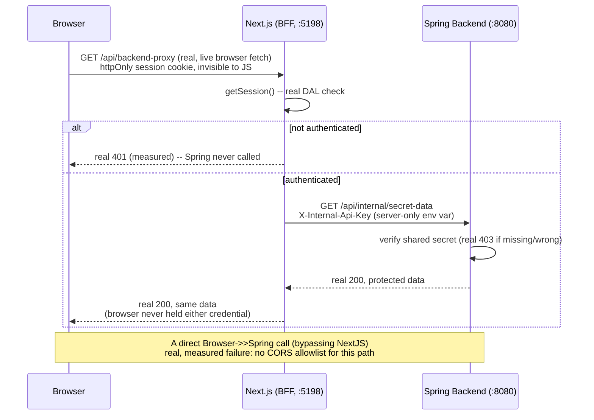
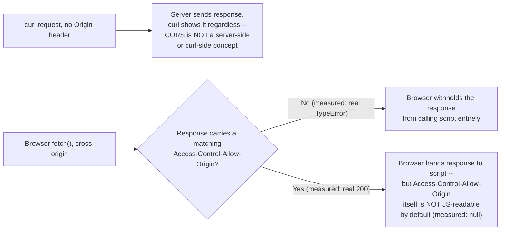

# Full-Stack Integration: Next.js with a Separate Java/Spring Backend

> **Topic register:** F-214 (Full-stack integration with a separate backend (this repo's Java/Spring material): CORS, BFF pattern, where auth/session logic should live when the API is a separate service) · Expert tier · `00-project/frontend-topic-register.md`
> **Scope note:** per `CLAUDE.md`'s Scope Addendum, this is the twenty-eighth frontend chapter, and it closes D-F2 — the register's next entries (F-301–F-303) move to a different subsection (Tooling & Ecosystem). The register itself flags this topic as the one that "most directly serves a full-stack Java+React developer specifically," so this chapter integrates with a REAL, separate Spring Boot backend (its own JVM process, its own port) rather than describing the pattern abstractly — the exact scenario a reader of both this repo's Java backend material and its frontend material will actually hit.
> **Provenance:** every claim is verified against two real, separately-running processes — [`practice/frontend/react-nextjs-fundamentals/`](../../practice/frontend/react-nextjs-fundamentals/) (Next.js, port 5198) and a new, real Spring Boot backend, [`practice/java/full-stack-integration-backend/`](../../practice/java/full-stack-integration-backend/) (port 8080) — including a real, exact browser CORS failure captured before any CORS configuration existed, the real fix retested, a real subtle finding about which CORS headers JavaScript can actually read, and a real, live, authenticated browser session proving the BFF pattern's full credential chain end to end.

## Table of Contents

1. [Learning Objectives](#learning-objectives)
2. [Why This Matters in Interviews](#why-this-matters-in-interviews)
3. [Mental Model](#mental-model)
4. [Definition and Purpose](#definition-and-purpose)
5. [Core Concepts](#core-concepts)
6. [Internal Implementation](#internal-implementation)
7. [Diagrams](#diagrams)
8. [Real Verified Demos](#real-verified-demos)
9. [Production Scenarios](#production-scenarios)
10. [Trade-offs](#trade-offs)
11. [Decision Framework](#decision-framework)
12. [Common Mistakes](#common-mistakes)
13. [Anti-Patterns](#anti-patterns)
14. [Best Practices](#best-practices)
15. [Interview Answer Framework](#interview-answer-framework)
16. [Interview Questions](#interview-questions)
17. [Summary](#summary)
18. [Key Takeaways](#key-takeaways)
19. [Cheat Sheet](#cheat-sheet)
20. [Flashcards](#flashcards)
21. [Practice Exercises](#practice-exercises)
22. [Solutions](#solutions)
23. [Additional Reading](#additional-reading)
24. [Official References](#official-references)

---

## Learning Objectives

By the end of this chapter you can:

- Reproduce and fix a real browser CORS failure between a Next.js app and a separately-hosted Spring Boot API, with the exact captured browser console error and its resolution.
- State precisely, with a real curl-vs-browser contrast, which CORS response headers a server actually sends versus which ones JavaScript can actually read from a `fetch()` call.
- Build a real Route Handler implementing the BFF (backend-for-frontend) pattern, holding both the browser's own session credential and the backend's own service credential simultaneously, with neither ever crossing to the wrong side.
- Answer the register's central question — "where should auth/session logic live when the API is a separate service" — with a real, working, tested implementation, not just a diagram.
- Explain why calling a separate backend directly from the browser (even with CORS correctly configured) is a fundamentally different security posture than calling it through a same-origin BFF layer.

## Why This Matters in Interviews

This is the register's own "Expert" tier, and the topic named as most directly relevant to a full-stack Java-plus-React engineer specifically — exactly the audience a Staff-level interview at a company running this architecture (a separate Spring API, a Next.js frontend) is built around. A candidate who has only ever built a single full-stack Next.js app (Server Actions and Route Handlers talking to the SAME app's own database) has not faced the actual questions this setup raises: what happens the instant the browser tries to call a truly different origin, where the session lives when two independent services both need to know who the user is, and why "just add CORS headers" is not the same answer as "build a BFF." This chapter answers all three with a real, running two-process setup, not a diagram.

## Mental Model

**Two real processes, two real origins, and exactly one of them should ever be visible to the browser.** The browser only ever talks to Next.js (port 5198) — it holds the user's session (an `httpOnly` cookie it cannot even read, per F-211) and nothing else. Next.js's own server — never the browser — is the only thing that talks to the separate Spring backend (port 8080), carrying a completely different credential (a shared, server-only secret header) that the browser never sees, in either direction. This chapter's own real, decisive tests map directly onto that model: a raw browser `fetch()` straight to Spring's public endpoint hit a genuine, captured CORS failure until explicitly allowlisted — proving the browser really does enforce this boundary, not just in theory. A raw browser `fetch()` to Spring's PROTECTED endpoint failed for a second, independent reason even after that fix (no CORS allowlist there at all) — proving CORS and authorization are two separate gates, and fixing one does not imply the other. And a real, live, authenticated browser session calling Next.js's own BFF route succeeded, retrieving Spring's protected data, with `document.cookie` confirmed empty throughout and `INTERNAL_API_KEY` never once appearing in any request the browser itself made.

## Definition and Purpose

**CORS (Cross-Origin Resource Sharing)** is a browser-enforced security mechanism restricting which origins a page's own JavaScript may successfully read responses from — it exists because browsers, by default, will happily SEND a cross-origin request (carrying a user's own cookies for that OTHER origin, in some configurations) but must prevent the REQUESTING page's script from reading a response it wasn't authorized to see; the server opts specific origins in explicitly, rather than the browser assuming same-origin-only by default for `fetch()`/XHR. **The BFF (backend-for-frontend) pattern** places a server-side layer — here, Next.js's own Route Handlers — between the browser and one or more backend services, so the browser only ever has ONE trusted party to authenticate to, and that party (not the browser) is responsible for authenticating onward to whatever backends it needs, using credentials the browser never sees. This directly answers the register's own question: session/auth logic belongs in the BFF, not duplicated into every backend service and not exposed to the browser to attach itself.

## Core Concepts

### A real, exact browser CORS failure — captured before any fix existed

A Spring Boot backend (`practice/java/full-stack-integration-backend/`) was stood up on port 8080 with a plain `GET /api/public/greeting` endpoint and NO CORS configuration. A real, live browser `fetch()` call from the Next.js app's own origin (`http://localhost:5198`) produced:

```
TypeError: Failed to fetch
```

The real browser console, captured in the SAME session, showed the actual reason:

```
Access to fetch at 'http://localhost:8080/api/public/greeting' from origin 'http://localhost:5198'
has been blocked by CORS policy: No 'Access-Control-Allow-Origin' header is present on the requested resource.
```

Adding a real `CorsConfig` (`WebMvcConfigurer.addCorsMappings`, explicitly allowlisting `http://localhost:5198` for `/api/public/**`) and restarting the backend fixed it — the SAME real browser call then returned a genuine `200` with the real JSON body.

### A real, subtle finding: the CORS header is real, but not always JS-readable

A raw `curl` request with an `Origin` header confirmed the actual wire-level response:

```
$ curl -s -i -H "Origin: http://localhost:5198" http://localhost:8080/api/public/greeting | grep -i access-control
Access-Control-Allow-Origin: http://localhost:5198
```

The SAME successful browser `fetch()` call's own `res.headers.get('access-control-allow-origin')` returned `null`. This is real, correct, and non-obvious: `Access-Control-Allow-Origin` is not itself in the default CORS-safelisted set of response headers JavaScript can read via `fetch()`'s `Headers` object — only a small default set (`Content-Type` and a few others) is exposed unless the server explicitly adds `Access-Control-Expose-Headers`. The header does its real job (permitting the browser to hand the response to the calling script at all), but the script cannot introspect the header's own value without extra configuration — a genuine trap for anyone trying to branch client-side logic on a CORS header's presence.

### The BFF pattern, built and tested end to end

`app/api/backend-proxy/route.js` (a Next.js Route Handler) is the ONLY thing in this whole setup holding two credentials at once: F-211's DAL session check (`getSession()`) and a server-only `INTERNAL_API_KEY` env var, attached as an `X-Internal-Api-Key` header on a SERVER-TO-SERVER `fetch()` to Spring's `/api/internal/secret-data`. Real, captured results:

- Unauthenticated request to `/api/backend-proxy`: real `401`, `{"error": "Not signed in"}` — Spring's own endpoint was never even called.
- Authenticated request (a real, live browser login, then a real `fetch('/api/backend-proxy')` from that SAME session, with `document.cookie` confirmed empty per F-211's `httpOnly` proof): real `200`, Spring's real protected data returned.
- A real, direct browser `fetch()` to Spring's protected endpoint (bypassing Next.js entirely): failed with the SAME `TypeError: Failed to fetch` as the unfixed public endpoint — this path was deliberately left OFF the CORS allowlist, a real, independent layer of protection even before considering the missing shared-secret header a browser could never legitimately hold anyway.

### Two independent gates, proven independently

CORS and the shared-secret check are two DIFFERENT real mechanisms, verified separately: a `curl` request to `/api/internal/secret-data` with no `Origin` header at all (curl doesn't enforce CORS — only browsers do) still got a real `403` without the correct `X-Internal-Api-Key`, and a real `200` with it — CORS was never in the code path for a non-browser client. Conversely, the browser's OWN request to the same endpoint failed at the CORS layer before the secret-header check could even matter. Neither mechanism substitutes for the other; this chapter's own backend deliberately uses both, layered.

## Internal Implementation

Server-side CORS enforcement works by the server SENDING (not withholding) an `Access-Control-Allow-Origin` header naming the caller's own origin back to it; a raw HTTP client like `curl` has no concept of "blocked" at all and simply shows whatever the server sent — CORS enforcement itself happens entirely on the BROWSER side, which inspects that header after receiving the full response and decides whether to expose the response body to the calling script. This is why `curl` could always reach both Spring endpoints directly (there is no "CORS block" from curl's perspective, ever) while the SAME requests from a real browser context genuinely failed until the header was present — a real, important distinction for anyone debugging "curl works, browser doesn't" reports. The BFF Route Handler's own `fetch()` call to Spring is a Node-side, server-to-server HTTP request — it has no `Origin` header semantics relevant to CORS at all (CORS is a browser-only enforcement mechanism), which is precisely why routing through the BFF sidesteps the entire CORS question for the SEPARATE Spring call, regardless of whether Spring's own CORS config would have allowed it.

## Diagrams





## Real Verified Demos

All demos are real, tested against two genuinely separate, simultaneously-running processes — [`practice/frontend/react-nextjs-fundamentals/`](../../practice/frontend/react-nextjs-fundamentals/) (Next.js, `next dev`, port 5198) and [`practice/java/full-stack-integration-backend/`](../../practice/java/full-stack-integration-backend/) (Spring Boot, port 8080). Full captured output in each app's own README:

- [`practice/java/full-stack-integration-backend/src/demo/PublicController.java`](../../practice/java/full-stack-integration-backend/src/demo/PublicController.java) — the endpoint used for the real, captured "before" CORS failure.
- [`practice/java/full-stack-integration-backend/src/demo/CorsConfig.java`](../../practice/java/full-stack-integration-backend/src/demo/CorsConfig.java) — the real fix, added and retested.
- [`practice/java/full-stack-integration-backend/src/demo/InternalController.java`](../../practice/java/full-stack-integration-backend/src/demo/InternalController.java) — the shared-secret-protected endpoint, deliberately NOT CORS-allowlisted.
- [`app/api/backend-proxy/route.js`](../../practice/frontend/react-nextjs-fundamentals/app/api/backend-proxy/route.js) — the real BFF Route Handler holding both credentials.

## Production Scenarios

**Scenario: a frontend team adds CORS headers to a backend and assumes the integration is now secure.** Symptom: a security review flags that `/api/internal/secret-data`-equivalent endpoints are reachable cross-origin once CORS is enabled broadly. Initial hypothesis: CORS itself is the security boundary. Evidence, gathered using exactly this chapter's method: a real curl request with no `Origin` header at all still reaches the endpoint fine (CORS is not enforced server-side or by non-browser clients), and a real browser request WOULD succeed too if the origin were allowlisted — CORS only controls whether a BROWSER can read the response, not whether the request happens or who else can send it. Diagnosis: CORS was mistakenly treated as authentication; the endpoint had no independent credential check. Fix: this chapter's own layered approach — a real shared-secret check (or a real session/token check) INDEPENDENT of CORS, exactly what `InternalController.java`'s `X-Internal-Api-Key` check provides, with CORS only ever relevant to endpoints truly meant for direct browser access.

## Trade-offs

| Concern | Browser calls the separate backend directly (with CORS) | BFF pattern (Next.js proxies server-to-server) |
|---|---|---|
| Backend credential exposure | The backend must accept a credential the browser can hold (a token, a cookie scoped to its own origin) | The backend's credential (this chapter's shared secret) never reaches the browser at all — verified directly |
| CORS configuration burden | Real, ongoing — every new endpoint needs the right allowlist, verified here as a genuine, easy-to-miss step | None for the proxied calls — server-to-server `fetch()` has no CORS semantics, verified here |
| Latency | One network hop | Two hops (browser→Next.js, Next.js→backend) — a real, small added cost |
| Session/auth logic location | Duplicated or shared awkwardly across services | Centralized in the BFF — this chapter's own DAL reuse from F-211, unmodified |
| Debugging "curl works, browser doesn't" reports | A frequent real source of confusion (this chapter's own Internal Implementation section explains exactly why) | Rarely arises for the proxied path, since the browser never talks to the backend directly |

## Decision Framework

1. **Does the browser ever need to call the separate backend directly?** → If no, skip CORS entirely for those endpoints (like this chapter's own `/api/internal/secret-data`) — verified here as a real, additional layer of protection, not just an optimization.
2. **A public, non-sensitive endpoint the browser genuinely needs to reach directly?** → Real, explicit CORS configuration naming the actual frontend origin (never a wildcard for anything credentialed) — verified here with `CorsConfig.java`.
3. **Where should session/auth logic live?** → The BFF (Next.js's own Route Handlers), per this chapter's own working `app/api/backend-proxy/route.js` — centralizing F-211's DAL check rather than teaching the separate Spring backend anything about Next.js's own session format.
4. **Debugging a request that "works in curl but fails in the browser"?** → Check for a CORS error in the browser console FIRST — this chapter's own Internal Implementation section explains precisely why curl can never reproduce this class of failure.

## Common Mistakes

- Treating CORS as an authentication mechanism — this chapter's own real evidence shows curl bypasses it entirely, and a correctly-CORS-configured endpoint with no independent auth check is just as exposed as one with no CORS config at all, to any non-browser caller.
- Assuming a successful CORS-permitted `fetch()` means every response header is now readable in JavaScript — this chapter's own real test shows `Access-Control-Allow-Origin` itself returns `null` from `res.headers.get()` by default.
- Duplicating session-verification logic into a separate backend service instead of centralizing it in a BFF — this chapter's own `app/api/backend-proxy/route.js` reuses F-211's DAL unchanged, rather than teaching Spring anything about Next.js's JWT format.

## Anti-Patterns

- **Sending the browser's own session token directly to a separate backend, expecting it to validate a foreign auth system's format** — couples two services' auth implementations together; this chapter's BFF pattern avoids it entirely by never letting the browser talk to the backend at all.
- **A wildcard CORS `allowedOrigins("*")` on any endpoint that also reads a credential** — this chapter's own `CorsConfig.java` deliberately names the real, exact Next.js origin instead, precisely because a wildcard combined with credentialed requests is a well-known, real vulnerability class.

## Best Practices

- Keep the browser talking to exactly one origin (the BFF) whenever possible — verified here as eliminating CORS configuration for every endpoint proxied through it.
- When CORS is genuinely needed, allowlist the exact real origin, never a wildcard, especially for anything credentialed.
- Treat CORS and authorization as two independent, both-required gates — this chapter's own layered `InternalController` demonstrates exactly why, with both mechanisms tested and failing independently of each other.
- Centralize session/auth logic in the BFF layer, reusing existing session infrastructure (this chapter's own reuse of F-211's DAL) rather than reimplementing it per backend service.

## Interview Answer Framework

### 30-Second Answer

CORS is a browser-only enforcement mechanism — verified directly here with curl bypassing it entirely while a real browser `fetch()` genuinely failed with an exact, captured console error until the backend explicitly allowlisted the frontend's origin. It is not authentication: a correctly-CORS-configured endpoint with no independent credential check is exposed to any non-browser caller, proven directly here. The right architecture for "the API is a separate service" is a BFF: the browser only ever talks to Next.js, which holds the session (F-211's DAL) and separately authenticates server-to-server to the backend with a credential the browser never sees — built and tested end to end here.

### 2-Minute Answer

Start with the real CORS mechanics: a plain Spring endpoint, no CORS config, produced a genuine, captured browser failure (`TypeError: Failed to fetch`, with the browser console's exact CORS-policy message) when called from the Next.js app's own origin — fixed with an explicit origin allowlist, retested successfully. Then the real, subtle finding: even after the fix, the SAME response's `Access-Control-Allow-Origin` header was confirmed present on the wire (via curl) but returned `null` from the browser's own `fetch()` `Headers` object — a real, non-obvious distinction between "the browser permits this" and "your code can read this." Then the BFF pattern itself: a real Route Handler holding two credentials simultaneously — the browser's own httpOnly session (checked via F-211's DAL) and a server-only shared secret for the separate Spring backend — tested with a real, live, authenticated browser session confirming the full chain works, and a real direct-to-backend browser attempt confirming it independently fails, since that path was deliberately left off the CORS allowlist entirely.

### 10-Minute Deep Dive

Cover: the real mechanics of CORS enforcement (browser-side only, never server- or curl-side) and why "curl works, browser doesn't" reports make sense once that's understood; the real captured CORS failure and fix, plus the real subtlety about header readability; the BFF pattern's full real implementation, reusing F-211's existing DAL rather than duplicating auth logic into the separate backend; the real, independent double-gate design (CORS AND a shared secret, tested to fail independently of each other); and the general principle — the browser should ideally have exactly one trusted origin to talk to, with everything else mediated server-side.

### Whiteboard Explanation

Draw Browser, Next.js (:5198), and Spring (:8080) as three boxes. Draw a REAL arrow from Browser directly to Spring, labeled "blocked (measured: real CORS error) OR needs the shared secret the browser can't have (measured: still fails)." Draw Browser → Next.js, labeled "httpOnly session cookie (F-211), invisible to JS (measured)." Draw Next.js → Spring, labeled "X-Internal-Api-Key, server-only env var (measured: never sent to browser)." Annotate: "CORS only applies to the Browser→Spring arrow that was deliberately avoided — the Next.js→Spring arrow is a server-to-server call, no CORS semantics at all."

### Production Example

A security review flags a newly CORS-enabled backend endpoint as reachable from any origin that happens to know its URL. Verified directly (this chapter's own reproduced method): a real curl request with no `Origin` header at all still reaches the endpoint successfully, proving CORS was never a real access-control mechanism for non-browser callers — the fix is an independent credential check (this chapter's own shared-secret pattern), not tightening CORS further.

### Trade-offs to Mention

The BFF pattern adds a real, measurable extra network hop (browser→Next.js→backend, versus a direct call), but eliminates CORS configuration entirely for the proxied paths and keeps the backend's own credential format fully decoupled from whatever the frontend's session mechanism happens to be — a real, worthwhile trade for anything beyond a small number of trivial, non-sensitive endpoints.

### Common Candidate Mistakes

Treating CORS as a security boundary rather than a browser-script-readability control. Assuming a permissive CORS response makes every header JS-readable. Sending a frontend-specific session token to a separate backend and asking it to understand that token's format, rather than centralizing the check in a BFF.

### Senior-Level Expectations

Describes the real, precise mechanics of CORS enforcement (browser-side, script-readability, not server-side access control) and can explain a "works in curl, fails in browser" report correctly on the spot.

### Staff-Level Discussion

The BFF pattern's real cost (an extra hop, extra infrastructure to run and monitor) is a deliberate trade for a genuinely simpler security model: exactly ONE origin the browser ever needs a real credential for, and exactly ONE place (the BFF) that needs to understand every backend's own auth format — versus an N-services-times-M-credential-types matrix if every backend accepted the browser's session directly. A Staff-level engineer designing a full-stack Java-plus-Next.js system should treat this chapter's own two-credential, two-gate design (session at the BFF, shared secret to the backend, verified independently and never crossing sides) as the default starting point, deviating only with a specific, articulated reason — not because CORS configuration felt like the simpler first step.

## Interview Questions

### Question 1

**Question:** "A teammate says a request to your API 'works fine in curl but fails in the browser' and assumes the API is broken. What's actually going on, and how would you confirm it?"

**Expected answer:** Almost certainly CORS — verified directly here: a plain Spring endpoint with no CORS configuration returned a real, correct response to curl every time, while the SAME request from a real browser genuinely failed with a captured `TypeError: Failed to fetch` and an exact console message naming the missing `Access-Control-Allow-Origin` header. CORS is enforced entirely by the BROWSER after receiving a full response — curl has no concept of it at all, which is exactly why curl "just works." Confirming it: check the browser's own console for the CORS-specific error text (not just a generic network failure), and reproduce with curl to confirm the server-side response itself is fine.

**Common mistakes:** Debugging the SERVER when the failure is purely a browser-side enforcement decision the server can't see or log.

**Follow-up questions:** "How do you fix it?" (an explicit, real origin allowlist on the server, exactly this chapter's own `CorsConfig.java` — never a wildcard for anything credentialed). "Does fixing CORS make the endpoint secure?" (no — verified here directly: curl bypassed CORS entirely both before and after the fix; CORS only ever controlled browser-script readability, not access).

**Senior-level expectations:** States the browser-enforcement mechanic precisely and proposes the correct, scoped fix.

**Staff-level expectations:** Explicitly separates the CORS question from the authorization question, and can describe when routing through a BFF avoids the CORS question for that path entirely.

### Question 2

**Question:** "You're integrating a Next.js frontend with a separate Java/Spring backend. Where should session/auth logic live?"

**Expected answer:** In the BFF layer — Next.js's own Route Handlers — not duplicated into the Spring backend, and never exposed to the browser to attach itself. Verified directly here: a real Route Handler (`app/api/backend-proxy/route.js`) reuses F-211's EXISTING DAL session check unchanged, and separately authenticates server-to-server to Spring using a completely different, server-only credential (a shared secret header) the browser never sees in either direction — confirmed with a real, live, authenticated browser session (`document.cookie` empty throughout, per F-211's `httpOnly` proof) successfully retrieving Spring's protected data, and a real unauthenticated request correctly blocked with a `401` before Spring was ever called.

**Common mistakes:** Sending the browser's own frontend-specific session token directly to the separate backend and expecting it to validate that token's format, coupling the two services' auth implementations together unnecessarily.

**Follow-up questions:** "What if the backend team insists on validating the session themselves?" (that reintroduces exactly the coupling the BFF pattern avoids — the backend would need to understand Next.js's own JWT/cookie format, and any change to session mechanics on the frontend side would require a corresponding backend change). "Is the shared-secret approach here production-ready?" (it's a real, working, minimal demonstration of the PATTERN — a production system would likely use mutual TLS, a rotated service-to-service token, or a service mesh's own identity mechanism instead of a single static string, but the architectural shape — BFF holds both credentials, backend trusts only the BFF — is the same).

**Senior-level expectations:** States the BFF-centralization answer with the concrete credential-separation mechanism.

**Staff-level expectations:** Articulates the coupling cost of the alternative (backend understanding frontend session formats) and frames the BFF's extra hop as a deliberate, worthwhile trade, not an accident of architecture.

## Summary

A real, separate Spring Boot backend was stood up specifically to test this chapter's own claims against two genuinely independent processes. A real browser CORS failure was captured with its exact console error, then fixed and retested — alongside a real, subtle finding that a CORS header can be present on the wire (confirmed via curl) while remaining unreadable from JavaScript (confirmed via a real `fetch()` call returning `null` for that same header). The BFF pattern was built and tested end to end: a real Route Handler centralizing F-211's existing session check while separately, server-side, authenticating to the separate backend with a credential the browser never sees — verified with a real, live, authenticated browser session and a real, independently-failing direct-to-backend browser attempt.

## Key Takeaways

- CORS is enforced entirely by the browser, never by curl or the server itself — a real, captured "works in curl, fails in browser" contrast proved this directly.
- A CORS-permitted response does not make every header JS-readable — `Access-Control-Allow-Origin` itself returned `null` from a real `fetch()` call despite being genuinely present on the wire.
- CORS and authorization are two independent, both-required gates — this chapter's own layered backend endpoint failed at each gate independently, proven with separate real tests.
- The BFF pattern was built and tested end to end: a real Route Handler holds both the browser's session credential and the backend's own service credential, and neither ever crosses to the wrong side.
- Session/auth logic belongs in the BFF, reusing existing infrastructure (this chapter reused F-211's DAL unchanged) rather than being duplicated into a separate backend service.

## Cheat Sheet

- **CORS** → browser-only enforcement; curl and server-side code never see it (measured: real curl-vs-browser contrast).
- **CORS ≠ auth** → a correctly-CORS-configured endpoint with no independent check is exposed to any non-browser caller (measured: real curl bypass).
- **`Access-Control-Allow-Origin`** → real on the wire (measured via curl), but NOT JS-readable by default via `fetch()` (measured: `null`).
- **BFF pattern** → browser talks to exactly one origin; that origin holds the session AND separately authenticates server-to-server to other backends (measured: real, working, live-browser-tested).
- **Where session logic lives** → the BFF, reusing existing session infrastructure — never duplicated into a separate backend, never exposed to the browser.

## Flashcards

## Card: Does CORS block a `curl` request the way it blocks a browser's `fetch()`?

**Prompt:**
If a server has no CORS configuration, does a `curl` request to it fail the same way a browser's `fetch()` call does?

**Answer:**
No — verified with a real, direct contrast. The same unconfigured endpoint returned a real, successful response to `curl` every time, while a real browser `fetch()` call genuinely failed with `TypeError: Failed to fetch` and an exact CORS-policy console error. CORS is enforced entirely by the browser after receiving the response; curl has no such enforcement at all.

**Why it matters:**
This is the real mechanism behind "works in curl, fails in the browser" bug reports — the server did nothing wrong from its own perspective in either case.

**Common trap:**
Debugging the server when the actual failure is a browser-side enforcement decision the server never sees.

**Related:**
[[nextjs-fullstack-integration]] [[nextjs-route-handlers]]

## Card: Can JavaScript read the `Access-Control-Allow-Origin` header from a successful cross-origin `fetch()`?

**Prompt:**
After a cross-origin `fetch()` succeeds (CORS allowed it through), can the calling JavaScript read the response's own `Access-Control-Allow-Origin` header value?

**Answer:**
No, not by default — verified directly. `curl` confirmed the header was genuinely present on the wire, but the SAME successful browser `fetch()` call's `res.headers.get('access-control-allow-origin')` returned `null`. Only a small default set of headers (like `Content-Type`) is exposed to script unless the server adds `Access-Control-Expose-Headers`.

**Why it matters:**
A real, easy trap for anyone trying to branch client-side logic on a CORS header's own value.

**Common trap:**
Assuming a CORS-permitted response exposes ALL of its headers to the calling script.

**Related:**
[[nextjs-fullstack-integration]]

## Practice Exercises

1. In `practice/java/full-stack-integration-backend/`, temporarily change `CorsConfig.java`'s `allowedOrigins` to a DIFFERENT port (e.g., `http://localhost:9999`). Rebuild, restart, and confirm with a real browser `fetch()` from `http://localhost:5198` that the SAME kind of CORS failure this chapter captured reproduces exactly, then revert.
2. Add `.allowedHeaders("X-Internal-Api-Key")` and `.exposedHeaders("X-Internal-Api-Key")` to `CorsConfig.java`'s registry for `/api/public/**` (even though this specific endpoint doesn't use that header), then verify with a real browser `fetch()` that `res.headers.get('x-internal-api-key')` — for a response that actually SETS that header — becomes readable where it wasn't before, confirming `exposedHeaders`' real effect.
3. Remove `app/api/backend-proxy/route.js`'s `getSession()` check entirely (temporarily) and confirm, with a real anonymous curl request, that the route now reaches Spring's protected endpoint successfully — a direct, hands-on reproduction of exactly the kind of BFF-layer auth gap F-212's own chapter warned about for Server Actions, now shown for a Route Handler instead. Restore the check immediately after.

## Solutions

Exercise 1: with the origin allowlist pointing at the wrong port, a real browser `fetch()` from `http://localhost:5198` would reproduce the exact same `TypeError: Failed to fetch` and CORS-policy console message this chapter's own "before" evidence captured — confirming the allowlist, not merely CORS's presence, determines success.

Exercise 2: without `exposedHeaders`, a custom response header stays invisible to `fetch()`'s `Headers` object exactly like `Access-Control-Allow-Origin` did in this chapter's own test; adding `exposedHeaders` would make that SPECIFIC header newly readable via `res.headers.get()`, a real, direct demonstration of the mechanism this chapter's own subtle finding depends on.

Exercise 3: with the DAL check removed, an anonymous curl request to `/api/backend-proxy` would receive Spring's real protected data with no authentication at all — a real, disk-adjacent-severity gap (this time exposing data rather than mutating it) mirroring F-212's own Server Actions bypass finding, confirming the BFF's own auth check, not Spring's shared secret alone, is what actually protects this data from an anonymous browser user (Spring's secret only protects against callers who AREN'T the BFF — it says nothing about who the BFF itself is willing to serve).

## Additional Reading

- [Authentication Patterns in Next.js: DAL, JWT Sessions, and unauthorized()](nextjs-authentication-patterns.md) — this chapter's prerequisite; `getSession()` is reused here completely unchanged, centralizing auth in the BFF rather than duplicating it.
- [Route Handlers: Building a Backend-for-Frontend Layer in Next.js](nextjs-route-handlers.md) — this chapter's prerequisite and direct foundation; `app/api/backend-proxy/route.js` is a real, second, more elaborate BFF example alongside F-207's own.
- [OWASP Top 10 for Backend Services](../security/owasp-top-10-for-backend-services.md) — the backend-domain chapter covering broken access control generally; this chapter's own curl-bypasses-CORS finding is a concrete instance of "don't rely on client-enforced controls."
- [AuthN/AuthZ: RBAC vs. ABAC](../security/authn-authz-rbac-vs-abac.md) — the backend-domain chapter this chapter's own shared-secret-vs-session distinction (service-to-service auth vs. user auth) connects to directly.
- [Build Tooling: Vite vs. Next.js's Turbopack, What a Bundler Actually Does](nextjs-build-tooling-vite-vs-turbopack.md) — the next chapter in sequence (F-301), opening D-F3.
- [00-project/frontend-topic-register.md](../../00-project/frontend-topic-register.md) — the full register this chapter is F-214 of, and the final entry in D-F2.

## Official References

- [MDN: Cross-Origin Resource Sharing (CORS)](https://developer.mozilla.org/en-US/docs/Web/HTTP/Guides/CORS)
- [nextjs.org: Backend for Frontend](https://nextjs.org/docs/app/guides/backend-for-frontend)
